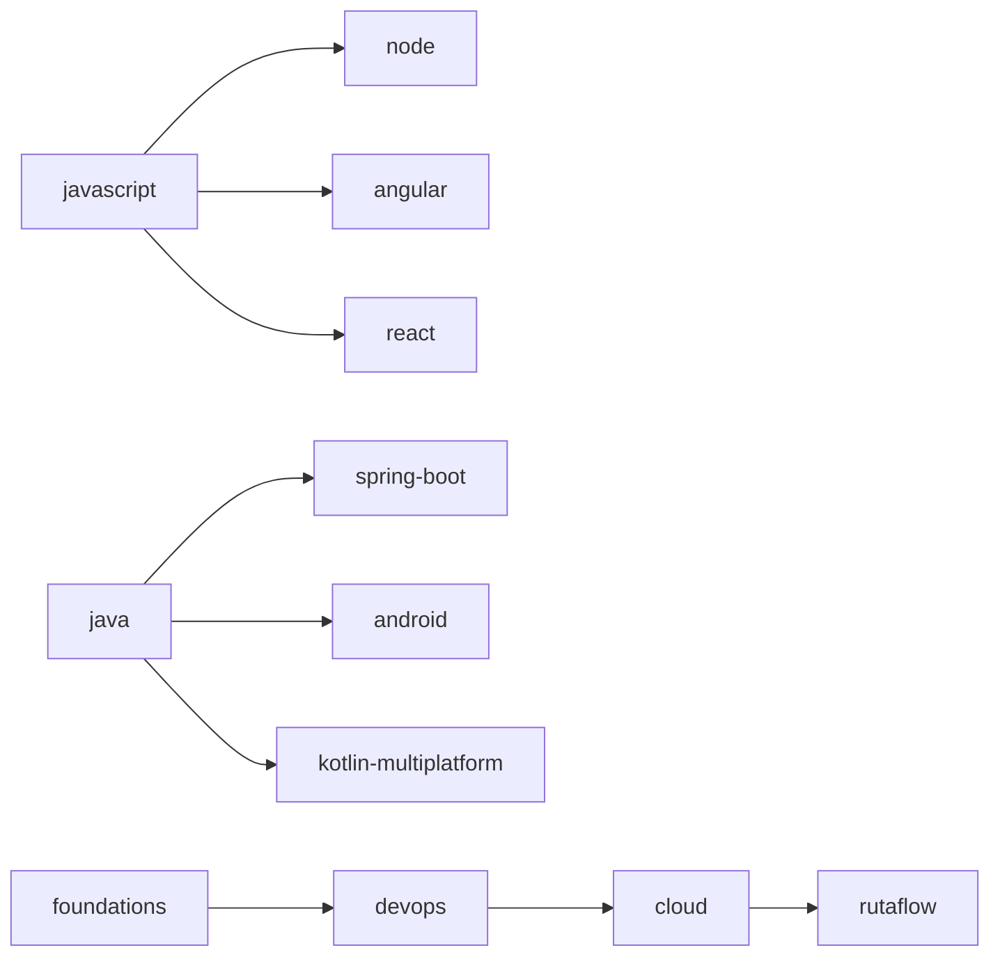

# Grafo de prerrequisitos

Este inventario representa el orden mínimo verificable. La secuencia automática no sustituye la revisión conceptual tema por tema.

## Dependencias entre libros

## Cobertura

| Track | Temas ordenados |
|---|---:|
| foundations | 50 |
| javascript | 83 |
| java | 59 |
| node | 68 |
| spring-boot | 58 |
| angular | 61 |
| react | 55 |
| kotlin-multiplatform | 46 |
| android | 49 |
| ios | 51 |
| flutter | 57 |
| devops | 91 |
| cloud | 153 |
| rutaflow | 24 |

**Total:** 905 temas.
