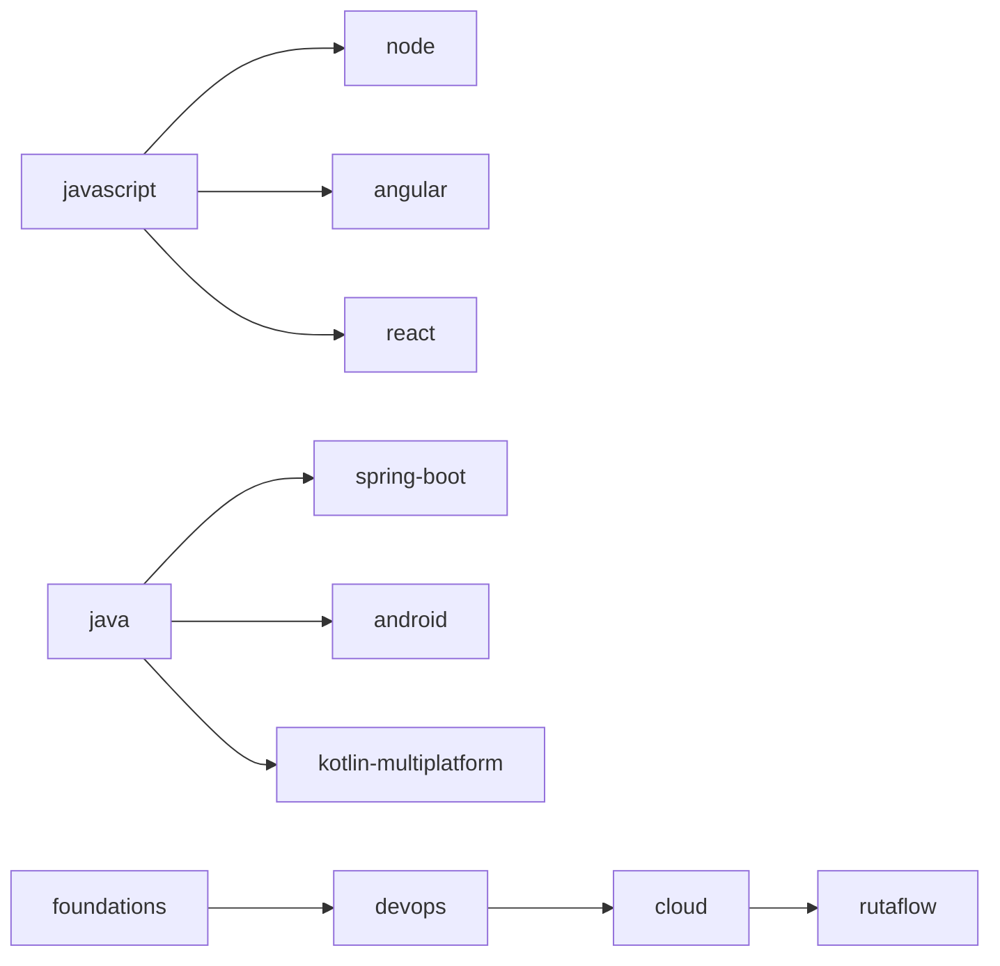

# Grafo de prerrequisitos

Este inventario representa el orden mínimo verificable. La secuencia automática no sustituye la revisión conceptual tema por tema.

## Dependencias entre libros

```mermaid
flowchart LR
  javascript["javascript"] --> node["node"]
  java["java"] --> spring_boot["spring-boot"]
  javascript["javascript"] --> angular["angular"]
  javascript["javascript"] --> react["react"]
  java["java"] --> android["android"]
  java["java"] --> kotlin_multiplatform["kotlin-multiplatform"]
  foundations["foundations"] --> devops["devops"]
  devops["devops"] --> cloud["cloud"]
  cloud["cloud"] --> rutaflow["rutaflow"]
```

## Cobertura

| Track | Temas ordenados |
|---|---:|
| foundations | 50 |
| javascript | 83 |
| java | 64 |
| node | 69 |
| spring-boot | 62 |
| angular | 63 |
| react | 55 |
| kotlin-multiplatform | 54 |
| android | 50 |
| ios | 51 |
| flutter | 57 |
| devops | 92 |
| cloud | 154 |
| rutaflow | 24 |

**Total:** 928 temas.
