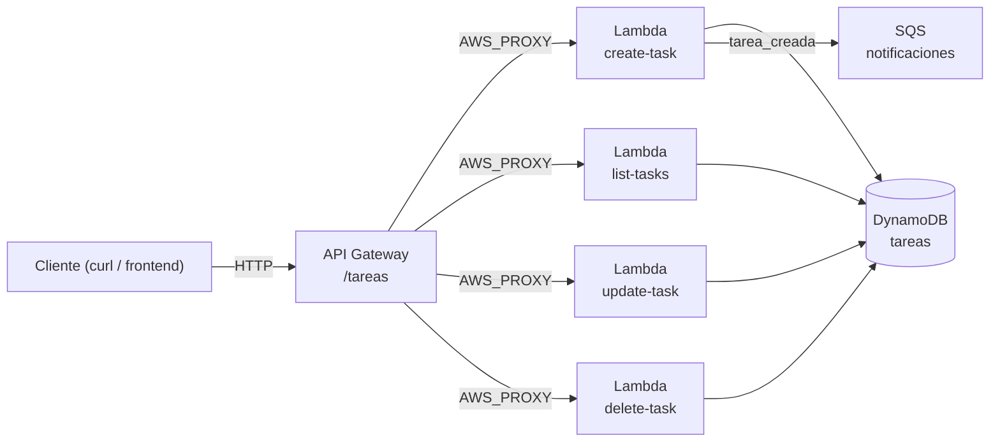

# Sistema de Gestión de Tareas — implementación de referencia (Módulo 9)

Esta carpeta es una implementación completa y funcional del proyecto integrador
del Módulo 9, para **consultar después de intentarlo tú mismo** — no para
copiar como punto de partida. Si todavía no completaste el Módulo 9, ciérrala
y vuelve cuando ya hayas construido tu propia versión y quieras comparar
decisiones de diseño.

## Qué incluye

- **`backend/lambda/`** — 4 funciones Lambda (Node.js) con integración proxy
  de API Gateway: `create-task.js`, `list-tasks.js`, `update-task.js`,
  `delete-task.js`. CRUD completo sobre DynamoDB, con notificación a SQS al
  crear una tarea.
- **`infra/terraform/`** — la misma arquitectura completa como código:
  tabla DynamoDB, bucket S3 (adjuntos), cola SQS, rol IAM de mínimo
  privilegio, las 4 Lambdas empaquetadas automáticamente, y una API REST
  completa (`GET/POST /tareas`, `PUT/DELETE /tareas/{id}`).
- **`infra/cloudformation/stack.yaml`** — la misma infraestructura en
  CloudFormation, para comparar ambos enfoques de IaC (ver Módulo 15).
- **`ci-cd/github-actions/deploy.yml`** — pipeline que levanta Floci como
  servicio del propio job, despliega con Terraform, corre una prueba de humo
  real contra la API, y destruye todo al final.

## Arquitectura



## Cómo desplegarlo contra Floci

```bash
# 1. Levanta Floci
floci start
eval $(floci env)

# 2. Instala las dependencias del backend
cd examples/project-final/backend
npm install

# 3. Despliega la infraestructura con Terraform
cd ../infra/terraform
terraform init
terraform apply

# 4. Prueba la API desplegada
API_URL=$(terraform output -raw api_invoke_url)
curl -X POST "$API_URL/tareas" \
  -H "Content-Type: application/json" \
  -d '{"titulo": "Mi primera tarea"}'
curl "$API_URL/tareas"

# 5. Limpieza
terraform destroy
```

Con CloudFormation en vez de Terraform:

```bash
aws cloudformation deploy \
  --template-file ../cloudformation/stack.yaml \
  --stack-name gestor-tareas \
  --capabilities CAPABILITY_NAMED_IAM \
  --endpoint-url http://localhost:4566
```

## Decisiones de diseño que vale la pena comparar con tu propia versión

- **`Scan` con filtro en `list-tasks.js`**, no `Query`: la tabla no tiene un
  índice secundario sobre `estado`. Si tu versión lo tiene (GSI, Módulo 4),
  tu `list-tasks` puede ser más eficiente que esta referencia a partir de
  cierto volumen de datos.
- **Validación mínima**, no exhaustiva: solo se valida lo estrictamente
  necesario para no romper DynamoDB. Una versión de producción real
  validaría longitud de campos, caracteres permitidos, etc.
- **IAM de mínimo privilegio**: el rol de las Lambdas solo tiene los verbos
  de DynamoDB y SQS que realmente usa, no `dynamodb:*` — compáralo con el
  Módulo 7.
- **`ConditionExpression: attribute_exists(id)`** en `update-task.js`: evita
  crear silenciosamente una tarea nueva al "actualizar" un id que no existe
  (comportamiento por defecto de `UpdateItem` sin esa condición).
