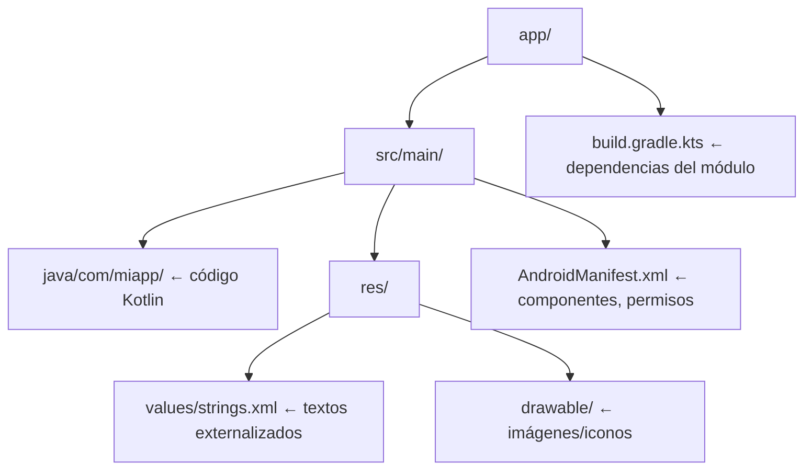
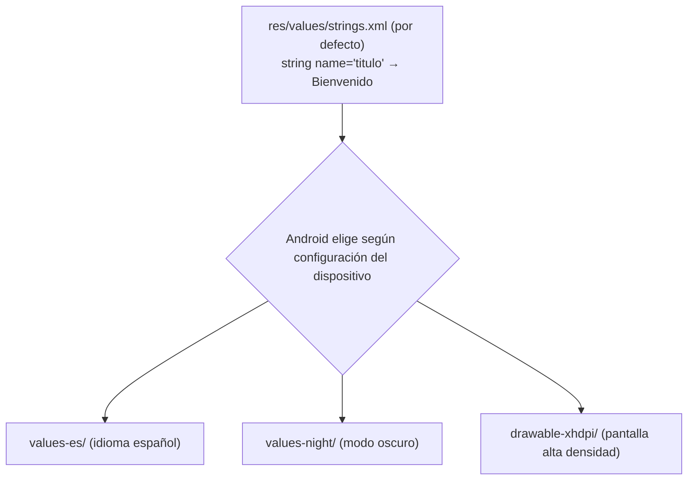
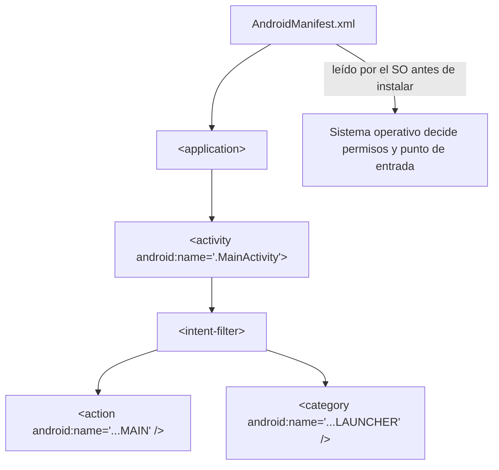

# Módulo 0: Kotlin aplicado a Android


## Antes de comenzar: instala Android Studio y un dispositivo de prueba

No necesitas un teléfono Android. Android Studio incluye el SDK, Gradle y un emulador. Descarga la versión estable desde [developer.android.com/studio](https://developer.android.com/studio) y conserva las opciones recomendadas del asistente.

- **Windows:** activa la virtualización en BIOS/UEFI; Android Studio puede solicitar Windows Hypervisor Platform. Evita carpetas de proyecto sincronizadas por OneDrive.
- **macOS:** elige la descarga para Apple Silicon o Intel según tu Mac. En Apple Silicon usa imágenes de emulador ARM64.
- **Linux:** instala los paquetes de virtualización/KVM de tu distribución, agrega tu usuario al grupo `kvm` y reinicia sesión.

En **SDK Manager** instala Android SDK Platform, Build-Tools y Platform-Tools. En **Device Manager** crea un dispositivo Pixel con una imagen estable. Crea un proyecto **Empty Activity**, Kotlin y Jetpack Compose; espera a que termine "Gradle Sync" y pulsa Run.

Comprueba también la terminal integrada:

```bash
./gradlew tasks          # macOS/Linux (invoca Gradle vía el wrapper)
.\gradlew.bat tasks      # Windows
adb devices
```

El emulador debe aparecer como `device`. Si figura `unauthorized`, acepta el diálogo del dispositivo; si no aparece, reinicia ADB desde Device Manager. La primera sincronización puede tardar porque descarga dependencias: no la canceles mientras haya actividad de red.

## Aprende construyendo

### Tema 1: Estructura de un proyecto Android Studio

#### Paso 1 · Objetivo y preparación

Al finalizar podrás ubicar dónde vive el código, los recursos y la configuración de build de cualquier proyecto Android, y explicar por qué esa separación existe.

**Conocimiento previo:** Kotlin básico (funciones, clases); ninguna experiencia previa en Android requerida.

#### Paso 2 · Contexto y caso real

**¿Por qué es importante?** Entender esta estructura desde el primer módulo evita la confusión común de "dónde va cada cosa" que ralentiza a cualquier desarrollador nuevo en Android, y prepara el terreno para conceptos posteriores (recursos localizados, módulos Gradle separados por feature) que dependen directamente de esta organización.

#### Paso 3 · Teoría con analogía

**Conceptos clave:** separación entre código, recursos y configuración de build.

Un proyecto Android Studio organiza el código Kotlin bajo `app/src/main/java/com/miapp/`, los recursos (textos, imágenes, dimensiones, colores) bajo `app/src/main/res/`, y la configuración de build bajo archivos `build.gradle.kts`. Esta separación permite que el sistema de recursos (`res/`) seleccione automáticamente el recurso correcto según idioma, tamaño de pantalla o modo claro/oscuro, sin lógica condicional explícita en Kotlin. El archivo `build.gradle.kts` de cada módulo declara sus dependencias y configuración de compilación; Gradle lee estos archivos y construye un grafo de dependencias completo antes de compilar, de forma conceptualmente similar a un proyecto Java multi-módulo (track Java, Módulo 9).

**Analogía:** la estructura de un proyecto Android es como los planos de un edificio: una carpeta para la estructura (código), otra para el mobiliario (recursos), y un documento de especificaciones (Gradle) que define qué materiales usar, todo separado para que un electricista no revise los planos de plomería.

**Diagrama:**



#### Paso 4 · Demostración guiada desde cero

Desde una carpeta vacía, crea un proyecto nuevo con la plantilla **Empty Activity** (Kotlin + Compose) desde Android Studio, llamado `academia-android`, e inspecciona su estructura real (`app/src/main/`) desde la terminal integrada:

```bash
mkdir -p academia-android
cd academia-android
# (genera el proyecto "Empty Activity" con Android Studio dentro de esta carpeta)
find app/src/main -maxdepth 3 -type d
cat app/build.gradle.kts | grep -A3 "^android {"
```

**Explicación línea por línea:** `find app/src/main -maxdepth 3 -type d` lista los directorios reales generados por la plantilla (`java/`, `res/values`, `res/drawable`), confirmando visualmente la separación código/recursos que describe el Paso 3; el `grep` sobre `build.gradle.kts` muestra el bloque `android { ... }` que declara la configuración de compilación del módulo `:app`.

Confirma que el string de bienvenida y el nombre de la app viven en `res/`, no hardcodeados en el código Kotlin:

```bash
grep -rn "app_name" app/src/main/res/values/strings.xml
grep -n "app_name\|ic_launcher" app/src/main/AndroidManifest.xml
```

**Resultado esperado:** `strings.xml` contiene la entrada `app_name` con el nombre de la app como texto; `AndroidManifest.xml` referencia ese mismo string vía `@string/app_name` y el ícono vía `@mipmap/ic_launcher`, nunca como literales hardcodeados dentro del manifiesto.

**Fallo deliberado:** busca el texto literal del nombre de la app directamente dentro de cualquier archivo `.kt` del proyecto (`grep -rn "MiAplicacion" app/src/main/java/`, sustituyendo por el nombre real que le diste al proyecto). No debería encontrarse ninguna coincidencia — diagnostica confirmando que Android Studio, al generar el proyecto, ya externaliza el nombre a `res/values/strings.xml` y lo referencia por recurso (`@string/app_name`), nunca como literal directo en el código Kotlin.

#### Paso 5 · Práctica guiada

Ejecuta `find app/src/main/res -type d` y para cada carpeta que veas (`values/`, `drawable/`, `mipmap-*/`, `layout/` si existe), escribe en una línea qué tipo de recurso contiene. **Pista:** el nombre de la carpeta (`drawable`, `values`, `mipmap`) generalmente describe directamente el tipo de recurso que contiene.

#### Paso 6 · Práctica independiente

Agrega un nuevo recurso de color en `app/src/main/res/values/colors.xml` (créalo si no existe) y úsalo desde el `MainActivity.kt` generado por la plantilla, confirmando con `grep` que el color se referencia por nombre de recurso (`R.color.tu_color`), no como un valor hexadecimal hardcodeado en Kotlin.

#### Paso 7 · Cierre y evidencia

Ya ubicas con confianza dónde vive el código, los recursos y la configuración de build de cualquier proyecto Android. El siguiente tema profundiza específicamente en cómo y por qué externalizar recursos de texto. **Evidencia:** entrega el resultado del `grep` confirmando que `app_name` vive en `strings.xml` y no como literal en ningún archivo `.kt`, y explica por qué esa ausencia es la señal de una externalización correcta. Fuente oficial: [Android Developers — App resources overview](https://developer.android.com/guide/topics/resources/providing-resources).

**Errores comunes:** escribir código Kotlin directamente dentro de `res/` por error de ubicación; modificar `AndroidManifest.xml` sin sincronizar Gradle después, dejando cambios sin aplicar realmente al build.

**Cuándo no usarlo:** para un prototipo desechable de un único archivo sin intención de mantenerlo ni traducirlo, seguir esta estructura completa con múltiples módulos Gradle es una sobre-ingeniería; la plantilla mínima de un solo módulo `:app` es suficiente en ese caso.

### Tema 2: Recursos externalizados

#### Paso 1 · Objetivo y preparación

Al finalizar podrás externalizar un texto a `strings.xml` y explicar cómo Android resuelve automáticamente variantes por idioma, tema y densidad de pantalla.

**Conocimiento previo:** Tema 1 de este módulo.

#### Paso 2 · Contexto y caso real

**¿Por qué es importante?** Externalizar recursos evita duplicación de texto, habilita traducción sin tocar código Kotlin, y permite que Android resuelva automáticamente variantes (idioma, modo oscuro, densidad de pantalla) según la configuración del dispositivo del usuario.

#### Paso 3 · Teoría con analogía

**Conceptos clave:** una fuente de verdad por texto/valor, selección automática según configuración del dispositivo.

Externalizar un string a `res/values/strings.xml` en vez de escribirlo como literal (`Text("Bienvenido")`) permite traducir la app agregando `res/values-es/strings.xml` sin tocar el código Kotlin, y centraliza cada texto en una única fuente de verdad. Este mismo mecanismo se extiende a `res/values-night/` (modo oscuro) y calificadores de densidad (`drawable-hdpi/`, `drawable-xhdpi/`), todo resuelto automáticamente en tiempo de ejecución.

**Analogía:** externalizar strings es como tener un único directorio telefónico central en vez de que cada empleado memorice individualmente los números: actualizar un número se hace en un solo lugar, y cualquiera que lo consulte obtiene el valor correcto.

**Diagrama:**



#### Paso 4 · Demostración guiada desde cero

Reutiliza `academia-android` (Tema 1; si partes de una carpeta vacía nueva, créala primero con `mkdir -p academia-android`) y crea, dentro de `app/src/main/res/`, un string nuevo y su traducción al inglés:

```bash
cd academia-android
mkdir -p app/src/main/res/values-en
cat >> app/src/main/res/values/strings.xml <<'EOF'
<!-- agregado manualmente para este ejercicio, dentro del bloque <resources> existente -->
EOF
cat > app/src/main/res/values-en/strings.xml <<'EOF'
<?xml version="1.0" encoding="utf-8"?>
<resources>
    <string name="titulo_bienvenida">Welcome</string>
</resources>
EOF
# python valida que el XML generado es válido antes de continuar
python3 -c "
import xml.etree.ElementTree as ET
ET.parse('app/src/main/res/values-en/strings.xml')
print('values-en/strings.xml es XML bien formado')
"
```

**Explicación línea por línea:** `values-en/strings.xml` provee la traducción al inglés bajo el mismo nombre de recurso (`titulo_bienvenida`); Android selecciona automáticamente este archivo en vez de `values/strings.xml` (español, por defecto) cuando el idioma del dispositivo está configurado en inglés, sin ningún cambio de código Kotlin.

Confirma que ambos archivos definen la misma clave de recurso, condición necesaria para que la resolución automática funcione:

```bash
python3 -c "
import xml.etree.ElementTree as ET
es = {s.get('name') for s in ET.parse('app/src/main/res/values/strings.xml').getroot()}
en = {s.get('name') for s in ET.parse('app/src/main/res/values-en/strings.xml').getroot()}
print('claves solo en español:', es - en)
print('claves solo en inglés:', en - es)
print('claves compartidas:', es & en)
"
```

**Resultado esperado:** `titulo_bienvenida` aparece en la intersección de claves compartidas entre ambos archivos; ninguna clave debería existir solo en un idioma sin su contraparte, porque eso dejaría un texto sin traducir cuando el dispositivo cambie de idioma.

**Fallo deliberado:** agrega una clave nueva (`<string name="solo_en_espanol">Texto</string>`) únicamente en `values/strings.xml`, sin agregarla también en `values-en/strings.xml`, y repite la comparación de claves. Aparece en "claves solo en español" — diagnostica confirmando que un dispositivo configurado en inglés mostraría, para esa clave específica, el string por defecto (español) como respaldo, no un error, pero rompiendo la consistencia de traducción esperada por el usuario.

#### Paso 5 · Práctica guiada

Agrega `res/values-night/colors.xml` con un color de fondo oscuro para la misma clave (`color_fondo`) que ya exista en `values/colors.xml`, y confirma con el mismo script de comparación de claves que ambos archivos comparten la clave. **Pista:** el sufijo `-night` sigue exactamente la misma convención de calificador que `-es`/`-en` para idioma.

#### Paso 6 · Práctica independiente

Agrega un tercer idioma (`values-pt/strings.xml`, portugués) con la traducción de `titulo_bienvenida`, y confirma con el script de comparación que las tres versiones (español, inglés, portugués) comparten exactamente la misma clave.

#### Paso 7 · Cierre y evidencia

Ya externalizas textos y confirmas programáticamente que las traducciones mantienen las mismas claves de recurso. El siguiente tema cubre el manifiesto que declara los componentes de la app ante el sistema operativo. **Evidencia:** entrega el resultado de la comparación de claves mostrando `titulo_bienvenida` compartida entre español e inglés, y explica qué pasaría si una clave faltara en un idioma. Fuente oficial: [Android Developers — Localization](https://developer.android.com/guide/topics/resources/localization).

**Errores comunes:** agregar una traducción nueva sin mantener la misma clave exacta que la versión por defecto, rompiendo la resolución automática; hardcodear un string directamente en un composable "solo por ahora" y olvidar externalizarlo después.

**Cuándo no usarlo:** para una app interna de un solo idioma sin ninguna intención de traducirse ni de soportar modo oscuro distinto, externalizar cada valor a calificadores múltiples aporta menos valor inmediato, aunque sigue siendo buena práctica para el string en sí.

### Tema 3: AndroidManifest.xml y módulos Gradle

#### Paso 1 · Objetivo y preparación

Al finalizar podrás declarar un componente y un permiso en el manifiesto, y dividir un proyecto en módulos Gradle con una dependencia explícita entre ellos.

**Conocimiento previo:** Temas 1 y 2 de este módulo.

#### Paso 2 · Contexto y caso real

**¿Por qué es importante?** El manifiesto es el contrato que el sistema operativo lee antes de instalar o ejecutar la app; los módulos Gradle establecen límites explícitos de compilación que se vuelven cada vez más valiosos a medida que el proyecto crece.

#### Paso 3 · Teoría con analogía

**Conceptos clave:** contrato entre la app y el sistema operativo, declarado antes de instalar.

El `AndroidManifest.xml` declara qué componentes existen (Activities, Services), el punto de entrada (`intent-filter` con `MAIN`/`LAUNCHER`), y qué permisos requiere la app, permitiendo que el sistema operativo tome decisiones de seguridad sin ejecutar código de la app primero. Un proyecto Gradle multi-módulo divide la app en unidades de compilación independientes (`:app`, `:core`); `implementation(project(":core"))` en `:app/build.gradle.kts` establece esa dependencia, forzando límites explícitos y permitiendo compilaciones incrementales más rápidas.

**Analogía:** el AndroidManifest.xml es como el formulario de aduana que se completa antes de que un envío cruce la frontera: declara de antemano qué contiene el paquete y qué permisos especiales necesita, permitiendo que la aduana tome decisiones antes de que el contenido llegue a destino.

**Diagrama:**



#### Paso 4 · Demostración guiada desde cero

Reutiliza `academia-android` (o créalo desde una carpeta vacía con `mkdir -p academia-android` si es tu primera vez en este módulo) y crea un módulo Gradle nuevo `:core` con una dependencia explícita desde `:app`:

```bash
cd academia-android
mkdir -p core/src/main/kotlin/com/academia/core
cat > core/build.gradle.kts <<'EOF'
plugins { id("org.jetbrains.kotlin.jvm") }
EOF
cat > core/src/main/kotlin/com/academia/core/Formateador.kt <<'EOF'
package com.academia.core
fun formatearBienvenida(nombre: String): String = "Bienvenido, $nombre"
EOF
cat > settings.gradle.kts.fragmento <<'EOF'
include(":app", ":core")
EOF
grep -q 'implementation(project(":core"))' app/build.gradle.kts || \
  echo 'implementation(project(":core"))' >> app/build.gradle.kts
grep -n "project(\":core\")" app/build.gradle.kts
```

**Explicación línea por línea:** `core/build.gradle.kts` declara el módulo `:core` como un módulo Kotlin puro (sin dependencias de Android), conteniendo lógica reutilizable (`formatearBienvenida`); agregar `implementation(project(":core"))` en `app/build.gradle.kts` establece que `:app` depende de `:core`, permitiendo que Gradle compile `:core` primero y lo ponga a disposición de `:app`.

Confirma que el grafo de dependencias declarado coincide con la estructura de carpetas real creada:

```bash
find core/src -name "*.kt"
grep -c "project(\":core\")" app/build.gradle.kts
echo "gradle compilaría :core antes que :app por esta dependencia declarada"
```

**Resultado esperado:** `core/src/main/kotlin/com/academia/core/Formateador.kt` existe con la función `formatearBienvenida`; `app/build.gradle.kts` contiene exactamente una línea con `project(":core")`, confirmando la dependencia declarada que Gradle usará para determinar el orden de compilación.

**Fallo deliberado:** intenta usar `formatearBienvenida` desde un archivo dentro de `core/` importando algo del propio módulo `:app` (una dependencia inversa, de `:core` hacia `:app`). Esto crearía una dependencia circular — diagnostica revisando que `core/build.gradle.kts` nunca declara `implementation(project(":app"))`: un módulo de bajo nivel como `:core` no debe depender de un módulo de más alto nivel como `:app`, exactamente la misma regla de dependencias en una sola dirección que evita ciclos de compilación imposibles de resolver.

#### Paso 5 · Práctica guiada

Agrega el permiso `INTERNET` al `AndroidManifest.xml` (`<uses-permission android:name="android.permission.INTERNET" />`) y confirma con `grep` que aparece declarado antes del bloque `<application>`. **Pista:** los permisos se declaran como elementos hermanos de `<application>`, no anidados dentro de ella.

#### Paso 6 · Práctica independiente

Agrega una segunda función a `core/src/main/kotlin/com/academia/core/Formateador.kt` y úsala desde `MainActivity.kt` en `:app`, confirmando visualmente que el import (`import com.academia.core.NombreDeLaFuncion`) referencia correctamente el paquete del módulo `:core`.

#### Paso 7 · Cierre y evidencia

Ya declaras componentes y permisos en el manifiesto, y divides un proyecto en módulos Gradle con dependencias explícitas y unidireccionales. El siguiente módulo del track construye sobre esta base con Jetpack Compose y estado. **Evidencia:** entrega el resultado confirmando la línea `project(":core")` en `app/build.gradle.kts`, y explica por qué `:core` nunca debe depender de `:app` en sentido inverso. Fuente oficial: [Android Developers — App manifest overview](https://developer.android.com/guide/topics/manifest/manifest-intro).

**Errores comunes:** declarar un componente `exported="true"` sin necesidad real, exponiendo innecesariamente esa Activity a otras apps; crear una dependencia circular entre módulos de distinto nivel de abstracción.

**Cuándo no usarlo:** para un proyecto de un solo módulo pequeño sin ninguna intención de escalar en equipo o funcionalidades, dividir en `:app`/`:core` desde el día uno puede ser una sobre-ingeniería prematura; la modularización aporta valor claramente a partir de cierto tamaño y número de personas trabajando en paralelo.

---

## Ruta de proyecto progresivo desde carpeta vacía

No crees un proyecto desechable por módulo. Conserva un único repositorio que evoluciona durante todo el track y etiqueta cada hito (`git tag modulo-N`). Empieza con crea una carpeta vacía `academia-android`, abre Android Studio y genera allí un proyecto **Empty Activity**; luego ejecuta `git init`. Ejecuta el comando paso a paso, inspecciona los archivos generados y registra versiones y precondiciones en el README.

| Hito | Evolución acumulativa | Evidencia antes de avanzar |
|---|---|---|
| Base | Compose, estado y navegación. | Arranque reproducible, commit limpio y prueba mínima. |
| Aplicación | red, Room y trabajo en background. | Casos normales, límite y error automatizados. |
| Integración | Conecta capas y reemplaza dobles por infraestructura controlada. | Diagrama, contratos y prueba de integración. |
| Experto | testing, seguridad y publicación. | Perfil o threat model, telemetría y runbook de recuperación. |

Al iniciar cada laboratorio crea una rama `modulo-N`, implementa el incremento, verifica el criterio de éxito y fusiona solo con pruebas verdes. Si un módulo necesita un experimento aislado, colócalo en `experiments/modulo-N/`; el producto acumulativo permanece ejecutable. Al terminar, otra persona debe poder clonar el repositorio y reproducir el último hito siguiendo únicamente el README.


## Laboratorio práctico

**Objetivo del laboratorio:** crear un proyecto Android nuevo corriendo en un emulador con un recurso propio.

**Requisitos previos:** Android Studio instalado, un emulador configurado.

| Paso | Acción | Código/Comando | Explicación |
|---|---|---|---|
| 1 | Crear un proyecto nuevo con plantilla "Empty Activity" | Android Studio → New Project | Base mínima funcional |
| 2 | Ejecutar en un emulador | Run ▶ | Verifica que el entorno funciona |
| 3 | Agregar un string y usarlo desde un composable | Ver Tema 2 | En vez de hardcodear texto |
| 4 | Modificar ícono y nombre en el manifiesto | Ver Tema 3 | `android:icon`, `android:label` |
| 5 | Agregar un módulo Gradle nuevo y una dependencia | Ver Tema 3 | `:core` dependido por `:app` |

**Verificación:** el laboratorio se considera exitoso si la app corre en el emulador mostrando un texto leído desde `strings.xml` (no hardcodeado), y si el proyecto compila correctamente con el módulo `:core` agregado y referenciado desde `:app`.

**Errores comunes y soluciones**

- **Hardcodear texto directamente en el composable.** Externalízalo a `strings.xml` desde el principio, incluso en un proyecto pequeño.
- **Olvidar sincronizar Gradle tras agregar un módulo nuevo.** Ejecuta "Sync Project with Gradle Files" tras cualquier cambio en `build.gradle.kts`.
- **No declarar el `intent-filter` de `MAIN`/`LAUNCHER`.** Sin él, la Activity no aparece como punto de entrada en el launcher del dispositivo.

---
