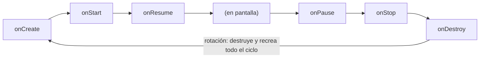

# Módulo 1: Ciclo de vida: Activities y ViewModel


## Aprende construyendo

### Tema 1: Ciclo de vida de una Activity

#### Paso 1 · Objetivo y preparación

Al finalizar podrás predecir en qué callback específico del ciclo de vida es seguro iniciar o liberar un recurso costoso, y explicar por qué el estado simple se pierde al rotar.

**Conocimiento previo:** Módulo 0 de este track (estructura de un proyecto Android).

#### Paso 2 · Contexto y caso real

**¿Por qué es importante?** Conocer el orden exacto del ciclo de vida determina cuándo es seguro iniciar o liberar recursos costosos, y entender que una rotación destruye y recrea la Activity por defecto explica por qué el estado simple se pierde al rotar, motivando la necesidad de `ViewModel` (Tema 2).

#### Paso 3 · Teoría con analogía

**Conceptos clave:** callbacks predecibles, destrucción y recreación por defecto al rotar.

Cada Activity atraviesa una secuencia predecible de callbacks: `onCreate` se ejecuta una única vez al crearse la instancia, `onStart`/`onResume` marcan que se vuelve visible e interactiva, y `onPause`/`onStop`/`onDestroy` marcan la secuencia inversa. Iniciar una cámara en `onResume` y liberarla en `onPause` es el patrón correcto; hacerlo en `onCreate`/`onDestroy` dejaría la cámara activa innecesariamente en background. Por defecto, Android destruye y recrea completamente la Activity al rotar, por lo que cualquier variable en memoria (`var contador by remember { mutableStateOf(0) }` sin persistencia adicional) se pierde por completo en ese proceso.

**Analogía:** el ciclo de vida de una Activity es como el protocolo de apertura y cierre de una tienda física: hay un orden fijo para abrir y otro para cerrar, y ciertas operaciones (como activar la alarma) solo tienen sentido en un punto específico de esa secuencia.

**Diagrama:**



#### Paso 4 · Demostración guiada desde cero

Desde una carpeta vacía (o continuando en `academia-android` del Módulo 0), crea `app/src/main/kotlin/com/academia/android/PantallaCicloDeVida.kt` registrando cada callback en el log para observar el orden real:

```bash
# compila con Gradle el archivo Kotlin generado a continuación
mkdir -p academia-android/app/src/main/kotlin/com/academia/android
cd academia-android
cat > app/src/main/kotlin/com/academia/android/MainActivity.kt <<'EOF'
package com.academia.android

import android.os.Bundle
import android.util.Log
import androidx.activity.ComponentActivity

private const val ETIQUETA = "CicloDeVida"

class MainActivity : ComponentActivity() {
    override fun onCreate(savedInstanceState: Bundle?) {
        super.onCreate(savedInstanceState)
        Log.d(ETIQUETA, "onCreate")
    }
    override fun onStart() { super.onStart(); Log.d(ETIQUETA, "onStart") }
    override fun onResume() { super.onResume(); Log.d(ETIQUETA, "onResume") }
    override fun onPause() { super.onPause(); Log.d(ETIQUETA, "onPause") }
    override fun onStop() { super.onStop(); Log.d(ETIQUETA, "onStop") }
    override fun onDestroy() { super.onDestroy(); Log.d(ETIQUETA, "onDestroy") }
}
EOF
grep -c "override fun on" app/src/main/kotlin/com/academia/android/MainActivity.kt
./gradlew :app:compileDebugKotlin
```

`gradlew` (el "Gradle Wrapper") es el script que descarga y ejecuta la versión exacta de Gradle que el proyecto necesita, sin instalación global.

**Explicación línea por línea:** cada método sobrescrito (`onCreate`, `onStart`, `onResume`, `onPause`, `onStop`, `onDestroy`) llama primero a `super.on...()` (obligatorio, o el sistema lanza una excepción) y luego registra su propio nombre en el log, permitiendo observar el orden exacto en que Android los invoca al ejecutar la app y al rotar la pantalla.

Ejecuta la app en el emulador (Módulo 0), gira la pantalla, y filtra el log por la etiqueta para observar la secuencia real:

```bash
adb logcat -s CicloDeVida:D
```

`adb` es el comando (Android Debug Bridge) que se comunica con el emulador o dispositivo conectado; `logcat` es su subcomando para leer el log del sistema.

**Resultado esperado:** al lanzar la app aparecen en orden `onCreate`, `onStart`, `onResume`; al rotar la pantalla aparece la secuencia completa `onPause`, `onStop`, `onDestroy` seguida inmediatamente de `onCreate`, `onStart`, `onResume` de nuevo, confirmando la destrucción y recreación completa de la Activity, exactamente como describe el diagrama del Paso 3.

**Fallo deliberado:** agrega una variable `var contador = 0` como propiedad de la clase `MainActivity`, increméntala en algún punto (simulado, sin UI), y añade un `Log.d(ETIQUETA, "contador=$contador")` dentro de `onPause`. Rota la pantalla y revisa el log tras la recreación: el valor vuelve a `0` en el nuevo `onCreate`, no conserva el incremento anterior — diagnostica confirmando que una variable en memoria dentro de la Activity no sobrevive a la destrucción y recreación completa que ocurre al rotar, exactamente el problema que motiva usar `ViewModel` en el Tema 2.

#### Paso 5 · Práctica guiada

Agrega `Log.d(ETIQUETA, "onCreate: savedInstanceState es ${if (savedInstanceState == null) "null (primera vez)" else "no null (recreación)"}")` dentro de `onCreate`, y confirma en el log que la primera ejecución muestra `null` y que tras rotar muestra `no null`. **Pista:** `savedInstanceState` es la señal que el propio sistema operativo da para distinguir una creación nueva de una recreación.

#### Paso 6 · Práctica independiente

Identifica en tu propia app un recurso que debería iniciarse en `onResume` y liberarse en `onPause` (por ejemplo, un sensor o una suscripción a ubicación), y documenta en una línea por qué iniciarlo en `onCreate` sería incorrecto.

#### Paso 7 · Cierre y evidencia

Ya predices en qué callback específico es seguro iniciar o liberar un recurso, y confirmaste que el estado simple se pierde al rotar. El siguiente tema resuelve exactamente ese problema con `ViewModel`. **Evidencia:** entrega el resultado del log mostrando la secuencia completa de destrucción y recreación al rotar, y explica por qué el contador de la Activity vuelve a cero tras ese proceso. Fuente oficial: [Android Developers — Activity lifecycle](https://developer.android.com/guide/components/activities/activity-lifecycle).

**Errores comunes:** olvidar llamar a `super.onX()` dentro de un callback sobrescrito, lo que provoca una excepción en tiempo de ejecución; iniciar un recurso costoso en `onCreate` en vez de `onResume`, dejándolo activo innecesariamente en background.

**Cuándo no usarlo:** para una pantalla puramente estática sin ningún recurso que iniciar/liberar ni estado que preservar, instrumentar todos los callbacks del ciclo de vida con logs es ruido innecesario; resérvalo para pantallas con lógica sensible al ciclo de vida.

### Tema 2: ViewModel sobrevive a la rotación

#### Paso 1 · Objetivo y preparación

Al finalizar podrás mover un estado a un `ViewModel` y confirmar que sobrevive a una rotación de pantalla, a diferencia del estado simple del Tema 1.

**Conocimiento previo:** Tema 1 de este módulo.

#### Paso 2 · Contexto y caso real

**¿Por qué es importante?** Un `ViewModel` sobrevive a rotación porque Android preserva deliberadamente el `ViewModelStore` a través de recreaciones por cambio de configuración, pero no sobrevive a que el sistema mate el proceso completo por falta de memoria, un escenario más agresivo que requiere una capa adicional de persistencia (Tema 3).

#### Paso 3 · Teoría con analogía

**Conceptos clave:** vinculado al `ViewModelStore`, no al ciclo de vida de la Activity individual.

Un `ViewModel` está vinculado al `ViewModelStore` de la Activity, una estructura que Android preserva deliberadamente a través de una recreación por rotación, incluso mientras la Activity en sí se destruye y se crea una nueva: el sistema recupera la misma instancia de `ViewModel` desde ese `ViewModelStore` preservado, en vez de crear una nueva desde cero. Esta supervivencia tiene un límite: el `ViewModelStore` se destruye solo cuando la Activity se cierra "de verdad", pero si el sistema mata el proceso completo por falta de memoria, se pierde por completo junto con todo el proceso.

**Analogía:** un `ViewModel` es como el registro de un hotel que permanece en la recepción mientras un huésped cambia de habitación (rotación): la información no se pierde porque el registro nunca dependió de una habitación específica. Pero si el hotel completo se demuele (muerte del proceso), ese registro desaparece con el edificio.

**Diagrama:**

```
┌── Rotación ────────────────────────────────────────────┐
│ Activity destruida → recreada → ViewModelStore PRESERVADO   │
│ → misma instancia de ViewModel recuperada                       │
└─────────────────────────────────────────────────┘
┌── Muerte de proceso ─────────────────────────┐
│ TODO se destruye, incluyendo el ViewModelStore     │
└─────────────────────────────────────────┘
```

#### Paso 4 · Demostración guiada desde cero

Reutiliza `academia-android` (o créalo desde una carpeta vacía con `mkdir -p academia-android` si es tu primera vez) y crea `app/src/main/kotlin/com/academia/android/TareasViewModel.kt` moviendo el contador del Tema 1 a un `ViewModel`:

```bash
# compila con Gradle el archivo Kotlin generado a continuación
mkdir -p academia-android/app/src/main/kotlin/com/academia/android
cd academia-android
cat > app/src/main/kotlin/com/academia/android/TareasViewModel.kt <<'EOF'
package com.academia.android

import androidx.lifecycle.ViewModel
import kotlinx.coroutines.flow.MutableStateFlow
import kotlinx.coroutines.flow.asStateFlow

class TareasViewModel : ViewModel() {
    private val _contador = MutableStateFlow(0)
    val contador = _contador.asStateFlow()

    fun incrementar() {
        _contador.value++
    }
}
EOF
./gradlew :app:compileDebugKotlin
```

**Explicación línea por línea:** `TareasViewModel` extiende `ViewModel()`, vinculándola al `ViewModelStore` de la Activity que la solicite; `_contador` es un `MutableStateFlow` privado (mutable solo dentro de la clase) expuesto como `contador` de solo lectura (`asStateFlow()`), el mismo patrón de encapsulación de estado que ya viste con propiedades privadas en Kotlin/Java.

Simula, con un script, la diferencia de supervivencia entre una variable de Activity (Tema 1) y una variable de `ViewModel` ante una recreación (sin destruir el proceso):

```bash
python3 -c "
class ActivitySimulada:
    def __init__(self):
        self.contador = 0  # se reinicia en cada recreación
    def recrear(self):
        return ActivitySimulada()  # instancia nueva: estado perdido

class ViewModelStoreSimulado:
    def __init__(self):
        self.view_models = {}
    def obtener_o_crear(self, clave, fabrica):
        if clave not in self.view_models:
            self.view_models[clave] = fabrica()
        return self.view_models[clave]  # misma instancia: estado preservado

store = ViewModelStoreSimulado()
vm = store.obtener_o_crear('TareasViewModel', lambda: {'contador': 0})
vm['contador'] += 1
print('contador en ViewModel antes de rotar:', vm['contador'])
vm_tras_rotar = store.obtener_o_crear('TareasViewModel', lambda: {'contador': 0})
print('contador en ViewModel tras rotar (misma instancia):', vm_tras_rotar['contador'])
"
```

**Resultado esperado:** el script confirma que `vm_tras_rotar` es la misma instancia que `vm` (el `ViewModelStoreSimulado` no crea una nueva si la clave ya existe), por lo que el contador conserva su valor incrementado tras la "rotación" simulada, a diferencia de `ActivitySimulada.recrear()`, que crea una instancia completamente nueva con el contador reiniciado a cero.

**Fallo deliberado:** modifica el script para que `store.obtener_o_crear` ignore la caché y siempre ejecute `fabrica()` (creando una instancia nueva cada vez, sin importar si la clave ya existe). Ejecuta de nuevo — el contador tras "rotar" vuelve a `0` — diagnostica confirmando que la supervivencia del `ViewModel` depende enteramente de que el `ViewModelStore` real efectivamente reutilice la misma instancia en vez de crear una nueva; si esa reutilización fallara, el `ViewModel` se comportaría exactamente igual que el estado simple del Tema 1.

#### Paso 5 · Práctica guiada

Agrega una función `decrementar()` a `TareasViewModel` que nunca permita que `_contador.value` baje de cero, y escribe un script Python que simule llamar `decrementar()` dos veces desde cero, confirmando que el valor final es `0`, no negativo. **Pista:** usa `maxOf(0, _contador.value - 1)` como la lógica real en Kotlin.

#### Paso 6 · Práctica independiente

Agrega un segundo `StateFlow` a `TareasViewModel` (por ejemplo, `mensaje: StateFlow<String?>`) y documenta en una línea por qué ambos valores (`contador` y `mensaje`) sobreviven juntos a una rotación, siendo parte de la misma instancia preservada del `ViewModel`.

#### Paso 7 · Cierre y evidencia

Ya mueves estado a un `ViewModel` y confirmas por qué sobrevive a rotación gracias al `ViewModelStore` preservado. El siguiente tema cubre el escenario más agresivo en que ni siquiera el `ViewModel` sobrevive: la muerte del proceso. **Evidencia:** entrega el resultado de la simulación mostrando el contador preservado entre instancias del `ViewModelStore`, y el resultado del fallo al deshabilitar esa reutilización de instancia. Fuente oficial: [Android Developers — ViewModel overview](https://developer.android.com/topic/libraries/architecture/viewmodel).

**Errores comunes:** exponer el `MutableStateFlow` directamente en vez de su versión de solo lectura (`asStateFlow()`), permitiendo que cualquier consumidor externo modifique el estado sin pasar por la lógica del `ViewModel`; asumir incorrectamente que un `ViewModel` sobrevive a la muerte del proceso igual que a la rotación.

**Cuándo no usarlo:** para un estado puramente transitorio de UI que no tiene ningún valor si se pierde al rotar (por ejemplo, si un tooltip está momentáneamente visible), mantenerlo en `remember` simple es más simple y suficiente; no todo estado necesita la supervivencia de un `ViewModel`.

### Tema 3: SavedStateHandle

#### Paso 1 · Objetivo y preparación

Al finalizar podrás usar `SavedStateHandle` para persistir un valor que sobreviva incluso a la muerte del proceso, no solo a la rotación.

**Conocimiento previo:** Tema 2 de este módulo.

#### Paso 2 · Contexto y caso real

**¿Por qué es importante?** `SavedStateHandle` sobrevive a un escenario más agresivo (muerte completa del proceso) que un `ViewModel` normal (que solo sobrevive rotación), por lo que conviene reservarlo específicamente para datos pequeños que afectan la continuidad percibida por el usuario al reabrir la app.

#### Paso 3 · Teoría con analogía

**Conceptos clave:** persistencia adicional que sobrevive incluso a la muerte del proceso.

`SavedStateHandle` ofrece un nivel de supervivencia mayor que el `ViewModel` normal: persiste sus valores en un mecanismo del sistema que sobrevive incluso cuando el sistema mata el proceso completo por falta de memoria, restaurando esos valores automáticamente cuando el sistema recrea el proceso desde cero. Datos costosos de recalcular pero no críticos (una lista cacheada) pueden vivir solo en el `ViewModel` normal; datos pequeños que afectan la continuidad de la experiencia (qué filtro tenía seleccionado) son buenos candidatos para `SavedStateHandle`.

**Analogía:** `SavedStateHandle` es como una nota adhesiva que un huésped deja pegada en su propia maleta antes de salir del hotel: incluso si el hotel entero se demuele y se reconstruye, esa nota puede recuperarse y volver a colocarse en la maleta al regresar, a diferencia del registro completo de la recepción que sí se pierde con la demolición.

**Diagrama:**

```
┌── ViewModel normal ───────────────────────────────┐
│ sobrevive rotación,  NO sobrevive muerte de proceso    │
└───────────────────────────────────────────┘
┌── ViewModel + SavedStateHandle ────────────────────┐
│ sobrevive rotación,  SÍ sobrevive muerte de proceso     │
│ (solo para los valores explícitamente guardados en él)    │
└───────────────────────────────────────────┘
```

#### Paso 4 · Demostración guiada desde cero

Reutiliza `academia-android` (o créalo desde una carpeta vacía con `mkdir -p academia-android` si es tu primera vez en este módulo) y crea `app/src/main/kotlin/com/academia/android/TareasConFiltroViewModel.kt`, extendiendo el patrón del Tema 2 con `SavedStateHandle` para un valor de filtro:

```bash
# compila con Gradle el archivo Kotlin generado a continuación
mkdir -p academia-android/app/src/main/kotlin/com/academia/android
cd academia-android
cat > app/src/main/kotlin/com/academia/android/TareasConFiltroViewModel.kt <<'EOF'
package com.academia.android

import androidx.lifecycle.SavedStateHandle
import androidx.lifecycle.ViewModel

class TareasConFiltroViewModel(
    private val savedStateHandle: SavedStateHandle
) : ViewModel() {
    var filtro: String
        get() = savedStateHandle["filtro"] ?: ""
        set(value) {
            savedStateHandle["filtro"] = value
        }
}
EOF
./gradlew :app:compileDebugKotlin
```

**Explicación línea por línea:** `savedStateHandle["filtro"]` lee y escribe el valor a través del propio `SavedStateHandle` inyectado en el constructor, en vez de una variable normal de la clase; este mecanismo persiste el valor en un `Bundle` gestionado por el sistema que sobrevive incluso a la muerte del proceso, a diferencia de `_contador` del Tema 2.

Simula la diferencia de supervivencia entre un `ViewModel` normal y uno con `SavedStateHandle` ante una muerte de proceso (simulada como pérdida completa de la memoria del `ViewModelStore`, pero con un `Bundle` externo que sí persiste):

```bash
python3 -c "
class ProcesoAndroid:
    def __init__(self):
        self.view_model_store = {}       # se pierde por completo en muerte de proceso
        self.bundle_persistido = {}      # sobrevive a la muerte de proceso (SavedStateHandle)

    def matar_proceso(self):
        self.view_model_store = {}       # todo el ViewModelStore desaparece
        # el bundle_persistido NO se toca: representa el mecanismo del sistema que sí sobrevive

proceso = ProcesoAndroid()
proceso.view_model_store['contador'] = 5           # como el Tema 2, solo en memoria
proceso.bundle_persistido['filtro'] = 'pendientes' # como SavedStateHandle

proceso.matar_proceso()

print('contador tras muerte de proceso (ViewModel normal):', proceso.view_model_store.get('contador', 'PERDIDO'))
print('filtro tras muerte de proceso (SavedStateHandle):', proceso.bundle_persistido.get('filtro', 'PERDIDO'))
"
```

**Resultado esperado:** tras `matar_proceso()`, el `contador` del `ViewModel` normal aparece como `PERDIDO` (el diccionario se vació por completo), mientras que el `filtro` gestionado como `SavedStateHandle` conserva su valor `pendientes`, confirmando exactamente la distinción de supervivencia del diagrama del Paso 3.

**Fallo deliberado:** intenta guardar un objeto complejo no serializable (por ejemplo, en Kotlin real, una instancia de una clase sin implementar `Parcelable`) directamente en `savedStateHandle["objeto"]`. En un proyecto Android real esto falla en tiempo de ejecución con una excepción de serialización — diagnostica revisando la documentación oficial: `SavedStateHandle` solo acepta tipos que puedan guardarse en un `Bundle` (tipos primitivos, `String`, `Parcelable`), no cualquier objeto Kotlin arbitrario, justamente porque su mecanismo de persistencia subyacente requiere serialización real, a diferencia de una variable en memoria de un `ViewModel` normal que acepta cualquier tipo.

#### Paso 5 · Práctica guiada

Agrega un segundo valor a `TareasConFiltroViewModel` (por ejemplo, `ordenAscendente: Boolean`) gestionado también vía `savedStateHandle`, y extiende el script de simulación del Paso 4 para confirmar que ambos valores sobreviven juntos a la "muerte de proceso" simulada. **Pista:** sigue exactamente el mismo patrón de propiedad computada (`get`/`set`) ya usado para `filtro`.

#### Paso 6 · Práctica independiente

Documenta en una tabla de dos columnas, para tres datos reales de tu propio proyecto (por ejemplo, lista de resultados, término de búsqueda, ítem seleccionado), si cada uno debería vivir en un `ViewModel` normal o en `SavedStateHandle`, justificando la decisión según el costo de recalcularlo frente a su impacto en la continuidad percibida por el usuario.

#### Paso 7 · Cierre y evidencia

Ya usas `SavedStateHandle` para persistir valores que sobreviven incluso a la muerte del proceso, y distingues cuándo esa capa adicional se justifica frente a un `ViewModel` normal. Esto cierra el módulo de ciclo de vida; el siguiente módulo del track aborda Jetpack Compose y el manejo de estado en la UI. **Evidencia:** entrega el resultado de la simulación mostrando el contador perdido y el filtro preservado tras la muerte de proceso, y explica por qué `SavedStateHandle` requiere tipos serializables mientras un `ViewModel` normal no. Fuente oficial: [Android Developers — Saved state module for ViewModel](https://developer.android.com/topic/libraries/architecture/viewmodel-savedstate).

**Errores comunes:** guardar en `SavedStateHandle` datos grandes o costosos de serializar "por si acaso", generando overhead innecesario; asumir que cualquier tipo de dato puede guardarse ahí sin verificar que sea serializable.

**Cuándo no usarlo:** para datos que, aunque se pierdan tras una muerte de proceso, no afectan negativamente la experiencia del usuario al reabrir la app (una lista que se puede recargar rápida y transparentemente), usar `SavedStateHandle` es una complejidad adicional sin beneficio proporcional; el `ViewModel` normal del Tema 2 es suficiente en ese caso.

---


## Laboratorio práctico

**Objetivo del laboratorio:** construir una pantalla que sobreviva a rotación de pantalla sin perder estado, usando `ViewModel`.

**Requisitos previos:** Módulo 0 completado.

| Paso | Acción | Código/Comando | Explicación |
|---|---|---|---|
| 1 | Imprimir logs en cada callback del ciclo de vida | Ver Tema 1 | Observa el orden al rotar |
| 2 | Confirmar que un contador simple se pierde al rotar | Ver Tema 1 | Estado en `remember` simple |
| 3 | Mover el contador a un `ViewModel` | Ver Tema 2 | Confirma que sobrevive a rotación |
| 4 | Usar `SavedStateHandle` para el mismo valor | Ver Tema 3 | Sobrevive incluso a muerte de proceso |
| 5 | Identificar el callback correcto para liberar un recurso costoso | Ver Tema 1 | Ej. una cámara: `onResume`/`onPause` |

**Verificación:** el laboratorio se considera exitoso si el contador movido al `ViewModel` conserva su valor tras rotar la pantalla, y si, al simular la muerte del proceso (con la opción de desarrollador correspondiente), el valor guardado en `SavedStateHandle` se restaura correctamente al reabrir la app.

**Errores comunes y soluciones**

- **Guardar estado de UI directamente en la Activity o en `remember` simple sin `ViewModel`.** Se pierde al rotar; muévelo al `ViewModel`.
- **Asumir que `ViewModel` sobrevive a la muerte del proceso igual que a la rotación.** No es así; usa `SavedStateHandle` para ese escenario más agresivo.
- **Iniciar recursos costosos (cámara, sensores) en `onCreate` en vez de `onResume`.** Deja el recurso activo innecesariamente en background.

---
