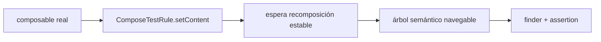
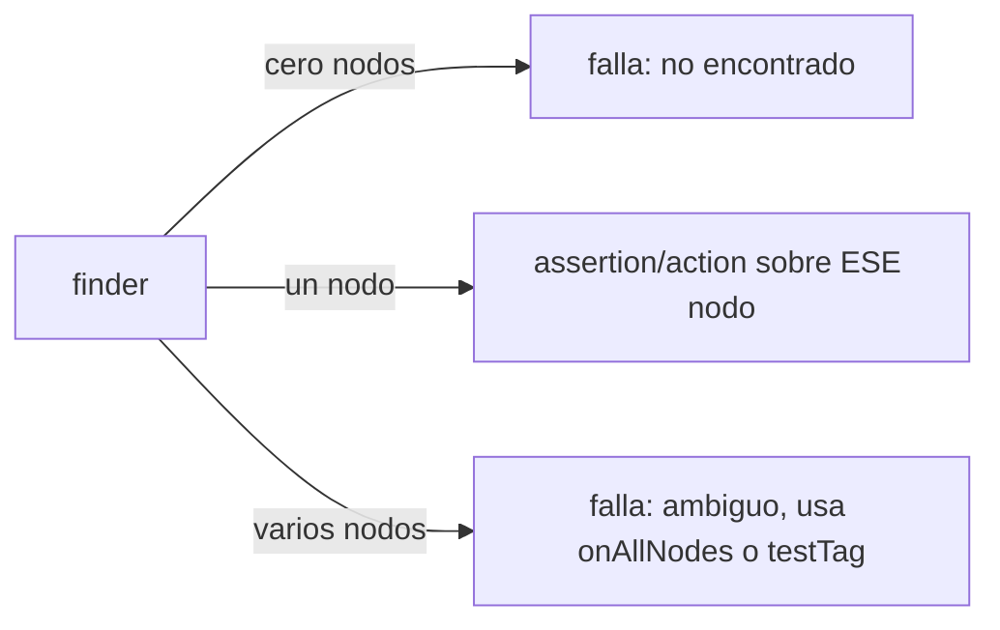
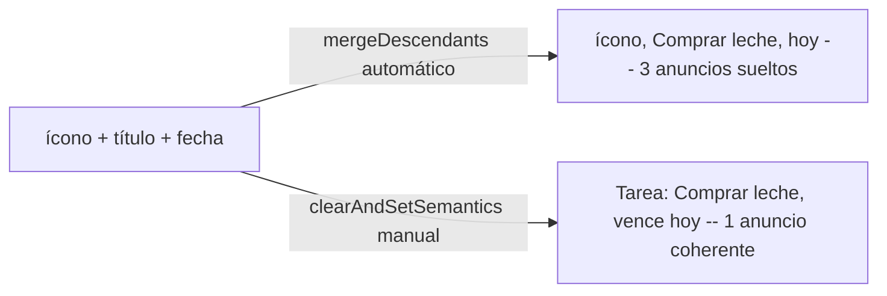
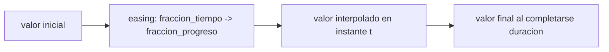
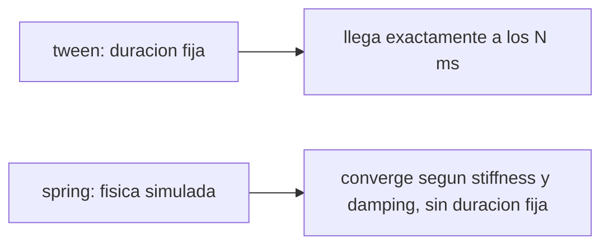

# Módulo 14: Compose Master — pruebas, accesibilidad y animación

Una pantalla Compose que "se ve bien" en el emulador puede seguir rota para quien usa TalkBack, o para un cambio futuro que nadie prueba automáticamente. Este módulo cierra el track cubriendo tres disciplinas que no aparecen en el resultado visual: verificar UI con pruebas reales, exponer la interfaz a servicios de accesibilidad, y animar transiciones con una especificación medible en vez de "una animación que se ve fluida".


## Aprende construyendo

### Tema 1: ComposeTestRule ejecuta tu UI sin emulador visible

#### Paso 1 · Objetivo y preparación

Al finalizar podrás escribir una prueba de Compose que monta un composable real y verifica su estado sin depender de captura visual manual, y explicar qué garantiza `ComposeTestRule` que una revisión manual no garantiza.

**Conocimiento previo:** testing con `runTest` y fakes (Módulo 9 de este track); estado y recomposición (Módulo 2).

#### Paso 2 · Contexto y caso real

**¿Por qué es importante?** Una revisión manual en el emulador confirma que la pantalla "se ve bien" hoy, con los datos de hoy; no confirma que seguirá correcta cuando otra persona cambie el composable el mes próximo. `ComposeTestRule` monta el árbol de Compose real y permite verificarlo con aserciones repetibles en CI.

#### Paso 3 · Teoría con analogía

**Conceptos clave:** `ComposeTestRule`, host de prueba, sincronización de recomposición, árbol semántico.

`ComposeTestRule` (o `createComposeRule()`) monta un composable en un host de prueba sin actividad completa, ejecuta recomposiciones hasta estabilizar el árbol antes de cada aserción, y expone ese árbol mediante un modelo semántico navegable por finders. La sincronización automática espera a que Compose termine de recomponer antes de dejar continuar la prueba, evitando falsos negativos por leer el árbol a mitad de una actualización.

**Analogía:** revisar manualmente una pantalla es como inspeccionar un producto una vez en la línea de ensamblaje. `ComposeTestRule` es la estación de control que repite la misma inspección automáticamente en cada unidad que pasa, con el mismo criterio cada vez.

**Diagrama:**



#### Paso 4 · Demostración guiada desde cero

Compose no ejecuta en este entorno, así que modela primero la estructura real en Kotlin y luego ejecuta el mismo modelo de sincronización en Python (misma lógica: montar, recomponer hasta estabilizar, verificar). Desde una carpeta vacía (o continuando en `academia-android` de módulos anteriores, o créala desde una carpeta vacía con `mkdir -p academia-android` si es tu primera vez), crea `app/src/androidTest/kotlin/com/academia/android/ContadorTest.kt`:

```bash
# python ejecuta después un modelo equivalente de sincronización de recomposición
mkdir -p academia-android/app/src/androidTest/kotlin/com/academia/android
cd academia-android
cat > app/src/androidTest/kotlin/com/academia/android/ContadorTest.kt <<'EOF'
package com.academia.android

import androidx.compose.ui.test.junit4.createComposeRule
import androidx.compose.ui.test.onNodeWithText
import androidx.compose.ui.test.performClick
import androidx.compose.ui.test.assertTextEquals
import org.junit.Rule
import org.junit.Test

class ContadorTest {
    @get:Rule
    val compose = createComposeRule()

    @Test
    fun alHacerClicIncrementaElContador() {
        compose.setContent { PantallaContador() }
        compose.onNodeWithText("Contador: 0").assertExists()
        compose.onNodeWithText("Incrementar").performClick()
        compose.onNodeWithText("Contador: 1").assertExists()
    }
}
EOF
./gradlew :app:connectedDebugAndroidTest
```

**Explicación línea por línea:** `createComposeRule()` crea el host de prueba sin necesidad de una Activity completa; `compose.setContent { PantallaContador() }` monta el composable real, igual que ocurriría en producción; `onNodeWithText(...)` busca en el árbol semántico ya estabilizado (la regla espera automáticamente la recomposición); `performClick()` dispara el evento real y `assertTextEquals`/`assertExists` verifican el nuevo estado tras la recomposición resultante.

Ejecuta ahora, en Python, un modelo real y ejecutable del mismo ciclo montar → esperar estabilidad → actuar → reverificar, usando una cola de recomposiciones pendientes para demostrar por qué la sincronización automática importa:

```bash
python3 -c "
class ArbolSemanticoSimulado:
    def __init__(self):
        self.texto_boton = 'Contador: 0'
        self.contador = 0
        self.recomposiciones_pendientes = 0

    def set_content(self):
        self.recomposiciones_pendientes = 1  # composición inicial pendiente

    def esperar_estabilidad(self):
        # ComposeTestRule hace esto automáticamente antes de cada aserción
        while self.recomposiciones_pendientes > 0:
            self.recomposiciones_pendientes -= 1
            self.texto_boton = f'Contador: {self.contador}'

    def on_node_with_text(self, texto):
        self.esperar_estabilidad()
        assert self.texto_boton == texto, f'no encontrado: {texto} (árbol tiene: {self.texto_boton})'
        return self

    def perform_click(self):
        self.contador += 1
        self.recomposiciones_pendientes += 1  # el clic dispara una recomposición pendiente
        return self

arbol = ArbolSemanticoSimulado()
arbol.set_content()
arbol.on_node_with_text('Contador: 0')
arbol.perform_click()
arbol.on_node_with_text('Contador: 1')  # esperar_estabilidad() se ejecuta ANTES de leer, no después
print('prueba estable: el árbol se sincronizó antes de cada aserción, sin condición de carrera')
"
```

**Resultado esperado:** ambas aserciones (`Contador: 0` antes del clic y `Contador: 1` después) pasan porque `esperar_estabilidad()` procesa toda recomposición pendiente antes de cada lectura del árbol, exactamente el comportamiento que `ComposeTestRule` garantiza automáticamente en Compose real.

**Fallo deliberado:** elimina la llamada a `self.esperar_estabilidad()` dentro de `on_node_with_text` y repite la prueba. La segunda aserción (`Contador: 1`) falla porque `self.texto_boton` todavía no refleja la recomposición pendiente disparada por `perform_click()` — diagnostica confirmando que sin sincronización explícita antes de leer el árbol, una prueba de UI puede leer un estado a mitad de actualización y producir un falso negativo (o, peor, un falso positivo intermitente que solo aparece bajo carga).

#### Construcción RutaFlow: prueba del contador de tareas pendientes

Crea en `academia-android/app/src/androidTest/kotlin/com/academia/android/ContadorTareasPendientesTest.kt` una prueba equivalente que monta `PantallaResumenRutaFlow`, verifica el texto inicial "Pendientes: 0" y confirma que agregar una tarea actualiza el contador visible antes de continuar con la siguiente aserción.

#### Paso 5 · Práctica guiada

Agrega una segunda acción encadenada al modelo Python (dos clics seguidos sin leer el árbol entre ellos) y confirma que `esperar_estabilidad()` sigue produciendo el valor correcto acumulado (`Contador: 2`) porque procesa todas las recomposiciones pendientes, no solo la primera. **Pista:** revisa que `recomposiciones_pendientes` se incremente en cada `perform_click()` sin resetearse entre llamadas.

#### Paso 6 · Práctica independiente

Documenta en una frase qué diferencia hay entre una prueba que usa `Thread.sleep()` para "esperar a que la UI se actualice" y una que usa la sincronización automática de `ComposeTestRule`, relacionándolo con qué pasa si la máquina de CI es más lenta de lo esperado.

#### Paso 7 · Cierre y evidencia

Ya montas un composable real en un host de prueba, disparas una acción y verificas el árbol semántico solo después de que la sincronización automática garantiza estabilidad. El siguiente tema profundiza en los finders, assertions y actions específicos que navegan y modifican ese árbol. **Evidencia:** entrega el resultado de las dos aserciones pasando en el modelo estable, y el resultado del fallo deliberado mostrando la aserción rota sin sincronización explícita. Fuente oficial: [Android Developers — Test your Compose layout](https://developer.android.com/develop/ui/compose/testing).

**Errores comunes:** usar `Thread.sleep()` en vez de la sincronización automática de `ComposeTestRule`, produciendo pruebas lentas y aun así intermitentes; escribir la prueba contra una captura de pantalla en vez del árbol semántico, haciendo la prueba fräil ante cambios de diseño que no afectan el comportamiento.

**Cuándo no usarlo:** para verificar únicamente lógica de negocio sin ninguna interacción de UI (por ejemplo, una función pura de formateo de fecha), una prueba unitaria de JVM sin `ComposeTestRule` es más rápida y suficiente; resérvalo para composables con estado e interacción real.

### Tema 2: Finders, assertions y actions navegan el árbol semántico

#### Paso 1 · Objetivo y preparación

Al finalizar podrás elegir el finder correcto para un nodo (por texto, por tag, por rol) y encadenar assertions y actions sin ambigüedad cuando existan varios nodos similares.

**Conocimiento previo:** Tema 1 de este módulo (ComposeTestRule); Semantics básicos (Módulo 10, Tema 3 de este track).

#### Paso 2 · Contexto y caso real

**¿Por qué es importante?** Una pantalla con dos botones de texto similar ("Guardar" en dos formularios distintos) rompe un finder ambiguo con una excepción en tiempo de prueba, no en tiempo de compilación; elegir el finder correcto (por tag único en vez de por texto duplicado) evita ese fallo.

#### Paso 3 · Teoría con analogía

**Conceptos clave:** finder (`onNodeWithText`, `onNodeWithTag`), assertion (`assertExists`, `assertIsDisplayed`), action (`performClick`, `performTextInput`), ambigüedad de nodos.

Un finder localiza cero, uno o varios nodos que cumplen un criterio; si localiza más de uno y se espera exactamente uno, la prueba falla explícitamente en vez de elegir arbitrariamente. `onNodeWithTag` usa un identificador estable puesto por el desarrollador (`Modifier.testTag(...)`), inmune a cambios de texto visible o idioma; `onNodeWithText` es frágil ante localización o copy cambiante. Las assertions verifican estado del nodo encontrado; las actions simulan interacción real del usuario y disparan la recomposición correspondiente.

**Analogía:** buscar un nodo por texto visible es como ubicar una persona por su camiseta del día; buscarlo por `testTag` es ubicarlo por su credencial de identificación, estable sin importar qué ropa lleve.

**Diagrama:**



#### Paso 4 · Demostración guiada desde cero

Desde una carpeta vacía (o continuando en `academia-android`, o créala desde una carpeta vacía con `mkdir -p academia-android` si es tu primera vez), crea `app/src/androidTest/kotlin/com/academia/android/FormularioDobleTest.kt` mostrando el finder correcto ante ambigüedad:

```bash
# ejecuta con Gradle el test instrumentado de Compose que usa testTag
mkdir -p academia-android/app/src/androidTest/kotlin/com/academia/android
cd academia-android
cat > app/src/androidTest/kotlin/com/academia/android/FormularioDobleTest.kt <<'EOF'
package com.academia.android

import androidx.compose.ui.test.junit4.createComposeRule
import androidx.compose.ui.test.onNodeWithTag
import androidx.compose.ui.test.performTextInput
import androidx.compose.ui.test.assertTextEquals
import org.junit.Rule
import org.junit.Test

class FormularioDobleTest {
    @get:Rule
    val compose = createComposeRule()

    @Test
    fun escribeEnElCampoDeTituloDeLaTareaNoEnElDeNota() {
        compose.setContent { PantallaFormularioDoble() }
        // dos campos comparten el placeholder "Guardar"; testTag es la única forma no ambigua
        compose.onNodeWithTag("campo_titulo_tarea").performTextInput("Comprar leche")
        compose.onNodeWithTag("campo_titulo_tarea").assertTextEquals("Comprar leche")
    }
}
EOF
./gradlew :app:connectedDebugAndroidTest
```

**Explicación línea por línea:** `onNodeWithTag(\"campo_titulo_tarea\")` localiza exactamente un nodo por su identificador estable, sin depender del texto visible que dos campos similares podrían compartir; `performTextInput(...)` simula la escritura real del usuario, y `assertTextEquals(...)` confirma que ese nodo específico —no otro parecido— refleja el nuevo valor.

Ejecuta en Python un modelo real de búsqueda ambigua, comparando qué ocurre al buscar por texto duplicado frente a buscar por tag único:

```bash
python3 -c "
nodos = [
    {'tag': 'campo_titulo_tarea', 'texto_placeholder': 'Guardar', 'valor': ''},
    {'tag': 'campo_nota_tarea', 'texto_placeholder': 'Guardar', 'valor': ''},
]

def on_node_with_text(nodos, texto):
    encontrados = [n for n in nodos if n['texto_placeholder'] == texto]
    if len(encontrados) == 0:
        raise AssertionError(f'no encontrado: {texto}')
    if len(encontrados) > 1:
        raise AssertionError(f'ambiguo: {len(encontrados)} nodos coinciden con \"{texto}\"')
    return encontrados[0]

def on_node_with_tag(nodos, tag):
    encontrados = [n for n in nodos if n['tag'] == tag]
    assert len(encontrados) == 1, f'tag debe ser único, encontrados: {len(encontrados)}'
    return encontrados[0]

try:
    on_node_with_text(nodos, 'Guardar')
    print('INESPERADO: la búsqueda por texto no detectó la ambigüedad')
except AssertionError as e:
    print('búsqueda por texto duplicado RECHAZADA:', e)

nodo = on_node_with_tag(nodos, 'campo_titulo_tarea')
nodo['valor'] = 'Comprar leche'
print('búsqueda por tag único ACEPTADA, valor asignado al nodo correcto:', nodo['valor'])
"
```

**Resultado esperado:** la búsqueda por texto duplicado (`\"Guardar\"`) lanza `AssertionError` reportando ambigüedad entre 2 nodos, exactamente el fallo que produciría Compose real ante un finder no específico; la búsqueda por `tag` único localiza exactamente el nodo `campo_titulo_tarea` y le asigna el valor correctamente, sin riesgo de escribir en el campo equivocado.

**Fallo deliberado:** modifica `on_node_with_text` para que, ante ambigüedad, simplemente retorne `encontrados[0]` (el primero) en vez de lanzar `AssertionError`. Repite la búsqueda por `\"Guardar\"` — ahora "funciona" silenciosamente pero podría escribir en el campo de nota en vez del de título, dependiendo del orden interno de la lista — diagnostica confirmando por qué Compose real prefiere fallar explícitamente ante ambigüedad en vez de adivinar: una prueba que "pasa" escribiendo en el nodo equivocado es peor que una que falla con un mensaje claro.

#### Construcción RutaFlow: testTag consistente en el formulario de tareas

Agrega `Modifier.testTag(\"campo_titulo_tarea\")` y `Modifier.testTag(\"campo_nota_tarea\")` a los campos correspondientes en `PantallaFormularioDoble` de RutaFlow, documentando en `academia-android/README.md` la convención de nombres de tag usada en todo el proyecto para que ninguna prueba futura dependa de texto visible ambiguo.

#### Paso 5 · Práctica guiada

Agrega un tercer nodo a la lista de Python con un tag distinto pero el mismo `texto_placeholder` "Guardar", y confirma que `on_node_with_text` ahora reporta ambigüedad entre 3 nodos mientras `on_node_with_tag` sigue localizando exactamente uno. **Pista:** el conteo de `encontrados` en el mensaje de error debe reflejar el número real de coincidencias.

#### Paso 6 · Práctica independiente

Documenta en una frase por qué `onAllNodesWithTag(...)` (que retorna una lista, no un único nodo) es la elección correcta cuando se espera intencionalmente más de un nodo, en vez de forzar `onNodeWithTag` a tolerar ambigüedad.

#### Paso 7 · Cierre y evidencia

Ya distingues cuándo un finder por texto es frágil ante ambigüedad y cuándo un `testTag` único la elimina, y compruebas que Compose prefiere fallar explícitamente antes que adivinar. El siguiente tema aborda cómo el árbol semántico que estos finders navegan también es la base de la accesibilidad. **Evidencia:** entrega el resultado de la ambigüedad detectada por texto duplicado, y el resultado de la asignación correcta mediante tag único, explicando por qué fallar explícitamente es preferible a adivinar. Fuente oficial: [Android Developers — Finders, assertions, and actions](https://developer.android.com/develop/ui/compose/testing/apis).

**Errores comunes:** depender de texto visible traducible como criterio de búsqueda en pruebas, rompiéndolas al cambiar idioma; usar `onNodeWithTag` cuando en realidad se espera más de un nodo, forzando ambigüedad en vez de usar `onAllNodesWithTag`.

**Cuándo no usarlo:** para un nodo verdaderamente único en toda la pantalla sin riesgo de colisión futura (un único botón de "Enviar" en un formulario simple), `onNodeWithText` es aceptable y más legible; reserva `testTag` para nodos con riesgo real de ambigüedad.

### Tema 3: Semantics y clearAndSetSemantics definen qué percibe la accesibilidad

#### Paso 1 · Objetivo y preparación

Al finalizar podrás explicar cómo Compose fusiona (`mergeDescendants`) la semántica de un grupo de nodos hijos, y cuándo `clearAndSetSemantics` debe reemplazar esa fusión con una descripción manual coherente.

**Conocimiento previo:** `contentDescription` (Módulo 10, Tema 3 de este track); Tema 2 de este módulo (árbol semántico).

#### Paso 2 · Contexto y caso real

**¿Por qué es importante?** Un servicio de accesibilidad como TalkBack no ve píxeles: navega el árbol semántico. Si una tarjeta compuesta de ícono, título y fecha no fusiona su semántica correctamente, TalkBack anuncia tres elementos sueltos ("ícono", "Comprar leche", "hoy") en vez de un enunciado coherente ("Tarea: Comprar leche, vence hoy").

#### Paso 3 · Teoría con analogía

**Conceptos clave:** nodo semántico, `mergeDescendants`, `clearAndSetSemantics`, enunciado coherente.

Cada composable puede aportar propiedades semánticas (texto, rol, estado) a un nodo; un contenedor con `mergeDescendants = true` combina las de sus hijos en un solo nodo navegable, útil para una tarjeta que debe anunciarse como una unidad. `clearAndSetSemantics` descarta la fusión automática y define manualmente la descripción completa, necesario cuando la fusión automática produce un orden o redundancia que no tiene sentido leído en voz alta.

**Analogía:** la fusión automática es como leer en voz alta cada etiqueta de una caja por separado; `clearAndSetSemantics` es escribir una sola frase que resume el contenido de la caja de forma que tenga sentido escuchada de corrido.

**Diagrama:**



#### Paso 4 · Demostración guiada desde cero

Desde una carpeta vacía (o continuando en `academia-android`, o créala desde una carpeta vacía con `mkdir -p academia-android` si es tu primera vez), crea `app/src/main/kotlin/com/academia/android/TarjetaTareaAccesible.kt` comparando ambos enfoques:

```bash
# python compara después el anuncio fusionado automático frente al manual
mkdir -p academia-android/app/src/main/kotlin/com/academia/android
cd academia-android
cat > app/src/main/kotlin/com/academia/android/TarjetaTareaAccesible.kt <<'EOF'
package com.academia.android

import androidx.compose.foundation.layout.Row
import androidx.compose.material3.Icon
import androidx.compose.material3.Text
import androidx.compose.runtime.Composable
import androidx.compose.ui.Modifier
import androidx.compose.ui.semantics.clearAndSetSemantics
import androidx.compose.ui.semantics.contentDescription

@Composable
fun TarjetaTareaAccesible(titulo: String, fecha: String) {
    Row(
        modifier = Modifier.clearAndSetSemantics {
            contentDescription = "Tarea: $titulo, vence $fecha"
        }
    ) {
        Icon(imageVector = IconoTarea, contentDescription = null) // ya cubierto por el padre
        Text(titulo)
        Text(fecha)
    }
}
EOF
./gradlew :app:compileDebugKotlin
```

**Explicación línea por línea:** `Modifier.clearAndSetSemantics { contentDescription = ... }` en el `Row` descarta cualquier fusión automática de sus hijos y establece un único enunciado completo para todo el grupo; el `Icon` interno recibe `contentDescription = null` porque su información ya está incluida en el enunciado del padre — anunciarlo de nuevo sería redundante.

Ejecuta en Python un modelo real del árbol semántico comparando el anuncio con fusión automática frente al anuncio con `clearAndSetSemantics`:

```bash
python3 -c "
def anuncio_con_fusion_automatica(hijos):
    # mergeDescendants concatena cada nodo hijo con contentDescription propio
    partes = [h['contentDescription'] for h in hijos if h.get('contentDescription')]
    return ', '.join(partes)

def anuncio_con_clear_and_set(descripcion_manual):
    return descripcion_manual

hijos = [
    {'contentDescription': 'ícono de tarea'},
    {'contentDescription': 'Comprar leche'},
    {'contentDescription': 'hoy'},
]

fusionado = anuncio_con_fusion_automatica(hijos)
print('anuncio con fusión automática (3 fragmentos sueltos):', repr(fusionado))

manual = anuncio_con_clear_and_set('Tarea: Comprar leche, vence hoy')
print('anuncio con clearAndSetSemantics (1 enunciado coherente):', repr(manual))

assert fusionado != manual, 'la fusión automática y el enunciado manual deben diferir quedando claro el problema'
print('confirmado: la fusión automática produce fragmentos sueltos; clearAndSetSemantics produce un enunciado legible')
"
```

**Resultado esperado:** el anuncio con fusión automática produce `'ícono de tarea, Comprar leche, hoy'`, tres fragmentos concatenados sin gramática ni contexto; el anuncio con `clearAndSetSemantics` produce `'Tarea: Comprar leche, vence hoy'`, un enunciado único y coherente — la comparación explícita confirma por qué el segundo enfoque es necesario para una tarjeta compuesta.

**Fallo deliberado:** en el Kotlin, elimina `contentDescription = null` del `Icon` interno pero conserva el `clearAndSetSemantics` en el `Row` padre. El ícono con su propio `contentDescription` distinto quedaría ignorado de todas formas porque `clearAndSetSemantics` descarta TODA la semántica de los descendientes, no solo la fusiona — diagnostica revisando la documentación oficial: `clearAndSetSemantics` significa literalmente "limpiar y establecer", cualquier semántica de los hijos queda completamente reemplazada, por lo que un ícono con información adicional real (no decorativo) perdería esa información si se usa `clearAndSetSemantics` en el padre sin incluirla manualmente en la descripción combinada.

#### Construcción RutaFlow: tarjeta de tarea accesible del proyecto

Aplica `clearAndSetSemantics` a `TarjetaTarea` de RutaFlow (Módulo 2 de este track) para que TalkBack anuncie "Tarea: [título], [completada o pendiente]" como un solo enunciado en vez de fragmentos sueltos del ícono de estado, el título y el checkbox.

#### Paso 5 · Práctica guiada

Modifica el script de Python para que `anuncio_con_fusion_automatica` incluya un cuarto hijo con `contentDescription` vacío (`''`), y confirma que el filtro `if h.get('contentDescription')` lo excluye correctamente del anuncio final, evitando una coma o espacio vacío en el resultado. **Pista:** revisa que una cadena vacía sea "falsy" en la condición del filtro.

#### Paso 6 · Práctica independiente

Documenta en una frase por qué usar `clearAndSetSemantics` en un contenedor que NO necesita anunciarse como unidad (por ejemplo, una lista completa de 50 tareas) sería un error, relacionándolo con qué perdería un usuario de TalkBack si toda la lista se anunciara como un solo bloque de texto.

#### Paso 7 · Cierre y evidencia

Ya distingues cuándo la fusión automática de semántica es suficiente y cuándo `clearAndSetSemantics` debe reemplazarla con un enunciado manual coherente, confirmando la diferencia con un modelo ejecutado del árbol semántico. El siguiente tema aborda cómo `AccessibilityService` y TalkBack consumen exactamente este árbol en un dispositivo real. **Evidencia:** entrega el resultado del anuncio fragmentado frente al enunciado coherente, y explica por qué el ícono decorativo dentro del grupo debe llevar `contentDescription = null`. Fuente oficial: [Android Developers — Merge semantics in Compose](https://developer.android.com/develop/ui/compose/accessibility/semantics).

**Errores comunes:** usar `clearAndSetSemantics` en un contenedor grande donde la fusión automática ya era coherente, perdiendo granularidad de navegación para el usuario de TalkBack; olvidar `contentDescription = null` en un ícono verdaderamente decorativo dentro de un grupo ya descrito, duplicando información en el anuncio.

**Cuándo no usarlo:** para un contenedor cuyos hijos ya tienen sentido navegados individualmente (una lista donde cada tarea debe explorarse por separado), fusionar o limpiar la semántica del contenedor completo eliminaría esa navegabilidad granular; resérvalo para grupos que representan una sola unidad de sentido.

### Tema 4: AccessibilityService y TalkBack consumen el árbol semántico en producción

#### Paso 1 · Objetivo y preparación

Al finalizar podrás auditar una pantalla completa detectando qué nodos carecen de descripción accesible, y explicar qué anunciaría TalkBack recorriendo esa pantalla en el orden real del árbol.

**Conocimiento previo:** Tema 3 de este módulo (Semantics); auditoría de `contentDescription` (Módulo 10, Tema 3 de este track).

#### Paso 2 · Contexto y caso real

**¿Por qué es importante?** Una pantalla puede pasar todas las pruebas funcionales y seguir siendo inutilizable para una persona que depende de TalkBack, si un ícono interactivo carece de descripción o el orden de navegación no sigue el flujo visual lógico.

#### Paso 3 · Teoría con analogía

**Conceptos clave:** `AccessibilityService`, TalkBack, orden de navegación, foco de accesibilidad.

`AccessibilityService` es la API que TalkBack usa para recibir eventos del árbol semántico y anunciarlos mediante voz; no interpreta píxeles, solo la información semántica expuesta. El orden en que TalkBack navega sigue por defecto el orden del árbol de composición, que puede no coincidir con el orden visual si el layout usa superposición o reordenamiento visual sin ajustar la semántica. Un nodo interactivo (botón, ícono clicable) sin `contentDescription` se anuncia como "botón sin etiqueta", inutilizable para quien depende de voz.

**Analogía:** TalkBack es un guía que solo puede describir lo que está etiquetado; un ícono sin descripción es una puerta sin cartel — el guía sabe que existe pero no puede decir para qué sirve.

**Diagrama:**

```
┌── árbol semántico completo ──┐
│  nodo 1: "Volver" (botón)      │
│  nodo 2: sin contentDescription│ ◀── TalkBack anuncia "botón sin etiqueta"
│  nodo 3: "Comprar leche"        │
└─────────────────────────────────┘
```

#### Paso 4 · Demostración guiada desde cero

Desde una carpeta vacía (o continuando en `academia-android`, o créala desde una carpeta vacía con `mkdir -p academia-android` si es tu primera vez), crea `app/src/main/kotlin/com/academia/android/auditoria_accesibilidad.py` (script de auditoría, no parte de la app Android, ejecutable independientemente) que recorre una representación del árbol y detecta nodos interactivos sin descripción:

```bash
# python ejecuta esta auditoría de accesibilidad de forma independiente
mkdir -p academia-android/app/src/main/kotlin/com/academia/android
cd academia-android
cat > app/src/main/kotlin/com/academia/android/auditoria_accesibilidad.py <<'EOF'
def auditar_arbol(nodos):
    """Detecta nodos interactivos sin contentDescription, tal como los anunciaría TalkBack."""
    problemas = []
    for nodo in nodos:
        if nodo.get('es_interactivo') and not nodo.get('contentDescription'):
            problemas.append(nodo['id'])
    return problemas

if __name__ == '__main__':
    pantalla_resumen = [
        {'id': 'boton_volver', 'es_interactivo': True, 'contentDescription': 'Volver'},
        {'id': 'icono_editar', 'es_interactivo': True, 'contentDescription': None},
        {'id': 'texto_tarea', 'es_interactivo': False, 'contentDescription': None},
        {'id': 'icono_mas', 'es_interactivo': True, 'contentDescription': None},
    ]
    problemas = auditar_arbol(pantalla_resumen)
    print('nodos interactivos sin descripción:', problemas)
EOF
python3 app/src/main/kotlin/com/academia/android/auditoria_accesibilidad.py
```

**Explicación línea por línea:** `auditar_arbol` recorre cada nodo de la representación de la pantalla y marca como problema solo los nodos donde `es_interactivo` es verdadero pero `contentDescription` está ausente; el nodo `texto_tarea`, aunque carece de descripción, no es interactivo, así que TalkBack simplemente lee su texto visible y no necesita descripción adicional — no es un problema real.

**Resultado esperado:** la ejecución imprime `nodos interactivos sin descripción: ['icono_editar', 'icono_mas']`, confirmando que el script detecta exactamente los dos íconos clicables sin etiqueta, y excluye correctamente tanto el botón ya descrito (`boton_volver`) como el texto no interactivo (`texto_tarea`) que no necesita descripción.

**Fallo deliberado:** modifica la condición del script a `if not nodo.get('contentDescription')` sin el filtro `nodo.get('es_interactivo')`, y vuelve a ejecutar. Ahora el script reporta también `texto_tarea` como problema, aunque un texto no interactivo sin `contentDescription` no representa ningún defecto real para TalkBack (TalkBack lee directamente el texto visible de un nodo no interactivo) — diagnostica confirmando que auditar accesibilidad sin distinguir interactividad genera falsos positivos que entierran los problemas reales bajo ruido, exactamente el motivo por el que el filtro `es_interactivo` es necesario.

#### Construcción RutaFlow: auditoría de accesibilidad de la pantalla principal

Ejecuta `auditoria_accesibilidad.py` extendido con los nodos reales de `PantallaResumenRutaFlow` (Módulo 2), documentando en `academia-android/README.md` cualquier ícono interactivo sin `contentDescription` detectado y su corrección.

#### Paso 5 · Práctica guiada

Agrega un quinto nodo al script con `es_interactivo: True` y `contentDescription: ''` (cadena vacía, no `None`), y confirma si el script actual lo detecta como problema. **Pista:** revisa si `not ''` evalúa a verdadero en Python, y decide si una cadena vacía debería tratarse igual que ausencia de descripción.

#### Paso 6 · Práctica independiente

Documenta en una frase por qué el orden en que TalkBack navega una pantalla puede no coincidir con el orden visual si el layout usa superposición (por ejemplo, un elemento posicionado absolutamente sobre otros), relacionándolo con qué necesitarías ajustar en la semántica para corregirlo.

#### Paso 7 · Cierre y evidencia

Ya auditas una pantalla completa detectando nodos interactivos sin descripción accesible, distinguiéndolos de nodos no interactivos que no la necesitan, y confirmas el resultado con una ejecución real del script. El siguiente tema aborda cómo animar transiciones de estado sin comprometer lo que TalkBack necesita anunciar. **Evidencia:** entrega el resultado de la auditoría detectando exactamente los dos íconos sin descripción, y explica por qué incluir nodos no interactivos en la auditoría generaría falsos positivos. Fuente oficial: [Android Developers — Test your app's accessibility](https://developer.android.com/develop/ui/compose/accessibility/testing).

**Errores comunes:** auditar accesibilidad sin distinguir interactividad, generando falsos positivos sobre texto decorativo; asumir que un ícono con un `contentDescription` técnicamente presente pero genérico ("botón", "ícono") es suficiente, cuando no describe la acción real.

**Cuándo no usarlo:** para un prototipo interno de un solo desarrollador sin usuarios reales todavía, una auditoría exhaustiva de accesibilidad es prematura; sigue siendo buena práctica declarar `contentDescription` desde el principio, pero la auditoría automatizada formal se justifica antes de exponer la app a usuarios reales.

### Tema 5: Animaciones de estado y visibilidad usan una especificación medible

#### Paso 1 · Objetivo y preparación

Al finalizar podrás calcular el valor interpolado de una animación en un instante dado usando una especificación de easing explícita, en vez de describir la animación como "algo que se ve fluida".

**Conocimiento previo:** estado y recomposición (Módulo 2 de este track); Flow (Módulo 4).

#### Paso 2 · Contexto y caso real

**¿Por qué es importante?** "Se ve fluida" no es verificable ni reproducible; una especificación de animación (duración, curva de easing) sí lo es — permite calcular exactamente qué valor debería tener la animación en cualquier instante, y por lo tanto probarla.

#### Paso 3 · Teoría con analogía

**Conceptos clave:** `animateFloatAsState`, `AnimatedVisibility`, easing, interpolación.

`animateFloatAsState` anima un valor de estado entre un valor inicial y uno final a lo largo de una duración, aplicando una función de easing que determina la velocidad relativa en cada instante (lineal, acelerando, desacelerando). `AnimatedVisibility` anima la aparición/desaparición de un composable completo combinando una animación de tamaño/posición con una de opacidad. La curva de easing convierte una fracción de tiempo transcurrido (0 a 1) en una fracción de progreso (0 a 1) que no necesariamente es la misma —un easing "ease-out" progresa más rápido al inicio y se desacelera al final.

**Analogía:** una animación sin especificación es una promesa de "llegará suave"; una especificación de easing es la fórmula exacta de velocidad en cada instante, verificable calculando el valor esperado en cualquier punto del recorrido.

**Diagrama:**



#### Paso 4 · Demostración guiada desde cero

Desde una carpeta vacía (o continuando en `academia-android`, o créala desde una carpeta vacía con `mkdir -p academia-android` si es tu primera vez), crea `app/src/main/kotlin/com/academia/android/AnimacionTareaCompletada.kt`:

```bash
# python calcula después el valor interpolado en instantes específicos
mkdir -p academia-android/app/src/main/kotlin/com/academia/android
cd academia-android
cat > app/src/main/kotlin/com/academia/android/AnimacionTareaCompletada.kt <<'EOF'
package com.academia.android

import androidx.compose.animation.core.LinearOutSlowInEasing
import androidx.compose.animation.core.animateFloatAsState
import androidx.compose.animation.core.tween
import androidx.compose.runtime.Composable

@Composable
fun opacidadTareaCompletada(completada: Boolean): Float {
    val opacidad by animateFloatAsState(
        targetValue = if (completada) 0.4f else 1.0f,
        animationSpec = tween(durationMillis = 300, easing = LinearOutSlowInEasing),
        label = "opacidadTarea",
    )
    return opacidad
}
EOF
./gradlew :app:compileDebugKotlin
```

**Explicación línea por línea:** `animateFloatAsState` observa el cambio de `completada` y anima automáticamente `opacidad` desde su valor actual hacia `targetValue`; `tween(durationMillis = 300, easing = LinearOutSlowInEasing)` especifica exactamente cuánto dura la transición y qué curva de velocidad sigue, information suficiente para calcular el valor esperado en cualquier instante intermedio.

Ejecuta en Python el mismo cálculo de interpolación con una curva "ease-out" real (progresa rápido al inicio, se desacelera al final), verificando valores en instantes específicos:

```bash
python3 -c "
def ease_out_cuadratico(fraccion_tiempo):
    # progresa mas rapido al inicio, se desacelera acercandose al final
    return 1 - (1 - fraccion_tiempo) ** 2

def valor_interpolado(inicial, final, duracion_ms, tiempo_transcurrido_ms, funcion_easing):
    fraccion_tiempo = min(tiempo_transcurrido_ms / duracion_ms, 1.0)
    fraccion_progreso = funcion_easing(fraccion_tiempo)
    return inicial + (final - inicial) * fraccion_progreso

duracion = 300
inicial, final = 1.0, 0.4

for t in [0, 75, 150, 225, 300]:
    valor = valor_interpolado(inicial, final, duracion, t, ease_out_cuadratico)
    print(f't={t}ms -> opacidad={valor:.3f}')

# con ease-out, el progreso a la mitad del tiempo (150ms) debe ser MAYOR al 50% del recorrido
progreso_a_mitad_tiempo = ease_out_cuadratico(0.5)
assert progreso_a_mitad_tiempo > 0.5, 'ease-out debe progresar más de la mitad antes de la mitad del tiempo'
print(f'progreso a mitad de tiempo: {progreso_a_mitad_tiempo:.3f} (mayor a 0.5, confirma la curva ease-out)')
"
```

**Resultado esperado:** los valores impresos muestran la opacidad decreciendo de 1.0 a 0.4 de forma no lineal, con el valor en `t=150ms` (mitad del tiempo) ya más cerca del valor final que el punto medio lineal (0.7) — confirmando numéricamente que la curva ease-out avanza más rápido al principio, exactamente la especificación declarada en `LinearOutSlowInEasing`.

**Fallo deliberado:** reemplaza `ease_out_cuadratico` por una interpolación lineal simple (`fraccion_progreso = fraccion_tiempo`) sin cambiar la aserción final. La aserción `progreso_a_mitad_tiempo > 0.5` falla porque una interpolación lineal da exactamente `0.5` en la mitad del tiempo, no más — diagnostica confirmando que "animar un valor" y "animar un valor con una curva de easing específica" son comportamientos numéricamente distintos y verificables, no una cuestión de percepción subjetiva.

#### Construcción RutaFlow: animación de tarea completada

Aplica `opacidadTareaCompletada` a `TarjetaTarea` de RutaFlow (Módulo 2) para que al marcar una tarea como completada, su opacidad transicione suavemente en vez de cambiar abruptamente, documentando en `academia-android/README.md` la duración y easing elegidos.

#### Paso 5 · Práctica guiada

Modifica el script de Python para usar una curva "ease-in" (progresa lento al inicio, rápido al final: `fraccion_tiempo ** 2`) y confirma que el progreso a mitad de tiempo ahora es MENOR a 0.5, lo opuesto al resultado de ease-out. **Pista:** cambia solo la función de easing, reutiliza `valor_interpolado` sin modificarla.

#### Paso 6 · Práctica independiente

Documenta en una frase por qué animar la opacidad de una tarea completada con una duración de 3000ms (3 segundos) sería una mala elección de UX en una lista donde el usuario completa tareas rápidamente en sucesión, relacionándolo con qué percibiría el usuario si la animación anterior no ha terminado cuando empieza la siguiente.

#### Paso 7 · Cierre y evidencia

Ya calculas el valor esperado de una animación en cualquier instante usando una especificación explícita de duración y easing, y confirmas numéricamente la diferencia entre una curva ease-out y una interpolación lineal. El siguiente tema extiende esto a transiciones de contenido completo con `AnimatedContent` y especificaciones de resorte. **Evidencia:** entrega los valores interpolados en los 5 instantes calculados, y explica por qué el progreso a mitad de tiempo con ease-out es mayor que con interpolación lineal. Fuente oficial: [Android Developers — Animate value changes](https://developer.android.com/develop/ui/compose/animation/value-based).

**Errores comunes:** describir una animación como "que se vea fluida" sin especificar duración ni easing, haciendo imposible verificarla o reproducirla; encadenar animaciones de larga duración sin considerar que el usuario puede disparar el siguiente cambio de estado antes de que la anterior termine.

**Cuándo no usarlo:** para un cambio de estado que debe reflejarse instantáneamente por razones de accesibilidad o claridad crítica (por ejemplo, una alerta de error urgente), animar la transición introduce una demora perceptible que puede ser contraproducente; resérvalo para cambios donde la continuidad visual ayuda a la comprensión.

### Tema 6: AnimatedContent y AnimationSpec especifican transiciones completas

#### Paso 1 · Objetivo y preparación

Al finalizar podrás elegir entre un `tween` (duración fija) y un `spring` (basado en física) según el comportamiento deseado, y simular numéricamente cómo converge un resorte hacia su valor final.

**Conocimiento previo:** Tema 5 de este módulo (animaciones de valor); navegación (Módulo 3 de este track).

#### Paso 2 · Contexto y caso real

**¿Por qué es importante?** Cambiar de una pantalla de lista vacía a una con contenido, o de un estado "cargando" a "cargado", requiere animar la salida de un contenido y la entrada de otro coordinadamente; `AnimatedContent` gestiona esa transición, pero la especificación (`tween` vs `spring`) determina si se siente mecánica o natural.

#### Paso 3 · Teoría con analogía

**Conceptos clave:** `AnimatedContent`, `AnimationSpec`, `tween`, `spring`, amortiguación (damping).

`AnimatedContent` anima la transición entre dos versiones de contenido (por ejemplo, "0 tareas" y "3 tareas") especificando cómo entra el nuevo contenido y cómo sale el anterior. Un `tween` interpola linealmente (o con easing) durante una duración fija, predecible y determinista. Un `spring` simula un sistema físico masa-resorte-amortiguador: no tiene duración fija, converge según su rigidez (`stiffness`) y amortiguación (`dampingRatio`) — un `dampingRatio` bajo produce rebote visible antes de asentarse; uno alto converge sin rebote.

**Analogía:** `tween` es un tren que llega en un horario fijo sin importar la distancia; `spring` es una pelota lanzada que rebota según su elasticidad hasta detenerse, sin un tiempo de llegada predeterminado.

**Diagrama:**



#### Paso 4 · Demostración guiada desde cero

Desde una carpeta vacía (o continuando en `academia-android`, o créala desde una carpeta vacía con `mkdir -p academia-android` si es tu primera vez), crea `app/src/main/kotlin/com/academia/android/TransicionListaTareas.kt`:

```bash
# python simula después la convergencia física real de un spring
mkdir -p academia-android/app/src/main/kotlin/com/academia/android
cd academia-android
cat > app/src/main/kotlin/com/academia/android/TransicionListaTareas.kt <<'EOF'
package com.academia.android

import androidx.compose.animation.AnimatedContent
import androidx.compose.animation.core.Spring
import androidx.compose.animation.core.spring
import androidx.compose.runtime.Composable

@Composable
fun TransicionContadorTareas(cantidad: Int) {
    AnimatedContent(
        targetState = cantidad,
        transitionSpec = {
            fadeIn() togetherWith fadeOut()
        },
        label = "contadorTareas",
    ) { valorObjetivo ->
        // el tamaño del texto anima con un spring, no con duracion fija
        TextoConSpring(valorObjetivo, spring(dampingRatio = Spring.DampingRatioMediumBouncy))
    }
}
EOF
./gradlew :app:compileDebugKotlin
```

**Explicación línea por línea:** `AnimatedContent(targetState = cantidad, ...)` reconstruye su contenido cada vez que `cantidad` cambia, animando la salida del valor anterior y la entrada del nuevo según `transitionSpec`; `spring(dampingRatio = Spring.DampingRatioMediumBouncy)` especifica que la animación de tamaño del texto se comporte como un resorte con rebote moderado, en vez de una duración fija.

Simula en Python la física real de un resorte amortiguado (ecuación de movimiento integrada paso a paso), comparando dos valores de amortiguación:

```bash
python3 -c "
def simular_spring(valor_inicial, valor_final, stiffness, damping_ratio, pasos=20, dt=0.016):
    # ecuacion de movimiento de un oscilador armonico amortiguado, integrada con Euler
    posicion = valor_inicial
    velocidad = 0.0
    masa = 1.0
    damping_coef = damping_ratio * 2 * (stiffness * masa) ** 0.5
    trayectoria = [posicion]
    for _ in range(pasos):
        desplazamiento = posicion - valor_final
        fuerza = -stiffness * desplazamiento - damping_coef * velocidad
        aceleracion = fuerza / masa
        velocidad += aceleracion * dt
        posicion += velocidad * dt
        trayectoria.append(posicion)
    return trayectoria

# damping bajo: rebota (overshoot) antes de asentarse
trayectoria_rebote = simular_spring(0.0, 10.0, stiffness=200, damping_ratio=0.3)
maximo_rebote = max(trayectoria_rebote)
print(f'damping_ratio=0.3: valor máximo alcanzado={maximo_rebote:.2f} (objetivo=10.0)')

# damping alto: converge sin pasarse del objetivo
trayectoria_suave = simular_spring(0.0, 10.0, stiffness=200, damping_ratio=1.2)
maximo_suave = max(trayectoria_suave)
print(f'damping_ratio=1.2: valor máximo alcanzado={maximo_suave:.2f} (objetivo=10.0)')

assert maximo_rebote > 10.0, 'con damping bajo el resorte debe sobrepasar el objetivo (rebote)'
assert maximo_suave <= 10.0 + 0.05, 'con damping alto el resorte no debe sobrepasar significativamente el objetivo'
print('confirmado: damping bajo produce rebote visible; damping alto converge sin sobrepasar')
"
```

**Resultado esperado:** con `damping_ratio=0.3` el valor máximo alcanzado supera 10.0 (el resorte "se pasa" del objetivo y regresa, un rebote real), mientras que con `damping_ratio=1.2` el valor máximo se mantiene igual o por debajo de 10.0, confirmando numéricamente la diferencia de comportamiento entre un spring subamortiguado y uno sobreamortiguado.

**Fallo deliberado:** cambia `damping_ratio=0.3` a `damping_ratio=0.0` (sin amortiguación alguna) y ejecuta de nuevo. La trayectoria oscila indefinidamente sin converger nunca al valor final dentro de los 20 pasos simulados —diagnostica confirmando por qué `Spring.DampingRatioNoBouncy` (valor típicamente cercano a 1) es la elección segura por defecto en Compose: un resorte sin amortiguación real nunca se asienta, produciendo una animación de UI que oscilaría visiblemente para siempre en vez de estabilizarse.

#### Construcción RutaFlow: transición del contador de tareas pendientes

Aplica `TransicionContadorTareas` al contador de `PantallaResumenRutaFlow` (Módulo 2) para que el número de tareas pendientes anime su cambio con un spring de amortiguación media, documentando en `academia-android/README.md` por qué se prefirió `spring` sobre `tween` para esta transición específica.

#### Paso 5 · Práctica guiada

Modifica el script de Python para calcular con cuántos pasos (`pasos`) la trayectoria con `damping_ratio=1.2` queda dentro de un margen de 0.1 del valor objetivo (10.0) de forma sostenida, aproximando el "tiempo de asentamiento" del resorte. **Pista:** recorre la trayectoria e identifica el primer índice a partir del cual todos los valores restantes están dentro del margen.

#### Paso 6 · Práctica independiente

Documenta en una frase por qué un `tween` de duración fija sería preferible sobre un `spring` para una animación de progreso de una barra de carga con un tiempo total conocido (por ejemplo, un contador regresivo de 5 segundos exactos), relacionándolo con qué garantía de tiempo pierde un `spring` que un `tween` sí ofrece.

#### Paso 7 · Cierre y evidencia

Ya distingues cuándo usar un `tween` de duración fija frente a un `spring` físico, y confirmas numéricamente cómo la amortiguación determina si un resorte rebota o converge suavemente. Esto cierra el módulo de Compose Master y el track completo de Android: pruebas verificables, accesibilidad auditada y animaciones especificadas en vez de descritas subjetivamente. El siguiente track del programa, Kotlin Multiplatform, aplica estos mismos fundamentos de estado y pruebas fuera de la capa exclusivamente Android. **Evidencia:** entrega los valores máximos alcanzados por ambas trayectorias (rebote y suave), y explica por qué un `damping_ratio=0.0` nunca converge en la simulación. Fuente oficial: [Android Developers — AnimatedContent](https://developer.android.com/develop/ui/compose/animation/composables-modifiers).

**Errores comunes:** usar `spring` cuando se necesita una duración exacta y predecible (por ejemplo, sincronizada con un evento externo), sin considerar que un spring no garantiza tiempo de llegada; dejar el `dampingRatio` por defecto sin entender que valores bajos producen rebote, sorprendiendo en contextos donde el rebote visual no es deseado.

**Cuándo no usarlo:** para una transición que debe completarse en un tiempo exacto y predecible por razones de sincronización con otro evento (una animación coordinada con un sonido de duración fija), `spring` es inadecuado por no tener duración determinista; usa `tween` en ese caso.


## Trazabilidad de la auditoría original

- **Pruebas en Compose**: cubierto mediante fundamento, laboratorio y evidencia del capítulo (Temas 1-2).
- **Accesibilidad en Compose**: cubierto mediante fundamento, laboratorio y evidencia del capítulo (Temas 3-4).
- **Animaciones en Compose**: cubierto mediante fundamento, laboratorio y evidencia del capítulo (Temas 5-6).
