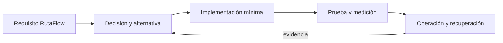

# Módulo 14: Compose Master: pruebas, accesibilidad y animación

## Sílabo

**Objetivo general:** dominar las capacidades avanzadas señaladas en la auditoría del track mediante una ampliación ejecutable de RutaFlow, decisiones justificadas, pruebas, seguridad y evidencia operacional.

**Resultados observables:** explicar cada tecnología sin depender de marcas; implementar un incremento pequeño; comparar alternativas; provocar un fallo; medir el resultado; y escribir un runbook de recuperación.

**Evaluación:** 20 % fundamento, 35 % implementación, 25 % pruebas y fallos, 10 % seguridad, 10 % documentación y comunicación.

## Comienza desde cero: prepara este capítulo

Este recorrido parte de una carpeta vacía. Al finalizar tendrás **Un incremento pequeño, probado y reproducible del capítulo.** No avances ejecutando comandos que no comprendes: primero identifica la entrada, la transformación y la evidencia que comprobará el resultado.

### 1. Comprueba las herramientas

Los comandos funcionan en macOS, Linux y WSL. En PowerShell usa el equivalente indicado por la herramienta.

```bash
java --version
./gradlew --version
adb version
```

Si un comando no existe, detente e instala esa herramienta desde su sitio oficial. Cierra y abre la terminal después de modificar `PATH`. Las versiones deben ser compatibles entre sí antes de crear archivos.

### 2. Crea o recupera el proyecto del track

```bash
# Android Studio: New Project → Empty Activity → Kotlin + Compose
cd academia-labs/android-app
git init
./gradlew tasks
```

Trabaja dentro de `academia-labs/android-app`. Si ya existe, no lo vuelvas a generar: entra en la carpeta, confirma `git status` y continúa sobre una rama propia.

### 3. Ubica cada tema antes de escribir

```text
academia-labs/android-app/
├─ app/src/main/java/academy/
│  └─ module-14/
├─ tests/
├─ docs/decisions/
├─ evidence/module-14/
└─ README.md
```

| Tema | Archivo o decisión | Evidencia mínima |
|---|---|---|
| 1. ComposeTestRule | `app/src/main/java/academy/module-14/topic-1-composetestrule.kt` | prueba + salida observable |
| 2. Finders, assertions y actions | `app/src/main/java/academy/module-14/topic-2-finders-assertions-y-actions.kt` | prueba + salida observable |
| 3. Semantics y clearAndSetSemantics | `app/src/main/java/academy/module-14/topic-3-semantics-y-clearandsetsemantics.kt` | prueba + salida observable |
| 4. AccessibilityService y TalkBack | `app/src/main/java/academy/module-14/topic-4-accessibilityservice-y-talkback.kt` | prueba + salida observable |
| 5. Animaciones de estado y visibilidad | `app/src/main/java/academy/module-14/topic-5-animaciones-de-estado-y-visibilidad.kt` | prueba + salida observable |
| 6. AnimatedContent y AnimationSpec | `app/src/main/java/academy/module-14/topic-6-animatedcontent-y-animationspec.kt` | prueba + salida observable |
| 7. Kotlin para Android | `docs/decisions/module-14-topic-7.md` | contexto + alternativas + decisión + consecuencias |
| 8. Views y Widgets | `docs/decisions/module-14-topic-8.md` | contexto + alternativas + decisión + consecuencias |
| 9. Event Handling | `docs/decisions/module-14-topic-9.md` | contexto + alternativas + decisión + consecuencias |
| 10. Estado en Compose | `docs/decisions/module-14-topic-10.md` | contexto + alternativas + decisión + consecuencias |
| 11. Fragments | `docs/decisions/module-14-topic-11.md` | contexto + alternativas + decisión + consecuencias |
| 12. RecyclerView | `docs/decisions/module-14-topic-12.md` | contexto + alternativas + decisión + consecuencias |
| 13. Menus, Dialogs, Toasts | `docs/decisions/module-14-topic-13.md` | contexto + alternativas + decisión + consecuencias |
| 14. LazyColumn/LazyRow | `docs/decisions/module-14-topic-14.md` | contexto + alternativas + decisión + consecuencias |
| 15. SharedPreferences | `docs/decisions/module-14-topic-15.md` | contexto + alternativas + decisión + consecuencias |
| 16. Integración con Views | `docs/decisions/module-14-topic-16.md` | contexto + alternativas + decisión + consecuencias |
| 17. Offline-first y sincronización | `docs/decisions/module-14-topic-17.md` | contexto + alternativas + decisión + consecuencias |
| 18. Energía y background | `docs/decisions/module-14-topic-18.md` | contexto + alternativas + decisión + consecuencias |
| 19. Baseline Profiles y Macrobenchmark | `docs/decisions/module-14-topic-19.md` | contexto + alternativas + decisión + consecuencias |
| 20. Arquitectura de Android | `docs/decisions/module-14-topic-20.md` | contexto + alternativas + decisión + consecuencias |
| 21. Lenguajes de programación actuales | `docs/decisions/module-14-topic-21.md` | contexto + alternativas + decisión + consecuencias |
| 22. Configuraciones de tiempo de ejecución | `docs/decisions/module-14-topic-22.md` | contexto + alternativas + decisión + consecuencias |
| 23. Servicios de dispositivos | `docs/decisions/module-14-topic-23.md` | contexto + alternativas + decisión + consecuencias |
| 24. Monetización | `docs/decisions/module-14-topic-24.md` | contexto + alternativas + decisión + consecuencias |
| 25. Integración de servicios en la nube | `docs/decisions/module-14-topic-25.md` | contexto + alternativas + decisión + consecuencias |
| 26. Integración de IA/ML | `docs/decisions/module-14-topic-26.md` | contexto + alternativas + decisión + consecuencias |
| 27. Interoperabilidad de lenguajes | `docs/decisions/module-14-topic-27.md` | contexto + alternativas + decisión + consecuencias |
| 28. Servicios en segundo plano | `docs/decisions/module-14-topic-28.md` | contexto + alternativas + decisión + consecuencias |
| 29. Proveedores de contenido | `docs/decisions/module-14-topic-29.md` | contexto + alternativas + decisión + consecuencias |
| 30. Depuración avanzada | `docs/decisions/module-14-topic-30.md` | contexto + alternativas + decisión + consecuencias |
| 31. Internals de Android | `docs/decisions/module-14-topic-31.md` | contexto + alternativas + decisión + consecuencias |
| 32. Proceso Zygote | `docs/decisions/module-14-topic-32.md` | contexto + alternativas + decisión + consecuencias |
| 33. Servicios de Android | `docs/decisions/module-14-topic-33.md` | contexto + alternativas + decisión + consecuencias |
| 34. RILD y HAL | `docs/decisions/module-14-topic-34.md` | contexto + alternativas + decisión + consecuencias |
| 35. Proceso de arranque | `docs/decisions/module-14-topic-35.md` | contexto + alternativas + decisión + consecuencias |
| 36. Modelo de seguridad | `docs/decisions/module-14-topic-36.md` | contexto + alternativas + decisión + consecuencias |
| 37. App widgets | `docs/decisions/module-14-topic-37.md` | contexto + alternativas + decisión + consecuencias |
| 38. Funciones geo | `docs/decisions/module-14-topic-38.md` | contexto + alternativas + decisión + consecuencias |
| 39. Optimización de rendimiento | `docs/decisions/module-14-topic-39.md` | contexto + alternativas + decisión + consecuencias |
| 40. Pruebas unitarias | `docs/decisions/module-14-topic-40.md` | contexto + alternativas + decisión + consecuencias |

Un ejemplo técnico vive en el archivo indicado y debe tener una prueba. Un tema conceptual vive en `docs/decisions/`: compara opciones usando restricciones medibles; no escribas código decorativo solo para llenar espacio.

### 4. Ejecuta una línea base

Desde `academia-labs/android-app`:

```bash
./gradlew testDebugUnitTest
```

**Resultado esperado:** el comando reconoce el proyecto y termina sin errores antes de introducir el cambio del capítulo. Después del incremento, la evidencia debe demostrar: **Un incremento pequeño, probado y reproducible del capítulo.**

Si falla la línea base, no continúes. Localiza el primer mensaje que indique archivo, línea o dependencia; formula una causa y compruébala con un cambio pequeño.

### 5. Provoca un fallo y recupérate

Simula permiso denegado, proceso recreado o dato ausente; verifica que la pantalla conserve un estado comprensible. Guarda en `evidence/module-14/` el comando, la salida relevante, tu hipótesis y la corrección. Revierte únicamente el cambio deliberado; no borres todo el proyecto para ocultar la causa.

### 6. Conecta el capítulo con RutaFlow

Aplica el aprendizaje de **Compose Master: pruebas, accesibilidad y animación** a un incremento vertical de RutaFlow. Define qué componente produce el dato, qué contrato lo transporta, quién lo consume y cómo observarás un fallo. La entrega final incluye archivo o decisión, prueba, salida, error corregido y una limitación que todavía validarías en producción.

---

## Contenido teórico

### Tema 1: ComposeTestRule

**Conceptos clave:** propósito, modelo de ejecución, configuración, seguridad, coste, pruebas y operación.

ComposeTestRule se estudia como una decisión de ingeniería y no como una colección de comandos. Primero identifica el problema que resuelve y los límites de la plataforma; luego construye el incremento mínimo dentro de RutaFlow. Registra entradas, salidas, dependencias y condiciones de fallo. Compara al menos una alternativa y conserva la medición que justifica la elección. Si la tecnología es experimental, se aísla del camino estable y se documenta la estrategia de retirada.

En producción debes considerar configuración por ambiente, identidad de máquina y persona, secretos, compatibilidad, telemetría y recuperación. Una demostración exitosa no prueba comportamiento bajo concurrencia, reintentos, pérdida de red o datos inválidos. Por eso el laboratorio introduce un fallo deliberado y exige una prueba de regresión. El resultado debe poder repetirse desde terminal y CI sin pasos secretos del editor.

**Analogía:** es como incorporar una nueva estación a una red logística: no basta con construirla; hay que definir rutas, capacidad, controles, contingencias y cómo sabremos que funciona.

**¿Por qué es importante?** Porque ComposeTestRule aparece cuando el sistema crece y las decisiones dejan de ser locales. Comprender su coste evita adoptar una herramienta por popularidad o descartarla por una primera experiencia incompleta.

**Casos de uso reales:** operación normal, configuración inválida, dependencia lenta, solicitud duplicada, cambio incompatible y recuperación posterior a un despliegue fallido.

**Diagrama:**


### Tema 2: Finders, assertions y actions

**Conceptos clave:** propósito, modelo de ejecución, configuración, seguridad, coste, pruebas y operación.

Finders, assertions y actions se estudia como una decisión de ingeniería y no como una colección de comandos. Primero identifica el problema que resuelve y los límites de la plataforma; luego construye el incremento mínimo dentro de RutaFlow. Registra entradas, salidas, dependencias y condiciones de fallo. Compara al menos una alternativa y conserva la medición que justifica la elección. Si la tecnología es experimental, se aísla del camino estable y se documenta la estrategia de retirada.

En producción debes considerar configuración por ambiente, identidad de máquina y persona, secretos, compatibilidad, telemetría y recuperación. Una demostración exitosa no prueba comportamiento bajo concurrencia, reintentos, pérdida de red o datos inválidos. Por eso el laboratorio introduce un fallo deliberado y exige una prueba de regresión. El resultado debe poder repetirse desde terminal y CI sin pasos secretos del editor.

**Analogía:** es como incorporar una nueva estación a una red logística: no basta con construirla; hay que definir rutas, capacidad, controles, contingencias y cómo sabremos que funciona.

**¿Por qué es importante?** Porque Finders, assertions y actions aparece cuando el sistema crece y las decisiones dejan de ser locales. Comprender su coste evita adoptar una herramienta por popularidad o descartarla por una primera experiencia incompleta.

**Casos de uso reales:** operación normal, configuración inválida, dependencia lenta, solicitud duplicada, cambio incompatible y recuperación posterior a un despliegue fallido.

**Diagrama:**


### Tema 3: Semantics y clearAndSetSemantics

**Conceptos clave:** propósito, modelo de ejecución, configuración, seguridad, coste, pruebas y operación.

Semantics y clearAndSetSemantics se estudia como una decisión de ingeniería y no como una colección de comandos. Primero identifica el problema que resuelve y los límites de la plataforma; luego construye el incremento mínimo dentro de RutaFlow. Registra entradas, salidas, dependencias y condiciones de fallo. Compara al menos una alternativa y conserva la medición que justifica la elección. Si la tecnología es experimental, se aísla del camino estable y se documenta la estrategia de retirada.

En producción debes considerar configuración por ambiente, identidad de máquina y persona, secretos, compatibilidad, telemetría y recuperación. Una demostración exitosa no prueba comportamiento bajo concurrencia, reintentos, pérdida de red o datos inválidos. Por eso el laboratorio introduce un fallo deliberado y exige una prueba de regresión. El resultado debe poder repetirse desde terminal y CI sin pasos secretos del editor.

**Analogía:** es como incorporar una nueva estación a una red logística: no basta con construirla; hay que definir rutas, capacidad, controles, contingencias y cómo sabremos que funciona.

**¿Por qué es importante?** Porque Semantics y clearAndSetSemantics aparece cuando el sistema crece y las decisiones dejan de ser locales. Comprender su coste evita adoptar una herramienta por popularidad o descartarla por una primera experiencia incompleta.

**Casos de uso reales:** operación normal, configuración inválida, dependencia lenta, solicitud duplicada, cambio incompatible y recuperación posterior a un despliegue fallido.

**Diagrama:**


### Tema 4: AccessibilityService y TalkBack

**Conceptos clave:** propósito, modelo de ejecución, configuración, seguridad, coste, pruebas y operación.

AccessibilityService y TalkBack se estudia como una decisión de ingeniería y no como una colección de comandos. Primero identifica el problema que resuelve y los límites de la plataforma; luego construye el incremento mínimo dentro de RutaFlow. Registra entradas, salidas, dependencias y condiciones de fallo. Compara al menos una alternativa y conserva la medición que justifica la elección. Si la tecnología es experimental, se aísla del camino estable y se documenta la estrategia de retirada.

En producción debes considerar configuración por ambiente, identidad de máquina y persona, secretos, compatibilidad, telemetría y recuperación. Una demostración exitosa no prueba comportamiento bajo concurrencia, reintentos, pérdida de red o datos inválidos. Por eso el laboratorio introduce un fallo deliberado y exige una prueba de regresión. El resultado debe poder repetirse desde terminal y CI sin pasos secretos del editor.

**Analogía:** es como incorporar una nueva estación a una red logística: no basta con construirla; hay que definir rutas, capacidad, controles, contingencias y cómo sabremos que funciona.

**¿Por qué es importante?** Porque AccessibilityService y TalkBack aparece cuando el sistema crece y las decisiones dejan de ser locales. Comprender su coste evita adoptar una herramienta por popularidad o descartarla por una primera experiencia incompleta.

**Casos de uso reales:** operación normal, configuración inválida, dependencia lenta, solicitud duplicada, cambio incompatible y recuperación posterior a un despliegue fallido.

**Diagrama:**


### Tema 5: Animaciones de estado y visibilidad

**Conceptos clave:** propósito, modelo de ejecución, configuración, seguridad, coste, pruebas y operación.

Animaciones de estado y visibilidad se estudia como una decisión de ingeniería y no como una colección de comandos. Primero identifica el problema que resuelve y los límites de la plataforma; luego construye el incremento mínimo dentro de RutaFlow. Registra entradas, salidas, dependencias y condiciones de fallo. Compara al menos una alternativa y conserva la medición que justifica la elección. Si la tecnología es experimental, se aísla del camino estable y se documenta la estrategia de retirada.

En producción debes considerar configuración por ambiente, identidad de máquina y persona, secretos, compatibilidad, telemetría y recuperación. Una demostración exitosa no prueba comportamiento bajo concurrencia, reintentos, pérdida de red o datos inválidos. Por eso el laboratorio introduce un fallo deliberado y exige una prueba de regresión. El resultado debe poder repetirse desde terminal y CI sin pasos secretos del editor.

**Analogía:** es como incorporar una nueva estación a una red logística: no basta con construirla; hay que definir rutas, capacidad, controles, contingencias y cómo sabremos que funciona.

**¿Por qué es importante?** Porque Animaciones de estado y visibilidad aparece cuando el sistema crece y las decisiones dejan de ser locales. Comprender su coste evita adoptar una herramienta por popularidad o descartarla por una primera experiencia incompleta.

**Casos de uso reales:** operación normal, configuración inválida, dependencia lenta, solicitud duplicada, cambio incompatible y recuperación posterior a un despliegue fallido.

**Diagrama:**


### Tema 6: AnimatedContent y AnimationSpec

**Conceptos clave:** propósito, modelo de ejecución, configuración, seguridad, coste, pruebas y operación.

AnimatedContent y AnimationSpec se estudia como una decisión de ingeniería y no como una colección de comandos. Primero identifica el problema que resuelve y los límites de la plataforma; luego construye el incremento mínimo dentro de RutaFlow. Registra entradas, salidas, dependencias y condiciones de fallo. Compara al menos una alternativa y conserva la medición que justifica la elección. Si la tecnología es experimental, se aísla del camino estable y se documenta la estrategia de retirada.

En producción debes considerar configuración por ambiente, identidad de máquina y persona, secretos, compatibilidad, telemetría y recuperación. Una demostración exitosa no prueba comportamiento bajo concurrencia, reintentos, pérdida de red o datos inválidos. Por eso el laboratorio introduce un fallo deliberado y exige una prueba de regresión. El resultado debe poder repetirse desde terminal y CI sin pasos secretos del editor.

**Analogía:** es como incorporar una nueva estación a una red logística: no basta con construirla; hay que definir rutas, capacidad, controles, contingencias y cómo sabremos que funciona.

**¿Por qué es importante?** Porque AnimatedContent y AnimationSpec aparece cuando el sistema crece y las decisiones dejan de ser locales. Comprender su coste evita adoptar una herramienta por popularidad o descartarla por una primera experiencia incompleta.

**Casos de uso reales:** operación normal, configuración inválida, dependencia lenta, solicitud duplicada, cambio incompatible y recuperación posterior a un despliegue fallido.

**Diagrama:**


## Trazabilidad de la auditoría original

- **Pruebas en Compose**: cubierto mediante fundamento, laboratorio y evidencia del capítulo.
- **Accesibilidad en Compose**: cubierto mediante fundamento, laboratorio y evidencia del capítulo.
- **Animaciones en Compose**: cubierto mediante fundamento, laboratorio y evidencia del capítulo.

## Criterio transversal de calidad del código

Usa nombres del dominio, errores tipados y límites claros. Escribe una prueba que exprese el comportamiento antes de corregir el defecto. SOLID se aplica cuando reduce el coste real de sustituir infraestructura o política; no abstraer antes de observar repetición con el mismo significado. Revisa nombres, cohesión, dependencias, errores, prueba, mínimo privilegio y capacidad de diagnóstico.

## Laboratorio práctico

Selecciona una vertical de RutaFlow —cotización, asignación, tracking, evidencia o liquidación— y crea una rama desde un estado verificable. Para cada tema agrega una capacidad pequeña, no una aplicación paralela. Mantén un diario con hipótesis, comando, resultado, métrica y decisión.

1. Define requisito, amenaza y atributo de calidad medible.
2. Construye la versión mínima con configuración reproducible.
3. Prueba camino feliz, entrada inválida y fallo de dependencia.
4. Ejecuta análisis de seguridad y registra datos sensibles tratados.
5. Mide latencia, coste, tamaño, accesibilidad o recuperación según corresponda.
6. Automatiza la comprobación en CI y documenta rollback.

La definición de terminado requiere código ejecutable, prueba automatizada, diagrama, ADR, enlace oficial con versión, medición antes/después y un procedimiento de limpieza. No se aceptan capturas sin comandos ni resultados imposibles de repetir.

## Ejercicios de evaluación

### Ejercicio 1: comparación profesional

Compara dos alternativas mediante cinco criterios: complejidad, seguridad, coste, portabilidad y operación. Elige una y escribe qué evidencia futura haría cambiar la decisión.

### Ejercicio 2: fallo deliberado

Interrumpe una dependencia o introduce configuración inválida. Conserva la prueba que reproduce el defecto, mejora el mensaje de error y verifica recuperación sin pérdida ni duplicación.

### Ejercicio 3: transferencia a RutaFlow

Integra tres temas del capítulo en una sola vertical. Dibuja las fronteras, identifica el dato sensible y demuestra observabilidad de extremo a extremo mediante correlation ID.

### Ejercicio 4: enseñar para demostrar dominio

Explica el tema más difícil en lenguaje cotidiano, presenta un ejemplo mínimo y responde cuándo no debería utilizarse. La explicación debe diferenciar hecho, estimación y opinión.

## Rúbrica del proyecto

| Criterio | Inicial | Competente | Master verificable |
|---|---|---|---|
| Fundamento | Enumera APIs | Explica propósito | Compara límites y alternativas |
| Implementación | Demo manual | Flujo reproducible | Integración cohesionada y recuperable |
| Calidad | Camino feliz | Pruebas y errores | Fallos, compatibilidad y regresión |
| Seguridad | Secretos locales | Mínimo privilegio | Threat model y evidencia negativa |
| Operación | Sin métricas | Telemetría básica | SLO, coste y runbook ensayado |

## Bibliografía y fundamento académico

- Documentación primaria enlazada en el capítulo de actualizaciones oficiales del track.
- ACM/IEEE CS2023 y SWEBOK V4 para fundamentos, diseño, pruebas, seguridad y operación.
- NIST Secure Software Development Framework y OWASP ASVS/MASVS.
- Martin Kleppmann, *Designing Data-Intensive Applications*.
- Google, *Site Reliability Engineering* y *SRE Workbook*.
- Documentación de accesibilidad W3C/WCAG cuando exista interfaz humana.

<!-- DEFINITIVE-COMPLEMENTS:START -->
## Complementos de la lista definitiva

Las siguientes capacidades no aparecían literalmente en el índice previo. Se incorporan con el mismo criterio del capítulo: fundamento, aplicación en RutaFlow, fallo deliberado y evidencia reproducible.

### Tema complementario: Kotlin para Android

**Conceptos clave:** Null Safety, extensions, corutinas, flows.

Este tema se incorpora de forma explícita porque no aparecía con el mismo nombre en el currículo visible. Estúdialo identificando propósito, entradas, salida observable, límites, amenaza y coste de operación. Construye un ejemplo mínimo conectado con RutaFlow y compara una alternativa antes de añadir una dependencia.

**Analogía:** es una pieza del sistema logístico que solo aporta valor cuando se conecta con un proceso, una responsabilidad y una señal verificable.

**¿Por qué es importante?** Porque reconocer `Kotlin para Android` no demuestra dominio; debes aplicarlo, provocar un fallo y explicar cuándo no conviene utilizarlo.

**Casos de uso reales:** camino feliz, configuración inválida, dato tardío, acceso no autorizado y recuperación tras una dependencia indisponible.

**Práctica breve:** implementa una capacidad pequeña, escribe una prueba de éxito y otra de fallo, registra una métrica y documenta la decisión en un ADR.
### Tema complementario: Views y Widgets

**Conceptos clave:** EditText, Button, TextView, ImageView, RadioButton, CheckBox.

Este tema se incorpora de forma explícita porque no aparecía con el mismo nombre en el currículo visible. Estúdialo identificando propósito, entradas, salida observable, límites, amenaza y coste de operación. Construye un ejemplo mínimo conectado con RutaFlow y compara una alternativa antes de añadir una dependencia.

**Analogía:** es una pieza del sistema logístico que solo aporta valor cuando se conecta con un proceso, una responsabilidad y una señal verificable.

**¿Por qué es importante?** Porque reconocer `Views y Widgets` no demuestra dominio; debes aplicarlo, provocar un fallo y explicar cuándo no conviene utilizarlo.

**Casos de uso reales:** camino feliz, configuración inválida, dato tardío, acceso no autorizado y recuperación tras una dependencia indisponible.

**Práctica breve:** implementa una capacidad pequeña, escribe una prueba de éxito y otra de fallo, registra una métrica y documenta la decisión en un ADR.
### Tema complementario: Event Handling

**Conceptos clave:** Listeners, click, touch, onFocusChange.

Este tema se incorpora de forma explícita porque no aparecía con el mismo nombre en el currículo visible. Estúdialo identificando propósito, entradas, salida observable, límites, amenaza y coste de operación. Construye un ejemplo mínimo conectado con RutaFlow y compara una alternativa antes de añadir una dependencia.

**Analogía:** es una pieza del sistema logístico que solo aporta valor cuando se conecta con un proceso, una responsabilidad y una señal verificable.

**¿Por qué es importante?** Porque reconocer `Event Handling` no demuestra dominio; debes aplicarlo, provocar un fallo y explicar cuándo no conviene utilizarlo.

**Casos de uso reales:** camino feliz, configuración inválida, dato tardío, acceso no autorizado y recuperación tras una dependencia indisponible.

**Práctica breve:** implementa una capacidad pequeña, escribe una prueba de éxito y otra de fallo, registra una métrica y documenta la decisión en un ADR.
### Tema complementario: Estado en Compose

**Conceptos clave:** remember, mutableStateOf, State Hoisting.

Este tema se incorpora de forma explícita porque no aparecía con el mismo nombre en el currículo visible. Estúdialo identificando propósito, entradas, salida observable, límites, amenaza y coste de operación. Construye un ejemplo mínimo conectado con RutaFlow y compara una alternativa antes de añadir una dependencia.

**Analogía:** es una pieza del sistema logístico que solo aporta valor cuando se conecta con un proceso, una responsabilidad y una señal verificable.

**¿Por qué es importante?** Porque reconocer `Estado en Compose` no demuestra dominio; debes aplicarlo, provocar un fallo y explicar cuándo no conviene utilizarlo.

**Casos de uso reales:** camino feliz, configuración inválida, dato tardío, acceso no autorizado y recuperación tras una dependencia indisponible.

**Práctica breve:** implementa una capacidad pequeña, escribe una prueba de éxito y otra de fallo, registra una métrica y documenta la decisión en un ADR.
### Tema complementario: Fragments

**Conceptos clave:** FragmentManager, transactions, comunicación.

Este tema se incorpora de forma explícita porque no aparecía con el mismo nombre en el currículo visible. Estúdialo identificando propósito, entradas, salida observable, límites, amenaza y coste de operación. Construye un ejemplo mínimo conectado con RutaFlow y compara una alternativa antes de añadir una dependencia.

**Analogía:** es una pieza del sistema logístico que solo aporta valor cuando se conecta con un proceso, una responsabilidad y una señal verificable.

**¿Por qué es importante?** Porque reconocer `Fragments` no demuestra dominio; debes aplicarlo, provocar un fallo y explicar cuándo no conviene utilizarlo.

**Casos de uso reales:** camino feliz, configuración inválida, dato tardío, acceso no autorizado y recuperación tras una dependencia indisponible.

**Práctica breve:** implementa una capacidad pequeña, escribe una prueba de éxito y otra de fallo, registra una métrica y documenta la decisión en un ADR.
### Tema complementario: RecyclerView

**Conceptos clave:** Adapter, ViewHolder, LayoutManager.

Este tema se incorpora de forma explícita porque no aparecía con el mismo nombre en el currículo visible. Estúdialo identificando propósito, entradas, salida observable, límites, amenaza y coste de operación. Construye un ejemplo mínimo conectado con RutaFlow y compara una alternativa antes de añadir una dependencia.

**Analogía:** es una pieza del sistema logístico que solo aporta valor cuando se conecta con un proceso, una responsabilidad y una señal verificable.

**¿Por qué es importante?** Porque reconocer `RecyclerView` no demuestra dominio; debes aplicarlo, provocar un fallo y explicar cuándo no conviene utilizarlo.

**Casos de uso reales:** camino feliz, configuración inválida, dato tardío, acceso no autorizado y recuperación tras una dependencia indisponible.

**Práctica breve:** implementa una capacidad pequeña, escribe una prueba de éxito y otra de fallo, registra una métrica y documenta la decisión en un ADR.
### Tema complementario: Menus, Dialogs, Toasts

**Conceptos clave:** OptionsMenu, AlertDialog, Snackbar.

Este tema se incorpora de forma explícita porque no aparecía con el mismo nombre en el currículo visible. Estúdialo identificando propósito, entradas, salida observable, límites, amenaza y coste de operación. Construye un ejemplo mínimo conectado con RutaFlow y compara una alternativa antes de añadir una dependencia.

**Analogía:** es una pieza del sistema logístico que solo aporta valor cuando se conecta con un proceso, una responsabilidad y una señal verificable.

**¿Por qué es importante?** Porque reconocer `Menus, Dialogs, Toasts` no demuestra dominio; debes aplicarlo, provocar un fallo y explicar cuándo no conviene utilizarlo.

**Casos de uso reales:** camino feliz, configuración inválida, dato tardío, acceso no autorizado y recuperación tras una dependencia indisponible.

**Práctica breve:** implementa una capacidad pequeña, escribe una prueba de éxito y otra de fallo, registra una métrica y documenta la decisión en un ADR.
### Tema complementario: LazyColumn/LazyRow

**Conceptos clave:** Listas, scroll, items.

Este tema se incorpora de forma explícita porque no aparecía con el mismo nombre en el currículo visible. Estúdialo identificando propósito, entradas, salida observable, límites, amenaza y coste de operación. Construye un ejemplo mínimo conectado con RutaFlow y compara una alternativa antes de añadir una dependencia.

**Analogía:** es una pieza del sistema logístico que solo aporta valor cuando se conecta con un proceso, una responsabilidad y una señal verificable.

**¿Por qué es importante?** Porque reconocer `LazyColumn/LazyRow` no demuestra dominio; debes aplicarlo, provocar un fallo y explicar cuándo no conviene utilizarlo.

**Casos de uso reales:** camino feliz, configuración inválida, dato tardío, acceso no autorizado y recuperación tras una dependencia indisponible.

**Práctica breve:** implementa una capacidad pequeña, escribe una prueba de éxito y otra de fallo, registra una métrica y documenta la decisión en un ADR.
### Tema complementario: SharedPreferences

**Conceptos clave:** Almacenamiento de datos simples.

Este tema se incorpora de forma explícita porque no aparecía con el mismo nombre en el currículo visible. Estúdialo identificando propósito, entradas, salida observable, límites, amenaza y coste de operación. Construye un ejemplo mínimo conectado con RutaFlow y compara una alternativa antes de añadir una dependencia.

**Analogía:** es una pieza del sistema logístico que solo aporta valor cuando se conecta con un proceso, una responsabilidad y una señal verificable.

**¿Por qué es importante?** Porque reconocer `SharedPreferences` no demuestra dominio; debes aplicarlo, provocar un fallo y explicar cuándo no conviene utilizarlo.

**Casos de uso reales:** camino feliz, configuración inválida, dato tardío, acceso no autorizado y recuperación tras una dependencia indisponible.

**Práctica breve:** implementa una capacidad pequeña, escribe una prueba de éxito y otra de fallo, registra una métrica y documenta la decisión en un ADR.
### Tema complementario: Integración con Views

**Conceptos clave:** AndroidView, ComposeView.

Este tema se incorpora de forma explícita porque no aparecía con el mismo nombre en el currículo visible. Estúdialo identificando propósito, entradas, salida observable, límites, amenaza y coste de operación. Construye un ejemplo mínimo conectado con RutaFlow y compara una alternativa antes de añadir una dependencia.

**Analogía:** es una pieza del sistema logístico que solo aporta valor cuando se conecta con un proceso, una responsabilidad y una señal verificable.

**¿Por qué es importante?** Porque reconocer `Integración con Views` no demuestra dominio; debes aplicarlo, provocar un fallo y explicar cuándo no conviene utilizarlo.

**Casos de uso reales:** camino feliz, configuración inválida, dato tardío, acceso no autorizado y recuperación tras una dependencia indisponible.

**Práctica breve:** implementa una capacidad pequeña, escribe una prueba de éxito y otra de fallo, registra una métrica y documenta la decisión en un ADR.
### Tema complementario: Offline-first y sincronización

**Conceptos clave:** outbox, conflictos e idempotencia.

Este tema se incorpora de forma explícita porque no aparecía con el mismo nombre en el currículo visible. Estúdialo identificando propósito, entradas, salida observable, límites, amenaza y coste de operación. Construye un ejemplo mínimo conectado con RutaFlow y compara una alternativa antes de añadir una dependencia.

**Analogía:** es una pieza del sistema logístico que solo aporta valor cuando se conecta con un proceso, una responsabilidad y una señal verificable.

**¿Por qué es importante?** Porque reconocer `Offline-first y sincronización` no demuestra dominio; debes aplicarlo, provocar un fallo y explicar cuándo no conviene utilizarlo.

**Casos de uso reales:** camino feliz, configuración inválida, dato tardío, acceso no autorizado y recuperación tras una dependencia indisponible.

**Práctica breve:** implementa una capacidad pequeña, escribe una prueba de éxito y otra de fallo, registra una métrica y documenta la decisión en un ADR.
### Tema complementario: Energía y background

**Conceptos clave:** WorkManager, foreground services y batería.

Este tema se incorpora de forma explícita porque no aparecía con el mismo nombre en el currículo visible. Estúdialo identificando propósito, entradas, salida observable, límites, amenaza y coste de operación. Construye un ejemplo mínimo conectado con RutaFlow y compara una alternativa antes de añadir una dependencia.

**Analogía:** es una pieza del sistema logístico que solo aporta valor cuando se conecta con un proceso, una responsabilidad y una señal verificable.

**¿Por qué es importante?** Porque reconocer `Energía y background` no demuestra dominio; debes aplicarlo, provocar un fallo y explicar cuándo no conviene utilizarlo.

**Casos de uso reales:** camino feliz, configuración inválida, dato tardío, acceso no autorizado y recuperación tras una dependencia indisponible.

**Práctica breve:** implementa una capacidad pequeña, escribe una prueba de éxito y otra de fallo, registra una métrica y documenta la decisión en un ADR.
### Tema complementario: Baseline Profiles y Macrobenchmark

**Conceptos clave:** startup, jank y regresiones por release.

Este tema se incorpora de forma explícita porque no aparecía con el mismo nombre en el currículo visible. Estúdialo identificando propósito, entradas, salida observable, límites, amenaza y coste de operación. Construye un ejemplo mínimo conectado con RutaFlow y compara una alternativa antes de añadir una dependencia.

**Analogía:** es una pieza del sistema logístico que solo aporta valor cuando se conecta con un proceso, una responsabilidad y una señal verificable.

**¿Por qué es importante?** Porque reconocer `Baseline Profiles y Macrobenchmark` no demuestra dominio; debes aplicarlo, provocar un fallo y explicar cuándo no conviene utilizarlo.

**Casos de uso reales:** camino feliz, configuración inválida, dato tardío, acceso no autorizado y recuperación tras una dependencia indisponible.

**Práctica breve:** implementa una capacidad pequeña, escribe una prueba de éxito y otra de fallo, registra una métrica y documenta la decisión en un ADR.

<!-- DEFINITIVE-COMPLEMENTS:END -->

<!-- SUPPLEMENTAL-COMPLEMENTS:START -->
## Ampliación académica suplementaria

Esta sección incorpora los elementos de la nueva auditoría que no aparecían literalmente en el currículo. Cada uno se conecta con fundamento, práctica y evidencia.

### Tema suplementario: Arquitectura de Android

**Conceptos clave:** Arquitectura del sistema.

La fuente académica señalada es **Jönköping University**. Este tema se estudia identificando el problema, sus prerrequisitos, un modelo mínimo, un experimento y las limitaciones de la evidencia. En RutaFlow se conecta con una decisión concreta de producto, datos, plataforma u operación, evitando agregar tecnología sin necesidad verificable.

**Analogía:** es una asignatura dentro de un programa universitario: aporta una perspectiva específica y necesita conectarse con las demás para formar criterio profesional.

**¿Por qué es importante?** Porque Arquitectura de Android amplía el mapa mental y permite comprender decisiones que una guía centrada únicamente en frameworks no explica.

**Casos de uso reales:** diseño inicial, restricción de recursos, entrada inválida, fallo parcial, impacto humano y revisión posterior mediante métricas.

**Práctica breve:** construye un ejemplo pequeño, formula una hipótesis, mide el resultado, registra una amenaza o sesgo y explica qué conocimiento adicional necesitarías para usarlo en producción.
### Tema suplementario: Lenguajes de programación actuales

**Conceptos clave:** Kotlin, Java.

La fuente académica señalada es **Jönköping University**. Este tema se estudia identificando el problema, sus prerrequisitos, un modelo mínimo, un experimento y las limitaciones de la evidencia. En RutaFlow se conecta con una decisión concreta de producto, datos, plataforma u operación, evitando agregar tecnología sin necesidad verificable.

**Analogía:** es una asignatura dentro de un programa universitario: aporta una perspectiva específica y necesita conectarse con las demás para formar criterio profesional.

**¿Por qué es importante?** Porque Lenguajes de programación actuales amplía el mapa mental y permite comprender decisiones que una guía centrada únicamente en frameworks no explica.

**Casos de uso reales:** diseño inicial, restricción de recursos, entrada inválida, fallo parcial, impacto humano y revisión posterior mediante métricas.

**Práctica breve:** construye un ejemplo pequeño, formula una hipótesis, mide el resultado, registra una amenaza o sesgo y explica qué conocimiento adicional necesitarías para usarlo en producción.
### Tema suplementario: Configuraciones de tiempo de ejecución

**Conceptos clave:** Runtime configurations.

La fuente académica señalada es **Jönköping University**. Este tema se estudia identificando el problema, sus prerrequisitos, un modelo mínimo, un experimento y las limitaciones de la evidencia. En RutaFlow se conecta con una decisión concreta de producto, datos, plataforma u operación, evitando agregar tecnología sin necesidad verificable.

**Analogía:** es una asignatura dentro de un programa universitario: aporta una perspectiva específica y necesita conectarse con las demás para formar criterio profesional.

**¿Por qué es importante?** Porque Configuraciones de tiempo de ejecución amplía el mapa mental y permite comprender decisiones que una guía centrada únicamente en frameworks no explica.

**Casos de uso reales:** diseño inicial, restricción de recursos, entrada inválida, fallo parcial, impacto humano y revisión posterior mediante métricas.

**Práctica breve:** construye un ejemplo pequeño, formula una hipótesis, mide el resultado, registra una amenaza o sesgo y explica qué conocimiento adicional necesitarías para usarlo en producción.
### Tema suplementario: Servicios de dispositivos

**Conceptos clave:** Sensores, cámara, ubicación.

La fuente académica señalada es **Urgench State U**. Este tema se estudia identificando el problema, sus prerrequisitos, un modelo mínimo, un experimento y las limitaciones de la evidencia. En RutaFlow se conecta con una decisión concreta de producto, datos, plataforma u operación, evitando agregar tecnología sin necesidad verificable.

**Analogía:** es una asignatura dentro de un programa universitario: aporta una perspectiva específica y necesita conectarse con las demás para formar criterio profesional.

**¿Por qué es importante?** Porque Servicios de dispositivos amplía el mapa mental y permite comprender decisiones que una guía centrada únicamente en frameworks no explica.

**Casos de uso reales:** diseño inicial, restricción de recursos, entrada inválida, fallo parcial, impacto humano y revisión posterior mediante métricas.

**Práctica breve:** construye un ejemplo pequeño, formula una hipótesis, mide el resultado, registra una amenaza o sesgo y explica qué conocimiento adicional necesitarías para usarlo en producción.
### Tema suplementario: Monetización

**Conceptos clave:** Google Play monetization.

La fuente académica señalada es **Urgench State U**. Este tema se estudia identificando el problema, sus prerrequisitos, un modelo mínimo, un experimento y las limitaciones de la evidencia. En RutaFlow se conecta con una decisión concreta de producto, datos, plataforma u operación, evitando agregar tecnología sin necesidad verificable.

**Analogía:** es una asignatura dentro de un programa universitario: aporta una perspectiva específica y necesita conectarse con las demás para formar criterio profesional.

**¿Por qué es importante?** Porque Monetización amplía el mapa mental y permite comprender decisiones que una guía centrada únicamente en frameworks no explica.

**Casos de uso reales:** diseño inicial, restricción de recursos, entrada inválida, fallo parcial, impacto humano y revisión posterior mediante métricas.

**Práctica breve:** construye un ejemplo pequeño, formula una hipótesis, mide el resultado, registra una amenaza o sesgo y explica qué conocimiento adicional necesitarías para usarlo en producción.
### Tema suplementario: Integración de servicios en la nube

**Conceptos clave:** Cloud service integration.

La fuente académica señalada es **University of Utah**. Este tema se estudia identificando el problema, sus prerrequisitos, un modelo mínimo, un experimento y las limitaciones de la evidencia. En RutaFlow se conecta con una decisión concreta de producto, datos, plataforma u operación, evitando agregar tecnología sin necesidad verificable.

**Analogía:** es una asignatura dentro de un programa universitario: aporta una perspectiva específica y necesita conectarse con las demás para formar criterio profesional.

**¿Por qué es importante?** Porque Integración de servicios en la nube amplía el mapa mental y permite comprender decisiones que una guía centrada únicamente en frameworks no explica.

**Casos de uso reales:** diseño inicial, restricción de recursos, entrada inválida, fallo parcial, impacto humano y revisión posterior mediante métricas.

**Práctica breve:** construye un ejemplo pequeño, formula una hipótesis, mide el resultado, registra una amenaza o sesgo y explica qué conocimiento adicional necesitarías para usarlo en producción.
### Tema suplementario: Integración de IA/ML

**Conceptos clave:** AI/ML en Android.

La fuente académica señalada es **University of Utah**. Este tema se estudia identificando el problema, sus prerrequisitos, un modelo mínimo, un experimento y las limitaciones de la evidencia. En RutaFlow se conecta con una decisión concreta de producto, datos, plataforma u operación, evitando agregar tecnología sin necesidad verificable.

**Analogía:** es una asignatura dentro de un programa universitario: aporta una perspectiva específica y necesita conectarse con las demás para formar criterio profesional.

**¿Por qué es importante?** Porque Integración de IA/ML amplía el mapa mental y permite comprender decisiones que una guía centrada únicamente en frameworks no explica.

**Casos de uso reales:** diseño inicial, restricción de recursos, entrada inválida, fallo parcial, impacto humano y revisión posterior mediante métricas.

**Práctica breve:** construye un ejemplo pequeño, formula una hipótesis, mide el resultado, registra una amenaza o sesgo y explica qué conocimiento adicional necesitarías para usarlo en producción.
### Tema suplementario: Interoperabilidad de lenguajes

**Conceptos clave:** Kotlin/Java interoperability.

La fuente académica señalada es **University of Utah**. Este tema se estudia identificando el problema, sus prerrequisitos, un modelo mínimo, un experimento y las limitaciones de la evidencia. En RutaFlow se conecta con una decisión concreta de producto, datos, plataforma u operación, evitando agregar tecnología sin necesidad verificable.

**Analogía:** es una asignatura dentro de un programa universitario: aporta una perspectiva específica y necesita conectarse con las demás para formar criterio profesional.

**¿Por qué es importante?** Porque Interoperabilidad de lenguajes amplía el mapa mental y permite comprender decisiones que una guía centrada únicamente en frameworks no explica.

**Casos de uso reales:** diseño inicial, restricción de recursos, entrada inválida, fallo parcial, impacto humano y revisión posterior mediante métricas.

**Práctica breve:** construye un ejemplo pequeño, formula una hipótesis, mide el resultado, registra una amenaza o sesgo y explica qué conocimiento adicional necesitarías para usarlo en producción.
### Tema suplementario: Servicios en segundo plano

**Conceptos clave:** Background services.

La fuente académica señalada es **CCSF**. Este tema se estudia identificando el problema, sus prerrequisitos, un modelo mínimo, un experimento y las limitaciones de la evidencia. En RutaFlow se conecta con una decisión concreta de producto, datos, plataforma u operación, evitando agregar tecnología sin necesidad verificable.

**Analogía:** es una asignatura dentro de un programa universitario: aporta una perspectiva específica y necesita conectarse con las demás para formar criterio profesional.

**¿Por qué es importante?** Porque Servicios en segundo plano amplía el mapa mental y permite comprender decisiones que una guía centrada únicamente en frameworks no explica.

**Casos de uso reales:** diseño inicial, restricción de recursos, entrada inválida, fallo parcial, impacto humano y revisión posterior mediante métricas.

**Práctica breve:** construye un ejemplo pequeño, formula una hipótesis, mide el resultado, registra una amenaza o sesgo y explica qué conocimiento adicional necesitarías para usarlo en producción.
### Tema suplementario: Proveedores de contenido

**Conceptos clave:** Content providers.

La fuente académica señalada es **CCSF**. Este tema se estudia identificando el problema, sus prerrequisitos, un modelo mínimo, un experimento y las limitaciones de la evidencia. En RutaFlow se conecta con una decisión concreta de producto, datos, plataforma u operación, evitando agregar tecnología sin necesidad verificable.

**Analogía:** es una asignatura dentro de un programa universitario: aporta una perspectiva específica y necesita conectarse con las demás para formar criterio profesional.

**¿Por qué es importante?** Porque Proveedores de contenido amplía el mapa mental y permite comprender decisiones que una guía centrada únicamente en frameworks no explica.

**Casos de uso reales:** diseño inicial, restricción de recursos, entrada inválida, fallo parcial, impacto humano y revisión posterior mediante métricas.

**Práctica breve:** construye un ejemplo pequeño, formula una hipótesis, mide el resultado, registra una amenaza o sesgo y explica qué conocimiento adicional necesitarías para usarlo en producción.
### Tema suplementario: Depuración avanzada

**Conceptos clave:** Advanced debugging.

La fuente académica señalada es **CCSF**. Este tema se estudia identificando el problema, sus prerrequisitos, un modelo mínimo, un experimento y las limitaciones de la evidencia. En RutaFlow se conecta con una decisión concreta de producto, datos, plataforma u operación, evitando agregar tecnología sin necesidad verificable.

**Analogía:** es una asignatura dentro de un programa universitario: aporta una perspectiva específica y necesita conectarse con las demás para formar criterio profesional.

**¿Por qué es importante?** Porque Depuración avanzada amplía el mapa mental y permite comprender decisiones que una guía centrada únicamente en frameworks no explica.

**Casos de uso reales:** diseño inicial, restricción de recursos, entrada inválida, fallo parcial, impacto humano y revisión posterior mediante métricas.

**Práctica breve:** construye un ejemplo pequeño, formula una hipótesis, mide el resultado, registra una amenaza o sesgo y explica qué conocimiento adicional necesitarías para usarlo en producción.
### Tema suplementario: Internals de Android

**Conceptos clave:** APK, Package Manager, Activity Manager.

La fuente académica señalada es **Mantech**. Este tema se estudia identificando el problema, sus prerrequisitos, un modelo mínimo, un experimento y las limitaciones de la evidencia. En RutaFlow se conecta con una decisión concreta de producto, datos, plataforma u operación, evitando agregar tecnología sin necesidad verificable.

**Analogía:** es una asignatura dentro de un programa universitario: aporta una perspectiva específica y necesita conectarse con las demás para formar criterio profesional.

**¿Por qué es importante?** Porque Internals de Android amplía el mapa mental y permite comprender decisiones que una guía centrada únicamente en frameworks no explica.

**Casos de uso reales:** diseño inicial, restricción de recursos, entrada inválida, fallo parcial, impacto humano y revisión posterior mediante métricas.

**Práctica breve:** construye un ejemplo pequeño, formula una hipótesis, mide el resultado, registra una amenaza o sesgo y explica qué conocimiento adicional necesitarías para usarlo en producción.
### Tema suplementario: Proceso Zygote

**Conceptos clave:** Zygote.

La fuente académica señalada es **Mantech**. Este tema se estudia identificando el problema, sus prerrequisitos, un modelo mínimo, un experimento y las limitaciones de la evidencia. En RutaFlow se conecta con una decisión concreta de producto, datos, plataforma u operación, evitando agregar tecnología sin necesidad verificable.

**Analogía:** es una asignatura dentro de un programa universitario: aporta una perspectiva específica y necesita conectarse con las demás para formar criterio profesional.

**¿Por qué es importante?** Porque Proceso Zygote amplía el mapa mental y permite comprender decisiones que una guía centrada únicamente en frameworks no explica.

**Casos de uso reales:** diseño inicial, restricción de recursos, entrada inválida, fallo parcial, impacto humano y revisión posterior mediante métricas.

**Práctica breve:** construye un ejemplo pequeño, formula una hipótesis, mide el resultado, registra una amenaza o sesgo y explica qué conocimiento adicional necesitarías para usarlo en producción.
### Tema suplementario: Servicios de Android

**Conceptos clave:** Android Services.

La fuente académica señalada es **Mantech**. Este tema se estudia identificando el problema, sus prerrequisitos, un modelo mínimo, un experimento y las limitaciones de la evidencia. En RutaFlow se conecta con una decisión concreta de producto, datos, plataforma u operación, evitando agregar tecnología sin necesidad verificable.

**Analogía:** es una asignatura dentro de un programa universitario: aporta una perspectiva específica y necesita conectarse con las demás para formar criterio profesional.

**¿Por qué es importante?** Porque Servicios de Android amplía el mapa mental y permite comprender decisiones que una guía centrada únicamente en frameworks no explica.

**Casos de uso reales:** diseño inicial, restricción de recursos, entrada inválida, fallo parcial, impacto humano y revisión posterior mediante métricas.

**Práctica breve:** construye un ejemplo pequeño, formula una hipótesis, mide el resultado, registra una amenaza o sesgo y explica qué conocimiento adicional necesitarías para usarlo en producción.
### Tema suplementario: RILD y HAL

**Conceptos clave:** Radio Interface Layer, Hardware Abstraction Layer.

La fuente académica señalada es **Mantech**. Este tema se estudia identificando el problema, sus prerrequisitos, un modelo mínimo, un experimento y las limitaciones de la evidencia. En RutaFlow se conecta con una decisión concreta de producto, datos, plataforma u operación, evitando agregar tecnología sin necesidad verificable.

**Analogía:** es una asignatura dentro de un programa universitario: aporta una perspectiva específica y necesita conectarse con las demás para formar criterio profesional.

**¿Por qué es importante?** Porque RILD y HAL amplía el mapa mental y permite comprender decisiones que una guía centrada únicamente en frameworks no explica.

**Casos de uso reales:** diseño inicial, restricción de recursos, entrada inválida, fallo parcial, impacto humano y revisión posterior mediante métricas.

**Práctica breve:** construye un ejemplo pequeño, formula una hipótesis, mide el resultado, registra una amenaza o sesgo y explica qué conocimiento adicional necesitarías para usarlo en producción.
### Tema suplementario: Proceso de arranque

**Conceptos clave:** Boot process.

La fuente académica señalada es **Mantech**. Este tema se estudia identificando el problema, sus prerrequisitos, un modelo mínimo, un experimento y las limitaciones de la evidencia. En RutaFlow se conecta con una decisión concreta de producto, datos, plataforma u operación, evitando agregar tecnología sin necesidad verificable.

**Analogía:** es una asignatura dentro de un programa universitario: aporta una perspectiva específica y necesita conectarse con las demás para formar criterio profesional.

**¿Por qué es importante?** Porque Proceso de arranque amplía el mapa mental y permite comprender decisiones que una guía centrada únicamente en frameworks no explica.

**Casos de uso reales:** diseño inicial, restricción de recursos, entrada inválida, fallo parcial, impacto humano y revisión posterior mediante métricas.

**Práctica breve:** construye un ejemplo pequeño, formula una hipótesis, mide el resultado, registra una amenaza o sesgo y explica qué conocimiento adicional necesitarías para usarlo en producción.
### Tema suplementario: Modelo de seguridad

**Conceptos clave:** Security model.

La fuente académica señalada es **Mantech**. Este tema se estudia identificando el problema, sus prerrequisitos, un modelo mínimo, un experimento y las limitaciones de la evidencia. En RutaFlow se conecta con una decisión concreta de producto, datos, plataforma u operación, evitando agregar tecnología sin necesidad verificable.

**Analogía:** es una asignatura dentro de un programa universitario: aporta una perspectiva específica y necesita conectarse con las demás para formar criterio profesional.

**¿Por qué es importante?** Porque Modelo de seguridad amplía el mapa mental y permite comprender decisiones que una guía centrada únicamente en frameworks no explica.

**Casos de uso reales:** diseño inicial, restricción de recursos, entrada inválida, fallo parcial, impacto humano y revisión posterior mediante métricas.

**Práctica breve:** construye un ejemplo pequeño, formula una hipótesis, mide el resultado, registra una amenaza o sesgo y explica qué conocimiento adicional necesitarías para usarlo en producción.
### Tema suplementario: App widgets

**Conceptos clave:** Widgets de aplicación.

La fuente académica señalada es **Google Developers**. Este tema se estudia identificando el problema, sus prerrequisitos, un modelo mínimo, un experimento y las limitaciones de la evidencia. En RutaFlow se conecta con una decisión concreta de producto, datos, plataforma u operación, evitando agregar tecnología sin necesidad verificable.

**Analogía:** es una asignatura dentro de un programa universitario: aporta una perspectiva específica y necesita conectarse con las demás para formar criterio profesional.

**¿Por qué es importante?** Porque App widgets amplía el mapa mental y permite comprender decisiones que una guía centrada únicamente en frameworks no explica.

**Casos de uso reales:** diseño inicial, restricción de recursos, entrada inválida, fallo parcial, impacto humano y revisión posterior mediante métricas.

**Práctica breve:** construye un ejemplo pequeño, formula una hipótesis, mide el resultado, registra una amenaza o sesgo y explica qué conocimiento adicional necesitarías para usarlo en producción.
### Tema suplementario: Funciones geo

**Conceptos clave:** Geo features.

La fuente académica señalada es **Google Developers**. Este tema se estudia identificando el problema, sus prerrequisitos, un modelo mínimo, un experimento y las limitaciones de la evidencia. En RutaFlow se conecta con una decisión concreta de producto, datos, plataforma u operación, evitando agregar tecnología sin necesidad verificable.

**Analogía:** es una asignatura dentro de un programa universitario: aporta una perspectiva específica y necesita conectarse con las demás para formar criterio profesional.

**¿Por qué es importante?** Porque Funciones geo amplía el mapa mental y permite comprender decisiones que una guía centrada únicamente en frameworks no explica.

**Casos de uso reales:** diseño inicial, restricción de recursos, entrada inválida, fallo parcial, impacto humano y revisión posterior mediante métricas.

**Práctica breve:** construye un ejemplo pequeño, formula una hipótesis, mide el resultado, registra una amenaza o sesgo y explica qué conocimiento adicional necesitarías para usarlo en producción.
### Tema suplementario: Optimización de rendimiento

**Conceptos clave:** Performance optimization.

La fuente académica señalada es **NobleProg**. Este tema se estudia identificando el problema, sus prerrequisitos, un modelo mínimo, un experimento y las limitaciones de la evidencia. En RutaFlow se conecta con una decisión concreta de producto, datos, plataforma u operación, evitando agregar tecnología sin necesidad verificable.

**Analogía:** es una asignatura dentro de un programa universitario: aporta una perspectiva específica y necesita conectarse con las demás para formar criterio profesional.

**¿Por qué es importante?** Porque Optimización de rendimiento amplía el mapa mental y permite comprender decisiones que una guía centrada únicamente en frameworks no explica.

**Casos de uso reales:** diseño inicial, restricción de recursos, entrada inválida, fallo parcial, impacto humano y revisión posterior mediante métricas.

**Práctica breve:** construye un ejemplo pequeño, formula una hipótesis, mide el resultado, registra una amenaza o sesgo y explica qué conocimiento adicional necesitarías para usarlo en producción.
### Tema suplementario: Pruebas unitarias

**Conceptos clave:** Unit testing.

La fuente académica señalada es **MCCCD**. Este tema se estudia identificando el problema, sus prerrequisitos, un modelo mínimo, un experimento y las limitaciones de la evidencia. En RutaFlow se conecta con una decisión concreta de producto, datos, plataforma u operación, evitando agregar tecnología sin necesidad verificable.

**Analogía:** es una asignatura dentro de un programa universitario: aporta una perspectiva específica y necesita conectarse con las demás para formar criterio profesional.

**¿Por qué es importante?** Porque Pruebas unitarias amplía el mapa mental y permite comprender decisiones que una guía centrada únicamente en frameworks no explica.

**Casos de uso reales:** diseño inicial, restricción de recursos, entrada inválida, fallo parcial, impacto humano y revisión posterior mediante métricas.

**Práctica breve:** construye un ejemplo pequeño, formula una hipótesis, mide el resultado, registra una amenaza o sesgo y explica qué conocimiento adicional necesitarías para usarlo en producción.

<!-- SUPPLEMENTAL-COMPLEMENTS:END -->

<!-- REQUESTED-PRACTICAL-EXAMPLES:START -->
## Ejemplos guiados de los temas solicitados

Estos ejemplos acompañan la ampliación académica. No son código para copiar sin contexto: ejecuta, modifica, provoca un fallo y conserva la evidencia.

### Ejemplo guiado: Arquitectura de Android (sistema operativo)

**Qué demuestra:** convierte el concepto en una evidencia pequeña, explícita y verificable dentro de RutaFlow. El ejemplo separa la decisión del framework para poder probarla y cambiarla.

```kotlin
data class Evidence(val topic: String, val passed: Boolean)

class ArquitecturaDeAndroidSistemaUseCase {
    operator fun invoke(): Evidence = Evidence(topic = "Arquitectura de Android (sistema operativo)", passed = true)
}
```

**Práctica:** reemplaza el resultado exitoso por un fallo realista, agrega una aserción automatizada y registra qué señal permitiría diagnosticarlo en producción.
### Ejemplo guiado: Lenguajes de programación actuales (Kotlin vs Java)

**Qué demuestra:** convierte el concepto en una evidencia pequeña, explícita y verificable dentro de RutaFlow. El ejemplo separa la decisión del framework para poder probarla y cambiarla.

```kotlin
data class Evidence(val topic: String, val passed: Boolean)

class LenguajesDeProgramacionActualesUseCase {
    operator fun invoke(): Evidence = Evidence(topic = "Lenguajes de programación actuales (Kotlin vs Java)", passed = true)
}
```

**Práctica:** reemplaza el resultado exitoso por un fallo realista, agrega una aserción automatizada y registra qué señal permitiría diagnosticarlo en producción.
### Ejemplo guiado: Configuraciones de tiempo de ejecución

**Qué demuestra:** convierte el concepto en una evidencia pequeña, explícita y verificable dentro de RutaFlow. El ejemplo separa la decisión del framework para poder probarla y cambiarla.

```kotlin
data class Evidence(val topic: String, val passed: Boolean)

class ConfiguracionesDeTiempoDeUseCase {
    operator fun invoke(): Evidence = Evidence(topic = "Configuraciones de tiempo de ejecución", passed = true)
}
```

**Práctica:** reemplaza el resultado exitoso por un fallo realista, agrega una aserción automatizada y registra qué señal permitiría diagnosticarlo en producción.
### Ejemplo guiado: Servicios de dispositivos (sensores, cámara, ubicación)

**Qué demuestra:** convierte el concepto en una evidencia pequeña, explícita y verificable dentro de RutaFlow. El ejemplo separa la decisión del framework para poder probarla y cambiarla.

```kotlin
data class Evidence(val topic: String, val passed: Boolean)

class ServiciosDeDispositivosSensoresUseCase {
    operator fun invoke(): Evidence = Evidence(topic = "Servicios de dispositivos (sensores, cámara, ubicación)", passed = true)
}
```

**Práctica:** reemplaza el resultado exitoso por un fallo realista, agrega una aserción automatizada y registra qué señal permitiría diagnosticarlo en producción.
### Ejemplo guiado: Monetización (Google Play monetization)

**Qué demuestra:** convierte el concepto en una evidencia pequeña, explícita y verificable dentro de RutaFlow. El ejemplo separa la decisión del framework para poder probarla y cambiarla.

```kotlin
data class Evidence(val topic: String, val passed: Boolean)

class MonetizacionGooglePlayMonetizationUseCase {
    operator fun invoke(): Evidence = Evidence(topic = "Monetización (Google Play monetization)", passed = true)
}
```

**Práctica:** reemplaza el resultado exitoso por un fallo realista, agrega una aserción automatizada y registra qué señal permitiría diagnosticarlo en producción.
### Ejemplo guiado: Integración de servicios en la nube

**Qué demuestra:** convierte el concepto en una evidencia pequeña, explícita y verificable dentro de RutaFlow. El ejemplo separa la decisión del framework para poder probarla y cambiarla.

```kotlin
data class Evidence(val topic: String, val passed: Boolean)

class IntegracionDeServiciosEnUseCase {
    operator fun invoke(): Evidence = Evidence(topic = "Integración de servicios en la nube", passed = true)
}
```

**Práctica:** reemplaza el resultado exitoso por un fallo realista, agrega una aserción automatizada y registra qué señal permitiría diagnosticarlo en producción.
### Ejemplo guiado: Integración de IA/ML en Android

**Qué demuestra:** convierte el concepto en una evidencia pequeña, explícita y verificable dentro de RutaFlow. El ejemplo separa la decisión del framework para poder probarla y cambiarla.

```kotlin
data class Evidence(val topic: String, val passed: Boolean)

class IntegracionDeIaMlUseCase {
    operator fun invoke(): Evidence = Evidence(topic = "Integración de IA/ML en Android", passed = true)
}
```

**Práctica:** reemplaza el resultado exitoso por un fallo realista, agrega una aserción automatizada y registra qué señal permitiría diagnosticarlo en producción.
### Ejemplo guiado: Interoperabilidad de lenguajes (Kotlin/Java)

**Qué demuestra:** convierte el concepto en una evidencia pequeña, explícita y verificable dentro de RutaFlow. El ejemplo separa la decisión del framework para poder probarla y cambiarla.

```kotlin
data class Evidence(val topic: String, val passed: Boolean)

class InteroperabilidadDeLenguajesKotlinUseCase {
    operator fun invoke(): Evidence = Evidence(topic = "Interoperabilidad de lenguajes (Kotlin/Java)", passed = true)
}
```

**Práctica:** reemplaza el resultado exitoso por un fallo realista, agrega una aserción automatizada y registra qué señal permitiría diagnosticarlo en producción.
### Ejemplo guiado: Servicios en segundo plano

**Qué demuestra:** convierte el concepto en una evidencia pequeña, explícita y verificable dentro de RutaFlow. El ejemplo separa la decisión del framework para poder probarla y cambiarla.

```kotlin
data class Evidence(val topic: String, val passed: Boolean)

class ServiciosEnSegundoPlanoUseCase {
    operator fun invoke(): Evidence = Evidence(topic = "Servicios en segundo plano", passed = true)
}
```

**Práctica:** reemplaza el resultado exitoso por un fallo realista, agrega una aserción automatizada y registra qué señal permitiría diagnosticarlo en producción.
### Ejemplo guiado: Proveedores de contenido (Content Providers)

**Qué demuestra:** convierte el concepto en una evidencia pequeña, explícita y verificable dentro de RutaFlow. El ejemplo separa la decisión del framework para poder probarla y cambiarla.

```kotlin
data class Evidence(val topic: String, val passed: Boolean)

class ProveedoresDeContenidoContentUseCase {
    operator fun invoke(): Evidence = Evidence(topic = "Proveedores de contenido (Content Providers)", passed = true)
}
```

**Práctica:** reemplaza el resultado exitoso por un fallo realista, agrega una aserción automatizada y registra qué señal permitiría diagnosticarlo en producción.
### Ejemplo guiado: Depuración avanzada (ADB, profiling)

**Qué demuestra:** convierte el concepto en una evidencia pequeña, explícita y verificable dentro de RutaFlow. El ejemplo separa la decisión del framework para poder probarla y cambiarla.

```kotlin
data class Evidence(val topic: String, val passed: Boolean)

class DepuracionAvanzadaAdbProfilingUseCase {
    operator fun invoke(): Evidence = Evidence(topic = "Depuración avanzada (ADB, profiling)", passed = true)
}
```

**Práctica:** reemplaza el resultado exitoso por un fallo realista, agrega una aserción automatizada y registra qué señal permitiría diagnosticarlo en producción.
### Ejemplo guiado: Internals de Android (APK, Package Manager, Activity Manager)

**Qué demuestra:** convierte el concepto en una evidencia pequeña, explícita y verificable dentro de RutaFlow. El ejemplo separa la decisión del framework para poder probarla y cambiarla.

```kotlin
data class Evidence(val topic: String, val passed: Boolean)

class InternalsDeAndroidApkUseCase {
    operator fun invoke(): Evidence = Evidence(topic = "Internals de Android (APK, Package Manager, Activity Manager)", passed = true)
}
```

**Práctica:** reemplaza el resultado exitoso por un fallo realista, agrega una aserción automatizada y registra qué señal permitiría diagnosticarlo en producción.
### Ejemplo guiado: Proceso Zygote

**Qué demuestra:** convierte el concepto en una evidencia pequeña, explícita y verificable dentro de RutaFlow. El ejemplo separa la decisión del framework para poder probarla y cambiarla.

```kotlin
data class Evidence(val topic: String, val passed: Boolean)

class ProcesoZygoteUseCase {
    operator fun invoke(): Evidence = Evidence(topic = "Proceso Zygote", passed = true)
}
```

**Práctica:** reemplaza el resultado exitoso por un fallo realista, agrega una aserción automatizada y registra qué señal permitiría diagnosticarlo en producción.
### Ejemplo guiado: Servicios de Android (Android Services)

**Qué demuestra:** convierte el concepto en una evidencia pequeña, explícita y verificable dentro de RutaFlow. El ejemplo separa la decisión del framework para poder probarla y cambiarla.

```kotlin
data class Evidence(val topic: String, val passed: Boolean)

class ServiciosDeAndroidAndroidUseCase {
    operator fun invoke(): Evidence = Evidence(topic = "Servicios de Android (Android Services)", passed = true)
}
```

**Práctica:** reemplaza el resultado exitoso por un fallo realista, agrega una aserción automatizada y registra qué señal permitiría diagnosticarlo en producción.
### Ejemplo guiado: RILD y HAL (Radio Interface Layer, Hardware Abstraction)

**Qué demuestra:** convierte el concepto en una evidencia pequeña, explícita y verificable dentro de RutaFlow. El ejemplo separa la decisión del framework para poder probarla y cambiarla.

```kotlin
data class Evidence(val topic: String, val passed: Boolean)

class RildYHalRadioUseCase {
    operator fun invoke(): Evidence = Evidence(topic = "RILD y HAL (Radio Interface Layer, Hardware Abstraction)", passed = true)
}
```

**Práctica:** reemplaza el resultado exitoso por un fallo realista, agrega una aserción automatizada y registra qué señal permitiría diagnosticarlo en producción.
### Ejemplo guiado: Proceso de arranque de Android

**Qué demuestra:** convierte el concepto en una evidencia pequeña, explícita y verificable dentro de RutaFlow. El ejemplo separa la decisión del framework para poder probarla y cambiarla.

```kotlin
data class Evidence(val topic: String, val passed: Boolean)

class ProcesoDeArranqueDeUseCase {
    operator fun invoke(): Evidence = Evidence(topic = "Proceso de arranque de Android", passed = true)
}
```

**Práctica:** reemplaza el resultado exitoso por un fallo realista, agrega una aserción automatizada y registra qué señal permitiría diagnosticarlo en producción.
### Ejemplo guiado: Modelo de seguridad de Android

**Qué demuestra:** convierte el concepto en una evidencia pequeña, explícita y verificable dentro de RutaFlow. El ejemplo separa la decisión del framework para poder probarla y cambiarla.

```kotlin
data class Evidence(val topic: String, val passed: Boolean)

class ModeloDeSeguridadDeUseCase {
    operator fun invoke(): Evidence = Evidence(topic = "Modelo de seguridad de Android", passed = true)
}
```

**Práctica:** reemplaza el resultado exitoso por un fallo realista, agrega una aserción automatizada y registra qué señal permitiría diagnosticarlo en producción.
### Ejemplo guiado: App widgets

**Qué demuestra:** convierte el concepto en una evidencia pequeña, explícita y verificable dentro de RutaFlow. El ejemplo separa la decisión del framework para poder probarla y cambiarla.

```kotlin
data class Evidence(val topic: String, val passed: Boolean)

class AppWidgetsUseCase {
    operator fun invoke(): Evidence = Evidence(topic = "App widgets", passed = true)
}
```

**Práctica:** reemplaza el resultado exitoso por un fallo realista, agrega una aserción automatizada y registra qué señal permitiría diagnosticarlo en producción.
### Ejemplo guiado: Funciones geo (Geolocation, Maps)

**Qué demuestra:** convierte el concepto en una evidencia pequeña, explícita y verificable dentro de RutaFlow. El ejemplo separa la decisión del framework para poder probarla y cambiarla.

```kotlin
data class Evidence(val topic: String, val passed: Boolean)

class FuncionesGeoGeolocationMapsUseCase {
    operator fun invoke(): Evidence = Evidence(topic = "Funciones geo (Geolocation, Maps)", passed = true)
}
```

**Práctica:** reemplaza el resultado exitoso por un fallo realista, agrega una aserción automatizada y registra qué señal permitiría diagnosticarlo en producción.

<!-- REQUESTED-PRACTICAL-EXAMPLES:END -->

## Resumen del módulo

Este capítulo vuelve visibles las capacidades solicitadas y las convierte en trabajo evaluable. Completarlo significa poder explicar, implementar, romper, medir y operar una solución; reconocer el nombre de una herramienta no demuestra nivel Master. La evidencia final conecta el track con RutaFlow y conserva decisiones, pruebas y recuperación para que otra persona pueda revisarlas.
