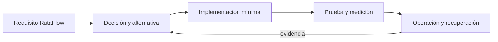

# Módulo 14: Compose Master: pruebas, accesibilidad y animación

## Aprende construyendo

### Tema 1: ComposeTestRule

**Conceptos clave:** propósito, modelo de ejecución, configuración, seguridad, coste, pruebas y operación.

ComposeTestRule se estudia como una decisión de ingeniería y no como una colección de comandos. Primero identifica el problema que resuelve y los límites de la plataforma; luego construye el incremento mínimo dentro de RutaFlow. Registra entradas, salidas, dependencias y condiciones de fallo. Compara al menos una alternativa y conserva la medición que justifica la elección. Si la tecnología es experimental, se aísla del camino estable y se documenta la estrategia de retirada.

En producción debes considerar configuración por ambiente, identidad de máquina y persona, secretos, compatibilidad, telemetría y recuperación. Una demostración exitosa no prueba comportamiento bajo concurrencia, reintentos, pérdida de red o datos inválidos. Por eso el laboratorio introduce un fallo deliberado y exige una prueba de regresión. El resultado debe poder repetirse desde terminal y CI sin pasos secretos del editor.

**Analogía:** es como incorporar una nueva estación a una red logística: no basta con construirla; hay que definir rutas, capacidad, controles, contingencias y cómo sabremos que funciona.

**¿Por qué es importante?** Porque ComposeTestRule aparece cuando el sistema crece y las decisiones dejan de ser locales. Comprender su coste evita adoptar una herramienta por popularidad o descartarla por una primera experiencia incompleta.

**Casos de uso reales:** operación normal, configuración inválida, dependencia lenta, solicitud duplicada, cambio incompatible y recuperación posterior a un despliegue fallido.

**Diagrama:**

### Tema 2: Finders, assertions y actions

**Conceptos clave:** propósito, modelo de ejecución, configuración, seguridad, coste, pruebas y operación.

Finders, assertions y actions se estudia como una decisión de ingeniería y no como una colección de comandos. Primero identifica el problema que resuelve y los límites de la plataforma; luego construye el incremento mínimo dentro de RutaFlow. Registra entradas, salidas, dependencias y condiciones de fallo. Compara al menos una alternativa y conserva la medición que justifica la elección. Si la tecnología es experimental, se aísla del camino estable y se documenta la estrategia de retirada.

En producción debes considerar configuración por ambiente, identidad de máquina y persona, secretos, compatibilidad, telemetría y recuperación. Una demostración exitosa no prueba comportamiento bajo concurrencia, reintentos, pérdida de red o datos inválidos. Por eso el laboratorio introduce un fallo deliberado y exige una prueba de regresión. El resultado debe poder repetirse desde terminal y CI sin pasos secretos del editor.

**Analogía:** es como incorporar una nueva estación a una red logística: no basta con construirla; hay que definir rutas, capacidad, controles, contingencias y cómo sabremos que funciona.

**¿Por qué es importante?** Porque Finders, assertions y actions aparece cuando el sistema crece y las decisiones dejan de ser locales. Comprender su coste evita adoptar una herramienta por popularidad o descartarla por una primera experiencia incompleta.

**Casos de uso reales:** operación normal, configuración inválida, dependencia lenta, solicitud duplicada, cambio incompatible y recuperación posterior a un despliegue fallido.

**Diagrama:**

### Tema 3: Semantics y clearAndSetSemantics

**Conceptos clave:** propósito, modelo de ejecución, configuración, seguridad, coste, pruebas y operación.

Semantics y clearAndSetSemantics se estudia como una decisión de ingeniería y no como una colección de comandos. Primero identifica el problema que resuelve y los límites de la plataforma; luego construye el incremento mínimo dentro de RutaFlow. Registra entradas, salidas, dependencias y condiciones de fallo. Compara al menos una alternativa y conserva la medición que justifica la elección. Si la tecnología es experimental, se aísla del camino estable y se documenta la estrategia de retirada.

En producción debes considerar configuración por ambiente, identidad de máquina y persona, secretos, compatibilidad, telemetría y recuperación. Una demostración exitosa no prueba comportamiento bajo concurrencia, reintentos, pérdida de red o datos inválidos. Por eso el laboratorio introduce un fallo deliberado y exige una prueba de regresión. El resultado debe poder repetirse desde terminal y CI sin pasos secretos del editor.

**Analogía:** es como incorporar una nueva estación a una red logística: no basta con construirla; hay que definir rutas, capacidad, controles, contingencias y cómo sabremos que funciona.

**¿Por qué es importante?** Porque Semantics y clearAndSetSemantics aparece cuando el sistema crece y las decisiones dejan de ser locales. Comprender su coste evita adoptar una herramienta por popularidad o descartarla por una primera experiencia incompleta.

**Casos de uso reales:** operación normal, configuración inválida, dependencia lenta, solicitud duplicada, cambio incompatible y recuperación posterior a un despliegue fallido.

**Diagrama:**

### Tema 4: AccessibilityService y TalkBack

**Conceptos clave:** propósito, modelo de ejecución, configuración, seguridad, coste, pruebas y operación.

AccessibilityService y TalkBack se estudia como una decisión de ingeniería y no como una colección de comandos. Primero identifica el problema que resuelve y los límites de la plataforma; luego construye el incremento mínimo dentro de RutaFlow. Registra entradas, salidas, dependencias y condiciones de fallo. Compara al menos una alternativa y conserva la medición que justifica la elección. Si la tecnología es experimental, se aísla del camino estable y se documenta la estrategia de retirada.

En producción debes considerar configuración por ambiente, identidad de máquina y persona, secretos, compatibilidad, telemetría y recuperación. Una demostración exitosa no prueba comportamiento bajo concurrencia, reintentos, pérdida de red o datos inválidos. Por eso el laboratorio introduce un fallo deliberado y exige una prueba de regresión. El resultado debe poder repetirse desde terminal y CI sin pasos secretos del editor.

**Analogía:** es como incorporar una nueva estación a una red logística: no basta con construirla; hay que definir rutas, capacidad, controles, contingencias y cómo sabremos que funciona.

**¿Por qué es importante?** Porque AccessibilityService y TalkBack aparece cuando el sistema crece y las decisiones dejan de ser locales. Comprender su coste evita adoptar una herramienta por popularidad o descartarla por una primera experiencia incompleta.

**Casos de uso reales:** operación normal, configuración inválida, dependencia lenta, solicitud duplicada, cambio incompatible y recuperación posterior a un despliegue fallido.

**Diagrama:**

### Tema 5: Animaciones de estado y visibilidad

**Conceptos clave:** propósito, modelo de ejecución, configuración, seguridad, coste, pruebas y operación.

Animaciones de estado y visibilidad se estudia como una decisión de ingeniería y no como una colección de comandos. Primero identifica el problema que resuelve y los límites de la plataforma; luego construye el incremento mínimo dentro de RutaFlow. Registra entradas, salidas, dependencias y condiciones de fallo. Compara al menos una alternativa y conserva la medición que justifica la elección. Si la tecnología es experimental, se aísla del camino estable y se documenta la estrategia de retirada.

En producción debes considerar configuración por ambiente, identidad de máquina y persona, secretos, compatibilidad, telemetría y recuperación. Una demostración exitosa no prueba comportamiento bajo concurrencia, reintentos, pérdida de red o datos inválidos. Por eso el laboratorio introduce un fallo deliberado y exige una prueba de regresión. El resultado debe poder repetirse desde terminal y CI sin pasos secretos del editor.

**Analogía:** es como incorporar una nueva estación a una red logística: no basta con construirla; hay que definir rutas, capacidad, controles, contingencias y cómo sabremos que funciona.

**¿Por qué es importante?** Porque Animaciones de estado y visibilidad aparece cuando el sistema crece y las decisiones dejan de ser locales. Comprender su coste evita adoptar una herramienta por popularidad o descartarla por una primera experiencia incompleta.

**Casos de uso reales:** operación normal, configuración inválida, dependencia lenta, solicitud duplicada, cambio incompatible y recuperación posterior a un despliegue fallido.

**Diagrama:**

### Tema 6: AnimatedContent y AnimationSpec

**Conceptos clave:** propósito, modelo de ejecución, configuración, seguridad, coste, pruebas y operación.

AnimatedContent y AnimationSpec se estudia como una decisión de ingeniería y no como una colección de comandos. Primero identifica el problema que resuelve y los límites de la plataforma; luego construye el incremento mínimo dentro de RutaFlow. Registra entradas, salidas, dependencias y condiciones de fallo. Compara al menos una alternativa y conserva la medición que justifica la elección. Si la tecnología es experimental, se aísla del camino estable y se documenta la estrategia de retirada.

En producción debes considerar configuración por ambiente, identidad de máquina y persona, secretos, compatibilidad, telemetría y recuperación. Una demostración exitosa no prueba comportamiento bajo concurrencia, reintentos, pérdida de red o datos inválidos. Por eso el laboratorio introduce un fallo deliberado y exige una prueba de regresión. El resultado debe poder repetirse desde terminal y CI sin pasos secretos del editor.

**Analogía:** es como incorporar una nueva estación a una red logística: no basta con construirla; hay que definir rutas, capacidad, controles, contingencias y cómo sabremos que funciona.

**¿Por qué es importante?** Porque AnimatedContent y AnimationSpec aparece cuando el sistema crece y las decisiones dejan de ser locales. Comprender su coste evita adoptar una herramienta por popularidad o descartarla por una primera experiencia incompleta.

**Casos de uso reales:** operación normal, configuración inválida, dependencia lenta, solicitud duplicada, cambio incompatible y recuperación posterior a un despliegue fallido.

**Diagrama:**

## Trazabilidad de la auditoría original

- **Pruebas en Compose**: cubierto mediante fundamento, laboratorio y evidencia del capítulo.
- **Accesibilidad en Compose**: cubierto mediante fundamento, laboratorio y evidencia del capítulo.
- **Animaciones en Compose**: cubierto mediante fundamento, laboratorio y evidencia del capítulo.
