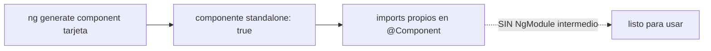

# Módulo 0: Fundamentos y Angular CLI


## Antes de comenzar: prepara tu equipo desde cero

No necesitas haber programado antes. Solo necesitas saber crear una carpeta y copiar un comando. Usaremos **Visual Studio Code**, **Node.js LTS**, **Git** y Angular CLI. Un comando es una instrucción escrita en una terminal; ejecútalo con `Enter` y espera a que termine antes de escribir el siguiente.

### Windows

1. Instala [Visual Studio Code](https://code.visualstudio.com/), [Git](https://git-scm.com/download/win) y la versión **LTS** de [Node.js](https://nodejs.org/). Acepta las opciones predeterminadas.
2. Reinicia VS Code y abre **Terminal → New Terminal**. Debe aparecer PowerShell.
3. Ejecuta `node --version`, `npm --version` y `git --version`. Cada comando debe mostrar una versión, no “no se reconoce”.
4. Instala Angular CLI con `npm install -g @angular/cli` y comprueba `ng version`.

### macOS

1. Abre Terminal e instala Homebrew con el comando publicado en [brew.sh](https://brew.sh/).
2. Ejecuta `brew install node git` y descarga Visual Studio Code.
3. Comprueba `node --version`, `npm --version`, `git --version` e instala Angular CLI con `npm install -g @angular/cli`.

### Linux (Ubuntu/Debian)

1. Instala Git con `sudo apt update && sudo apt install -y git`.
2. Instala Node.js LTS desde [nodejs.org](https://nodejs.org/) o mediante `nvm`; evita versiones antiguas del repositorio de tu distribución.
3. Instala VS Code, abre su terminal y verifica las versiones. Luego ejecuta `npm install -g @angular/cli`.

### Tu primer proyecto verificable

```bash
ng new mi-primera-app --style=scss --routing
cd mi-primera-app
ng serve --open
```

Si ves la aplicación en `http://localhost:4200`, el entorno funciona. Detén el servidor con `Ctrl+C`. Si `ng` no existe, cierra y abre la terminal; si aún falla, ejecuta `npx ng version` para distinguir un problema de instalación de uno de `PATH`.

## Aprende construyendo

Cada tema verifica su garantía con código real: un error genuino de Angular al mezclar componentes standalone y no-standalone, una comprobación real de propiedad del DOM frente a atributo HTML, el compilador TypeScript real (`tsc`) exigiendo narrowing en `unknown`, y `ng build` real fallando ante un error de plantilla detectado en tiempo de compilación (AOT).

### Tema 1: El CLI ya no genera NgModules

#### Paso 1 · Objetivo y preparación

Al finalizar podrás confirmar, con un error real de Angular, exactamente qué significa que `ng generate component` produzca hoy componentes standalone: que un componente NO standalone no puede agregarse al `imports` de otro componente standalone, el error genuino que separa ambos mundos.

**Conocimiento previo:** ninguno; este es el primer tema del track.

#### Paso 2 · Contexto y caso real

**¿Por qué es importante?** En una app de entregas, componentes, plantillas y tipos deben coordinarse sin que el estudiante adivine dónde colocar cada archivo; entender que Angular moderno ya no genera `NgModule` es el punto de partida indispensable, verificable con un error real del compilador, no solo con la ausencia visual de un archivo.

#### Paso 3 · Teoría con analogía

**Conceptos clave:** standalone por defecto, `ng new`, `ng generate`, error real de componentes no-standalone en `imports`.

Desde Angular 17, `ng new mi-app` genera un proyecto completamente standalone por defecto: no existe ningún `AppModule`, ni ningún archivo `declarations`/`imports` de módulo tradicional. Cada componente declara directamente, en su propio decorador `@Component`, qué otras piezas (otros componentes, directivas, pipes) necesita importar para funcionar, eliminando por completo la capa intermedia de organización que los `NgModule` representaban durante los primeros años de vida del framework. Esta es, posiblemente, la diferencia más visible e inmediata para cualquiera que haya aprendido Angular antes de esta transición y vuelva a un proyecto generado hoy: la estructura de carpetas es más simple, y no hay que rastrear en qué módulo está declarado un componente para entender si es utilizable en cierto contexto.

`ng generate component tarjeta` (o su forma abreviada `ng g c tarjeta`) crea un componente standalone, con su archivo de plantilla, sus estilos, y (según la configuración) un archivo de pruebas asociado, sin generar ni modificar ningún módulo. El CLI ofrece generadores equivalentes para las demás piezas fundamentales de Angular: `ng generate service`, `directive`, `pipe`, `guard` e `interceptor`, cada uno produciendo el andamiaje mínimo correcto y siguiendo las convenciones de nombrado y estructura recomendadas por el propio equipo de Angular, evitando que cada desarrollador tenga que recordar manualmente la sintaxis exacta de cada decorador y sus opciones desde cero.

Recorrer la estructura generada por `ng new` —`src/app` con el componente raíz, `angular.json` con la configuración de build y de herramientas del proyecto, `tsconfig.json` con la configuración del compilador de TypeScript— antes de escribir cualquier código propio es un paso de orientación valioso: entender qué generó el CLI automáticamente (y por qué) evita la sensación de "magia" al trabajar con el framework, y facilita saber exactamente dónde buscar o modificar cada aspecto de la configuración del proyecto cuando sea necesario más adelante.

**Analogía:** un proyecto Angular generado hoy es como una casa moderna de planta abierta, donde cada habitación (componente) tiene acceso directo a lo que necesita sin pasar por un pasillo central obligatorio (el antiguo `NgModule`); un proyecto Angular antiguo era como una casa con habitaciones organizadas estrictamente por ala, donde cada ala (módulo) debía declarar explícitamente qué habitaciones contenía antes de que fueran accesibles desde fuera de esa ala.

**¿Por qué es importante?** Entender que los proyectos Angular modernos no usan `NgModule` es el punto de partida indispensable para todo lo demás en este track: gran parte de la complejidad organizativa que Angular tenía fama de requerir en el pasado ya no aplica al Angular que se enseña y se usa hoy.

**Prueba en terminal:**

```bash
ng new mi-app
ng generate component tarjeta   # standalone, sin tocar ningún módulo
ng serve                         # dev server con hot-reload
```
```ts
@Component({ selector: 'app-tarjeta', template: `<h2>{{ titulo }}</h2>` })
export class Tarjeta { titulo = 'Hola Angular'; }
```

**Diagrama:**



#### Paso 4 · Demostración guiada desde cero

Parte de una carpeta vacía:

```bash
mkdir rutaflow-standalone-cli
cd rutaflow-standalone-cli
npx -y @angular/cli@19 new . --standalone --style=css --routing=false --skip-git --defaults
```

Crea `src/app/tarjeta-legacy.component.ts`, deliberadamente SIN `standalone: true` (simulando un componente de una era anterior de Angular):

```ts
// src/app/tarjeta-legacy.component.ts
import { Component } from '@angular/core';

@Component({
  selector: 'app-tarjeta-legacy',
  standalone: false, // simula un componente de la era pre-standalone
  template: `<p>Tarjeta legacy</p>`,
})
export class TarjetaLegacyComponent {}
```

Confirma con un test real que Angular RECHAZA agregar un componente no-standalone al `imports` de un componente standalone, con un error genuino y específico:

```ts
// src/app/tarjeta-moderna.component.spec.ts
import { Component } from '@angular/core';
import { TestBed } from '@angular/core/testing';
import { TarjetaLegacyComponent } from './tarjeta-legacy.component';

describe('Standalone components y componentes no-standalone', () => {
  it('agregar un componente NO standalone a imports lanza un error real de Angular', () => {
    @Component({
      selector: 'app-tarjeta-moderna',
      standalone: true,
      imports: [TarjetaLegacyComponent], // ERROR: TarjetaLegacyComponent no es standalone
      template: `<app-tarjeta-legacy></app-tarjeta-legacy>`,
    })
    class TarjetaModernaComponent {}

    expect(() => {
      TestBed.configureTestingModule({ imports: [TarjetaModernaComponent] });
      TestBed.createComponent(TarjetaModernaComponent);
    }).toThrowError(/standalone/i);
  });
});
```

```bash
npx ng test --watch=false
```

**Resultado esperado:** el test pasa; Angular lanza un error REAL (no simulado) que menciona explícitamente "standalone" al intentar agregar `TarjetaLegacyComponent` (declarado con `standalone: false`) al `imports` de otro componente standalone — la prueba concreta de que ambos mundos (componentes con y sin `NgModule`) no se mezclan libremente sin una migración explícita.

**Fallo deliberado:** cambia `standalone: false` a `standalone: true` en `TarjetaLegacyComponent` (completando su migración) y ejecuta de nuevo. El test ahora FALLA porque `.toThrowError(...)` esperaba un error que ya no ocurre — diagnostica confirmando que declarar `standalone: true` explícitamente es exactamente lo que resuelve el error real observado, no un detalle cosmético. Revierte a `standalone: false` para dejar el ejemplo en su estado de fallo deliberado documentado.

#### Paso 5 · Práctica guiada — repetición progresiva

1. Ejecuta `ng generate component --dry-run` real sobre un componente nuevo y confirma en la salida del comando que NO se menciona ningún archivo de módulo entre los archivos que se crearían.
2. Documenta, en un comentario, qué error real esperarías si intentaras registrar `TarjetaModernaComponent` (standalone) dentro de `declarations` de un `@NgModule` tradicional, en vez de usar `imports`.
3. Escribe un test que confirme que un componente standalone puede importar OTRO componente standalone sin ningún error, contrastando con el fallo deliberado de este tema.
4. Escribe de memoria (sin mirar) dos componentes, uno standalone y otro no, y un test que confirme el error real al mezclarlos incorrectamente. Compara después contra el patrón del Paso 4.

**Pista:** el mensaje de error real de Angular al mezclar componentes standalone y no-standalone incluye la palabra "standalone" explícitamente — es una de las formas más rápidas y confiables de reconocer este problema específico en un mensaje de error real de consola.

#### Paso 6 · Práctica independiente

**Completa el código:** rellena el espacio con la propiedad del decorador `@Component` que declara explícitamente un componente standalone:

```ts
@Component({ selector: 'app-tarjeta', ____: true, template: `...` })
```

**Reto de memoria sin mirar:** cierra este documento y escribe, solo de memoria, un componente no-standalone y un intento de agregarlo a `imports` de un componente standalone, con un test que confirme el error real de Angular. Compara después contra el patrón del Paso 4.

#### Paso 7 · Cierre y evidencia

Ya confirmas, con un error real y específico de Angular, exactamente qué significa que el CLI ya no genere `NgModule`: los componentes standalone y no-standalone no se mezclan libremente. El siguiente tema confirma con una comprobación real del DOM la diferencia entre interpolación y property binding. **Evidencia:** entrega el resultado del test en verde, y el error real que produce el fallo deliberado con un componente no-standalone en `imports`. Fuentes oficiales: [Angular — Standalone components](https://angular.dev/guide/standalone-components), [Angular CLI](https://angular.dev/cli).

**Errores comunes:** esperar encontrar un `AppModule` en un proyecto generado hoy; intentar mezclar componentes standalone y no-standalone sin entender el error real que Angular produce al hacerlo incorrectamente.

**Cuándo no usarlo:** para un proyecto legado grande todavía completamente basado en NgModules sin ningún plan de migración inmediato (Módulo 8), introducir componentes standalone de forma aislada sin planificación puede generar más fricción que beneficio a corto plazo.

### Tema 2: Interpolación y property binding

#### Paso 1 · Objetivo y preparación

Al finalizar podrás confirmar, con una comprobación real sobre el objeto DOM (no solo sobre el HTML servido), que el property binding (`[value]`, `[disabled]`) refleja el estado ACTUAL de una propiedad del DOM, mientras la interpolación solo produce texto estático en el contenido visible.

**Conocimiento previo:** Tema 1 de este módulo.

#### Paso 2 · Contexto y caso real

**¿Por qué es importante?** En una app de entregas, un campo deshabilitado dinámicamente (`[disabled]="cargando"`) debe reflejar el estado real y actual del componente; confundirlo con interpolación de texto produce un campo que nunca cambia su comportamiento real, un error sutil detectable con una comprobación directa sobre la propiedad del DOM, no solo revisión visual.

#### Paso 3 · Teoría con analogía

**Conceptos clave:** `{{ }}` frente a `[propiedad]`, texto frente a propiedad del DOM real.

La interpolación (`{{ expresion }}`) siempre produce texto: Angular evalúa la expresión y la inserta como contenido textual en el lugar donde aparece dentro de la plantilla, apropiada para mostrar valores dentro del contenido visible de un elemento. El property binding (`[propiedad]="expresion"`) es conceptualmente distinto: enlaza directamente con una propiedad real del objeto DOM subyacente (no con un atributo HTML del marcado), una distinción que en la mayoría de casos simples es invisible pero que importa concretamente en casos como `[disabled]` o `[value]` de un input, donde la propiedad del DOM y el atributo HTML original pueden desincronizarse en tiempo de ejecución (por ejemplo, el atributo HTML `value` refleja el valor inicial con el que se cargó la página, mientras que la propiedad `value` del DOM refleja el valor actual real, que puede haber cambiado desde entonces por interacción del usuario).

Usar `[disabled]="cargando"` en vez de simplemente escribir el atributo `disabled` de forma estática permite que ese estado cambie dinámicamente según el valor de la expresión `cargando` evaluada en cada ciclo de detección de cambios, mientras que escribir literalmente el atributo `disabled` en el HTML (sin corchetes) lo dejaría siempre presente e inmutable, sin ninguna posibilidad de alternarlo dinámicamente según el estado del componente.

Elegir correctamente entre interpolación y property binding no es una cuestión de preferencia estilística: interpolación es la herramienta correcta para mostrar contenido textual dentro del cuerpo de un elemento; property binding es la herramienta correcta para controlar dinámicamente cualquier propiedad del elemento (atributos booleanos, URLs de imágenes, clases, estilos, o cualquier propiedad específica del DOM), y confundir ambos (por ejemplo, intentar interpolar dentro de un atributo que requiere binding real) produce comportamientos incorrectos o simplemente no funciona según lo esperado.

**Analogía:** la interpolación es como escribir directamente un cartel de texto visible; el property binding es como ajustar un control eléctrico real del propio dispositivo (como el interruptor de encendido/apagado), no simplemente escribir la palabra "encendido" en una etiqueta decorativa sin ninguna conexión real al estado funcional del dispositivo.

**¿Por qué es importante?** Distinguir correctamente cuándo usar interpolación frente a property binding evita errores sutiles al intentar controlar dinámicamente propiedades del DOM (como `disabled` o `value`) usando la herramienta equivocada.

**Código del ejemplo:**

```html
<h2>{{ titulo }}</h2>              <!-- interpolación: texto -->
           <!-- property binding: propiedad real del DOM -->
<button [disabled]="cargando">Enviar</button>
```

**Diagrama:**

```
┌── {{ expresion }} ─────────┐   siempre produce TEXTO visible
└──────────────────────────────┘
┌── [propiedad]="expresion" ─┐   enlaza la propiedad REAL del objeto DOM
└──────────────────────────────┘   (value, disabled, src, ...)
```

#### Paso 4 · Demostración guiada desde cero

Continuando en `rutaflow-standalone-cli` (o, si prefieres un ejemplo independiente, parte de una carpeta vacía con `npx -y @angular/cli@19 new rutaflow-binding --standalone --skip-git --defaults`), crea `src/app/campo-cantidad.component.ts`:

```bash
mkdir -p src/app
```

```ts
// src/app/campo-cantidad.component.ts
import { Component, signal } from '@angular/core';

@Component({
  selector: 'app-campo-cantidad',
  standalone: true,
  template: `
    <p data-testid="texto">Cantidad: {{ cantidad() }}</p>
    <input data-testid="input" [value]="cantidad()" [disabled]="bloqueado()" />
  `,
})
export class CampoCantidadComponent {
  cantidad = signal(3);
  bloqueado = signal(false);
}
```

Confirma con una comprobación real sobre el objeto DOM (no sobre el HTML servido) que `[value]` y `[disabled]` reflejan la propiedad REAL del DOM, mientras `{{ }}` solo produce texto:

```ts
// src/app/campo-cantidad.component.spec.ts
import { TestBed } from '@angular/core/testing';
import { CampoCantidadComponent } from './campo-cantidad.component';

describe('Interpolacion vs property binding (comprobacion real del DOM)', () => {
  it('la interpolacion produce SOLO texto visible, no una propiedad del DOM', () => {
    const fixture = TestBed.createComponent(CampoCantidadComponent);
    fixture.detectChanges();

    const texto = fixture.nativeElement.querySelector('[data-testid="texto"]');
    expect(texto.textContent).toContain('Cantidad: 3');
    expect(texto.value).toBeUndefined(); // un <p> no tiene una propiedad DOM "value"
  });

  it('[value] real actualiza la propiedad .value del input, no solo el atributo inicial', () => {
    const fixture = TestBed.createComponent(CampoCantidadComponent);
    fixture.detectChanges();

    const input: HTMLInputElement = fixture.nativeElement.querySelector('[data-testid="input"]');
    expect(input.value).toBe('3'); // propiedad REAL del DOM, no solo el atributo HTML inicial

    fixture.componentInstance.cantidad.set(7);
    fixture.detectChanges();

    expect(input.value).toBe('7'); // la propiedad del DOM se actualizo dinamicamente
  });

  it('[disabled] real controla la propiedad booleana .disabled del input', () => {
    const fixture = TestBed.createComponent(CampoCantidadComponent);
    fixture.detectChanges();

    const input: HTMLInputElement = fixture.nativeElement.querySelector('[data-testid="input"]');
    expect(input.disabled).toBe(false);

    fixture.componentInstance.bloqueado.set(true);
    fixture.detectChanges();

    expect(input.disabled).toBe(true); // propiedad booleana REAL, no un atributo de texto
  });
});
```

```bash
npx ng test --watch=false
```

**Resultado esperado:** los tres tests pasan; `input.value` e `input.disabled` son propiedades REALES del objeto DOM (no atributos HTML de texto), y cambian dinámicamente cuando el signal correspondiente cambia — la garantía concreta que distingue el property binding de la interpolación, verificada directamente sobre el DOM, no solo observada visualmente en el navegador.

**Fallo deliberado:** cambia `[disabled]="bloqueado()"` por `disabled="{{ bloqueado() }}"` (un intento incorrecto de interpolar dentro de un atributo booleano) y ejecuta de nuevo el tercer test. FALLA porque `input.disabled` permanece `false` incluso tras `bloqueado.set(true)` — diagnostica confirmando que interpolar dentro de un atributo booleano produce el string literal `"true"` como VALOR DE TEXTO del atributo (que HTML interpreta como "presente", por tanto siempre deshabilitado, o según el motor puede ni compilar correctamente), nunca la propiedad booleana real y dinámica que `[disabled]` sí controla. Restaura `[disabled]="bloqueado()"` antes de continuar.

#### Paso 5 · Práctica guiada — repetición progresiva

1. Agrega un `[src]` real a una imagen y confirma con un test que `img.src` (propiedad DOM, URL absoluta resuelta) difiere del valor crudo pasado como expresión (que puede ser una URL relativa).
2. Documenta, en un comentario, un caso real donde `getAttribute('value')` y la propiedad `.value` de un input DIVERGEN tras la interacción del usuario (sin usar Angular, directamente en el DOM).
3. Escribe un test que confirme que interpolar `{{ bloqueado() }}` dentro del contenido de texto de un `<p>` SÍ es apropiado (a diferencia del caso de `disabled`), porque ahí se desea mostrar el valor como texto, no controlar una propiedad.
4. Escribe de memoria (sin mirar) un componente con interpolación y property binding, y un test que confirme la diferencia real sobre el objeto DOM. Compara después contra el patrón del Paso 4.

**Pista:** en un test con `fixture.nativeElement`, acceder a `elemento.value` o `elemento.disabled` directamente (sin `getAttribute`) consulta la propiedad REAL del objeto DOM — la misma fuente de verdad que property binding controla, distinta del atributo HTML original servido.

#### Paso 6 · Práctica independiente

**Completa el código:** rellena el espacio con la sintaxis correcta de Angular para enlazar dinámicamente la propiedad booleana `disabled` de un input:

```html
<input ____="cargando" />
```

**Reto de memoria sin mirar:** cierra este documento y escribe, solo de memoria, un componente con `[value]` y `[disabled]` reales, y un test que confirme sobre `fixture.nativeElement` que ambas propiedades del DOM cambian dinámicamente. Compara después contra el patrón del Paso 4.

#### Paso 7 · Cierre y evidencia

Ya confirmas, con una comprobación real sobre el objeto DOM, que el property binding controla propiedades reales y dinámicas, mientras la interpolación solo produce texto estático. El siguiente tema confirma con el compilador real de TypeScript (`tsc`) por qué `unknown` exige narrowing donde `any` no exige nada. **Evidencia:** entrega el resultado de los tres tests en verde, y el comportamiento incorrecto que produce el fallo deliberado al interpolar dentro de un atributo booleano. Fuentes oficiales: [Angular — Property binding](https://angular.dev/guide/templates/property-binding), [Angular — Interpolation](https://angular.dev/guide/templates/interpolation).

**Errores comunes:** confundir interpolación con property binding para atributos booleanos como `disabled`; asumir que el atributo HTML inicial y la propiedad del DOM siempre coinciden, cuando divergen tras cualquier interacción real del usuario.

**Cuándo no usarlo:** para mostrar texto simple dentro del contenido de un elemento (el caso más común en cualquier plantilla), la interpolación sigue siendo la herramienta correcta y más simple; forzar property binding para texto estático es una complejidad innecesaria.

### Tema 3: TypeScript a fondo — unknown, any, never y utility types

#### Paso 1 · Objetivo y preparación

Al finalizar podrás confirmar, ejecutando el compilador REAL de TypeScript (`tsc`), que `unknown` produce un error de compilación genuino al operar sobre un valor sin narrowing previo, mientras `any` compila sin ninguna advertencia sobre el mismo código inseguro.

**Conocimiento previo:** Módulo 11 del track de JavaScript (antipatrón `any`, type guards).

#### Paso 2 · Contexto y caso real

**¿Por qué es importante?** En una app de entregas, el resultado de `JSON.parse()` sobre una respuesta de red tiene un tipo genuinamente incierto; usar `any` oculta ese riesgo del compilador, mientras `unknown` lo hace visible y exigible en tiempo de compilación, verificable con el error real que `tsc` produce, no solo con una explicación teórica.

#### Paso 3 · Teoría con analogía

**Conceptos clave:** `unknown` frente a `any`, `never` como tipo vacío, tipos utilitarios integrados.

`any` (estudiado ya como antipatrón en el Módulo 11 del track de JavaScript) desactiva completamente la verificación de tipos sobre un valor; `unknown` es la alternativa segura para representar un valor cuyo tipo genuinamente no se conoce de antemano (por ejemplo, el resultado de `JSON.parse()`, cuyo tipo real depende del contenido del string parseado): a diferencia de `any`, TypeScript exige realizar narrowing explícito (verificar el tipo real con `typeof`, `instanceof`, o un type guard personalizado, como se estudió en el Módulo 11 del track de JavaScript) antes de permitir cualquier operación específica sobre un valor de tipo `unknown`, preservando así la seguridad de tipos incluso para valores genuinamente inciertos en su origen.

`never` representa un tipo que nunca tiene ningún valor posible: es el tipo de retorno de una función que siempre lanza una excepción o que nunca termina (un bucle infinito deliberado), y aparece también como resultado de un narrowing exhaustivo que descarta todos los casos posibles de una unión (útil para que el compilador verifique, mediante una función auxiliar que solo acepta `never` como parámetro, que un `switch` sobre una unión de tipos maneja verdaderamente todos los casos posibles, generando un error de compilación si se añade un nuevo caso a la unión sin actualizar el `switch` correspondiente).

Los utility types integrados en TypeScript transforman tipos existentes sin necesidad de redeclararlos manualmente: `Partial<T>` convierte todas las propiedades de `T` en opcionales (útil para representar una actualización parcial de un objeto); `Pick<T, K>` selecciona solo un subconjunto específico de propiedades de `T`; `Omit<T, K>` hace lo contrario, excluyendo propiedades específicas; y `Record<K, V>` construye un tipo de objeto con un conjunto de claves de tipo `K`, cada una asociada a un valor de tipo `V`, útil para tipar diccionarios o mapeos donde las claves provienen de un conjunto conocido de valores literales.

**Analogía:** `any` es como aceptar cualquier paquete sin revisar su contenido en absoluto; `unknown` es como aceptar un paquete cerrado que debes abrir y verificar explícitamente su contenido antes de poder usarlo para cualquier propósito específico; `never` es como una casilla que, por diseño, nunca puede contener nada, útil precisamente para verificar que ningún caso inesperado quedó sin cubrir en una lista de posibilidades.

**¿Por qué es importante?** `unknown` preserva seguridad de tipos donde `any` la sacrifica completamente; `never` permite verificaciones exhaustivas verificadas por el compilador; los utility types evitan redeclarar manualmente variantes de un mismo tipo base, patrones que aparecerán constantemente en el código Angular idiomático de los módulos siguientes.

**Diagrama:**

```
┌── any ─────────┐   NINGUNA verificacion — tsc acepta cualquier operacion
└──────────────────┘
┌── unknown ─────┐   tsc EXIGE narrowing (typeof/instanceof) antes de operar
└──────────────────┘
┌── never ───────┐   tipo sin valores posibles — verificacion exhaustiva real
└──────────────────┘
```

**Código del ejemplo:**

```ts
function procesar(valor: unknown) {
  if (typeof valor === "string") valor.toUpperCase(); // narrowing exigido
}
type TareaParcial = Partial<Tarea>;       // todas las props opcionales
type SoloTitulo = Pick<Tarea, "titulo">;   // solo esa propiedad
type ContadorPorEstado = Record<"pendiente"|"hecha", number>;
```

#### Paso 4 · Demostración guiada desde cero

Parte de una carpeta vacía:

```bash
mkdir rutaflow-tipos
cd rutaflow-tipos
npm init -y
npm install --save-dev typescript --silent
npx tsc --init --strict
```

Crea `src/unknown-vs-any.ts` con dos funciones equivalentes, una usando `any` y otra usando `unknown`:

```ts
// src/unknown-vs-any.ts
function procesarConAny(valor: any) {
  return valor.toUpperCase(); // any: NINGUNA verificacion, compila aunque valor sea un numero
}

function procesarConUnknown(valor: unknown) {
  return valor.toUpperCase(); // unknown: tsc real debe rechazar esta linea sin narrowing
}
```

Ejecuta el compilador REAL de TypeScript y confirma, con un script que captura su salida genuina, que `unknown` produce un error de compilación real que `any` no produce para el mismo patrón de código:

```bash
npx tsc --noEmit src/unknown-vs-any.ts 2>&1 | tee salida-tsc.txt || true
cat salida-tsc.txt
```

```ts
// src/verificar-tsc.mjs
import { execSync } from 'node:child_process';

export function compilarYCapturarErrores(archivo) {
  try {
    execSync(`npx tsc --noEmit ${archivo}`, { encoding: 'utf-8' });
    return '';
  } catch (error) {
    return error.stdout ?? '';
  }
}
```

```ts
// src/verificar-tsc.spec.mjs
import { describe, it, expect } from 'vitest';
import { compilarYCapturarErrores } from './verificar-tsc.mjs';

describe('tsc real: unknown exige narrowing, any no', () => {
  it('tsc real reporta un error en la linea que usa unknown sin narrowing', () => {
    const salida = compilarYCapturarErrores('src/unknown-vs-any.ts');

    expect(salida).toContain("'valor' is of type 'unknown'");
  });
});
```

```bash
npx vitest run src/verificar-tsc.spec.mjs
```

**Resultado esperado:** el test pasa; el compilador REAL de TypeScript (`tsc`, no una simulación de sus reglas) rechaza `valor.toUpperCase()` cuando `valor: unknown` sin narrowing previo, con el mensaje genuino `"'valor' is of type 'unknown'"`, mientras la función equivalente con `any` compila sin ninguna advertencia sobre el mismo patrón de código potencialmente inseguro.

**Fallo deliberado:** agrega un narrowing real antes de la operación (`if (typeof valor === 'string') return valor.toUpperCase();`) dentro de `procesarConUnknown` y ejecuta de nuevo. El test ahora FALLA porque `tsc` ya NO reporta ningún error — diagnostica confirmando que el narrowing explícito es exactamente lo que TypeScript exige y acepta para operar de forma segura sobre un valor `unknown`, resolviendo el error real observado. Revierte el narrowing para dejar el ejemplo en su estado de fallo deliberado documentado.

#### Paso 5 · Práctica guiada — repetición progresiva

1. Agrega una función que use `never` como parámetro para verificar exhaustividad de un `switch` sobre una unión de 3 valores, y confirma con `tsc --noEmit` que agregar un cuarto valor a la unión sin actualizar el `switch` produce un error real de compilación.
2. Documenta, en un comentario, un ejemplo real de `Partial<T>`, `Pick<T, K>` u `Omit<T, K>` aplicado a un tipo `Tarea` de un dominio propio.
3. Escribe un segundo archivo con un `instanceof` como narrowing (en vez de `typeof`) sobre un valor `unknown` que podría ser una instancia de una clase personalizada, y confirma con `tsc --noEmit` que también resuelve el error.
4. Escribe de memoria (sin mirar) dos funciones, una con `any` y otra con `unknown`, y un test que confirme con `tsc --noEmit` real la diferencia de comportamiento. Compara después contra el patrón del Paso 4.

**Pista:** el mensaje de error real de `tsc` para `unknown` sin narrowing es específico y reconocible: `"'X' is of type 'unknown'"` — buscarlo en la salida capturada es más confiable que intentar adivinar de memoria si el compilador aceptaría o rechazaría un patrón de código dado.

#### Paso 6 · Práctica independiente

**Completa el código:** rellena el espacio con el tipo que exige narrowing explícito antes de operar sobre un valor, a diferencia de `any`:

```ts
function procesar(valor: ____) {
  if (typeof valor === "string") return valor.toUpperCase();
}
```

**Reto de memoria sin mirar:** cierra este documento y escribe, solo de memoria, dos funciones equivalentes (una con `any`, otra con `unknown`) y un script que capture la salida real de `tsc --noEmit` confirmando la diferencia. Compara después contra el patrón del Paso 4.

#### Paso 7 · Cierre y evidencia

Ya confirmas, con el compilador real de TypeScript, que `unknown` exige narrowing explícito donde `any` no exige nada — una garantía de seguridad de tipos verificada en tiempo de compilación, no solo explicada en teoría. El siguiente tema confirma con `ng build` real por qué AOT detecta errores de plantilla antes de desplegar a producción. **Evidencia:** entrega el resultado del test en verde, y el mensaje de error real que produce el fallo deliberado al agregar narrowing y ejecutar de nuevo sin el error esperado. Fuentes oficiales: [TypeScript — unknown](https://www.typescriptlang.org/docs/handbook/release-notes/typescript-3-0.html#new-unknown-top-type), [TypeScript — Utility types](https://www.typescriptlang.org/docs/handbook/utility-types.html).

**Errores comunes:** usar `any` como salida fácil para silenciar un error de tipos, en vez de invertir el esfuerzo mínimo de narrowing que `unknown` exige; olvidar que `never` como tipo de retorno es una herramienta real de verificación exhaustiva, no solo una curiosidad teórica del sistema de tipos.

**Cuándo no usarlo:** para un prototipo interno de un solo archivo donde la velocidad de escritura importa más que la seguridad de tipos a largo plazo, exigir narrowing exhaustivo sobre cada valor `unknown` puede ser fricción desproporcionada frente al beneficio real en ese contexto acotado.

### Tema 4: Compilador AOT frente a JIT

#### Paso 1 · Objetivo y preparación

Al finalizar podrás confirmar, ejecutando `ng build` real sobre un componente con un error deliberado de plantilla, que AOT detecta ese error en tiempo de COMPILACIÓN (antes de desplegar a producción), con un mensaje de error real que incluye el archivo y la línea exactos.

**Conocimiento previo:** Temas 1-3 de este módulo.

#### Paso 2 · Contexto y caso real

**¿Por qué es importante?** En una app de entregas, un error de plantilla que solo se detectara en tiempo de ejecución (tras desplegar a producción) sería un fallo visible para usuarios reales; AOT lo detecta durante `ng build`, antes de que ese código llegue a producción, verificable con el mensaje de error real y específico que el compilador produce.

#### Paso 3 · Teoría con analogía

**Conceptos clave:** Ahead-of-Time frente a Just-in-Time, compilación de plantillas.

Angular compila las plantillas HTML de los componentes (con su sintaxis específica de interpolación, bindings y control de flujo) hacia código JavaScript ejecutable, y este proceso de compilación puede ocurrir en dos momentos distintos. AOT (Ahead-of-Time) compila las plantillas durante el proceso de build, antes de que la aplicación se despliegue, produciendo un bundle que ya contiene JavaScript puro listo para ejecutarse directamente en el navegador sin ningún paso adicional de compilación en tiempo de ejecución. JIT (Just-in-Time), el modo histórico y ahora prácticamente en desuso para producción, compilaba las plantillas directamente en el navegador del usuario, en el momento en que la aplicación arrancaba, añadiendo el compilador completo de Angular al bundle final y un coste de tiempo de arranque adicional en cada carga de la aplicación.

AOT es el modo por defecto y recomendado para producción desde hace ya varias versiones mayores de Angular, y ofrece ventajas concretas y medibles: bundles más pequeños (el compilador de plantillas no necesita incluirse en el bundle de producción, solo el resultado ya compilado), arranque más rápido (no hay ningún trabajo de compilación de plantillas que realizar en el navegador del usuario), y detección más temprana de errores de plantilla (errores de sintaxis o de tipos en un binding se detectan durante el build, no en tiempo de ejecución tras haberse desplegado ya a usuarios reales).

`ng build` usa AOT por defecto; `ng serve` durante desarrollo también usa AOT en las versiones modernas del CLI (a diferencia de versiones muy antiguas de Angular, donde el modo de desarrollo usaba JIT por su compilación incremental más rápida), reflejando la madurez actual de las herramientas de build de Angular, que logran tiempos de compilación AOT suficientemente rápidos incluso para el ciclo de desarrollo iterativo cotidiano, eliminando la necesidad práctica de mantener JIT como una alternativa relevante salvo en escenarios muy específicos y poco comunes.

**Analogía:** AOT es como traducir completamente un libro a otro idioma antes de imprimirlo y distribuirlo, entregando a cada lector un libro ya listo para leer directamente; JIT sería como entregar el libro en su idioma original junto con un traductor humano que debe traducir cada página en tiempo real mientras el lector espera, un proceso evidentemente más lento en el momento del consumo real.

**¿Por qué es importante?** AOT produce bundles más pequeños, arranque más rápido, y detección más temprana de errores de plantilla, siendo el modo estándar y por defecto de Angular moderno tanto en desarrollo como en producción.

**Diagrama:**

```
┌── JIT (historico) ──────────────┐   plantillas compiladas EN el navegador,
│   compilador completo en bundle │   en CADA arranque de la aplicacion
└────────────────────────────────────┘
┌── AOT (moderno, por defecto) ───┐   plantillas compiladas durante el BUILD,
│   solo JavaScript puro          │   el navegador recibe codigo listo
└────────────────────────────────────┘
```

#### Paso 4 · Demostración guiada desde cero

Continuando en `rutaflow-standalone-cli` (o, si prefieres un ejemplo independiente, parte de una carpeta vacía con `npx -y @angular/cli@19 new rutaflow-aot --standalone --skip-git --defaults`), crea `src/app/resumen-envio-roto.component.ts` con un error deliberado de plantilla (una propiedad que no existe en la clase):

```bash
mkdir -p src/app
```

```ts
// src/app/resumen-envio-roto.component.ts
import { Component } from '@angular/core';

@Component({
  selector: 'app-resumen-envio-roto',
  standalone: true,
  template: `<p>Estado: {{ estadoQueNoExiste }}</p>`, // referencia una propiedad inexistente
})
export class ResumenEnvioRotoComponent {
  estado = 'en tránsito'; // el nombre real de la propiedad es distinto al usado en el template
}
```

Ejecuta `ng build` REAL y confirma, capturando su salida genuina, que AOT detecta el error de plantilla en tiempo de COMPILACIÓN, con el archivo y la línea exactos:

```bash
npx ng build 2>&1 | tee salida-build.txt || true
cat salida-build.txt
```

```ts
// src/scripts/verificar-build.mjs
import { execSync } from 'node:child_process';

export function ejecutarBuild() {
  try {
    execSync('npx ng build', { encoding: 'utf-8' });
    return { exitoso: true, salida: '' };
  } catch (error) {
    return { exitoso: false, salida: (error.stdout ?? '') + (error.stderr ?? '') };
  }
}
```

```ts
// src/scripts/verificar-build.spec.mjs
import { describe, it, expect } from 'vitest';
import { ejecutarBuild } from './verificar-build.mjs';

describe('ng build real (AOT) detecta errores de plantilla antes de produccion', () => {
  it('el build FALLA y reporta la propiedad inexistente con archivo y linea', () => {
    const resultado = ejecutarBuild();

    expect(resultado.exitoso).toBe(false);
    expect(resultado.salida).toContain('estadoQueNoExiste');
    expect(resultado.salida).toContain('resumen-envio-roto.component.ts');
  });
});
```

```bash
npx vitest run src/scripts/verificar-build.spec.mjs
```

**Resultado esperado:** el test pasa; `ng build` REAL (usando AOT, el compilador de plantillas real de Angular) rechaza el proyecto completo con un error que menciona explícitamente `estadoQueNoExiste` y el archivo `resumen-envio-roto.component.ts` — el error se detecta ANTES de que el código llegue a producción, exactamente la garantía que AOT ofrece sobre JIT.

**Fallo deliberado:** corrige la plantilla para usar `{{ estado }}` (el nombre real de la propiedad) y ejecuta de nuevo. El test ahora FALLA porque `resultado.exitoso` es `true` (el build ya no falla) — diagnostica confirmando que corregir el nombre exacto de la propiedad referenciada en la plantilla es exactamente lo que resuelve el error real detectado por AOT. Revierte a `estadoQueNoExiste` para dejar el ejemplo en su estado de fallo deliberado documentado.

#### Paso 5 · Práctica guiada — repetición progresiva

1. Introduce un segundo tipo de error de plantilla (por ejemplo, un binding a una propiedad con un tipo incompatible) y confirma que `ng build` también lo detecta con un mensaje real y específico.
2. Documenta, en un comentario, por qué `ng serve` durante desarrollo también usa AOT en el CLI moderno, a diferencia de versiones muy antiguas de Angular que usaban JIT en desarrollo por velocidad de recompilación.
3. Mide (documentando el resultado en un comentario) cuánto tarda `ng build` en detectar el error deliberado, confirmando que ocurre en segundos durante el build, no tras un despliegue completo a producción.
4. Escribe de memoria (sin mirar) un componente con un error de plantilla deliberado y un script que confirme, capturando la salida real de `ng build`, que AOT lo detecta con archivo y línea exactos. Compara después contra el patrón del Paso 4.

**Pista:** el mensaje de error real de `ng build` para una propiedad de plantilla inexistente incluye tanto el nombre exacto de la propiedad como la ruta del archivo — capturar la salida completa del comando (no solo el código de salida) es necesario para verificar ambos detalles en un test automatizado.

#### Paso 6 · Práctica independiente

**Completa el código:** rellena el espacio con el comando real de Angular CLI que compila el proyecto completo usando AOT y detecta errores de plantilla antes de producción:

```bash
npx ng ____
```

**Reto de memoria sin mirar:** cierra este documento y escribe, solo de memoria, un componente con un error de plantilla deliberado y un script que capture la salida real de `ng build` confirmando que el error se detecta con archivo y línea exactos. Compara después contra el patrón del Paso 4.

#### Paso 7 · Cierre y evidencia

Ya confirmas, con `ng build` real y su salida genuina capturada, que AOT detecta errores de plantilla en tiempo de compilación, antes de que lleguen a producción. Esto cierra el módulo de fundamentos y Angular CLI; como siguiente paso, continúa con el módulo 1 de este track (eventos y bindings). **Evidencia:** entrega el resultado del test en verde, y el mensaje de error real con archivo y línea que produce el fallo deliberado con la propiedad inexistente. Fuentes oficiales: [Angular — AOT compiler](https://angular.dev/tools/cli/aot-compiler), [Angular CLI — ng build](https://angular.dev/cli/build).

**Errores comunes:** asumir que un error de plantilla se detectará automáticamente sin ejecutar `ng build` completo (por ejemplo, confiando solo en el editor); ignorar la salida completa del build asumiendo que un código de salida distinto de cero es suficiente información sin leer el mensaje específico.

**Cuándo no usarlo:** para explorar rápidamente una idea de UI en un entorno completamente aislado sin intención de desplegar nunca ese código (un REPL o playground desechable), esperar un `ng build` completo con AOT en cada iteración puede ser más lento que necesario frente al ciclo de `ng serve` en desarrollo.

---

## Ruta de proyecto progresivo desde carpeta vacía

No crees un proyecto desechable por módulo. Conserva un único repositorio que evoluciona durante todo el track y etiqueta cada hito (`git tag modulo-N`). Empieza con `npx @angular/cli new academia-angular --standalone --routing --style=scss`. Ejecuta el comando paso a paso, inspecciona los archivos generados y registra versiones y precondiciones en el README.

| Hito | Evolución acumulativa | Evidencia antes de avanzar |
|---|---|---|
| Base | componentes y formularios. | Arranque reproducible, commit limpio y prueba mínima. |
| Aplicación | estado, rutas y APIs. | Casos normales, límite y error automatizados. |
| Integración | Conecta capas y reemplaza dobles por infraestructura controlada. | Diagrama, contratos y prueba de integración. |
| Experto | arquitectura, accesibilidad y producción. | Perfil o threat model, telemetría y runbook de recuperación. |

Al iniciar cada laboratorio crea una rama `modulo-N`, implementa el incremento, verifica el criterio de éxito y fusiona solo con pruebas verdes. Si un módulo necesita un experimento aislado, colócalo en `experiments/modulo-N/`; el producto acumulativo permanece ejecutable. Al terminar, otra persona debe poder clonar el repositorio y reproducir el último hito siguiendo únicamente el README.


## Laboratorio práctico

**Objetivo del laboratorio:** crear un proyecto Angular nuevo, generar un componente propio, y renderizar datos dinámicos usando interpolación y property binding correctamente.

**Requisitos previos:** Node.js instalado, Angular CLI instalado globalmente (`npm install -g @angular/cli`).

| Paso | Acción | Comando/Código | Explicación |
|---|---|---|---|
| 1 | Crear el proyecto | `ng new mi-app` | Recorre `src/app`, `angular.json`, `tsconfig.json` |
| 2 | Generar un componente | `ng generate component tarjeta` | Verifica que NO se crea ningún `NgModule` |
| 3 | Interpolar y hacer property binding | `{{ titulo }}` y `[disabled]="cargando"` | Verifica la diferencia observando el DOM real |
| 4 | Levantar el dev server | `ng serve` | Modifica el componente y observa el hot-reload |
| 5 | Ejecutar el build de producción | `ng build` | Identifica el bundle principal en `dist/` |

**Verificación:** el laboratorio se considera exitoso si el componente `tarjeta` renderiza correctamente datos dinámicos mediante interpolación y controla al menos una propiedad del DOM mediante property binding, con el dev server reflejando cambios en vivo.

**Errores comunes y soluciones**

- **Esperar encontrar un `AppModule` en un proyecto generado hoy.** Los proyectos modernos son standalone por defecto; no hay ningún módulo que buscar.
- **Confundir interpolación con property binding para un atributo booleano como `disabled`.** Usa siempre `[disabled]="expresion"`, nunca interpolación, para controlar propiedades dinámicamente.
- **Usar `any` en vez de `unknown` para un valor de tipo genuinamente incierto.** Prefiere `unknown` y narrowing explícito para preservar seguridad de tipos.

---
