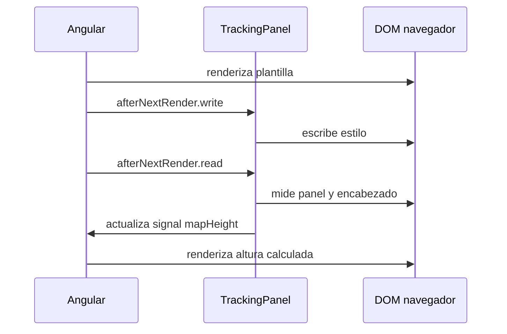

# Módulo 1: Componentes, plantillas y data binding

## Sílabo

**Objetivo general**

Dominar el componente como unidad básica de Angular: inputs y outputs basados en signals, la sintaxis de control de flujo nativa, content projection, y el ciclo de vida completo de un componente.

**Objetivos específicos**

1. Definir inputs y outputs con `input()`/`output()` basados en signals.
2. Reemplazar `*ngIf`/`*ngFor` por la sintaxis nativa `@if`/`@for`/`@switch`, usando `track` correctamente.
3. Implementar content projection con `<ng-content>`.
4. Explicar el ciclo de vida completo de un componente y cuándo se invoca cada hook.
5. Usar pipes integrados y crear un pipe personalizado.
6. Consultar elementos con `viewChild()` y medir el DOM en una fase de render segura.

**Contenido**

- `@Input`/`@Output` e `input()`/`output()` basados en signals.
- Control de flujo nativo (`@if`/`@for`/`@switch`).
- Content projection (`ng-content`).
- Ciclo de vida de un componente.
- Hooks completos: `ngOnChanges`, `ngDoCheck`, `ngAfterContentInit/Checked`, `ngAfterViewInit/Checked`.
- Pipes integrados (Date, Currency, Async, Json) y pipes personalizados con `@Pipe`.
- `ngClass`, `ngStyle` y directivas personalizadas.
- Consultas signal (`viewChild`/`contentChild`) y callbacks `afterNextRender`.

**Evaluación**

Un componente reutilizable con consultas signal y medición posterior al render, más cuatro ejercicios de evaluación.

---

## Comienza desde cero: prepara este capítulo

Este recorrido parte de una carpeta vacía. Al finalizar tendrás **Un componente reutilizable con consultas signal y medición posterior al render, más cuatro ejercicios de evaluación.** No avances ejecutando comandos que no comprendes: primero identifica la entrada, la transformación y la evidencia que comprobará el resultado.

### 1. Comprueba las herramientas

Los comandos funcionan en macOS, Linux y WSL. En PowerShell usa el equivalente indicado por la herramienta.

```bash
node --version
npm --version
npx ng version
```

Si un comando no existe, detente e instala esa herramienta desde su sitio oficial. Cierra y abre la terminal después de modificar `PATH`. Las versiones deben ser compatibles entre sí antes de crear archivos.

### 2. Crea o recupera el proyecto del track

```bash
npx @angular/cli@latest new academia-labs/angular-app --standalone --routing --style=scss
cd academia-labs/angular-app
git init
```

Trabaja dentro de `academia-labs/angular-app`. Si ya existe, no lo vuelvas a generar: entra en la carpeta, confirma `git status` y continúa sobre una rama propia.

### 3. Ubica cada tema antes de escribir

```text
academia-labs/angular-app/
├─ src/app/features/
│  └─ module-1/
├─ tests/
├─ docs/decisions/
├─ evidence/module-1/
└─ README.md
```

| Tema | Archivo o decisión | Evidencia mínima |
|---|---|---|
| 1. input()/output() basados en signals | `src/app/features/module-1/topic-1-input-output-basados-en-signals.ts` | prueba + salida observable |
| 2. Control de flujo nativo — @if, @for, @switch | `src/app/features/module-1/topic-2-control-de-flujo-nativo-if-for-switch.ts` | prueba + salida observable |
| 3. Content projection con ng-content | `src/app/features/module-1/topic-3-content-projection-con-ng-content.ts` | prueba + salida observable |
| 4. Ciclo de vida completo de un componente | `src/app/features/module-1/topic-4-ciclo-de-vida-completo-de-un-componente.ts` | prueba + salida observable |
| 5. Consultas signal y trabajo posterior al render | `src/app/features/module-1/topic-5-consultas-signal-y-trabajo-posterior-al-render.ts` | prueba + salida observable |

Un ejemplo técnico vive en el archivo indicado y debe tener una prueba. Un tema conceptual vive en `docs/decisions/`: compara opciones usando restricciones medibles; no escribas código decorativo solo para llenar espacio.

### 4. Ejecuta una línea base

Desde `academia-labs/angular-app`:

```bash
npm test -- --watch=false && npm start
```

**Resultado esperado:** el comando reconoce el proyecto y termina sin errores antes de introducir el cambio del capítulo. Después del incremento, la evidencia debe demostrar: **Un componente reutilizable con consultas signal y medición posterior al render, más cuatro ejercicios de evaluación.**

Si falla la línea base, no continúes. Localiza el primer mensaje que indique archivo, línea o dependencia; formula una causa y compruébala con un cambio pequeño.

### 5. Provoca un fallo y recupérate

Simula un estado vacío o un error HTTP y comprueba que la interfaz muestre recuperación y no una pantalla ambigua. Guarda en `evidence/module-1/` el comando, la salida relevante, tu hipótesis y la corrección. Revierte únicamente el cambio deliberado; no borres todo el proyecto para ocultar la causa.

### 6. Conecta el capítulo con RutaFlow

Aplica el aprendizaje de **Componentes, plantillas y data binding** a un incremento vertical de RutaFlow. Define qué componente produce el dato, qué contrato lo transporta, quién lo consume y cómo observarás un fallo. La entrega final incluye archivo o decisión, prueba, salida, error corregido y una limitación que todavía validarías en producción.

---

## Contenido teórico

### Tema 1: input()/output() basados en signals

**Conceptos clave:** `input()`, `input.required()`, `output()`, comparación con los decoradores clásicos.

`input()` y `output()`, las funciones modernas para declarar propiedades de entrada y salida de un componente, reemplazan a los decoradores clásicos `@Input()` y `@Output()` con una integración nativa con el modelo de signals estudiado en profundidad en el Módulo 2. `titulo = input.required<string>();` declara un input obligatorio de tipo `string` (el componente padre debe proporcionarlo, o Angular lanza un error de compilación de plantilla si se omite), accesible dentro del componente como una función de lectura reactiva (`titulo()`, con paréntesis, exactamente como cualquier signal), en vez de una propiedad de clase simple que los decoradores clásicos exponían directamente sin necesidad de invocarla como función.

Esta integración con signals significa que un input declarado con `input()` participa directamente en el grafo de reactividad de signals: un `computed()` que depende de `titulo()` se recalcula automáticamente cuando el valor del input cambia, exactamente con la misma semántica que cualquier otro signal, sin necesidad de ningún mecanismo adicional de detección de cambios específico para inputs, a diferencia del modelo anterior donde `@Input` era una propiedad de clase ordinaria que dependía del ciclo de detección de cambios general de Angular (o del hook `ngOnChanges`, Tema 4) para reaccionar a sus cambios.

`output()` reemplaza a `@Output() evento = new EventEmitter<T>();` con una sintaxis más concisa: `seleccionar = output<void>();`, emitiendo valores con `seleccionar.emit()` exactamente igual que un `EventEmitter` clásico, y consumido desde el componente padre con la misma sintaxis de binding de eventos (`(seleccionar)="manejador()"`) que ya existía para `@Output`. La ventaja principal de `output()` sobre `@Output` no es tanto una diferencia funcional dramática como una consistencia de API y de estilo con `input()`, ambos como funciones en vez de decoradores, reflejando la dirección general de Angular moderno hacia APIs basadas en funciones en vez de decoradores donde sea razonable.

**Analogía:** `input()` es como una ranura de entrada claramente etiquetada y obligatoria (si se declara `required`) en un formulario, que el remitente (el componente padre) debe rellenar antes de que el formulario se procese; `output()` es como un buzón de salida desde el que el componente puede enviar notificaciones hacia quien esté escuchando, sin necesidad de saber de antemano quién las recibirá ni cuántos destinatarios habrá.

**¿Por qué es importante?** `input()`/`output()` integran nativamente los inputs y outputs de un componente con el grafo de reactividad de signals, simplificando el modelo mental general de reactividad de Angular al usar un único mecanismo consistente (signals) en vez de mezclar propiedades de clase ordinarias con el sistema de detección de cambios tradicional.

**Diagrama:**

```ts
@Component({ selector: 'app-tarjeta', template: `
  <h2>{{ titulo() }}</h2>
  <button (click)="seleccionar.emit()">Ver más</button>
`})
export class Tarjeta {
  titulo = input.required<string>();
  seleccionar = output<void>();
}
```
```html
<app-tarjeta [titulo]="'Mi tarea'" (seleccionar)="abrirDetalle()" />
```

### Tema 2: Control de flujo nativo — @if, @for, @switch

**Conceptos clave:** sintaxis de bloque integrada, `track`, rendimiento de listas.

Angular introdujo una sintaxis de control de flujo nativa e integrada directamente en el propio lenguaje de plantillas (`@if`, `@for`, `@switch`), reemplazando las directivas estructurales clásicas (`*ngIf`, `*ngFor`, `*ngSwitch`) que dependían de un mecanismo más indirecto basado en la sintaxis de asterisco y microsintaxis específica de Angular. La nueva sintaxis se lee de forma más natural y cercana a bloques de control de flujo de cualquier lenguaje de programación convencional (`@if (condicion) {...} @else {...}`), y el compilador de Angular puede optimizar mejor el código generado al tener una comprensión más directa y explícita de la estructura de control de flujo, en vez de tener que interpretar la microsintaxis de las directivas estructurales clásicas.

`@for (tarea of tareas(); track tarea.id) {...}` exige (o recomienda con fuerza suficiente como para considerarlo prácticamente obligatorio en la práctica) una expresión `track`, que le indica a Angular cómo identificar de forma única cada elemento de la lista entre actualizaciones sucesivas: cuando la lista cambia (se añade, elimina o reordena un elemento), Angular usa el valor de `track` para determinar qué elementos del DOM ya existentes corresponden a elementos que persisten en la nueva versión de la lista (y por tanto pueden reutilizarse sin volver a crearlos), en vez de destruir y recrear todos los elementos del DOM de la lista completa en cada actualización, una optimización de rendimiento con impacto directo y medible especialmente en listas largas que cambian con frecuencia.

Usar `track tarea.id` (un identificador único y estable de cada elemento) en vez del valor por defecto menos óptimo (`track $index`, la posición del elemento en el array, que cambia si el orden de la lista se reordena aunque el elemento en sí no haya cambiado realmente) es la práctica correcta casi siempre que los datos tengan un identificador único disponible: usar el índice como track hace que Angular malinterprete un simple reordenamiento de la lista como si cada elemento hubiera cambiado completamente, destruyendo y recreando innecesariamente elementos del DOM que en realidad seguían siendo los mismos, solo en una posición distinta.

**Analogía:** `track` es como una etiqueta de identificación única cosida permanentemente a cada prenda de un guardarropa: cuando reorganizas el guardarropa (reordenas la lista), el sistema reconoce cada prenda por su etiqueta única y simplemente la mueve de posición, en vez de asumir (por usar solo la posición del perchero como identificador) que cada prenda es "nueva" simplemente porque cambió de percha, y tener que fabricar una prenda completamente nueva desde cero en cada percha.

**¿Por qué es importante?** La sintaxis nativa de control de flujo es más legible y permite mejores optimizaciones del compilador; usar `track` con un identificador estable en `@for` es esencial para el rendimiento de listas que cambian con frecuencia, evitando recreaciones innecesarias de elementos del DOM.

**Diagrama:**

```html
@if (tareas().length > 0) {
  <ul>
    @for (tarea of tareas(); track tarea.id) {
      <li>{{ tarea.titulo }}</li>
    }
  </ul>
} @else {
  <p>No hay tareas todavía.</p>
}
```

### Tema 3: Content projection con ng-content

**Conceptos clave:** proyección de contenido del padre, componentes de layout genéricos.

`<ng-content>`, colocado dentro de la plantilla de un componente, marca el punto donde se proyectará el contenido HTML que el componente padre coloque entre las etiquetas de apertura y cierre del componente hijo al usarlo, permitiendo construir componentes de layout genéricos (como un `Modal`, una `Tarjeta`, o un `Panel`) cuyo contenido interno específico es determinado completamente por quien lo consume, sin que el componente contenedor necesite conocer de antemano exactamente qué contenido concreto se proyectará dentro de él.

Este patrón es fundamentalmente distinto de pasar datos mediante un `input()`: un input transmite valores de datos que el componente hijo puede procesar o transformar internamente antes de mostrarlos; content projection transmite directamente marcado HTML (potencialmente arbitrariamente complejo, incluyendo otros componentes anidados) que el componente hijo simplemente posiciona en un lugar específico de su propia plantilla, sin ninguna capacidad de inspeccionar o transformar ese contenido proyectado, solo de decidir dónde ubicarlo visualmente dentro de su propio layout.

`<ng-content select="...">` con múltiples slots nombrados permite proyectar distintas porciones de contenido del padre en distintas posiciones específicas de la plantilla del componente hijo (por ejemplo, un slot para el encabezado del modal y otro para su cuerpo principal), seleccionando qué contenido va a cada slot mediante un selector CSS aplicado sobre los elementos hijos proyectados, una capacidad más avanzada que un único `<ng-content>` sin selector, que simplemente proyecta todo el contenido del padre en un único punto.

**Analogía:** content projection es como un marco de fotos genérico y reutilizable, diseñado para exhibir cualquier fotografía específica que alguien decida colocar dentro de él, sin que el fabricante del marco necesite saber de antemano qué fotografía exacta se exhibirá; múltiples slots nombrados serían como un marco con varias aberturas específicas y etiquetadas, cada una destinada a un tipo específico de contenido (una para el título, otra para la imagen principal).

**¿Por qué es importante?** Content projection permite construir componentes de layout verdaderamente genéricos y reutilizables cuyo contenido interno específico lo determina completamente quien los consume, un patrón de composición fundamental en cualquier biblioteca de componentes de UI madura.

**Diagrama:**

```ts
@Component({ selector: 'app-modal', template: `<div class="modal"><ng-content /></div>` })
export class Modal {}
```
```html
<app-modal><p>Contenido arbitrario del padre</p></app-modal>
```

### Tema 4: Ciclo de vida completo de un componente

**Conceptos clave:** hooks de ciclo de vida, orden de invocación, propósito de cada uno.

Angular invoca una secuencia bien definida de "hooks" de ciclo de vida en momentos específicos y predecibles de la existencia de un componente, cada uno con un propósito distinto. `ngOnChanges` se invoca cada vez que un input cambia de valor (antes de cualquier otro hook, en cada ciclo de detección de cambios donde eso ocurra), recibiendo un objeto que detalla el valor anterior y el nuevo de cada input modificado, útil para reaccionar específicamente a cambios de un input concreto con lógica que necesita conocer tanto el valor anterior como el nuevo. `ngOnInit` se invoca una única vez, después de que los inputs iniciales ya están establecidos, siendo el lugar recomendado para lógica de inicialización que depende de esos valores iniciales (en vez del constructor, que se ejecuta antes de que Angular haya establecido los inputs).

`ngDoCheck` se invoca en cada ciclo de detección de cambios, incluso cuando Angular no detectó ningún cambio relevante por sí mismo, permitiendo implementar lógica de detección de cambios completamente personalizada para casos donde el mecanismo estándar de Angular no sería suficiente (un hook usado con moderación, dado su coste de invocarse en cada ciclo sin excepción). `ngAfterContentInit` y `ngAfterContentChecked` se invocan después de que el contenido proyectado mediante `ng-content` (Tema 3) se ha inicializado y verificado respectivamente; `ngAfterViewInit` y `ngAfterViewChecked` cumplen el mismo rol pero para la propia vista del componente (incluyendo sus componentes hijos declarados directamente en su plantilla, no proyectados), siendo el lugar apropiado para lógica que necesita acceder a elementos del DOM ya renderizados o a componentes hijos ya inicializados mediante `ViewChild`.

`ngOnDestroy`, el hook final del ciclo de vida, se invoca justo antes de que Angular destruya el componente, siendo el lugar indispensable para cualquier limpieza necesaria: cancelar suscripciones manuales a Observables que no usan el `async` pipe (Módulo 6), limpiar temporizadores (`clearInterval`/`clearTimeout`), o desconectar cualquier observer del navegador (como los estudiados en el Módulo 8 del track de JavaScript) que el componente haya registrado durante su vida, previniendo fugas de memoria que de otro modo persistirían indefinidamente después de que el componente ya no exista visualmente en la aplicación.

**Analogía:** el ciclo de vida de un componente es como el ciclo completo de un empleado en una empresa: la contratación inicial con verificación de credenciales (`ngOnChanges`/`ngOnInit`), el desempeño continuo verificado periódicamente (`ngDoCheck`), la integración con su equipo de trabajo directo una vez asignado (`ngAfterViewInit`), y finalmente el proceso ordenado de salida donde se revocan accesos y se cierran cuentas pendientes (`ngOnDestroy`), cada etapa con un propósito claramente distinto en el ciclo de vida completo.

**¿Por qué es importante?** Conocer el propósito específico de cada hook, y especialmente la importancia crítica de `ngOnDestroy` para prevenir fugas de memoria, es esencial para escribir componentes Angular correctos y de larga vida en una aplicación real.

**Diagrama:**

```ts
export class MiComponente implements OnChanges, OnInit, AfterViewInit, OnDestroy {
  ngOnChanges(cambios: SimpleChanges) { /* un input cambió */ }
  ngOnInit() { /* inputs iniciales ya establecidos, una sola vez */ }
  ngAfterViewInit() { /* vista y componentes hijos ya inicializados */ }
  ngOnDestroy() { /* limpieza: cancelar suscripciones, timers, observers */ }
}
```

### Tema 5: Consultas signal y trabajo posterior al render

**Conceptos clave:** `viewChild.required`, `contentChild`, `ElementRef`, `afterNextRender`, fases `write/read`, SSR y separación entre datos y DOM.

Construiremos el panel de seguimiento de RutaFlow que ajusta la altura de un mapa según el espacio disponible. La mayoría de interfaces debe expresarse con plantilla, CSS y signals; una consulta del DOM se justifica cuando necesitas integrar una biblioteca visual o medir una dimensión que el modelo de datos no contiene.

**Requisitos previos:** Node.js compatible con la versión Angular del proyecto y temas 1–4. Crea:

```text
src/app/features/tracking/
├── tracking-panel.component.ts
├── tracking-panel.component.html
├── tracking-panel.component.css
└── tracking-panel.component.spec.ts
```

`viewChild()` devuelve una signal: antes de que exista el elemento puede ser `undefined`; `viewChild.required()` declara que la plantilla siempre debe contenerlo y falla si esa promesa se rompe. Usa una referencia de plantilla tipada en `tracking-panel.component.html`:

```html
<section class="tracking-panel" #panel>
  <header #header>
    <h2>Seguimiento de la entrega</h2>
  </header>
  <div class="map" [style.height.px]="mapHeight()" aria-label="Mapa de seguimiento"></div>
</section>
```

En `tracking-panel.component.ts`, escribe cambios en una fase y mide en otra. Separar escritura y lectura evita alternarlas repetidamente, patrón que puede forzar recalcular layout varias veces en un frame.

```ts
import { Component, ElementRef, afterNextRender, signal, viewChild } from '@angular/core';

@Component({
  selector: 'app-tracking-panel',
  standalone: true,
  templateUrl: './tracking-panel.component.html',
  styleUrl: './tracking-panel.component.css'
})
export class TrackingPanelComponent {
  private readonly panel = viewChild.required<ElementRef<HTMLElement>>('panel');
  private readonly header = viewChild.required<ElementRef<HTMLElement>>('header');
  readonly mapHeight = signal(320);

  constructor() {
    afterNextRender({
      write: () => {
        this.panel().nativeElement.style.setProperty('--panel-ready', '1');
      },
      read: () => {
        const panelHeight = this.panel().nativeElement.getBoundingClientRect().height;
        const headerHeight = this.header().nativeElement.getBoundingClientRect().height;
        this.mapHeight.set(Math.max(240, panelHeight - headerHeight - 24));
      }
    });
  }
}
```

`afterNextRender` se registra en un contexto de inyección —por ejemplo, el constructor— y se ejecuta después de que Angular renderiza la aplicación en el navegador. No equivale a `ngAfterViewChecked`, que puede ejecutarse muchas veces y no es un lugar seguro para escribir estado indiscriminadamente. Los callbacks de render no se ejecutan durante SSR; por eso no deben contener una regla de negocio necesaria para producir HTML correcto en el servidor.

`contentChild()` consulta contenido que el padre proyectó mediante `ng-content`; `viewChild()` consulta la propia plantilla del componente. No uses cualquiera de las dos para que un padre controle detalles internos de un hijo: inputs y outputs siguen siendo el contrato público adecuado.



**Analogía:** `viewChild` es una ventana de inspección a una pieza ya instalada; las fases de render son el turno del equipo de montaje y después el del equipo de medición. Medir mientras todavía se mueve la estructura produce trabajo repetido y resultados inestables.

**¿Por qué es importante?** Las consultas signal se integran con el modelo reactivo moderno y las fases de render reducen lecturas/escrituras intercaladas. Reconocer el límite de SSR evita que el HTML inicial dependa de una medición exclusiva del navegador.

**Ejecución y resultado esperado:** ejecuta `npm test -- --watch=false` y `ng serve`. El mapa nunca mide menos de 240 px, cambia después del primer render sin `ExpressionChangedAfterItHasBeenCheckedError` y el render del servidor conserva una altura inicial válida de 320 px.

**Fallo deliberado:** mueve `mapHeight.set(...)` a `ngAfterViewChecked` sin guarda. Observa ciclos o el error de expresión cambiada; después lee y escribe layout dentro de un bucle de 100 elementos y registra el coste con Performance DevTools. Restablece las fases y compara.

**Modificación sin copiar:** reemplaza la medición única por `ResizeObserver`, registra su limpieza con `DestroyRef` y prueba que deja de emitir después de destruir el fixture.

---

## Criterio transversal de calidad del código

Aplica estas decisiones en todos los ejemplos y en tu entrega:

- usa nombres que expresen intención, dominio y unidades; evita `data`, `temp`, `manager` o `process` cuando exista un término preciso;
- mantén funciones, componentes, clases, consultas y módulos cohesionados alrededor de una responsabilidad comprobable;
- haz visibles las dependencias y los efectos de red, tiempo, archivos, estado y base de datos;
- valida entradas en la frontera y representa errores con contexto, sin ocultar la causa ni registrar secretos;
- elimina duplicación de reglas, no toda repetición textual; una abstracción incorrecta cuesta más que dos líneas parecidas;
- escribe primero la solución más simple que satisface el requisito y refactoriza con pruebas verdes;
- aplica SOLID únicamente cuando exista una necesidad real de cambio, extensión, sustitución o aislamiento.

**SOLID con criterio:** responsabilidad única significa una razón coherente de cambio, no una clase por función. Abierto/cerrado justifica estrategias cuando hay variantes reales. Sustitución exige respetar contratos. Segregación evita obligar a consumidores a depender de operaciones que no usan. Inversión de dependencias protege el dominio frente a detalles externos; no exige crear interfaces para cada objeto.

**Comprobación antes de continuar:** ¿otra persona puede entender los nombres y el flujo?, ¿los casos de error son observables?, ¿una prueba demuestra la regla principal?, ¿cada abstracción aporta más claridad de la que cuesta? Registra una decisión de refactorización y una decisión consciente de *no abstraer*.

## Laboratorio práctico

**Objetivo del laboratorio:** construir un componente Tarjeta reutilizable con inputs/outputs basados en signals, control de flujo nativo, content projection y manejo correcto del ciclo de vida.

**Requisitos previos:** Módulo 0 completado.

| Paso | Acción | Código | Explicación |
|---|---|---|---|
| 1 | Crear el componente Tarjeta | `input.required<string>()` y `output<void>()` | Verifica que el padre puede escuchar el evento |
| 2 | Reemplazar `*ngFor`/`*ngIf` por `@for`/`@if` | Ver Tema 2 | Compara legibilidad con la sintaxis clásica |
| 3 | Usar `track` por id en `@for` | Ver Tema 2 | Explica qué problema de rendimiento evita frente a `track $index` |
| 4 | Crear un componente Modal con `ng-content` | Ver Tema 3 | Proyecta contenido arbitrario del padre |
| 5 | Implementar `ngOnInit` y `ngOnDestroy` | Registra en consola cuándo se invoca cada uno | Verifica el orden exacto de invocación |
| 6 | Consultar y medir el panel | Ver Tema 5 | Usa `viewChild.required` y fases `write/read` |
| 7 | Renderizar con SSR | Ver Tema 5 | Conserva un valor inicial sin depender del navegador |

**Verificación:** el laboratorio se considera exitoso si la Tarjeta emite correctamente su evento de salida al padre, si la lista renderizada con `@for` mantiene la identidad correcta de sus elementos al reordenarse (verificado con `track`), y si `ngOnDestroy` se invoca correctamente al eliminar el componente de la vista.

**Errores comunes y soluciones**

- **Usar `track $index` cuando los datos tienen un identificador único disponible.** Usa siempre el identificador único real de cada elemento para evitar recreaciones innecesarias del DOM.
- **Olvidar los paréntesis al leer un input declarado con `input()`.** Recuerda que `titulo` (la función) y `titulo()` (su valor actual) son cosas distintas; siempre invócalo como función para leer su valor.
- **No limpiar recursos en `ngOnDestroy`.** Cualquier suscripción manual, temporizador u observer registrado debe limpiarse explícitamente para evitar fugas de memoria.
- **Usar `ngAfterViewChecked` para medir y actualizar estado en cada ciclo.** Prefiere callbacks de render y separa lecturas de escrituras.
- **Depender de una medición del DOM para el HTML SSR.** Define un estado inicial correcto porque esos callbacks solo existen en el navegador.

---

## Ejercicios de evaluación

### Ejercicio 1: Por qué @for exige track

**Enunciado:** explica qué problema de rendimiento evita usar `track` en `@for`, con un ejemplo concreto de una lista que se reordena.

**Solución esperada:** sin un `track` con identificador estable (o usando el índice como track), reordenar una lista (por ejemplo, ordenar alfabéticamente) haría que Angular interprete que cada elemento cambió de "identidad" simplemente porque cambió de posición, destruyendo y recreando innecesariamente los elementos del DOM correspondientes en vez de simplemente moverlos; con `track tarea.id`, Angular reconoce que el mismo elemento (identificado por su id estable) solo cambió de posición, reutilizando el DOM existente y evitando el coste de recrearlo.

**Criterios de éxito:**
- Explica correctamente el problema de recreación innecesaria del DOM sin un track estable.
- Da un ejemplo concreto de reordenamiento donde esto importa.

### Ejercicio 2: Ventaja de input()/output() sobre los decoradores clásicos

**Enunciado:** explica qué ventaja concreta tiene `input()` basado en signals sobre el decorador clásico `@Input()`.

**Solución esperada:** un input declarado con `input()` participa directamente en el grafo de reactividad de signals, de modo que un `computed()` que dependa de su valor se recalcula automáticamente y de forma eficiente cuando el input cambia, con la misma semántica consistente que cualquier otro signal, sin depender del ciclo general de detección de cambios ni de implementar `ngOnChanges` manualmente para reaccionar a ese cambio específico.

**Criterios de éxito:**
- Explica correctamente la integración directa con el grafo de reactividad de signals como la ventaja principal.

### Ejercicio 3: Diseñar un componente con content projection

**Enunciado:** diseña un componente `Panel` con dos slots de contenido proyectado nombrados: uno para un encabezado y otro para el cuerpo principal.

**Solución esperada:**
```ts
@Component({ selector: 'app-panel', template: `
  <div class="panel-header"><ng-content select="[encabezado]" /></div>
  <div class="panel-body"><ng-content select="[cuerpo]" /></div>
`})
export class Panel {}
```
```html
<app-panel>
  <h3 encabezado>Título del panel</h3>
  <p cuerpo>Contenido principal del panel.</p>
</app-panel>
```

**Criterios de éxito:**
- Usa correctamente `<ng-content select="...">` con dos slots nombrados distintos.
- El HTML de consumo asigna correctamente cada elemento a su slot correspondiente.

### Ejercicio 4: Medición del DOM compatible con SSR

**Enunciado:** una tarjeta calcula su altura en `ngAfterViewChecked`, modifica una signal y falla de forma intermitente. Además, el servidor produce HTML sin altura. Rediseña el flujo.

**Solución esperada:** define una altura inicial válida para SSR, consulta el elemento con `viewChild`, registra `afterNextRender` en contexto de inyección y separa escritura/lectura por fases. Si necesita reaccionar a cambios posteriores, usa `ResizeObserver` con limpieza al destruirse; la regla de negocio no depende del DOM.

**Criterios de éxito:**
- Distingue render inicial del servidor y medición del navegador.
- Evita actualizar estado desde `ngAfterViewChecked` sin control.
- Incluye limpieza de cualquier observer persistente.

---

## Rúbrica del proyecto

Esta rúbrica evalúa el laboratorio y los ejercicios como evidencia de dominio, no la mera finalización de pasos.

| Criterio | Peso | Evidencia esperada |
|---|---:|---|
| Comprensión conceptual | 20% | Explica el mecanismo, sus límites y por qué la solución funciona. |
| Implementación funcional | 30% | El artefacto satisface requisitos normales, límite y de error. |
| Verificación | 20% | Incluye pruebas, mediciones o inspecciones reproducibles. |
| Diseño y calidad | 15% | Nombres, estructura, seguridad y mantenibilidad son deliberados. |
| Comunicación profesional | 15% | README, decisiones, comandos y resultados permiten repetir el trabajo. |

Se alcanza competencia con 70/100 y sin cero en implementación o verificación. El nivel experto exige comparar alternativas, justificar trade-offs y reconocer condiciones donde la solución dejaría de ser válida.

## Bibliografía y fundamento académico

Estas fuentes sustentan los conceptos y deben consultarse para verificar detalles que cambian entre versiones:

- Google, *Angular Documentation* y guías oficiales de accesibilidad, seguridad y rendimiento.
- ReactiveX, *RxJS Documentation*.
- W3C, *Web Content Accessibility Guidelines (WCAG)*.
- ACM/IEEE-CS/AAAI, *Computer Science Curricula 2023*.
- IEEE Computer Society, *SWEBOK Guide V4.0*.

## Resumen del módulo

**Puntos clave**

- `input()`/`output()` basados en signals integran nativamente los inputs y outputs con el grafo de reactividad de Angular.
- La sintaxis de control de flujo nativa (`@if`/`@for`/`@switch`) es más legible y permite mejores optimizaciones que las directivas estructurales clásicas.
- `track` en `@for` es esencial para el rendimiento de listas que cambian, evitando recreaciones innecesarias del DOM.
- Content projection (`ng-content`) permite construir componentes de layout genéricos cuyo contenido lo determina quien los consume.
- El ciclo de vida completo de un componente tiene hooks específicos para cada momento; `ngOnDestroy` es indispensable para prevenir fugas de memoria.
- Las consultas signal y callbacks de render permiten integrar el DOM sin convertirlo en fuente de verdad del negocio.

**Conceptos aprendidos**

- Inputs y outputs basados en signals.
- Control de flujo nativo y la importancia de `track`.
- Content projection con `ng-content`.
- El ciclo de vida completo de un componente y el propósito de cada hook.
- `viewChild`, `contentChild`, `afterNextRender` y fases de render.

**Próximos pasos**

En el Módulo 2 profundizarás en signals como el nuevo modelo de reactividad de Angular: `signal()`, `computed()`, `effect()`, y el camino hacia una detección de cambios completamente zoneless.

**Recursos adicionales**

- Documentación oficial de Angular: "Inputs", "Outputs", "Control flow", "Lifecycle hooks".
