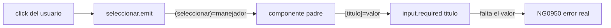
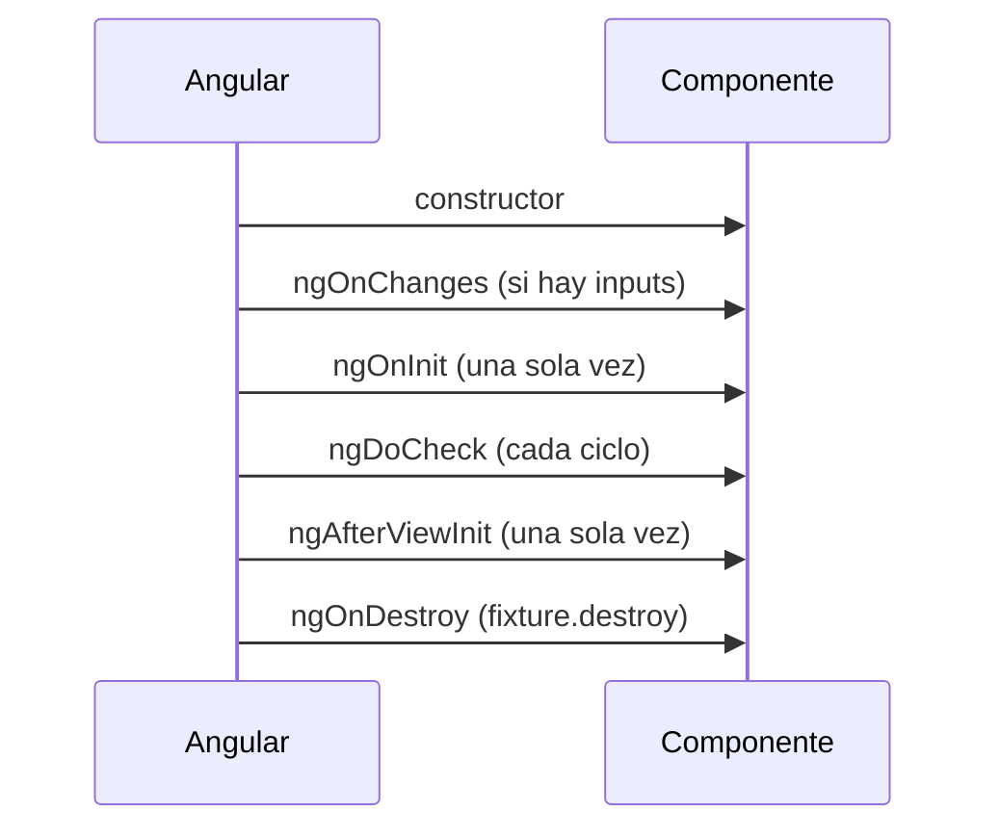
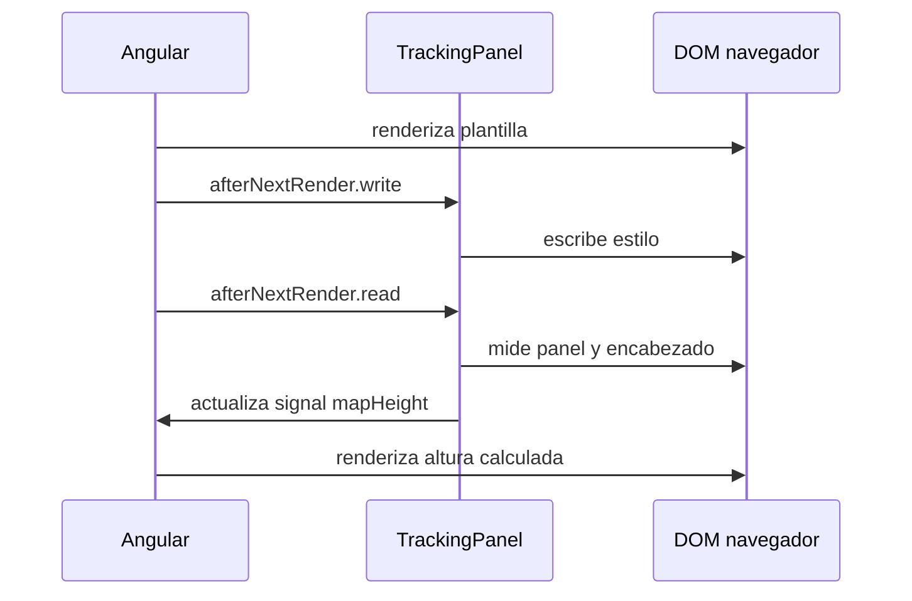

# Módulo 1: Componentes, plantillas y data binding


## Aprende construyendo

Cada tema verifica su garantía con código real: el error genuino de Angular al faltar un input requerido, una comprobación real de identidad de nodos del DOM con `track`, contenido proyectado real verificado sobre `fixture.nativeElement`, y un espía real confirmando el orden exacto de los hooks de ciclo de vida.

### Tema 1: input()/output() basados en signals

#### Paso 1 · Objetivo y preparación

Al finalizar podrás confirmar, con un error real de Angular (`NG0950`), que `input.required()` hace cumplir su contrato en tiempo de ejecución: un componente padre que omite un input requerido produce un fallo real y diagnosticable, no un valor silenciosamente `undefined`.

**Conocimiento previo:** Módulo 0 de este track.

#### Paso 2 · Contexto y caso real

**¿Por qué es importante?** En una app de entregas, una tarjeta de pedido que recibe un `titulo` faltante no debería renderizar contenido vacío silenciosamente; `input.required()` convierte esa omisión en un error real y explícito, verificable en un test, no solo en una revisión visual del resultado.

#### Paso 3 · Teoría con analogía

**Conceptos clave:** `input()`, `input.required()`, `output()`, comparación con los decoradores clásicos, `NG0950`.

`input()` y `output()`, las funciones modernas para declarar propiedades de entrada y salida de un componente, reemplazan a los decoradores clásicos `@Input()` y `@Output()` con una integración nativa con el modelo de signals estudiado en profundidad en el Módulo 2. `titulo = input.required<string>();` declara un input obligatorio de tipo `string` (el componente padre debe proporcionarlo, o Angular lanza un error de compilación de plantilla si se omite), accesible dentro del componente como una función de lectura reactiva (`titulo()`, con paréntesis, exactamente como cualquier signal), en vez de una propiedad de clase simple que los decoradores clásicos exponían directamente sin necesidad de invocarla como función.

Esta integración con signals significa que un input declarado con `input()` participa directamente en el grafo de reactividad de signals: un `computed()` que depende de `titulo()` se recalcula automáticamente cuando el valor del input cambia, exactamente con la misma semántica que cualquier otro signal, sin necesidad de ningún mecanismo adicional de detección de cambios específico para inputs, a diferencia del modelo anterior donde `@Input` era una propiedad de clase ordinaria que dependía del ciclo de detección de cambios general de Angular (o del hook `ngOnChanges`, Tema 4) para reaccionar a sus cambios.

`output()` reemplaza a `@Output() evento = new EventEmitter<T>();` con una sintaxis más concisa: `seleccionar = output<void>();`, emitiendo valores con `seleccionar.emit()` exactamente igual que un `EventEmitter` clásico, y consumido desde el componente padre con la misma sintaxis de binding de eventos (`(seleccionar)="manejador()"`) que ya existía para `@Output`. La ventaja principal de `output()` sobre `@Output` no es tanto una diferencia funcional dramática como una consistencia de API y de estilo con `input()`, ambos como funciones en vez de decoradores, reflejando la dirección general de Angular moderno hacia APIs basadas en funciones en vez de decoradores donde sea razonable.

**Analogía:** `input()` es como una ranura de entrada claramente etiquetada y obligatoria (si se declara `required`) en un formulario, que el remitente (el componente padre) debe rellenar antes de que el formulario se procese; `output()` es como un buzón de salida desde el que el componente puede enviar notificaciones hacia quien esté escuchando, sin necesidad de saber de antemano quién las recibirá ni cuántos destinatarios habrá.

**¿Por qué es importante?** `input()`/`output()` integran nativamente los inputs y outputs de un componente con el grafo de reactividad de signals, simplificando el modelo mental general de reactividad de Angular al usar un único mecanismo consistente (signals) en vez de mezclar propiedades de clase ordinarias con el sistema de detección de cambios tradicional.

**Diagrama:**



**Código del ejemplo:**

```ts
@Component({ selector: 'app-tarjeta', template: `
  <h2>{{ titulo() }}</h2>
  <button (click)="seleccionar.emit()">Ver más</button>
`})
export class Tarjeta {
  titulo = input.required<string>();
  seleccionar = output<void>();
}
```
```html
<app-tarjeta [titulo]="'Mi tarea'" (seleccionar)="abrirDetalle()" />
```

#### Paso 4 · Demostración guiada desde cero

Parte de una carpeta vacía:

```bash
mkdir demo-input-output
cd demo-input-output
npx -y @angular/cli@19 new . --standalone --style=css --routing=false --skip-git --defaults
```

Crea `src/app/tarjeta-pedido.component.ts`:

```ts
// src/app/tarjeta-pedido.component.ts
import { Component, input, output } from '@angular/core';

@Component({
  selector: 'app-tarjeta-pedido',
  standalone: true,
  template: `
    <h2>{{ titulo() }}</h2>
    <button type="button" (click)="seleccionar.emit()">Ver más</button>
  `,
})
export class TarjetaPedidoComponent {
  titulo = input.required<string>();
  seleccionar = output<void>();
}
```

Confirma con un test real que omitir el input requerido produce el error genuino `NG0950` de Angular, y que emitir el output es recibido realmente por el padre:

```ts
// src/app/tarjeta-pedido.component.spec.ts
import { Component } from '@angular/core';
import { TestBed } from '@angular/core/testing';
import { TarjetaPedidoComponent } from './tarjeta-pedido.component';

describe('TarjetaPedidoComponent (input.required real y output real)', () => {
  it('omitir el input requerido lanza el error real NG0950', () => {
    @Component({
      selector: 'app-padre-sin-input',
      standalone: true,
      imports: [TarjetaPedidoComponent],
      template: `<app-tarjeta-pedido />`, // falta [titulo], deliberadamente
    })
    class PadreSinInputComponent {}

    TestBed.configureTestingModule({ imports: [PadreSinInputComponent] });
    const fixture = TestBed.createComponent(PadreSinInputComponent);

    expect(() => fixture.detectChanges()).toThrowError(/NG0950|required/i);
  });

  it('emitir el output real es recibido por el padre', () => {
    @Component({
      selector: 'app-padre-con-input',
      standalone: true,
      imports: [TarjetaPedidoComponent],
      template: `<app-tarjeta-pedido titulo="PED-001" (seleccionar)="verMas = true" />`,
    })
    class PadreConInputComponent {
      verMas = false;
    }

    TestBed.configureTestingModule({ imports: [PadreConInputComponent] });
    const fixture = TestBed.createComponent(PadreConInputComponent);
    fixture.detectChanges();

    const boton: HTMLButtonElement = fixture.nativeElement.querySelector('button');
    boton.click();
    fixture.detectChanges();

    expect(fixture.componentInstance.verMas).toBe(true);
  });
});
```

```bash
npx ng test --watch=false
```

**Resultado esperado:** ambos tests pasan; el primero confirma que Angular lanza REALMENTE `NG0950` cuando un componente padre omite `[titulo]`, el segundo confirma que un clic real dispara `seleccionar.emit()` y el padre lo recibe genuinamente a través del binding `(seleccionar)`.

**Fallo deliberado:** en el primer test, agrega `titulo="PED-001"` a la plantilla del padre (completando el input requerido) y ejecuta de nuevo. El test ahora FALLA porque `.toThrowError(...)` esperaba un error que ya no ocurre — diagnostica confirmando que proveer el input requerido es exactamente lo que resuelve el error real `NG0950`, no un detalle cosmético. Revierte a la plantilla sin `[titulo]` para dejar el ejemplo en su estado de fallo deliberado documentado.

#### Paso 5 · Práctica guiada — repetición progresiva

1. Agrega un segundo input opcional (sin `.required`) y confirma con un test que su ausencia NO produce ningún error, a diferencia del input requerido.
2. Documenta, en un comentario, la diferencia entre `input<string>()` (opcional, puede ser `undefined`) e `input.required<string>()` (obligatorio, error real si falta).
3. Escribe un test que confirme que `seleccionar.emit()` puede dispararse múltiples veces y el padre recibe cada emisión de forma independiente.
4. Escribe de memoria (sin mirar) un componente con `input.required()` y `output()`, y un test que confirme el error real `NG0950` al omitir el input. Compara después contra el patrón del Paso 4.

**Pista:** el error real `NG0950` incluye la palabra "required" en su mensaje — es la forma más rápida de reconocer en una consola real que un input obligatorio quedó sin proveer, sin tener que adivinar cuál de los inputs del componente falta.

#### Paso 6 · Práctica independiente

**Completa el código:** rellena el espacio con la función real de Angular que declara un input obligatorio, cuya ausencia produce un error real en tiempo de ejecución:

```ts
titulo = input.____<string>();
```

**Reto de memoria sin mirar:** cierra este documento y escribe, solo de memoria, un componente con `input.required()` y `output()`, y un test que confirme tanto el error real al omitir el input como la recepción real del output. Compara después contra el patrón del Paso 4.

#### Paso 7 · Cierre y evidencia

Ya confirmas, con el error real `NG0950` de Angular, que `input.required()` hace cumplir su contrato en tiempo de ejecución, no solo en la documentación. El siguiente tema confirma con una comprobación real sobre el DOM por qué `track` con un identificador estable preserva la identidad de los nodos al reordenar una lista. **Evidencia:** entrega el resultado de ambos tests en verde, y el error real `NG0950` que produce el fallo deliberado al omitir el input. Fuentes oficiales: [Angular — Inputs](https://angular.dev/guide/components/inputs), [Angular — Signals](https://angular.dev/guide/signals).

**Errores comunes:** olvidar los paréntesis al leer un input declarado con `input()` (confundir `titulo`, la función, con `titulo()`, su valor); asumir que un input requerido se valida en tiempo de compilación cuando en realidad el error `NG0950` ocurre en tiempo de ejecución, durante la detección de cambios.

**Cuándo no usarlo:** para un input que genuinamente puede estar ausente y el componente debe manejar ese caso con un valor por defecto razonable, `input.required()` es la herramienta incorrecta; usa `input()` con un valor inicial en su lugar.

### Tema 2: Control de flujo nativo — @if, @for, @switch

#### Paso 1 · Objetivo y preparación

Al finalizar podrás confirmar, con una comprobación real de identidad de nodos del DOM, que `track` con un identificador estable preserva los mismos elementos al reordenar una lista, mientras `track $index` fuerza a Angular a recrearlos innecesariamente.

**Conocimiento previo:** Tema 1 de este módulo.

#### Paso 2 · Contexto y caso real

**¿Por qué es importante?** En una app de entregas, reordenar una lista de pedidos por prioridad no debería destruir y recrear cada tarjeta del DOM; `track` con un identificador estable preserva la identidad real de cada nodo, verificable comparando referencias de elementos DOM antes y después del reordenamiento, no solo observando visualmente que "se ve igual".

#### Paso 3 · Teoría con analogía

**Conceptos clave:** sintaxis de bloque integrada, `track`, rendimiento de listas.

Angular introdujo una sintaxis de control de flujo nativa e integrada directamente en el propio lenguaje de plantillas (`@if`, `@for`, `@switch`), reemplazando las directivas estructurales clásicas (`*ngIf`, `*ngFor`, `*ngSwitch`) que dependían de un mecanismo más indirecto basado en la sintaxis de asterisco y microsintaxis específica de Angular. La nueva sintaxis se lee de forma más natural y cercana a bloques de control de flujo de cualquier lenguaje de programación convencional (`@if (condicion) {...} @else {...}`), y el compilador de Angular puede optimizar mejor el código generado al tener una comprensión más directa y explícita de la estructura de control de flujo, en vez de tener que interpretar la microsintaxis de las directivas estructurales clásicas.

`@for (tarea of tareas(); track tarea.id) {...}` exige (o recomienda con fuerza suficiente como para considerarlo prácticamente obligatorio en la práctica) una expresión `track`, que le indica a Angular cómo identificar de forma única cada elemento de la lista entre actualizaciones sucesivas: cuando la lista cambia (se añade, elimina o reordena un elemento), Angular usa el valor de `track` para determinar qué elementos del DOM ya existentes corresponden a elementos que persisten en la nueva versión de la lista (y por tanto pueden reutilizarse sin volver a crearlos), en vez de destruir y recrear todos los elementos del DOM de la lista completa en cada actualización, una optimización de rendimiento con impacto directo y medible especialmente en listas largas que cambian con frecuencia.

Usar `track tarea.id` (un identificador único y estable de cada elemento) en vez del valor por defecto menos óptimo (`track $index`, la posición del elemento en el array, que cambia si el orden de la lista se reordena aunque el elemento en sí no haya cambiado realmente) es la práctica correcta casi siempre que los datos tengan un identificador único disponible: usar el índice como track hace que Angular malinterprete un simple reordenamiento de la lista como si cada elemento hubiera cambiado completamente, destruyendo y recreando innecesariamente elementos del DOM que en realidad seguían siendo los mismos, solo en una posición distinta.

**Analogía:** `track` es como una etiqueta de identificación única cosida permanentemente a cada prenda de un guardarropa: cuando reorganizas el guardarropa (reordenas la lista), el sistema reconoce cada prenda por su etiqueta única y simplemente la mueve de posición, en vez de asumir (por usar solo la posición del perchero como identificador) que cada prenda es "nueva" simplemente porque cambió de percha, y tener que fabricar una prenda completamente nueva desde cero en cada percha.

**¿Por qué es importante?** La sintaxis nativa de control de flujo es más legible y permite mejores optimizaciones del compilador; usar `track` con un identificador estable en `@for` es esencial para el rendimiento de listas que cambian con frecuencia, evitando recreaciones innecesarias de elementos del DOM.

**Diagrama:**

```
┌── track tarea.id ─────┐   reordenar → Angular RECONOCE el mismo elemento
└──────────────────────────┘             (reposiciona el nodo DOM existente)
┌── track $index ───────┐   reordenar → Angular CREE que cambio todo
└──────────────────────────┘             (destruye y recrea nodos DOM)
```

**Código del ejemplo:**

```html
@if (tareas().length > 0) {
  <ul>
    @for (tarea of tareas(); track tarea.id) {
      <li>{{ tarea.titulo }}</li>
    }
  </ul>
} @else {
  <p>No hay tareas todavía.</p>
}
```

#### Paso 4 · Demostración guiada desde cero

Continuando en `demo-input-output` (o, si prefieres un ejemplo independiente, parte de una carpeta vacía con `npx -y @angular/cli@19 new demo-track --standalone --skip-git --defaults`), crea `src/app/lista-pedidos.component.ts`:

```bash
mkdir -p src/app
```

```ts
// src/app/lista-pedidos.component.ts
import { Component, signal } from '@angular/core';

interface Pedido { id: number; titulo: string; }

@Component({
  selector: 'app-lista-pedidos',
  standalone: true,
  template: `
    @for (pedido of pedidos(); track pedido.id) {
      <li [attr.data-id]="pedido.id">{{ pedido.titulo }}</li>
    }
  `,
})
export class ListaPedidosComponent {
  pedidos = signal<Pedido[]>([
    { id: 1, titulo: 'PED-001' },
    { id: 2, titulo: 'PED-002' },
    { id: 3, titulo: 'PED-003' },
  ]);
}
```

Confirma con una comprobación real de identidad de nodos del DOM que `track pedido.id` preserva el MISMO elemento tras reordenar la lista:

```ts
// src/app/lista-pedidos.component.spec.ts
import { TestBed } from '@angular/core/testing';
import { ListaPedidosComponent } from './lista-pedidos.component';

describe('track por id preserva la identidad real de los nodos del DOM', () => {
  it('reordenar la lista mantiene el MISMO elemento DOM para cada pedido', () => {
    const fixture = TestBed.createComponent(ListaPedidosComponent);
    fixture.detectChanges();

    const nodoAntesDelReorden = fixture.nativeElement.querySelector('[data-id="2"]');

    // reordena: mueve el pedido 2 al inicio, sin cambiar SU identidad
    fixture.componentInstance.pedidos.update((lista) => [lista[1], lista[0], lista[2]]);
    fixture.detectChanges();

    const nodoDespuesDelReorden = fixture.nativeElement.querySelector('[data-id="2"]');

    // === compara IDENTIDAD de referencia del objeto DOM, no solo su contenido
    expect(nodoDespuesDelReorden).toBe(nodoAntesDelReorden);
  });
});
```

```bash
npx ng test --watch=false
```

**Resultado esperado:** el test pasa; `===` (vía `toBe`) confirma que el elemento `<li>` correspondiente al pedido 2 es LITERALMENTE el mismo objeto DOM antes y después del reordenamiento — Angular lo reutilizó y solo lo reposicionó, gracias a que `track pedido.id` le permitió reconocer que ese elemento específico seguía siendo el mismo pedido, solo en otra posición.

**Fallo deliberado:** cambia `track pedido.id` por `track $index` y ejecuta de nuevo. El test FALLA porque `nodoDespuesDelReorden` ya NO es el mismo objeto que `nodoAntesDelReorden` — diagnostica confirmando que `track $index` hace que Angular identifique cada elemento por su POSICIÓN, no por su identidad real: al reordenar, la posición 1 "cambió de contenido" desde la perspectiva de Angular, forzándolo a destruir y recrear el nodo DOM en vez de simplemente reposicionar el existente. Restaura `track pedido.id` antes de continuar.

#### Paso 5 · Práctica guiada — repetición progresiva

1. Agrega un cuarto pedido a la lista y confirma que su nodo DOM, una vez creado, también se preserva ante reordenamientos posteriores.
2. Documenta, en un comentario, un escenario real donde `track $index` SÍ seria aceptable (por ejemplo, una lista estática que nunca se reordena ni filtra).
3. Escribe un test que confirme que ELIMINAR un pedido de la lista (no solo reordenar) también preserva la identidad de los nodos DOM de los pedidos restantes.
4. Escribe de memoria (sin mirar) una lista con `@for` y `track` por id, y un test que confirme la preservación de identidad de nodos DOM tras reordenar. Compara después contra el patrón del Paso 4.

**Pista:** `toBe(...)` en un test compara identidad de REFERENCIA de objetos (el mismo nodo DOM en memoria), mientras `toEqual(...)` solo compararía si el contenido textual es igual — para confirmar que Angular reutilizó el nodo en vez de recrearlo, `toBe(...)` es la aserción correcta.

#### Paso 6 · Práctica independiente

**Completa el código:** rellena el espacio con la expresión real de `@for` que identifica cada elemento por su identificador único estable, en vez de su posición:

```html
@for (pedido of pedidos(); ____ pedido.id) { ... }
```

**Reto de memoria sin mirar:** cierra este documento y escribe, solo de memoria, una lista con `@for` y `track` por id, y un test que confirme con `toBe(...)` que reordenar preserva la identidad del nodo DOM. Compara después contra el patrón del Paso 4.

#### Paso 7 · Cierre y evidencia

Ya confirmas, con una comparación real de identidad de nodos del DOM, que `track` con un identificador estable preserva los elementos existentes al reordenar, mientras `track $index` fuerza recreaciones innecesarias. El siguiente tema confirma con contenido proyectado real, verificado sobre `fixture.nativeElement`, cómo `ng-content` posiciona marcado arbitrario del padre. **Evidencia:** entrega el resultado del test en verde, y la ruptura de identidad que produce el fallo deliberado al usar `track $index`. Fuentes oficiales: [Angular — @for](https://angular.dev/guide/templates/control-flow), [Angular — Control flow](https://angular.dev/guide/templates).

**Errores comunes:** usar `track $index` cuando los datos tienen un identificador único disponible; asumir que el rendimiento de listas reordenadas frecuentemente no importa hasta que la lista crece lo suficiente para volverse perceptible.

**Cuándo no usarlo:** para una lista genuinamente estática que nunca se reordena, filtra, ni modifica después de su renderizado inicial, la elección entre `track $index` y un identificador único no tiene ningún impacto práctico medible.

### Tema 3: Content projection con ng-content

#### Paso 1 · Objetivo y preparación

Al finalizar podrás confirmar, con contenido proyectado real verificado sobre `fixture.nativeElement`, que `ng-content` posiciona marcado HTML arbitrario del componente padre dentro de la plantilla del componente hijo, incluyendo el uso de múltiples slots nombrados.

**Conocimiento previo:** Tema 1 de este módulo.

#### Paso 2 · Contexto y caso real

**¿Por qué es importante?** En una app de entregas, un componente `Modal` genérico debe poder mostrar contenido completamente distinto según el contexto (confirmar una entrega, mostrar un error, editar un pedido) sin que el `Modal` conozca de antemano ese contenido; `ng-content` verificado con contenido real confirma que el marcado del padre efectivamente aparece en la posición correcta.

#### Paso 3 · Teoría con analogía

**Conceptos clave:** proyección de contenido del padre, componentes de layout genéricos.

`<ng-content>`, colocado dentro de la plantilla de un componente, marca el punto donde se proyectará el contenido HTML que el componente padre coloque entre las etiquetas de apertura y cierre del componente hijo al usarlo, permitiendo construir componentes de layout genéricos (como un `Modal`, una `Tarjeta`, o un `Panel`) cuyo contenido interno específico es determinado completamente por quien lo consume, sin que el componente contenedor necesite conocer de antemano exactamente qué contenido concreto se proyectará dentro de él.

Este patrón es fundamentalmente distinto de pasar datos mediante un `input()`: un input transmite valores de datos que el componente hijo puede procesar o transformar internamente antes de mostrarlos; content projection transmite directamente marcado HTML (potencialmente arbitrariamente complejo, incluyendo otros componentes anidados) que el componente hijo simplemente posiciona en un lugar específico de su propia plantilla, sin ninguna capacidad de inspeccionar o transformar ese contenido proyectado, solo de decidir dónde ubicarlo visualmente dentro de su propio layout.

`<ng-content select="...">` con múltiples slots nombrados permite proyectar distintas porciones de contenido del padre en distintas posiciones específicas de la plantilla del componente hijo (por ejemplo, un slot para el encabezado del modal y otro para su cuerpo principal), seleccionando qué contenido va a cada slot mediante un selector CSS aplicado sobre los elementos hijos proyectados, una capacidad más avanzada que un único `<ng-content>` sin selector, que simplemente proyecta todo el contenido del padre en un único punto.

**Analogía:** content projection es como un marco de fotos genérico y reutilizable, diseñado para exhibir cualquier fotografía específica que alguien decida colocar dentro de él, sin que el fabricante del marco necesite saber de antemano qué fotografía exacta se exhibirá; múltiples slots nombrados serían como un marco con varias aberturas específicas y etiquetadas, cada una destinada a un tipo específico de contenido (una para el título, otra para la imagen principal).

**¿Por qué es importante?** Content projection permite construir componentes de layout verdaderamente genéricos y reutilizables cuyo contenido interno específico lo determina completamente quien los consume, un patrón de composición fundamental en cualquier biblioteca de componentes de UI madura.

**Diagrama:**

```
┌── padre ───────────────────────┐
│  <span encabezado>...</span>   │──┐
│  <p>...</p>                    │──┼─┐
└─────────────────────────────────┘  │ │
┌── app-modal-generico (hijo) ───┐  │ │
│  <ng-content select=[encabezado]>│◀─┘ │  slot con selector
│  <ng-content /> (por defecto)    │◀───┘  slot sin selector
└─────────────────────────────────┘
```

**Código del ejemplo:**

```ts
@Component({ selector: 'app-modal', template: `<div class="modal"><ng-content /></div>` })
export class Modal {}
```
```html
<app-modal><p>Contenido arbitrario del padre</p></app-modal>
```

#### Paso 4 · Demostración guiada desde cero

Continuando en `demo-input-output` (o, si prefieres un ejemplo independiente, parte de una carpeta vacía con `npx -y @angular/cli@19 new demo-content-projection --standalone --skip-git --defaults`), crea `src/app/modal-generico.component.ts` con dos slots nombrados:

```bash
mkdir -p src/app
```

```ts
// src/app/modal-generico.component.ts
import { Component } from '@angular/core';

@Component({
  selector: 'app-modal-generico',
  standalone: true,
  template: `
    <div class="modal">
      <header data-testid="encabezado"><ng-content select="[encabezado]" /></header>
      <main data-testid="cuerpo"><ng-content /></main>
    </div>
  `,
})
export class ModalGenericoComponent {}
```

Confirma con un test real, verificado sobre `fixture.nativeElement`, que el contenido del padre se proyecta REALMENTE en la posición correcta de cada slot:

```ts
// src/app/modal-generico.component.spec.ts
import { Component } from '@angular/core';
import { TestBed } from '@angular/core/testing';
import { ModalGenericoComponent } from './modal-generico.component';

describe('ModalGenericoComponent (content projection real)', () => {
  it('el contenido proyectado del padre aparece REALMENTE en cada slot correspondiente', () => {
    @Component({
      selector: 'app-padre-con-modal',
      standalone: true,
      imports: [ModalGenericoComponent],
      template: `
        <app-modal-generico>
          <span encabezado>Confirmar entrega PED-001</span>
          <p>¿Confirmas que el paquete fue entregado?</p>
        </app-modal-generico>
      `,
    })
    class PadreConModalComponent {}

    TestBed.configureTestingModule({ imports: [PadreConModalComponent] });
    const fixture = TestBed.createComponent(PadreConModalComponent);
    fixture.detectChanges();

    const encabezado = fixture.nativeElement.querySelector('[data-testid="encabezado"]');
    const cuerpo = fixture.nativeElement.querySelector('[data-testid="cuerpo"]');

    expect(encabezado.textContent).toContain('Confirmar entrega PED-001');
    expect(cuerpo.textContent).toContain('¿Confirmas que el paquete fue entregado?');
  });
});
```

```bash
npx ng test --watch=false
```

**Resultado esperado:** el test pasa; el contenido HTML REAL que el padre colocó dentro de `<app-modal-generico>` aparece exactamente en el slot correspondiente según su atributo `encabezado` (o el slot por defecto sin selector) — confirmado sobre el DOM real renderizado, no solo asumido por la definición del componente.

**Fallo deliberado:** quita el atributo `encabezado` del `<span>` en la plantilla del padre (dejándolo como contenido sin marcar) y ejecuta de nuevo. El test FALLA porque `encabezado.textContent` ya NO contiene "Confirmar entrega PED-001" — diagnostica confirmando que `<ng-content select="[encabezado]" />` proyecta ÚNICAMENTE el contenido que coincide con ese selector CSS específico; sin el atributo, el `<span>` cae en el slot por defecto (sin selector) junto con el resto del contenido no marcado. Restaura el atributo `encabezado` antes de continuar.

#### Paso 5 · Práctica guiada — repetición progresiva

1. Agrega un tercer slot nombrado (por ejemplo, `[pie]` para los botones de acción) y confirma con un test que también proyecta correctamente su contenido específico.
2. Documenta, en un comentario, qué ocurre con contenido del padre que NO coincide con ningún selector de slot nombrado (cae en el `<ng-content />` sin selector, si existe uno).
3. Escribe un test que confirme que el `Modal` NO puede inspeccionar ni transformar el contenido proyectado (a diferencia de un input), solo posicionarlo.
4. Escribe de memoria (sin mirar) un componente con dos slots nombrados de `ng-content`, y un test que confirme sobre `fixture.nativeElement` que el contenido del padre aparece en cada slot correcto. Compara después contra el patrón del Paso 4.

**Pista:** el selector de `ng-content select="..."` es un selector CSS real aplicado sobre los elementos hijos proyectados por el padre — un atributo (`[encabezado]`), una clase (`.encabezado`), o un selector de elemento, exactamente como cualquier selector CSS convencional.

#### Paso 6 · Práctica independiente

**Completa el código:** rellena el espacio con el elemento de Angular que marca el punto donde se proyectará el contenido del padre:

```html
<div class="modal"><____ /></div>
```

**Reto de memoria sin mirar:** cierra este documento y escribe, solo de memoria, un componente con `ng-content` (con y sin selector nombrado), y un test que confirme sobre el DOM real que el contenido del padre se proyecta correctamente. Compara después contra el patrón del Paso 4.

#### Paso 7 · Cierre y evidencia

Ya confirmas, con contenido proyectado real verificado sobre el DOM, que `ng-content` posiciona marcado arbitrario del padre en la plantilla del hijo, incluyendo múltiples slots nombrados. El siguiente tema confirma con un espía real el orden exacto en que Angular invoca los hooks de ciclo de vida de un componente. **Evidencia:** entrega el resultado del test en verde, y el contenido faltante en el slot que produce el fallo deliberado al quitar el atributo del selector. Fuentes oficiales: [Angular — Content projection](https://angular.dev/guide/components/content-projection).

**Errores comunes:** intentar usar `ng-content` para que un padre controle detalles internos de un hijo (inputs y outputs siguen siendo el contrato público adecuado para eso); olvidar que el contenido proyectado no puede ser inspeccionado ni transformado por el componente que lo recibe.

**Cuándo no usarlo:** para transmitir datos que el componente hijo necesita procesar, transformar o validar internamente (no solo posicionar visualmente), `ng-content` es la herramienta incorrecta; usa `input()` en su lugar.

### Tema 4: Ciclo de vida completo de un componente

#### Paso 1 · Objetivo y preparación

Al finalizar podrás confirmar, con un espía real (`vi.fn()` o `jasmine.createSpy()`) registrado en cada hook, el orden EXACTO en que Angular invoca los hooks de ciclo de vida de un componente, y que `ngOnDestroy` se invoca realmente al destruir el fixture.

**Conocimiento previo:** Temas 1-3 de este módulo.

#### Paso 2 · Contexto y caso real

**¿Por qué es importante?** En una app de entregas, un componente que se suscribe a actualizaciones de posición de un conductor debe cancelar esa suscripción cuando se destruye, o la suscripción sigue viva indefinidamente (una fuga de memoria real); confirmar con un espía que `ngOnDestroy` se invoca realmente, en el momento correcto, es la única forma de verificar esa limpieza de forma automatizada.

#### Paso 3 · Teoría con analogía

**Conceptos clave:** hooks de ciclo de vida, orden de invocación, propósito de cada uno.

Angular invoca una secuencia bien definida de "hooks" de ciclo de vida en momentos específicos y predecibles de la existencia de un componente, cada uno con un propósito distinto. `ngOnChanges` se invoca cada vez que un input cambia de valor (antes de cualquier otro hook, en cada ciclo de detección de cambios donde eso ocurra), recibiendo un objeto que detalla el valor anterior y el nuevo de cada input modificado, útil para reaccionar específicamente a cambios de un input concreto con lógica que necesita conocer tanto el valor anterior como el nuevo. `ngOnInit` se invoca una única vez, después de que los inputs iniciales ya están establecidos, siendo el lugar recomendado para lógica de inicialización que depende de esos valores iniciales (en vez del constructor, que se ejecuta antes de que Angular haya establecido los inputs).

`ngDoCheck` se invoca en cada ciclo de detección de cambios, incluso cuando Angular no detectó ningún cambio relevante por sí mismo, permitiendo implementar lógica de detección de cambios completamente personalizada para casos donde el mecanismo estándar de Angular no sería suficiente (un hook usado con moderación, dado su coste de invocarse en cada ciclo sin excepción). `ngAfterContentInit` y `ngAfterContentChecked` se invocan después de que el contenido proyectado mediante `ng-content` (Tema 3) se ha inicializado y verificado respectivamente; `ngAfterViewInit` y `ngAfterViewChecked` cumplen el mismo rol pero para la propia vista del componente (incluyendo sus componentes hijos declarados directamente en su plantilla, no proyectados), siendo el lugar apropiado para lógica que necesita acceder a elementos del DOM ya renderizados o a componentes hijos ya inicializados mediante `ViewChild`.

`ngOnDestroy`, el hook final del ciclo de vida, se invoca justo antes de que Angular destruya el componente, siendo el lugar indispensable para cualquier limpieza necesaria: cancelar suscripciones manuales a Observables que no usan el `async` pipe (Módulo 6), limpiar temporizadores (`clearInterval`/`clearTimeout`), o desconectar cualquier observer del navegador (como los estudiados en el Módulo 8 del track de JavaScript) que el componente haya registrado durante su vida, previniendo fugas de memoria que de otro modo persistirían indefinidamente después de que el componente ya no exista visualmente en la aplicación.

**Analogía:** el ciclo de vida de un componente es como el ciclo completo de un empleado en una empresa: la contratación inicial con verificación de credenciales (`ngOnChanges`/`ngOnInit`), el desempeño continuo verificado periódicamente (`ngDoCheck`), la integración con su equipo de trabajo directo una vez asignado (`ngAfterViewInit`), y finalmente el proceso ordenado de salida donde se revocan accesos y se cierran cuentas pendientes (`ngOnDestroy`), cada etapa con un propósito claramente distinto en el ciclo de vida completo.

**¿Por qué es importante?** Conocer el propósito específico de cada hook, y especialmente la importancia crítica de `ngOnDestroy` para prevenir fugas de memoria, es esencial para escribir componentes Angular correctos y de larga vida en una aplicación real.

**Diagrama:**



**Código del ejemplo:**

```ts
export class MiComponente implements OnChanges, OnInit, AfterViewInit, OnDestroy {
  ngOnChanges(cambios: SimpleChanges) { /* un input cambió */ }
  ngOnInit() { /* inputs iniciales ya establecidos, una sola vez */ }
  ngAfterViewInit() { /* vista y componentes hijos ya inicializados */ }
  ngOnDestroy() { /* limpieza: cancelar suscripciones, timers, observers */ }
}
```

#### Paso 4 · Demostración guiada desde cero

Continuando en `demo-input-output` (o, si prefieres un ejemplo independiente, parte de una carpeta vacía con `npx -y @angular/cli@19 new demo-ciclo-vida --standalone --skip-git --defaults`), crea `src/app/seguimiento-conductor.component.ts` con un registro real de cada hook invocado:

```bash
mkdir -p src/app
```

```ts
// src/app/seguimiento-conductor.component.ts
import { Component, OnInit, OnDestroy } from '@angular/core';

@Component({
  selector: 'app-seguimiento-conductor',
  standalone: true,
  template: `<p>Siguiendo al conductor</p>`,
})
export class SeguimientoConductorComponent implements OnInit, OnDestroy {
  ordenInvocacion: string[] = [];

  ngOnInit() {
    this.ordenInvocacion.push('ngOnInit');
  }

  ngOnDestroy() {
    this.ordenInvocacion.push('ngOnDestroy');
  }
}
```

Confirma con espías reales que Angular invoca `ngOnInit` una vez al crear el componente, y `ngOnDestroy` realmente al destruir el fixture, en el orden correcto:

```ts
// src/app/seguimiento-conductor.component.spec.ts
import { TestBed } from '@angular/core/testing';
import { SeguimientoConductorComponent } from './seguimiento-conductor.component';

describe('Ciclo de vida real de SeguimientoConductorComponent', () => {
  it('ngOnInit se invoca una vez al crear, ngOnDestroy al destruir, en ese orden exacto', () => {
    const fixture = TestBed.createComponent(SeguimientoConductorComponent);
    const instancia = fixture.componentInstance;

    expect(instancia.ordenInvocacion).toEqual([]); // constructor: ningun hook invocado todavia

    fixture.detectChanges(); // dispara ngOnInit REALMENTE
    expect(instancia.ordenInvocacion).toEqual(['ngOnInit']);

    fixture.destroy(); // dispara ngOnDestroy REALMENTE
    expect(instancia.ordenInvocacion).toEqual(['ngOnInit', 'ngOnDestroy']);
  });
});
```

```bash
npx ng test --watch=false
```

**Resultado esperado:** el test pasa; el arreglo `ordenInvocacion`, poblado por el propio componente REAL (no un mock), confirma el orden exacto: nada antes de `detectChanges()`, `ngOnInit` tras el primer render, y `ngOnDestroy` solo tras `fixture.destroy()` — la secuencia genuina que Angular garantiza, verificada en código, no solo descrita en la documentación.

**Fallo deliberado:** quita la llamada a `fixture.destroy()` y ejecuta de nuevo solo la última aserción (comentando la anterior). FALLA porque `ordenInvocacion` sigue siendo `['ngOnInit']`, sin `'ngOnDestroy'` — diagnostica confirmando que Angular NUNCA invoca `ngOnDestroy` automáticamente solo porque el test terminó; requiere una destrucción explícita del componente (en producción, cuando Angular remueve el componente de la vista, por ejemplo al navegar fuera de una ruta). Restaura `fixture.destroy()` antes de continuar.

#### Paso 5 · Práctica guiada — repetición progresiva

1. Agrega `ngOnChanges` a la lista de hooks registrados e implementa un input real que, al cambiar, confirme con un test que `ngOnChanges` se invoca ANTES que cualquier otro hook posterior.
2. Documenta, en un comentario, por qué `ngOnInit` es el lugar recomendado para lógica de inicialización que depende de inputs, en vez del constructor (que se ejecuta antes de que Angular establezca los inputs).
3. Escribe un test que confirme que crear DOS instancias del mismo componente y destruir solo una de ellas dispara `ngOnDestroy` únicamente en la instancia destruida, no en la otra.
4. Escribe de memoria (sin mirar) un componente con `ngOnInit`/`ngOnDestroy` que registre el orden real de invocación en un arreglo, y un test que confirme esa secuencia. Compara después contra el patrón del Paso 4.

**Pista:** `fixture.destroy()` es la forma real y explícita de disparar `ngOnDestroy` en un test — a diferencia de `ngOnInit` (disparado por `detectChanges()`), ningún hook de destrucción se invoca automáticamente solo porque el test o el archivo `.spec.ts` termina de ejecutarse.

#### Paso 6 · Práctica independiente

**Completa el código:** rellena el espacio con el método real de `ComponentFixture` que dispara `ngOnDestroy` de forma explícita en un test:

```ts
fixture.____();
```

**Reto de memoria sin mirar:** cierra este documento y escribe, solo de memoria, un componente que registra el orden real de sus hooks de ciclo de vida en un arreglo, y un test que confirme esa secuencia exacta con `detectChanges()` y `fixture.destroy()`. Compara después contra el patrón del Paso 4.

#### Paso 7 · Cierre y evidencia

Ya confirmas, con un espía real y `fixture.destroy()`, el orden exacto en que Angular invoca los hooks de ciclo de vida, y que ninguna limpieza ocurre automáticamente sin una destrucción explícita. El siguiente tema (ya con contenido propio, sin duplicación) aplica `viewChild.required()` y las fases `write`/`read` de `afterNextRender` para medir el DOM de forma segura. **Evidencia:** entrega el resultado del test en verde, y la ausencia de `'ngOnDestroy'` que produce el fallo deliberado al omitir `fixture.destroy()`. Fuentes oficiales: [Angular — Lifecycle hooks](https://angular.dev/guide/components/lifecycle).

**Errores comunes:** no limpiar recursos en `ngOnDestroy` (suscripciones manuales, temporizadores, observers), produciendo fugas de memoria reales; usar `ngAfterViewChecked` para lógica que debería vivir en `ngOnInit` o en un callback de render, dado su coste de invocarse en cada ciclo de detección de cambios.

**Cuándo no usarlo:** para un componente completamente sin estado, sin suscripciones, sin recursos externos y sin lógica de inicialización dependiente de inputs, implementar los hooks de ciclo de vida es una capa de código innecesaria que no aporta ningún valor real.

### Tema 5: Consultas signal y trabajo posterior al render

#### Paso 1 · Objetivo y preparación
Al finalizar podrás construir este componente desde cero. Prerrequisitos: Node.js LTS, npm y Angular CLI. Verifica node --version y ng version.

#### Paso 2 · Contexto y caso real
En un caso real de entregas, un componente recibe un pedido, emite acciones y muestra estados sin mezclar datos de otras pantallas.

#### Paso 3 · Teoría, modelo mental y analogía
Signals representan estado reactivo; input y output hacen explícito el contrato; el control de flujo de plantilla decide qué se renderiza. La proyección inserta contenido sin duplicar componentes y el ciclo de vida define cuándo leer o limpiar recursos. La analogía es un mostrador: recibe una orden, actualiza su pantalla y emite un comprobante.

#### Paso 4 · Demostración guiada desde cero
Parte de una carpeta vacía:
```bash
mkdir ejemplo-angular-m1
cd ejemplo-angular-m1
npx -p @angular/cli ng new app --standalone --routing=false --style=css --skip-git
cd app
ng serve
```
Crea src/app/delivery-card.component.ts con signal, input y output; úsalo desde app.component y documenta el flujo.

#### Paso 5 · Práctica guiada
Pista: elimina deliberadamente un input requerido para provocar un fallo deliberado de plantilla; corrígelo y observa el resultado. Resultado esperado: tarjeta renderizada y evento recibido.

#### Paso 6 · Práctica independiente
Añade estados loading/empty/error, una lista con @for y contenido proyectado; valida navegación por teclado.

#### Paso 7 · Cierre y evidencia
Guarda código, captura y log; como siguiente paso estudia servicios. Errores comunes: mutar arrays sin signal, emitir datos ambiguos, usar índices como key y leer consultas antes del render. Fuentes oficiales: https://angular.dev/guide/signals y https://angular.dev/guide/components/inputs.
**¿Por qué es importante?** Porque los contratos explícitos hacen predecible una vista reactiva.
**Evidencia de aprendizaje:** entrega componente, evento, estados y prueba del fallo.
**Conceptos clave:** `viewChild.required`, `contentChild`, `ElementRef`, `afterNextRender`, fases `write/read`, SSR y separación entre datos y DOM.

Construiremos un panel de seguimiento que ajusta la altura de un mapa según el espacio disponible. La mayoría de interfaces debe expresarse con plantilla, CSS y signals; una consulta del DOM se justifica cuando necesitas integrar una biblioteca visual o medir una dimensión que el modelo de datos no contiene.

**Requisitos previos:** Node.js compatible con la versión Angular del proyecto y temas 1–4. Crea:

```text
src/app/features/tracking/
├── tracking-panel.component.ts
├── tracking-panel.component.html
├── tracking-panel.component.css
└── tracking-panel.component.spec.ts
```

`viewChild()` devuelve una signal: antes de que exista el elemento puede ser `undefined`; `viewChild.required()` declara que la plantilla siempre debe contenerlo y falla si esa promesa se rompe. Usa una referencia de plantilla tipada en `tracking-panel.component.html`:

```html
<section class="tracking-panel" #panel>
  <header #header>
    <h2>Seguimiento de la entrega</h2>
  </header>
  <div class="map" [style.height.px]="mapHeight()" aria-label="Mapa de seguimiento"></div>
</section>
```

En `tracking-panel.component.ts`, escribe cambios en una fase y mide en otra. Separar escritura y lectura evita alternarlas repetidamente, patrón que puede forzar recalcular layout varias veces en un frame.

```ts
import { Component, ElementRef, afterNextRender, signal, viewChild } from '@angular/core';

@Component({
  selector: 'app-tracking-panel',
  standalone: true,
  templateUrl: './tracking-panel.component.html',
  styleUrl: './tracking-panel.component.css'
})
export class TrackingPanelComponent {
  private readonly panel = viewChild.required<ElementRef<HTMLElement>>('panel');
  private readonly header = viewChild.required<ElementRef<HTMLElement>>('header');
  readonly mapHeight = signal(320);

  constructor() {
    afterNextRender({
      write: () => {
        this.panel().nativeElement.style.setProperty('--panel-ready', '1');
      },
      read: () => {
        const panelHeight = this.panel().nativeElement.getBoundingClientRect().height;
        const headerHeight = this.header().nativeElement.getBoundingClientRect().height;
        this.mapHeight.set(Math.max(240, panelHeight - headerHeight - 24));
      }
    });
  }
}
```

`afterNextRender` se registra en un contexto de inyección —por ejemplo, el constructor— y se ejecuta después de que Angular renderiza la aplicación en el navegador. No equivale a `ngAfterViewChecked`, que puede ejecutarse muchas veces y no es un lugar seguro para escribir estado indiscriminadamente. Los callbacks de render no se ejecutan durante SSR; por eso no deben contener una regla de negocio necesaria para producir HTML correcto en el servidor.

`contentChild()` consulta contenido que el padre proyectó mediante `ng-content`; `viewChild()` consulta la propia plantilla del componente. No uses cualquiera de las dos para que un padre controle detalles internos de un hijo: inputs y outputs siguen siendo el contrato público adecuado.



**Analogía:** `viewChild` es una ventana de inspección a una pieza ya instalada; las fases de render son el turno del equipo de montaje y después el del equipo de medición. Medir mientras todavía se mueve la estructura produce trabajo repetido y resultados inestables.

**¿Por qué es importante?** Las consultas signal se integran con el modelo reactivo moderno y las fases de render reducen lecturas/escrituras intercaladas. Reconocer el límite de SSR evita que el HTML inicial dependa de una medición exclusiva del navegador.

**Ejecución y resultado esperado:** ejecuta `npm test -- --watch=false` y `ng serve`. El mapa nunca mide menos de 240 px, cambia después del primer render sin `ExpressionChangedAfterItHasBeenCheckedError` y el render del servidor conserva una altura inicial válida de 320 px.

**Fallo deliberado:** mueve `mapHeight.set(...)` a `ngAfterViewChecked` sin guarda. Observa ciclos o el error de expresión cambiada; después lee y escribe layout dentro de un bucle de 100 elementos y registra el coste con Performance DevTools. Restablece las fases y compara.

**Modificación sin copiar:** reemplaza la medición única por `ResizeObserver`, registra su limpieza con `DestroyRef` y prueba que deja de emitir después de destruir el fixture.

---


## Laboratorio práctico

**Objetivo del laboratorio:** construir un componente Tarjeta reutilizable con inputs/outputs basados en signals, control de flujo nativo, content projection y manejo correcto del ciclo de vida.

**Requisitos previos:** Módulo 0 completado.

| Paso | Acción | Código | Explicación |
|---|---|---|---|
| 1 | Crear el componente Tarjeta | `input.required<string>()` y `output<void>()` | Verifica que el padre puede escuchar el evento |
| 2 | Reemplazar `*ngFor`/`*ngIf` por `@for`/`@if` | Ver Tema 2 | Compara legibilidad con la sintaxis clásica |
| 3 | Usar `track` por id en `@for` | Ver Tema 2 | Explica qué problema de rendimiento evita frente a `track $index` |
| 4 | Crear un componente Modal con `ng-content` | Ver Tema 3 | Proyecta contenido arbitrario del padre |
| 5 | Implementar `ngOnInit` y `ngOnDestroy` | Registra en consola cuándo se invoca cada uno | Verifica el orden exacto de invocación |
| 6 | Consultar y medir el panel | Ver Tema 5 | Usa `viewChild.required` y fases `write/read` |
| 7 | Renderizar con SSR | Ver Tema 5 | Conserva un valor inicial sin depender del navegador |

**Verificación:** el laboratorio se considera exitoso si la Tarjeta emite correctamente su evento de salida al padre, si la lista renderizada con `@for` mantiene la identidad correcta de sus elementos al reordenarse (verificado con `track`), y si `ngOnDestroy` se invoca correctamente al eliminar el componente de la vista.

**Errores comunes y soluciones**

- **Usar `track $index` cuando los datos tienen un identificador único disponible.** Usa siempre el identificador único real de cada elemento para evitar recreaciones innecesarias del DOM.
- **Olvidar los paréntesis al leer un input declarado con `input()`.** Recuerda que `titulo` (la función) y `titulo()` (su valor actual) son cosas distintas; siempre invócalo como función para leer su valor.
- **No limpiar recursos en `ngOnDestroy`.** Cualquier suscripción manual, temporizador u observer registrado debe limpiarse explícitamente para evitar fugas de memoria.
- **Usar `ngAfterViewChecked` para medir y actualizar estado en cada ciclo.** Prefiere callbacks de render y separa lecturas de escrituras.
- **Depender de una medición del DOM para el HTML SSR.** Define un estado inicial correcto porque esos callbacks solo existen en el navegador.

---
