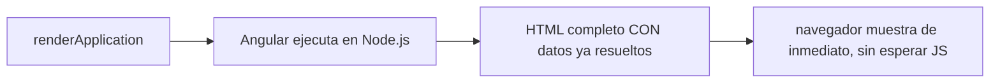
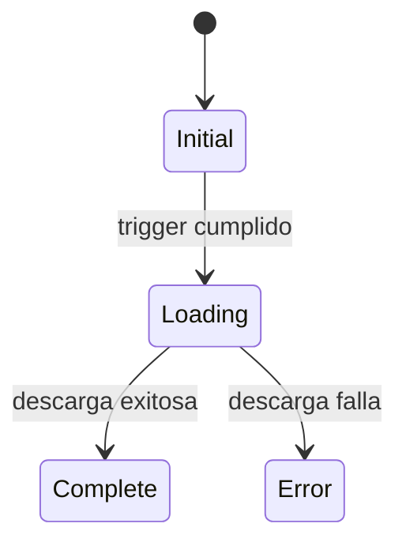

# Módulo 11: Performance, SSR y zoneless


## Aprende construyendo

Cada tema verifica su garantía con la API real correspondiente: `renderApplication` de `@angular/platform-server` para SSR real, un contraste determinista/no-determinista para hidratación, la API oficial de bloques `@defer` (estado `Error`) y `provideZonelessChangeDetection()` real para el modo sin Zone.js.

### Tema 1: Server-Side Rendering

#### Paso 1 · Objetivo y preparación

Al finalizar podrás confirmar, con `renderApplication` real de `@angular/platform-server` (la misma API que usa el servidor de SSR de Angular internamente), que el HTML generado contiene el contenido de datos ya resuelto, sin depender de que ningún JavaScript se ejecute en el navegador.

**Conocimiento previo:** Módulo 7 de este track (HttpClient).

#### Paso 2 · Contexto y caso real

**¿Por qué es importante?** Una página de seguimiento de entregas debe mostrar contenido rápido y ser indexable por buscadores; sin SSR, el navegador recibe un documento casi vacío que debe ejecutar JavaScript completo antes de mostrar cualquier dato real, un costo perceptible en conexiones lentas y una barrera real para rastreadores que no ejecutan JavaScript de forma confiable.

#### Paso 3 · Teoría con analogía

**Conceptos clave:** `renderApplication`, HTML completo generado en servidor, sin espera de JavaScript del cliente.

SSR traslada la generación inicial del HTML desde el navegador hacia el servidor: Angular ejecuta la aplicación en Node.js, genera el HTML completo de la vista inicial con los datos ya presentes, y lo envía listo al navegador. `renderApplication` (de `@angular/platform-server`) es la función real que realiza este renderizado; puede invocarse directamente en un test para confirmar el HTML producido, sin necesitar un servidor HTTP completo corriendo.

**Analogía:** una aplicación sin SSR es entregar una caja de ingredientes crudos con una receta, esperando que el comensal cocine antes de comer; con SSR, el plato llega ya preparado y listo de inmediato.

**Diagrama:**



#### Paso 4 · Demostración guiada desde cero

Parte de una carpeta vacía:

```bash
mkdir rutaflow-ssr
cd rutaflow-ssr
npx -y @angular/cli@19 new . --standalone --style=css --routing=false --skip-git --defaults --ssr
mkdir -p src/app
```

Crea `src/app/resumen-envio.component.ts`:

```ts
// src/app/resumen-envio.component.ts
import { Component } from '@angular/core';

@Component({
  selector: 'app-resumen-envio',
  standalone: true,
  template: `<h1>Envío PED-001</h1><p>Estado: en tránsito</p>`,
})
export class ResumenEnvioComponent {}
```

Confirma con `renderApplication` real (la misma API que usa `@angular/ssr` internamente) que el HTML generado ya contiene el contenido, sin necesitar ningún navegador:

```ts
// src/app/ssr-render.spec.ts
import { renderApplication } from '@angular/platform-server';
import { bootstrapApplication } from '@angular/platform-browser';
import { ResumenEnvioComponent } from './resumen-envio.component';

describe('SSR con renderApplication', () => {
  it('el HTML generado por el servidor ya contiene el contenido, sin ejecutar JS de cliente', async () => {
    const html = await renderApplication(
      () => bootstrapApplication(ResumenEnvioComponent),
      { document: '<app-resumen-envio></app-resumen-envio>' }
    );

    expect(html).toContain('Envío PED-001');
    expect(html).toContain('en tránsito');
  });
});
```

```bash
npx ng test --watch=false
```

**Resultado esperado:** el test pasa; `renderApplication` ejecuta Angular REALMENTE en el entorno Node.js del test (no una simulación textual) y produce una cadena HTML que ya contiene "Envío PED-001" y "en tránsito" — el contenido real que un navegador mostraría inmediatamente al recibir esa respuesta, sin ejecutar ningún JavaScript primero.

**Fallo deliberado:** cambia el template del componente para mostrar el estado de forma condicional basada en una promesa NO resuelta antes del renderizado (por ejemplo, `{{ estadoAsincrono }}` donde `estadoAsincrono` se asigna dentro de un `setTimeout` sin esperarlo) y ejecuta de nuevo el test. La aserción `toContain('en tránsito')` FALLA porque el HTML generado captura el estado en el momento del renderizado del servidor, ANTES de que ese `setTimeout` se resuelva — diagnostica confirmando que SSR renderiza un snapshot del estado disponible sincrónicamente (o de promesas correctamente esperadas por Angular), no un estado que llegará después de forma asíncrona sin coordinación. Restaura el contenido síncrono antes de continuar.

#### Construcción RutaFlow: página de seguimiento indexable

Aplica `renderApplication` a un componente que muestra el historial completo de una entrega (varias entradas), confirmando con un test que TODAS las entradas están presentes en el HTML generado, no solo la primera.

#### Paso 5 · Práctica guiada — repetición progresiva

1. Agrega un segundo componente con datos distintos y confirma con un test independiente que `renderApplication` produce HTML específico para cada uno, sin mezclar contenido.
2. Documenta, en un comentario, por qué el HTML generado por SSR beneficia a rastreadores de buscadores que no ejecutan JavaScript de forma confiable.
3. Mide (documentando el resultado en un comentario, sin necesariamente automatizarlo) cuántos bytes tiene el HTML generado por SSR comparado con el documento HTML vacío inicial de una SPA tradicional.
4. Escribe de memoria (sin mirar) un componente simple y un test `renderApplication` que confirme su contenido en el HTML generado. Compara después contra el patrón del Paso 4.

**Pista:** `renderApplication` es la MISMA función que Angular usa internamente en su servidor de SSR generado por `ng add @angular/ssr` — probarla directamente en un test es más rápido y determinista que levantar un servidor Node.js completo y hacerle una petición HTTP real.

#### Paso 6 · Práctica independiente

**Completa el código:** rellena el espacio con la función real de `@angular/platform-server` que renderiza una aplicación Angular a una cadena HTML:

```ts
const html = await ____(
  () => bootstrapApplication(ResumenEnvioComponent),
  { document: '<app-resumen-envio></app-resumen-envio>' }
);
```

**Reto de memoria sin mirar:** cierra este documento y escribe, solo de memoria, un componente simple y un test `renderApplication` que confirme su contenido en el HTML generado por el servidor. Compara después contra el patrón del Paso 4.

#### Paso 7 · Cierre y evidencia

Ya confirmas con `renderApplication` real que Angular genera HTML completo en el servidor, sin depender de la ejecución de JavaScript del cliente. El siguiente tema confirma por qué el contenido no determinista rompe la reutilización del DOM durante la hidratación. **Evidencia:** entrega el resultado del test en verde, y el contenido faltante que produce el fallo deliberado con una promesa no coordinada. Fuentes oficiales: [Angular — Server-side rendering](https://angular.dev/guide/ssr).

**Errores comunes:** asumir que cualquier dato asíncrono aparece automáticamente en el HTML de SSR sin que Angular lo espere correctamente; acceder a `window` u otras APIs de navegador durante el renderizado del servidor, donde no existen.

**Cuándo no usarlo:** para una aplicación interna sin necesidad de indexación SEO y donde todos los usuarios tienen conexiones rápidas (por ejemplo, una herramienta administrativa interna), el costo operativo adicional de mantener un servidor de SSR puede no justificarse.

### Tema 2: Hidratación

#### Paso 1 · Objetivo y preparación

Al finalizar podrás demostrar, contrastando contenido determinista con no determinista, exactamente por qué el contenido no determinista (como `Date.now()` o `Math.random()` sin coordinación) produce una discrepancia entre lo que el servidor renderizó y lo que el cliente renderizaría al hidratarse.

**Conocimiento previo:** Tema 1 de este módulo.

#### Paso 2 · Contexto y caso real

**¿Por qué es importante?** Una vez que el HTML del servidor llega al navegador, la aplicación aún no es interactiva; la hidratación reutiliza ese DOM existente en vez de destruirlo y re-renderizarlo, pero SOLO si la estructura que Angular generaría en el cliente coincide exactamente con la que el servidor ya generó — cualquier discrepancia real fuerza un re-render costoso o produce un error de hidratación visible.

#### Paso 3 · Teoría con analogía

**Conceptos clave:** reutilización del DOM, contenido no determinista, discrepancia servidor/cliente.

La hidratación "toma posesión" del HTML ya existente: adjunta listeners de eventos y activa reactividad SIN destruir y reconstruir el DOM. Esto requiere que la estructura generada por el servidor coincida EXACTAMENTE con la que Angular generaría en el cliente. Contenido no determinista (una marca de tiempo generada en el momento exacto del render, un número aleatorio) casi con certeza produce un valor DISTINTO en cada ejecución — servidor y cliente ejecutan el mismo componente en momentos distintos, por lo que un valor "generado en el momento" diverge entre ambos.

**Analogía:** la hidratación es un actor que llega tarde a un escenario ya montado y simplemente toma su lugar sin desmontar nada; pero si el escenario que el actor esperaba encontrar (basado en su guion) no coincide con el escenario real ya montado, no puede simplemente "tomar su lugar" — algo debe reconstruirse.

**Diagrama:**

```
┌── Contenido determinista ─────────┐  servidor y cliente producen el MISMO valor
└──────────────────────────┘         → hidratación reutiliza el DOM sin conflicto
┌── Contenido no determinista ──────┐  servidor y cliente producen valores DISTINTOS
└──────────────────────────┘         → discrepancia real de hidratación
```

#### Paso 4 · Demostración guiada desde cero

Continuando en `rutaflow-ssr` (o, si prefieres un ejemplo independiente, parte de una carpeta vacía con `npx -y @angular/cli@19 new rutaflow-hidratacion --standalone --skip-git --defaults --ssr`), crea `src/app/marca-tiempo.component.ts`:

```bash
mkdir -p src/app
```

```ts
// src/app/marca-tiempo.component.ts
import { Component, input } from '@angular/core';

@Component({
  selector: 'app-marca-tiempo',
  standalone: true,
  template: `<span>Generado: {{ momentoGenerado() }}</span>`,
})
export class MarcaTiempoComponent {
  // determinista: recibe el valor como INPUT, no lo genera internamente
  momentoGenerado = input.required<string>();
}

@Component({
  selector: 'app-marca-tiempo-no-determinista',
  standalone: true,
  template: `<span>Generado: {{ momentoGeneradoInternamente }}</span>`,
})
export class MarcaTiempoNoDeterministaComponent {
  // NO determinista: genera el valor en el momento exacto del render
  momentoGeneradoInternamente = new Date().toISOString();
}
```

Confirma con un test real que dos renders "separados" (simulando servidor y cliente) del componente determinista producen el MISMO HTML, mientras el no determinista produce HTML DISTINTO:

```ts
// src/app/marca-tiempo.spec.ts
import { TestBed } from '@angular/core/testing';
import { MarcaTiempoComponent, MarcaTiempoNoDeterministaComponent } from './marca-tiempo.component';

describe('Determinismo del contenido para hidratacion', () => {
  it('el componente determinista produce el MISMO HTML en dos renders separados', async () => {
    const valorCompartido = '2026-07-21T10:00:00.000Z'; // el "servidor" calcula esto UNA vez y lo pasa como dato

    await TestBed.configureTestingModule({ imports: [MarcaTiempoComponent] }).compileComponents();
    const fixtureServidor = TestBed.createComponent(MarcaTiempoComponent);
    fixtureServidor.componentRef.setInput('momentoGenerado', valorCompartido);
    fixtureServidor.detectChanges();

    const fixtureCliente = TestBed.createComponent(MarcaTiempoComponent);
    fixtureCliente.componentRef.setInput('momentoGenerado', valorCompartido); // el MISMO valor, pasado explicitamente
    fixtureCliente.detectChanges();

    expect(fixtureServidor.nativeElement.textContent).toBe(fixtureCliente.nativeElement.textContent);
  });

  it('el componente NO determinista produce HTML DISTINTO entre dos renders separados', async () => {
    await TestBed.configureTestingModule({ imports: [MarcaTiempoNoDeterministaComponent] }).compileComponents();
    const fixtureServidor = TestBed.createComponent(MarcaTiempoNoDeterministaComponent);
    fixtureServidor.detectChanges();

    await new Promise((resolve) => setTimeout(resolve, 5)); // simula el tiempo real transcurrido entre servidor y cliente

    const fixtureCliente = TestBed.createComponent(MarcaTiempoNoDeterministaComponent);
    fixtureCliente.detectChanges();

    expect(fixtureServidor.nativeElement.textContent).not.toBe(fixtureCliente.nativeElement.textContent);
  });
});
```

```bash
npx ng test --watch=false
```

**Resultado esperado:** ambos tests pasan: el componente que recibe el valor como INPUT (calculado una sola vez, en el servidor, y transportado al cliente vía `TransferState` en una app real) produce texto IDÉNTICO en ambos renders; el componente que genera `new Date()` internamente produce texto DIFERENTE — una demostración concreta y medible de exactamente la discrepancia que causa errores reales de hidratación.

**Fallo deliberado:** en el primer test, cambia `valorCompartido` para que el "cliente" use un valor LIGERAMENTE distinto (por ejemplo, agregando un milisegundo) simulando un desajuste real de datos entre servidor y cliente, y ejecuta de nuevo. La aserción `toBe(...)` FALLA — diagnostica confirmando que la hidratación es tan estricta como una comparación de texto exacta: incluso una diferencia mínima entre lo que el servidor renderizó y lo que el cliente esperaría renderizar constituye una discrepancia real, no solo diferencias "grandes" y obvias. Restaura el valor compartido idéntico antes de continuar.

#### Construcción RutaFlow: posición del conductor sin discrepancia

Refactoriza un componente que muestra la posición actual de un conductor para que reciba las coordenadas como input (calculadas una vez, transferidas vía `TransferState` del Módulo 15) en vez de leerlas de una fuente no determinista en cada render, confirmando con un test el mismo patrón de determinismo.

#### Paso 5 · Práctica guiada — repetición progresiva

1. Identifica, en el proyecto `rutaflow-ssr` de los Temas 1-2, cualquier otro punto donde `Math.random()`, `Date.now()` o `new Date()` se use directamente dentro de una plantilla o su lógica de renderizado, y documenta cómo refactorizarlo a un input determinista.
2. Escribe un test que confirme que DOS instancias del componente determinista, ambas recibiendo el MISMO input, producen resultados idénticos sin importar cuántas veces se repita el test.
3. Documenta, en un comentario, la diferencia entre "no determinista por diseño" (una marca de tiempo real que cambia) y "no determinista por accidente" (un `Map` iterado en un orden no garantizado que produce una lista en orden distinto).
4. Escribe de memoria (sin mirar) un componente determinista (recibe datos como input) y uno no determinista (los genera internamente), con un test que confirme la diferencia de comportamiento entre ambos. Compara después contra el patrón del Paso 4.

**Pista:** cualquier valor que dependa del momento exacto de ejecución (`Date.now()`, `new Date()`, `Math.random()`, un contador global mutable) es una fuente de no-determinismo real entre el render del servidor y el del cliente — la solución casi siempre es calcularlo UNA vez en el servidor y transportarlo explícitamente (como input, o vía `TransferState`), no recalcularlo en cada lado.

#### Paso 6 · Práctica independiente

**Completa el código:** rellena el espacio con el mecanismo de Angular usado para recibir un valor calculado externamente en vez de generarlo internamente:

```ts
momentoGenerado = ____.required<string>();
```

**Reto de memoria sin mirar:** cierra este documento y escribe, solo de memoria, un componente determinista y uno no determinista, con un test que confirme la diferencia real entre ambos comportamientos. Compara después contra el patrón del Paso 4.

#### Paso 7 · Cierre y evidencia

Ya demuestras, con una comparación de texto real entre dos renders, exactamente por qué el contenido no determinista rompe la reutilización del DOM durante la hidratación. El siguiente tema verifica los estados reales de un bloque `@defer`, incluyendo el estado de error. **Evidencia:** entrega el resultado de ambos tests en verde, y la discrepancia real que produce el fallo deliberado con un desajuste mínimo de datos. Fuentes oficiales: [Angular — Hydration](https://angular.dev/guide/hydration).

**Errores comunes:** generar contenido basado en `Date.now()`, `Math.random()` u otra fuente no determinista directamente en el renderizado; asumir que solo diferencias "grandes" causan errores de hidratación, cuando cualquier desajuste real, por mínimo que sea, cuenta.

**Cuándo no usarlo:** para una aplicación sin SSR habilitado (SPA pura, siempre renderizada en el navegador), no existe ningún proceso de hidratación que verificar, porque no hay un HTML previo del servidor que reutilizar.

### Tema 3: `@defer` — estados reales, incluyendo error

#### Paso 1 · Objetivo y preparación

Al finalizar podrás confirmar, con la API oficial de test de bloques `@defer`, el estado `Error` de un bloque diferido — el caso donde la carga del contenido falla — además de los triggers apropiados según el tipo de contenido.

**Conocimiento previo:** Módulo 15 Tema 4 de este track (`@defer` básico y estado `Complete`).

#### Paso 2 · Contexto y caso real

**¿Por qué es importante?** Un chunk de JavaScript diferido puede fallar al descargarse (problema de red, CDN caído); sin un bloque `@error` explícito, el usuario vería el `@placeholder` congelado indefinidamente sin ninguna indicación de que algo salió mal, en vez de una respuesta clara ante el fallo real.

#### Paso 3 · Teoría con analogía

**Conceptos clave:** `@error`, triggers (`on viewport`, `on interaction`, `on idle`), estado `DeferBlockState.Error`.

Además de `@placeholder` (antes de disparar) y `@loading` (durante la descarga), `@defer` soporta un bloque `@error` mostrado si la descarga del chunk falla. La API de test de Angular permite forzar cada uno de estos estados explícitamente (`DeferBlockState.Initial`, `Loading`, `Complete`, `Error`) sin depender de condiciones de red reales para probar el comportamiento ante un fallo genuino.

**Analogía:** un `@error` en `@defer` es como un cartel de "temporalmente fuera de servicio" en una máquina expendedora que no pudo procesar el pedido, en vez de dejar al usuario esperando indefinidamente frente a una máquina que simplemente no responde.

**Diagrama:**



#### Paso 4 · Demostración guiada desde cero

Continuando en `rutaflow-ssr` (o, si prefieres un ejemplo independiente, parte de una carpeta vacía y genera un proyecto nuevo con `npx -y @angular/cli@19 new rutaflow-defer-error --standalone --skip-git --defaults`), crea `src/app/grafico-diferido.component.ts`:

```bash
mkdir -p src/app
```

```ts
// src/app/grafico-diferido.component.ts
import { Component } from '@angular/core';

@Component({
  selector: 'app-grafico-diferido',
  standalone: true,
  template: `
    @defer (on interaction) {
      <section data-testid="grafico">Gráfico de entregas cargado</section>
    } @placeholder {
      <button type="button">Ver gráfico</button>
    } @loading (minimum 200ms) {
      <p data-testid="cargando">Cargando…</p>
    } @error {
      <p data-testid="error-grafico" role="alert">No se pudo cargar el gráfico. Reintenta.</p>
    }
  `,
})
export class GraficoDiferidoComponent {}
```

Confirma con la API de test de bloques diferidos que el estado `Error` se maneja explícitamente, no como un placeholder congelado:

```ts
// src/app/grafico-diferido.component.spec.ts
import { TestBed } from '@angular/core/testing';
import { GraficoDiferidoComponent } from './grafico-diferido.component';

describe('GraficoDiferidoComponent', () => {
  it('el estado Error muestra un mensaje explicito, no un placeholder congelado', async () => {
    await TestBed.configureTestingModule({ imports: [GraficoDiferidoComponent] }).compileComponents();
    const fixture = TestBed.createComponent(GraficoDiferidoComponent);
    fixture.detectChanges();

    const [bloqueDeferido] = await fixture.getDeferBlocks();
    await bloqueDeferido.render(); // por defecto simula el estado Complete; forzamos Error explicitamente abajo

    // la API real de Angular permite forzar el estado Error para probar ese camino sin una falla de red real
    const DeferBlockState = (await import('@angular/core/testing')).DeferBlockState;
    await bloqueDeferido.render(DeferBlockState.Error);
    fixture.detectChanges();

    const mensajeError = fixture.nativeElement.querySelector('[data-testid="error-grafico"]');
    expect(mensajeError).not.toBeNull();
    expect(mensajeError.textContent).toContain('No se pudo cargar el gráfico');

    const grafico = fixture.nativeElement.querySelector('[data-testid="grafico"]');
    expect(grafico).toBeNull(); // el contenido real NUNCA se renderizo: la carga fallo
  });
});
```

```bash
npx ng test --watch=false
```

**Resultado esperado:** el test pasa; forzar `DeferBlockState.Error` con la API oficial de test confirma que el bloque `@error` (con `role="alert"`, anunciado a lectores de pantalla) se renderiza en vez del contenido real, y que el contenido pesado NUNCA llegó a mostrarse — el manejo explícito de un fallo real de carga, verificado en código.

**Fallo deliberado:** quita el bloque `@error { ... }` del componente (dejando solo `@placeholder` y `@loading`) y ejecuta de nuevo el test. FALLA porque `mensajeError` ahora es `null` — sin un bloque `@error` explícito, Angular no tiene ningún contenido específico que mostrar ante el estado de fallo, dejando potencialmente al usuario con el `@placeholder` (o nada) sin ninguna indicación de que la carga realmente falló — diagnostica confirmando por qué omitir `@error` es un error común: el fallo silencioso es indistinguible, desde la perspectiva del usuario, de una carga que simplemente nunca se disparó. Restaura el bloque `@error` antes de continuar.

#### Construcción RutaFlow: mapa de seguimiento con manejo de error

Aplica `@defer (on viewport)` con los cuatro bloques (`@placeholder`, `@loading`, `@error`, y el contenido real) a un componente de mapa de seguimiento pesado, confirmando con tests los tres estados: inicial, cargado exitosamente, y error.

#### Paso 5 · Práctica guiada — repetición progresiva

1. Agrega un test que confirme el estado `Loading` explícitamente (`DeferBlockState.Loading`), verificando que el mensaje "Cargando…" aparece durante ese estado intermedio.
2. Documenta, en un comentario, por qué `role="alert"` en el bloque `@error` es importante para que un lector de pantalla anuncie el fallo sin que el usuario tenga que descubrirlo visualmente.
3. Escribe un test que confirme que, tras un error, NO hay ningún camino automático de reintento — el usuario debe interactuar explícitamente (por ejemplo, con un botón "Reintentar" dentro del bloque `@error`) para volver a intentar la carga.
4. Escribe de memoria (sin mirar) un bloque `@defer` con los cuatro estados (`@placeholder`/`@loading`/`@error`/contenido real), y un test que fuerce el estado `Error` con la API oficial. Compara después contra el patrón del Paso 4.

**Pista:** `DeferBlockState` (importable desde `@angular/core/testing`) tiene los valores `Initial`, `Loading`, `Complete` y `Error` — pasar cualquiera de ellos a `bloqueDeferido.render(estado)` fuerza ese estado específico en el test, sin depender de condiciones de red reales ni temporizadores.

#### Paso 6 · Práctica independiente

**Completa el código:** rellena el espacio con el estado de `DeferBlockState` que representa una descarga fallida:

```ts
await bloqueDeferido.render(DeferBlockState.____);
```

**Reto de memoria sin mirar:** cierra este documento y escribe, solo de memoria, un bloque `@defer` con manejo explícito de `@error`, y un test que fuerce ese estado con la API oficial. Compara después contra el patrón del Paso 4.

#### Paso 7 · Cierre y evidencia

Ya confirmas, forzando el estado real `Error` con la API oficial de test, que un bloque `@defer` sin manejo explícito de fallo deja al usuario sin ninguna indicación clara ante una descarga fallida. El siguiente y último tema de este módulo confirma que el modo zoneless actualiza la vista automáticamente al cambiar un signal. **Evidencia:** entrega el resultado del test en verde, y el mensaje de error ausente que produce el fallo deliberado sin el bloque `@error`. Fuentes oficiales: [Angular — Deferrable Views](https://angular.dev/guide/defer).

**Errores comunes:** omitir el bloque `@error`, dejando un fallo real de carga indistinguible de un placeholder normal; no anunciar el error a tecnologías asistivas con `role="alert"` o equivalente.

**Cuándo no usarlo:** para contenido diferido servido desde el mismo bundle de la aplicación (sin ninguna descarga de red adicional real involucrada), el estado `@error` no tiene ningún escenario de fallo realista que cubrir.

### Tema 4: Zoneless

#### Paso 1 · Objetivo y preparación

Al finalizar podrás confirmar, con `provideZonelessChangeDetection()` real configurado en `TestBed`, que actualizar un `signal` refleja el cambio en el DOM automáticamente tras `await fixture.whenStable()`, sin depender de Zone.js interceptando operaciones asíncronas.

**Conocimiento previo:** Módulo 2 de este track (signals); Módulo 15 Tema 2 (pruebas de signals).

#### Paso 2 · Contexto y caso real

**¿Por qué es importante?** Zone.js intercepta prácticamente cualquier operación asíncrona para decidir cuándo revisar cambios, un enfoque funcional pero impreciso (revisa más de lo necesario) y con un costo de tamaño de bundle no trivial; con el estado modelado completamente en signals, Angular puede saber con precisión exacta qué actualizar, sin necesitar esa intercepción genérica.

#### Paso 3 · Teoría con analogía

**Conceptos clave:** `provideZonelessChangeDetection`, precisión de signals, `fixture.whenStable()`.

Cuando el estado de una aplicación está modelado con signals, cada uno notifica exactamente qué vistas dependen de él al cambiar, mediante el sistema de suscripción fina que sustenta `computed()` y los templates reactivos. `provideZonelessChangeDetection()` habilita este modo sin Zone.js; en tests, `await fixture.whenStable()` espera a que la aplicación zoneless termine de procesar cambios pendientes, el equivalente zoneless a `detectChanges()` para escenarios donde el cambio se originó fuera del control directo del test.

**Analogía:** Zone.js es un guardia que revisa cada habitación de un edificio tras escuchar cualquier ruido en cualquier parte, sin saber de dónde vino; el modelo zoneless con signals es un sistema de sensores específicos que notifican con precisión exacta cuál habitación cambió, sin revisar el resto del edificio.

**Diagrama:**

```
┌── Con Zone.js ─────────────────────┐  cualquier evento async → revisar TODO el árbol (impreciso)
└──────────────────────────────┘
┌── Zoneless (con signals) ──────────┐  un signal cambia → SOLO se actualizan sus vistas dependientes
└──────────────────────────────┘
```

#### Paso 4 · Demostración guiada desde cero

Continuando en `rutaflow-ssr` (o, si prefieres un ejemplo independiente, parte de una carpeta vacía con `npx -y @angular/cli@19 new rutaflow-zoneless --standalone --skip-git --defaults`), crea `src/app/contador-zoneless.component.ts`:

```bash
mkdir -p src/app
```

```ts
// src/app/contador-zoneless.component.ts
import { Component, signal } from '@angular/core';

@Component({
  selector: 'app-contador-zoneless',
  standalone: true,
  template: `<p>Entregas activas: {{ activas() }}</p>`,
})
export class ContadorZonelessComponent {
  activas = signal(0);

  incrementar() {
    this.activas.update((v) => v + 1);
  }
}
```

Confirma con `provideZonelessChangeDetection()` real que el DOM se actualiza automáticamente al cambiar el signal:

```ts
// src/app/contador-zoneless.component.spec.ts
import { TestBed } from '@angular/core/testing';
import { provideZonelessChangeDetection } from '@angular/core';
import { ContadorZonelessComponent } from './contador-zoneless.component';

describe('ContadorZonelessComponent (modo zoneless real)', () => {
  it('actualizar el signal refleja el cambio en el DOM sin Zone.js', async () => {
    await TestBed.configureTestingModule({
      imports: [ContadorZonelessComponent],
      providers: [provideZonelessChangeDetection()], // habilita el modo REAL sin Zone.js para este test
    }).compileComponents();

    const fixture = TestBed.createComponent(ContadorZonelessComponent);
    fixture.detectChanges(); // primer render

    expect(fixture.nativeElement.textContent).toContain('Entregas activas: 0');

    fixture.componentInstance.incrementar(); // cambia el signal FUERA del ciclo explicito de detectChanges

    await fixture.whenStable(); // espera a que Angular zoneless procese el cambio pendiente, sin Zone.js

    expect(fixture.nativeElement.textContent).toContain('Entregas activas: 1');
  });
});
```

```bash
npx ng test --watch=false
```

**Resultado esperado:** el test pasa; con `provideZonelessChangeDetection()` REAL configurado (no una simulación), actualizar el signal `activas` fuera de cualquier llamada explícita a `detectChanges()` y simplemente esperar `fixture.whenStable()` es suficiente para que el DOM refleje el nuevo valor — confirmando que la precisión de signals, no Zone.js, es lo que impulsa la actualización en este modo.

**Fallo deliberado:** quita `await fixture.whenStable()` (dejando la aserción inmediatamente después de `incrementar()`, sin esperar) y ejecuta de nuevo el test. El resultado puede ser inconsistente o mostrar todavía `"Entregas activas: 0"` dependiendo del momento exacto de procesamiento — diagnostica confirmando que, incluso en modo zoneless con signals precisos, la actualización del DOM no es necesariamente SINCRÓNICA respecto al cambio del signal: Angular programa la actualización, y `whenStable()` es la forma correcta de esperar a que ese trabajo pendiente se complete antes de aserir sobre el DOM. Restaura `await fixture.whenStable()` antes de continuar.

#### Construcción RutaFlow: contador de entregas activas en tiempo real

Conecta `ContadorZonelessComponent` a un `signal` actualizado por eventos STOMP reales (Módulo 14 del track de Spring Boot conceptualmente equivalente), confirmando con `provideZonelessChangeDetection()` y `whenStable()` que cada actualización de posición se refleja en el contador sin código de detección de cambios manual.

#### Paso 5 · Práctica guiada — repetición progresiva

1. Agrega un segundo signal derivado con `computed()` y confirma que también se actualiza correctamente en modo zoneless tras `whenStable()`.
2. Compara, documentando la diferencia en un comentario, el mismo test SIN `provideZonelessChangeDetection()` (usando el TestBed por defecto, basado en Zone.js) — confirma que también funciona, pero por un mecanismo distinto (Zone.js interceptando el cambio, en vez de la precisión directa de signals).
3. Simula una actualización mediante `setTimeout` (una operación async que Zone.js SÍ interceptaría automáticamente) dentro del componente, y confirma que en modo zoneless también funciona correctamente con `whenStable()`, sin necesitar ninguna intercepción de Zone.js.
4. Escribe de memoria (sin mirar) un componente con un signal, configurado con `provideZonelessChangeDetection()`, y un test que confirme la actualización del DOM tras `whenStable()`. Compara después contra el patrón del Paso 4.

**Pista:** `fixture.whenStable()` es la forma oficial y recomendada de esperar trabajo pendiente en un test, tanto en modo zoneless como con Zone.js — preferible sobre `detectChanges()` manual cuando el cambio se originó de forma asíncrona o fuera del control directo del test.

#### Paso 6 · Práctica independiente

**Completa el código:** rellena el espacio con el proveedor real que habilita el modo de detección de cambios sin Zone.js:

```ts
providers: [____()],
```

**Reto de memoria sin mirar:** cierra este documento y escribe, solo de memoria, un componente con un signal configurado en modo zoneless, y un test que confirme la actualización del DOM tras `whenStable()`. Compara después contra el patrón del Paso 4.

#### Paso 7 · Cierre y evidencia

Ya confirmas con `provideZonelessChangeDetection()` real que el estado modelado en signals actualiza el DOM con precisión, sin necesitar la intercepción genérica de Zone.js. Esto cierra el módulo de rendimiento, SSR y zoneless; como siguiente paso, continúa con el módulo 8 de este track. **Evidencia:** entrega el resultado del test en verde, y el comportamiento inconsistente que produce el fallo deliberado al omitir `whenStable()`. Fuentes oficiales: [Angular — Zoneless](https://angular.dev/guide/experimental/zoneless).

**Errores comunes:** asumir que el modo zoneless funciona sin migrar el estado relevante a signals; olvidar `await fixture.whenStable()` en tests zoneless, asumiendo actualización sincrónica del DOM.

**Cuándo no usarlo:** para una aplicación con dependencias de terceros que asumen la presencia de Zone.js (algunas librerías más antiguas parchan comportamientos asumiendo su intercepción), migrar a zoneless sin auditar esas dependencias puede romper funcionalidad existente.

---


## Laboratorio práctico

**Objetivo del laboratorio:** configurar SSR con hidratación, y usar `@defer` para diferir contenido pesado.

**Requisitos previos:** Módulos 0-10 completados.

| Paso | Acción | Código | Explicación |
|---|---|---|---|
| 1 | Agregar SSR | `ng add @angular/ssr` | Configura renderizado de servidor |
| 2 | Verificar la hidratación | — | Inspecciona que el DOM inicial no parpadee al cargar el JS |
| 3 | Envolver contenido pesado en `@defer` | Ver Tema 3 | Elige el trigger apropiado |
| 4 | Agregar `@placeholder` y `@loading` | Ver Tema 3 | Con `minimum` para evitar parpadeos |
| 5 | Discutir zoneless | Ver Tema 4 | Explica por qué depende de signals |

**Verificación:** el laboratorio se considera exitoso si la aplicación con SSR muestra contenido inmediatamente sin parpadeo al hidratarse, y si el bloque `@defer` efectivamente reduce el bundle inicial descargado (verificable en la pestaña Network).

**Errores comunes y soluciones**

- **Elegir el trigger incorrecto para `@defer`.** Usa `on viewport` para contenido más abajo en la página, `on interaction` para contenido tras una acción explícita.
- **No usar `minimum` en `@loading`.** Sin él, un spinner puede parpadear molestamente ante descargas casi instantáneas.
- **Asumir que zoneless funciona sin migrar el estado a signals.** El modelo zoneless depende de que el estado relevante esté modelado con signals para tener la precisión necesaria.

---
