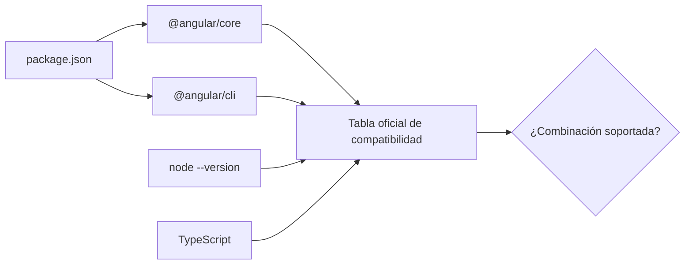
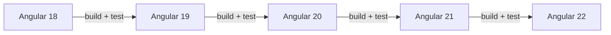

# Módulo 12: Versiones, compatibilidad y migraciones de Angular

Este capítulo enseña a reconocer la época de un proyecto, comprobar compatibilidad y migrar con evidencia. A julio de 2026, Angular 22 está en soporte activo; Angular 21 y 20 permanecen en LTS. No memorices este dato: aprende a comprobarlo en la tabla oficial antes de iniciar una migración.

## Aprende construyendo

### Tema 1: Reconocer la versión y la arquitectura de un proyecto

#### Paso 1 · Objetivo y preparación

Al finalizar podrás identificar la versión real de Angular, Node.js y TypeScript de un proyecto, y distinguir código heredado de una práctica vigente.

**Conocimiento previo:** terminal, `package.json`, componentes standalone y ejecución de scripts con Node.js.

#### Paso 2 · Contexto y caso real

**Caso real:** recibes un panel de operaciones que usa `NgModule`, Zone.js y APIs deprecadas. Antes de “modernizarlo” necesitas saber qué versión ejecuta, qué versiones soporta y qué migraciones faltan. Adivinar por la apariencia del código puede romper el build.

**¿Por qué es importante?** AngularJS 1.x y Angular 2+ son proyectos distintos. Dentro de Angular moderno también existen fronteras relevantes: Ivy fue predeterminado desde Angular 9; los componentes standalone aparecieron después; Signals y el control de flujo moderno cambiaron la forma recomendada de escribir aplicaciones. Angular 22 es la línea activa en julio de 2026, pero un proyecto puede estar legítimamente en una línea LTS anterior.

#### Paso 3 · Teoría, modelo mental y analogía

Una versión semántica tiene tres números: mayor, menor y parche. Un cambio mayor puede retirar APIs; uno menor añade capacidades compatibles; un parche corrige fallos. La versión del CLI, `@angular/core`, Node.js y TypeScript forma una **matriz de compatibilidad**: no basta actualizar un solo paquete.

**Analogía:** una aplicación Angular es un tren. `@angular/core`, CLI, TypeScript y Node.js son vagones acoplados; cambiar uno por un modelo incompatible puede impedir que todo el tren avance.



#### Paso 4 · Demostración guiada desde cero

Desde una **carpeta vacía**, crea el ejemplo independiente `ejemplo-version-angular`:

```bash
mkdir ejemplo-version-angular
cd ejemplo-version-angular
npm init -y
npm install --save-dev @angular/cli@22
npx ng version
```

`npm init -y` crea `package.json`; `--save-dev` registra el CLI como herramienta de desarrollo; `npx` ejecuta la copia local y evita mezclarla con un CLI global. La salida debe mostrar Angular CLI 22, además de Node.js y el sistema operativo.

Guarda `clasificar-version.mjs`:

```javascript
// La función clasifica la línea mayor; no intenta adivinar compatibilidad.
export function estadoAngular(mayor) {
  if (mayor === 22) return 'activo en julio de 2026';
  if (mayor === 21 || mayor === 20) return 'LTS en julio de 2026';
  return 'consultar tabla oficial: el estado cambia con el tiempo';
}

console.log(estadoAngular(22));
```

```bash
node clasificar-version.mjs
```

`node` es el comando que ejecuta el archivo `.mjs` con el runtime de Node.js.

**Resultado esperado:** `activo en julio de 2026`.

**Fallo deliberado:** cambia `@angular/cli@22` por una versión inexistente como `@angular/cli@999`. npm responderá `ETARGET`; diagnostica que el registro no contiene esa versión y restaura una versión publicada.

#### Paso 5 · Práctica guiada

Ejecuta `npm view @angular/core version` y compara el resultado con `npx ng version`. **Pista:** una consulta muestra lo más reciente del registro; la otra muestra lo instalado en tu proyecto. No son necesariamente iguales.

#### Paso 6 · Práctica independiente

Abre un proyecto Angular real, registra sus cuatro versiones relevantes y comprueba la combinación en la tabla oficial. Decide si está soportado sin actualizar nada todavía.

#### Paso 7 · Cierre y evidencia

Ya puedes separar “última versión” de “versión instalada y soportada”. El siguiente tema convierte esa observación en un plan seguro. **Evidencia:** entrega `package.json`, la salida de `ng version`, la salida del fallo `ETARGET` y una explicación de la matriz consultada.

**Errores comunes:** usar un CLI global distinto del local; asumir que “más nuevo” siempre significa compatible; actualizar `@angular/core` sin el CLI; confundir AngularJS con Angular.

**Fuente oficial:** [Angular — Versioning and releases](https://angular.dev/reference/releases) y [Angular — Version compatibility](https://angular.dev/reference/versions).

### Tema 2: Leer la guía de actualización antes de modificar archivos

#### Paso 1 · Objetivo y preparación

Al finalizar podrás producir un inventario de migración, ejecutar una simulación y distinguir cambios automáticos de decisiones manuales.

**Prerrequisitos:** tema anterior, Git, npm y un proyecto Angular que compile antes de migrar.

#### Paso 2 · Contexto y caso real

**Caso profesional:** un equipo debe actualizar una aplicación sin bloquear entregas. La migración necesita una línea base verde, un commit recuperable y una lista de deprecaciones; ejecutar comandos sin esa evidencia mezcla errores anteriores con errores introducidos por la actualización.

**¿Por qué es importante?** Una actualización cambia herramientas, dependencias y a veces código fuente. Preparar primero una línea base comprobable permite saber si un error ya existía o nació durante la migración, reduce el riesgo de perder trabajo y convierte una operación incierta en una secuencia que el equipo puede revisar y repetir.

#### Paso 3 · Teoría con analogía

`ng update` consulta metadatos de paquetes y ejecuta **migrations** o esquemas que reescriben código conocido. No puede decidir por ti si una API interna cambió de significado, si una prueba ausente ocultaba un fallo o si una dependencia externa todavía no es compatible.

**Analogía:** la herramienta automática es una cuadrilla que reemplaza señales de tránsito conocidas; el equipo sigue siendo responsable de comprobar que las rutas del negocio llegan al destino correcto.

#### Paso 4 · Demostración guiada desde cero

Crea un proyecto nuevo y una copia de trabajo independiente:

El primer comando es la forma reproducible de `ng new`: crea `src/app/app.ts`, la configuración y los scripts sin depender de un CLI global.

```bash
npx @angular/cli@21 new ejemplo-update --standalone --routing --style=scss --skip-git
cd ejemplo-update
npx ng build
git init
git add .
git commit -m "linea base Angular 21"
npx ng update @angular/core@22 @angular/cli@22 --dry-run
```

`--standalone` evita crear un `AppModule`; `--routing` prepara rutas; `--style=scss` selecciona SCSS; `--skip-git` permite que tú controles el primer commit; `--dry-run` calcula cambios sin escribirlos.

**Resultado esperado:** el build inicial termina correctamente y la simulación enumera los paquetes o migraciones sin dejar cambios en `git status`.

**Fallo deliberado:** elimina temporalmente `node_modules` y ejecuta `npx ng build` sin instalar dependencias. El error de módulos ausentes demuestra que un fallo del entorno no es un fallo de migración. Corrige con `npm ci` y repite la línea base.

#### Paso 5 · Práctica guiada

Guarda la salida de `ng update --dry-run` en `docs/migracion-angular-22.txt`. **Pista:** en PowerShell usa `| Tee-Object`; en macOS/Linux usa `| tee`.

#### Paso 6 · Práctica independiente

Clasifica cada aviso como automático, manual o bloqueado por una dependencia. Escribe qué prueba verificaría cada cambio manual antes de aplicar la actualización.

#### Paso 7 · Cierre y evidencia

Ahora tienes un plan antes de tocar archivos. El siguiente tema aplica la actualización en saltos controlados. **Evidencia:** entrega el build verde, el commit base, la simulación, el fallo diagnosticado y la clasificación de cambios.

**Errores comunes:** migrar con el repositorio sucio; confundir `--dry-run` con una migración aplicada; ignorar peer dependencies; no guardar la salida; comenzar sin pruebas.

**Fuente oficial:** [Angular CLI — ng update](https://angular.dev/cli/update) y [Angular Update Guide](https://angular.dev/update-guide).

### Tema 3: Migrar una versión mayor a la vez y verificar cada salto

#### Paso 1 · Objetivo y preparación

Al finalizar podrás dividir una migración grande en saltos consecutivos, verificar cada frontera y revertir un salto sin perder trabajo.

**Conocimiento previo:** Git, pruebas, build de producción y lectura de la guía de actualización.

#### Paso 2 · Contexto y caso real

**Caso real:** una aplicación Angular 18 debe llegar a Angular 22. Hacer un cambio único oculta qué migración rompió el contrato; avanzar 18→19→20→21→22 produce cuatro estados comprobables y recuperables.

**¿Por qué es importante?** Migrar una versión mayor por vez conserva un punto de diagnóstico claro. Si aparece un fallo, sabes en qué salto nació, qué cambios revisar y a qué commit regresar; sin esas fronteras, varios cambios incompatibles pueden mezclarse y hacer que la causa real quede oculta.

#### Paso 3 · Teoría con analogía

Cada versión mayor contiene transformaciones pensadas para el estado producido por la versión anterior. Saltar fronteras puede omitir migraciones, combinar deprecaciones y dejar dependencias incompatibles.

**Analogía:** es una escalera con descansos. En cada descanso compruebas equilibrio, equipaje y dirección; un salto de cuatro pisos elimina los puntos donde podrías detectar y corregir el problema.



#### Paso 4 · Demostración guiada desde cero

En una carpeta vacía crea el ejemplo independiente `plan-migracion` y guarda el programa en `src/plan.mjs`:

```bash
mkdir plan-migracion
cd plan-migracion
npm init -y
mkdir src
```

Guarda `src/plan.mjs`:

```javascript
// Devuelve cada salto consecutivo para poder validarlo por separado.
export function crearPlan(origen, destino) {
  if (!Number.isInteger(origen) || !Number.isInteger(destino) || destino <= origen) {
    throw new Error('El destino debe ser una versión mayor entera');
  }
  return Array.from({ length: destino - origen }, (_, i) => [origen + i, origen + i + 1]);
}

console.log(crearPlan(18, 22).map(([a, b]) => `${a}→${b}`).join(', '));
```

```bash
node src/plan.mjs
```

**Salida esperada:** `18→19, 19→20, 20→21, 21→22`.

**Fallo deliberado:** ejecuta `crearPlan(22, 18)`. Debe aparecer `El destino debe ser una versión mayor entera`; el diagnóstico es una dirección de migración inválida, no un problema de npm.

#### Paso 5 · Práctica guiada

Añade a cada salto los comandos `ng update`, `ng build` y `ng test`. **Pista:** ningún salto se considera terminado si el build o las pruebas fallan.

#### Paso 6 · Práctica independiente

Diseña un plan 16→22 que incluya commit, migración, pruebas, revisión de deprecaciones y criterio de rollback por cada versión. No ejecutes la siguiente versión hasta cerrar la anterior.

#### Paso 7 · Cierre y evidencia

Terminaste el capítulo con una migración observable y reversible. El próximo capítulo aplica esta disciplina al proyecto integrador. **Evidencia:** entrega la salida del plan, el fallo deliberado, los comandos por salto y el criterio que autoriza continuar.

**Errores comunes:** saltar varias versiones; actualizar dependencias no relacionadas al mismo tiempo; no leer deprecaciones; borrar pruebas que fallan; continuar con un build rojo.

**Fuente oficial:** [Angular Update Guide](https://angular.dev/update-guide), [Angular releases](https://angular.dev/reference/releases) y [Angular compatibility](https://angular.dev/reference/versions).

---

## Laboratorio práctico

Elige un proyecto Angular propio o crea uno en una versión LTS. Documenta versión instalada, matriz compatible, simulación, plan de saltos y evidencia verde. El laboratorio termina cuando otra persona puede repetir tu migración y explicar por qué cada paso es seguro.
