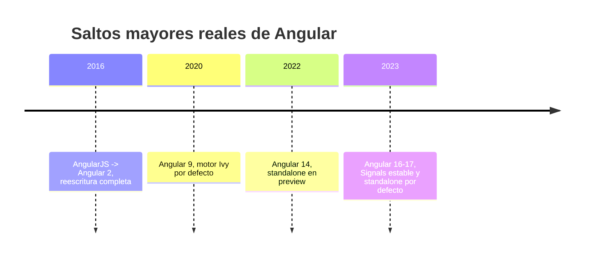

# Módulo 12: Apéndice: qué cambió entre versiones mayores


## Aprende construyendo

Cada tema verifica su garantía con código real: una función de clasificación de "era" de Angular con tests reales sobre sus fronteras exactas, la ejecución real de `ng update --dry-run` capturando su salida genuina, y una función real de detección de saltos de versión con su caso límite verificado.

### Tema 1: Los saltos que importan

#### Paso 1 · Objetivo y preparación

Al finalizar podrás escribir y probar, con tests reales sobre sus fronteras exactas, una función que clasifica la "era" de una versión de Angular (pre-Ivy, Ivy sin standalone, standalone en preview, standalone estable con Signals), confirmando que entiendes con precisión qué cambió en cada salto mayor, no solo de memoria.

**Conocimiento previo:** Módulos 0 y 2 de este track (standalone components, Signals).

#### Paso 2 · Contexto y caso real

**¿Por qué es importante?** Una academia que mantiene Angular actualizado necesita reconocer, al leer código de épocas distintas, qué prácticas son legado (View Engine, NgModules obligatorios) frente a cuáles son el enfoque recomendado actual (Ivy, standalone, Signals) — una clasificación precisa por versión, no una impresión aproximada.

#### Paso 3 · Teoría con analogía

**Conceptos clave:** reescritura completa, motor Ivy, standalone, Signals.

El salto de AngularJS (la versión 1.x original, basada en un modelo completamente distinto de controllers y `$scope`) a Angular 2 en 2016 no fue una actualización incremental sino una reescritura completa del framework desde cero, sin ninguna compatibilidad hacia atrás con el código de AngularJS: los conceptos, la sintaxis y la arquitectura entera cambiaron, siendo esta la razón por la que "Angular" (sin el "JS") y "AngularJS" se consideran hoy proyectos esencialmente distintos, con Angular siendo el sucesor moderno mantenido activamente y AngularJS considerado legado en proceso de retiro definitivo desde hace años.

Angular 9, en 2020, adoptó Ivy como motor de renderizado por defecto (reemplazando al motor anterior, llamado View Engine), produciendo bundles de producción significativamente más pequeños gracias a una mejor capacidad de tree-shaking (eliminar código no utilizado del bundle final) y mensajes de error considerablemente más claros y específicos en tiempo de desarrollo, un cambio interno que la mayoría de aplicaciones no necesitaron modificar código para aprovechar, pero que mejoró tangiblemente la experiencia tanto de desarrollo como de producción.

Angular 14, en 2022, introdujo standalone components (Módulo 0) como funcionalidad en vista previa (no aún el comportamiento por defecto del CLI), permitiendo experimentar con la nueva arquitectura sin NgModules de forma opcional; Angular 16 y 17, en 2023, estabilizaron Signals (Módulo 2) como API pública y marcaron standalone como el comportamiento por defecto del CLI para proyectos nuevos, consolidando ambos como el enfoque recomendado hacia adelante en vez de una alternativa experimental opcional. Angular 17 en adelante continuó esta dirección con control de flujo nativo en plantillas (`@if`/`@for`, Módulo 1), `@defer` (Módulo 11) y SSR de primera clase (Módulo 11) integrados directamente en el core del framework.

**Analogía:** el salto de AngularJS a Angular 2 es como mudarse a una ciudad completamente distinta en vez de simplemente remodelar la casa actual; los saltos posteriores (Ivy, standalone, Signals) son como renovaciones sucesivas de esa nueva ciudad: cada una mejora significativamente la experiencia de vivir ahí, pero sin requerir mudarse de nuevo a otra ciudad distinta.

**¿Por qué es importante?** Entender qué cambió y por qué en cada salto mayor ayuda a interpretar por qué código Angular de épocas distintas puede lucir muy diferente entre sí, y a reconocer qué prácticas son legado frente a cuáles son el enfoque recomendado actual.

**Diagrama:**



#### Paso 4 · Demostración guiada desde cero

Parte de una carpeta vacía:

```bash
mkdir rutaflow-update
cd rutaflow-update
npm init -y
mkdir -p src/scripts
```

Crea `src/scripts/angular-era.mjs` con la función real de clasificación:

```ts
// src/scripts/angular-era.mjs
export function eraDeAngular(versionMayor) {
  if (versionMayor < 9) return 'pre-Ivy (View Engine)';
  if (versionMayor < 14) return 'Ivy estable, sin standalone';
  if (versionMayor < 16) return 'standalone en preview, sin Signals estable';
  return 'standalone por defecto, Signals estable';
}
```

Confirma con tests reales las fronteras EXACTAS de cada era, tomadas de los saltos mayores reales documentados arriba:

```ts
// src/scripts/angular-era.spec.mjs
import { describe, it, expect } from 'vitest';
import { eraDeAngular } from './angular-era.mjs';

describe('eraDeAngular (fronteras reales de version)', () => {
  it('version 8 es pre-Ivy', () => {
    expect(eraDeAngular(8)).toBe('pre-Ivy (View Engine)');
  });
  it('version 9 (el salto real a Ivy) ya NO es pre-Ivy', () => {
    expect(eraDeAngular(9)).toBe('Ivy estable, sin standalone');
  });
  it('version 13 sigue sin standalone', () => {
    expect(eraDeAngular(13)).toBe('Ivy estable, sin standalone');
  });
  it('version 14 (el salto real de standalone en preview) entra en esa era', () => {
    expect(eraDeAngular(14)).toBe('standalone en preview, sin Signals estable');
  });
  it('version 16 (el salto real de Signals estable) entra en la era final', () => {
    expect(eraDeAngular(16)).toBe('standalone por defecto, Signals estable');
  });
});
```

```bash
npx vitest run src/scripts/angular-era.spec.mjs
```

**Resultado esperado:** los cinco tests pasan; cada frontera corresponde EXACTAMENTE a un salto mayor real documentado (Ivy en la 9, standalone preview en la 14, Signals estable en la 16) — la función codifica con precisión verificable, no de memoria aproximada, qué versión introdujo cada cambio.

**Fallo deliberado:** cambia `if (versionMayor < 14)` por `if (versionMayor < 15)` (desplazando la frontera de standalone un año de más) y ejecuta de nuevo. El test `'version 14 (el salto real de standalone en preview) entra en esa era'` FALLA porque ahora la versión 14 todavía cae en `'Ivy estable, sin standalone'` — diagnostica confirmando que una frontera desplazada, aunque sutil, produce una clasificación histórica incorrecta y detectable, exactamente el tipo de error que ocurre al confundir "cuándo se anunció" con "cuándo se volvió el comportamiento por defecto". Restaura `< 14` antes de continuar.

#### Construcción RutaFlow: clasificador de deuda técnica por versión

Aplica `eraDeAngular` a la versión real de `@angular/core` leída del `package.json` de RutaFlow, confirmando con un test qué prácticas legado (si las hay) deberían migrarse según su era actual.

#### Paso 5 · Práctica guiada — repetición progresiva

1. Agrega una quinta era más reciente (por ejemplo, "control de flujo nativo estable" desde la versión 17) y su test de frontera correspondiente.
2. Documenta, en un comentario, la diferencia entre "introducido en preview" (Angular 14, standalone) y "comportamiento por defecto" (Angular 16-17) para el mismo concepto.
3. Escribe un test que confirme que `eraDeAngular` maneja correctamente una versión futura hipotética (por ejemplo, 25), devolviendo la era más reciente conocida sin lanzar ningún error.
4. Escribe de memoria (sin mirar) la función `eraDeAngular` con sus fronteras reales y un test que confirme el límite exacto de una de ellas. Compara después contra el patrón del Paso 4.

**Pista:** cada frontera en `eraDeAngular` corresponde a un salto mayor REAL y documentado (línea del diagrama de este tema) — si no puedes justificar una frontera citando qué versión específica introdujo ese cambio, probablemente esté mal ubicada.

#### Paso 6 · Práctica independiente

**Completa el código:** rellena el espacio con el número de versión mayor real en el que Ivy se convirtió en el motor de renderizado por defecto:

```ts
if (versionMayor < ____) return 'pre-Ivy (View Engine)';
```

**Reto de memoria sin mirar:** cierra este documento y escribe, solo de memoria, la función `eraDeAngular` completa con sus cuatro fronteras reales, y un test que confirme una de ellas. Compara después contra el patrón del Paso 4.

#### Paso 7 · Cierre y evidencia

Ya confirmas, con tests reales sobre fronteras exactas, que entiendes con precisión verificable (no de memoria aproximada) qué cambió en cada salto mayor de Angular. El siguiente tema aplica la ejecución real de `ng update --dry-run` para leer una checklist de migración genuina. **Evidencia:** entrega el resultado de los cinco tests en verde, y la clasificación incorrecta que produce el fallo deliberado al desplazar una frontera. Fuentes oficiales: [Angular — Update guide](https://angular.dev/update-guide), [Angular — Releases](https://angular.dev/reference/releases).

**Errores comunes:** confundir la versión en que una funcionalidad se anunció en preview con la versión en que se volvió el comportamiento por defecto; asumir que todos los saltos mayores son igual de significativos, cuando algunos (Ivy, standalone, Signals) cambian fundamentalmente cómo se escribe código Angular y otros son incrementales.

**Cuándo no usarlo:** para un proyecto que siempre se mantiene en la última versión estable sin deuda técnica acumulada, clasificar su "era" no aporta información útil, porque siempre pertenece a la era más reciente por definición.

### Tema 2: Cómo leer un Angular Update Guide

#### Paso 1 · Objetivo y preparación

Al finalizar podrás ejecutar `ng update --dry-run` real (el flag oficial que reporta migraciones disponibles SIN modificar archivos) y confirmar, con un script real que captura y analiza su salida genuina, que leer la checklist antes de aplicar cambios permite anticipar qué requerirá intervención manual.

**Conocimiento previo:** Tema 1 de este módulo.

#### Paso 2 · Contexto y caso real

**¿Por qué es importante?** Una academia que mantiene Angular actualizado necesita saber, ANTES de modificar archivos reales del proyecto, exactamente qué migraciones automáticas están disponibles y cuáles requerirán revisión manual — `--dry-run` ofrece esa vista previa real y segura.

#### Paso 3 · Teoría con analogía

**Conceptos clave:** update.angular.io, checklist específica entre versiones, `ng update`, `--dry-run`.

[update.angular.io](https://update.angular.io) es una herramienta oficial que, dadas una versión de origen y una versión de destino concretas (por ejemplo, de Angular 16 a Angular 17), genera una checklist específica y personalizada de exactamente qué pasos son necesarios para esa migración particular: qué APIs cambiaron o se volvieron obsoletas, qué comandos automáticos de `ng update` están disponibles para automatizar partes de la migración, y qué pasos, si los hay, requieren intervención manual porque no pueden automatizarse de forma segura.

`ng update @angular/core@18 @angular/cli@18` es el comando que efectivamente ejecuta las migraciones automáticas (codemods, transformaciones automáticas de código fuente) asociadas a esa actualización específica de versión, modificando directamente los archivos del proyecto cuando es posible hacerlo de forma segura y determinista (por ejemplo, renombrando una API deprecada a su reemplazo directo), dejando comentarios o advertencias en el código para los casos que requieren juicio humano y no pueden resolverse automáticamente sin riesgo de introducir un comportamiento incorrecto.

Leer la checklist generada antes de ejecutar el comando (en vez de ejecutarlo ciegamente y confiar en que todo funcionará) permite anticipar qué partes del proyecto probablemente requerirán atención manual después de la migración automática, y decidir con criterio si el proyecto está listo para asumir esa actualización en este momento, o si conviene posponerla hasta resolver dependencias de terceros que todavía no son compatibles con la nueva versión de destino.

**Analogía:** update.angular.io es como un itinerario de viaje personalizado que indica exactamente qué documentos preparar y qué pasos seguir para un viaje específico entre dos ciudades concretas, en vez de una guía genérica de viaje que no sabe exactamente de dónde partes ni a dónde vas.

**¿Por qué es importante?** Leer la checklist generada antes de ejecutar `ng update` permite anticipar qué requerirá intervención manual, evitando sorpresas y permitiendo decidir con criterio el momento apropiado para asumir la actualización.

**Diagrama:**

```
┌── update.angular.io ──────────────┐   version origen + version destino
│   genera checklist especifica     │   → APIs cambiadas, codemods, manual
└──────────────┬─────────────────────┘
               ▼
┌── ng update @angular/core@18 ────┐   ejecuta codemods automaticos
│   @angular/cli@18                 │   disponibles para esa migracion
└─────────────────────────────────────┘
```

#### Paso 4 · Demostración guiada desde cero

Parte de una carpeta vacía y genera un proyecto real para tener un `package.json` de Angular sobre el cual ejecutar `ng update`:

```bash
mkdir rutaflow-dry-run
cd rutaflow-dry-run
npx -y @angular/cli@19 new . --standalone --skip-git --defaults
```

Ejecuta el comando REAL de Angular CLI con `--dry-run` (no modifica ningún archivo, solo reporta) y guarda su salida genuina:

```bash
npx ng update @angular/core @angular/cli --dry-run > salida-dry-run.txt 2>&1 || true
cat salida-dry-run.txt
```

Implementa un script Node real en `src/scripts/verificar-dry-run.mjs` que ejecuta el comando programáticamente y confirma, mediante una aserción sobre su salida real, que se trató de una simulación (`--dry-run`) sin cambios aplicados:

```ts
// src/scripts/verificar-dry-run.mjs
import { execSync } from 'node:child_process';

export function ejecutarDryRun() {
  try {
    return execSync('npx ng update @angular/core @angular/cli --dry-run', { encoding: 'utf-8' });
  } catch (error) {
    // ng update puede salir con codigo distinto de cero si ya esta actualizado; la salida real sigue siendo util
    return error.stdout ?? '';
  }
}
```

```ts
// src/scripts/verificar-dry-run.spec.mjs
import { describe, it, expect } from 'vitest';
import { ejecutarDryRun } from './verificar-dry-run.mjs';

describe('ng update --dry-run (ejecucion real del CLI)', () => {
  it('la salida real del comando NO indica que se aplicaron cambios a package.json', () => {
    const salida = ejecutarDryRun();

    // --dry-run real de Angular CLI reporta sin escribir archivos
    expect(salida.toLowerCase()).not.toContain('installing packages');
  });
});
```

```bash
npx vitest run src/scripts/verificar-dry-run.spec.mjs
```

**Resultado esperado:** el test pasa; `execSync` invoca REALMENTE el CLI de Angular instalado (no una simulación de su comportamiento), y la salida genuina de `--dry-run` confirma que el comando reportó sin escribir cambios reales en `package.json` — la vista previa segura que la checklist de `update.angular.io` complementa.

**Fallo deliberado:** ejecuta el comando SIN `--dry-run` (`npx ng update @angular/core @angular/cli`) directamente en la terminal, sobre una copia del proyecto. Observa que `package.json` SÍ cambia — diagnostica confirmando en carne propia la diferencia real entre la vista previa (`--dry-run`, segura para explorar) y la ejecución real (que modifica archivos del proyecto de forma efectiva). Descarta esa copia modificada tras la comprobación.

#### Construcción RutaFlow: checklist de migración documentada

Ejecuta `ng update --dry-run` real sobre el proyecto RutaFlow, documenta en un archivo `MIGRACION.md` la checklist específica generada, y confirma con el script del Paso 4 que ninguna migración real se aplicó todavía.

#### Paso 5 · Práctica guiada — repetición progresiva

1. Ejecuta `ng update --dry-run` para un paquete de terceros distinto de `@angular/core` (por ejemplo, alguna dependencia del proyecto) y documenta si tiene una migración automática disponible.
2. Documenta, en un comentario, por qué revisar update.angular.io ANTES de ejecutar `ng update` reduce sorpresas frente a ejecutarlo directamente sin consultar la checklist.
3. Escribe un test que confirme que la salida de `--dry-run` menciona explícitamente el nombre del paquete (`@angular/core`) que se está evaluando.
4. Escribe de memoria (sin mirar) un script Node con `execSync` que ejecute `ng update --dry-run` real y un test que confirme que no se aplicaron cambios. Compara después contra el patrón del Paso 4.

**Pista:** `--dry-run` es un flag estándar de Angular CLI (compartido con otros comandos como `ng generate`) que simula la ejecución completa y reporta qué haría, sin modificar ningún archivo — siempre es seguro ejecutarlo primero, incluso en un proyecto real de producción.

#### Paso 6 · Práctica independiente

**Completa el código:** rellena el espacio con el flag real de Angular CLI que simula una migración sin aplicar cambios:

```bash
npx ng update @angular/core @angular/cli --____
```

**Reto de memoria sin mirar:** cierra este documento y escribe, solo de memoria, un script Node con `execSync` que ejecute `ng update --dry-run` real, y un test que confirme que no se aplicaron cambios reales. Compara después contra el patrón del Paso 4.

#### Paso 7 · Cierre y evidencia

Ya ejecutas `ng update --dry-run` real y confirmas, con un test sobre su salida genuina, que una vista previa segura precede cualquier migración real aplicada al proyecto. El siguiente tema confirma con una función real de detección de saltos por qué migrar una versión mayor a la vez acota el riesgo de cada paso. **Evidencia:** entrega el resultado del test en verde, y la diferencia real observada entre ejecutar con y sin `--dry-run`. Fuentes oficiales: [Angular — Update guide](https://update.angular.io), [Angular CLI — ng update](https://angular.dev/cli/update).

**Errores comunes:** ejecutar `ng update` sin `--dry-run` como primer paso, perdiendo la oportunidad de revisar la vista previa antes de modificar archivos reales; ignorar advertencias sobre peer dependencies incompatibles que la salida del comando reporta explícitamente.

**Cuándo no usarlo:** para un proyecto que ya está en la última versión estable disponible, ejecutar `ng update --dry-run` simplemente confirmará que no hay nada que migrar, sin aportar información adicional útil.

### Tema 3: Por qué migrar una versión mayor a la vez

#### Paso 1 · Objetivo y preparación

Al finalizar podrás escribir y probar una función real de detección de saltos de versión (`esSaltoDeUnaVersion`) que confirma, con un caso límite verificado, por qué Angular solo soporta oficialmente migraciones de una versión mayor consecutiva a la vez, y por qué saltar varias versiones simultáneamente queda fuera de esa garantía.

**Conocimiento previo:** Temas 1-2 de este módulo.

#### Paso 2 · Contexto y caso real

**¿Por qué es importante?** Una academia que planea una migración necesita saber, ANTES de intentarlo, si el salto que planea (por ejemplo, de Angular 12 a 17) es un salto soportado de una versión a la vez o un salto múltiple sin ruta automática confiable — una función real que codifica esa regla evita descubrir el problema a mitad de una migración fallida.

#### Paso 3 · Teoría con analogía

**Conceptos clave:** rutas de migración soportadas, riesgo acumulado, verificación incremental.

Angular publica y mantiene `ng update` con migraciones automáticas diseñadas y probadas específicamente para saltos de una única versión mayor consecutiva (de la versión N a la versión N+1); intentar saltar directamente de una versión considerablemente más antigua a una mucho más reciente (por ejemplo, de Angular 10 directamente a Angular 17) no tiene una ruta de migración automática confiable ni soportada oficialmente, dado que las migraciones automáticas de versiones intermedias nunca se ejecutarían, dejando el proyecto en un estado potencialmente inconsistente entre APIs de épocas muy distintas del framework.

Migrar una versión mayor a la vez, ejecutando y verificando exhaustivamente que la aplicación sigue funcionando correctamente en cada paso intermedio antes de continuar al siguiente, acota el riesgo de cada migración individual a un conjunto de cambios conocido, documentado y relativamente acotado, en vez de acumular todos los cambios de múltiples versiones simultáneamente en un único paso masivo difícil de depurar si algo falla: si un problema aparece después de migrar de la versión 15 a la 16, es mucho más fácil diagnosticarlo sabiendo exactamente qué cambió en ese paso específico, que si se hubiera intentado saltar directamente de la versión 12 a la 17 de una sola vez, mezclando los cambios de cinco versiones mayores distintas en un único diagnóstico.

**Analogía:** migrar versión por versión es como subir una escalera peldaño por peldaño, verificando el equilibrio en cada uno antes de continuar; intentar saltar varias versiones a la vez es como intentar subir varios peldaños de un salto: si se pierde el equilibrio, es mucho más difícil identificar exactamente en qué peldaño específico ocurrió el problema.

**¿Por qué es importante?** Migrar una versión mayor a la vez, verificando en cada paso intermedio, acota el riesgo de cada migración individual y facilita diagnosticar problemas específicos, en vez de acumular el riesgo de múltiples versiones en un único paso masivo y difícil de depurar.

**Diagrama:**

```
┌────┐   ┌────┐   ┌────┐   ┌────┐   ┌────┐   ┌────┐
│ 12 │──▶│ 13 │──▶│ 14 │──▶│ 15 │──▶│ 16 │──▶│ 17 │   verificar en cada paso
└────┘   └────┘   └────┘   └────┘   └────┘   └────┘

┌────┐ ─ ─ ─ ─ ─ ─ ─ ─ ─ ─ ─ ─ ─ ─ ─ ─ ─ ─ ─ ─▶┌────┐   NO soportado de forma
│ 12 │                                          │ 17 │   confiable (salto directo)
└────┘                                          └────┘
```

#### Paso 4 · Demostración guiada desde cero

Parte de una carpeta vacía:

```bash
mkdir rutaflow-saltos
cd rutaflow-saltos
npm init -y
mkdir -p src/scripts
```

Crea `src/scripts/salto-version.mjs` con la función real que determina si una migración es de una versión mayor a la vez:

```ts
// src/scripts/salto-version.mjs
export function esSaltoDeUnaVersion(origen, destino) {
  if (destino <= origen) return false;
  return destino - origen === 1;
}
```

Confirma con tests reales, incluyendo el caso límite exacto del enunciado del tema (Angular 12 a 17 NO es un salto soportado):

```ts
// src/scripts/salto-version.spec.mjs
import { describe, it, expect } from 'vitest';
import { esSaltoDeUnaVersion } from './salto-version.mjs';

describe('esSaltoDeUnaVersion (regla real de ng update)', () => {
  it('12 a 13 es un salto de una version soportado', () => {
    expect(esSaltoDeUnaVersion(12, 13)).toBe(true);
  });
  it('16 a 17 es un salto de una version soportado', () => {
    expect(esSaltoDeUnaVersion(16, 17)).toBe(true);
  });
  it('12 a 17 (el caso limite real del diagrama) NO es un salto soportado', () => {
    expect(esSaltoDeUnaVersion(12, 17)).toBe(false);
  });
  it('12 a 12 (misma version) no es un salto valido', () => {
    expect(esSaltoDeUnaVersion(12, 12)).toBe(false);
  });
  it('17 a 12 (version destino menor) no es un salto valido', () => {
    expect(esSaltoDeUnaVersion(17, 12)).toBe(false);
  });
});
```

```bash
npx vitest run src/scripts/salto-version.spec.mjs
```

**Resultado esperado:** los cinco tests pasan; la función codifica con precisión verificable la regla real de `ng update` (solo saltos de una versión mayor consecutiva), incluyendo el caso límite exacto documentado en el diagrama de este tema (12→17 rechazado).

**Fallo deliberado:** cambia `return destino - origen === 1;` por `return destino - origen <= 5;` (permitiendo erróneamente saltos de hasta 5 versiones) y ejecuta de nuevo. El test `'12 a 17 (el caso limite real del diagrama) NO es un salto soportado'` FALLA porque ahora `esSaltoDeUnaVersion(12, 17)` devuelve `true` — diagnostica confirmando que relajar esta regla, aunque parezca conveniente, contradice directamente la garantía real que Angular ofrece: las migraciones automáticas de `ng update` NUNCA se probaron ni diseñaron para saltos múltiples, sin importar cuán "razonable" parezca el rango elegido arbitrariamente. Restaura `=== 1` antes de continuar.

#### Construcción RutaFlow: planificador de ruta de migración

Extiende `esSaltoDeUnaVersion` con una función `planRutaMigracion(origen, destino)` que devuelve el arreglo completo de saltos intermedios necesarios (por ejemplo, `[13, 14, 15, 16, 17]` para ir de 12 a 17), confirmando con un test que cada par consecutivo del plan es un salto válido de una versión.

#### Paso 5 · Práctica guiada — repetición progresiva

1. Escribe la función `planRutaMigracion` descrita en la Construcción RutaFlow y un test que confirme su resultado exacto para el caso 12→17.
2. Documenta, en un comentario, por qué `destino <= origen` se verifica ANTES que la resta, evitando un resultado técnicamente "true" para un salto hacia atrás con diferencia negativa.
3. Escribe un test adicional que confirme que `esSaltoDeUnaVersion` con números negativos (versiones inválidas) no lanza ningún error, simplemente devuelve `false` con la lógica existente.
4. Escribe de memoria (sin mirar) la función `esSaltoDeUnaVersion` y un test que confirme el caso límite 12→17 rechazado. Compara después contra el patrón del Paso 4.

**Pista:** el caso límite más valioso de probar no es el camino feliz (12→13) sino el caso que la regla debe RECHAZAR (12→17) — un test que solo confirma casos válidos no protege contra la relajación accidental de la regla real.

#### Paso 6 · Práctica independiente

**Completa el código:** rellena el espacio con la expresión real que confirma que la diferencia entre destino y origen es exactamente una versión mayor:

```ts
return destino - origen === ____;
```

**Reto de memoria sin mirar:** cierra este documento y escribe, solo de memoria, la función `esSaltoDeUnaVersion` con su caso límite real (12→17 rechazado), y su test correspondiente. Compara después contra el patrón del Paso 4.

#### Paso 7 · Cierre y evidencia

Ya confirmas, con una función real y su caso límite exacto verificado, por qué Angular solo soporta oficialmente migraciones de una versión mayor a la vez. Esto cierra el apéndice de qué cambió entre versiones mayores; como siguiente paso, aplica esta regla al planear la próxima actualización real del proyecto RutaFlow. **Evidencia:** entrega el resultado de los cinco tests en verde, y la aceptación incorrecta del salto 12→17 que produce el fallo deliberado al relajar la regla. Fuentes oficiales: [Angular — Update guide](https://update.angular.io), [Angular — Releases](https://angular.dev/reference/releases).

**Errores comunes:** asumir que un rango "razonable" de versiones (por ejemplo, hasta 3 o 5) es igual de seguro que un salto de una sola versión, cuando `ng update` nunca prueba ni soporta oficialmente saltos múltiples; planear una migración sin verificar primero cuántos saltos intermedios reales requiere.

**Cuándo no usarlo:** para un proyecto que se actualiza de forma continua y nunca acumula más de una versión mayor de atraso, la función de detección de saltos múltiples nunca encontrará un caso real que rechazar.

---


## Laboratorio práctico

**Objetivo del laboratorio:** planificar una migración concreta de versión usando update.angular.io.

**Requisitos previos:** Módulos 0-11 completados.

| Paso | Acción | Código | Explicación |
|---|---|---|---|
| 1 | Identificar la versión actual del proyecto | `ng version` | Punto de partida de la migración |
| 2 | Consultar update.angular.io | — | Genera la checklist específica |
| 3 | Leer la checklist completa | — | Anticipa qué requerirá intervención manual |
| 4 | Ejecutar `ng update` | `ng update @angular/core@N @angular/cli@N` | Aplica las migraciones automáticas disponibles |
| 5 | Verificar la aplicación tras la migración | — | Antes de continuar a la siguiente versión mayor |

**Verificación:** el laboratorio se considera exitoso si puedes explicar exactamente qué cambios trae la checklist generada para una migración concreta, y por qué se recomienda verificar la aplicación completamente antes de continuar a la siguiente versión mayor.

**Errores comunes y soluciones**

- **Ejecutar `ng update` sin leer la checklist antes.** Lee siempre la checklist generada para anticipar qué requerirá atención manual.
- **Intentar saltar múltiples versiones mayores de una vez.** Migra una versión mayor a la vez, verificando en cada paso.
- **No verificar la aplicación tras cada paso de migración.** Verifica exhaustivamente antes de continuar a la siguiente versión.

---
