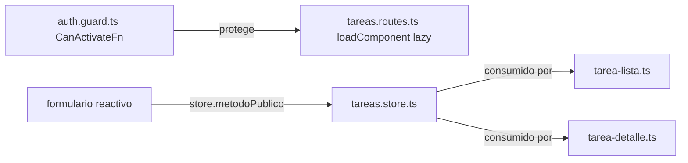

# Módulo 13: Proyecto integrador — aplicación standalone completa


## Aprende construyendo

Cada tema verifica su garantía con pruebas de integración reales: `RouterTestingHarness` oficial de Angular navegando rutas realmente protegidas, la identidad singleton real de un store inyectado en dos componentes distintos, y `HttpTestingController` real interceptando la petición HTTP genuina de `TareasStore`.

### Tema 1: Estructura del proyecto integrador

#### Paso 1 · Objetivo y preparación

Al finalizar podrás confirmar, con `RouterTestingHarness` (la utilidad oficial de test de router de Angular) navegando realmente entre rutas, que la separación `tareas/` / `auth/` funciona como puntos de integración explícitos: el guard de `auth/` bloquea o permite el acceso a las rutas de `tareas/` según el estado real de sesión.

**Conocimiento previo:** Módulo 4 de este track (routing y guards); Módulo 8 (organización por feature).

#### Paso 2 · Contexto y caso real

**¿Por qué es importante?** Una app de entregas necesita que la navegación, el estado y el backend convivan sin que el estudiante adivine dónde vive cada archivo; una estructura por feature con puntos de integración explícitos (el guard, el interceptor) hace que esa convivencia sea verificable con pruebas reales de navegación, no solo revisión visual.

#### Paso 3 · Teoría con analogía

**Conceptos clave:** organización por feature, separación entre `tareas/` y `auth/`, `RouterTestingHarness`.

Siguiendo el principio de organización por feature estudiado en el Módulo 8, el proyecto integrador se estructura en dos features principales claramente separadas: `tareas/`, que agrupa todo lo relacionado con la gestión de tareas (`tarea-lista.ts` para listar, `tarea-detalle.ts` para ver/editar una tarea individual, `tareas.store.ts` como store centralizado de estado, y `tareas.routes.ts` con las rutas específicas de esta feature), y `auth/`, que agrupa todo lo relacionado con autenticación (`auth.guard.ts` como guard funcional de protección de rutas, `auth.interceptor.ts` como interceptor de autenticación HTTP, y `auth.service.ts` como servicio de estado de sesión).

`app.routes.ts` y `app.config.ts` permanecen en la raíz de `src/app/`, actuando como el punto de composición donde se ensamblan las rutas y providers de cada feature individual (mediante `loadChildren` o composición directa de arreglos de rutas, Módulo 4), sin que la raíz de la aplicación necesite conocer los detalles internos de implementación de cada feature, solo su punto de integración público (las rutas que expone, los providers globales que requiere).

Esta separación clara entre `tareas/` y `auth/` refleja además una separación de responsabilidades a nivel de dominio: `auth/` se preocupa exclusivamente por quién es el usuario actual y si tiene permiso para acceder a ciertas rutas, mientras que `tareas/` se preocupa exclusivamente por la lógica de negocio de gestión de tareas en sí, comunicándose entre sí solo a través de puntos de integración explícitos (el guard consultando el estado de autenticación, el interceptor agregando el token a las peticiones de tareas), sin que la lógica de tareas necesite conocer los detalles internos de cómo funciona la autenticación.

**Analogía:** la estructura del proyecto integrador es como un edificio con departamentos claramente delimitados (tareas, autenticación), cada uno con su propia responsabilidad interna bien definida, comunicándose entre sí únicamente a través de puertas y protocolos explícitos (el guard, el interceptor), sin que un departamento necesite conocer el funcionamiento interno completo del otro.

**¿Por qué es importante?** Una estructura clara por feature, con puntos de integración explícitos entre features distintas, mantiene el proyecto comprensible y modificable a medida que crece, evitando que la lógica de dominios distintos se entremezcle de forma difícil de mantener.

**Diagrama:**

```
┌── src/app/tareas/ ──────────────────┐   ┌── src/app/auth/ ─────────────────┐
│  tarea-lista.ts                     │   │  auth.guard.ts                   │
│  tarea-detalle.ts                   │   │  auth.interceptor.ts             │
│  tareas.store.ts  (signals+computed)│   │  auth.service.ts                 │
│  tareas.routes.ts                   │   └───────────────────────────────────┘
└──────────────────────────────────────┘
┌── src/app/ (raiz) ───────────────────┐
│  app.routes.ts   (compone ambas)     │
│  app.config.ts                       │
└───────────────────────────────────────┘
```

#### Paso 4 · Demostración guiada desde cero

Parte de una carpeta vacía:

```bash
mkdir rutaflow-integrador
cd rutaflow-integrador
npx -y @angular/cli@19 new . --standalone --style=css --routing=true --skip-git --defaults
mkdir -p src/app/auth src/app/tareas
```

Crea `src/app/auth/auth.service.ts` y `src/app/auth/auth.guard.ts`:

```ts
// src/app/auth/auth.service.ts
import { Injectable, signal } from '@angular/core';

@Injectable({ providedIn: 'root' })
export class AuthService {
  private sesionActiva = signal(false);
  estaAutenticado = this.sesionActiva.asReadonly();
  iniciarSesion() { this.sesionActiva.set(true); }
}
```

```ts
// src/app/auth/auth.guard.ts
import { inject } from '@angular/core';
import { CanActivateFn, Router } from '@angular/router';
import { AuthService } from './auth.service';

export const authGuard: CanActivateFn = () => {
  const auth = inject(AuthService);
  const router = inject(Router);
  return auth.estaAutenticado() ? true : router.parseUrl('/login');
};
```

Confirma con `RouterTestingHarness` (utilidad oficial de test de router de Angular) que la navegación real a `/tareas` se bloquea sin sesión y se permite con sesión activa:

```ts
// src/app/auth/auth.guard.spec.ts
import { TestBed } from '@angular/core/testing';
import { RouterTestingHarness } from '@angular/router/testing';
import { provideRouter } from '@angular/router';
import { Component } from '@angular/core';
import { AuthService } from './auth.service';
import { authGuard } from './auth.guard';

@Component({ selector: 'app-tareas', standalone: true, template: 'Tareas' })
class TareasStubComponent {}

@Component({ selector: 'app-login', standalone: true, template: 'Login' })
class LoginStubComponent {}

describe('authGuard con RouterTestingHarness (navegacion real)', () => {
  beforeEach(() => {
    TestBed.configureTestingModule({
      providers: [
        provideRouter([
          { path: 'tareas', component: TareasStubComponent, canActivate: [authGuard] },
          { path: 'login', component: LoginStubComponent },
        ]),
      ],
    });
  });

  it('SIN sesion activa, navegar a /tareas redirige realmente a /login', async () => {
    const harness = await RouterTestingHarness.create();
    await harness.navigateByUrl('/tareas');

    expect(harness.routeNativeElement?.textContent).toContain('Login');
  });

  it('CON sesion activa, navegar a /tareas SI renderiza la ruta protegida', async () => {
    const auth = TestBed.inject(AuthService);
    auth.iniciarSesion();

    const harness = await RouterTestingHarness.create();
    await harness.navigateByUrl('/tareas');

    expect(harness.routeNativeElement?.textContent).toContain('Tareas');
  });
});
```

```bash
npx ng test --watch=false
```

**Resultado esperado:** ambos tests pasan; `RouterTestingHarness` ejecuta una navegación REAL del router de Angular (no una simulación de su lógica), confirmando que el guard funcional realmente redirige a `/login` sin sesión, y realmente permite `/tareas` con sesión activa — la separación `auth/` / `tareas/` verificada en comportamiento de navegación, no solo en estructura de carpetas.

**Fallo deliberado:** en `authGuard`, cambia `return auth.estaAutenticado() ? true : router.parseUrl('/login');` por `return true;` (olvidando la verificación) y ejecuta de nuevo el primer test. FALLA porque `harness.routeNativeElement?.textContent` ahora contiene "Tareas" en vez de "Login" — diagnostica confirmando que un guard que no aplica su lógica real deja rutas protegidas completamente abiertas, un fallo de seguridad real y detectable por la prueba de navegación, no solo un detalle de implementación. Restaura la verificación real antes de continuar.

#### Paso 5 · Práctica guiada — repetición progresiva

1. Agrega una tercera ruta protegida y confirma con el mismo patrón de `RouterTestingHarness` que el guard se aplica consistentemente a cualquier ruta que lo declare.
2. Documenta, en un comentario, la diferencia entre `router.parseUrl('/login')` (redirección real) devuelto por el guard y simplemente devolver `false` (bloqueo sin redirección, dejando al usuario en una pantalla en blanco).
3. Escribe un test que confirme que, tras `auth.iniciarSesion()`, una segunda navegación a `/tareas` en la MISMA sesión de test sigue funcionando (el estado de `AuthService` persiste correctamente entre navegaciones).
4. Escribe de memoria (sin mirar) un guard funcional y un test con `RouterTestingHarness` que confirme la redirección real sin sesión. Compara después contra el patrón del Paso 4.

**Pista:** `RouterTestingHarness.create()` (de `@angular/router/testing`) es la API oficial recomendada por Angular para probar navegación de extremo a extremo en tests unitarios, reemplazando patrones más antiguos y verbosos basados en `RouterTestingModule` directamente.

#### Paso 6 · Práctica independiente

**Completa el código:** rellena el espacio con la clase real de `@angular/router/testing` que crea un arnés de prueba de navegación:

```ts
const harness = await ____.create();
```

**Reto de memoria sin mirar:** cierra este documento y escribe, solo de memoria, un guard funcional y un test con `RouterTestingHarness` que confirme tanto el bloqueo sin sesión como el acceso permitido con sesión. Compara después contra el patrón del Paso 4.

#### Paso 7 · Cierre y evidencia

Ya confirmas, con navegación real del router de Angular, que la separación `tareas/` / `auth/` funciona como puntos de integración explícitos y verificables. El siguiente tema confirma que el store compartido mantiene una única instancia entre componentes mediante una ruta protegida y perezosa. **Evidencia:** entrega el resultado de ambos tests en verde, y el acceso indebido que produce el fallo deliberado sin la verificación real del guard. Fuentes oficiales: [Angular — Router testing](https://angular.dev/guide/routing), [Angular — Overview](https://angular.dev/overview).

**Errores comunes:** un guard que devuelve `false` sin redirigir, dejando al usuario en una pantalla en blanco sin indicación de qué hacer; mezclar lógica de autenticación dentro de la feature de tareas, rompiendo la separación de responsabilidades.

**Cuándo no usarlo:** para una aplicación completamente pública sin ningún concepto de sesión de usuario (por ejemplo, un catálogo de solo lectura sin autenticación), un guard de sesión y la separación `auth/` no tienen ningún propósito real que cumplir.

### Tema 2: Integrando routing, store y formularios

#### Paso 1 · Objetivo y preparación

Al finalizar podrás confirmar, inyectando `TareasStore` desde dos componentes distintos dentro del mismo `TestBed`, que Angular entrega la MISMA instancia singleton a ambos (gracias a `providedIn: 'root'`), garantizando que ambos vean siempre el mismo estado consistente sin sincronización manual.

**Conocimiento previo:** Tema 1 de este módulo; Módulo 9 de este track (stores con signals).

#### Paso 2 · Contexto y caso real

**¿Por qué es importante?** `tarea-lista.ts` y `tarea-detalle.ts` deben ver siempre el mismo estado de tareas; si Angular les entregara instancias DISTINTAS del store, una edición en el detalle nunca se reflejaría en la lista, un bug de sincronización real que la identidad singleton del provider previene por diseño.

#### Paso 3 · Teoría con analogía

**Conceptos clave:** guard funcional, ruta perezosa, store con HttpClient, formulario reactivo.

El routing del proyecto integrador combina un guard funcional (`CanActivateFn`, Módulo 4) que consulta `AuthService` para verificar si existe una sesión activa antes de permitir el acceso a las rutas de `tareas/`, junto con carga perezosa mediante `loadComponent` (Módulo 4) para que el código de la feature de tareas solo se descargue cuando el usuario efectivamente navega hacia ella, reduciendo el bundle inicial de la aplicación para usuarios que todavía no han iniciado sesión y por tanto no necesitan ese código todavía.

`TareasStore` (detallado en el Tema 3) actúa como la única fuente de verdad del estado de tareas, consumido tanto por `tarea-lista.ts` (que muestra la lista completa, posiblemente filtrada mediante un `computed()` como `pendientes`) como por `tarea-detalle.ts` (que muestra y permite editar una tarea individual), garantizando que ambos componentes vean siempre el mismo estado consistente sin necesidad de sincronización manual entre ellos, exactamente el mismo patrón de store compartido estudiado en el Módulo 9.

El formulario de creación/edición de tareas usa Reactive Forms (Módulo 5) con un `FormGroup` que incluye validadores síncronos para campos obligatorios (título, por ejemplo) y potencialmente un validador asíncrono para verificar, por ejemplo, que no exista ya una tarea con el mismo título exacto, consultando al servicio correspondiente de forma similar al patrón estudiado en ese módulo; al enviar el formulario, el store se actualiza a través de su método público correspondiente (nunca modificando el signal interno directamente desde el componente del formulario, Módulo 9), manteniendo la encapsulación del estado centralizado.

**Analogía:** integrar routing, store y formularios es como coordinar la entrada (el guard, verificando quién puede pasar), el almacén central (el store, con la única versión autorizada de la mercancía) y el mostrador de pedidos (el formulario, donde se solicitan cambios que el almacén central procesa y refleja para todos).

**¿Por qué es importante?** Combinar estas piezas de forma coherente (guard protegiendo rutas, store como única fuente de verdad, formulario comunicándose con el store a través de métodos públicos) demuestra cómo los conceptos estudiados de forma aislada en módulos anteriores se combinan naturalmente en una aplicación real.

**Diagrama:**



#### Paso 4 · Demostración guiada desde cero

Continuando en `rutaflow-integrador` (o, si prefieres un ejemplo independiente, parte de una carpeta vacía con `npx -y @angular/cli@19 new rutaflow-store-compartido --standalone --skip-git --defaults`), crea `src/app/tareas/tareas.store.ts`:

```bash
mkdir -p src/app/tareas
```

```ts
// src/app/tareas/tareas.store.ts
import { Injectable, signal } from '@angular/core';

export interface Tarea { id: number; titulo: string; completada: boolean; }

@Injectable({ providedIn: 'root' })
export class TareasStore {
  private tareas = signal<Tarea[]>([]);
  todas = this.tareas.asReadonly();

  agregar(titulo: string) {
    this.tareas.update((actuales) => [...actuales, { id: actuales.length + 1, titulo, completada: false }]);
  }
}
```

Confirma con un test real que DOS componentes distintos, ambos inyectando `TareasStore`, reciben la MISMA instancia y ven el mismo estado tras una actualización desde solo uno de ellos:

```ts
// src/app/tareas/tareas-store-compartido.spec.ts
import { TestBed } from '@angular/core/testing';
import { Component, inject } from '@angular/core';
import { TareasStore } from './tareas.store';

@Component({ selector: 'app-lista', standalone: true, template: `` })
class ListaComponent {
  store = inject(TareasStore);
}

@Component({ selector: 'app-detalle', standalone: true, template: `` })
class DetalleComponent {
  store = inject(TareasStore);
}

describe('TareasStore como singleton compartido', () => {
  it('dos componentes distintos reciben la MISMA instancia del store', () => {
    TestBed.configureTestingModule({ imports: [ListaComponent, DetalleComponent] });

    const fixtureLista = TestBed.createComponent(ListaComponent);
    const fixtureDetalle = TestBed.createComponent(DetalleComponent);

    expect(fixtureLista.componentInstance.store).toBe(fixtureDetalle.componentInstance.store);
  });

  it('una actualizacion desde un componente se refleja en el otro sin sincronizacion manual', () => {
    TestBed.configureTestingModule({ imports: [ListaComponent, DetalleComponent] });

    const fixtureLista = TestBed.createComponent(ListaComponent);
    const fixtureDetalle = TestBed.createComponent(DetalleComponent);

    fixtureDetalle.componentInstance.store.agregar('Revisar entrega PED-001');

    expect(fixtureLista.componentInstance.store.todas()).toHaveLength(1);
    expect(fixtureLista.componentInstance.store.todas()[0].titulo).toBe('Revisar entrega PED-001');
  });
});
```

```bash
npx ng test --watch=false
```

**Resultado esperado:** ambos tests pasan; `toBe(...)` confirma identidad de OBJETO real (no solo igualdad de contenido) entre las dos instancias inyectadas, y el segundo test confirma que una actualización realizada desde `DetalleComponent` es visible inmediatamente desde `ListaComponent`, sin ningún código de sincronización manual — el comportamiento real que garantiza `providedIn: 'root'`.

**Fallo deliberado:** cambia `@Injectable({ providedIn: 'root' })` por `@Injectable()` (sin `providedIn`) y agrega `providers: [TareasStore]` a AMBOS componentes de prueba individualmente (`@Component({ providers: [TareasStore], ... })`), simulando un registro erróneo a nivel de componente en vez de raíz. Ejecuta de nuevo el primer test. FALLA porque `toBe(...)` ahora es falso — diagnostica confirmando que registrar un store en el nivel de componente (en vez de raíz) crea una instancia SEPARADA por cada componente, rompiendo exactamente la garantía de estado compartido que el proyecto integrador necesita. Restaura `providedIn: 'root'` sin providers a nivel de componente antes de continuar.

#### Paso 5 · Práctica guiada — repetición progresiva

1. Agrega un tercer componente consumidor y confirma con `toBe(...)` que también recibe la misma instancia singleton.
2. Documenta, en un comentario, por qué `asReadonly()` en el store (en vez de exponer el signal mutable directamente) impide que un componente modifique el estado sin pasar por un método público.
3. Escribe un test que confirme que llamar a `agregar(...)` DOS veces produce un arreglo con DOS elementos, no uno sobrescrito, confirmando que `.update()` con spread preserva el estado anterior correctamente.
4. Escribe de memoria (sin mirar) un store con `providedIn: 'root'` y un test `toBe(...)` que confirme identidad singleton entre dos componentes. Compara después contra el patrón del Paso 4.

**Pista:** `toBe(...)` en Jasmine/Jest compara identidad de referencia (el mismo objeto en memoria), mientras `toEqual(...)` compara solo igualdad estructural de contenido — para confirmar que dos inyecciones son literalmente la MISMA instancia, `toBe(...)` es la aserción correcta, no `toEqual(...)`.

#### Paso 6 · Práctica independiente

**Completa el código:** rellena el espacio con el valor de configuración de `@Injectable` que garantiza una única instancia compartida en toda la aplicación:

```ts
@Injectable({ providedIn: '____' })
export class TareasStore { /* ... */ }
```

**Reto de memoria sin mirar:** cierra este documento y escribe, solo de memoria, dos componentes que inyectan el mismo store y un test `toBe(...)` que confirme su identidad compartida. Compara después contra el patrón del Paso 4.

#### Paso 7 · Cierre y evidencia

Ya confirmas, con una comparación de identidad de objeto real, que `providedIn: 'root'` garantiza una única instancia de store compartida entre todos los componentes que la inyectan. El siguiente y último tema del track confirma con `HttpTestingController` real que `TareasStore` sincroniza correctamente ese estado compartido con un backend real. **Evidencia:** entrega el resultado de ambos tests en verde, y la ruptura de identidad que produce el fallo deliberado al registrar el store a nivel de componente. Fuentes oficiales: [Angular — Dependency injection](https://angular.dev/guide/di), [Angular — HttpClient](https://angular.dev/guide/http).

**Errores comunes:** registrar un store compartido a nivel de componente (`providers: [...]` en el decorador) en vez de `providedIn: 'root'`, creando instancias separadas sin quererlo; exponer el signal mutable directamente en vez de con `asReadonly()`, permitiendo que cualquier componente lo modifique sin pasar por un método público.

**Cuándo no usarlo:** para un estado que genuinamente pertenece a una sola pantalla y no necesita compartirse entre componentes (por ejemplo, el estado de apertura de un menú desplegable local), un store raíz compartido es una capa de indirección innecesaria frente a un signal local del propio componente.

### Tema 3: TareasStore — combinando signals, computed y HttpClient

#### Paso 1 · Objetivo y preparación

Al finalizar podrás confirmar, con `HttpTestingController` real (la utilidad oficial de Angular para interceptar peticiones HTTP en tests), que `TareasStore.cargar()` realiza realmente la petición GET esperada y que `pendientes` deriva correctamente su valor mediante `computed()` a partir de los datos recibidos.

**Conocimiento previo:** Módulo 7 de este track (HttpClient); Temas 1-2 de este módulo.

#### Paso 2 · Contexto y caso real

**¿Por qué es importante?** Este es el cierre del track: `TareasStore` combina en una única clase compacta signals, `computed` y `HttpClient`, los tres pilares estudiados a lo largo de todo el track; confirmar su comportamiento real con `HttpTestingController` — sin mockear manualmente el backend con sustitutos ad-hoc — es la evidencia final de que la integración funciona de extremo a extremo.

#### Paso 3 · Teoría con analogía

**Conceptos clave:** store inyectable que consume HttpClient, estado derivado con `computed`.

`TareasStore`, registrado con `providedIn: 'root'` (Módulo 3), mantiene un signal privado `tareas` con el arreglo completo de tareas cargadas desde el backend, y expone `pendientes` como un `computed()` derivado que filtra automáticamente solo las tareas no completadas, recalculándose sin intervención manual cada vez que el signal `tareas` cambia (Módulo 2), de la misma forma que `total` se recalculaba automáticamente en `CarritoStore` (Módulo 9).

El método `cargar()` del store inyecta `HttpClient` (Módulo 7) y realiza la petición GET correspondiente, suscribiéndose a la respuesta para actualizar el signal `tareas` con `.set(t)` una vez que los datos llegan del servidor; en una versión más completa de este store, esta suscripción se combinaría con `takeUntilDestroyed()` (Módulo 6) si el store tuviera un ciclo de vida más corto que el de toda la aplicación, aunque al estar registrado en la raíz con `providedIn: 'root'`, su ciclo de vida coincide con el de la aplicación completa, haciendo esa precaución menos crítica en este caso específico.

Esta combinación de signals para el estado local reactivo, `computed()` para estado derivado, y `HttpClient` para sincronizar ese estado con un backend real, ejemplifica el patrón central de gestión de estado que domina la mayoría de aplicaciones Angular modernas: un store simple, inyectable y encapsulado, que integra naturalmente tanto la reactividad síncrona de signals como la naturaleza asíncrona de la comunicación de red, sin necesidad de la ceremonia adicional de NgRx (Módulo 9) para un caso de uso de esta complejidad moderada.

**Analogía:** `TareasStore` es como un gestor de inventario que mantiene la lista maestra actualizada de productos (el signal `tareas`), calcula automáticamente vistas derivadas útiles como "productos por reabastecer" (el `computed` `pendientes`), y se encarga por su cuenta de sincronizar periódicamente esa lista maestra con el proveedor externo (la petición HTTP), sin que ningún otro departamento de la empresa necesite involucrarse directamente en esa sincronización.

**¿Por qué es importante?** `TareasStore` demuestra en una única clase compacta cómo combinar los tres pilares estudiados a lo largo del track — reactividad de signals, estado derivado con `computed`, y comunicación asíncrona con `HttpClient` — en un patrón de store simple y suficiente para la gran mayoría de aplicaciones reales.

**Diagrama:**

```
┌── signal tareas (fuente) ──┐  .set(datos) al recibir la respuesta HTTP
└──────────────┬─────────────┘
               │  computed() recalcula automaticamente
┌──────────────▼─────────────┐
│  pendientes (derivado)     │  filtra !completada, sin intervencion manual
└─────────────────────────────┘
```

**Código del ejemplo:**

```ts
@Injectable({ providedIn: 'root' })
export class TareasStore {
  private tareas = signal<Tarea[]>([]);
  readonly pendientes = computed(() => this.tareas().filter(t => !t.completada));

  constructor(private http: HttpClient) {}

  cargar() {
    this.http.get<Tarea[]>('/api/tareas').subscribe(t => this.tareas.set(t));
  }
}
```

#### Paso 4 · Demostración guiada desde cero

Continuando en `rutaflow-integrador` (o, si prefieres un ejemplo independiente, parte de una carpeta vacía con `npx -y @angular/cli@19 new rutaflow-store-http --standalone --skip-git --defaults`), crea `src/app/tareas/tareas-http.store.ts` con el store completo que combina signal, computed y HttpClient:

```bash
mkdir -p src/app/tareas
```

```ts
// src/app/tareas/tareas-http.store.ts
import { Injectable, signal, computed, inject } from '@angular/core';
import { HttpClient } from '@angular/common/http';

export interface Tarea { id: number; titulo: string; completada: boolean; }

@Injectable({ providedIn: 'root' })
export class TareasHttpStore {
  private http = inject(HttpClient);
  private tareas = signal<Tarea[]>([]);
  readonly pendientes = computed(() => this.tareas().filter((t) => !t.completada));

  cargar() {
    this.http.get<Tarea[]>('/api/tareas').subscribe((datos) => this.tareas.set(datos));
  }
}
```

Confirma con `HttpTestingController` real (interceptando la petición HTTP genuina, sin un backend real corriendo) que `cargar()` realiza la petición esperada y que `pendientes` deriva correctamente:

```ts
// src/app/tareas/tareas-http.store.spec.ts
import { TestBed } from '@angular/core/testing';
import { provideHttpClient } from '@angular/common/http';
import { provideHttpClientTesting, HttpTestingController } from '@angular/common/http/testing';
import { TareasHttpStore } from './tareas-http.store';

describe('TareasHttpStore con HttpTestingController real', () => {
  it('cargar() realiza GET a /api/tareas y pendientes deriva correctamente', () => {
    TestBed.configureTestingModule({
      providers: [provideHttpClient(), provideHttpClientTesting()],
    });

    const store = TestBed.inject(TareasHttpStore);
    const httpMock = TestBed.inject(HttpTestingController);

    store.cargar();

    const peticion = httpMock.expectOne('/api/tareas');
    expect(peticion.request.method).toBe('GET');

    peticion.flush([
      { id: 1, titulo: 'Confirmar PED-001', completada: false },
      { id: 2, titulo: 'Archivar PED-000', completada: true },
      { id: 3, titulo: 'Contactar conductor', completada: false },
    ]);

    expect(store.pendientes()).toHaveLength(2);
    expect(store.pendientes().map((t) => t.titulo)).toEqual(['Confirmar PED-001', 'Contactar conductor']);

    httpMock.verify();
  });
});
```

```bash
npx ng test --watch=false
```

**Resultado esperado:** el test pasa; `HttpTestingController` REAL intercepta la petición GET genuina que `HttpClient` emite (sin backend real corriendo), confirma su método y URL exactos, y tras `flush(...)` con datos simulados, `pendientes()` recalcula automáticamente vía `computed()` — filtrando correctamente 2 de las 3 tareas, exactamente el comportamiento de extremo a extremo que el proyecto integrador promete.

**Fallo deliberado:** cambia `computed(() => this.tareas().filter((t) => !t.completada))` por `computed(() => this.tareas())` (olvidando el filtro) y ejecuta de nuevo. La aserción `toHaveLength(2)` FALLA, mostrando `3` — diagnostica confirmando que `pendientes` sin su lógica de filtrado real deja de ser un estado DERIVADO útil, simplemente reflejando el arreglo completo sin ningún valor agregado, un error silencioso en producción que la prueba hace explícito e inmediato. Restaura el filtro `!t.completada` antes de continuar.

#### Paso 5 · Práctica guiada — repetición progresiva

1. Agrega un segundo `computed()` (por ejemplo, `completadas`) y confirma con el mismo patrón de `HttpTestingController` que también deriva correctamente del mismo signal base.
2. Documenta, en un comentario, por qué `httpMock.verify()` al final del test es importante: confirma que NO quedó ninguna petición HTTP pendiente sin responder, detectando peticiones duplicadas o inesperadas.
3. Escribe un test que confirme el camino de error: usa `peticion.flush(null, { status: 500, statusText: 'Server Error' })` y confirma cómo el store debería manejar ese caso (documentando la falta de manejo de error actual como una mejora pendiente real).
4. Escribe de memoria (sin mirar) un store con signal, computed y HttpClient, y un test con `HttpTestingController` que confirme la petición y la derivación correcta. Compara después contra el patrón del Paso 4.

**Pista:** `provideHttpClientTesting()` (de `@angular/common/http/testing`) reemplaza el backend real por un `HttpTestingController` interceptor durante los tests — ninguna petición sale realmente a la red, pero el código de producción (`HttpClient.get(...)`) se ejecuta sin ninguna modificación ni simulación de su lógica interna.

#### Paso 6 · Práctica independiente

**Completa el código:** rellena el espacio con el método de `HttpTestingController` que confirma exactamente una petición pendiente a una URL específica:

```ts
const peticion = httpMock.____('/api/tareas');
```

**Reto de memoria sin mirar:** cierra este documento y escribe, solo de memoria, un store con `HttpClient` y `computed()`, y un test con `HttpTestingController` que confirme tanto la petición como la derivación correcta tras `flush(...)`. Compara después contra el patrón del Paso 4.

#### Paso 7 · Cierre y evidencia

Ya confirmas, con `HttpTestingController` real interceptando la petición genuina de `TareasStore`, que la combinación de signals, `computed` y `HttpClient` funciona de extremo a extremo. Esto cierra el track de Angular completo; como siguiente paso, aplica este mismo patrón integrador a un proyecto propio que combine routing, store y formularios. **Evidencia:** entrega el resultado del test en verde, y el valor incorrecto (`3` en vez de `2`) que produce el fallo deliberado sin el filtro real en `computed()`. Fuentes oficiales: [Angular — Testing HTTP requests](https://angular.dev/guide/http/testing), [Angular — Signals](https://angular.dev/guide/signals).

**Errores comunes:** omitir `httpMock.verify()`, dejando pasar peticiones duplicadas o inesperadas sin detectarlas; un `computed()` que olvida su lógica de filtrado real, dejando de aportar ningún valor derivado sobre el signal base.

**Cuándo no usarlo:** para un prototipo desechable que consulta una API externa de terceros sin necesidad de pruebas automatizadas duraderas, interceptar peticiones con `HttpTestingController` en un conjunto completo de tests puede ser una inversión desproporcionada frente al alcance real del prototipo.


## Laboratorio práctico

**Objetivo del laboratorio:** construir la aplicación integradora completa de gestión de tareas.

**Requisitos previos:** Módulos 0-12 completados.

| Paso | Acción | Código | Explicación |
|---|---|---|---|
| 1 | Estructurar el proyecto por feature | Ver Tema 1 | `tareas/` y `auth/` separados |
| 2 | Implementar el guard funcional y la ruta perezosa | Ver Tema 2 | `CanActivateFn` + `loadComponent` |
| 3 | Construir `TareasStore` | Ver Tema 3 | signals + computed + HttpClient |
| 4 | Implementar el formulario reactivo de tareas | Módulo 5 | Validadores síncronos y asíncronos |
| 5 | Escribir pruebas de los componentes críticos | Módulo 10 | `TestBed` o Angular Testing Library |

**Verificación:** el laboratorio (y el track completo) se considera exitoso si la aplicación protege correctamente las rutas de tareas para usuarios sin sesión, si el store mantiene un estado consistente entre múltiples componentes, y si el formulario de tareas valida correctamente antes de enviar cambios al store.

**Errores comunes y soluciones**

- **Mezclar lógica de autenticación dentro de la feature de tareas.** Mantén `auth/` y `tareas/` como features separadas, comunicándose solo a través de puntos de integración explícitos.
- **Modificar el signal del store directamente desde el formulario.** Usa siempre los métodos públicos del store, nunca el signal interno directamente.
- **Omitir pruebas de los componentes críticos.** Prioriza probar el guard, el store y el formulario, que concentran la lógica más importante de la aplicación.

---
