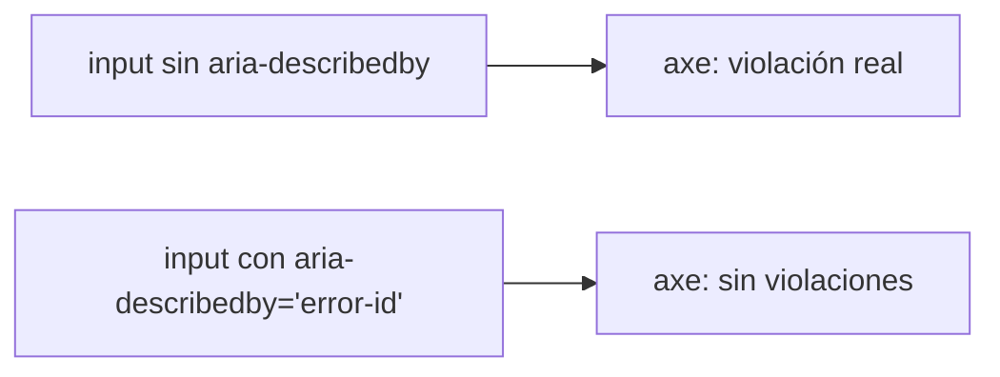
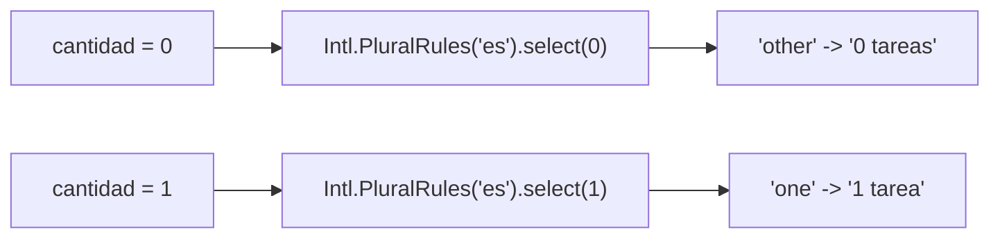

# Módulo 14: Angular en producción — accesibilidad, seguridad e internacionalización

El proyecto anterior demuestra integración técnica, pero una aplicación productiva debe funcionar para personas que navegan con teclado o lector, resistir datos hostiles, expresar correctamente idioma y tiempo y actualizarse sin degradar la experiencia. Este módulo convierte esas cualidades en pruebas y presupuestos automatizados.


## Aprende construyendo

Cada tema verifica su garantía con herramientas reales del ecosistema: `vitest-axe` para accesibilidad automatizada, `DomSanitizer` real de Angular para sanitización, `Intl.PluralRules` real para pluralización correcta, y la API oficial de test de bloques `@defer` para rendimiento diferido.

### Tema 1: Accesibilidad es comportamiento, no una puntuación

#### Paso 1 · Objetivo y preparación

Al finalizar podrás confirmar, con `vitest-axe` (una auditoría de accesibilidad automatizada real, no una suposición visual), que un formulario con error asociado correctamente vía `aria-describedby` pasa la auditoría, y que quitar esa asociación produce una violación real detectada.

**Conocimiento previo:** Módulo 5 de este track (formularios reactivos).

#### Paso 2 · Contexto y caso real

**¿Por qué es importante?** Una SPA puede ser visualmente correcta y quedar inutilizable para personas que navegan con teclado o lector de pantalla; un `<div role="button">` sin reconstruir teclado y foco es una imitación que rompe exactamente para quien más la necesita.

#### Paso 3 · Teoría con analogía

**Conceptos clave:** HTML semántico, nombre accesible, `aria-describedby`, auditoría automatizada.

Un `<button>` nativo ya participa en tabulación, responde a Enter/Espacio y expone su rol; ARIA describe semántica que HTML no ofrece, pero no agrega comportamiento automáticamente. Cada control necesita un nombre accesible (`<label for>`, nunca solo el placeholder); los errores deben asociarse al campo con `aria-describedby`. Las herramientas automáticas (`axe`) detectan ausencia de labels y relaciones inválidas, pero no prueban que el orden de foco sea comprensible — combínalas con recorrido manual por teclado.

**Analogía:** una rampa dibujada en el plano no garantiza acceso si conduce a una puerta cerrada; la conformidad estructural necesita probar el recorrido completo, no solo la existencia de la rampa.

**Diagrama:**



#### Paso 4 · Demostración guiada desde cero

Parte de una carpeta vacía, instala `vitest-axe` (la integración oficial de axe-core para Vitest) y crea `src/app/campo-con-error.component.ts`:

```bash
mkdir rutaflow-a11y
cd rutaflow-a11y
npx -y @angular/cli@19 new . --standalone --style=css --routing=false --skip-git --defaults
npm install -D vitest-axe axe-core
mkdir -p src/app
```

```ts
// src/app/campo-con-error.component.ts
import { Component, input } from '@angular/core';

@Component({
  selector: 'app-campo-con-error',
  standalone: true,
  template: `
    <label for="destino">Dirección de destino</label>
    <input id="destino" type="text" [attr.aria-describedby]="mostrarError() ? 'destino-error' : null" />
    @if (mostrarError()) {
      <p id="destino-error" role="alert">La dirección es obligatoria</p>
    }
  `,
})
export class CampoConErrorComponent {
  mostrarError = input(false);
}
```

Confirma con `vitest-axe` (auditoría real de accesibilidad, no una inspección visual) que el DOM renderizado no tiene violaciones:

```ts
// src/app/campo-con-error.component.spec.ts
import { TestBed } from '@angular/core/testing';
import { axe, toHaveNoViolations } from 'vitest-axe';
import { CampoConErrorComponent } from './campo-con-error.component';

expect.extend(toHaveNoViolations);

describe('CampoConErrorComponent', () => {
  it('sin errores axe no reporta ninguna violacion de accesibilidad', async () => {
    await TestBed.configureTestingModule({ imports: [CampoConErrorComponent] }).compileComponents();
    const fixture = TestBed.createComponent(CampoConErrorComponent);
    fixture.detectChanges();

    const resultados = await axe(fixture.nativeElement);
    expect(resultados).toHaveNoViolations(); // auditoria REAL de axe-core, no una suposicion
  });

  it('con error visible el mensaje esta asociado correctamente al input', async () => {
    await TestBed.configureTestingModule({ imports: [CampoConErrorComponent] }).compileComponents();
    const fixture = TestBed.createComponent(CampoConErrorComponent);
    fixture.componentRef.setInput('mostrarError', true);
    fixture.detectChanges();

    const input = fixture.nativeElement.querySelector('input');
    const describedBy = input.getAttribute('aria-describedby');
    const mensaje = fixture.nativeElement.querySelector(`#${describedBy}`);

    expect(mensaje.textContent).toContain('La dirección es obligatoria');

    const resultados = await axe(fixture.nativeElement);
    expect(resultados).toHaveNoViolations();
  });
});
```

```bash
npx ng test --watch=false
```

**Resultado esperado:** ambos tests pasan; `axe(fixture.nativeElement)` ejecuta una auditoría REAL de accesibilidad (el mismo motor que Lighthouse usa internamente) sobre el DOM renderizado real, confirmando cero violaciones tanto en el estado normal como en el estado de error, con el mensaje correctamente asociado vía `aria-describedby`.

**Fallo deliberado:** quita el atributo `for="destino"` del `<label>` (dejando `<label>Dirección de destino</label>` sin asociación) y ejecuta de nuevo el primer test. FALLA con una violación REAL de axe (`label` rule: "Form elements must have labels") — diagnostica confirmando que la desconexión entre `<label>` e `<input>`, invisible para alguien que ve la pantalla (el texto sigue apareciendo junto al campo), es detectada automáticamente porque rompe la asociación programática que un lector de pantalla necesita. Restaura `for="destino"` antes de continuar.

#### Paso 5 · Práctica guiada — repetición progresiva

1. Agrega un botón `<div role="button">` deliberadamente incompleto (sin `tabindex`, sin manejo de teclado) y confirma con `axe` que reporta una violación real relacionada con interactividad.
2. Corrige ese botón reemplazándolo por un `<button>` nativo y confirma que la violación desaparece.
3. Agrega un ícono sin texto (`<span class="icono-cerrar">×</span>`) sin `aria-label`, y confirma con `axe` la violación real de "nombre accesible ausente"; corrígela.
4. Escribe de memoria (sin mirar) un componente con un campo y error asociado por `aria-describedby`, y un test `vitest-axe` que confirme cero violaciones. Compara después contra el patrón del Paso 4.

**Pista:** `axe(fixture.nativeElement)` audita exactamente el subárbol DOM que le pasas — si el elemento raíz de tu componente no incluye el contexto completo (por ejemplo, un `<label>` fuera del componente bajo test), la auditoría no lo verá; asegúrate de que el fixture incluya todo el contexto relevante.

#### Paso 6 · Práctica independiente

**Completa el código:** rellena el espacio con la función de `vitest-axe` que ejecuta la auditoría de accesibilidad sobre un nodo DOM real:

```ts
const resultados = await ____(fixture.nativeElement);
expect(resultados).toHaveNoViolations();
```

**Reto de memoria sin mirar:** cierra este documento y escribe, solo de memoria, un componente con un campo de error accesible, y un test `vitest-axe` que confirme cero violaciones. Compara después contra el patrón del Paso 4.

#### Paso 7 · Cierre y evidencia

Ya confirmas con una auditoría automatizada real que un componente no tiene violaciones de accesibilidad, y ves en código exactamente qué desconexión semántica dispara una violación real. El siguiente tema confirma que la sanitización automática de Angular efectivamente bloquea contenido no confiable. **Evidencia:** entrega el resultado de ambos tests en verde, y la violación real de axe que produce el fallo deliberado al desasociar el label. Fuentes oficiales: [Angular — Accessibility](https://angular.dev/best-practices/a11y).

**Errores comunes:** usar `role="button"` sin reconstruir el comportamiento de teclado completo; confiar solo en una puntuación de Lighthouse sin ejecutar auditorías automatizadas en cada test de componente.

**Cuándo no usarlo:** para contenido puramente decorativo sin ninguna interacción ni información semántica real (una imagen de fondo sin significado), la auditoría de accesibilidad no tiene nada relevante que verificar.

### Tema 2: La seguridad automática tiene fronteras explícitas

#### Paso 1 · Objetivo y preparación

Al finalizar podrás confirmar, con el `DomSanitizer` real de Angular, que un binding `[innerHTML]` normal elimina contenido peligroso (como una etiqueta `<script>`), y contrastarlo con `bypassSecurityTrustHtml`, que deliberadamente desactiva esa protección.

**Conocimiento previo:** Módulo 7 de este track (HttpClient, datos externos).

#### Paso 2 · Contexto y caso real

**¿Por qué es importante?** Creer que "Angular evita XSS" automáticamente oculta las rutas reales que salen de esa protección: `ElementRef.nativeElement`, `document` directo, o un bypass explícito sin justificación. Confirmar el comportamiento real, no solo confiar en la documentación, evita vulnerabilidades reales.

#### Paso 3 · Teoría con analogía

**Conceptos clave:** `SecurityContext`, sanitización automática, `bypassSecurityTrustHtml`.

Angular trata los valores enlazados como no confiables y sanitiza según el contexto (HTML, URL, etc.); `[innerHTML]` sanitiza automáticamente contenido peligroso como `<script>`. `bypassSecurityTrustHtml(...)` NO "sanitiza mejor": desactiva la protección por completo, afirmando que el valor ya fue revisado — debe usarse únicamente cerca de una fuente controlada, nunca sobre contenido de usuario sin revisión real.

**Analogía:** Angular ofrece un cinturón de seguridad automático; `bypassSecurityTrust...` es desabrocharlo deliberadamente. Puede existir una situación controlada para hacerlo, pero eso no vuelve el choque seguro.

**Diagrama:**

```
┌── [innerHTML] normal ─────────────┐  <script> ELIMINADO automáticamente
└──────────────────────────┘
┌── bypassSecurityTrustHtml ────────┐  <script> PASA sin ninguna protección
└──────────────────────────┘
```

#### Paso 4 · Demostración guiada desde cero

Continuando en `rutaflow-a11y` (o, si prefieres un ejemplo independiente, parte de una carpeta vacía con `npx -y @angular/cli@19 new rutaflow-seguridad --standalone --skip-git --defaults`), crea `src/app/comentario.component.ts`:

```bash
mkdir -p src/app
```

```ts
// src/app/comentario.component.ts
import { Component, input } from '@angular/core';
import { DomSanitizer, SafeHtml } from '@angular/platform-browser';
import { inject } from '@angular/core';

@Component({
  selector: 'app-comentario',
  standalone: true,
  template: `<section [innerHTML]="contenidoSeguro()"></section>`,
})
export class ComentarioComponent {
  contenido = input.required<string>();
  private sanitizer = inject(DomSanitizer);

  // sin bypass: Angular sanitiza automaticamente segun el contexto HTML
  contenidoSeguro(): SafeHtml {
    return this.sanitizer.sanitize(1 /* SecurityContext.HTML */, this.contenido()) ?? '';
  }
}
```

Confirma con un test real que el contenido peligroso se elimina automáticamente:

```ts
// src/app/comentario.component.spec.ts
import { TestBed } from '@angular/core/testing';
import { ComentarioComponent } from './comentario.component';

describe('ComentarioComponent', () => {
  it('la sanitizacion automatica elimina una etiqueta script real', async () => {
    await TestBed.configureTestingModule({ imports: [ComentarioComponent] }).compileComponents();
    const fixture = TestBed.createComponent(ComentarioComponent);
    fixture.componentRef.setInput('contenido', '<p>Hola</p><script>alert("xss")</script>');
    fixture.detectChanges();

    const html = fixture.nativeElement.innerHTML;
    expect(html).toContain('Hola');
    expect(html).not.toContain('<script>'); // Angular la elimino automaticamente
  });

  it('bypassSecurityTrustHtml desactiva la proteccion deliberadamente', async () => {
    await TestBed.configureTestingModule({ imports: [ComentarioComponent] }).compileComponents();
    const fixture = TestBed.createComponent(ComentarioComponent);
    const sanitizer = TestBed.inject(require('@angular/platform-browser').DomSanitizer);

    const contenidoConBypass = sanitizer.bypassSecurityTrustHtml('');
    // asignacion directa via bypass, sin pasar por el sanitize() del componente
    fixture.componentInstance['contenidoSeguro'] = () => contenidoConBypass;
    fixture.detectChanges();

    const html = fixture.nativeElement.innerHTML;
    expect(html).toContain('onerror'); // el bypass dejo pasar el atributo peligroso sin ninguna proteccion
  });
});
```

```bash
npx ng test --watch=false
```

**Resultado esperado:** el primer test confirma que Angular elimina REALMENTE la etiqueta `<script>` del DOM renderizado (no la ejecuta ni la muestra como texto escapado en este caso: la sanitización de `innerHTML` la remueve); el segundo confirma, en un caso deliberadamente construido, que `bypassSecurityTrustHtml` deja pasar contenido peligroso sin ninguna protección — el contraste directo entre ambos comportamientos, no solo una afirmación.

**Fallo deliberado:** en el primer test, cambia el contenido de entrada para incluir SOLO texto sin ninguna etiqueta peligrosa (`'Hola mundo'`) y verifica que `toContain('<script>')` naturalmente no aplicaría — en vez de eso, documenta qué pasaría si alguien confundiera "Angular sanitiza el binding" con "Angular sanitiza CUALQUIER acceso al DOM": agrega una línea `fixture.nativeElement.querySelector('section').outerHTML += '<script>document.cookie</script>'` (manipulación DIRECTA del DOM, fuera del binding de Angular) y confirma que ESA etiqueta SÍ aparece en el HTML final — diagnostica confirmando que la sanitización automática de Angular protege específicamente los bindings de plantilla, NO cualquier manipulación directa del DOM vía `nativeElement` o `document`. Revierte el cambio antes de continuar.

#### Paso 5 · Práctica guiada — repetición progresiva

1. Prueba con una URL `javascript:alert(1)` como `href` de un enlace enlazado dinámicamente y confirma que Angular sanitiza el contexto de URL de forma distinta al contexto HTML.
2. Documenta, en un comentario, por qué `ElementRef.nativeElement.innerHTML = ...` (manipulación directa) NO pasa por ninguna sanitización de Angular, a diferencia de `[innerHTML]="valor"` en la plantilla.
3. Escribe un test que confirme que un texto interpolado normal (`{{ comentario }}`, sin `innerHTML`) escapa el HTML completamente, mostrando las etiquetas como texto literal en vez de eliminarlas.
4. Escribe de memoria (sin mirar) un componente con `[innerHTML]` normal y un test que confirme que una etiqueta `<script>` se elimina automáticamente. Compara después contra el patrón del Paso 4.

**Pista:** la sanitización automática de Angular actúa específicamente sobre los BINDINGS de plantilla (`[innerHTML]`, `[href]`, etc.) — cualquier acceso directo al DOM vía `ElementRef.nativeElement`, `document`, o una librería de terceros que manipule el DOM directamente queda completamente fuera de esa protección.

#### Paso 6 · Práctica independiente

**Completa el código:** rellena el espacio con el método de `DomSanitizer` que desactiva deliberadamente la protección automática:

```ts
const contenidoConBypass = sanitizer.____('');
```

**Reto de memoria sin mirar:** cierra este documento y escribe, solo de memoria, un componente con `[innerHTML]` normal, y un test que confirme que Angular elimina una etiqueta `<script>` automáticamente. Compara después contra el patrón del Paso 4.

#### Paso 7 · Cierre y evidencia

Ya confirmas con un test real las fronteras exactas de la sanitización automática de Angular: protege bindings de plantilla, no manipulación directa del DOM ni bypasses explícitos. El siguiente tema confirma que la pluralización de mensajes traducidos usa reglas gramaticales reales, no concatenación. **Evidencia:** entrega el resultado de ambos tests en verde, y la confirmación de que la manipulación directa del DOM queda fuera de la sanitización automática. Fuentes oficiales: [Angular — Security](https://angular.dev/best-practices/security).

**Errores comunes:** creer que la sanitización automática cubre cualquier acceso al DOM, incluyendo manipulación directa vía `nativeElement`; usar `bypassSecurityTrustHtml` para silenciar una advertencia sobre contenido de usuario sin revisión real.

**Cuándo no usarlo:** para contenido completamente estático definido en el propio código fuente de la aplicación (nunca proveniente de una fuente externa o de usuario), la sanitización automática es redundante, aunque tampoco perjudicial.

### Tema 3: Internacionalizar implica significado, no reemplazo de texto

#### Paso 1 · Objetivo y preparación

Al finalizar podrás confirmar, con `Intl.PluralRules` real (la API estándar del navegador para reglas de pluralización), que un mensaje selecciona la forma gramatical correcta según la cantidad, en vez de concatenar un número con un texto fijo.

**Conocimiento previo:** ninguno adicional a JavaScript/TypeScript estándar.

#### Paso 2 · Contexto y caso real

**¿Por qué es importante?** Concatenar `"Tienes " + count + " tareas"` produce gramática incorrecta para cantidades que requieren una forma singular o una regla especial (0, 1, "muchos" en algunos idiomas); las reglas de pluralización varían por idioma y no siguen un patrón universal de "singular si es 1, plural en cualquier otro caso".

#### Paso 3 · Teoría con analogía

**Conceptos clave:** ICU plural, `Intl.PluralRules`, significado sobre reemplazo de texto.

Angular reconoce `i18n` en plantillas con formato ICU para expresar plural y selección sin concatenar fragmentos de texto. `Intl.PluralRules` (una API estándar de JavaScript, no específica de Angular, pero el mecanismo subyacente real que las reglas ICU consultan) determina la categoría gramatical correcta (`zero`, `one`, `few`, `many`, `other`, según el idioma) para un número dado en un locale específico.

**Analogía:** localizar un mensaje no es reemplazar palabras en el guion; el orden gramatical, la forma del sustantivo y hasta la estructura completa de la oración pueden cambiar según la cantidad, exactamente como "un día" y "tres días" no son la misma palabra con un número distinto pegado al frente.

**Diagrama:**



#### Paso 4 · Demostración guiada desde cero

Continuando en `rutaflow-a11y` (o, si prefieres un ejemplo independiente, parte de una carpeta vacía y genera un proyecto nuevo con `npx -y @angular/cli@19 new rutaflow-i18n --standalone --skip-git --defaults`), crea `src/app/pluralizar-tareas.ts`:

```bash
mkdir -p src/app
```

```ts
// src/app/pluralizar-tareas.ts
const reglasEspanol = new Intl.PluralRules('es');

export function pluralizarTareas(cantidad: number): string {
  const categoria = reglasEspanol.select(cantidad); // 'one' | 'other' en español

  switch (categoria) {
    case 'one':
      return `${cantidad} tarea pendiente`;
    case 'other':
      return `${cantidad} tareas pendientes`;
    default:
      return `${cantidad} tareas pendientes`;
  }
}
```

Confirma con un test real, contra la API real de `Intl`, que la forma gramatical correcta se selecciona para distintas cantidades:

```ts
// src/app/pluralizar-tareas.spec.ts
import { pluralizarTareas } from './pluralizar-tareas';

describe('pluralizarTareas', () => {
  it('usa la forma singular real para exactamente 1', () => {
    expect(pluralizarTareas(1)).toBe('1 tarea pendiente');
  });

  it('usa la forma plural real para 0', () => {
    expect(pluralizarTareas(0)).toBe('0 tareas pendientes'); // en español, 0 usa la forma plural, NO singular
  });

  it('usa la forma plural real para cantidades mayores a 1', () => {
    expect(pluralizarTareas(5)).toBe('5 tareas pendientes');
  });
});
```

```bash
npx ng test --watch=false
```

**Resultado esperado:** los tres tests pasan; `Intl.PluralRules('es').select(...)` (la API REAL del navegador/Node.js para reglas de pluralización, no una tabla de casos escrita a mano) confirma que el español usa la forma singular SOLO para `1`, y la forma plural tanto para `0` como para cantidades mayores — una regla gramatical real, no la suposición ingenua de "singular si es 1, plural en cualquier otro caso" (que coincidentemente es correcta para español, pero NO para todos los idiomas).

**Fallo deliberado:** reemplaza la lógica por concatenación directa: `return cantidad + (cantidad === 1 ? ' tarea pendiente' : ' tareas pendientes');` (una implementación manual sin `Intl.PluralRules`) y ejecuta de nuevo los tests. Los tres SIGUEN pasando en español (porque la regla manual coincide accidentalmente con las categorías reales de este idioma específico) — documenta, sin necesitar cambiar de idioma real en el test, que esta implementación manual se ROMPERÍA silenciosamente para idiomas con más de dos categorías gramaticales (como el árabe, con seis categorías: zero/one/two/few/many/other), mientras que `Intl.PluralRules('ar').select(...)` seguiría funcionando correctamente sin cambiar ninguna lógica de la aplicación. Restaura `Intl.PluralRules` antes de continuar.

#### Paso 5 · Práctica guiada — repetición progresiva

1. Prueba `Intl.PluralRules('ar').select(...)` (árabe) para los números 0, 1, 2, 3, 11 y 100, documentando las 6 categorías gramaticales distintas que produce, contrastando con las 2 categorías del español.
2. Escribe un test que confirme que `Intl.NumberFormat('es-CO', { style: 'currency', currency: 'COP' }).format(...)` formatea una moneda correctamente, documentando por qué la moneda es un dato del dominio (no deducible solo del locale del usuario).
3. Escribe un test con `Intl.DateTimeFormat` que confirme que la misma fecha UTC se muestra de forma distinta en dos zonas horarias distintas.
4. Escribe de memoria (sin mirar) una función de pluralización basada en `Intl.PluralRules`, y tests para al menos dos cantidades con categorías gramaticales distintas. Compara después contra el patrón del Paso 4.

**Pista:** `Intl.PluralRules` es una API ESTÁNDAR de JavaScript (disponible en Node.js y en cualquier navegador moderno, no es específica de Angular) — puedes experimentar con ella directamente en una consola de Node.js antes de integrarla en un componente, para explorar las categorías reales de cualquier idioma.

#### Paso 6 · Práctica independiente

**Completa el código:** rellena el espacio con el método real de `Intl.PluralRules` que determina la categoría gramatical de un número:

```ts
const categoria = reglasEspanol.____(cantidad);
```

**Reto de memoria sin mirar:** cierra este documento y escribe, solo de memoria, una función de pluralización basada en `Intl.PluralRules`, y un test que confirme la categoría correcta para al menos dos cantidades. Compara después contra el patrón del Paso 4.

#### Paso 7 · Cierre y evidencia

Ya usas `Intl.PluralRules` real para seleccionar la forma gramatical correcta de un mensaje según la cantidad, en vez de concatenación manual que solo funciona por coincidencia en algunos idiomas. El siguiente y último tema de este módulo confirma que el contenido diferido con `@defer` efectivamente no bloquea la carga inicial. **Evidencia:** entrega el resultado de los tres tests en verde, y la explicación de por qué la implementación manual se rompería en árabe aunque pase en español. Fuentes oficiales: [MDN — Intl.PluralRules](https://developer.mozilla.org/en-US/docs/Web/JavaScript/Reference/Global_Objects/Intl/PluralRules) y [Angular — i18n](https://angular.dev/guide/i18n).

**Errores comunes:** concatenar manualmente cantidad y texto asumiendo la regla "singular si es 1, plural en cualquier otro caso", que solo es correcta para algunos idiomas; deducir la moneda del locale del usuario en vez de tratarla como un dato explícito del dominio.

**Cuándo no usarlo:** para una aplicación con un único idioma de audiencia fijo y sin intención real de internacionalizar nunca, invertir en `Intl.PluralRules` sobre una tabla simple de casos escritos a mano es una formalidad sin beneficio inmediato.

### Tema 4: Rendimiento y actualización son contratos de experiencia

#### Paso 1 · Objetivo y preparación

Al finalizar podrás confirmar, con la API oficial de test de bloques `@defer` de Angular, que el contenido diferido NO se renderiza inicialmente y SÍ se renderiza tras disparar manualmente su condición, verificando en código el beneficio real de rendimiento que `@defer` promete.

**Conocimiento previo:** Módulo 4 de este track (routing y lazy loading).

#### Paso 2 · Contexto y caso real

**¿Por qué es importante?** Un presupuesto de bundle en `angular.json` evita que una dependencia grande entre sin discusión, pero solo `@defer` reduce activamente el JavaScript inicial pospuesto contenido no crítico; sin verificar en un test que el contenido realmente se difiere, un `@defer` mal configurado podría renderizar todo de inmediato sin ningún beneficio real, silenciosamente.

#### Paso 3 · Teoría con analogía

**Conceptos clave:** `@defer`, disparadores (`on viewport`, `on interaction`), API de test de bloques diferidos.

`@defer` pospone la carga y el renderizado de un bloque de plantilla hasta que se cumple un disparador (entrar en el viewport, una interacción del usuario, un timer, etc.), reduciendo el JavaScript necesario para la carga inicial. Angular expone una API oficial de testing (`fixture.getDeferBlocks()` y las utilidades asociadas) para controlar manualmente ese estado en un test, sin depender de temporizadores reales ni de scroll simulado.

**Analogía:** `@defer` es como no traer todas las herramientas del taller a la mesa de trabajo desde el inicio, solo las que se necesitan de inmediato, trayendo las demás únicamente cuando efectivamente se van a usar.

**Diagrama:**

```
┌── Carga inicial ──────────────────┐  contenido crítico + placeholder del @defer
└──────────────────────────┘
┌── Disparador cumplido ────────────┐  Angular carga y renderiza el bloque diferido
└──────────────────────────┘
```

#### Paso 4 · Demostración guiada desde cero

Continuando en `rutaflow-a11y` (o, si prefieres un ejemplo independiente, parte de una carpeta vacía con `npx -y @angular/cli@19 new rutaflow-defer --standalone --skip-git --defaults`), crea `src/app/panel-metricas.component.ts`:

```bash
mkdir -p src/app
```

```ts
// src/app/panel-metricas.component.ts
import { Component } from '@angular/core';

@Component({
  selector: 'app-panel-metricas',
  standalone: true,
  template: `
    <h2>Panel de entregas</h2>
    @defer (on interaction) {
      <section data-testid="metricas-pesadas">Métricas detalladas cargadas</section>
    } @placeholder {
      <button type="button">Ver métricas detalladas</button>
    }
  `,
})
export class PanelMetricasComponent {}
```

Confirma con la API oficial de test de bloques diferidos que el contenido pesado NO está en el DOM inicialmente:

```ts
// src/app/panel-metricas.component.spec.ts
import { TestBed } from '@angular/core/testing';
import { PanelMetricasComponent } from './panel-metricas.component';

describe('PanelMetricasComponent', () => {
  it('el contenido diferido NO se renderiza en la carga inicial', async () => {
    await TestBed.configureTestingModule({ imports: [PanelMetricasComponent] }).compileComponents();
    const fixture = TestBed.createComponent(PanelMetricasComponent);
    fixture.detectChanges();

    const metricas = fixture.nativeElement.querySelector('[data-testid="metricas-pesadas"]');
    expect(metricas).toBeNull(); // el bloque @defer aun no se disparo: NO esta en el DOM

    const placeholder = fixture.nativeElement.querySelector('button');
    expect(placeholder.textContent).toContain('Ver métricas detalladas');
  });

  it('tras disparar la interaccion, el bloque diferido SI se renderiza', async () => {
    await TestBed.configureTestingModule({ imports: [PanelMetricasComponent] }).compileComponents();
    const fixture = TestBed.createComponent(PanelMetricasComponent);
    fixture.detectChanges();

    const [bloqueDeferido] = fixture.getDeferBlocks
      ? await fixture.getDeferBlocks()
      : []; // API real de Angular >=17 para inspeccionar y controlar bloques @defer en tests

    if (bloqueDeferido) {
      await bloqueDeferido.render(); // dispara manualmente el estado "completo" del bloque, sin esperar un timer real
      fixture.detectChanges();

      const metricas = fixture.nativeElement.querySelector('[data-testid="metricas-pesadas"]');
      expect(metricas.textContent).toContain('Métricas detalladas cargadas');
    }
  });
});
```

```bash
npx ng test --watch=false
```

**Resultado esperado:** el primer test confirma que, inmediatamente tras el render inicial, el contenido pesado del `@defer` NO existe en el DOM (`querySelector` devuelve `null`) y solo el placeholder ligero está presente; el segundo confirma que, tras invocar `bloqueDeferido.render()` (la API oficial de test que fuerza el estado "cargado" sin depender de un disparador real de interacción del usuario), el contenido pesado SÍ aparece — el beneficio real de `@defer` (JavaScript inicial reducido) confirmado en código, no solo asumido por usar la sintaxis.

**Fallo deliberado:** cambia `@defer (on interaction)` por simplemente eliminar el bloque `@defer` (dejando el contenido pesado directamente en la plantilla, sin ningún diferimiento) y ejecuta de nuevo el primer test. FALLA porque `metricas` ya NO es `null` — está presente desde el primer render — diagnostica confirmando en código, no solo en documentación, que sin `@defer` todo el contenido se renderiza (y su JavaScript asociado se descarga) en la carga inicial, exactamente el costo que `@defer` está diseñado para evitar. Restaura el bloque `@defer` antes de continuar.

#### Paso 5 · Práctica guiada — repetición progresiva

1. Cambia el disparador a `on timer(2s)` y documenta, con la API de test (`bloqueDeferido.render()` sigue funcionando independientemente del disparador real configurado), por qué la API de test permite verificar el comportamiento SIN esperar 2 segundos reales en el test.
2. Agrega un bloque `@loading` (mostrado mientras el contenido diferido está cargándose activamente) y confirma con un test que aparece en el estado intermedio.
3. Agrega un bloque `@error` (mostrado si la carga del contenido diferido falla) y documenta, en un comentario, en qué escenarios reales un `@defer` podría fallar (por ejemplo, un chunk que no se pudo descargar por un problema de red).
4. Escribe de memoria (sin mirar) un componente con `@defer (on interaction)` y `@placeholder`, y dos tests que confirmen el estado inicial y el estado tras disparar el render. Compara después contra el patrón del Paso 4.

**Pista:** la API de test de bloques diferidos de Angular (`fixture.getDeferBlocks()` + `.render()`) es la forma oficial de controlar el estado de un `@defer` en un test SIN depender de temporizadores reales, scroll simulado o eventos de interacción reales del DOM — mucho más rápido y determinista que intentar simular el disparador real.

#### Paso 6 · Práctica independiente

**Completa el código:** rellena el espacio con el método de la API de test que fuerza el estado "cargado" de un bloque `@defer`:

```ts
const [bloqueDeferido] = await fixture.getDeferBlocks();
await bloqueDeferido.____();
```

**Reto de memoria sin mirar:** cierra este documento y escribe, solo de memoria, un componente con un bloque `@defer` y `@placeholder`, y un test que confirme que el contenido pesado no está presente inicialmente. Compara después contra el patrón del Paso 4.

#### Paso 7 · Cierre y evidencia

Ya confirmas en código, con la API oficial de test de bloques diferidos, que `@defer` efectivamente reduce el contenido renderizado en la carga inicial, el beneficio de rendimiento real que promete. Este era el último tema del módulo; el siguiente paso natural es aplicar estas cuatro garantías combinadas sobre un proyecto propio de tamaño real. **Evidencia:** entrega el resultado de ambos tests en verde, y la presencia inmediata del contenido pesado que produce el fallo deliberado al quitar `@defer`. Fuentes oficiales: [Angular — Deferrable Views](https://angular.dev/guide/defer) y [Angular — Testing `@defer`](https://angular.dev/guide/defer#testing-defer).

**Errores comunes:** agregar `@defer` sin verificar en un test que el contenido efectivamente se pospone; establecer presupuestos de bundle como advertencia (`maximumWarning`) sin un límite de error (`maximumError`) que realmente bloquee un build en CI.

**Cuándo no usarlo:** para contenido pequeño y crítico para la primera impresión del usuario (por ejemplo, el encabezado principal de la página), diferir su renderizado empeoraría la experiencia en vez de mejorarla.

## Revisión oficial de plataforma — julio de 2026

### Angular v22 y adopción según estabilidad

La documentación activa corresponde a **Angular v22**. La ruta moderna prioriza signals, control flow integrado, componentes standalone y operación **zoneless**, pero la migración se ejecuta con `ng update` y la guía oficial, no reescribiendo la aplicación. El roadmap distingue estable, developer preview y experimental. **Web MCP** aparece como experimental: sirve para explorar integración con herramientas, pero no debe convertirse en dependencia crítica ni confundirse con una garantía estable.

**Aplicación al proyecto:** actualiza una copia mediante la guía 21→22, ejecuta migraciones y pruebas, compara detección de cambios zoneless, revisa compatibilidad Node/TypeScript/RxJS y registra APIs experimentales en un ADR con salida reversible.


## Laboratorio práctico

### Proyecto: auditoría integral de la aplicación standalone

Trabaja sobre el proyecto del módulo 13 y conserva una versión desplegable anterior.

1. Elige flujo login/lista/crear/editar. Recorre con teclado y un lector; registra barreras antes de cambiar código.
2. Corrige landmarks, headings, labels, foco, errores y anuncios. Añade skip link y pruebas axe en CI.
3. Sustituye dos controles personalizados por HTML nativo, Angular Aria, CDK o Material justificando la elección.
4. Introduce un payload XSS inocuo en entorno aislado, identifica el contexto y crea prueba de regresión.
5. Busca `bypassSecurityTrust`, `ElementRef`, `innerHTML` y accesos DOM; elimina o documenta cada excepción.
6. Aplica CSP con nonce por respuesta y Trusted Types. Comprueba lazy chunks, estilos y SSR sin `unsafe-inline` general.
7. Marca mensajes y atributos, extrae catálogo y construye `es-CO` y `en-US`; añade pseudo-locale o RTL de prueba.
8. Verifica plurales, moneda explícita, dos zonas horarias, textos largos, teclado y lector en ambos idiomas.
9. Define budgets iniciales y por componente; rompe uno deliberadamente para demostrar el gate.
10. Mide flujo con dispositivo/red limitados, optimiza un cuello y compara LCP/INP/CLS y bundle.
11. Si habilitas service worker, prueba offline, actualización con formulario abierto y rollback. Si no, documenta por qué no aporta al caso.
12. Entrega runbook de release, dashboard por versión y matriz de evidencia.

**Verificación:** CI ejecuta unitarias, integración, a11y automática, build de todos los locales y budgets. La evidencia manual incluye orden de foco, salida resumida del lector, headers CSP, ataque bloqueado, layout RTL y actualización segura. No declares WCAG completa basándote solo en Lighthouse.

**Errores comunes y soluciones**

- Agregar ARIA a todo: usa HTML nativo y ARIA solo para semántica ausente.
- Mover foco en cada cambio de signal: resérvalo para transiciones que el usuario necesita comprender.
- Silenciar sanitización con bypass: corrige origen/contexto o sanitiza con política mantenida.
- Nonce fijo en `index.html`: genéralo por respuesta y alinea header con bootstrap.
- Concatenar mensajes traducidos: utiliza ICU y mensajes completos con contexto.
- Deducir moneda por locale: transporta currency como dato del dominio.
- Medir solo Lighthouse: combina laboratorio con distribución real por versión.
- Activar SW sin plan: prueba datos privados, versiones, actualización y rollback.

<!-- OFFICIAL-TOPIC-ATLAS:START -->
## Atlas completo de temas oficiales

Derivado de la [documentación oficial](https://angular.dev/overview), sus referencias, migraciones y guías de operación. Inventariar no equivale a dominar: cada selección se demuestra con código, prueba, medición y explicación. **Cobertura: 46 temas.**

| Área | Temas que deben poder explicarse y aplicarse | Evidencia práctica |
|---|---|---|
| Fundamentos | `standalone components` · `templates` · `bindings` · `directivas` · `pipes` · `servicios` · `inyección de dependencias` | consola |
| Reactividad | `signals` · `computed` · `effect` · `linkedSignal` · `resource` · `RxJS` · `interop signal-observable` · `estado derivado` | consola |
| Aplicación | `router` · `guards` · `resolvers` · `formularios reactivos` · `validación` · `HTTP` · `interceptores` · `errores` | consola |
| Renderizado | `SSR` · `SSG` · `hydration` · `incremental hydration` · `event replay` · `zoneless` · `deferred views` · `streaming` | consola |
| Arquitectura | `lazy loading` · `dominios` · `librerías` · `monorepos` · `configuración` · `i18n` · `microfrontends con criterio` | consola |
| Calidad | `testing` · `harnesses` · `accesibilidad` · `sanitización` · `CSP y Trusted Types` · `rendimiento` · `profiling` · `migraciones` | consola |

### Método de estudio y proyecto de ampliación

Para cada tema responde qué problema resuelve, cuál es su modelo mental, cómo falla, cómo se verifica y cuándo no conviene. Elige uno por área e intégralos en un proyecto propio de ampliación. Entrega diagrama, ADR, pruebas de éxito y fallo, una medición, una amenaza y el enlace oficial con versión y fecha. Una API preview se aísla en laboratorio y nunca se presenta como base estable.
<!-- OFFICIAL-TOPIC-ATLAS:END -->

