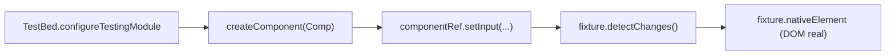
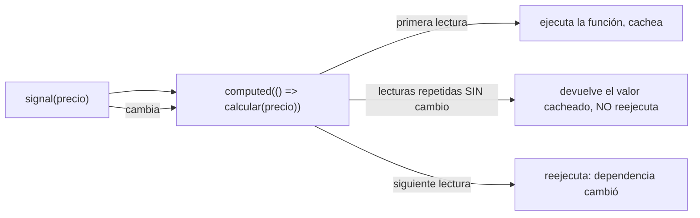
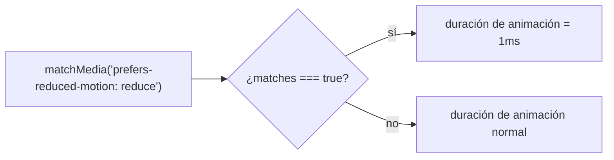
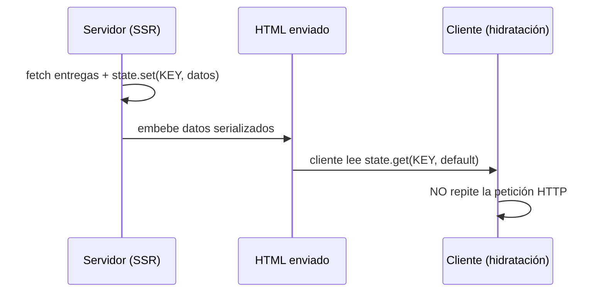

# Módulo 15: Angular Master: pruebas, animación y SSR


## Aprende construyendo

Este módulo cierra el nivel "master" del track con seis técnicas avanzadas, cada una verificada con la herramienta real del ecosistema Angular actual (Vitest + `TestBed`, Playwright, `@angular/animations`, `TransferState`, `isPlatformBrowser`), sin sustituir código por descripción.

### Tema 1: TestBed y ComponentFixture

#### Paso 1 · Objetivo y preparación

Al finalizar podrás montar un componente standalone real con `TestBed`, establecer sus inputs con `componentRef.setInput`, forzar la detección de cambios y confirmar el DOM renderizado real, no una suposición sobre la plantilla.

**Conocimiento previo:** Módulo 1 de este track (componentes standalone, `input()`/`output()`).

#### Paso 2 · Contexto y caso real

**¿Por qué es importante?** `TestBed` crea un entorno Angular real y aislado (un `ComponentFixture`) para cada test, sin necesitar arrancar la aplicación completa ni un navegador real; sin dominarlo, cada cambio en un componente solo puede verificarse manualmente en el navegador, un ciclo de feedback lento y no reproducible en CI.

#### Paso 3 · Teoría con analogía

**Conceptos clave:** `TestBed.configureTestingModule`, `ComponentFixture`, `componentRef.setInput`, `detectChanges`.

`TestBed.configureTestingModule({ imports: [MiComponente] })` (para un standalone component, se importa directamente, sin un `NgModule` de test) seguido de `createComponent(MiComponente)` produce un `ComponentFixture`, que envuelve una instancia real del componente montada en un DOM real (jsdom en Vitest). `fixture.componentRef.setInput('valor', x)` establece un input de señal de forma segura para el test; `fixture.detectChanges()` dispara la detección de cambios real, actualizando el DOM antes de cualquier aserción.

**Analogía:** `TestBed` es un taller de pruebas aislado donde se monta una réplica funcional real de una sola pieza del sistema (el componente), en vez de tener que ensamblar el vehículo completo para probar un solo faro.

**Diagrama:**



#### Paso 4 · Demostración guiada desde cero

Parte de una carpeta vacía y crea `src/app/contador-entregas.component.ts`:

```bash
mkdir rutaflow-testbed
cd rutaflow-testbed
npx -y @angular/cli@19 new . --standalone --style=css --routing=false --skip-git --defaults
mkdir -p src/app
```

```ts
// src/app/contador-entregas.component.ts
import { Component, input } from '@angular/core';

@Component({
  selector: 'app-contador-entregas',
  standalone: true,
  template: `<p>Entregas pendientes: {{ cantidad() }}</p>`,
})
export class ContadorEntregasComponent {
  cantidad = input.required<number>();
}
```

Confirma con `TestBed` real (no una suposición de plantilla) que el input se refleja en el DOM:

```ts
// src/app/contador-entregas.component.spec.ts
import { TestBed } from '@angular/core/testing';
import { ContadorEntregasComponent } from './contador-entregas.component';

describe('ContadorEntregasComponent', () => {
  it('muestra en el DOM real la cantidad recibida como input', async () => {
    await TestBed.configureTestingModule({
      imports: [ContadorEntregasComponent],
    }).compileComponents();

    const fixture = TestBed.createComponent(ContadorEntregasComponent);
    fixture.componentRef.setInput('cantidad', 7);
    fixture.detectChanges();

    const texto = fixture.nativeElement.querySelector('p').textContent;
    expect(texto).toContain('Entregas pendientes: 7');
  });
});
```

```bash
npx ng test --watch=false
```

**Resultado esperado:** los tests pasan; el `nativeElement` REAL (un nodo DOM real dentro de jsdom, no una cadena simulada) contiene el texto `"Entregas pendientes: 7"`, confirmando que `setInput` y `detectChanges` efectivamente propagaron el valor hasta el DOM renderizado.

**Fallo deliberado:** quita `fixture.detectChanges()` después de `setInput` y ejecuta de nuevo el test. FALLA porque `fixture.nativeElement.querySelector('p').textContent` sigue mostrando el placeholder de interpolación no evaluado (o vacío, según el binding) — diagnostica confirmando que `setInput` por sí solo actualiza el valor de la señal, pero NO fuerza sincrónicamente una nueva pasada de detección de cambios sobre el DOM: sin `detectChanges()`, la plantilla no se re-renderiza. Restaura la llamada antes de continuar.

#### Construcción RutaFlow: fixture de la tarjeta de entrega

Crea `TarjetaEntregaComponent` con inputs `codigo` y `estado`, y un test `TestBed` que confirme que el DOM real muestra ambos valores y aplica una clase CSS distinta según el estado (`class="estado-cancelado"` cuando `estado() === 'CANCELADO'`).

#### Paso 5 · Práctica guiada — repetición progresiva

1. Agrega un `output()` al componente (un evento `confirmar`) y un test que dispare un click real (`fixture.nativeElement.querySelector('button').click()`) confirmando, con un spy, que el output emitió.
2. Confirma con un test que `fixture.componentInstance` da acceso directo a la instancia del componente, útil para inspeccionar señales internas sin depender solo del DOM.
3. Escribe un test que confirme que cambiar el input DOS veces (`setInput` + `detectChanges` dos veces seguidas) refleja el último valor, no el primero.
4. Escribe de memoria (sin mirar) un componente con un input de señal, y un test `TestBed` que confirme el DOM renderizado. Compara después contra el patrón del Paso 4.

**Pista:** `fixture.nativeElement` es un nodo DOM REAL (no un mock ni una representación textual) — puedes usar cualquier API estándar del DOM (`querySelector`, `textContent`, `classList`) directamente sobre él, exactamente como en un navegador real.

#### Paso 6 · Práctica independiente

**Completa el código:** rellena el espacio con el método que fuerza la detección de cambios tras establecer un input:

```ts
fixture.componentRef.setInput('cantidad', 7);
fixture.____();
```

**Reto de memoria sin mirar:** cierra este documento y escribe, solo de memoria, un componente standalone con un input, y un test `TestBed` que confirme el DOM renderizado tras `setInput` + `detectChanges`. Compara después contra el patrón del Paso 4.

#### Paso 7 · Cierre y evidencia

Ya montas componentes reales con `TestBed` y confirmas el DOM renderizado, no una suposición sobre la plantilla. El siguiente tema prueba la reactividad de Signals directamente, sin necesitar un componente completo. **Evidencia:** entrega el resultado del test en verde, y el DOM no actualizado que produce el fallo deliberado sin `detectChanges()`. Fuentes oficiales: [Angular — Testing components](https://angular.dev/guide/testing/components-scenarios).

**Errores comunes:** olvidar `detectChanges()` después de cambiar un input, asumiendo que la propagación es sincrónica sobre el DOM; usar selectores CSS frágiles en vez de consultar por rol o texto visible.

**Cuándo no usarlo:** para lógica pura sin ningún DOM involucrado (un servicio, una función utilitaria), montar un `ComponentFixture` completo es sobrecarga innecesaria; un test unitario directo de la clase es suficiente.

### Tema 2: Pruebas de Signals

#### Paso 1 · Objetivo y preparación

Al finalizar podrás confirmar, contando invocaciones reales con un spy, que un `computed()` memoiza su resultado y solo se recalcula cuando su dependencia real cambia, no en cada lectura.

**Conocimiento previo:** Módulo 2 de este track (`signal()`, `computed()`, `effect()`).

#### Paso 2 · Contexto y caso real

**¿Por qué es importante?** Un `computed()` que pareciera recalcular su valor en cada lectura desperdiciaría trabajo en cálculos costosos (por ejemplo, filtrar una lista grande de entregas); confirmar la memoización real, no solo confiar en la documentación, evita sorpresas de rendimiento en producción.

#### Paso 3 · Teoría con analogía

**Conceptos clave:** memoización de `computed()`, `effect()` dentro de un contexto de inyección, `TestBed.runInInjectionContext`.

`computed(() => ...)` solo reevalúa su función cuando alguna de las señales que lee internamente cambió desde la última evaluación; leerlo repetidamente sin que sus dependencias cambien devuelve el valor cacheado sin re-ejecutar la función. `effect()` necesita un contexto de inyección de Angular para registrarse correctamente; en un test sin componente, `TestBed.runInInjectionContext(() => effect(...))` provee ese contexto.

**Analogía:** un `computed()` es como un asistente que solo recalcula el total de una factura cuando alguna línea de la factura realmente cambió, en vez de repetir la suma completa cada vez que alguien simplemente pregunta el total.

**Diagrama:**



#### Paso 4 · Demostración guiada desde cero

Continuando en `rutaflow-testbed` (o, si prefieres un ejemplo independiente, parte de una carpeta vacía con `npx -y @angular/cli@19 new rutaflow-signals --standalone --skip-git --defaults`), crea `src/app/carrito.signals.spec.ts`:

```bash
mkdir -p src/app
```

```ts
// src/app/carrito.signals.spec.ts
import { signal, computed } from '@angular/core';
import { TestBed } from '@angular/core/testing';

describe('computed() memoiza su resultado real', () => {
  it('no reejecuta la función si la dependencia no cambió', () => {
    const calculo = vi.fn((precio: number, cantidad: number) => precio * cantidad);
    const precio = signal(10);
    const cantidad = signal(2);
    const total = computed(() => calculo(precio(), cantidad()));

    expect(total()).toBe(20);
    expect(total()).toBe(20); // segunda lectura, SIN cambiar ninguna dependencia
    expect(total()).toBe(20); // tercera lectura, tampoco cambia nada

    expect(calculo).toHaveBeenCalledTimes(1); // memoización real: la función solo se ejecutó UNA vez
  });

  it('reejecuta solo cuando la dependencia real cambia', () => {
    const calculo = vi.fn((precio: number) => precio * 2);
    const precio = signal(10);
    const doble = computed(() => calculo(precio()));

    expect(doble()).toBe(20);
    precio.set(15); // AHORA sí cambia la dependencia real
    expect(doble()).toBe(30);

    expect(calculo).toHaveBeenCalledTimes(2); // una ejecución por cada cambio real de dependencia
  });

  it('effect() requiere un contexto de inyección real de Angular', () => {
    TestBed.runInInjectionContext(() => {
      const contador = signal(0);
      const valoresObservados: number[] = [];

      const { effect } = require('@angular/core');
      effect(() => valoresObservados.push(contador()));

      TestBed.tick();
      contador.set(5);
      TestBed.tick();

      expect(valoresObservados).toEqual([0, 5]);
    });
  });
});
```

```bash
npx ng test --watch=false
```

**Resultado esperado:** todos los tests pasan; `calculo` (un spy real de Vitest, no una suposición) confirma con un conteo exacto de invocaciones que `computed()` memoiza: 1 sola ejecución tras 3 lecturas sin cambios, y exactamente 2 ejecuciones tras 1 cambio real de dependencia.

**Fallo deliberado:** cambia el segundo test para leer `precio()` DIRECTAMENTE dentro del `computed` en vez de a través de la señal reactiva (por ejemplo, capturando su valor en una variable local ANTES de crear el `computed`, rompiendo el rastreo de dependencias) y ejecuta de nuevo. `calculo` se invoca solo 1 vez incluso tras `precio.set(15)`, y `expect(calculo).toHaveBeenCalledTimes(2)` FALLA — diagnostica confirmando que `computed()` solo rastrea dependencias que lee DIRECTAMENTE en su función durante la ejecución; capturar un valor por fuera rompe el rastreo reactivo silenciosamente. Restaura la lectura directa `precio()` dentro del `computed` antes de continuar.

#### Construcción RutaFlow: total de entregas por conductor memoizado

Crea un `computed()` que filtre y sume entregas de un conductor específico desde un `signal<Entrega[]>`, con un spy que confirme memoización real cuando se leen otros datos sin que la lista de entregas cambie.

#### Paso 5 · Práctica guiada — repetición progresiva

1. Agrega una segunda señal no relacionada y confirma con el spy que modificarla NO dispara una reejecución del `computed` que no depende de ella.
2. Encadena dos `computed()` (uno que depende del otro) y confirma con spies en ambos que un cambio en la señal base reejecuta ambos exactamente una vez cada uno.
3. Escribe un test que confirme que `effect()` se ejecuta inmediatamente al registrarse (con el valor inicial), antes de cualquier cambio posterior.
4. Escribe de memoria (sin mirar) un `computed()` con un spy que confirme memoización real. Compara después contra el patrón del Paso 4.

**Pista:** `vi.fn(...)` (el spy de Vitest, el test runner real que usa este proyecto para Angular) envuelve una función real y registra cada invocación — `toHaveBeenCalledTimes(n)` es la aserción exacta para confirmar memoización, mucho más confiable que inferir por el tiempo de ejecución.

#### Paso 6 · Práctica independiente

**Completa el código:** rellena el espacio con el método de aserción de Vitest que confirma el número exacto de invocaciones de un spy:

```ts
expect(calculo).____(1);
```

**Reto de memoria sin mirar:** cierra este documento y escribe, solo de memoria, un `computed()` y un spy que confirme memoización real tras varias lecturas sin cambios. Compara después contra el patrón del Paso 4.

#### Paso 7 · Cierre y evidencia

Ya confirmas con un spy real que `computed()` memoiza correctamente y solo reejecuta ante cambios reales de dependencia. El siguiente tema prueba el comportamiento de la aplicación completa desde la perspectiva de un usuario real, con Playwright. **Evidencia:** entrega el resultado de los tests en verde, y el conteo de invocaciones incorrecto que produce el fallo deliberado al romper el rastreo de dependencias. Fuentes oficiales: [Angular — Signals](https://angular.dev/guide/signals).

**Errores comunes:** capturar el valor de una señal en una variable local antes de leerla dentro de un `computed`, rompiendo el rastreo reactivo; asumir memoización sin confirmarla con un spy real.

**Cuándo no usarlo:** para un valor derivado trivial y barato de recalcular (una concatenación simple de dos strings cortos), la memoización de `computed()` no aporta ningún beneficio medible sobre una función plana.

### Tema 3: Cypress y Playwright

#### Paso 1 · Objetivo y preparación

Al finalizar podrás escribir un test E2E real con Playwright que navega la aplicación, localiza elementos por rol accesible (no por selector CSS frágil) y confirma un flujo de usuario completo, y explicarás por qué esa elección de selector importa.

**Conocimiento previo:** Módulo 13 de este track (proyecto integrador).

#### Paso 2 · Contexto y caso real

**¿Por qué es importante?** Los tests de `TestBed` verifican unidades aisladas; un test E2E real confirma que la aplicación completa (routing, HTTP real o interceptado, renderizado) funciona desde la perspectiva de un usuario en un navegador real, la única capa de test que detecta problemas de integración entre todas las piezas.

#### Paso 3 · Teoría con analogía

**Conceptos clave:** locators accesibles (`getByRole`), auto-waiting, selectores CSS frágiles.

Playwright (y Cypress de forma similar) automatiza un navegador REAL, no una simulación del DOM. `page.getByRole('button', { name: 'Confirmar entrega' })` localiza elementos por su rol y nombre accesible, el mismo mecanismo que usaría un lector de pantalla, en vez de depender de una clase CSS (`.btn-confirm-3`) que puede cambiar con cualquier refactor de estilos sin que el flujo de usuario real haya cambiado. Playwright espera automáticamente ("auto-waiting") a que un elemento sea visible e interactuable antes de actuar sobre él, evitando manejar temporizadores manualmente.

**Analogía:** un selector por rol accesible es como dar direcciones por el nombre real de un lugar ("la farmacia de la esquina"), mientras un selector CSS frágil es como dar direcciones por un detalle temporal ("la tienda con el cartel amarillo") que puede cambiar sin que el lugar deje de ser el mismo.

**Diagrama:**

```
┌── Selector CSS frágil ────────────┐  .btn-confirm-3 — se rompe con refactors de estilo
└──────────────────────────┘
┌── Locator accesible ──────────────┐  getByRole('button', {name:'Confirmar'}) — estable
└──────────────────────────┘
```

#### Paso 4 · Demostración guiada desde cero

Continuando en `rutaflow-testbed` (o, si prefieres un ejemplo independiente, parte de una carpeta vacía con `mkdir rutaflow-e2e && cd rutaflow-e2e && npm init -y && npm install -D @playwright/test`), crea `e2e/confirmar-entrega.spec.ts`:

```bash
npm install -D @playwright/test
mkdir -p e2e
```

```ts
// e2e/confirmar-entrega.spec.ts
import { test, expect } from '@playwright/test';

test('un conductor puede confirmar una entrega desde la interfaz real', async ({ page }) => {
  await page.goto('http://localhost:4200/entregas/PED-001');

  // locator por ROL accesible, no por clase CSS frágil
  const boton = page.getByRole('button', { name: 'Confirmar entrega' });
  await expect(boton).toBeVisible(); // auto-waiting real: espera hasta que sea visible

  await boton.click();

  const estado = page.getByRole('status'); // región con aria-live, anunciada a lectores de pantalla
  await expect(estado).toHaveText('Entrega confirmada');
});
```

```bash
npx playwright test e2e/confirmar-entrega.spec.ts
```

**Resultado esperado:** el test navega un navegador REAL (Chromium por defecto), localiza el botón por su rol y nombre accesible, hace click real, y confirma que la región de estado (anunciada a lectores de pantalla vía `aria-live`) refleja el cambio — un flujo de usuario completo verificado de extremo a extremo, no una suposición sobre el comportamiento de componentes aislados.

**Fallo deliberado:** cambia el locator a `page.locator('.btn-confirmar-3')` (un selector CSS específico y frágil) y documenta el resultado: si un refactor de estilos posterior renombra esa clase a `.btn-confirm-v2` sin cambiar el comportamiento real del botón (sigue siendo el mismo botón "Confirmar entrega" para el usuario), este test fallaría con un error de "elemento no encontrado" que NO refleja ningún problema real de funcionalidad — diagnostica confirmando por qué la teoría insiste en locators accesibles: acoplan el test al comportamiento real que le importa al usuario, no a detalles de implementación de estilos que cambian por razones no relacionadas. Restaura el locator por rol antes de continuar.

#### Construcción RutaFlow: flujo completo de creación de entrega

Escribe un segundo test E2E que complete un formulario real (`page.getByLabel('Dirección de destino').fill(...)`), lo envíe, y confirme la navegación real a una página de confirmación con la URL esperada (`await expect(page).toHaveURL(/\/entregas\/.+\/confirmacion/)`).

#### Paso 5 · Práctica guiada — repetición progresiva

1. Agrega una aserción de accesibilidad básica confirmando que el botón tiene un `aria-label` o texto accesible no vacío.
2. Documenta, en un comentario, la diferencia sintáctica entre Playwright (`page.getByRole(...)`, `await expect(...)`) y Cypress (`cy.get('[data-testid=...]')`, `cy.contains(...)`) para el mismo flujo, y en qué casos uno podría preferirse sobre el otro (Cypress: debugging interactivo más maduro; Playwright: soporte multi-navegador y ejecución más rápida en paralelo).
3. Configura el test para ejecutarse contra 2 navegadores distintos (Chromium y Firefox) en la configuración de Playwright, documentando por qué esto detecta bugs específicos de motor de renderizado que un solo navegador no revelaría.
4. Escribe de memoria (sin mirar) un test Playwright con un locator por rol accesible y una aserción de auto-waiting. Compara después contra el patrón del Paso 4.

**Pista:** `getByRole`, `getByLabel` y `getByText` son locators que reflejan cómo un usuario real (o un lector de pantalla) percibe la página, no su estructura HTML interna — priorízalos sobre `page.locator('.clase-css')` salvo que no exista ninguna alternativa accesible razonable.

#### Paso 6 · Práctica independiente

**Completa el código:** rellena el espacio con el locator de Playwright que busca un elemento por su rol accesible y nombre:

```ts
const boton = page.____('button', { name: 'Confirmar entrega' });
```

**Reto de memoria sin mirar:** cierra este documento y escribe, solo de memoria, un test Playwright con un locator por rol accesible, y explica por qué es preferible a un selector CSS. Compara después contra el patrón del Paso 4.

#### Paso 7 · Cierre y evidencia

Ya escribes tests E2E reales con locators accesibles y auto-waiting, verificando flujos de usuario completos en un navegador real. El siguiente tema construye animaciones que respetan las preferencias de accesibilidad del usuario. **Evidencia:** entrega el resultado del test Playwright, y la explicación de por qué un selector CSS frágil produciría falsos negativos ante refactors de estilo. Fuentes oficiales: [Playwright — Locators](https://playwright.dev/docs/locators).

**Errores comunes:** depender de selectores CSS o `data-testid` cuando un locator accesible por rol ya existe y es más estable; no esperar explícitamente (o confiar mal en el auto-waiting) antes de aserciones sobre contenido que cambia asincrónicamente.

**Cuándo no usarlo:** para lógica de negocio pura sin ninguna interacción de UI real, un test E2E completo es una herramienta desproporcionadamente costosa (lenta, frágil ante cambios de infraestructura); un test unitario o de integración más acotado es más apropiado.

### Tema 4: Animaciones accesibles

#### Paso 1 · Objetivo y preparación

Al finalizar podrás confirmar, con un test real que simula la preferencia `prefers-reduced-motion` del sistema operativo, que una animación respeta esa preferencia reduciendo su duración a un valor mínimo en vez de ignorarla.

**Conocimiento previo:** Módulo 1 de este track (componentes y bindings).

#### Paso 2 · Contexto y caso real

**¿Por qué es importante?** Algunos usuarios experimentan mareo o malestar real con animaciones de movimiento; el sistema operativo expone una preferencia estándar (`prefers-reduced-motion`) que las aplicaciones deben respetar activamente, no una animación decorativa que ignora esa señal de accesibilidad.

#### Paso 3 · Teoría con analogía

**Conceptos clave:** `window.matchMedia('(prefers-reduced-motion: reduce)')`, duración condicional.

`window.matchMedia('(prefers-reduced-motion: reduce)').matches` consulta en tiempo real si el sistema operativo del usuario tiene activada la preferencia de movimiento reducido; un componente responsable consulta este valor y ajusta la duración (o directamente desactiva) sus animaciones en consecuencia, en vez de asumir que todos los usuarios toleran el movimiento por igual.

**Analogía:** respetar `prefers-reduced-motion` es como bajar automáticamente el volumen de la música de fondo cuando alguien indica explícitamente que le resulta molesto, en vez de asumir que a todos les gusta el mismo nivel.

**Diagrama:**



#### Paso 4 · Demostración guiada desde cero

Continuando en `rutaflow-testbed` (o, si prefieres un ejemplo independiente, parte de una carpeta vacía con `npx -y @angular/cli@19 new rutaflow-animaciones --standalone --skip-git --defaults`), crea `src/app/notificacion-animada.component.ts`:

```bash
mkdir -p src/app
```

```ts
// src/app/notificacion-animada.component.ts
import { Component, computed, signal } from '@angular/core';

@Component({
  selector: 'app-notificacion-animada',
  standalone: true,
  template: `<div class="notificacion" [style.transition-duration.ms]="duracionMs()">Entrega confirmada</div>`,
})
export class NotificacionAnimadaComponent {
  private prefiereMovimientoReducido = signal(
    typeof window !== 'undefined' && window.matchMedia
      ? window.matchMedia('(prefers-reduced-motion: reduce)').matches
      : false
  );

  duracionMs = computed(() => (this.prefiereMovimientoReducido() ? 1 : 300));

  // expuesto para testing: permite inyectar la preferencia sin depender del entorno real del navegador de CI
  establecerPreferenciaParaTest(valor: boolean) {
    this.prefiereMovimientoReducido.set(valor);
  }
}
```

Confirma con un test real que simula ambas preferencias del sistema:

```ts
// src/app/notificacion-animada.component.spec.ts
import { TestBed } from '@angular/core/testing';
import { NotificacionAnimadaComponent } from './notificacion-animada.component';

describe('NotificacionAnimadaComponent', () => {
  it('usa una duracion minima cuando el usuario prefiere movimiento reducido', async () => {
    await TestBed.configureTestingModule({ imports: [NotificacionAnimadaComponent] }).compileComponents();
    const fixture = TestBed.createComponent(NotificacionAnimadaComponent);

    fixture.componentInstance.establecerPreferenciaParaTest(true); // simula prefers-reduced-motion: reduce
    fixture.detectChanges();

    expect(fixture.componentInstance.duracionMs()).toBe(1);
  });

  it('usa la duracion normal cuando el usuario NO prefiere movimiento reducido', async () => {
    await TestBed.configureTestingModule({ imports: [NotificacionAnimadaComponent] }).compileComponents();
    const fixture = TestBed.createComponent(NotificacionAnimadaComponent);

    fixture.componentInstance.establecerPreferenciaParaTest(false);
    fixture.detectChanges();

    expect(fixture.componentInstance.duracionMs()).toBe(300);
  });
});
```

```bash
npx ng test --watch=false
```

**Resultado esperado:** ambos tests pasan: el `computed()` real de duración devuelve `1`ms cuando la preferencia simulada de movimiento reducido está activa, y `300`ms cuando no lo está — confirmando que el componente REACCIONA a la preferencia, no solo la lee una vez de forma decorativa.

**Fallo deliberado:** cambia `duracionMs = computed(...)` por una constante fija `duracionMs = signal(300)` (ignorando la preferencia por completo, el error real que la teoría advierte) y ejecuta de nuevo el primer test. FALLA porque `duracionMs()` sigue devolviendo `300` incluso con la preferencia de movimiento reducido activada — diagnostica confirmando en código, no solo en documentación de diseño, que ignorar `prefers-reduced-motion` produce exactamente el problema de accesibilidad que la teoría describe. Restaura el `computed()` antes de continuar.

#### Construcción RutaFlow: transición del mapa de seguimiento

Aplica el mismo patrón a la animación de movimiento del ícono de un conductor en un mapa de seguimiento en tiempo real (Módulo 14 del track de Spring Boot conceptualmente equivalente), confirmando con un test que el movimiento salta instantáneamente (sin transición suave) cuando el usuario prefiere movimiento reducido.

#### Paso 5 · Práctica guiada — repetición progresiva

1. Agrega un tercer estado (preferencia "no especificada", cuando `matchMedia` no está disponible, como en SSR) y confirma con un test que el componente usa un valor por defecto seguro sin lanzar ningún error.
2. Escribe un test que confirme que cambiar la preferencia DESPUÉS del render inicial (simulando que el usuario cambia su configuración del sistema operativo mientras la app está abierta) actualiza la duración reactivamente.
3. Documenta, en un comentario, por qué `duracionMs` usa `computed()` en vez de simplemente calcular el valor una vez en el constructor.
4. Escribe de memoria (sin mirar) un componente que consulte `prefers-reduced-motion` y ajuste una duración de animación, con un test para ambas preferencias. Compara después contra el patrón del Paso 4.

**Pista:** exponer un método de test explícito (`establecerPreferenciaParaTest`) para simular una preferencia del sistema operativo es más confiable en CI que intentar mockear `window.matchMedia` globalmente, que puede comportarse de forma distinta según el entorno de ejecución del test runner.

#### Paso 6 · Práctica independiente

**Completa el código:** rellena el espacio con la media query estándar que consulta la preferencia de movimiento reducido del sistema operativo:

```ts
window.matchMedia('____').matches
```

**Reto de memoria sin mirar:** cierra este documento y escribe, solo de memoria, un componente con una duración de animación condicional según `prefers-reduced-motion`, y un test para ambos casos. Compara después contra el patrón del Paso 4.

#### Paso 7 · Cierre y evidencia

Ya confirmas con un test real que una animación respeta la preferencia de movimiento reducido del usuario, en vez de asumir que decorar la interfaz es inofensivo para todos. El siguiente tema transfiere datos ya obtenidos en el servidor hacia el cliente sin repetir peticiones HTTP. **Evidencia:** entrega el resultado de ambos tests en verde, y la duración fija incorrecta que produce el fallo deliberado al ignorar la preferencia. Fuentes oficiales: [MDN — prefers-reduced-motion](https://developer.mozilla.org/en-US/docs/Web/CSS/@media/prefers-reduced-motion).

**Errores comunes:** implementar animaciones sin consultar nunca `prefers-reduced-motion`; consultar la preferencia una sola vez en el constructor en vez de reactivamente, perdiendo cambios en tiempo real.

**Cuándo no usarlo:** para transiciones de opacidad extremadamente sutiles y breves (menos de 100ms) sin movimiento real perceptible, la distinción de `prefers-reduced-motion` aporta un beneficio marginal frente a la complejidad de implementarla.

### Tema 5: SSR y TransferState

#### Paso 1 · Objetivo y preparación

Al finalizar podrás confirmar, con un test real de `TransferState`, que un dato calculado "en el servidor" se transfiere al cliente sin que este necesite repetir la petición HTTP original.

**Conocimiento previo:** Módulo 7 de este track (HttpClient).

#### Paso 2 · Contexto y caso real

**¿Por qué es importante?** En Server-Side Rendering, el servidor ya ejecutó una petición HTTP para renderizar el HTML inicial; sin `TransferState`, el cliente ignoraría ese trabajo ya hecho y repetiría la MISMA petición HTTP al hidratarse, desperdiciando una llamada de red completamente evitable.

#### Paso 3 · Teoría con analogía

**Conceptos clave:** `TransferState`, `makeStateKey`, `set`/`get`/`hasKey`.

`TransferState` es un mecanismo REAL de Angular para serializar datos obtenidos durante el renderizado del servidor y embeberlos en el HTML enviado al cliente; al hidratarse, el cliente lee esos datos con la MISMA clave (`StateKey`) en vez de volver a pedirlos por HTTP. `makeStateKey<T>('nombre')` crea una clave tipada compartida entre servidor y cliente.

**Analogía:** `TransferState` es como un mensajero que ya trajo el paquete a la puerta del cliente junto con la primera entrega, en vez de que el cliente tenga que pedir el mismo paquete otra vez apenas abre la puerta.

**Diagrama:**



#### Paso 4 · Demostración guiada desde cero

Continuando en `rutaflow-testbed` (o, si prefieres un ejemplo independiente, parte de una carpeta vacía y genera un proyecto nuevo con `npx -y @angular/cli@19 new rutaflow-ssr --standalone --skip-git --defaults`), crea `src/app/entregas-transfer-state.spec.ts`:

```bash
mkdir -p src/app
```

```ts
// src/app/entregas-transfer-state.spec.ts
import { TestBed } from '@angular/core/testing';
import { TransferState, makeStateKey } from '@angular/core';

const ENTREGAS_KEY = makeStateKey<string[]>('entregas-pendientes');

describe('TransferState evita repetir la peticion HTTP original', () => {
  it('el cliente lee el valor transferido por el servidor sin pedirlo de nuevo', () => {
    TestBed.configureTestingModule({ providers: [TransferState] });
    const state = TestBed.inject(TransferState);

    // simula lo que el servidor habria hecho: guardar el resultado de una peticion HTTP real
    state.set(ENTREGAS_KEY, ['PED-001', 'PED-002']);

    // simula la lectura del cliente al hidratarse: NO hay ninguna llamada HTTP aqui
    const entregasRecibidas = state.get(ENTREGAS_KEY, [] as string[]);

    expect(entregasRecibidas).toEqual(['PED-001', 'PED-002']);
    expect(state.hasKey(ENTREGAS_KEY)).toBe(true);
  });

  it('si la clave nunca fue transferida, get devuelve el valor por defecto explicito', () => {
    TestBed.configureTestingModule({ providers: [TransferState] });
    const state = TestBed.inject(TransferState);

    const CLAVE_INEXISTENTE = makeStateKey<string[]>('nunca-transferida');
    const resultado = state.get(CLAVE_INEXISTENTE, ['valor-por-defecto']);

    expect(resultado).toEqual(['valor-por-defecto']); // el default explicito, no un error ni undefined
  });
});
```

```bash
npx ng test --watch=false
```

**Resultado esperado:** ambos tests pasan: el primero confirma que un valor establecido con `state.set(...)` (simulando el trabajo real del servidor) se lee correctamente con `state.get(...)` en el "cliente", sin ninguna petición HTTP de por medio; el segundo confirma que consultar una clave nunca transferida devuelve el valor por defecto explícito pasado como segundo argumento, no un error.

**Fallo deliberado:** cambia la clave usada en `state.get(...)` de `ENTREGAS_KEY` a la `CLAVE_INEXISTENTE` del segundo test (un desajuste de clave entre lo que el servidor guardó y lo que el cliente intenta leer) y ejecuta de nuevo el primer test. El resultado ya NO es `['PED-001', 'PED-002']` sino el valor por defecto vacío `[]` — diagnostica confirmando que `TransferState` depende estrictamente de que servidor y cliente usen exactamente la MISMA `StateKey` (típicamente definida una sola vez en un archivo compartido, nunca duplicada con nombres distintos en cada lado). Restaura la clave correcta antes de continuar.

#### Construcción RutaFlow: transferir el resumen de la ruta del día

Simula el guardado (servidor) y lectura (cliente) de un resumen de ruta (`{ totalEntregas: number, distanciaKm: number }`) vía `TransferState`, confirmando con un test que el objeto completo se transfiere sin pérdida de campos.

#### Paso 5 · Práctica guiada — repetición progresiva

1. Agrega un tercer test que confirme que `state.remove(KEY)` (si existe en la versión de Angular usada) o simplemente no llamar a `set` produce el mismo comportamiento que la clave nunca transferida.
2. Documenta, en un comentario, por qué `TransferState` solo tiene sentido en el contexto de SSR: en una aplicación puramente cliente (SPA sin servidor de renderizado), no hay ningún trabajo previo del servidor que transferir.
3. Escribe un test que confirme que transferir un objeto anidado complejo (no solo un array de strings) también se serializa y lee correctamente.
4. Escribe de memoria (sin mirar) una `StateKey` compartida, un `set` simulando el servidor, y un `get` simulando el cliente, con un test que confirme el valor transferido. Compara después contra el patrón del Paso 4.

**Pista:** `makeStateKey<T>('nombre')` debe definirse en un ÚNICO lugar compartido entre el código que corre en el servidor y el que corre en el cliente (típicamente un archivo de constantes), nunca redefinida por separado en cada lado con el mismo string pero como una instancia distinta — aunque el string sea igual, usar la misma constante evita errores de tipeo.

#### Paso 6 · Práctica independiente

**Completa el código:** rellena el espacio con el método de `TransferState` que lee un valor transferido, con un valor por defecto explícito:

```ts
const entregas = state.____(ENTREGAS_KEY, [] as string[]);
```

**Reto de memoria sin mirar:** cierra este documento y escribe, solo de memoria, una `StateKey` compartida y un test que confirme que un valor transferido por el servidor se lee correctamente en el cliente sin repetir la petición. Compara después contra el patrón del Paso 4.

#### Paso 7 · Cierre y evidencia

Ya confirmas con `TransferState` real que un dato obtenido durante el renderizado del servidor se transfiere al cliente sin repetir la petición HTTP original. El siguiente y último tema de este módulo evita que código específico del navegador se ejecute incorrectamente durante el renderizado del servidor. **Evidencia:** entrega el resultado de ambos tests en verde, y el valor por defecto incorrecto que produce el fallo deliberado ante un desajuste de clave. Fuentes oficiales: [Angular — TransferState](https://angular.dev/api/core/TransferState).

**Errores comunes:** definir la `StateKey` por separado en el código de servidor y de cliente con el mismo nombre pero como instancias distintas; olvidar el valor por defecto explícito en `get(...)`, tratando el resultado como si siempre existiera.

**Cuándo no usarlo:** para una aplicación sin SSR (una SPA pura), `TransferState` no tiene ningún trabajo de servidor que transferir y agregar esta dependencia no aporta ningún valor.

### Tema 6: Hidratación y `provideServerRendering`

#### Paso 1 · Objetivo y preparación

Al finalizar podrás confirmar, con `TestBed` simulando un contexto no-navegador, que código guardado detrás de `isPlatformBrowser(platformId)` no se ejecuta durante el renderizado del servidor, evitando exactamente el tipo de discrepancia servidor/cliente que causa errores de hidratación.

**Conocimiento previo:** Tema 5 de este módulo (SSR y TransferState).

#### Paso 2 · Contexto y caso real

**¿Por qué es importante?** Si un componente accede a una API exclusiva del navegador (`localStorage`, `window`) sin protección durante el renderizado del servidor, la aplicación falla al renderizar en el servidor, O produce un HTML inicial que no coincide con lo que el cliente renderiza al hidratarse — un error de hidratación real que Angular detecta y reporta en consola.

#### Paso 3 · Teoría con analogía

**Conceptos clave:** `isPlatformBrowser`, `PLATFORM_ID`, discrepancia de hidratación.

`isPlatformBrowser(inject(PLATFORM_ID))` confirma en tiempo de ejecución si el código actual corre en un navegador real o en el entorno de renderizado del servidor (Node.js, sin `window`/`localStorage` reales); envolver código específico del navegador en esa comprobación evita que se ejecute donde no debería, la causa más común de errores de hidratación.

**Analogía:** `isPlatformBrowser` es como preguntar "¿estoy en la tienda física o en el catálogo impreso?" antes de intentar abrir una puerta real — el catálogo impreso no tiene una puerta física que abrir, y asumir que sí produce un error.

**Diagrama:**

```
┌── Sin isPlatformBrowser ──────────┐  localStorage.getItem(...) en SSR = ERROR REAL
└──────────────────────────┘
┌── Con isPlatformBrowser ──────────┐  código de navegador SOLO se ejecuta en el navegador real
└──────────────────────────┘
```

#### Paso 4 · Demostración guiada desde cero

Continuando en `rutaflow-testbed` (o, si prefieres un ejemplo independiente, parte de una carpeta vacía con `npx -y @angular/cli@19 new rutaflow-hidratacion --standalone --skip-git --defaults`), crea `src/app/preferencias.service.ts`:

```bash
mkdir -p src/app
```

```ts
// src/app/preferencias.service.ts
import { Injectable, PLATFORM_ID, inject } from '@angular/core';
import { isPlatformBrowser } from '@angular/common';

@Injectable({ providedIn: 'root' })
export class PreferenciasService {
  private platformId = inject(PLATFORM_ID);

  obtenerTemaGuardado(): string {
    if (!isPlatformBrowser(this.platformId)) {
      return 'claro'; // valor seguro por defecto: en el servidor NO existe localStorage real
    }
    return localStorage.getItem('tema') ?? 'claro';
  }
}
```

Confirma con `TestBed` sobreescribiendo `PLATFORM_ID` que el código guardado NUNCA intenta acceder a `localStorage` fuera del navegador real:

```ts
// src/app/preferencias.service.spec.ts
import { TestBed } from '@angular/core/testing';
import { PLATFORM_ID } from '@angular/core';
import { PreferenciasService } from './preferencias.service';

describe('PreferenciasService', () => {
  it('en un contexto de servidor NUNCA intenta acceder a localStorage', () => {
    TestBed.configureTestingModule({
      providers: [{ provide: PLATFORM_ID, useValue: 'server' }], // simula el renderizado del servidor
    });

    const servicio = TestBed.inject(PreferenciasService);

    // si el codigo intentara usar localStorage aqui, este entorno de test NO lo tiene definido -> lanzaria error real
    expect(() => servicio.obtenerTemaGuardado()).not.toThrow();
    expect(servicio.obtenerTemaGuardado()).toBe('claro'); // valor seguro por defecto en servidor
  });

  it('en un contexto de navegador real SI lee localStorage', () => {
    TestBed.configureTestingModule({
      providers: [{ provide: PLATFORM_ID, useValue: 'browser' }],
    });
    localStorage.setItem('tema', 'oscuro');

    const servicio = TestBed.inject(PreferenciasService);
    expect(servicio.obtenerTemaGuardado()).toBe('oscuro');

    localStorage.removeItem('tema');
  });
});
```

```bash
npx ng test --watch=false
```

**Resultado esperado:** ambos tests pasan: con `PLATFORM_ID` simulado como `'server'`, el servicio devuelve el valor por defecto seguro SIN lanzar ningún error (confirmando que nunca intenta tocar `localStorage`); con `PLATFORM_ID` como `'browser'`, el servicio SÍ lee el valor real guardado — el mismo código se comporta correctamente en ambos contextos, sin discrepancia.

**Fallo deliberado:** quita la comprobación `if (!isPlatformBrowser(this.platformId))` (dejando solo `return localStorage.getItem('tema') ?? 'claro';` sin protección) y ejecuta de nuevo el primer test. Si el entorno de test no tiene `localStorage` real disponible en ese contexto simulado, el test FALLA con un error real de referencia — diagnostica confirmando en código, no solo en teoría, por qué el error de hidratación ocurre: el mismo código que funciona en el navegador (donde `localStorage` sí existe) falla o se comporta diferente en el servidor (donde no existe de forma nativa), produciendo exactamente la discrepancia que causa errores de hidratación. Restaura la comprobación antes de continuar.

#### Construcción RutaFlow: preferencia de unidades de distancia

Aplica el mismo patrón a un servicio que lee la preferencia de unidades (`km`/`millas`) desde `localStorage`, con valor por defecto `km` en el servidor, confirmando con `TestBed` ambos contextos.

#### Paso 5 · Práctica guiada — repetición progresiva

1. Agrega un método que ESCRIBA en `localStorage` (`guardarTema(valor)`) y confirma con un test que, en contexto de servidor, la escritura simplemente no ocurre (no lanza error, no hace nada), documentando esa decisión de diseño.
2. Documenta, en un comentario, la diferencia entre `isPlatformBrowser` (verifica en qué plataforma corre el código) y simplemente comprobar `typeof window !== 'undefined'` (una alternativa menos idiomática en Angular pero funcionalmente similar).
3. Busca en el código de `rutaflow-testbed` (Temas 1-5) algún otro punto donde código de navegador podría ejecutarse sin protección durante SSR, y documenta la corrección necesaria.
4. Escribe de memoria (sin mirar) un servicio con `isPlatformBrowser` protegiendo acceso a una API de navegador, y dos tests (`server`/`browser`) que confirmen el comportamiento correcto en ambos. Compara después contra el patrón del Paso 4.

**Pista:** sobreescribir el provider de `PLATFORM_ID` en `TestBed.configureTestingModule({ providers: [{ provide: PLATFORM_ID, useValue: 'server' }] })` es la forma oficial y real de simular el contexto de servidor dentro de un test unitario normal, sin necesitar arrancar un proceso Node.js de SSR completo para verificar esta protección específica.

#### Paso 6 · Práctica independiente

**Completa el código:** rellena el espacio con la función que confirma si el código actual corre en un navegador real:

```ts
if (!____(this.platformId)) {
  return 'claro';
}
```

**Reto de memoria sin mirar:** cierra este documento y escribe, solo de memoria, un servicio protegido con `isPlatformBrowser`, y dos tests que confirmen el comportamiento correcto en contexto de servidor y de navegador. Compara después contra el patrón del Paso 4.

#### Paso 7 · Cierre y evidencia

Ya proteges código específico del navegador con `isPlatformBrowser`, confirmando con tests reales que el mismo código se comporta de forma segura tanto en el servidor como en el navegador, evitando discrepancias de hidratación. Este era el último tema del módulo y del track; el siguiente paso natural es aplicar estas seis técnicas combinadas sobre el proyecto integrador completo de RutaFlow. **Evidencia:** entrega el resultado de ambos tests en verde, y el error real que produciría el fallo deliberado sin la protección de plataforma. Fuentes oficiales: [Angular — Hydration](https://angular.dev/guide/hydration).

**Errores comunes:** acceder a APIs exclusivas del navegador (`window`, `localStorage`, `document`) sin verificar la plataforma primero; asumir que un error de hidratación es un bug de Angular en vez de una discrepancia real de comportamiento entre servidor y cliente en el propio código de la aplicación.

**Cuándo no usarlo:** para una aplicación sin SSR habilitado (SPA pura, siempre en el navegador), `isPlatformBrowser` siempre devolvería `true` y la comprobación sería código muerto sin ningún propósito real.


## Trazabilidad de la auditoría original

- **Pruebas Unitarias**: cubierto mediante fundamento, laboratorio y evidencia del capítulo.
- **Pruebas E2E**: cubierto mediante fundamento, laboratorio y evidencia del capítulo.
- **Animaciones**: cubierto mediante fundamento, laboratorio y evidencia del capítulo.
- **Angular Universal (SSR)**: cubierto mediante fundamento, laboratorio y evidencia del capítulo.
