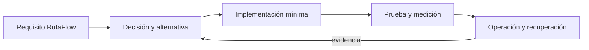

# Módulo 15: Angular Master: pruebas, animación y SSR

## Aprende construyendo

### Tema 1: TestBed y ComponentFixture

**Conceptos clave:** propósito, modelo de ejecución, configuración, seguridad, coste, pruebas y operación.

TestBed y ComponentFixture se estudia como una decisión de ingeniería y no como una colección de comandos. Primero identifica el problema que resuelve y los límites de la plataforma; luego construye el incremento mínimo dentro de RutaFlow. Registra entradas, salidas, dependencias y condiciones de fallo. Compara al menos una alternativa y conserva la medición que justifica la elección. Si la tecnología es experimental, se aísla del camino estable y se documenta la estrategia de retirada.

En producción debes considerar configuración por ambiente, identidad de máquina y persona, secretos, compatibilidad, telemetría y recuperación. Una demostración exitosa no prueba comportamiento bajo concurrencia, reintentos, pérdida de red o datos inválidos. Por eso el laboratorio introduce un fallo deliberado y exige una prueba de regresión. El resultado debe poder repetirse desde terminal y CI sin pasos secretos del editor.

**Analogía:** es como incorporar una nueva estación a una red logística: no basta con construirla; hay que definir rutas, capacidad, controles, contingencias y cómo sabremos que funciona.

**¿Por qué es importante?** Porque TestBed y ComponentFixture aparece cuando el sistema crece y las decisiones dejan de ser locales. Comprender su coste evita adoptar una herramienta por popularidad o descartarla por una primera experiencia incompleta.

**Casos de uso reales:** operación normal, configuración inválida, dependencia lenta, solicitud duplicada, cambio incompatible y recuperación posterior a un despliegue fallido.

**Diagrama:**

### Tema 2: Pruebas de Signals

**Conceptos clave:** propósito, modelo de ejecución, configuración, seguridad, coste, pruebas y operación.

Pruebas de Signals se estudia como una decisión de ingeniería y no como una colección de comandos. Primero identifica el problema que resuelve y los límites de la plataforma; luego construye el incremento mínimo dentro de RutaFlow. Registra entradas, salidas, dependencias y condiciones de fallo. Compara al menos una alternativa y conserva la medición que justifica la elección. Si la tecnología es experimental, se aísla del camino estable y se documenta la estrategia de retirada.

En producción debes considerar configuración por ambiente, identidad de máquina y persona, secretos, compatibilidad, telemetría y recuperación. Una demostración exitosa no prueba comportamiento bajo concurrencia, reintentos, pérdida de red o datos inválidos. Por eso el laboratorio introduce un fallo deliberado y exige una prueba de regresión. El resultado debe poder repetirse desde terminal y CI sin pasos secretos del editor.

**Analogía:** es como incorporar una nueva estación a una red logística: no basta con construirla; hay que definir rutas, capacidad, controles, contingencias y cómo sabremos que funciona.

**¿Por qué es importante?** Porque Pruebas de Signals aparece cuando el sistema crece y las decisiones dejan de ser locales. Comprender su coste evita adoptar una herramienta por popularidad o descartarla por una primera experiencia incompleta.

**Casos de uso reales:** operación normal, configuración inválida, dependencia lenta, solicitud duplicada, cambio incompatible y recuperación posterior a un despliegue fallido.

**Diagrama:**

### Tema 3: Cypress y Playwright

**Conceptos clave:** propósito, modelo de ejecución, configuración, seguridad, coste, pruebas y operación.

Cypress y Playwright se estudia como una decisión de ingeniería y no como una colección de comandos. Primero identifica el problema que resuelve y los límites de la plataforma; luego construye el incremento mínimo dentro de RutaFlow. Registra entradas, salidas, dependencias y condiciones de fallo. Compara al menos una alternativa y conserva la medición que justifica la elección. Si la tecnología es experimental, se aísla del camino estable y se documenta la estrategia de retirada.

En producción debes considerar configuración por ambiente, identidad de máquina y persona, secretos, compatibilidad, telemetría y recuperación. Una demostración exitosa no prueba comportamiento bajo concurrencia, reintentos, pérdida de red o datos inválidos. Por eso el laboratorio introduce un fallo deliberado y exige una prueba de regresión. El resultado debe poder repetirse desde terminal y CI sin pasos secretos del editor.

**Analogía:** es como incorporar una nueva estación a una red logística: no basta con construirla; hay que definir rutas, capacidad, controles, contingencias y cómo sabremos que funciona.

**¿Por qué es importante?** Porque Cypress y Playwright aparece cuando el sistema crece y las decisiones dejan de ser locales. Comprender su coste evita adoptar una herramienta por popularidad o descartarla por una primera experiencia incompleta.

**Casos de uso reales:** operación normal, configuración inválida, dependencia lenta, solicitud duplicada, cambio incompatible y recuperación posterior a un despliegue fallido.

**Diagrama:**

### Tema 4: Animaciones accesibles

**Conceptos clave:** propósito, modelo de ejecución, configuración, seguridad, coste, pruebas y operación.

Animaciones accesibles se estudia como una decisión de ingeniería y no como una colección de comandos. Primero identifica el problema que resuelve y los límites de la plataforma; luego construye el incremento mínimo dentro de RutaFlow. Registra entradas, salidas, dependencias y condiciones de fallo. Compara al menos una alternativa y conserva la medición que justifica la elección. Si la tecnología es experimental, se aísla del camino estable y se documenta la estrategia de retirada.

En producción debes considerar configuración por ambiente, identidad de máquina y persona, secretos, compatibilidad, telemetría y recuperación. Una demostración exitosa no prueba comportamiento bajo concurrencia, reintentos, pérdida de red o datos inválidos. Por eso el laboratorio introduce un fallo deliberado y exige una prueba de regresión. El resultado debe poder repetirse desde terminal y CI sin pasos secretos del editor.

**Analogía:** es como incorporar una nueva estación a una red logística: no basta con construirla; hay que definir rutas, capacidad, controles, contingencias y cómo sabremos que funciona.

**¿Por qué es importante?** Porque Animaciones accesibles aparece cuando el sistema crece y las decisiones dejan de ser locales. Comprender su coste evita adoptar una herramienta por popularidad o descartarla por una primera experiencia incompleta.

**Casos de uso reales:** operación normal, configuración inválida, dependencia lenta, solicitud duplicada, cambio incompatible y recuperación posterior a un despliegue fallido.

**Diagrama:**

### Tema 5: SSR y TransferState

**Conceptos clave:** propósito, modelo de ejecución, configuración, seguridad, coste, pruebas y operación.

SSR y TransferState se estudia como una decisión de ingeniería y no como una colección de comandos. Primero identifica el problema que resuelve y los límites de la plataforma; luego construye el incremento mínimo dentro de RutaFlow. Registra entradas, salidas, dependencias y condiciones de fallo. Compara al menos una alternativa y conserva la medición que justifica la elección. Si la tecnología es experimental, se aísla del camino estable y se documenta la estrategia de retirada.

En producción debes considerar configuración por ambiente, identidad de máquina y persona, secretos, compatibilidad, telemetría y recuperación. Una demostración exitosa no prueba comportamiento bajo concurrencia, reintentos, pérdida de red o datos inválidos. Por eso el laboratorio introduce un fallo deliberado y exige una prueba de regresión. El resultado debe poder repetirse desde terminal y CI sin pasos secretos del editor.

**Analogía:** es como incorporar una nueva estación a una red logística: no basta con construirla; hay que definir rutas, capacidad, controles, contingencias y cómo sabremos que funciona.

**¿Por qué es importante?** Porque SSR y TransferState aparece cuando el sistema crece y las decisiones dejan de ser locales. Comprender su coste evita adoptar una herramienta por popularidad o descartarla por una primera experiencia incompleta.

**Casos de uso reales:** operación normal, configuración inválida, dependencia lenta, solicitud duplicada, cambio incompatible y recuperación posterior a un despliegue fallido.

**Diagrama:**

### Tema 6: Hidratación y provideServerRendering

**Conceptos clave:** propósito, modelo de ejecución, configuración, seguridad, coste, pruebas y operación.

Hidratación y provideServerRendering se estudia como una decisión de ingeniería y no como una colección de comandos. Primero identifica el problema que resuelve y los límites de la plataforma; luego construye el incremento mínimo dentro de RutaFlow. Registra entradas, salidas, dependencias y condiciones de fallo. Compara al menos una alternativa y conserva la medición que justifica la elección. Si la tecnología es experimental, se aísla del camino estable y se documenta la estrategia de retirada.

En producción debes considerar configuración por ambiente, identidad de máquina y persona, secretos, compatibilidad, telemetría y recuperación. Una demostración exitosa no prueba comportamiento bajo concurrencia, reintentos, pérdida de red o datos inválidos. Por eso el laboratorio introduce un fallo deliberado y exige una prueba de regresión. El resultado debe poder repetirse desde terminal y CI sin pasos secretos del editor.

**Analogía:** es como incorporar una nueva estación a una red logística: no basta con construirla; hay que definir rutas, capacidad, controles, contingencias y cómo sabremos que funciona.

**¿Por qué es importante?** Porque Hidratación y provideServerRendering aparece cuando el sistema crece y las decisiones dejan de ser locales. Comprender su coste evita adoptar una herramienta por popularidad o descartarla por una primera experiencia incompleta.

**Casos de uso reales:** operación normal, configuración inválida, dependencia lenta, solicitud duplicada, cambio incompatible y recuperación posterior a un despliegue fallido.

**Diagrama:**

## Trazabilidad de la auditoría original

- **Pruebas Unitarias**: cubierto mediante fundamento, laboratorio y evidencia del capítulo.
- **Pruebas E2E**: cubierto mediante fundamento, laboratorio y evidencia del capítulo.
- **Animaciones**: cubierto mediante fundamento, laboratorio y evidencia del capítulo.
- **Angular Universal (SSR)**: cubierto mediante fundamento, laboratorio y evidencia del capítulo.
