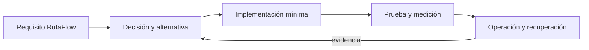

# Módulo 15: Angular Master: pruebas, animación y SSR

## Sílabo

**Objetivo general:** dominar las capacidades avanzadas señaladas en la auditoría del track mediante una ampliación ejecutable de RutaFlow, decisiones justificadas, pruebas, seguridad y evidencia operacional.

**Resultados observables:** explicar cada tecnología sin depender de marcas; implementar un incremento pequeño; comparar alternativas; provocar un fallo; medir el resultado; y escribir un runbook de recuperación.

**Evaluación:** 20 % fundamento, 35 % implementación, 25 % pruebas y fallos, 10 % seguridad, 10 % documentación y comunicación.

## Comienza desde cero: prepara este capítulo

Este recorrido parte de una carpeta vacía. Al finalizar tendrás **Un incremento pequeño, probado y reproducible del capítulo.** No avances ejecutando comandos que no comprendes: primero identifica la entrada, la transformación y la evidencia que comprobará el resultado.

### 1. Comprueba las herramientas

Los comandos funcionan en macOS, Linux y WSL. En PowerShell usa el equivalente indicado por la herramienta.

```bash
node --version
npm --version
npx ng version
```

Si un comando no existe, detente e instala esa herramienta desde su sitio oficial. Cierra y abre la terminal después de modificar `PATH`. Las versiones deben ser compatibles entre sí antes de crear archivos.

### 2. Crea o recupera el proyecto del track

```bash
npx @angular/cli@latest new academia-labs/angular-app --standalone --routing --style=scss
cd academia-labs/angular-app
git init
```

Trabaja dentro de `academia-labs/angular-app`. Si ya existe, no lo vuelvas a generar: entra en la carpeta, confirma `git status` y continúa sobre una rama propia.

### 3. Ubica cada tema antes de escribir

```text
academia-labs/angular-app/
├─ src/app/features/
│  └─ module-15/
├─ tests/
├─ docs/decisions/
├─ evidence/module-15/
└─ README.md
```

| Tema | Archivo o decisión | Evidencia mínima |
|---|---|---|
| 1. TestBed y ComponentFixture | `src/app/features/module-15/topic-1-testbed-y-componentfixture.ts` | prueba + salida observable |
| 2. Pruebas de Signals | `src/app/features/module-15/topic-2-pruebas-de-signals.ts` | prueba + salida observable |
| 3. Cypress y Playwright | `src/app/features/module-15/topic-3-cypress-y-playwright.ts` | prueba + salida observable |
| 4. Animaciones accesibles | `src/app/features/module-15/topic-4-animaciones-accesibles.ts` | prueba + salida observable |
| 5. SSR y TransferState | `src/app/features/module-15/topic-5-ssr-y-transferstate.ts` | prueba + salida observable |
| 6. Hidratación y provideServerRendering | `src/app/features/module-15/topic-6-hidratacion-y-provideserverrendering.ts` | prueba + salida observable |
| 7. Servicios y DI | `docs/decisions/module-15-topic-7.md` | contexto + alternativas + decisión + consecuencias |
| 8. HTTP Client | `docs/decisions/module-15-topic-8.md` | contexto + alternativas + decisión + consecuencias |
| 9. Deferrable Views | `docs/decisions/module-15-topic-9.md` | contexto + alternativas + decisión + consecuencias |
| 10. State Management | `docs/decisions/module-15-topic-10.md` | contexto + alternativas + decisión + consecuencias |
| 11. Micro Frontends | `docs/decisions/module-15-topic-11.md` | contexto + alternativas + decisión + consecuencias |
| 12. Web Components | `docs/decisions/module-15-topic-12.md` | contexto + alternativas + decisión + consecuencias |
| 13. Clean Architecture | `docs/decisions/module-15-topic-13.md` | contexto + alternativas + decisión + consecuencias |
| 14. Internals | `docs/decisions/module-15-topic-14.md` | contexto + alternativas + decisión + consecuencias |
| 15. Accesibilidad Angular | `docs/decisions/module-15-topic-15.md` | contexto + alternativas + decisión + consecuencias |
| 16. Seguridad del navegador | `docs/decisions/module-15-topic-16.md` | contexto + alternativas + decisión + consecuencias |
| 17. Diseño de sistemas frontend | `docs/decisions/module-15-topic-17.md` | contexto + alternativas + decisión + consecuencias |
| 18. Guardas de ruta | `docs/decisions/module-15-topic-18.md` | contexto + alternativas + decisión + consecuencias |
| 19. Carga diferida (Lazy Loading) | `docs/decisions/module-15-topic-19.md` | contexto + alternativas + decisión + consecuencias |
| 20. Carga diferida de Angular 17 | `docs/decisions/module-15-topic-20.md` | contexto + alternativas + decisión + consecuencias |
| 21. Gatillos personalizados | `docs/decisions/module-15-topic-21.md` | contexto + alternativas + decisión + consecuencias |
| 22. Angular Universal e hidratación | `docs/decisions/module-15-topic-22.md` | contexto + alternativas + decisión + consecuencias |
| 23. Estrategias de renderizado de alto rendimiento | `docs/decisions/module-15-topic-23.md` | contexto + alternativas + decisión + consecuencias |
| 24. Component Store | `docs/decisions/module-15-topic-24.md` | contexto + alternativas + decisión + consecuencias |
| 25. Patrones de estructuración empresarial | `docs/decisions/module-15-topic-25.md` | contexto + alternativas + decisión + consecuencias |
| 26. Optimización de detección de cambios | `docs/decisions/module-15-topic-26.md` | contexto + alternativas + decisión + consecuencias |
| 27. Pruebas de servicios | `docs/decisions/module-15-topic-27.md` | contexto + alternativas + decisión + consecuencias |
| 28. Pruebas de pipes | `docs/decisions/module-15-topic-28.md` | contexto + alternativas + decisión + consecuencias |
| 29. Pruebas de enrutamiento | `docs/decisions/module-15-topic-29.md` | contexto + alternativas + decisión + consecuencias |
| 30. Arquitectura escalable | `docs/decisions/module-15-topic-30.md` | contexto + alternativas + decisión + consecuencias |
| 31. Patrones de comunicación de componentes | `docs/decisions/module-15-topic-31.md` | contexto + alternativas + decisión + consecuencias |
| 32. Programación reactiva | `docs/decisions/module-15-topic-32.md` | contexto + alternativas + decisión + consecuencias |
| 33. Desarrollo de aplicaciones multi-dispositivo | `docs/decisions/module-15-topic-33.md` | contexto + alternativas + decisión + consecuencias |
| 34. Dispositivos sensoriales | `docs/decisions/module-15-topic-34.md` | contexto + alternativas + decisión + consecuencias |

Un ejemplo técnico vive en el archivo indicado y debe tener una prueba. Un tema conceptual vive en `docs/decisions/`: compara opciones usando restricciones medibles; no escribas código decorativo solo para llenar espacio.

### 4. Ejecuta una línea base

Desde `academia-labs/angular-app`:

```bash
npm test -- --watch=false && npm start
```

**Resultado esperado:** el comando reconoce el proyecto y termina sin errores antes de introducir el cambio del capítulo. Después del incremento, la evidencia debe demostrar: **Un incremento pequeño, probado y reproducible del capítulo.**

Si falla la línea base, no continúes. Localiza el primer mensaje que indique archivo, línea o dependencia; formula una causa y compruébala con un cambio pequeño.

### 5. Provoca un fallo y recupérate

Simula un estado vacío o un error HTTP y comprueba que la interfaz muestre recuperación y no una pantalla ambigua. Guarda en `evidence/module-15/` el comando, la salida relevante, tu hipótesis y la corrección. Revierte únicamente el cambio deliberado; no borres todo el proyecto para ocultar la causa.

### 6. Conecta el capítulo con RutaFlow

Aplica el aprendizaje de **Angular Master: pruebas, animación y SSR** a un incremento vertical de RutaFlow. Define qué componente produce el dato, qué contrato lo transporta, quién lo consume y cómo observarás un fallo. La entrega final incluye archivo o decisión, prueba, salida, error corregido y una limitación que todavía validarías en producción.

---

## Contenido teórico

### Tema 1: TestBed y ComponentFixture

**Conceptos clave:** propósito, modelo de ejecución, configuración, seguridad, coste, pruebas y operación.

TestBed y ComponentFixture se estudia como una decisión de ingeniería y no como una colección de comandos. Primero identifica el problema que resuelve y los límites de la plataforma; luego construye el incremento mínimo dentro de RutaFlow. Registra entradas, salidas, dependencias y condiciones de fallo. Compara al menos una alternativa y conserva la medición que justifica la elección. Si la tecnología es experimental, se aísla del camino estable y se documenta la estrategia de retirada.

En producción debes considerar configuración por ambiente, identidad de máquina y persona, secretos, compatibilidad, telemetría y recuperación. Una demostración exitosa no prueba comportamiento bajo concurrencia, reintentos, pérdida de red o datos inválidos. Por eso el laboratorio introduce un fallo deliberado y exige una prueba de regresión. El resultado debe poder repetirse desde terminal y CI sin pasos secretos del editor.

**Analogía:** es como incorporar una nueva estación a una red logística: no basta con construirla; hay que definir rutas, capacidad, controles, contingencias y cómo sabremos que funciona.

**¿Por qué es importante?** Porque TestBed y ComponentFixture aparece cuando el sistema crece y las decisiones dejan de ser locales. Comprender su coste evita adoptar una herramienta por popularidad o descartarla por una primera experiencia incompleta.

**Casos de uso reales:** operación normal, configuración inválida, dependencia lenta, solicitud duplicada, cambio incompatible y recuperación posterior a un despliegue fallido.

**Diagrama:**


### Tema 2: Pruebas de Signals

**Conceptos clave:** propósito, modelo de ejecución, configuración, seguridad, coste, pruebas y operación.

Pruebas de Signals se estudia como una decisión de ingeniería y no como una colección de comandos. Primero identifica el problema que resuelve y los límites de la plataforma; luego construye el incremento mínimo dentro de RutaFlow. Registra entradas, salidas, dependencias y condiciones de fallo. Compara al menos una alternativa y conserva la medición que justifica la elección. Si la tecnología es experimental, se aísla del camino estable y se documenta la estrategia de retirada.

En producción debes considerar configuración por ambiente, identidad de máquina y persona, secretos, compatibilidad, telemetría y recuperación. Una demostración exitosa no prueba comportamiento bajo concurrencia, reintentos, pérdida de red o datos inválidos. Por eso el laboratorio introduce un fallo deliberado y exige una prueba de regresión. El resultado debe poder repetirse desde terminal y CI sin pasos secretos del editor.

**Analogía:** es como incorporar una nueva estación a una red logística: no basta con construirla; hay que definir rutas, capacidad, controles, contingencias y cómo sabremos que funciona.

**¿Por qué es importante?** Porque Pruebas de Signals aparece cuando el sistema crece y las decisiones dejan de ser locales. Comprender su coste evita adoptar una herramienta por popularidad o descartarla por una primera experiencia incompleta.

**Casos de uso reales:** operación normal, configuración inválida, dependencia lenta, solicitud duplicada, cambio incompatible y recuperación posterior a un despliegue fallido.

**Diagrama:**


### Tema 3: Cypress y Playwright

**Conceptos clave:** propósito, modelo de ejecución, configuración, seguridad, coste, pruebas y operación.

Cypress y Playwright se estudia como una decisión de ingeniería y no como una colección de comandos. Primero identifica el problema que resuelve y los límites de la plataforma; luego construye el incremento mínimo dentro de RutaFlow. Registra entradas, salidas, dependencias y condiciones de fallo. Compara al menos una alternativa y conserva la medición que justifica la elección. Si la tecnología es experimental, se aísla del camino estable y se documenta la estrategia de retirada.

En producción debes considerar configuración por ambiente, identidad de máquina y persona, secretos, compatibilidad, telemetría y recuperación. Una demostración exitosa no prueba comportamiento bajo concurrencia, reintentos, pérdida de red o datos inválidos. Por eso el laboratorio introduce un fallo deliberado y exige una prueba de regresión. El resultado debe poder repetirse desde terminal y CI sin pasos secretos del editor.

**Analogía:** es como incorporar una nueva estación a una red logística: no basta con construirla; hay que definir rutas, capacidad, controles, contingencias y cómo sabremos que funciona.

**¿Por qué es importante?** Porque Cypress y Playwright aparece cuando el sistema crece y las decisiones dejan de ser locales. Comprender su coste evita adoptar una herramienta por popularidad o descartarla por una primera experiencia incompleta.

**Casos de uso reales:** operación normal, configuración inválida, dependencia lenta, solicitud duplicada, cambio incompatible y recuperación posterior a un despliegue fallido.

**Diagrama:**


### Tema 4: Animaciones accesibles

**Conceptos clave:** propósito, modelo de ejecución, configuración, seguridad, coste, pruebas y operación.

Animaciones accesibles se estudia como una decisión de ingeniería y no como una colección de comandos. Primero identifica el problema que resuelve y los límites de la plataforma; luego construye el incremento mínimo dentro de RutaFlow. Registra entradas, salidas, dependencias y condiciones de fallo. Compara al menos una alternativa y conserva la medición que justifica la elección. Si la tecnología es experimental, se aísla del camino estable y se documenta la estrategia de retirada.

En producción debes considerar configuración por ambiente, identidad de máquina y persona, secretos, compatibilidad, telemetría y recuperación. Una demostración exitosa no prueba comportamiento bajo concurrencia, reintentos, pérdida de red o datos inválidos. Por eso el laboratorio introduce un fallo deliberado y exige una prueba de regresión. El resultado debe poder repetirse desde terminal y CI sin pasos secretos del editor.

**Analogía:** es como incorporar una nueva estación a una red logística: no basta con construirla; hay que definir rutas, capacidad, controles, contingencias y cómo sabremos que funciona.

**¿Por qué es importante?** Porque Animaciones accesibles aparece cuando el sistema crece y las decisiones dejan de ser locales. Comprender su coste evita adoptar una herramienta por popularidad o descartarla por una primera experiencia incompleta.

**Casos de uso reales:** operación normal, configuración inválida, dependencia lenta, solicitud duplicada, cambio incompatible y recuperación posterior a un despliegue fallido.

**Diagrama:**


### Tema 5: SSR y TransferState

**Conceptos clave:** propósito, modelo de ejecución, configuración, seguridad, coste, pruebas y operación.

SSR y TransferState se estudia como una decisión de ingeniería y no como una colección de comandos. Primero identifica el problema que resuelve y los límites de la plataforma; luego construye el incremento mínimo dentro de RutaFlow. Registra entradas, salidas, dependencias y condiciones de fallo. Compara al menos una alternativa y conserva la medición que justifica la elección. Si la tecnología es experimental, se aísla del camino estable y se documenta la estrategia de retirada.

En producción debes considerar configuración por ambiente, identidad de máquina y persona, secretos, compatibilidad, telemetría y recuperación. Una demostración exitosa no prueba comportamiento bajo concurrencia, reintentos, pérdida de red o datos inválidos. Por eso el laboratorio introduce un fallo deliberado y exige una prueba de regresión. El resultado debe poder repetirse desde terminal y CI sin pasos secretos del editor.

**Analogía:** es como incorporar una nueva estación a una red logística: no basta con construirla; hay que definir rutas, capacidad, controles, contingencias y cómo sabremos que funciona.

**¿Por qué es importante?** Porque SSR y TransferState aparece cuando el sistema crece y las decisiones dejan de ser locales. Comprender su coste evita adoptar una herramienta por popularidad o descartarla por una primera experiencia incompleta.

**Casos de uso reales:** operación normal, configuración inválida, dependencia lenta, solicitud duplicada, cambio incompatible y recuperación posterior a un despliegue fallido.

**Diagrama:**


### Tema 6: Hidratación y provideServerRendering

**Conceptos clave:** propósito, modelo de ejecución, configuración, seguridad, coste, pruebas y operación.

Hidratación y provideServerRendering se estudia como una decisión de ingeniería y no como una colección de comandos. Primero identifica el problema que resuelve y los límites de la plataforma; luego construye el incremento mínimo dentro de RutaFlow. Registra entradas, salidas, dependencias y condiciones de fallo. Compara al menos una alternativa y conserva la medición que justifica la elección. Si la tecnología es experimental, se aísla del camino estable y se documenta la estrategia de retirada.

En producción debes considerar configuración por ambiente, identidad de máquina y persona, secretos, compatibilidad, telemetría y recuperación. Una demostración exitosa no prueba comportamiento bajo concurrencia, reintentos, pérdida de red o datos inválidos. Por eso el laboratorio introduce un fallo deliberado y exige una prueba de regresión. El resultado debe poder repetirse desde terminal y CI sin pasos secretos del editor.

**Analogía:** es como incorporar una nueva estación a una red logística: no basta con construirla; hay que definir rutas, capacidad, controles, contingencias y cómo sabremos que funciona.

**¿Por qué es importante?** Porque Hidratación y provideServerRendering aparece cuando el sistema crece y las decisiones dejan de ser locales. Comprender su coste evita adoptar una herramienta por popularidad o descartarla por una primera experiencia incompleta.

**Casos de uso reales:** operación normal, configuración inválida, dependencia lenta, solicitud duplicada, cambio incompatible y recuperación posterior a un despliegue fallido.

**Diagrama:**


## Trazabilidad de la auditoría original

- **Pruebas Unitarias**: cubierto mediante fundamento, laboratorio y evidencia del capítulo.
- **Pruebas E2E**: cubierto mediante fundamento, laboratorio y evidencia del capítulo.
- **Animaciones**: cubierto mediante fundamento, laboratorio y evidencia del capítulo.
- **Angular Universal (SSR)**: cubierto mediante fundamento, laboratorio y evidencia del capítulo.

## Criterio transversal de calidad del código

Usa nombres del dominio, errores tipados y límites claros. Escribe una prueba que exprese el comportamiento antes de corregir el defecto. SOLID se aplica cuando reduce el coste real de sustituir infraestructura o política; no abstraer antes de observar repetición con el mismo significado. Revisa nombres, cohesión, dependencias, errores, prueba, mínimo privilegio y capacidad de diagnóstico.

## Laboratorio práctico

Selecciona una vertical de RutaFlow —cotización, asignación, tracking, evidencia o liquidación— y crea una rama desde un estado verificable. Para cada tema agrega una capacidad pequeña, no una aplicación paralela. Mantén un diario con hipótesis, comando, resultado, métrica y decisión.

1. Define requisito, amenaza y atributo de calidad medible.
2. Construye la versión mínima con configuración reproducible.
3. Prueba camino feliz, entrada inválida y fallo de dependencia.
4. Ejecuta análisis de seguridad y registra datos sensibles tratados.
5. Mide latencia, coste, tamaño, accesibilidad o recuperación según corresponda.
6. Automatiza la comprobación en CI y documenta rollback.

La definición de terminado requiere código ejecutable, prueba automatizada, diagrama, ADR, enlace oficial con versión, medición antes/después y un procedimiento de limpieza. No se aceptan capturas sin comandos ni resultados imposibles de repetir.

## Ejercicios de evaluación

### Ejercicio 1: comparación profesional

Compara dos alternativas mediante cinco criterios: complejidad, seguridad, coste, portabilidad y operación. Elige una y escribe qué evidencia futura haría cambiar la decisión.

### Ejercicio 2: fallo deliberado

Interrumpe una dependencia o introduce configuración inválida. Conserva la prueba que reproduce el defecto, mejora el mensaje de error y verifica recuperación sin pérdida ni duplicación.

### Ejercicio 3: transferencia a RutaFlow

Integra tres temas del capítulo en una sola vertical. Dibuja las fronteras, identifica el dato sensible y demuestra observabilidad de extremo a extremo mediante correlation ID.

### Ejercicio 4: enseñar para demostrar dominio

Explica el tema más difícil en lenguaje cotidiano, presenta un ejemplo mínimo y responde cuándo no debería utilizarse. La explicación debe diferenciar hecho, estimación y opinión.

## Rúbrica del proyecto

| Criterio | Inicial | Competente | Master verificable |
|---|---|---|---|
| Fundamento | Enumera APIs | Explica propósito | Compara límites y alternativas |
| Implementación | Demo manual | Flujo reproducible | Integración cohesionada y recuperable |
| Calidad | Camino feliz | Pruebas y errores | Fallos, compatibilidad y regresión |
| Seguridad | Secretos locales | Mínimo privilegio | Threat model y evidencia negativa |
| Operación | Sin métricas | Telemetría básica | SLO, coste y runbook ensayado |

## Bibliografía y fundamento académico

- Documentación primaria enlazada en el capítulo de actualizaciones oficiales del track.
- ACM/IEEE CS2023 y SWEBOK V4 para fundamentos, diseño, pruebas, seguridad y operación.
- NIST Secure Software Development Framework y OWASP ASVS/MASVS.
- Martin Kleppmann, *Designing Data-Intensive Applications*.
- Google, *Site Reliability Engineering* y *SRE Workbook*.
- Documentación de accesibilidad W3C/WCAG cuando exista interfaz humana.

<!-- DEFINITIVE-COMPLEMENTS:START -->
## Complementos de la lista definitiva

Las siguientes capacidades no aparecían literalmente en el índice previo. Se incorporan con el mismo criterio del capítulo: fundamento, aplicación en RutaFlow, fallo deliberado y evidencia reproducible.

### Tema complementario: Servicios y DI

**Conceptos clave:** @Injectable, providedIn, jerarquía de inyectores.

Este tema se incorpora de forma explícita porque no aparecía con el mismo nombre en el currículo visible. Estúdialo identificando propósito, entradas, salida observable, límites, amenaza y coste de operación. Construye un ejemplo mínimo conectado con RutaFlow y compara una alternativa antes de añadir una dependencia.

**Analogía:** es una pieza del sistema logístico que solo aporta valor cuando se conecta con un proceso, una responsabilidad y una señal verificable.

**¿Por qué es importante?** Porque reconocer `Servicios y DI` no demuestra dominio; debes aplicarlo, provocar un fallo y explicar cuándo no conviene utilizarlo.

**Casos de uso reales:** camino feliz, configuración inválida, dato tardío, acceso no autorizado y recuperación tras una dependencia indisponible.

**Práctica breve:** implementa una capacidad pequeña, escribe una prueba de éxito y otra de fallo, registra una métrica y documenta la decisión en un ADR.
### Tema complementario: HTTP Client

**Conceptos clave:** Peticiones, interceptores, manejo de errores.

Este tema se incorpora de forma explícita porque no aparecía con el mismo nombre en el currículo visible. Estúdialo identificando propósito, entradas, salida observable, límites, amenaza y coste de operación. Construye un ejemplo mínimo conectado con RutaFlow y compara una alternativa antes de añadir una dependencia.

**Analogía:** es una pieza del sistema logístico que solo aporta valor cuando se conecta con un proceso, una responsabilidad y una señal verificable.

**¿Por qué es importante?** Porque reconocer `HTTP Client` no demuestra dominio; debes aplicarlo, provocar un fallo y explicar cuándo no conviene utilizarlo.

**Casos de uso reales:** camino feliz, configuración inválida, dato tardío, acceso no autorizado y recuperación tras una dependencia indisponible.

**Práctica breve:** implementa una capacidad pequeña, escribe una prueba de éxito y otra de fallo, registra una métrica y documenta la decisión en un ADR.
### Tema complementario: Deferrable Views

**Conceptos clave:** @defer, triggers, placeholders.

Este tema se incorpora de forma explícita porque no aparecía con el mismo nombre en el currículo visible. Estúdialo identificando propósito, entradas, salida observable, límites, amenaza y coste de operación. Construye un ejemplo mínimo conectado con RutaFlow y compara una alternativa antes de añadir una dependencia.

**Analogía:** es una pieza del sistema logístico que solo aporta valor cuando se conecta con un proceso, una responsabilidad y una señal verificable.

**¿Por qué es importante?** Porque reconocer `Deferrable Views` no demuestra dominio; debes aplicarlo, provocar un fallo y explicar cuándo no conviene utilizarlo.

**Casos de uso reales:** camino feliz, configuración inválida, dato tardío, acceso no autorizado y recuperación tras una dependencia indisponible.

**Práctica breve:** implementa una capacidad pequeña, escribe una prueba de éxito y otra de fallo, registra una métrica y documenta la decisión en un ADR.
### Tema complementario: State Management

**Conceptos clave:** NgRx (Store, Actions, Reducers, Effects, Selectors).

Este tema se incorpora de forma explícita porque no aparecía con el mismo nombre en el currículo visible. Estúdialo identificando propósito, entradas, salida observable, límites, amenaza y coste de operación. Construye un ejemplo mínimo conectado con RutaFlow y compara una alternativa antes de añadir una dependencia.

**Analogía:** es una pieza del sistema logístico que solo aporta valor cuando se conecta con un proceso, una responsabilidad y una señal verificable.

**¿Por qué es importante?** Porque reconocer `State Management` no demuestra dominio; debes aplicarlo, provocar un fallo y explicar cuándo no conviene utilizarlo.

**Casos de uso reales:** camino feliz, configuración inválida, dato tardío, acceso no autorizado y recuperación tras una dependencia indisponible.

**Práctica breve:** implementa una capacidad pequeña, escribe una prueba de éxito y otra de fallo, registra una métrica y documenta la decisión en un ADR.
### Tema complementario: Micro Frontends

**Conceptos clave:** Module Federation, integración standalone.

Este tema se incorpora de forma explícita porque no aparecía con el mismo nombre en el currículo visible. Estúdialo identificando propósito, entradas, salida observable, límites, amenaza y coste de operación. Construye un ejemplo mínimo conectado con RutaFlow y compara una alternativa antes de añadir una dependencia.

**Analogía:** es una pieza del sistema logístico que solo aporta valor cuando se conecta con un proceso, una responsabilidad y una señal verificable.

**¿Por qué es importante?** Porque reconocer `Micro Frontends` no demuestra dominio; debes aplicarlo, provocar un fallo y explicar cuándo no conviene utilizarlo.

**Casos de uso reales:** camino feliz, configuración inválida, dato tardío, acceso no autorizado y recuperación tras una dependencia indisponible.

**Práctica breve:** implementa una capacidad pequeña, escribe una prueba de éxito y otra de fallo, registra una métrica y documenta la decisión en un ADR.
### Tema complementario: Web Components

**Conceptos clave:** @angular/elements, createCustomElement().

Este tema se incorpora de forma explícita porque no aparecía con el mismo nombre en el currículo visible. Estúdialo identificando propósito, entradas, salida observable, límites, amenaza y coste de operación. Construye un ejemplo mínimo conectado con RutaFlow y compara una alternativa antes de añadir una dependencia.

**Analogía:** es una pieza del sistema logístico que solo aporta valor cuando se conecta con un proceso, una responsabilidad y una señal verificable.

**¿Por qué es importante?** Porque reconocer `Web Components` no demuestra dominio; debes aplicarlo, provocar un fallo y explicar cuándo no conviene utilizarlo.

**Casos de uso reales:** camino feliz, configuración inválida, dato tardío, acceso no autorizado y recuperación tras una dependencia indisponible.

**Práctica breve:** implementa una capacidad pequeña, escribe una prueba de éxito y otra de fallo, registra una métrica y documenta la decisión en un ADR.
### Tema complementario: Clean Architecture

**Conceptos clave:** DDD, separación de responsabilidades.

Este tema se incorpora de forma explícita porque no aparecía con el mismo nombre en el currículo visible. Estúdialo identificando propósito, entradas, salida observable, límites, amenaza y coste de operación. Construye un ejemplo mínimo conectado con RutaFlow y compara una alternativa antes de añadir una dependencia.

**Analogía:** es una pieza del sistema logístico que solo aporta valor cuando se conecta con un proceso, una responsabilidad y una señal verificable.

**¿Por qué es importante?** Porque reconocer `Clean Architecture` no demuestra dominio; debes aplicarlo, provocar un fallo y explicar cuándo no conviene utilizarlo.

**Casos de uso reales:** camino feliz, configuración inválida, dato tardío, acceso no autorizado y recuperación tras una dependencia indisponible.

**Práctica breve:** implementa una capacidad pequeña, escribe una prueba de éxito y otra de fallo, registra una métrica y documenta la decisión en un ADR.
### Tema complementario: Internals

**Conceptos clave:** Ivy renderer, Injection Tree, compilador (ngc).

Este tema se incorpora de forma explícita porque no aparecía con el mismo nombre en el currículo visible. Estúdialo identificando propósito, entradas, salida observable, límites, amenaza y coste de operación. Construye un ejemplo mínimo conectado con RutaFlow y compara una alternativa antes de añadir una dependencia.

**Analogía:** es una pieza del sistema logístico que solo aporta valor cuando se conecta con un proceso, una responsabilidad y una señal verificable.

**¿Por qué es importante?** Porque reconocer `Internals` no demuestra dominio; debes aplicarlo, provocar un fallo y explicar cuándo no conviene utilizarlo.

**Casos de uso reales:** camino feliz, configuración inválida, dato tardío, acceso no autorizado y recuperación tras una dependencia indisponible.

**Práctica breve:** implementa una capacidad pequeña, escribe una prueba de éxito y otra de fallo, registra una métrica y documenta la decisión en un ADR.
### Tema complementario: Accesibilidad Angular

**Conceptos clave:** CDK a11y, foco, live regions y auditoría.

Este tema se incorpora de forma explícita porque no aparecía con el mismo nombre en el currículo visible. Estúdialo identificando propósito, entradas, salida observable, límites, amenaza y coste de operación. Construye un ejemplo mínimo conectado con RutaFlow y compara una alternativa antes de añadir una dependencia.

**Analogía:** es una pieza del sistema logístico que solo aporta valor cuando se conecta con un proceso, una responsabilidad y una señal verificable.

**¿Por qué es importante?** Porque reconocer `Accesibilidad Angular` no demuestra dominio; debes aplicarlo, provocar un fallo y explicar cuándo no conviene utilizarlo.

**Casos de uso reales:** camino feliz, configuración inválida, dato tardío, acceso no autorizado y recuperación tras una dependencia indisponible.

**Práctica breve:** implementa una capacidad pequeña, escribe una prueba de éxito y otra de fallo, registra una métrica y documenta la decisión en un ADR.
### Tema complementario: Seguridad del navegador

**Conceptos clave:** sanitización, CSP y Trusted Types.

Este tema se incorpora de forma explícita porque no aparecía con el mismo nombre en el currículo visible. Estúdialo identificando propósito, entradas, salida observable, límites, amenaza y coste de operación. Construye un ejemplo mínimo conectado con RutaFlow y compara una alternativa antes de añadir una dependencia.

**Analogía:** es una pieza del sistema logístico que solo aporta valor cuando se conecta con un proceso, una responsabilidad y una señal verificable.

**¿Por qué es importante?** Porque reconocer `Seguridad del navegador` no demuestra dominio; debes aplicarlo, provocar un fallo y explicar cuándo no conviene utilizarlo.

**Casos de uso reales:** camino feliz, configuración inválida, dato tardío, acceso no autorizado y recuperación tras una dependencia indisponible.

**Práctica breve:** implementa una capacidad pequeña, escribe una prueba de éxito y otra de fallo, registra una métrica y documenta la decisión en un ADR.
### Tema complementario: Diseño de sistemas frontend

**Conceptos clave:** design tokens, librerías y documentación visual.

Este tema se incorpora de forma explícita porque no aparecía con el mismo nombre en el currículo visible. Estúdialo identificando propósito, entradas, salida observable, límites, amenaza y coste de operación. Construye un ejemplo mínimo conectado con RutaFlow y compara una alternativa antes de añadir una dependencia.

**Analogía:** es una pieza del sistema logístico que solo aporta valor cuando se conecta con un proceso, una responsabilidad y una señal verificable.

**¿Por qué es importante?** Porque reconocer `Diseño de sistemas frontend` no demuestra dominio; debes aplicarlo, provocar un fallo y explicar cuándo no conviene utilizarlo.

**Casos de uso reales:** camino feliz, configuración inválida, dato tardío, acceso no autorizado y recuperación tras una dependencia indisponible.

**Práctica breve:** implementa una capacidad pequeña, escribe una prueba de éxito y otra de fallo, registra una métrica y documenta la decisión en un ADR.

<!-- DEFINITIVE-COMPLEMENTS:END -->

<!-- SUPPLEMENTAL-COMPLEMENTS:START -->
## Ampliación académica suplementaria

Esta sección incorpora los elementos de la nueva auditoría que no aparecían literalmente en el currículo. Cada uno se conecta con fundamento, práctica y evidencia.

### Tema suplementario: Guardas de ruta

**Conceptos clave:** Route guards.

La fuente académica señalada es **Coursera**. Este tema se estudia identificando el problema, sus prerrequisitos, un modelo mínimo, un experimento y las limitaciones de la evidencia. En RutaFlow se conecta con una decisión concreta de producto, datos, plataforma u operación, evitando agregar tecnología sin necesidad verificable.

**Analogía:** es una asignatura dentro de un programa universitario: aporta una perspectiva específica y necesita conectarse con las demás para formar criterio profesional.

**¿Por qué es importante?** Porque Guardas de ruta amplía el mapa mental y permite comprender decisiones que una guía centrada únicamente en frameworks no explica.

**Casos de uso reales:** diseño inicial, restricción de recursos, entrada inválida, fallo parcial, impacto humano y revisión posterior mediante métricas.

**Práctica breve:** construye un ejemplo pequeño, formula una hipótesis, mide el resultado, registra una amenaza o sesgo y explica qué conocimiento adicional necesitarías para usarlo en producción.
### Tema suplementario: Carga diferida (Lazy Loading)

**Conceptos clave:** Lazy loading.

La fuente académica señalada es **Coursera**. Este tema se estudia identificando el problema, sus prerrequisitos, un modelo mínimo, un experimento y las limitaciones de la evidencia. En RutaFlow se conecta con una decisión concreta de producto, datos, plataforma u operación, evitando agregar tecnología sin necesidad verificable.

**Analogía:** es una asignatura dentro de un programa universitario: aporta una perspectiva específica y necesita conectarse con las demás para formar criterio profesional.

**¿Por qué es importante?** Porque Carga diferida (Lazy Loading) amplía el mapa mental y permite comprender decisiones que una guía centrada únicamente en frameworks no explica.

**Casos de uso reales:** diseño inicial, restricción de recursos, entrada inválida, fallo parcial, impacto humano y revisión posterior mediante métricas.

**Práctica breve:** construye un ejemplo pequeño, formula una hipótesis, mide el resultado, registra una amenaza o sesgo y explica qué conocimiento adicional necesitarías para usarlo en producción.
### Tema suplementario: Carga diferida de Angular 17

**Conceptos clave:** Deferred loading.

La fuente académica señalada es **Coursera**. Este tema se estudia identificando el problema, sus prerrequisitos, un modelo mínimo, un experimento y las limitaciones de la evidencia. En RutaFlow se conecta con una decisión concreta de producto, datos, plataforma u operación, evitando agregar tecnología sin necesidad verificable.

**Analogía:** es una asignatura dentro de un programa universitario: aporta una perspectiva específica y necesita conectarse con las demás para formar criterio profesional.

**¿Por qué es importante?** Porque Carga diferida de Angular 17 amplía el mapa mental y permite comprender decisiones que una guía centrada únicamente en frameworks no explica.

**Casos de uso reales:** diseño inicial, restricción de recursos, entrada inválida, fallo parcial, impacto humano y revisión posterior mediante métricas.

**Práctica breve:** construye un ejemplo pequeño, formula una hipótesis, mide el resultado, registra una amenaza o sesgo y explica qué conocimiento adicional necesitarías para usarlo en producción.
### Tema suplementario: Gatillos personalizados

**Conceptos clave:** Custom triggers.

La fuente académica señalada es **Coursera**. Este tema se estudia identificando el problema, sus prerrequisitos, un modelo mínimo, un experimento y las limitaciones de la evidencia. En RutaFlow se conecta con una decisión concreta de producto, datos, plataforma u operación, evitando agregar tecnología sin necesidad verificable.

**Analogía:** es una asignatura dentro de un programa universitario: aporta una perspectiva específica y necesita conectarse con las demás para formar criterio profesional.

**¿Por qué es importante?** Porque Gatillos personalizados amplía el mapa mental y permite comprender decisiones que una guía centrada únicamente en frameworks no explica.

**Casos de uso reales:** diseño inicial, restricción de recursos, entrada inválida, fallo parcial, impacto humano y revisión posterior mediante métricas.

**Práctica breve:** construye un ejemplo pequeño, formula una hipótesis, mide el resultado, registra una amenaza o sesgo y explica qué conocimiento adicional necesitarías para usarlo en producción.
### Tema suplementario: Angular Universal e hidratación

**Conceptos clave:** SSR, hydration.

La fuente académica señalada es **Coursera**. Este tema se estudia identificando el problema, sus prerrequisitos, un modelo mínimo, un experimento y las limitaciones de la evidencia. En RutaFlow se conecta con una decisión concreta de producto, datos, plataforma u operación, evitando agregar tecnología sin necesidad verificable.

**Analogía:** es una asignatura dentro de un programa universitario: aporta una perspectiva específica y necesita conectarse con las demás para formar criterio profesional.

**¿Por qué es importante?** Porque Angular Universal e hidratación amplía el mapa mental y permite comprender decisiones que una guía centrada únicamente en frameworks no explica.

**Casos de uso reales:** diseño inicial, restricción de recursos, entrada inválida, fallo parcial, impacto humano y revisión posterior mediante métricas.

**Práctica breve:** construye un ejemplo pequeño, formula una hipótesis, mide el resultado, registra una amenaza o sesgo y explica qué conocimiento adicional necesitarías para usarlo en producción.
### Tema suplementario: Estrategias de renderizado de alto rendimiento

**Conceptos clave:** High-performance rendering.

La fuente académica señalada es **Coursera**. Este tema se estudia identificando el problema, sus prerrequisitos, un modelo mínimo, un experimento y las limitaciones de la evidencia. En RutaFlow se conecta con una decisión concreta de producto, datos, plataforma u operación, evitando agregar tecnología sin necesidad verificable.

**Analogía:** es una asignatura dentro de un programa universitario: aporta una perspectiva específica y necesita conectarse con las demás para formar criterio profesional.

**¿Por qué es importante?** Porque Estrategias de renderizado de alto rendimiento amplía el mapa mental y permite comprender decisiones que una guía centrada únicamente en frameworks no explica.

**Casos de uso reales:** diseño inicial, restricción de recursos, entrada inválida, fallo parcial, impacto humano y revisión posterior mediante métricas.

**Práctica breve:** construye un ejemplo pequeño, formula una hipótesis, mide el resultado, registra una amenaza o sesgo y explica qué conocimiento adicional necesitarías para usarlo en producción.
### Tema suplementario: Component Store

**Conceptos clave:** State management.

La fuente académica señalada es **Coursera**. Este tema se estudia identificando el problema, sus prerrequisitos, un modelo mínimo, un experimento y las limitaciones de la evidencia. En RutaFlow se conecta con una decisión concreta de producto, datos, plataforma u operación, evitando agregar tecnología sin necesidad verificable.

**Analogía:** es una asignatura dentro de un programa universitario: aporta una perspectiva específica y necesita conectarse con las demás para formar criterio profesional.

**¿Por qué es importante?** Porque Component Store amplía el mapa mental y permite comprender decisiones que una guía centrada únicamente en frameworks no explica.

**Casos de uso reales:** diseño inicial, restricción de recursos, entrada inválida, fallo parcial, impacto humano y revisión posterior mediante métricas.

**Práctica breve:** construye un ejemplo pequeño, formula una hipótesis, mide el resultado, registra una amenaza o sesgo y explica qué conocimiento adicional necesitarías para usarlo en producción.
### Tema suplementario: Patrones de estructuración empresarial

**Conceptos clave:** Enterprise patterns.

La fuente académica señalada es **Coursera**. Este tema se estudia identificando el problema, sus prerrequisitos, un modelo mínimo, un experimento y las limitaciones de la evidencia. En RutaFlow se conecta con una decisión concreta de producto, datos, plataforma u operación, evitando agregar tecnología sin necesidad verificable.

**Analogía:** es una asignatura dentro de un programa universitario: aporta una perspectiva específica y necesita conectarse con las demás para formar criterio profesional.

**¿Por qué es importante?** Porque Patrones de estructuración empresarial amplía el mapa mental y permite comprender decisiones que una guía centrada únicamente en frameworks no explica.

**Casos de uso reales:** diseño inicial, restricción de recursos, entrada inválida, fallo parcial, impacto humano y revisión posterior mediante métricas.

**Práctica breve:** construye un ejemplo pequeño, formula una hipótesis, mide el resultado, registra una amenaza o sesgo y explica qué conocimiento adicional necesitarías para usarlo en producción.
### Tema suplementario: Optimización de detección de cambios

**Conceptos clave:** Change detection.

La fuente académica señalada es **Coursera**. Este tema se estudia identificando el problema, sus prerrequisitos, un modelo mínimo, un experimento y las limitaciones de la evidencia. En RutaFlow se conecta con una decisión concreta de producto, datos, plataforma u operación, evitando agregar tecnología sin necesidad verificable.

**Analogía:** es una asignatura dentro de un programa universitario: aporta una perspectiva específica y necesita conectarse con las demás para formar criterio profesional.

**¿Por qué es importante?** Porque Optimización de detección de cambios amplía el mapa mental y permite comprender decisiones que una guía centrada únicamente en frameworks no explica.

**Casos de uso reales:** diseño inicial, restricción de recursos, entrada inválida, fallo parcial, impacto humano y revisión posterior mediante métricas.

**Práctica breve:** construye un ejemplo pequeño, formula una hipótesis, mide el resultado, registra una amenaza o sesgo y explica qué conocimiento adicional necesitarías para usarlo en producción.
### Tema suplementario: Pruebas de servicios

**Conceptos clave:** Service testing.

La fuente académica señalada es **NobleProg**. Este tema se estudia identificando el problema, sus prerrequisitos, un modelo mínimo, un experimento y las limitaciones de la evidencia. En RutaFlow se conecta con una decisión concreta de producto, datos, plataforma u operación, evitando agregar tecnología sin necesidad verificable.

**Analogía:** es una asignatura dentro de un programa universitario: aporta una perspectiva específica y necesita conectarse con las demás para formar criterio profesional.

**¿Por qué es importante?** Porque Pruebas de servicios amplía el mapa mental y permite comprender decisiones que una guía centrada únicamente en frameworks no explica.

**Casos de uso reales:** diseño inicial, restricción de recursos, entrada inválida, fallo parcial, impacto humano y revisión posterior mediante métricas.

**Práctica breve:** construye un ejemplo pequeño, formula una hipótesis, mide el resultado, registra una amenaza o sesgo y explica qué conocimiento adicional necesitarías para usarlo en producción.
### Tema suplementario: Pruebas de pipes

**Conceptos clave:** Pipe testing.

La fuente académica señalada es **NobleProg**. Este tema se estudia identificando el problema, sus prerrequisitos, un modelo mínimo, un experimento y las limitaciones de la evidencia. En RutaFlow se conecta con una decisión concreta de producto, datos, plataforma u operación, evitando agregar tecnología sin necesidad verificable.

**Analogía:** es una asignatura dentro de un programa universitario: aporta una perspectiva específica y necesita conectarse con las demás para formar criterio profesional.

**¿Por qué es importante?** Porque Pruebas de pipes amplía el mapa mental y permite comprender decisiones que una guía centrada únicamente en frameworks no explica.

**Casos de uso reales:** diseño inicial, restricción de recursos, entrada inválida, fallo parcial, impacto humano y revisión posterior mediante métricas.

**Práctica breve:** construye un ejemplo pequeño, formula una hipótesis, mide el resultado, registra una amenaza o sesgo y explica qué conocimiento adicional necesitarías para usarlo en producción.
### Tema suplementario: Pruebas de enrutamiento

**Conceptos clave:** Routing testing.

La fuente académica señalada es **NobleProg**. Este tema se estudia identificando el problema, sus prerrequisitos, un modelo mínimo, un experimento y las limitaciones de la evidencia. En RutaFlow se conecta con una decisión concreta de producto, datos, plataforma u operación, evitando agregar tecnología sin necesidad verificable.

**Analogía:** es una asignatura dentro de un programa universitario: aporta una perspectiva específica y necesita conectarse con las demás para formar criterio profesional.

**¿Por qué es importante?** Porque Pruebas de enrutamiento amplía el mapa mental y permite comprender decisiones que una guía centrada únicamente en frameworks no explica.

**Casos de uso reales:** diseño inicial, restricción de recursos, entrada inválida, fallo parcial, impacto humano y revisión posterior mediante métricas.

**Práctica breve:** construye un ejemplo pequeño, formula una hipótesis, mide el resultado, registra una amenaza o sesgo y explica qué conocimiento adicional necesitarías para usarlo en producción.
### Tema suplementario: Arquitectura escalable

**Conceptos clave:** Scalable project structures.

La fuente académica señalada es **NobleProg**. Este tema se estudia identificando el problema, sus prerrequisitos, un modelo mínimo, un experimento y las limitaciones de la evidencia. En RutaFlow se conecta con una decisión concreta de producto, datos, plataforma u operación, evitando agregar tecnología sin necesidad verificable.

**Analogía:** es una asignatura dentro de un programa universitario: aporta una perspectiva específica y necesita conectarse con las demás para formar criterio profesional.

**¿Por qué es importante?** Porque Arquitectura escalable amplía el mapa mental y permite comprender decisiones que una guía centrada únicamente en frameworks no explica.

**Casos de uso reales:** diseño inicial, restricción de recursos, entrada inválida, fallo parcial, impacto humano y revisión posterior mediante métricas.

**Práctica breve:** construye un ejemplo pequeño, formula una hipótesis, mide el resultado, registra una amenaza o sesgo y explica qué conocimiento adicional necesitarías para usarlo en producción.
### Tema suplementario: Patrones de comunicación de componentes

**Conceptos clave:** Component communication.

La fuente académica señalada es **NobleProg**. Este tema se estudia identificando el problema, sus prerrequisitos, un modelo mínimo, un experimento y las limitaciones de la evidencia. En RutaFlow se conecta con una decisión concreta de producto, datos, plataforma u operación, evitando agregar tecnología sin necesidad verificable.

**Analogía:** es una asignatura dentro de un programa universitario: aporta una perspectiva específica y necesita conectarse con las demás para formar criterio profesional.

**¿Por qué es importante?** Porque Patrones de comunicación de componentes amplía el mapa mental y permite comprender decisiones que una guía centrada únicamente en frameworks no explica.

**Casos de uso reales:** diseño inicial, restricción de recursos, entrada inválida, fallo parcial, impacto humano y revisión posterior mediante métricas.

**Práctica breve:** construye un ejemplo pequeño, formula una hipótesis, mide el resultado, registra una amenaza o sesgo y explica qué conocimiento adicional necesitarías para usarlo en producción.
### Tema suplementario: Programación reactiva

**Conceptos clave:** Reactive programming.

La fuente académica señalada es **NobleProg**. Este tema se estudia identificando el problema, sus prerrequisitos, un modelo mínimo, un experimento y las limitaciones de la evidencia. En RutaFlow se conecta con una decisión concreta de producto, datos, plataforma u operación, evitando agregar tecnología sin necesidad verificable.

**Analogía:** es una asignatura dentro de un programa universitario: aporta una perspectiva específica y necesita conectarse con las demás para formar criterio profesional.

**¿Por qué es importante?** Porque Programación reactiva amplía el mapa mental y permite comprender decisiones que una guía centrada únicamente en frameworks no explica.

**Casos de uso reales:** diseño inicial, restricción de recursos, entrada inválida, fallo parcial, impacto humano y revisión posterior mediante métricas.

**Práctica breve:** construye un ejemplo pequeño, formula una hipótesis, mide el resultado, registra una amenaza o sesgo y explica qué conocimiento adicional necesitarías para usarlo en producción.
### Tema suplementario: Desarrollo de aplicaciones multi-dispositivo

**Conceptos clave:** Multi-device apps.

La fuente académica señalada es **UC3M**. Este tema se estudia identificando el problema, sus prerrequisitos, un modelo mínimo, un experimento y las limitaciones de la evidencia. En RutaFlow se conecta con una decisión concreta de producto, datos, plataforma u operación, evitando agregar tecnología sin necesidad verificable.

**Analogía:** es una asignatura dentro de un programa universitario: aporta una perspectiva específica y necesita conectarse con las demás para formar criterio profesional.

**¿Por qué es importante?** Porque Desarrollo de aplicaciones multi-dispositivo amplía el mapa mental y permite comprender decisiones que una guía centrada únicamente en frameworks no explica.

**Casos de uso reales:** diseño inicial, restricción de recursos, entrada inválida, fallo parcial, impacto humano y revisión posterior mediante métricas.

**Práctica breve:** construye un ejemplo pequeño, formula una hipótesis, mide el resultado, registra una amenaza o sesgo y explica qué conocimiento adicional necesitarías para usarlo en producción.
### Tema suplementario: Dispositivos sensoriales

**Conceptos clave:** GPS, cámara.

La fuente académica señalada es **UC3M**. Este tema se estudia identificando el problema, sus prerrequisitos, un modelo mínimo, un experimento y las limitaciones de la evidencia. En RutaFlow se conecta con una decisión concreta de producto, datos, plataforma u operación, evitando agregar tecnología sin necesidad verificable.

**Analogía:** es una asignatura dentro de un programa universitario: aporta una perspectiva específica y necesita conectarse con las demás para formar criterio profesional.

**¿Por qué es importante?** Porque Dispositivos sensoriales amplía el mapa mental y permite comprender decisiones que una guía centrada únicamente en frameworks no explica.

**Casos de uso reales:** diseño inicial, restricción de recursos, entrada inválida, fallo parcial, impacto humano y revisión posterior mediante métricas.

**Práctica breve:** construye un ejemplo pequeño, formula una hipótesis, mide el resultado, registra una amenaza o sesgo y explica qué conocimiento adicional necesitarías para usarlo en producción.

<!-- SUPPLEMENTAL-COMPLEMENTS:END -->

<!-- REQUESTED-PRACTICAL-EXAMPLES:START -->
## Ejemplos guiados de los temas solicitados

Estos ejemplos acompañan la ampliación académica. No son código para copiar sin contexto: ejecuta, modifica, provoca un fallo y conserva la evidencia.

### Ejemplo guiado: SCSS (Enhanced Style Sheets)

**Qué demuestra:** convierte el concepto en una evidencia pequeña, explícita y verificable dentro de RutaFlow. El ejemplo separa la decisión del framework para poder probarla y cambiarla.

```ts
@Component({ selector: 'app-evidence', template: `{{ status() }}` })
export class EvidenceComponent {
  readonly topic = "SCSS (Enhanced Style Sheets)";
  readonly verified = signal(false);
  readonly status = computed(() => this.verified() ? 'verificado' : 'pendiente');
}
```

**Práctica:** reemplaza el resultado exitoso por un fallo realista, agrega una aserción automatizada y registra qué señal permitiría diagnosticarlo en producción.
### Ejemplo guiado: Carga diferida de Angular 17 (Deferred Loading)

**Qué demuestra:** convierte el concepto en una evidencia pequeña, explícita y verificable dentro de RutaFlow. El ejemplo separa la decisión del framework para poder probarla y cambiarla.

```ts
@Component({ selector: 'app-evidence', template: `{{ status() }}` })
export class EvidenceComponent {
  readonly topic = "Carga diferida de Angular 17 (Deferred Loading)";
  readonly verified = signal(false);
  readonly status = computed(() => this.verified() ? 'verificado' : 'pendiente');
}
```

**Práctica:** reemplaza el resultado exitoso por un fallo realista, agrega una aserción automatizada y registra qué señal permitiría diagnosticarlo en producción.
### Ejemplo guiado: Gatillos personalizados (Custom triggers)

**Qué demuestra:** convierte el concepto en una evidencia pequeña, explícita y verificable dentro de RutaFlow. El ejemplo separa la decisión del framework para poder probarla y cambiarla.

```ts
@Component({ selector: 'app-evidence', template: `{{ status() }}` })
export class EvidenceComponent {
  readonly topic = "Gatillos personalizados (Custom triggers)";
  readonly verified = signal(false);
  readonly status = computed(() => this.verified() ? 'verificado' : 'pendiente');
}
```

**Práctica:** reemplaza el resultado exitoso por un fallo realista, agrega una aserción automatizada y registra qué señal permitiría diagnosticarlo en producción.
### Ejemplo guiado: Angular Universal e hidratación avanzada

**Qué demuestra:** convierte el concepto en una evidencia pequeña, explícita y verificable dentro de RutaFlow. El ejemplo separa la decisión del framework para poder probarla y cambiarla.

```ts
@Component({ selector: 'app-evidence', template: `{{ status() }}` })
export class EvidenceComponent {
  readonly topic = "Angular Universal e hidratación avanzada";
  readonly verified = signal(false);
  readonly status = computed(() => this.verified() ? 'verificado' : 'pendiente');
}
```

**Práctica:** reemplaza el resultado exitoso por un fallo realista, agrega una aserción automatizada y registra qué señal permitiría diagnosticarlo en producción.
### Ejemplo guiado: Estrategias de renderizado de alto rendimiento

**Qué demuestra:** convierte el concepto en una evidencia pequeña, explícita y verificable dentro de RutaFlow. El ejemplo separa la decisión del framework para poder probarla y cambiarla.

```ts
@Component({ selector: 'app-evidence', template: `{{ status() }}` })
export class EvidenceComponent {
  readonly topic = "Estrategias de renderizado de alto rendimiento";
  readonly verified = signal(false);
  readonly status = computed(() => this.verified() ? 'verificado' : 'pendiente');
}
```

**Práctica:** reemplaza el resultado exitoso por un fallo realista, agrega una aserción automatizada y registra qué señal permitiría diagnosticarlo en producción.
### Ejemplo guiado: Component Store (gestión de estado)

**Qué demuestra:** convierte el concepto en una evidencia pequeña, explícita y verificable dentro de RutaFlow. El ejemplo separa la decisión del framework para poder probarla y cambiarla.

```ts
@Component({ selector: 'app-evidence', template: `{{ status() }}` })
export class EvidenceComponent {
  readonly topic = "Component Store (gestión de estado)";
  readonly verified = signal(false);
  readonly status = computed(() => this.verified() ? 'verificado' : 'pendiente');
}
```

**Práctica:** reemplaza el resultado exitoso por un fallo realista, agrega una aserción automatizada y registra qué señal permitiría diagnosticarlo en producción.
### Ejemplo guiado: Patrones de estructuración empresarial

**Qué demuestra:** convierte el concepto en una evidencia pequeña, explícita y verificable dentro de RutaFlow. El ejemplo separa la decisión del framework para poder probarla y cambiarla.

```ts
@Component({ selector: 'app-evidence', template: `{{ status() }}` })
export class EvidenceComponent {
  readonly topic = "Patrones de estructuración empresarial";
  readonly verified = signal(false);
  readonly status = computed(() => this.verified() ? 'verificado' : 'pendiente');
}
```

**Práctica:** reemplaza el resultado exitoso por un fallo realista, agrega una aserción automatizada y registra qué señal permitiría diagnosticarlo en producción.
### Ejemplo guiado: Optimización de detección de cambios

**Qué demuestra:** convierte el concepto en una evidencia pequeña, explícita y verificable dentro de RutaFlow. El ejemplo separa la decisión del framework para poder probarla y cambiarla.

```ts
@Component({ selector: 'app-evidence', template: `{{ status() }}` })
export class EvidenceComponent {
  readonly topic = "Optimización de detección de cambios";
  readonly verified = signal(false);
  readonly status = computed(() => this.verified() ? 'verificado' : 'pendiente');
}
```

**Práctica:** reemplaza el resultado exitoso por un fallo realista, agrega una aserción automatizada y registra qué señal permitiría diagnosticarlo en producción.
### Ejemplo guiado: Pruebas de componentes

**Qué demuestra:** convierte el concepto en una evidencia pequeña, explícita y verificable dentro de RutaFlow. El ejemplo separa la decisión del framework para poder probarla y cambiarla.

```ts
@Component({ selector: 'app-evidence', template: `{{ status() }}` })
export class EvidenceComponent {
  readonly topic = "Pruebas de componentes";
  readonly verified = signal(false);
  readonly status = computed(() => this.verified() ? 'verificado' : 'pendiente');
}
```

**Práctica:** reemplaza el resultado exitoso por un fallo realista, agrega una aserción automatizada y registra qué señal permitiría diagnosticarlo en producción.
### Ejemplo guiado: Pruebas de servicios

**Qué demuestra:** convierte el concepto en una evidencia pequeña, explícita y verificable dentro de RutaFlow. El ejemplo separa la decisión del framework para poder probarla y cambiarla.

```ts
@Component({ selector: 'app-evidence', template: `{{ status() }}` })
export class EvidenceComponent {
  readonly topic = "Pruebas de servicios";
  readonly verified = signal(false);
  readonly status = computed(() => this.verified() ? 'verificado' : 'pendiente');
}
```

**Práctica:** reemplaza el resultado exitoso por un fallo realista, agrega una aserción automatizada y registra qué señal permitiría diagnosticarlo en producción.
### Ejemplo guiado: Pruebas de pipes

**Qué demuestra:** convierte el concepto en una evidencia pequeña, explícita y verificable dentro de RutaFlow. El ejemplo separa la decisión del framework para poder probarla y cambiarla.

```ts
@Component({ selector: 'app-evidence', template: `{{ status() }}` })
export class EvidenceComponent {
  readonly topic = "Pruebas de pipes";
  readonly verified = signal(false);
  readonly status = computed(() => this.verified() ? 'verificado' : 'pendiente');
}
```

**Práctica:** reemplaza el resultado exitoso por un fallo realista, agrega una aserción automatizada y registra qué señal permitiría diagnosticarlo en producción.
### Ejemplo guiado: Pruebas de enrutamiento

**Qué demuestra:** convierte el concepto en una evidencia pequeña, explícita y verificable dentro de RutaFlow. El ejemplo separa la decisión del framework para poder probarla y cambiarla.

```ts
@Component({ selector: 'app-evidence', template: `{{ status() }}` })
export class EvidenceComponent {
  readonly topic = "Pruebas de enrutamiento";
  readonly verified = signal(false);
  readonly status = computed(() => this.verified() ? 'verificado' : 'pendiente');
}
```

**Práctica:** reemplaza el resultado exitoso por un fallo realista, agrega una aserción automatizada y registra qué señal permitiría diagnosticarlo en producción.
### Ejemplo guiado: Arquitectura escalable de proyectos

**Qué demuestra:** convierte el concepto en una evidencia pequeña, explícita y verificable dentro de RutaFlow. El ejemplo separa la decisión del framework para poder probarla y cambiarla.

```ts
@Component({ selector: 'app-evidence', template: `{{ status() }}` })
export class EvidenceComponent {
  readonly topic = "Arquitectura escalable de proyectos";
  readonly verified = signal(false);
  readonly status = computed(() => this.verified() ? 'verificado' : 'pendiente');
}
```

**Práctica:** reemplaza el resultado exitoso por un fallo realista, agrega una aserción automatizada y registra qué señal permitiría diagnosticarlo en producción.
### Ejemplo guiado: Patrones de comunicación de componentes

**Qué demuestra:** convierte el concepto en una evidencia pequeña, explícita y verificable dentro de RutaFlow. El ejemplo separa la decisión del framework para poder probarla y cambiarla.

```ts
@Component({ selector: 'app-evidence', template: `{{ status() }}` })
export class EvidenceComponent {
  readonly topic = "Patrones de comunicación de componentes";
  readonly verified = signal(false);
  readonly status = computed(() => this.verified() ? 'verificado' : 'pendiente');
}
```

**Práctica:** reemplaza el resultado exitoso por un fallo realista, agrega una aserción automatizada y registra qué señal permitiría diagnosticarlo en producción.
### Ejemplo guiado: Desarrollo de aplicaciones multi-dispositivo

**Qué demuestra:** convierte el concepto en una evidencia pequeña, explícita y verificable dentro de RutaFlow. El ejemplo separa la decisión del framework para poder probarla y cambiarla.

```ts
@Component({ selector: 'app-evidence', template: `{{ status() }}` })
export class EvidenceComponent {
  readonly topic = "Desarrollo de aplicaciones multi-dispositivo";
  readonly verified = signal(false);
  readonly status = computed(() => this.verified() ? 'verificado' : 'pendiente');
}
```

**Práctica:** reemplaza el resultado exitoso por un fallo realista, agrega una aserción automatizada y registra qué señal permitiría diagnosticarlo en producción.
### Ejemplo guiado: Dispositivos sensoriales (GPS, cámara)

**Qué demuestra:** convierte el concepto en una evidencia pequeña, explícita y verificable dentro de RutaFlow. El ejemplo separa la decisión del framework para poder probarla y cambiarla.

```ts
@Component({ selector: 'app-evidence', template: `{{ status() }}` })
export class EvidenceComponent {
  readonly topic = "Dispositivos sensoriales (GPS, cámara)";
  readonly verified = signal(false);
  readonly status = computed(() => this.verified() ? 'verificado' : 'pendiente');
}
```

**Práctica:** reemplaza el resultado exitoso por un fallo realista, agrega una aserción automatizada y registra qué señal permitiría diagnosticarlo en producción.
### Ejemplo guiado: Bibliotecas de componentes (reutilización)

**Qué demuestra:** convierte el concepto en una evidencia pequeña, explícita y verificable dentro de RutaFlow. El ejemplo separa la decisión del framework para poder probarla y cambiarla.

```ts
@Component({ selector: 'app-evidence', template: `{{ status() }}` })
export class EvidenceComponent {
  readonly topic = "Bibliotecas de componentes (reutilización)";
  readonly verified = signal(false);
  readonly status = computed(() => this.verified() ? 'verificado' : 'pendiente');
}
```

**Práctica:** reemplaza el resultado exitoso por un fallo realista, agrega una aserción automatizada y registra qué señal permitiría diagnosticarlo en producción.
### Ejemplo guiado: Micro Frontends avanzados

**Qué demuestra:** convierte el concepto en una evidencia pequeña, explícita y verificable dentro de RutaFlow. El ejemplo separa la decisión del framework para poder probarla y cambiarla.

```ts
@Component({ selector: 'app-evidence', template: `{{ status() }}` })
export class EvidenceComponent {
  readonly topic = "Micro Frontends avanzados";
  readonly verified = signal(false);
  readonly status = computed(() => this.verified() ? 'verificado' : 'pendiente');
}
```

**Práctica:** reemplaza el resultado exitoso por un fallo realista, agrega una aserción automatizada y registra qué señal permitiría diagnosticarlo en producción.

<!-- REQUESTED-PRACTICAL-EXAMPLES:END -->

## Resumen del módulo

Este capítulo vuelve visibles las capacidades solicitadas y las convierte en trabajo evaluable. Completarlo significa poder explicar, implementar, romper, medir y operar una solución; reconocer el nombre de una herramienta no demuestra nivel Master. La evidencia final conecta el track con RutaFlow y conserva decisiones, pruebas y recuperación para que otra persona pueda revisarlas.
