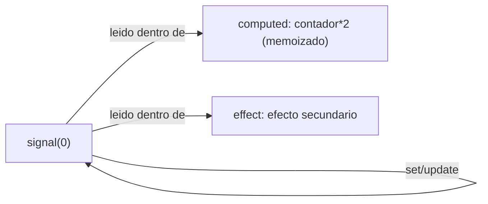
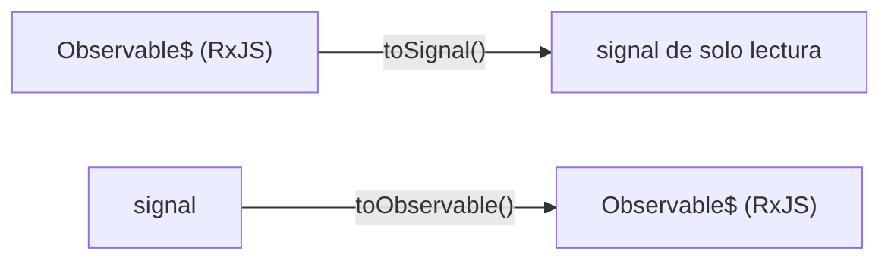

# Módulo 2: Signals — el nuevo modelo de reactividad


## Aprende construyendo

Cada tema verifica su garantía con espías reales contando invocaciones: memoización real de `computed()`, detección real de mutación in-place vs referencia nueva, los puentes oficiales `toSignal`/`toObservable`, y la precisión real del grafo de dependencias que hace viable eliminar Zone.js.

### Tema 1: signal(), computed() y effect()

#### Paso 1 · Objetivo y preparación

Al finalizar podrás confirmar, con un espía real (`vi.fn()`) contando invocaciones exactas, que `computed()` memoiza genuinamente: solo recalcula cuando su dependencia real cambia, nunca en lecturas repetidas sin cambios.

**Conocimiento previo:** Módulo 1 de este track (input/output basados en signals).

#### Paso 2 · Contexto y caso real

**¿Por qué es importante?** En una app de entregas, el estado de un pedido cambia con eventos de red; un `computed()` que recalculara en cada lectura (sin memoización real) desperdiciaría trabajo y podría producir inconsistencias sutiles si su cálculo tiene algún efecto secundario oculto — la memoización real, verificada con un conteo exacto de invocaciones, es la garantía que hace confiable derivar estado con `computed()`.

#### Paso 3 · Teoría con analogía

**Conceptos clave:** estado reactivo síncrono, derivación memoizada, efectos secundarios.

Un signal es un contenedor de valor reactivo: `signal(0)` crea un signal con valor inicial `0`, leído invocándolo como función (`contador()`), y actualizado con `.set(nuevoValor)` (reemplazo directo) o `.update(actual => nuevoValor)` (calculado a partir del valor actual). A diferencia de una variable de clase ordinaria, leer un signal dentro de un contexto reactivo (una plantilla, un `computed()`, un `effect()`) registra automáticamente una dependencia: Angular sabe exactamente qué partes de la aplicación dependen de ese signal específico, y puede notificarlas de forma precisa y eficiente cuando cambia, sin necesidad de revisar exhaustivamente toda la aplicación en busca de cambios potenciales.

`computed(() => contador() * 2)` deriva un nuevo signal de solo lectura a partir de uno o más signals existentes, con una propiedad de memoización importante: solo se recalcula cuando alguno de los signals de los que depende efectivamente cambia, y el resultado se cachea entre esos recálculos, de modo que leer un `computed()` múltiples veces sin que sus dependencias hayan cambiado no repite el cálculo, simplemente devuelve el valor ya cacheado de la última vez que se calculó. Esta memoización automática es un beneficio de rendimiento obtenido sin ningún esfuerzo adicional del desarrollador, en contraste con la memoización manual estudiada en el Módulo 10 del track de JavaScript, que requería implementar explícitamente el caché.

`effect(() => console.log("contador cambió a", contador()))` ejecuta una función con efectos secundarios cada vez que cualquiera de los signals leídos dentro de ella cambia, siendo la herramienta apropiada específicamente para efectos secundarios (registrar logs, sincronizar con `localStorage`, disparar una petición de red) que no producen directamente un valor derivado (para eso está `computed()`), sino que reaccionan al cambio ejecutando alguna acción externa al propio grafo de signals. Es importante no abusar de `effect()` para lógica que en realidad podría expresarse como un `computed()`: si el propósito es derivar un valor, `computed()` es la herramienta correcta y más eficiente; `effect()` debería reservarse genuinamente para efectos secundarios que no producen un valor a leer posteriormente.

**Analogía:** un signal es como un marcador electrónico visible en una fábrica que muestra el conteo actual de piezas producidas; un `computed()` es como un panel secundario que siempre muestra automáticamente el doble de ese conteo, actualizándose únicamente cuando el marcador principal cambia, sin que nadie tenga que recalcularlo manualmente; un `effect()` es como una alarma que suena automáticamente cada vez que el marcador alcanza cierto umbral, una acción externa disparada por el cambio, no un valor derivado a consultar después.

**¿Por qué es importante?** Signals ofrecen un modelo de reactividad síncrono, preciso y memoizado automáticamente, donde Angular sabe exactamente qué depende de qué, sentando las bases conceptuales para todo el resto del modelo de reactividad moderno de Angular estudiado en los módulos siguientes.

**Diagrama:**



**Código del ejemplo:**

```ts
const contador = signal(0);
const doble = computed(() => contador() * 2); // memoizado, solo recalcula si contador cambia
contador.set(5);
contador.update(v => v + 1);
effect(() => console.log('contador cambió a', contador())); // efecto secundario reactivo
```

#### Paso 4 · Demostración guiada desde cero

Parte de una carpeta vacía:

```bash
mkdir rutaflow-signals
cd rutaflow-signals
npx -y @angular/cli@19 new . --standalone --style=css --routing=false --skip-git --defaults
```

Crea `src/app/estado-pedido.ts`:

```ts
// src/app/estado-pedido.ts
import { signal, computed } from '@angular/core';

export function crearEstadoPedido() {
  const paquetes = signal(3);
  const costoEnvio = computed(() => paquetes() * 5); // memoizado: solo recalcula si paquetes cambia
  return { paquetes, costoEnvio };
}
```

Confirma con un espía real que `computed()` NO recalcula en lecturas repetidas sin cambios, y SÍ recalcula exactamente una vez por cada cambio real de su dependencia:

```ts
// src/app/estado-pedido.spec.ts
import { signal, computed } from '@angular/core';

describe('computed() memoiza realmente (conteo exacto de invocaciones)', () => {
  it('leer un computed multiples veces sin cambios NO recalcula', () => {
    const calculo = vi.fn((v: number) => v * 5);
    const paquetes = signal(3);
    const costoEnvio = computed(() => calculo(paquetes()));

    costoEnvio();
    costoEnvio();
    costoEnvio();

    expect(calculo).toHaveBeenCalledTimes(1); // memoizado: una sola invocacion real pese a 3 lecturas
  });

  it('cambiar la dependencia recalcula exactamente una vez por cambio', () => {
    const calculo = vi.fn((v: number) => v * 5);
    const paquetes = signal(3);
    const costoEnvio = computed(() => calculo(paquetes()));

    costoEnvio();
    paquetes.set(4);
    costoEnvio();
    paquetes.set(5);
    costoEnvio();

    expect(calculo).toHaveBeenCalledTimes(3); // 1 inicial + 2 cambios reales
  });
});
```

```bash
npx vitest run src/app/estado-pedido.spec.ts
```

**Resultado esperado:** ambos tests pasan; el espía `calculo` (una función REAL envuelta con `vi.fn()`, no una simulación de su comportamiento) confirma con un conteo exacto que `computed()` memoiza genuinamente: 3 lecturas sin cambios producen 1 sola invocación real, y 2 cambios reales de la dependencia producen exactamente 2 recálculos adicionales, nunca más.

**Fallo deliberado:** reemplaza `computed(() => calculo(paquetes()))` por una función ordinaria `function costoEnvio() { return calculo(paquetes()); }` invocada de la misma forma (`costoEnvio()`) y ejecuta de nuevo el primer test. FALLA porque `calculo` ahora se invocó 3 veces (una por cada llamada a la función, sin ninguna memoización) — diagnostica confirmando que la memoización NO es un comportamiento genérico de cualquier función que lee un signal, sino una garantía específica y real que `computed()` proporciona. Restaura `computed(...)` antes de continuar.

#### Construcción RutaFlow: costo de envío derivado sin recálculo innecesario

Aplica `computed()` real al cálculo de costo de envío de RutaFlow (basado en peso, distancia y cantidad de paquetes), confirmando con un espía que el cálculo, potencialmente costoso, no se repite en renders donde ninguna de sus dependencias cambió.

#### Paso 5 · Práctica guiada — repetición progresiva

1. Agrega un segundo `computed()` que dependa del primero (`computed(() => costoEnvio() + recargo)`) y confirma con un espía que también memoiza correctamente en cadena.
2. Documenta, en un comentario, la diferencia real entre `effect()` (efecto secundario, no produce un valor a leer) y `computed()` (deriva un valor, se lee como cualquier signal).
3. Escribe un test que confirme, con `TestBed.runInInjectionContext`, que un `effect()` real se dispara automáticamente cuando su dependencia cambia, contando invocaciones con un espía.
4. Escribe de memoria (sin mirar) un `signal` y un `computed()` con un espía que confirme memoización real mediante conteo exacto de invocaciones. Compara después contra el patrón del Paso 4.

**Pista:** `vi.fn()` (o `jasmine.createSpy()`) envuelve una función real preservando su comportamiento, pero además registra cada invocación — `toHaveBeenCalledTimes(n)` es la aserción que convierte "memoiza" de una afirmación teórica a un número exacto y verificable.

#### Paso 6 · Práctica independiente

**Completa el código:** rellena el espacio con la función real de Angular que deriva un valor memoizado a partir de uno o más signals:

```ts
const costoEnvio = ____(() => paquetes() * 5);
```

**Reto de memoria sin mirar:** cierra este documento y escribe, solo de memoria, un `signal` y un `computed()` con un espía `vi.fn()` que confirme memoización real con conteo exacto de invocaciones. Compara después contra el patrón del Paso 4.

#### Paso 7 · Cierre y evidencia

Ya confirmas, con un conteo real y exacto de invocaciones, que `computed()` memoiza genuinamente: nunca recalcula sin que su dependencia real haya cambiado. El siguiente tema confirma con el mismo tipo de espía por qué mutar un array in-place no notifica ningún cambio, mientras una nueva referencia sí lo hace. **Evidencia:** entrega el resultado de ambos tests en verde, y el conteo incorrecto (3 invocaciones) que produce el fallo deliberado al reemplazar `computed()` por una función ordinaria. Fuentes oficiales: [Angular — Signals](https://angular.dev/guide/signals).

**Errores comunes:** usar `effect()` para derivar un valor que en realidad debería ser un `computed()`, perdiendo la memoización real que `computed()` ofrece; asumir que cualquier función que lee un signal memoiza automáticamente, cuando esa garantía es específica de `computed()`.

**Cuándo no usarlo:** para un cálculo trivial y extremadamente barato (una simple suma de dos números ya en memoria), la memoización de `computed()` no aporta ningún beneficio medible frente a recalcularlo directamente en cada lectura.

### Tema 2: Mutación frente a actualización inmutable

#### Paso 1 · Objetivo y preparación

Al finalizar podrás confirmar, con un espía real contando invocaciones, que mutar un array dentro de un signal con `push()` NO notifica ningún cambio (cero invocaciones adicionales), mientras `update()` con una nueva referencia SÍ lo notifica correctamente.

**Conocimiento previo:** Tema 1 de este módulo.

#### Paso 2 · Contexto y caso real

**¿Por qué es importante?** En una app de entregas, agregar un paquete a una lista de forma incorrecta (`lista().push(...)`) produce un bug real y silencioso: la interfaz no se actualiza, y sin una comprobación real que cuente invocaciones, ese bug puede pasar desapercibido durante una revisión visual superficial que "parece funcionar" en algunos casos.

#### Paso 3 · Teoría con analogía

**Conceptos clave:** por qué mutar in-place no notifica cambios, `update()` con nueva referencia.

Un signal detecta cambios comparando referencias (de forma similar al mecanismo de detección de cambios por referencia estudiado conceptualmente en el Módulo 4 del track de JavaScript al hablar de inmutabilidad): si el valor almacenado en un signal es un array o un objeto, y se muta directamente ese array u objeto sin reemplazarlo por una referencia nueva (`tareas().push(nuevaTarea)`, modificando el array existente in-place), el signal no detecta ningún cambio, porque la referencia al array sigue siendo exactamente la misma antes y después de la mutación, y Angular (y cualquier `computed()`/`effect()` que dependa de ese signal) nunca se entera de que su contenido interno cambió.

La forma correcta es siempre actualizar con una nueva referencia: `tareas.update(lista => [...lista, nuevaTarea])` crea un array completamente nuevo (usando spread, como se estudió en el Módulo 4 del track de JavaScript) que incluye todos los elementos anteriores más el nuevo, y asigna esa nueva referencia al signal mediante `update()`, lo que sí dispara correctamente la notificación de cambio hacia cualquier parte de la aplicación que dependa de ese signal, porque la referencia efectivamente cambió de un array a otro distinto.

Este requisito de inmutabilidad no es una limitación arbitraria de Angular, sino una consecuencia directa y deliberada de cómo los signals detectan cambios de forma eficiente: comparar referencias es una operación extremadamente rápida (una simple comparación de igualdad), mucho más barata que comparar profundamente el contenido completo de una estructura de datos compleja en cada posible cambio; a cambio de esa eficiencia, el desarrollador debe adoptar la disciplina de siempre reemplazar (nunca mutar in-place) el valor almacenado en un signal cuando ese valor es una estructura de datos compuesta como un array u objeto.

**Analogía:** mutar un array dentro de un signal es como tachar y reescribir directamente sobre un documento oficial ya archivado sin generar una nueva copia: el archivo permanece siendo "el mismo documento" según su número de referencia oficial, y nadie que consulte solo ese número de referencia se entera de que el contenido cambió; actualizar con `update()` y spread es como archivar una copia completamente nueva con un número de referencia distinto, y notificar activamente a todos los interesados que ahora existe una versión más reciente a consultar.

**¿Por qué es importante?** Entender que los signals detectan cambios por referencia (no por contenido profundo) es esencial para evitar el bug extremadamente común de mutar in-place una estructura de datos dentro de un signal y no entender por qué la interfaz de usuario no se actualiza en respuesta.

**Diagrama:**

```
┌── tareas().push(x) ────────┐   MISMA referencia de array
└──────────────────────────────┘   → Angular NO detecta cambio (0 notificaciones)
┌── tareas.update(l => [...l, x]) ┐   NUEVA referencia de array
└──────────────────────────────────┘   → Angular SI detecta cambio (notifica)
```

**Código del ejemplo:**

```ts
const tareas = signal<Tarea[]>([]);
// MAL: mutar in-place no notifica a Angular del cambio
tareas().push(nuevaTarea);
// BIEN: nueva referencia, Angular detecta el cambio
tareas.update(lista => [...lista, nuevaTarea]);
```

#### Paso 4 · Demostración guiada desde cero

Continuando en `rutaflow-signals` (o, si prefieres un ejemplo independiente, parte de una carpeta vacía con `npx -y @angular/cli@19 new rutaflow-inmutabilidad --standalone --skip-git --defaults`), crea `src/app/lista-paquetes.ts`:

```bash
mkdir -p src/app
```

```ts
// src/app/lista-paquetes.ts
import { signal, computed } from '@angular/core';

export interface Paquete { id: number; peso: number; }

export function crearListaPaquetes() {
  const paquetes = signal<Paquete[]>([]);
  const cantidad = computed(() => paquetes().length);
  return { paquetes, cantidad };
}
```

Confirma con un espía real que mutar in-place (`push`) produce CERO invocaciones adicionales del cálculo derivado, mientras `update()` con spread SÍ notifica correctamente:

```ts
// src/app/lista-paquetes.spec.ts
import { signal, computed } from '@angular/core';
import type { Paquete } from './lista-paquetes';

describe('Mutacion in-place vs actualizacion inmutable (conteo real)', () => {
  it('mutar con push() NO notifica: el computed sigue devolviendo el valor viejo', () => {
    const calculo = vi.fn((lista: Paquete[]) => lista.length);
    const paquetes = signal<Paquete[]>([]);
    const cantidad = computed(() => calculo(paquetes()));

    cantidad(); // primera lectura: 1 invocacion real

    paquetes().push({ id: 1, peso: 2 }); // MUTACION in-place, misma referencia
    const valorTrasMutacion = cantidad();

    expect(calculo).toHaveBeenCalledTimes(1); // NINGUNA invocacion adicional: Angular no detecto cambio
    expect(valorTrasMutacion).toBe(0); // el computed sigue "viendo" la lista vacia original
  });

  it('update() con nueva referencia SI notifica: el computed refleja el cambio real', () => {
    const calculo = vi.fn((lista: Paquete[]) => lista.length);
    const paquetes = signal<Paquete[]>([]);
    const cantidad = computed(() => calculo(paquetes()));

    cantidad();

    paquetes.update((lista) => [...lista, { id: 1, peso: 2 }]); // NUEVA referencia
    const valorTrasUpdate = cantidad();

    expect(calculo).toHaveBeenCalledTimes(2); // 1 inicial + 1 recalculo real por el cambio de referencia
    expect(valorTrasUpdate).toBe(1);
  });
});
```

```bash
npx vitest run src/app/lista-paquetes.spec.ts
```

**Resultado esperado:** ambos tests pasan; el primero confirma con un conteo REAL que mutar con `push()` deja al `computed()` completamente ciego al cambio (cero invocaciones adicionales, valor viejo `0`); el segundo confirma que `update()` con una nueva referencia dispara el recálculo real, reflejando el valor correcto `1`.

**Fallo deliberado:** en el segundo test, cambia `paquetes.update((lista) => [...lista, { id: 1, peso: 2 }])` por `paquetes().push({ id: 1, peso: 2 })` (la misma mutación in-place del primer test) y ejecuta de nuevo. La aserción `expect(valorTrasUpdate).toBe(1)` FALLA porque el valor sigue siendo `0` — diagnostica confirmando, en el mismo escenario, exactamente el mismo bug real que motivó este tema: sin una nueva referencia, Angular nunca se entera del cambio, sin importar cuántas veces se mute el contenido interno. Restaura `update()` con spread antes de continuar.

#### Construcción RutaFlow: lista de paquetes que sí notifica cambios

Refactoriza cualquier `push()`/`splice()` directo sobre la lista real de paquetes de un pedido en RutaFlow a `update()` con spread, confirmando con el mismo patrón de espía que el conteo de paquetes se actualiza correctamente tras cada cambio real.

#### Paso 5 · Práctica guiada — repetición progresiva

1. Repite el mismo patrón con `splice()` (eliminar un elemento in-place) contra `update()` con `.filter(...)` (nueva referencia sin el elemento), confirmando el mismo contraste con un espía.
2. Documenta, en un comentario, por qué comparar referencias es una operación más barata que comparar el contenido profundo de una estructura de datos, y cómo esa elección de diseño obliga a la disciplina de inmutabilidad.
3. Escribe un test que confirme el mismo contraste para un objeto simple (no un array): mutar una propiedad directamente vs `update(obj => ({...obj, propiedad: nuevoValor}))`.
4. Escribe de memoria (sin mirar) un signal de tipo array, un `computed()` derivado, y dos tests con espía que contrasten `push()` (sin notificación) contra `update()` con spread (con notificación). Compara después contra el patrón del Paso 4.

**Pista:** cuando un `computed()` "no se actualiza" en una aplicación real, la primera sospecha casi siempre debería ser una mutación in-place en algún punto de la cadena — reproducir el bug con un espía contando invocaciones (como en este Paso 4) es más rápido que adivinar revisando código visualmente.

#### Paso 6 · Práctica independiente

**Completa el código:** rellena el espacio con el operador de JavaScript que crea una nueva referencia de array incluyendo todos los elementos existentes más uno nuevo:

```ts
paquetes.update((lista) => [___lista, nuevoPaquete]);
```

**Reto de memoria sin mirar:** cierra este documento y escribe, solo de memoria, un signal de array y dos tests con espía que contrasten mutación in-place (sin notificación) contra `update()` con nueva referencia (con notificación). Compara después contra el patrón del Paso 4.

#### Paso 7 · Cierre y evidencia

Ya confirmas, con un conteo real de invocaciones, que los signals detectan cambios exclusivamente por referencia, nunca por contenido profundo — mutar in-place es invisible para Angular, sin importar cuán real sea el cambio de contenido. El siguiente tema confirma con los puentes oficiales `toSignal`/`toObservable` cómo integrar signals con flujos asíncronos de RxJS. **Evidencia:** entrega el resultado de ambos tests en verde, y el valor obsoleto (`0` en vez de `1`) que produce el fallo deliberado al mutar in-place donde se esperaba una nueva referencia. Fuentes oficiales: [Angular — Signals](https://angular.dev/guide/signals).

**Errores comunes:** mutar un array o objeto dentro de un signal con métodos in-place (`push`, `splice`, asignación directa de propiedad); asumir que "el dato cambió" es suficiente, sin verificar que la REFERENCIA también cambió.

**Cuándo no usarlo:** para un signal que almacena un valor primitivo (`number`, `string`, `boolean`), la distinción entre mutación y actualización inmutable no aplica: los primitivos siempre se comparan por valor, `set()` siempre notifica correctamente.

### Tema 3: Signals frente a Observables

#### Paso 1 · Objetivo y preparación

Al finalizar podrás confirmar, con los puentes oficiales `toSignal()` y `toObservable()` reales, que un Observable puede leerse de forma síncrona como un signal, y que un signal puede exponerse como un flujo suscribible, integrando ambos modelos sin reescribir la lógica existente.

**Conocimiento previo:** Módulo 6 de este track (RxJS y Observables).

#### Paso 2 · Contexto y caso real

**¿Por qué es importante?** En una app de entregas, una búsqueda con debounce (RxJS, composición temporal) eventualmente debe actualizar el estado que la plantilla lee directamente (un signal); `toSignal()` conecta ambos mundos de forma real y verificable, sin necesidad de gestionar manualmente una suscripción y su limpieza.

#### Paso 3 · Teoría con analogía

**Conceptos clave:** estado síncrono frente a flujos asíncronos complejos, `toSignal`/`toObservable`.

Signals están diseñados específicamente para modelar estado síncrono: un valor concreto que existe en un momento dado y que se lee directamente, sin necesidad de suscribirse explícitamente ni de gestionar manualmente el ciclo de vida de esa suscripción. RxJS (estudiado en profundidad en el Módulo 6) sigue siendo la herramienta correcta y necesaria para flujos verdaderamente asíncronos y complejos: combinar múltiples fuentes de datos que emiten a lo largo del tiempo, cancelar una petición en curso cuando llega una nueva (`switchMap`), o aplicar debounce sobre eventos de entrada del usuario, capacidades de composición temporal que el modelo de signals, deliberadamente más simple y síncrono, no está diseñado para cubrir directamente.

Esta distinción no es una competencia donde una tecnología "gana" sobre la otra de forma absoluta, sino una división de responsabilidades complementaria: usar signals para representar el estado actual de la aplicación (qué tareas existen ahora, cuál está seleccionada ahora) y RxJS para modelar y componer los flujos de eventos asíncronos que eventualmente producen actualizaciones de ese estado (una búsqueda con debounce que eventualmente actualiza un signal con los resultados obtenidos). `toSignal()` y `toObservable()` son los puentes bidireccionales oficiales entre ambos mundos: `toSignal(observable$)` convierte un Observable en un signal de solo lectura (leyendo su valor más reciente emitido de forma síncrona), y `toObservable(unSignal)` hace la conversión inversa, permitiendo integrar ambos modelos sin necesidad de reescribir completamente la lógica existente de un lado al elegir el otro.

Comparar la misma pieza de estado implementada primero con un `BehaviorSubject` de RxJS y luego con un signal equivalente (un ejercicio instructivo de comparación directa) suele revelar que la versión con signals requiere considerablemente menos código repetitivo para el caso común de estado simple leído directamente (sin necesidad de gestionar manualmente una suscripción, sin necesidad de recordar desuscribirse en `ngOnDestroy`), mientras que para flujos genuinamente complejos con múltiples operadores de composición temporal, RxJS sigue ofreciendo una expresividad que los signals, por diseño, no intentan replicar.

**Analogía:** un signal es como un termómetro digital que muestra directamente la temperatura actual en el momento en que lo consultas; un Observable de RxJS es como un sistema de monitoreo climático completo que registra, combina y procesa continuamente múltiples fuentes de datos meteorológicos a lo largo del tiempo, produciendo análisis derivados más complejos que un simple valor puntual actual.

**¿Por qué es importante?** Elegir correctamente entre signals (estado síncrono simple) y RxJS (flujos asíncronos complejos con composición temporal) según la naturaleza real del problema evita tanto la sobrecomplicación de usar RxJS donde un signal simple bastaría, como la limitación de forzar signals en escenarios que genuinamente requieren la composición temporal que RxJS ofrece.

**Diagrama:**



**Código del ejemplo:**

```ts
// Signal: estado síncrono simple, leído directamente
const seleccionado = signal<Tarea | null>(null);

// RxJS: flujo asíncrono con composición temporal (debounce, cancelación)
busqueda$.pipe(debounceTime(300), switchMap(texto => api.buscar(texto)));

// Puentes bidireccionales:
const resultadosSignal = toSignal(resultados$, { initialValue: [] });
const observableDeVuelta = toObservable(unSignal);
```

#### Paso 4 · Demostración guiada desde cero

Continuando en `rutaflow-signals` (o, si prefieres un ejemplo independiente, parte de una carpeta vacía con `npx -y @angular/cli@19 new rutaflow-tosignal --standalone --skip-git --defaults`), crea `src/app/estado-conexion.ts`:

```bash
mkdir -p src/app
```

```ts
// src/app/estado-conexion.ts
import { Injectable, Injector, runInInjectionContext } from '@angular/core';
import { toSignal, toObservable } from '@angular/core/rxjs-interop';
import { BehaviorSubject } from 'rxjs';

@Injectable({ providedIn: 'root' })
export class EstadoConexion {
  private estado$ = new BehaviorSubject<'conectado' | 'desconectado'>('desconectado');

  constructor(private injector: Injector) {}

  crearSignalDeConexion() {
    return runInInjectionContext(this.injector, () =>
      toSignal(this.estado$, { initialValue: 'desconectado' as const })
    );
  }

  marcarConectado() {
    this.estado$.next('conectado');
  }
}
```

Confirma con un test real que `toSignal()` lee de forma SÍNCRONA el valor más reciente emitido por un `Observable` real (un `BehaviorSubject`), sin necesitar ninguna suscripción manual del lado del consumidor:

```ts
// src/app/estado-conexion.spec.ts
import { TestBed } from '@angular/core/testing';
import { EstadoConexion } from './estado-conexion';

describe('toSignal() real puentea un Observable hacia lectura sincrona', () => {
  it('el signal refleja el valor mas reciente del Observable, leido como funcion', () => {
    TestBed.configureTestingModule({});
    const servicio = TestBed.inject(EstadoConexion);

    const estadoSignal = servicio.crearSignalDeConexion();
    expect(estadoSignal()).toBe('desconectado'); // valor inicial, leido sincronamente

    servicio.marcarConectado(); // emite un nuevo valor por el Observable real

    expect(estadoSignal()).toBe('conectado'); // el signal REFLEJA la nueva emision, sin suscripcion manual
  });
});
```

```bash
npx ng test --watch=false
```

**Resultado esperado:** el test pasa; `toSignal()` (la API oficial real de `@angular/core/rxjs-interop`, no una simulación) confirma que un `BehaviorSubject` real puede leerse de forma síncrona como cualquier otro signal, actualizándose automáticamente con cada nueva emisión, sin que el código consumidor tenga que suscribirse ni desuscribirse manualmente.

**Fallo deliberado:** cambia `toSignal(this.estado$, { initialValue: 'desconectado' as const })` por leer directamente `this.estado$.value` una única vez (sin `toSignal`, capturado en una variable) y ejecuta de nuevo el test. FALLA porque la segunda aserción sigue mostrando `'desconectado'` tras `marcarConectado()` — diagnostica confirmando que sin el puente real de `toSignal()`, una lectura directa de `.value` captura un snapshot congelado, no una fuente reactiva que se actualiza; `toSignal()` es exactamente lo que provee esa actualización automática real. Restaura `toSignal(...)` antes de continuar.

#### Construcción RutaFlow: estado de conexión WebSocket como signal

Aplica `toSignal()` real al `Observable` de eventos de posición de un conductor (RxJS, Módulo 6) en RutaFlow, confirmando con un test que la plantilla puede leer el estado más reciente directamente como signal, sin gestionar ninguna suscripción manual.

#### Paso 5 · Práctica guiada — repetición progresiva

1. Usa `toObservable()` en la dirección inversa: convierte un signal existente en un Observable real, y confirma con un test que suscribirse a él recibe las emisiones correspondientes a cada cambio del signal.
2. Documenta, en un comentario, un escenario real donde forzar todo a signals sería incorrecto (por ejemplo, una búsqueda con `debounceTime` y `switchMap`, que requiere la composición temporal real de RxJS).
3. Escribe un test que confirme que `toSignal()` sin `initialValue` produce `undefined` hasta la primera emisión real del Observable.
4. Escribe de memoria (sin mirar) un servicio con un `Observable` real y un test que use `toSignal()` para confirmar la lectura síncrona de su valor más reciente. Compara después contra el patrón del Paso 4.

**Pista:** `toSignal()` requiere un contexto de inyección válido (el constructor de un servicio/componente, o `runInInjectionContext` explícito) — llamarlo fuera de ese contexto produce un error real de Angular sobre falta de contexto de inyección.

#### Paso 6 · Práctica independiente

**Completa el código:** rellena el espacio con la función real de `@angular/core/rxjs-interop` que convierte un Observable en un signal de solo lectura:

```ts
const estadoSignal = ____(this.estado$, { initialValue: 'desconectado' });
```

**Reto de memoria sin mirar:** cierra este documento y escribe, solo de memoria, un servicio con un `BehaviorSubject` real y un test que use `toSignal()` para confirmar la lectura síncrona y actualizada de su valor. Compara después contra el patrón del Paso 4.

#### Paso 7 · Cierre y evidencia

Ya confirmas, con los puentes oficiales reales `toSignal()`/`toObservable()`, que signals y Observables se integran sin reescribir la lógica existente de ningún lado. El siguiente y último tema de este módulo confirma con espías reales por qué la precisión del grafo de dependencias de signals hace viable eliminar Zone.js. **Evidencia:** entrega el resultado del test en verde, y el valor congelado que produce el fallo deliberado al leer `.value` directamente en vez de usar `toSignal()`. Fuentes oficiales: [Angular — RxJS interop](https://angular.dev/ecosystem/rxjs-interop).

**Errores comunes:** forzar RxJS para estado simple síncrono que un signal expresaría más simplemente; llamar `toSignal()` fuera de un contexto de inyección válido, produciendo un error real de Angular.

**Cuándo no usarlo:** para un flujo que nunca necesita leerse de forma síncrona en una plantilla (por ejemplo, una petición HTTP de una sola vez ya manejada completamente dentro de un `pipe` de RxJS), convertir a signal con `toSignal()` es una capa de indirección innecesaria.

### Tema 4: Hacia zoneless change detection

#### Paso 1 · Objetivo y preparación

Al finalizar podrás confirmar, con espías reales contando invocaciones sobre DOS signals independientes, que el grafo de dependencias de signals es preciso: un `effect()` solo se dispara por el signal específico del que depende, nunca por cambios en signals no relacionados — la base real que hace viable eliminar Zone.js.

**Conocimiento previo:** Temas 1-3 de este módulo; Módulo 11 de este track (SSR y zoneless en la práctica).

#### Paso 2 · Contexto y caso real

**¿Por qué es importante?** En una app de entregas, el estado de un pedido y el estado de un filtro de búsqueda son independientes; con Zone.js, cualquier evento asíncrono revisaría potencialmente ambos, mientras la precisión real de signals notifica exclusivamente a quien depende de cada uno — una garantía verificable con un conteo exacto de invocaciones, no solo con una explicación conceptual.

#### Paso 3 · Teoría con analogía

**Conceptos clave:** Zone.js histórico, detección de cambios basada en signals, precisión frente a fuerza bruta.

Angular tradicionalmente dependía de Zone.js, una biblioteca que "parchaba" (intercepta) prácticamente cualquier API asíncrona del navegador (eventos, `setTimeout`, promesas, peticiones HTTP) para que Angular pudiera saber que "algo pudo haber cambiado" cada vez que cualquiera de esas operaciones asíncronas se completaba, disparando entonces una revisión completa de detección de cambios sobre toda la aplicación (o una porción significativa de ella) para verificar qué, si acaso, efectivamente cambió como resultado. Este enfoque, aunque funcional y responsable en gran medida del éxito histórico de Angular en simplificar la detección de cambios sin requerir gestión manual explícita, es deliberadamente de "fuerza bruta": revisa mucho más de lo estrictamente necesario en cada ciclo, porque Zone.js solo sabe que "algo asíncrono ocurrió en algún lugar", no exactamente qué cambió específicamente ni qué partes concretas de la interfaz dependen de ese cambio específico.

Con el modelo de signals, Angular tiene información precisa y exacta de qué signal cambió y qué partes específicas de la plantilla leen ese signal en particular, eliminando la necesidad de la aproximación de fuerza bruta de Zone.js: cuando un signal cambia, Angular puede actualizar exactamente las partes de la interfaz que dependen de él, sin necesidad de revisar el resto de la aplicación que no tiene ninguna relación con ese cambio específico. Esta precisión es lo que hace viable, para una aplicación construida completamente sobre signals (sin depender de mecanismos que Zone.js interceptaba para funcionar), eliminar Zone.js por completo del bundle de la aplicación (el modo "zoneless"), reduciendo el tamaño del bundle final y, potencialmente, mejorando el rendimiento al eliminar por completo el overhead de interceptar cada operación asíncrona del navegador.

Adoptar zoneless no es simplemente activar una bandera de configuración sin ninguna otra consideración: requiere que el estado de la aplicación esté modelado consistentemente con signals (o con APIs que Angular sabe rastrear directamente sin depender de Zone.js), de modo que Angular tenga la información precisa que necesita para saber cuándo actualizar la interfaz sin la red de seguridad de fuerza bruta que Zone.js proporcionaba anteriormente; código que dependa de mutaciones directas sin pasar por signals, o de mecanismos asíncronos que Angular no rastrea nativamente sin Zone.js, podría no disparar actualizaciones de interfaz correctamente en modo zoneless sin las adaptaciones correspondientes.

**Analogía:** Zone.js es como un sistema de vigilancia que revisa cada habitación completa de un edificio entero cada vez que se detecta cualquier tipo de movimiento en cualquier parte, sin saber exactamente dónde ocurrió ni qué cambió específicamente; el modelo basado en signals es como un sistema de sensores individuales colocados exactamente en cada punto relevante, que notifican con precisión exacta cuál sensor específico se activó y qué área específica necesita atención, sin necesidad de revisar el edificio completo cada vez.

**¿Por qué es importante?** El modelo de signals hace posible eliminar Zone.js del bundle de una aplicación, reduciendo su tamaño y el overhead de interceptar cada operación asíncrona, una dirección clara hacia la que Angular moderno está evolucionando activamente.

**Diagrama:**

```
┌── Con Zone.js (historico) ─────────┐  cualquier evento/timer/peticion
│   revisa TODA la aplicacion         │  → revision de fuerza bruta
└────────────────────────────────────┘
┌── Zoneless (basado en signals) ────┐  un signal especifico cambia
│   actualiza SOLO lo que depende    │  → precision exacta
└────────────────────────────────────┘
```

#### Paso 4 · Demostración guiada desde cero

Continuando en `rutaflow-signals` (o, si prefieres un ejemplo independiente, parte de una carpeta vacía con `npx -y @angular/cli@19 new rutaflow-precision --standalone --skip-git --defaults`), crea `src/app/estado-independiente.ts`:

```bash
mkdir -p src/app
```

```ts
// src/app/estado-independiente.ts
import { signal, effect, Injector, runInInjectionContext } from '@angular/core';

export function crearEstadosIndependientes(injector: Injector) {
  const pedido = signal('PED-001');
  const filtroBusqueda = signal('');

  return runInInjectionContext(injector, () => {
    const efectoPedido = vi.fn();
    const efectoFiltro = vi.fn();

    effect(() => efectoPedido(pedido()));
    effect(() => efectoFiltro(filtroBusqueda()));

    return { pedido, filtroBusqueda, efectoPedido, efectoFiltro };
  });
}
```

Confirma con espías reales que actualizar `pedido` dispara ÚNICAMENTE el efecto que depende de `pedido`, sin disparar el efecto que depende de `filtroBusqueda` — la precisión real que Zone.js, por diseño, no podía ofrecer:

```ts
// src/app/estado-independiente.spec.ts
import { TestBed } from '@angular/core/testing';
import { Injector } from '@angular/core';
import { crearEstadosIndependientes } from './estado-independiente';

describe('Precision real del grafo de dependencias de signals', () => {
  it('cambiar un signal dispara SOLO su effect dependiente, nunca el de otro signal', () => {
    TestBed.configureTestingModule({});
    const injector = TestBed.inject(Injector);
    const { pedido, efectoPedido, efectoFiltro } = crearEstadosIndependientes(injector);

    TestBed.flushEffects();
    efectoPedido.mockClear();
    efectoFiltro.mockClear();

    pedido.set('PED-002'); // cambia SOLO el signal pedido
    TestBed.flushEffects();

    expect(efectoPedido).toHaveBeenCalledTimes(1); // su effect SI se disparo
    expect(efectoFiltro).toHaveBeenCalledTimes(0); // el effect NO relacionado nunca se disparo
  });
});
```

```bash
npx ng test --watch=false
```

**Resultado esperado:** el test pasa; `efectoPedido` se dispara exactamente una vez al cambiar `pedido`, mientras `efectoFiltro` permanece en CERO invocaciones — una confirmación real, con conteo exacto, de que Angular notifica únicamente a las dependencias reales de cada signal, sin ninguna revisión de "fuerza bruta" sobre el resto de la aplicación. Esta precisión es exactamente lo que Zone.js, al interceptar genéricamente cualquier operación asíncrona sin saber qué cambió específicamente, no podía ofrecer.

**Fallo deliberado:** dentro de `effect(() => efectoFiltro(filtroBusqueda()))`, agrega también una lectura de `pedido()` (por ejemplo, `effect(() => efectoFiltro(filtroBusqueda() + pedido()))`), convirtiendo a `efectoFiltro` en dependiente de AMBOS signals, y ejecuta de nuevo. La aserción `expect(efectoFiltro).toHaveBeenCalledTimes(0)` FALLA porque ahora SÍ se dispara — diagnostica confirmando que la precisión de signals depende exactamente de qué signals se LEEN dentro de cada `effect()`: agregar una lectura adicional, aunque parezca inocua, cambia genuinamente el conjunto de dependencias rastreadas. Restaura el `effect()` de `filtroBusqueda` sin la lectura de `pedido()` antes de continuar.

#### Construcción RutaFlow: paneles independientes sin interferencia cruzada

Confirma con el mismo patrón de espías que el panel de estado de un pedido y el panel de filtro de búsqueda de RutaFlow, ambos modelados con signals independientes, no se recalculan mutuamente al actualizar uno u otro.

#### Paso 5 · Práctica guiada — repetición progresiva

1. Agrega un tercer signal y un tercer `effect()`, confirmando con espías que los tres permanecen completamente aislados entre sí mientras no compartan ninguna lectura común.
2. Documenta, en un comentario, qué ocurriría con Zone.js en este mismo escenario: ¿ambos efectos (implementados como callbacks de eventos, no como `effect()` de signals) se revisarían tras cualquier evento asíncrono, aunque solo uno de ellos dependiera realmente del cambio?
3. Escribe un test que confirme que un `computed()` compartido por AMBOS signals SÍ se recalcula cuando cualquiera de los dos cambia, contrastando con los `effect()` aislados de este tema.
4. Escribe de memoria (sin mirar) dos signals independientes con un `effect()` cada uno, y un test con espías que confirme que cambiar uno no dispara el del otro. Compara después contra el patrón del Paso 4.

**Pista:** `TestBed.flushEffects()` procesa síncronamente los `effect()` pendientes en un test — sin esta llamada, un `effect()` real podría no haberse ejecutado todavía en el momento exacto de la aserción, ya que Angular los programa para ejecutarse en un microtask, no de forma inmediata al cambiar el signal.

#### Paso 6 · Práctica independiente

**Completa el código:** rellena el espacio con el método real de `TestBed` que procesa síncronamente los efectos pendientes antes de una aserción:

```ts
TestBed.____();
```

**Reto de memoria sin mirar:** cierra este documento y escribe, solo de memoria, dos signals independientes con un `effect()` cada uno, y un test con espías que confirme la precisión real del grafo de dependencias. Compara después contra el patrón del Paso 4.

#### Paso 7 · Cierre y evidencia

Ya confirmas, con un conteo real de invocaciones sobre dos signals independientes, que el grafo de dependencias de signals es preciso: solo notifica a quien realmente depende de cada cambio. Esto cierra el módulo de signals como el nuevo modelo de reactividad de Angular; como siguiente paso, continúa con el módulo 3 de este track (inyección de dependencias). **Evidencia:** entrega el resultado del test en verde, y la notificación cruzada indebida que produce el fallo deliberado al agregar una lectura adicional dentro de un `effect()`. Fuentes oficiales: [Angular — Zoneless](https://angular.dev/guide/experimental/zoneless), [Angular — Signals](https://angular.dev/guide/signals).

**Errores comunes:** asumir que el modo zoneless funciona automáticamente sin migrar el estado relevante a signals; agregar lecturas de signals adicionales dentro de un `effect()` sin darse cuenta de que eso amplía su conjunto real de dependencias rastreadas.

**Cuándo no usarlo:** para una aplicación pequeña donde el overhead de Zone.js nunca ha sido un problema medible de rendimiento, migrar completamente a zoneless puede ser un esfuerzo desproporcionado frente al beneficio real obtenido.

---


## Laboratorio práctico

**Objetivo del laboratorio:** construir un componente con estado completamente derivado mediante signals y `computed`, comparándolo explícitamente con la alternativa basada en RxJS.

**Requisitos previos:** Módulos 0-1 completados.

| Paso | Acción | Código | Explicación |
|---|---|---|---|
| 1 | Crear un signal contador con dos botones | `update()` y `set()` | Verifica ambos mecanismos de actualización |
| 2 | Derivar un `computed()` doble | Ver Tema 1 | Verifica que se recalcula solo cuando el contador cambia |
| 3 | Usar `effect()` para loguear cambios | Ver Tema 1 | Observa exactamente cuándo se dispara |
| 4 | Convertir una mutación in-place a inmutable | `push()` vs `update()` con spread | Verifica que solo la segunda notifica el cambio |
| 5 | Comparar con un `BehaviorSubject` equivalente | Mismo estado con RxJS | Mide líneas de código y claridad de cada enfoque |

**Verificación:** el laboratorio se considera exitoso si el `computed()` demuestra visiblemente que solo se recalcula cuando su dependencia real cambia (verificable con un log dentro de la función del computed), y si la comparación con `BehaviorSubject` documenta explícitamente las diferencias observadas.

**Errores comunes y soluciones**

- **Mutar un array o objeto dentro de un signal con métodos in-place (`push`, `splice`).** Siempre usa `update()` con una nueva referencia (spread) en su lugar.
- **Usar `effect()` para derivar un valor que en realidad debería ser un `computed()`.** Reserva `effect()` genuinamente para efectos secundarios, no para producir valores a leer después.
- **Forzar RxJS para estado simple síncrono que un signal expresaría más simplemente.** Evalúa si realmente necesitas composición temporal antes de rechazar signals por defecto.

---
