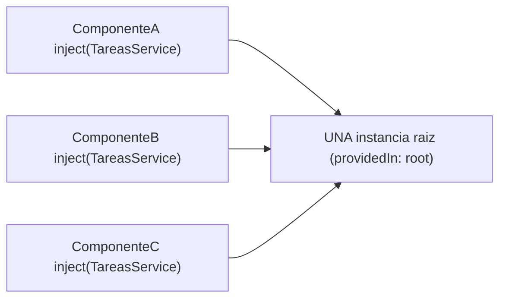
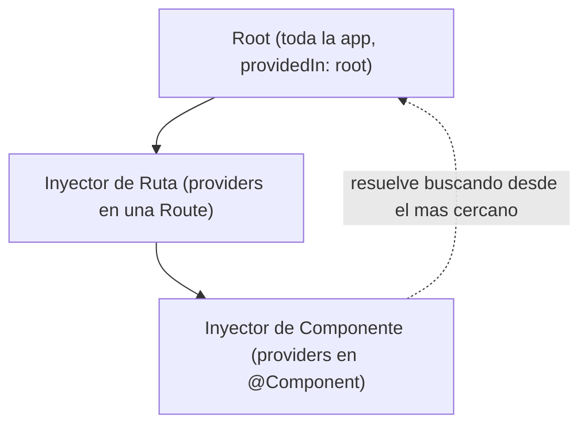
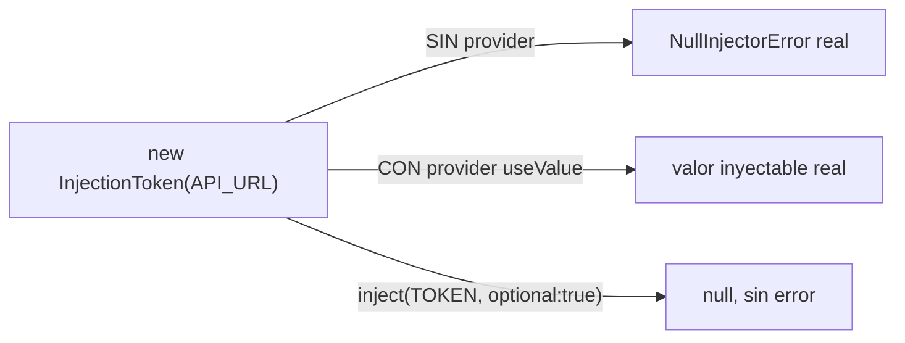

# Módulo 3: Servicios e inyección de dependencias


## Aprende construyendo

Cada tema verifica su garantía con comparaciones reales de identidad de objeto (`toBe`) y errores genuinos de Angular: el singleton real de `providedIn: 'root'`, el error real `NG0203` al usar `inject()` fuera de contexto, la jerarquía real de inyectores con overrides a nivel de componente, y `NullInjectorError` real al faltar un `InjectionToken`.

### Tema 1: @Injectable y providedIn: root

#### Paso 1 · Objetivo y preparación

Al finalizar podrás confirmar, con una comparación real de identidad de objeto (`toBe`), que `providedIn: 'root'` garantiza una única instancia singleton compartida entre cualquier número de componentes que inyecten el mismo servicio.

**Conocimiento previo:** Módulo 1 de este track (componentes); Módulo 2 (signals).

#### Paso 2 · Contexto y caso real

**¿Por qué es importante?** En una app de entregas, un componente necesita un servicio de entregas cuya instancia sea REALMENTE la misma que consumen otros componentes, para que el estado compartido (signals internos del servicio) se mantenga consistente entre todos ellos, no duplicado silenciosamente.

#### Paso 3 · Teoría con analogía

**Conceptos clave:** servicio singleton de aplicación, registro automático.

#### Qué significa `@` aquí: decoradores y metadatos de Angular

`@Injectable(...)` no es una llamada que se ejecute cada vez que se crea el servicio. Es un **decorador de clase**: adjunta metadatos a `TareasService` para que las herramientas de Angular sepan cómo incluirlo en el sistema de inyección. El compilador de Angular procesa esos metadatos durante la compilación y genera las definiciones que el inyector utilizará en ejecución. El objeto `{ providedIn: "root" }` es configuración del decorador; `root` indica en qué inyector debe registrarse la fábrica del servicio.

La misma sintaxis aparece en `@Component`, pero el consumidor y el contrato son distintos: allí Angular lee selector, plantilla, estilos, imports y providers para generar una definición de componente. Por eso no basta con memorizar «`@` crea algo»: hay que leer el nombre del decorador, sobre qué declaración está colocado y qué opciones admite. TypeScript valida la sintaxis; Angular interpreta el significado específico.

**Límite y diagnóstico:** decorar una clase no convierte cualquier método en inyectable ni permite llamar `inject()` desde cualquier función. `inject()` necesita un contexto de inyección activo; fuera de él Angular produce `NG0203`. Tampoco conviene registrar en `root` un estado que deba reiniciarse por ruta: en ese caso se usa un proveedor de ruta o componente y se acepta deliberadamente una instancia de menor alcance.

`@Injectable({providedIn: "root"})` es la forma estándar y recomendada de declarar un servicio en Angular moderno: registra automáticamente el servicio en el inyector raíz de la aplicación, garantizando que exista una única instancia compartida (un singleton) durante toda la vida de la aplicación, sin necesidad de declararlo explícitamente en ningún array de `providers` en ningún lugar adicional del código. Cualquier componente o servicio que inyecte ese mismo servicio recibirá exactamente la misma instancia, permitiendo compartir estado (típicamente modelado con signals, como en el `TareasService` con un signal de tareas compartido) entre cualquier número de componentes de la aplicación sin necesidad de pasar ese estado manualmente a través de inputs y outputs entre componentes intermedios que no lo necesitan directamente para sí mismos.

Esta forma de registro (`providedIn: "root"`) tiene una ventaja adicional de tree-shaking (recordando el concepto estudiado en el Módulo 7 del track de JavaScript): si un servicio registrado de esta forma nunca se inyecta realmente en ninguna parte de la aplicación, el bundler puede eliminarlo completamente del bundle final, algo que no sería posible con la forma anterior de registro explícito en un array `providers` de un módulo, que forzaba la inclusión del servicio en el bundle independientemente de si efectivamente se usaba o no en cualquier parte del código.

Un servicio con `providedIn: "root"` es el patrón por defecto y correcto para la gran mayoría de servicios de una aplicación: estado compartido de la aplicación, clientes HTTP hacia una API específica, servicios de utilidad usados ampliamente. Solo se necesita un patrón de registro distinto (Tema 3) cuando se requiere deliberadamente una instancia distinta del servicio para un subconjunto específico de la aplicación (por ejemplo, un servicio de estado que debería reiniciarse en cada navegación hacia una ruta específica, en vez de persistir durante toda la sesión de la aplicación).

**Analogía:** un servicio con `providedIn: "root"` es como el departamento central de recursos humanos de una empresa completa: existe una única instancia compartida por toda la organización, y cualquier departamento que necesite consultarlo accede exactamente al mismo departamento central, sin que cada departamento individual necesite mantener su propia copia independiente y potencialmente desincronizada de esa misma información.

**¿Por qué es importante?** `providedIn: "root"` es la forma estándar de registrar un servicio como singleton de aplicación con beneficios de tree-shaking, y es el patrón correcto por defecto para la gran mayoría de servicios que comparten estado o lógica entre múltiples partes de una aplicación.

**Código del ejemplo:**

```ts
@Injectable({ providedIn: 'root' }) // singleton de toda la app, tree-shakeable
export class TareasService {
  private tareas = signal<Tarea[]>([]);
  readonly lista = this.tareas.asReadonly();
  agregar(tarea: Tarea) { this.tareas.update(l => [...l, tarea]); }
}
```

**Diagrama:**



#### Paso 4 · Demostración guiada desde cero

Parte de una carpeta vacía:

```bash
mkdir demo-di
cd demo-di
npx -y @angular/cli@19 new . --standalone --style=css --routing=false --skip-git --defaults
```

Crea `src/app/tareas.service.ts`:

```ts
// src/app/tareas.service.ts
import { Injectable, signal } from '@angular/core';

@Injectable({ providedIn: 'root' })
export class TareasService {
  private tareas = signal<string[]>([]);
  readonly lista = this.tareas.asReadonly();
  agregar(titulo: string) {
    this.tareas.update((l) => [...l, titulo]);
  }
}
```

Confirma con una comparación real de identidad de objeto que DOS componentes distintos inyectando `TareasService` reciben la MISMA instancia:

```ts
// src/app/tareas.service.spec.ts
import { TestBed } from '@angular/core/testing';
import { Component, inject } from '@angular/core';
import { TareasService } from './tareas.service';

@Component({ selector: 'app-a', standalone: true, template: `` })
class ComponenteA {
  servicio = inject(TareasService);
}

@Component({ selector: 'app-b', standalone: true, template: `` })
class ComponenteB {
  servicio = inject(TareasService);
}

describe('providedIn: root garantiza un singleton real', () => {
  it('dos componentes distintos reciben la MISMA instancia del servicio', () => {
    TestBed.configureTestingModule({ imports: [ComponenteA, ComponenteB] });

    const fixtureA = TestBed.createComponent(ComponenteA);
    const fixtureB = TestBed.createComponent(ComponenteB);

    expect(fixtureA.componentInstance.servicio).toBe(fixtureB.componentInstance.servicio);
  });

  it('un cambio desde un componente es visible desde el otro, sin sincronizacion manual', () => {
    TestBed.configureTestingModule({ imports: [ComponenteA, ComponenteB] });

    const fixtureA = TestBed.createComponent(ComponenteA);
    const fixtureB = TestBed.createComponent(ComponenteB);

    fixtureA.componentInstance.servicio.agregar('PED-001');

    expect(fixtureB.componentInstance.servicio.lista()).toEqual(['PED-001']);
  });
});
```

```bash
npx ng test --watch=false
```

**Resultado esperado:** ambos tests pasan; `toBe(...)` confirma identidad de REFERENCIA real (el mismo objeto en memoria) entre las dos inyecciones, y el segundo test confirma que un cambio hecho desde `ComponenteA` es visible inmediatamente desde `ComponenteB` — la garantía concreta y verificable que `providedIn: 'root'` ofrece.

**Fallo deliberado:** agrega `providers: [TareasService]` al decorador `@Component` de `ComponenteB` (registrando una instancia local además de la raíz) y ejecuta de nuevo el primer test. FALLA porque `toBe(...)` ahora es falso — diagnostica confirmando que un provider a nivel de componente "gana" sobre el registro raíz para ESE componente específico, rompiendo la garantía de singleton que se asumía global. Restaura `ComponenteB` sin `providers` propios antes de continuar.

#### Paso 5 · Práctica guiada — repetición progresiva

1. Agrega un tercer componente y confirma con `toBe(...)` que también recibe la misma instancia singleton.
2. Documenta, en un comentario, por qué `providedIn: 'root'` permite tree-shaking (eliminar el servicio del bundle si nunca se inyecta), a diferencia del registro explícito antiguo en `providers` de un `NgModule`.
3. Escribe un test que confirme que un servicio SIN `providedIn` (registrado únicamente en `providers` de un componente específico) SÍ produce instancias distintas entre dos componentes hermanos que no comparten ese ancestro.
4. Escribe de memoria (sin mirar) un servicio con `providedIn: 'root'` y dos componentes con un test `toBe(...)` que confirme su identidad compartida. Compara después contra el patrón del Paso 4.

**Pista:** `toBe(...)` compara identidad de referencia (el mismo objeto), mientras `toEqual(...)` solo compara igualdad estructural de contenido — para confirmar que dos inyecciones son literalmente la MISMA instancia, `toBe(...)` es la aserción correcta.

#### Paso 6 · Práctica independiente

**Completa el código:** rellena el espacio con el valor de configuración de `@Injectable` que garantiza una única instancia compartida en toda la aplicación:

```ts
@Injectable({ providedIn: '____' })
export class TareasService { /* ... */ }
```

**Reto de memoria sin mirar:** cierra este documento y escribe, solo de memoria, un servicio con `providedIn: 'root'` y dos componentes con un test `toBe(...)` que confirme su identidad compartida. Compara después contra el patrón del Paso 4.

#### Paso 7 · Cierre y evidencia

Ya confirmas, con una comparación real de identidad de objeto, que `providedIn: 'root'` garantiza un singleton real compartido entre cualquier número de componentes. El siguiente tema confirma con el error real `NG0203` por qué `inject()` requiere un contexto de inyección válido, a diferencia de la inyección por constructor. **Evidencia:** entrega el resultado de ambos tests en verde, y la ruptura de identidad que produce el fallo deliberado al registrar un provider local. Fuentes oficiales: [Angular — Dependency injection](https://angular.dev/guide/di), [Angular — Providers](https://angular.dev/guide/di/dependency-injection-providers).

**Errores comunes:** asumir que cualquier servicio decorado con `@Injectable` es automáticamente un singleton, sin verificar que `providedIn: 'root'` esté realmente presente; registrar accidentalmente el mismo servicio también en `providers` de un componente, creando una instancia local inesperada que rompe la identidad compartida.

**Cuándo no usarlo:** para un servicio que genuinamente necesita una instancia distinta por componente o por ruta (Tema 3), `providedIn: 'root'` es la configuración incorrecta; usa un registro explícito en `providers` al nivel apropiado.

### Tema 2: inject() frente a inyección por constructor

#### Paso 1 · Objetivo y preparación

Al finalizar podrás confirmar, con el error real `NG0203` de Angular, que `inject()` requiere un contexto de inyección activo, mientras la inyección por constructor está limitada exclusivamente a clases con constructor — la razón real por la que `inject()` es la única opción viable en guards e interceptores funcionales.

**Conocimiento previo:** Tema 1 de este módulo; Módulo 4 de este track (routing y guards).

#### Paso 2 · Contexto y caso real

**¿Por qué es importante?** En una app de entregas, un guard funcional (una simple función, sin clase ni constructor) necesita inyectar `AuthService`; `inject()` es la única forma real de lograrlo, y llamarlo fuera de un contexto válido produce un error real y específico, no un comportamiento silencioso.

#### Paso 3 · Teoría con analogía

**Conceptos clave:** función de inyección moderna, contexto de inyección, `NG0203`.

`inject()`, invocada dentro del cuerpo de la clase de un componente o servicio (típicamente asignada directamente a una propiedad de clase: `private servicio = inject(TareasService);`), es la forma moderna y recomendada de obtener una instancia inyectada, reemplazando la inyección tradicional por parámetros del constructor (`constructor(private servicio: TareasService) {}`). Ambas formas producen exactamente el mismo resultado funcional (la misma instancia inyectada, según la misma jerarquía de inyectores del Tema 3), pero `inject()` ofrece ventajas prácticas de ergonomía: permite inyectar dependencias en cualquier punto donde exista un "contexto de inyección" válido (no solo en el constructor de una clase), incluyendo dentro de guards funcionales y interceptores funcionales (estudiados en los Módulos 4 y 7 respectivamente), que son simples funciones sin ninguna clase ni constructor donde colocar parámetros inyectados de la forma tradicional.

`inject()` también simplifica la herencia de clases: una clase base que necesita ciertas dependencias inyectadas ya no requiere que cada clase hija que la extienda declare y repase manualmente esos mismos parámetros en su propio constructor únicamente para pasarlos a `super()`, un patrón considerablemente más verboso con inyección por constructor tradicional. Con `inject()`, la clase base simplemente invoca `inject()` directamente donde lo necesita, sin ninguna necesidad de que las clases hijas se preocupen por replicar esa configuración de constructor.

La elección entre ambas formas, para el caso común de inyectar dependencias directamente en un componente o servicio normal (no en guards o interceptores funcionales, donde `inject()` es la única opción viable), es en gran medida una cuestión de estilo del equipo, aunque la tendencia clara del ecosistema Angular moderno favorece `inject()` de forma consistente, en parte precisamente porque es la única forma viable en los contextos funcionales que Angular moderno favorece cada vez más (guards, interceptores, resolvers funcionales).

**Analogía:** la inyección por constructor es como recibir todas tus herramientas de trabajo exclusivamente en el momento formal de tu contratación, empaquetadas todas juntas en un único punto de entrada; `inject()` es como poder solicitar cada herramienta específica exactamente en el momento y lugar donde la necesitas dentro de tu jornada laboral, sin estar limitado a recibirlas todas únicamente en ese único momento inicial formal.

**¿Por qué es importante?** `inject()` es más flexible que la inyección por constructor, siendo la única opción viable en contextos funcionales modernos (guards, interceptores) y simplificando la herencia de clases, razones por las que el ecosistema Angular moderno la favorece consistentemente.

**Diagrama:**

```
┌── constructor(private s: Servicio) ┐  SOLO dentro de una clase con constructor
└──────────────────────────────────────┘  siempre tiene contexto valido (Angular lo provee)
┌── inject(Servicio) ─────────────────┐  funciona en constructor, campo de clase,
└──────────────────────────────────────┘  guard funcional... pero fuera de eso: NG0203
```

**Código del ejemplo:**

```ts
@Component({ /* ... */ })
export class ListaTareas {
  private servicio = inject(TareasService); // más conciso, funciona en cualquier contexto de inyección
  tareas = this.servicio.lista;
}
```

#### Paso 4 · Demostración guiada desde cero

Continuando en `demo-di` (o, si prefieres un ejemplo independiente, parte de una carpeta vacía con `npx -y @angular/cli@19 new demo-inject --standalone --skip-git --defaults`), confirma con un test real el error `NG0203` al invocar `inject()` fuera de un contexto de inyección válido:

```bash
mkdir -p src/app
```

Crea `src/app/inject-fuera-de-contexto.ts`:

```ts
// src/app/inject-fuera-de-contexto.ts
import { inject } from '@angular/core';
import { TareasService } from './tareas.service';

// funcion ORDINARIA, sin contexto de inyeccion: NO es un guard, NO es un constructor
export function obtenerServicioFueraDeContexto() {
  return inject(TareasService);
}
```

```ts
// src/app/inject-fuera-de-contexto.spec.ts
import { obtenerServicioFueraDeContexto } from './inject-fuera-de-contexto';

describe('inject() fuera de contexto de inyeccion', () => {
  it('lanza el error real NG0203 al invocarse sin contexto valido', () => {
    expect(() => obtenerServicioFueraDeContexto()).toThrowError(/NG0203|injection context/i);
  });
});
```

```bash
npx ng test --watch=false
```

**Resultado esperado:** el test pasa; Angular lanza REALMENTE el error `NG0203` al invocar `inject()` desde una función ordinaria ejecutada fuera de cualquier contexto de inyección válido (no dentro de un constructor, inicialización de campo, guard funcional, o `runInInjectionContext`) — el error genuino y específico que justifica por qué `inject()` no puede llamarse "desde cualquier lugar", solo desde contextos donde Angular sabe resolver dependencias.

**Fallo deliberado:** envuelve la llamada dentro de `runInInjectionContext(TestBed.inject(Injector), () => obtenerServicioFueraDeContexto())` (proveyendo un contexto de inyección válido explícitamente) y ejecuta de nuevo. El test ahora FALLA porque `.toThrowError(...)` esperaba un error que ya no ocurre — diagnostica confirmando que `runInInjectionContext` es exactamente el mecanismo real que resuelve el error `NG0203`, proveyendo el contexto que `inject()` necesita. Revierte a la llamada sin contexto para dejar el ejemplo en su estado de fallo deliberado documentado.

#### Paso 5 · Práctica guiada — repetición progresiva

1. Escribe un guard funcional real (`CanActivateFn`) que use `inject()` y confirma con `TestBed.runInInjectionContext` que funciona correctamente dentro de ese contexto válido.
2. Documenta, en un comentario, por qué la inyección por constructor NUNCA produce `NG0203`: un constructor de clase siempre se ejecuta dentro de un contexto de inyección válido proporcionado por Angular al crear la instancia.
3. Escribe un test que confirme que `inject()` funciona correctamente dentro de la inicialización de un campo de clase (`private servicio = inject(TareasService);`), sin necesitar `runInInjectionContext` en ese caso.
4. Escribe de memoria (sin mirar) una función que invoque `inject()` fuera de contexto, y un test que confirme el error real `NG0203`. Compara después contra el patrón del Paso 4.

**Pista:** el mensaje real de `NG0203` incluye la frase "injection context" — reconocerla en una consola real confirma inmediatamente que el problema es la ausencia de un contexto válido, no un servicio mal registrado (que produciría en cambio un `NullInjectorError` distinto).

#### Paso 6 · Práctica independiente

**Completa el código:** rellena el espacio con la función real de Angular que provee explícitamente un contexto de inyección válido para ejecutar código que usa `inject()`:

```ts
____(injector, () => inject(TareasService));
```

**Reto de memoria sin mirar:** cierra este documento y escribe, solo de memoria, una función que invoque `inject()` fuera de contexto y un test que confirme el error real `NG0203`. Compara después contra el patrón del Paso 4.

#### Paso 7 · Cierre y evidencia

Ya confirmas, con el error real `NG0203`, que `inject()` requiere un contexto de inyección activo, mientras la inyección por constructor lo obtiene automáticamente de Angular. El siguiente tema confirma con overrides reales de provider por nivel cómo la jerarquía de inyectores resuelve dependencias. **Evidencia:** entrega el resultado del test en verde, y el error real `NG0203` que produce el fallo deliberado al invocar `inject()` sin contexto. Fuentes oficiales: [Angular — Dependency injection](https://angular.dev/guide/di), [Angular — inject()](https://angular.dev/guide/di/dependency-injection#injecting-services).

**Errores comunes:** invocar `inject()` dentro de un callback asíncrono (como un `setTimeout` o un `.then()`) sin capturar la dependencia antes, produciendo `NG0203` porque ese callback ya no ejecuta dentro del contexto de inyección original; confundir `NG0203` (falta contexto) con `NullInjectorError` (falta provider), dos errores reales pero distintos.

**Cuándo no usarlo:** para un componente o servicio tradicional sin necesidad de reutilizar lógica en contextos funcionales, la elección entre `inject()` e inyección por constructor es principalmente de estilo; ninguna es "incorrecta" en ese caso.

### Tema 3: Jerarquía de inyectores

#### Paso 1 · Objetivo y preparación

Al finalizar podrás confirmar, con una comparación real de identidad de objeto, que un provider registrado a nivel de componente produce una instancia DISTINTA de la instancia raíz, verificando en código la regla real de resolución jerárquica: el nivel más cercano al punto de inyección gana.

**Conocimiento previo:** Temas 1-2 de este módulo.

#### Paso 2 · Contexto y caso real

**¿Por qué es importante?** En una app de entregas, un componente que necesita un contador de intentos que se reinicie en cada instancia (no compartido globalmente) debe registrar su propio provider local; confirmar con una comparación real de identidad que esa instancia es efectivamente DISTINTA de la raíz previene la sorpresa de un estado inesperadamente compartido o inesperadamente aislado.

#### Paso 3 · Teoría con analogía

**Conceptos clave:** inyector raíz, inyector de ruta, inyector de componente, resolución jerárquica.

Angular organiza los inyectores en una jerarquía de tres niveles principales: el inyector raíz (root), compartido por toda la aplicación; inyectores a nivel de ruta (cuando una `Route` específica declara su propio array `providers`); e inyectores a nivel de componente (cuando un `@Component` específico declara su propio array `providers`). Cuando un componente o servicio solicita una dependencia mediante `inject()`, Angular busca esa dependencia comenzando por el inyector más cercano al punto de solicitud, subiendo progresivamente por la jerarquía hasta encontrar un proveedor registrado, o hasta llegar al inyector raíz sin encontrarlo (lo que produce un error si la dependencia era obligatoria).

Un servicio provisto únicamente en el inyector raíz (`providedIn: "root"`, Tema 1) es un único singleton verdadero para toda la aplicación completa; el mismo servicio provisto en cambio en el array `providers` de una `Route` específica crea una instancia nueva e independiente cada vez que se navega hacia esa ruta (y esa instancia se destruye al navegar fuera de ella), un patrón útil deliberadamente para estado que debería reiniciarse limpio en cada visita a esa ruta específica, en vez de persistir acumulando estado de visitas anteriores. Un servicio provisto en el array `providers` de un `@Component` específico crea una instancia nueva por cada instancia de ese componente en la aplicación (si el componente se renderiza múltiples veces simultáneamente, cada una tiene su propia instancia independiente del servicio).

Si el mismo servicio se provee simultáneamente en múltiples niveles de la jerarquía (por ejemplo, en `root` y también en un componente específico), el nivel más cercano al punto de solicitud "gana": un componente que provee su propia instancia de un servicio, aunque ese mismo servicio también esté registrado globalmente en `root`, recibirá su propia instancia local específica de ese componente, no la instancia global compartida, precisamente porque Angular resuelve la dependencia comenzando desde el inyector más cercano antes de subir hacia niveles superiores de la jerarquía.

**Analogía:** la jerarquía de inyectores es como una cadena de mando organizacional: una solicitud de recursos se dirige primero al supervisor directo más cercano (inyector de componente); si ese supervisor no puede resolverla, se escala al gerente de departamento (inyector de ruta); y si tampoco puede, finalmente a la dirección general de toda la organización (inyector raíz). Si el supervisor directo ya tiene autoridad para resolver la solicitud por sí mismo, la resuelve ahí mismo sin necesidad de escalarla más arriba en la jerarquía.

**¿Por qué es importante?** Entender la jerarquía de inyectores explica por qué un servicio provisto a nivel de ruta o componente produce instancias independientes en vez del singleton global esperado, un comportamiento que sorprende a quien no conoce esta jerarquía y espera siempre una única instancia compartida.

**Diagrama:**



#### Paso 4 · Demostración guiada desde cero

Continuando en `demo-di` (o, si prefieres un ejemplo independiente, parte de una carpeta vacía con `npx -y @angular/cli@19 new demo-jerarquia --standalone --skip-git --defaults`), crea `src/app/contador-intentos.service.ts`:

```bash
mkdir -p src/app
```

```ts
// src/app/contador-intentos.service.ts
import { Injectable, signal } from '@angular/core';

@Injectable({ providedIn: 'root' })
export class ContadorIntentosService {
  private intentos = signal(0);
  readonly valor = this.intentos.asReadonly();
  incrementar() { this.intentos.update((v) => v + 1); }
}
```

Confirma con una comparación real de identidad que un componente con provider LOCAL recibe una instancia DISTINTA de la instancia raíz, mientras un componente sin provider local sigue recibiendo la raíz compartida:

```ts
// src/app/contador-intentos.spec.ts
import { TestBed } from '@angular/core/testing';
import { Component, inject } from '@angular/core';
import { ContadorIntentosService } from './contador-intentos.service';

@Component({ selector: 'app-sin-override', standalone: true, template: `` })
class ComponenteSinOverride {
  contador = inject(ContadorIntentosService);
}

@Component({
  selector: 'app-con-override',
  standalone: true,
  providers: [ContadorIntentosService], // override LOCAL: gana sobre la raiz
  template: ``,
})
class ComponenteConOverride {
  contador = inject(ContadorIntentosService);
}

describe('Jerarquia real de inyectores: el mas cercano gana', () => {
  it('un componente SIN provider local recibe la instancia raiz compartida', () => {
    TestBed.configureTestingModule({ imports: [ComponenteSinOverride] });
    const raiz = TestBed.inject(ContadorIntentosService);
    const fixture = TestBed.createComponent(ComponenteSinOverride);

    expect(fixture.componentInstance.contador).toBe(raiz);
  });

  it('un componente CON provider local recibe una instancia DISTINTA de la raiz', () => {
    TestBed.configureTestingModule({ imports: [ComponenteConOverride] });
    const raiz = TestBed.inject(ContadorIntentosService);
    const fixture = TestBed.createComponent(ComponenteConOverride);

    expect(fixture.componentInstance.contador).not.toBe(raiz);
  });
});
```

```bash
npx ng test --watch=false
```

**Resultado esperado:** ambos tests pasan; el primero confirma con `toBe(...)` que sin ningún override local, la resolución sube hasta la raíz y comparte la instancia global; el segundo confirma con `not.toBe(...)` que un `providers: [ContadorIntentosService]` local crea REALMENTE una instancia distinta, ganando sobre el registro raíz — la regla exacta de resolución jerárquica, verificada en código, no solo descrita.

**Fallo deliberado:** quita `providers: [ContadorIntentosService]` del decorador de `ComponenteConOverride` (dejándolo sin override local) y ejecuta de nuevo el segundo test. FALLA porque `not.toBe(...)` ahora es falso — diagnostica confirmando que sin un registro explícito en ese nivel, Angular sube automáticamente hasta encontrar el primer proveedor disponible (la raíz), y esa resolución no puede "saltarse" la raíz sin un override real en un nivel más cercano. Restaura el `providers` local antes de continuar.

#### Paso 5 · Práctica guiada — repetición progresiva

1. Agrega un tercer componente sin override y confirma con `toBe(...)` que también comparte la instancia raíz junto con el primero.
2. Documenta, en un comentario, un escenario real donde un override a nivel de RUTA (no de componente) sería más apropiado: estado que debe reiniciarse en cada navegación hacia esa ruta específica.
3. Escribe un test que confirme que DOS instancias distintas de `ComponenteConOverride` (creadas por separado) reciben, cada una, su PROPIA instancia local del servicio, no compartida ni siquiera entre sí.
4. Escribe de memoria (sin mirar) dos componentes (uno con override local, otro sin él) y dos tests que confirmen `toBe`/`not.toBe` contra la instancia raíz. Compara después contra el patrón del Paso 4.

**Pista:** `not.toBe(...)` es tan importante como `toBe(...)` en estos tests — confirmar que DOS objetos son DISTINTOS es la única forma real de verificar que un override local efectivamente creó una instancia nueva, en vez de asumir que "probablemente" lo hizo.

#### Paso 6 · Práctica independiente

**Completa el código:** rellena el espacio con el array del decorador `@Component` que registra un provider local, ganando sobre el registro raíz para ese componente específico:

```ts
@Component({ selector: 'app-con-override', ____: [ContadorIntentosService], template: `` })
```

**Reto de memoria sin mirar:** cierra este documento y escribe, solo de memoria, un componente con provider local y un test `not.toBe(...)` que confirme su instancia distinta de la raíz. Compara después contra el patrón del Paso 4.

#### Paso 7 · Cierre y evidencia

Ya confirmas, con comparaciones reales de identidad (`toBe`/`not.toBe`), la regla exacta de resolución jerárquica: el inyector más cercano al punto de solicitud gana. El siguiente y último tema de este módulo confirma con `NullInjectorError` real por qué un `InjectionToken` sin provider produce un fallo explícito. **Evidencia:** entrega el resultado de ambos tests en verde, y la identidad compartida inesperada que produce el fallo deliberado al quitar el provider local. Fuentes oficiales: [Angular — Hierarchical injectors](https://angular.dev/guide/di/hierarchical-dependency-injection).

**Errores comunes:** esperar una única instancia global de un servicio provisto a nivel de ruta o componente, sin considerar que ese registro local crea una instancia independiente; olvidar que un override local "gana" incluso si el mismo servicio también está registrado en `root`.

**Cuándo no usarlo:** para un servicio que debe ser genuinamente global y único en toda la aplicación (como `TareasService` en el Tema 1), registrar providers adicionales a nivel de ruta o componente introduce complejidad y riesgo de instancias no compartidas por accidente.

### Tema 4: Tokens de inyección y decoradores de resolución

#### Paso 1 · Objetivo y preparación

Al finalizar podrás confirmar, con el error real `NullInjectorError` de Angular, que un `InjectionToken` sin ningún provider registrado produce un fallo explícito al inyectarlo, y que `@Optional()` cambia genuinamente ese comportamiento a `null` en vez de un error.

**Conocimiento previo:** Temas 1-3 de este módulo.

#### Paso 2 · Contexto y caso real

**¿Por qué es importante?** En una app de entregas, una URL de API de configuración (`API_URL`) no tiene una "clase" propia que inyectar; un `InjectionToken` permite inyectarla de forma desacoplada, pero omitir su provider produce un `NullInjectorError` real e inmediato, evitando que la aplicación arranque con una configuración silenciosamente ausente.

#### Paso 3 · Teoría con analogía

Un `InjectionToken` permite inyectar valores que no son instancias de una clase (como un simple string de configuración, un objeto de configuración, o cualquier valor primitivo): `export const API_URL = new InjectionToken<string>("API_URL");` declara el token, y `{provide: API_URL, useValue: "https://api.miapp.com"}` en el array `providers` de la configuración de la aplicación (o de una ruta/componente específico) asocia un valor concreto a ese token, inyectable después con `inject(API_URL)` en cualquier punto donde se necesite ese valor de configuración, evitando hardcodear el valor directamente disperso en múltiples lugares del código, y facilitando sustituir ese valor por uno distinto en un contexto de pruebas (inyectando, por ejemplo, un valor simulado en vez del real durante tests).

`@Optional()` marca una dependencia como no obligatoria: si Angular no encuentra ningún proveedor para esa dependencia en la jerarquía completa de inyectores, inyecta `null` en vez de lanzar un error, apropiado cuando un componente o servicio puede funcionar razonablemente incluso sin esa dependencia específica disponible. `@SkipSelf()` fuerza a Angular a omitir el inyector local más cercano y buscar la dependencia empezando desde el siguiente nivel superior de la jerarquía, útil en patrones específicos donde un componente necesita explícitamente la instancia del padre en vez de la que él mismo pudiera estar proveyendo localmente. `@Self()` hace lo contrario: exige que la dependencia se resuelva exclusivamente en el inyector local del propio componente, sin subir en absoluto por la jerarquía, lanzando un error si no está disponible ahí mismo. `@Host()` limita la búsqueda hasta el componente "anfitrión" de una directiva, sin subir más allá de ese límite específico en la jerarquía de componentes.

Estos decoradores de resolución son herramientas relativamente especializadas, usadas con mayor frecuencia al escribir bibliotecas de componentes reutilizables o directivas complejas que necesitan un control preciso sobre exactamente en qué nivel de la jerarquía se resuelve una dependencia específica, más que en el código de aplicación cotidiano, donde la resolución jerárquica por defecto (sin ningún decorador adicional) es apropiada en la gran mayoría de los casos.

**Analogía:** un `InjectionToken` es como una etiqueta de identificación única para un tipo específico de recurso de configuración que no tiene una "clase" propia asociada, permitiendo registrar y solicitar ese recurso de forma inequívoca. `@SkipSelf`/`@Self`/`@Host` son como instrucciones específicas y explícitas sobre en qué nivel exacto de la cadena de mando debe resolverse una solicitud particular, en vez de seguir el protocolo jerárquico por defecto.

**¿Por qué es importante?** Los tokens de inyección personalizados permiten inyectar configuración y valores no basados en clases de forma desacoplada y testeable; los decoradores de resolución dan control preciso sobre en qué nivel exacto de la jerarquía se resuelve una dependencia, relevante especialmente al construir bibliotecas de componentes reutilizables.

**Diagrama:**



**Código del ejemplo:**

```ts
export const API_URL = new InjectionToken<string>('API_URL');
// en la configuración de la app:
providers: [{ provide: API_URL, useValue: 'https://api.miapp.com' }]
// en cualquier servicio/componente:
private apiUrl = inject(API_URL);
```

#### Paso 4 · Demostración guiada desde cero

Continuando en `demo-di` (o, si prefieres un ejemplo independiente, parte de una carpeta vacía con `npx -y @angular/cli@19 new demo-tokens --standalone --skip-git --defaults`), crea `src/app/api-url.token.ts`:

```bash
mkdir -p src/app
```

```ts
// src/app/api-url.token.ts
import { InjectionToken } from '@angular/core';

export const API_URL = new InjectionToken<string>('API_URL');
```

Confirma con un test real que inyectar `API_URL` SIN ningún provider registrado produce el error real `NullInjectorError`, y que `@Optional()` cambia genuinamente ese comportamiento a `null`:

```ts
// src/app/api-url.spec.ts
import { TestBed } from '@angular/core/testing';
import { Component, inject, Optional } from '@angular/core';
import { API_URL } from './api-url.token';

@Component({ selector: 'app-config-obligatoria', standalone: true, template: `` })
class ConfigObligatoriaComponent {
  apiUrl = inject(API_URL); // SIN @Optional: obligatorio
}

@Component({ selector: 'app-config-opcional', standalone: true, template: `` })
class ConfigOpcionalComponent {
  apiUrl = inject(API_URL, { optional: true }); // CON optional: no lanza error
}

describe('InjectionToken sin provider (NullInjectorError real)', () => {
  it('inyectar API_URL sin provider registrado lanza NullInjectorError real', () => {
    TestBed.configureTestingModule({ imports: [ConfigObligatoriaComponent] });

    expect(() => TestBed.createComponent(ConfigObligatoriaComponent)).toThrowError(/NullInjectorError|No provider for/);
  });

  it('con optional:true, la ausencia de provider resuelve a null, sin error', () => {
    TestBed.configureTestingModule({ imports: [ConfigOpcionalComponent] });

    const fixture = TestBed.createComponent(ConfigOpcionalComponent);
    expect(fixture.componentInstance.apiUrl).toBeNull();
  });
});
```

```bash
npx ng test --watch=false
```

**Resultado esperado:** ambos tests pasan; el primero confirma que Angular lanza REALMENTE `NullInjectorError` (con el nombre del token `API_URL` incluido en el mensaje) cuando no existe ningún provider registrado para ese `InjectionToken`; el segundo confirma que `{ optional: true }` (la forma funcional equivalente a `@Optional()`) cambia genuinamente ese comportamiento a `null`, sin lanzar ningún error.

**Fallo deliberado:** agrega `providers: [{ provide: API_URL, useValue: 'https://api.demo.test' }]` al `TestBed.configureTestingModule` del primer test (proveyendo el token que faltaba) y ejecuta de nuevo. El test ahora FALLA porque `.toThrowError(...)` esperaba un error que ya no ocurre — diagnostica confirmando que registrar el provider es exactamente lo que resuelve el `NullInjectorError` real, no un ajuste cosmético. Revierte a `TestBed.configureTestingModule` sin ese provider para dejar el ejemplo en su estado de fallo deliberado documentado.

#### Paso 5 · Práctica guiada — repetición progresiva

1. Agrega un segundo `InjectionToken` para una configuración distinta (por ejemplo, `MAX_REINTENTOS`) y confirma con el mismo patrón el error real sin provider y la resolución con `@Optional()`.
2. Documenta, en un comentario, la diferencia real entre `@Optional()` (permite `null`) y `@SkipSelf()` (fuerza buscar desde el siguiente nivel superior, sin cambiar si es obligatorio o no).
3. Escribe un test que confirme que un `InjectionToken` CON un `useFactory` (en vez de `useValue`) también resuelve correctamente, ejecutando la función factory al momento de la inyección.
4. Escribe de memoria (sin mirar) un `InjectionToken` sin provider, y un test que confirme el `NullInjectorError` real. Compara después contra el patrón del Paso 4.

**Pista:** el mensaje real de `NullInjectorError` incluye el nombre EXACTO del token o clase que Angular no pudo resolver — leerlo con atención (`No provider for API_URL!`) es más rápido que adivinar cuál dependencia falta entre varias posibles.

#### Paso 6 · Práctica independiente

**Completa el código:** rellena el espacio con la clase real de Angular que declara un token de inyección para valores que no son instancias de una clase:

```ts
export const API_URL = new ____<string>('API_URL');
```

**Reto de memoria sin mirar:** cierra este documento y escribe, solo de memoria, un `InjectionToken` sin provider y un test que confirme tanto el `NullInjectorError` real como su resolución con `{ optional: true }`. Compara después contra el patrón del Paso 4.

#### Paso 7 · Cierre y evidencia

Ya confirmas, con `NullInjectorError` real y su resolución real mediante `@Optional()`, que un `InjectionToken` sin provider es un fallo explícito y diagnosticable, no un valor silenciosamente ausente. Esto cierra el módulo de servicios e inyección de dependencias; como siguiente paso, continúa con el módulo 4 de este track (routing y guards). **Evidencia:** entrega el resultado de ambos tests en verde, y el mensaje real de `NullInjectorError` que produce el fallo deliberado sin el provider registrado. Fuentes oficiales: [Angular — InjectionToken](https://angular.dev/guide/di/dependency-injection-providers#using-an-injectiontoken-object).

**Errores comunes:** declarar un `InjectionToken` y olvidar registrar su provider en `app.config.ts`, descubriendo el `NullInjectorError` solo en tiempo de ejecución; usar `@Optional()` para ocultar un error de configuración real que debería ser obligatorio y explícito.

**Cuándo no usarlo:** para un valor que siempre debería tener un provider registrado en cualquier configuración razonable de la aplicación (una URL de API base, por ejemplo), marcar la dependencia como opcional con `@Optional()` puede ocultar un error de configuración real que debería fallar ruidosamente en vez de degradar silenciosamente.

---


## Laboratorio práctico

**Objetivo del laboratorio:** construir un servicio de estado compartido consumido por múltiples componentes, explorando la jerarquía de inyectores y un token de inyección personalizado.

**Requisitos previos:** Módulos 0-2 completados.

| Paso | Acción | Código | Explicación |
|---|---|---|---|
| 1 | Crear `TareasService` con `providedIn: root` | Ver Tema 1 | Un signal de tareas compartido |
| 2 | Consumir el servicio desde 3 componentes | Usa `inject()` en cada uno | Verifica que todos comparten el mismo estado |
| 3 | Proveer el mismo servicio a nivel de ruta | Ver Tema 3 | Verifica que cada navegación crea una instancia distinta |
| 4 | Crear un `InjectionToken` de configuración | Ver Tema 4 | Inyecta `API_URL` en vez de hardcodearlo |
| 5 | Documentar la jerarquía de inyectores | Diagrama propio: root → ruta → componente | Explica con tus propias palabras cómo se resuelve una dependencia |

**Verificación:** el laboratorio se considera exitoso si los tres componentes reflejan correctamente el mismo estado compartido del servicio raíz, y si el mismo servicio provisto a nivel de ruta demuestra tener una instancia claramente distinta en cada navegación (verificable, por ejemplo, comparando referencias o un identificador único generado al crear cada instancia).

**Errores comunes y soluciones**

- **Esperar una única instancia global de un servicio provisto a nivel de ruta o componente.** Recuerda que el nivel de registro determina el alcance de esa instancia específica; usa `providedIn: root` para un singleton verdadero de toda la aplicación.
- **Hardcodear valores de configuración directamente en múltiples servicios.** Usa un `InjectionToken` centralizado para esa configuración, facilitando su sustitución en pruebas.
- **Usar `inject()` fuera de un contexto de inyección válido.** `inject()` solo funciona dentro del constructor, la inicialización de campos de clase, o dentro de funciones ejecutadas explícitamente dentro de un contexto de inyección (como guards e interceptores funcionales).

---
