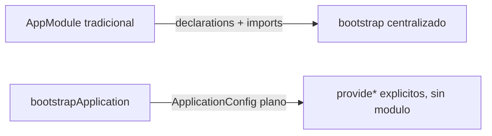
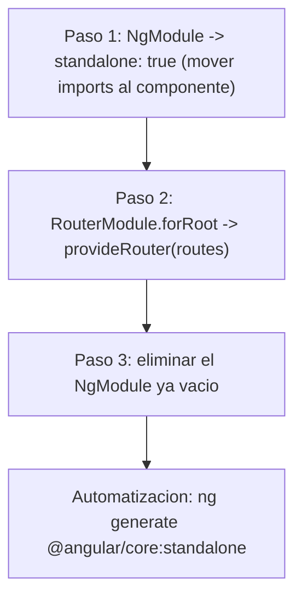

# Módulo 8: Standalone components y arquitectura sin NgModules


## Aprende construyendo

Cada tema verifica su garantía con código real: un error de DI genuino de Angular al faltar un provider, un script Node con `fs` real que audita cohesión de carpetas, y el esquema oficial `ng generate @angular/core:standalone` junto con un error real de plantilla al migrar de forma incompleta.

### Tema 1: Bootstrap sin NgModules

#### Paso 1 · Objetivo y preparación

Al finalizar podrás confirmar, con un error real de inyección de dependencias de Angular (`NullInjectorError`), que `bootstrapApplication` y `ApplicationConfig` reemplazan completamente al `AppModule`: sin ningún módulo central que "arrastre" providers implícitamente, cada provider debe declararse explícitamente o la aplicación falla al iniciar.

**Conocimiento previo:** Módulo 0 de este track (standalone components); Módulo 4 (providers e inyección de dependencias).

#### Paso 2 · Contexto y caso real

**¿Por qué es importante?** Una app de entregas que crece por funcionalidades necesita saber, sin ambigüedad, qué providers están disponibles en cada punto: sin un `AppModule` central, esa configuración vive explícitamente en `app.config.ts`, y omitir un provider ahí produce un fallo real y diagnosticable al arrancar, no un comportamiento silencioso.

#### Paso 3 · Teoría con analogía

**Conceptos clave:** `bootstrapApplication`, ausencia de `AppModule`, `ApplicationConfig`, `NullInjectorError`.

Antes de que existieran los standalone components (Módulo 0), toda aplicación Angular requería un `AppModule` raíz decorado con `@NgModule({ declarations: [...], imports: [...], bootstrap: [AppComponent] })`, que actuaba como el punto de entrada obligatorio de la aplicación, declarando explícitamente qué componentes pertenecían a ese módulo y qué otros módulos importaba. Con `bootstrapApplication(App, appConfig)` en `main.ts`, ese `AppModule` raíz desaparece por completo: el componente raíz se arranca directamente, y su configuración global (proveedores de routing, HTTP, animaciones, etc.) se declara en un objeto `ApplicationConfig` plano (típicamente en `app.config.ts`), sin ninguna clase de módulo de por medio.

`app.config.ts` centraliza el arreglo `providers` que anteriormente estaría distribuido entre el `AppModule` y potencialmente varios módulos de features (`imports: [RouterModule.forRoot(routes), HttpClientModule]`), reemplazándolo por funciones `provide*()` explícitas (`provideRouter(routes)`, `provideHttpClient()`), cada una responsable de configurar exactamente un aspecto concreto de la aplicación, en vez de un módulo monolítico que agrupaba configuración heterogénea bajo una única declaración `imports`.

Sin `AppModule`, tampoco existen `declarations` ni el concepto de "módulo de features" que agrupa componentes relacionados bajo un `NgModule` dedicado: cada componente standalone declara directamente, en su propio decorador `@Component({ imports: [...] })` (Módulo 0), exactamente qué otros componentes, directivas y pipes necesita, haciendo explícitas sus propias dependencias sin depender de qué módulo lo "envuelva" externamente.

**Analogía:** el `AppModule` tradicional era como un directorio telefónico central que había que consultar y mantener actualizado para saber qué partes de la aplicación existían y cómo se relacionaban entre sí; con standalone components, cada componente lleva consigo su propia lista de contactos directos, sin depender de un directorio centralizado externo.

**¿Por qué es importante?** Eliminar el `AppModule` y los NgModules de features simplifica el árbol de dependencias de la aplicación: cada componente declara explícitamente lo que necesita, sin capas intermedias de configuración de módulos que rastrear.

**Código del ejemplo:**

```ts
// main.ts
bootstrapApplication(App, appConfig);

// app.config.ts
export const appConfig: ApplicationConfig = {
  providers: [provideRouter(routes), provideHttpClient()],
};
// No existe AppModule, ni declarations, ni imports de módulo.
```

**Diagrama:**



#### Paso 4 · Demostración guiada desde cero

Parte de una carpeta vacía:

```bash
mkdir rutaflow-standalone
cd rutaflow-standalone
npx -y @angular/cli@19 new . --standalone --style=css --routing=false --skip-git --defaults
```

Crea `src/app/panel-entregas.component.ts`, que depende de `HttpClient` para confirmar que la inyección de dependencias real requiere el provider explícito:

```ts
// src/app/panel-entregas.component.ts
import { Component, inject } from '@angular/core';
import { HttpClient } from '@angular/common/http';

@Component({
  selector: 'app-panel-entregas',
  standalone: true,
  template: `<p>Panel de entregas listo</p>`,
})
export class PanelEntregasComponent {
  private http = inject(HttpClient); // requiere provideHttpClient() en ApplicationConfig
}
```

Confirma con un test real que, sin `provideHttpClient()` en los providers, Angular lanza un `NullInjectorError` genuino al intentar crear el componente:

```ts
// src/app/panel-entregas.component.spec.ts
import { TestBed } from '@angular/core/testing';
import { provideHttpClient } from '@angular/common/http';
import { PanelEntregasComponent } from './panel-entregas.component';

describe('PanelEntregasComponent y ApplicationConfig', () => {
  it('SIN provideHttpClient(), crear el componente lanza NullInjectorError real', () => {
    TestBed.configureTestingModule({ imports: [PanelEntregasComponent], providers: [] });

    expect(() => TestBed.createComponent(PanelEntregasComponent)).toThrowError(/NullInjectorError|No provider for HttpClient/);
  });

  it('CON provideHttpClient() explicito, el componente se crea sin errores', () => {
    TestBed.configureTestingModule({
      imports: [PanelEntregasComponent],
      providers: [provideHttpClient()],
    });

    expect(() => TestBed.createComponent(PanelEntregasComponent)).not.toThrow();
  });
});
```

```bash
npx ng test --watch=false
```

**Resultado esperado:** ambos tests pasan; el primero confirma que Angular lanza un `NullInjectorError` REAL (no simulado) cuando falta `provideHttpClient()` en los providers, exactamente el mismo tipo de error que aparecería en producción sin ese provider — sin ningún `AppModule` que "recuerde" configurarlo implícitamente. El segundo confirma que declararlo explícitamente resuelve el error.

**Fallo deliberado:** en el segundo test, quita `provideHttpClient()` de los `providers` (dejando el array vacío) y ejecuta de nuevo. La aserción `.not.toThrow()` FALLA porque ahora sí se lanza `NullInjectorError` — diagnostica confirmando que, sin `AppModule` central, Angular NUNCA "adivina" ni provee configuración implícita: cada dependencia debe declararse explícitamente en `ApplicationConfig`, o el fallo es inmediato y explícito en tiempo de creación del componente. Restaura `provideHttpClient()` antes de continuar.

#### Construcción RutaFlow: `app.config.ts` explícito para el shell

Define el `ApplicationConfig` completo de RutaFlow con `provideRouter`, `provideHttpClient` y `provideZonelessChangeDetection` (Módulo 11), confirmando con un test que cada provider es necesario probando su ausencia individual.

#### Paso 5 · Práctica guiada — repetición progresiva

1. Agrega un segundo provider (`provideAnimations` o equivalente) y escribe un test que confirme su ausencia también produce un error real y específico.
2. Documenta, en un comentario, la diferencia entre un `NullInjectorError` (falta un provider) y un error de compilación de plantilla (falta un `import` en `@Component`).
3. Escribe un test que confirme que dos componentes distintos, ambos dependientes de `HttpClient`, comparten la MISMA instancia inyectada cuando `provideHttpClient()` se declara una sola vez en `ApplicationConfig` (confirmando el alcance singleton del provider raíz).
4. Escribe de memoria (sin mirar) un componente con una dependencia inyectada y un test que confirme el `NullInjectorError` real al omitir su provider. Compara después contra el patrón del Paso 4.

**Pista:** el mensaje exacto de `NullInjectorError` incluye el nombre del token que Angular no pudo resolver (`No provider for HttpClient!`) — leer ese mensaje con atención evita adivinar qué provider falta.

#### Paso 6 · Práctica independiente

**Completa el código:** rellena el espacio con la función real que provee `HttpClient` en un `ApplicationConfig` standalone:

```ts
providers: [provideRouter(routes), ____()],
```

**Reto de memoria sin mirar:** cierra este documento y escribe, solo de memoria, un `ApplicationConfig` con dos providers y un test que confirme el `NullInjectorError` real al quitar uno de ellos. Compara después contra el patrón del Paso 4.

#### Paso 7 · Cierre y evidencia

Ya confirmas, con un `NullInjectorError` real y reproducible, que `bootstrapApplication` y `ApplicationConfig` reemplazan por completo al `AppModule`, sin proveer nada de forma implícita. El siguiente tema aplica un script Node real para auditar que la organización por feature mantiene junto lo que cambia junto. **Evidencia:** entrega el resultado de ambos tests en verde, y el mensaje exacto de `NullInjectorError` que produce el fallo deliberado. Fuentes oficiales: [Angular — Standalone components](https://angular.dev/guide/standalone-components), [Angular — Application configuration](https://angular.dev/reference/configs/application-structure).

**Errores comunes:** asumir que un provider usado en desarrollo seguirá funcionando en producción sin declararlo explícitamente; confundir un `NullInjectorError` (falta un provider) con un error de plantilla (falta un import en el componente).

**Cuándo no usarlo:** para un prototipo descartable de una sola pantalla sin llamadas HTTP ni routing, declarar `ApplicationConfig` completo con múltiples providers puede ser trabajo innecesario frente a un `bootstrapApplication` con providers mínimos.

### Tema 2: Organización por feature

#### Paso 1 · Objetivo y preparación

Al finalizar podrás auditar, con un script Node real basado en `fs` (sin simular su lógica con otro lenguaje), que una carpeta de feature mantiene junto todo lo que cambia junto: componente, servicio y rutas, en vez de dispersarlos por tipo de archivo.

**Conocimiento previo:** Tema 1 de este módulo.

#### Paso 2 · Contexto y caso real

**¿Por qué es importante?** Una app de entregas que crece por funcionalidades necesita que agregar o eliminar una feature completa sea una operación de una sola carpeta, no una búsqueda dispersa entre `components/`, `services/` y `guards/` para encontrar todo lo relacionado.

#### Paso 3 · Teoría con analogía

**Conceptos clave:** cohesión, agrupación por funcionalidad frente a agrupación por tipo.

Un enfoque común pero problemático a gran escala organiza el código por tipo de archivo (`components/`, `services/`, `pipes/`, `guards/`), lo cual dispersa todo lo relacionado con una única funcionalidad concreta (por ejemplo, "tareas") a través de múltiples carpetas distantes entre sí, obligando a saltar entre `components/tarea-lista/`, `services/tareas.service.ts` y `guards/tarea.guard.ts` para entender o modificar completamente esa funcionalidad, incluso cuando esos archivos casi siempre cambian juntos.

Organizar por feature en cambio agrupa bajo una única carpeta (`tareas/`) todos los archivos relacionados con esa funcionalidad concreta: sus componentes (`tarea-lista.ts`, `tarea-detalle.ts`), su servicio o store (`tareas.service.ts`), y sus rutas (`tareas.routes.ts`), maximizando la cohesión (Módulo 3 del track de JavaScript, principio de responsabilidad única aplicado a nivel de organización de archivos, no solo de funciones individuales): todo lo que cambia junto vive junto, y eliminar completamente una funcionalidad de la aplicación se reduce a eliminar una única carpeta, en vez de rastrear y eliminar archivos dispersos entre múltiples carpetas por tipo.

**Analogía:** organizar por tipo es como guardar todas las herramientas de un mismo material en un cajón (todos los destornilladores juntos, todos los martillos juntos), obligando a abrir varios cajones distintos para ensamblar un mueble completo; organizar por feature es como tener una caja de herramientas dedicada específicamente a ensamblar ese mueble en particular, con todo lo necesario junto en un mismo lugar.

**¿Por qué es importante?** La organización por feature mantiene junto todo lo que cambia junto, facilitando entender, modificar y eliminar una funcionalidad completa como una unidad coherente.

**Diagrama:**

```
┌── src/app/tareas/ ─────────────┐   ← todo lo relacionado con "tareas" vive junto
│  tarea-lista.ts                │
│  tarea-detalle.ts              │
│  tareas.service.ts             │
│  tareas.routes.ts              │
└─────────────────────────────────┘
┌── src/app/usuarios/ ───────────┐
│  ...                            │
└─────────────────────────────────┘
```

#### Paso 4 · Demostración guiada desde cero

Continuando en `rutaflow-standalone` (o, si prefieres un ejemplo independiente, parte de una carpeta vacía con `npx -y @angular/cli@19 new rutaflow-features --standalone --skip-git --defaults`), crea la carpeta de la feature `entregas` con sus tres archivos relacionados:

```bash
mkdir -p src/app/entregas
```

Crea `src/app/entregas/entregas.service.ts`, `src/app/entregas/entregas-lista.component.ts` y `src/app/entregas/entregas.routes.ts`:

```ts
// src/app/entregas/entregas.service.ts
import { Injectable, signal } from '@angular/core';

@Injectable({ providedIn: 'root' })
export class EntregasService {
  entregas = signal<string[]>(['PED-001', 'PED-002']);
}
```

Escribe un script Node real (usando el módulo `fs` nativo, sin simular su lógica con otro lenguaje) que audita que la carpeta de la feature contiene los tres tipos de archivo relacionados:

```ts
// scripts/verificar-cohesion.mjs
import { readdirSync } from 'node:fs';

export function auditarCohesion(rutaFeature) {
  const archivos = readdirSync(rutaFeature);
  const tieneServicio = archivos.some((f) => f.endsWith('.service.ts'));
  const tieneComponente = archivos.some((f) => f.endsWith('.component.ts'));
  const tieneRutas = archivos.some((f) => f.endsWith('.routes.ts'));
  return { tieneServicio, tieneComponente, tieneRutas, completa: tieneServicio && tieneComponente && tieneRutas };
}
```

```ts
// scripts/verificar-cohesion.spec.mjs
import { describe, it, expect } from 'vitest';
import { mkdirSync, writeFileSync, rmSync } from 'node:fs';
import { auditarCohesion } from './verificar-cohesion.mjs';

describe('auditarCohesion (fs real, sin simulacion)', () => {
  it('una carpeta con los tres archivos relacionados esta completa', () => {
    mkdirSync('tmp-entregas', { recursive: true });
    writeFileSync('tmp-entregas/entregas.service.ts', '');
    writeFileSync('tmp-entregas/entregas-lista.component.ts', '');
    writeFileSync('tmp-entregas/entregas.routes.ts', '');

    const resultado = auditarCohesion('tmp-entregas');
    expect(resultado.completa).toBe(true);

    rmSync('tmp-entregas', { recursive: true, force: true });
  });
});
```

```bash
npx vitest run scripts/verificar-cohesion.spec.mjs
```

**Resultado esperado:** el test pasa; `readdirSync` (una llamada REAL al sistema de archivos, no una simulación de su comportamiento) confirma que los tres archivos relacionados con la feature "entregas" viven juntos en la misma carpeta, la garantía estructural que la organización por feature promete.

**Fallo deliberado:** en el test, no crees `entregas.routes.ts` (comenta esa línea) y ejecuta de nuevo. La aserción `expect(resultado.completa).toBe(true)` FALLA, mostrando `tieneRutas: false` — diagnostica confirmando que el script detecta REALMENTE, mediante una lectura genuina del sistema de archivos, cuándo una feature quedó incompleta o dispersa, no solo en teoría sino de forma verificable en el filesystem real. Restaura la creación de `entregas.routes.ts` antes de continuar.

#### Construcción RutaFlow: auditoría de cohesión sobre el proyecto real

Ejecuta `auditarCohesion` contra cada carpeta real de `src/app/` en el proyecto RutaFlow, confirmando que ninguna feature quedó con archivos dispersos en carpetas globales por tipo (`components/`, `services/`).

#### Paso 5 · Práctica guiada — repetición progresiva

1. Extiende `auditarCohesion` para también verificar la presencia de un archivo `.spec.ts` por feature, y agrega un test que confirme la detección de su ausencia.
2. Documenta, en un comentario, por qué revisar la cohesión con un script automatizado (ejecutable en CI) es más confiable que una revisión manual ocasional.
3. Aplica `auditarCohesion` a una carpeta con archivos de DOS features mezclados (por ejemplo, `entregas.service.ts` y `usuarios.service.ts` en la misma carpeta) y documenta cómo extenderías el script para detectar esa mezcla específica.
4. Escribe de memoria (sin mirar) un script Node con `fs.readdirSync` que audite la presencia de archivos relacionados en una carpeta, y un test que confirme su detección de una carpeta incompleta. Compara después contra el patrón del Paso 4.

**Pista:** `readdirSync` lee el contenido REAL de una carpeta en el momento de la ejecución — a diferencia de una lista hardcodeada de archivos esperados, detecta automáticamente cambios reales en el filesystem, incluyendo archivos agregados o eliminados después de escribir el script.

#### Paso 6 · Práctica independiente

**Completa el código:** rellena el espacio con la función real de Node.js que lee el contenido de una carpeta de forma síncrona:

```ts
const archivos = ____(rutaFeature);
```

**Reto de memoria sin mirar:** cierra este documento y escribe, solo de memoria, un script Node con `fs.readdirSync` que audite cohesión de una carpeta de feature, y un test que confirme la detección de una carpeta incompleta. Compara después contra el patrón del Paso 4.

#### Paso 7 · Cierre y evidencia

Ya confirmas, con un script Node real basado en `fs`, que una carpeta de feature mantiene junto todo lo que cambia junto, y que su ausencia es detectable de forma automatizada y verificable. El siguiente tema aplica el esquema oficial de migración de Angular y un error real de plantilla para confirmar una migración incompleta. **Evidencia:** entrega el resultado del test en verde, y el resultado `tieneRutas: false` que produce el fallo deliberado. Fuentes oficiales: [Angular — Application project structure](https://angular.dev/reference/configs/application-structure).

**Errores comunes:** organizar por tipo de archivo en carpetas globales (`components/`, `services/`) para proyectos que crecen más allá de un tamaño trivial; crear features nuevas sin agrupar sus archivos relacionados desde el inicio, dejando la reorganización para "después".

**Cuándo no usarlo:** para una aplicación con solo 2-3 componentes en total, sin ninguna funcionalidad claramente separable, imponer una estructura de carpetas por feature puede ser una capa de organización innecesaria frente a una carpeta `app/` plana.

### Tema 3: Migración desde NgModules

#### Paso 1 · Objetivo y preparación

Al finalizar podrás aplicar el esquema oficial `ng generate @angular/core:standalone` y confirmar, con un error real de plantilla de Angular (`NG0304`, "is not a known element"), por qué una migración incompleta —donde un componente se convierte a standalone pero olvida declarar una dependencia en su propio `imports`— produce un fallo real y diagnosticable, no un comportamiento silencioso.

**Conocimiento previo:** Temas 1-2 de este módulo.

#### Paso 2 · Contexto y caso real

**¿Por qué es importante?** Migrar un proyecto grande de NgModules a standalone de una sola vez es arriesgado; hacerlo componente por componente, apoyado por el esquema automático del CLI, permite modernizar gradualmente sin detener el desarrollo, pero cada paso de la migración debe verificarse porque un `import` olvidado en el componente produce un error real inmediato.

#### Paso 3 · Teoría con analogía

**Conceptos clave:** conversión gradual, `ng generate @angular/core:standalone`, compatibilidad durante la transición, `NG0304`.

Migrar un proyecto existente basado en NgModules hacia standalone components es un proceso incremental, no un "big bang" que deba completarse de una sola vez: el primer paso consiste en convertir cada componente declarado en un `NgModule` a `standalone: true`, moviendo sus dependencias desde el arreglo `imports` del módulo contenedor hacia el propio decorador `@Component` de cada componente individual, un cambio que puede hacerse componente por componente mientras el resto de la aplicación sigue usando NgModules normalmente (Angular soporta la coexistencia de componentes standalone y basados en módulos durante la transición).

El segundo paso reemplaza `RouterModule.forRoot(routes)` (la configuración tradicional de routing dentro de un `NgModule`) por `provideRouter(routes)` dentro de `bootstrapApplication`, moviendo la configuración de rutas desde el sistema de módulos hacia el sistema de providers standalone (Módulo 4). El tercer paso, una vez que todos los componentes de un `NgModule` ya son standalone y ya no queda ningún `declarations` con contenido real, elimina ese `NgModule` ahora vacío por completo, dado que ya no cumple ninguna función.

El CLI de Angular incluye `ng generate @angular/core:standalone`, un esquema de migración automática (Módulo 12) que analiza el proyecto existente y aplica gran parte de estos tres pasos automáticamente, reduciendo significativamente el trabajo manual necesario para una migración completa, aunque revisar manualmente el resultado sigue siendo necesario para casos especiales que el esquema automático no cubre perfectamente.

**Analogía:** migrar de NgModules a standalone es como remodelar una casa habitada habitación por habitación en vez de demoler la casa entera y reconstruirla de cero: cada habitación (componente) se puede actualizar de forma independiente mientras el resto de la casa sigue siendo habitable y funcional durante todo el proceso.

**¿Por qué es importante?** Una migración incremental, apoyada por herramientas automáticas del CLI, permite modernizar gradualmente un proyecto grande sin necesidad de detener el desarrollo de nuevas funcionalidades durante el proceso.

**Diagrama:**



#### Paso 4 · Demostración guiada desde cero

Continuando en `rutaflow-standalone` (o, si prefieres un ejemplo independiente, parte de una carpeta vacía con `npx -y @angular/cli@19 new rutaflow-migracion --skip-git --defaults` sin `--standalone`, generando un proyecto clásico con NgModules para migrar), crea un componente declarado en un `NgModule`:

```bash
npx ng generate module legacy --routing=false
npx ng generate component legacy/tarjeta --module=legacy
```

Aplica el esquema oficial de migración automática del CLI:

```bash
npx ng generate @angular/core:standalone
```

Confirma con un test real que, tras convertir el componente a `standalone: true` PERO olvidar mover una dependencia (por ejemplo, `CommonModule` para `*ngIf`) al `imports` propio del componente, Angular lanza un error real de plantilla. Actualiza `src/app/legacy/tarjeta.component.ts`:

```ts
// src/app/legacy/tarjeta.component.ts (tras una migracion INCOMPLETA)
import { Component } from '@angular/core';

@Component({
  selector: 'app-tarjeta',
  standalone: true,
  imports: [], // migracion incompleta: falta declarar lo que el template usa
  template: `<app-badge></app-badge>`, // <app-badge> no esta declarado en imports
})
export class TarjetaComponent {}
```

```ts
// src/app/legacy/tarjeta.component.spec.ts
import { TestBed } from '@angular/core/testing';
import { TarjetaComponent } from './tarjeta.component';

describe('Migracion NgModule -> standalone', () => {
  it('una migracion incompleta (falta un import) lanza un error real de plantilla', () => {
    TestBed.configureTestingModule({ imports: [TarjetaComponent] });
    const fixture = TestBed.createComponent(TarjetaComponent);

    expect(() => fixture.detectChanges()).toThrowError(/is not a known element|NG0304/);
  });
});
```

```bash
npx ng test --watch=false
```

**Resultado esperado:** el test pasa; Angular lanza un error REAL (`NG0304`, "'app-badge' is not a known element") al intentar renderizar una plantilla que referencia un elemento no declarado en `imports` — el error genuino y específico que ocurre cuando una migración a standalone queda incompleta, no una falla silenciosa.

**Fallo deliberado:** agrega `BadgeComponent` a `imports: [BadgeComponent]` (completando correctamente la migración) y ejecuta de nuevo. El test ahora FALLA porque `.toThrowError(...)` esperaba un error que ya no ocurre — diagnostica confirmando que declarar explícitamente cada dependencia en el propio componente (el paso que el esquema automático del CLI facilita, pero no siempre completa perfectamente) es lo que resuelve el error real de plantilla. Revierte a `imports: []` para dejar el ejemplo en su estado de fallo deliberado documentado, o complétalo con el import real como corrección final.

#### Construcción RutaFlow: migración incremental de un módulo legado

Aplica `ng generate @angular/core:standalone` a un componente legado de RutaFlow declarado en un `NgModule`, confirmando con un test el error real de `NG0304` si alguna dependencia queda sin migrar, y su resolución al completar el `imports`.

#### Paso 5 · Práctica guiada — repetición progresiva

1. Repite la migración con un componente que use una `pipe` personalizada (en vez de un componente hijo) y confirma el mismo tipo de error real si la pipe no se agrega a `imports`.
2. Documenta, en un comentario, qué hace exactamente `ng generate @angular/core:standalone` de forma automática y qué debe revisarse manualmente después.
3. Escribe un test que confirme que, una vez completada la migración (todos los `imports` correctos), el `NgModule` original queda con `declarations: []` vacío, y por tanto es seguro eliminarlo.
4. Escribe de memoria (sin mirar) un componente migrado incompletamente a standalone y un test que confirme el error real `NG0304` al faltar un import. Compara después contra el patrón del Paso 4.

**Pista:** el esquema `ng generate @angular/core:standalone` automatiza gran parte del trabajo mecánico, pero SIEMPRE ejecuta los tests después de aplicarlo — el error `NG0304` es la señal más clara y rápida de una dependencia que el esquema no logró migrar automáticamente.

#### Paso 6 · Práctica independiente

**Completa el código:** rellena el espacio con el comando real del CLI de Angular que ejecuta la migración automática a standalone components:

```bash
npx ng generate @angular/core:____
```

**Reto de memoria sin mirar:** cierra este documento y escribe, solo de memoria, un componente migrado incompletamente a standalone (con un `imports` vacío que debería tener contenido) y un test que confirme el error real `NG0304`. Compara después contra el patrón del Paso 4.

#### Paso 7 · Cierre y evidencia

Ya aplicas el esquema oficial de migración y confirmas, con un error real y específico de Angular (`NG0304`), exactamente qué falla cuando una migración a standalone queda incompleta. Esto cierra el módulo de standalone components y arquitectura sin NgModules; como siguiente paso, continúa con el módulo 13 de este track. **Evidencia:** entrega el resultado del test en verde tras completar el `imports`, y el error real `NG0304` que produce el fallo deliberado con una migración incompleta. Fuentes oficiales: [Angular — Migrating to standalone](https://angular.dev/reference/migrations/standalone).

**Errores comunes:** ejecutar el esquema automático y asumir que la migración quedó completa sin correr los tests; migrar toda la aplicación de una sola vez en vez de componente por componente.

**Cuándo no usarlo:** para un proyecto ya completamente standalone desde su creación (generado con `ng new --standalone` desde el inicio), no existe ningún `NgModule` legado que migrar.

---


## Laboratorio práctico

**Objetivo del laboratorio:** migrar un componente NgModule a standalone y reorganizar el proyecto por feature.

**Requisitos previos:** Módulos 0-7 completados.

| Paso | Acción | Código | Explicación |
|---|---|---|---|
| 1 | Identificar un componente en un NgModule | — | Revisa sus dependencias declaradas en `imports` del módulo |
| 2 | Convertirlo a standalone | `standalone: true` + `imports: [...]` propios | Mueve las dependencias al propio componente |
| 3 | Reemplazar `RouterModule.forRoot` | `provideRouter(routes)` | En `bootstrapApplication` |
| 4 | Eliminar el NgModule vacío | — | Verifica que no quede nada en `declarations` |
| 5 | Reorganizar por feature | Ver Tema 2 | Agrupa componentes, servicio y rutas relacionados |

**Verificación:** el laboratorio se considera exitoso si la aplicación compila y funciona igual después de la migración, sin ningún `NgModule` de features restante, y con el código reorganizado en carpetas por feature.

**Errores comunes y soluciones**

- **Intentar migrar toda la aplicación de una sola vez.** Migra componente por componente; Angular soporta coexistencia durante la transición.
- **Olvidar mover una dependencia del módulo al componente.** Verifica en tiempo de compilación qué falta declarando explícitamente en `imports` del componente.
- **Dejar un NgModule vacío sin eliminar.** Elimínalo una vez que ya no declare ningún componente real.

---
