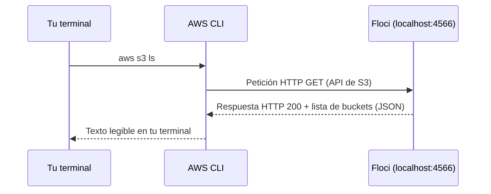
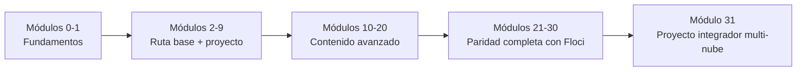
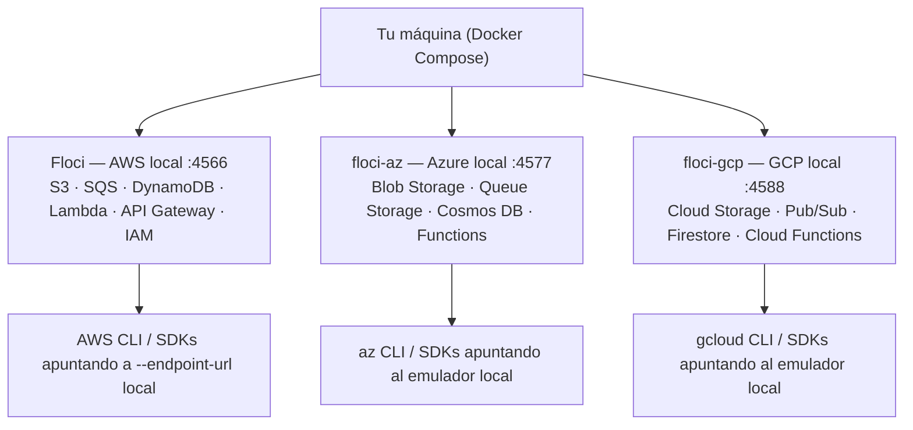

# Módulo 0: Introducción y preparación

## Sílabo

**Objetivo general**

Partir de cero absoluto —qué es una terminal, un comando, una dirección IP, un puerto— hasta comprender qué es Floci, por qué existe, qué servicios de AWS, Azure y GCP emula, y dejar el entorno de trabajo completamente instalado y verificado antes de escribir el primer comando real de nube en el Módulo 1. Si ya tienes experiencia con la terminal y conceptos básicos de redes, los Temas 1 y 2 te servirán como repaso rápido; si nunca has abierto una terminal, son el punto de partida real del curso.

**Objetivos específicos**

1. Explicar qué es una terminal, un comando y un sistema operativo, y ejecutar tus primeros comandos.
2. Explicar qué es una dirección IP, un puerto y el protocolo HTTP, y por qué son la base de cómo hablarás con Floci.
3. Explicar con tus propias palabras qué es un emulador de nube local y en qué se diferencia de una cuenta cloud real.
4. Comparar Floci con LocalStack e identificar qué resuelven ambos y dónde se diferencian.
5. Enumerar los servicios de AWS, Azure y GCP que vas a practicar a lo largo del curso.
6. Instalar y verificar Docker, AWS CLI, Python 3 y Node.js.
7. Configurar las variables de entorno necesarias para que la AWS CLI hable con Floci en vez de con AWS real.

**Contenido**

- Fundamentos absolutos: terminal, comandos y sistema operativo.
- Fundamentos de redes: direcciones IP, puertos, HTTP y APIs.
- Qué vas a aprender y cómo está estructurado el curso.
- Qué es Floci: definición, propósito y comparativa con LocalStack.
- Servicios que emula Floci: AWS, Azure y GCP.
- Ventajas y limitaciones de practicar con un emulador local.
- Metodología de estudio: teoría, laboratorio y evaluación en cada módulo.

**Evaluación**

Un laboratorio de instalación y verificación de herramientas (sin código de aplicación todavía) y cuatro ejercicios cortos: dos de reflexión sobre qué esperas de un emulador de nube local frente a una cuenta real, uno de repaso del entorno instalado, y uno que verifica que entendiste el recorrido completo de un comando hasta convertirse en una petición HTTP. No hay proyecto de código en este módulo: es la base sobre la que se apoyan los 31 módulos siguientes.

---

## Antes de comenzar: instalación guiada por sistema operativo

Este laboratorio funciona sin una cuenta AWS y sin tarjeta de crédito. Instala Git, Docker, AWS CLI, Python 3 y Node.js LTS. Usa versiones estables y reinicia la terminal después de cada instalador para que el sistema actualice el `PATH`.

| Sistema | Ruta recomendada |
|---|---|
| Windows | Docker Desktop con WSL 2, Git for Windows, AWS CLI MSI, Python desde python.org y Node.js LTS |
| macOS | Docker Desktop y `brew install awscli python node git` |
| Ubuntu/Debian | Docker Engine oficial, AWS CLI v2 oficial, `python3`, Node LTS y Git |

Verifica uno por uno antes de continuar:

```bash
docker --version
docker compose version
aws --version
python3 --version
node --version
git --version
```

Clona el repositorio, entra en su carpeta y ejecuta `docker compose up -d`. Después usa `docker compose ps`: el contenedor debe estar en estado saludable. Si un comando “no existe”, corrige su instalación antes de avanzar; si Docker no conecta con el daemon, abre Docker Desktop o inicia el servicio Docker en Linux. No configures credenciales reales de producción para este curso.

## Aprende construyendo

### Tema 1: Fundamentos absolutos — qué es una terminal, un comando y un sistema operativo

**Conceptos clave:** sistema operativo, terminal (línea de comandos), shell, comando, directorio de trabajo.

Un sistema operativo (Windows, macOS o Linux) es el programa que gestiona el hardware de tu computadora —procesador, memoria, disco— y permite que otros programas se ejecuten sobre él. Normalmente interactúas con él haciendo clic en íconos y ventanas: eso es una interfaz gráfica. Una terminal es una forma alternativa de interactuar con el sistema operativo escribiendo instrucciones de texto en vez de hacer clic. Cada instrucción que escribes se llama comando, y el programa que lee ese texto, lo interpreta y lo ejecuta se llama shell (`bash` y `zsh` en macOS/Linux, PowerShell en Windows).

Todo comando se ejecuta dentro de un directorio de trabajo —la carpeta en la que "estás parado" en ese momento—. El comando `pwd` (macOS/Linux) o `Get-Location` (PowerShell) te dice en qué directorio estás; `cd nombre-carpeta` te mueve dentro de una carpeta; `cd ..` te mueve un nivel hacia arriba. Casi todos los comandos de este curso asumen que sabes en qué directorio estás parado, porque muchos leen o crean archivos de forma relativa a esa ubicación (por ejemplo, un `docker-compose.yml` que crees en el Módulo 1).

Por qué los profesionales usan la terminal en vez de solo interfaces gráficas: un comando escrito se puede repetir exactamente igual mil veces, copiar y compartir con un compañero, guardar en un script que se ejecuta solo, y ejecutar en un servidor remoto que no tiene pantalla ni íconos —algo que una interfaz gráfica no puede ofrecer con la misma precisión y automatización—. Todo este curso, desde el primer `docker --version` hasta el último comando del proyecto final, ocurre en una terminal.

**Analogía:** una interfaz gráfica es como pedir comida señalando fotos en un menú; una terminal es como dictarle la orden exacta a la cocina en su propio idioma técnico ("dos tacos, sin cebolla, salsa aparte"). La segunda forma es más rápida y precisa una vez que aprendes el idioma, y es la única opción cuando le hablas a una cocina (un servidor remoto) que no tiene fotos que mostrarte.

**¿Por qué es importante?** Si nunca has usado una terminal, tómate 15 minutos ahora mismo para abrirla y escribir `pwd`, `cd`, y `ls` (macOS/Linux) o `dir` (Windows) antes de continuar. Ese pequeño ejercicio es más importante para tu éxito en este curso que memorizar cualquier concepto de nube: todo lo demás se construye sobre saber moverte con soltura en una terminal.

**Diagrama:**

```
Tú escribes:  docker --version
                    │
                    ▼
      El shell interpreta el texto
                    │
                    ▼
El sistema operativo ejecuta el programa "docker"
                    │
                    ▼
      El resultado se imprime en tu pantalla
```

### Tema 2: Fundamentos de redes — direcciones IP, puertos, HTTP y APIs

**Conceptos clave:** dirección IP, `localhost`, puerto, protocolo HTTP, API, modelo cliente-servidor.

Una dirección IP identifica de forma única a una computadora dentro de una red, de forma parecida a como una dirección postal identifica una casa. `localhost` (o la dirección `127.0.0.1`) es una dirección IP especial que siempre significa "esta misma computadora": cuando ejecutas `curl http://localhost:4566`, le estás hablando a un programa que corre en tu propia máquina, no a internet. Una misma computadora puede correr muchos programas que escuchan peticiones de red al mismo tiempo, así que necesita una forma de distinguir a cuál de ellos va dirigida cada petición: ese es el puerto, un número (de 0 a 65535) que funciona como el número de apartamento dentro del edificio que es tu computadora. Cuando Floci "escucha en el puerto 4566", significa que hay un programa dentro de tu máquina esperando peticiones específicamente en esa "puerta numerada".

HTTP es el protocolo —el conjunto de reglas de formato y vocabulario— que usan la mayoría de los programas para pedirse cosas entre sí a través de una red: un cliente envía una petición (`request`) especificando qué quiere (por ejemplo, "dame la lista de objetos de este bucket"), y un servidor responde con una respuesta (`response`) que incluye un código de estado (200 significa éxito, 404 significa "no encontrado", 500 significa error del servidor) y normalmente datos en un formato como JSON. Una API (interfaz de programación de aplicaciones) es, en este contexto, el conjunto específico de peticiones que un servidor entiende y sabe responder: la "API de S3" es el vocabulario específico de peticiones HTTP que entiende un servicio de almacenamiento de objetos, ya sea AWS real o Floci emulándolo.

Cuando ejecutas `aws s3 ls --endpoint-url http://localhost:4566`, en realidad está pasando esto: la AWS CLI traduce tu comando a una petición HTTP con el formato exacto que entiende la API de S3, la envía a la dirección `localhost` en el puerto `4566` (donde escucha Floci), Floci procesa esa petición como si fuera el servicio S3 real, y devuelve una respuesta HTTP que la AWS CLI vuelve a traducir a texto legible en tu terminal. Todo lo que vas a hacer en este curso —cada comando de cada módulo— es, por debajo, exactamente este mismo patrón: petición HTTP, puerto, respuesta.

**Analogía:** una dirección IP es la dirección de un edificio; un puerto es el número de apartamento dentro de ese edificio; HTTP es el idioma y la etiqueta que usas cuando tocas la puerta y pides algo ("buenas tardes, ¿podría darme...?"); una API es la lista específica de cosas que ese apartamento en particular sabe entregarte si se las pides correctamente.

**¿Por qué es importante?** Entender que un comando de AWS CLI no es magia, sino una petición HTTP a una dirección y puerto específicos, es lo que te permite diagnosticar el 90% de los errores de conexión de este curso: si un comando falla con un error de conexión, casi siempre es porque el puerto no coincide, el programa no está corriendo, o la dirección apunta al lugar equivocado — no porque el concepto de "nube" en sí sea complicado.

**Diagrama:**



### Tema 3: Qué vas a aprender y cómo está estructurado el curso

**Conceptos clave:** ruta de aprendizaje, módulo, nivel de dificultad progresivo, entregable.

El curso está organizado en 32 módulos numerados del 0 al 31, y cada uno se apoya en el anterior. La ruta base (Módulos 0-9) te lleva desde la preparación del entorno hasta un primer proyecto integrador, cubriendo Docker, S3, SQS, DynamoDB, Lambda, API Gateway, IAM y una introducción a Azure/GCP. A partir del Módulo 10, el curso continúa con contenido avanzado —Secrets Manager, mensajería Pub/Sub, observabilidad, bases de datos relacionales, contenedores gestionados, infraestructura como código, streaming, autenticación y analítica de datos (Módulos 10-20)— y después con los servicios adicionales que completan la paridad con Floci —cómputo elástico, balanceo de carga y CDN, caché, CI/CD nativo, gobierno de cuenta, FinOps y más (Módulos 21-30)—. El Módulo 31, el proyecto integrador final, no introduce un servicio nuevo: integra lo aprendido en un sistema desplegado en los tres proveedores.

Esta progresión no es arbitraria. Cada módulo nuevo reutiliza al menos un servicio de un módulo previo. El Módulo 5 (Lambda) asume que ya sabes crear una tabla en DynamoDB (Módulo 4) y subir un archivo a S3 (Módulo 2), porque una función Lambda real casi nunca vive sola: lee de una base de datos, guarda un archivo, o dispara un mensaje en una cola. Si saltas un módulo, es probable que te falte una pieza que el siguiente da por sentada.

Cada módulo comparte la misma estructura interna: primero la teoría de los conceptos nuevos, después un laboratorio práctico con comandos reales que puedes ejecutar contra Floci (con verificación automática de tu evidencia), y por último ejercicios de evaluación que comprueban si puedes aplicar lo aprendido sin que te den el comando exacto. Esta estructura imita el ritmo real de aprender una tecnología de nube en el trabajo: primero entiendes el concepto, después lo usas guiado, y finalmente lo usas solo.

El nivel de dificultad también progresa, agrupado en cuatro niveles: "Fundamentos" (Módulos 0-1), "Aplicación" (Módulos 2-4 y parte del contenido avanzado), "Integración" (módulos que combinan varios servicios, como EC2/Auto Scaling o RDS), y "Experto" (los módulos más avanzados: multi-nube, FinOps, IA, y los proyectos integradores). Esta etiqueta no mide cuánto contenido tiene el módulo, sino cuánto de lo anterior necesitas dominar para aprovecharlo.

**Analogía:** piensa en el curso como aprender a cocinar en una escuela de gastronomía con un programa extenso. No empiezas preparando un menú de cinco platos: primero aprendes a afilar un cuchillo y a manejar el fuego (Módulos 0-1), después dominas técnicas sueltas —cortar, saltear, hornear— (Módulos 2-9), luego combinas técnicas en platos más elaborados (Módulos 10-30), y al final preparas el menú completo de un restaurante real (Módulo 31) usando todo lo anterior a la vez.

**¿Por qué es importante?** Entender la estructura del curso antes de empezar evita dos errores comunes: saltarte módulos porque "ya sabes" el servicio superficialmente, o frustrarte en un módulo avanzado sin darte cuenta de que te falta una base de un módulo anterior. Saber que el curso está diseñado para acumularse te da permiso para ir despacio en los primeros módulos: el tiempo que inviertas en fundamentos, Docker y AWS CLI en este módulo lo vas a recuperar con creces en todos los que siguen.

**Diagrama:**



### Tema 4: Qué es Floci — definición, propósito y comparativa con LocalStack

**Conceptos clave:** emulador de nube, API-compatible, LocalStack, entorno local, coste cero.

Floci es un emulador de servicios de nube que corre en tu propia máquina, dentro de un contenedor Docker, y que responde a los mismos comandos y llamadas de API que usarías contra una cuenta real de AWS, Azure o GCP. Cuando ejecutas `aws s3 mb s3://mi-bucket --endpoint-url http://localhost:4566`, Floci recibe esa petición, la procesa como si fuera el servicio S3 real, y te devuelve una respuesta con el mismo formato que devolvería AWS. La única diferencia visible es el `--endpoint-url`: en vez de apuntar a los servidores de Amazon, apunta a un puerto de tu propio ordenador.

Esta idea no es nueva: Floci sigue el mismo enfoque que herramientas como LocalStack, que lleva años siendo el emulador de referencia para AWS en local. La diferencia principal entre Floci y LocalStack para este curso es que Floci empaqueta, en una sola imagen o en un pequeño conjunto de contenedores, emuladores para los tres grandes proveedores —AWS, Azure y GCP— con la misma filosofía de "mismo comando, mismo endpoint local", mientras que replicar esa cobertura multi-nube con otras herramientas normalmente implica combinar varios proyectos distintos (uno por proveedor).

Es fundamental entender qué hace Floci por dentro para no tratarlo como magia: dentro del contenedor corre una implementación que entiende el protocolo HTTP y los formatos de petición/respuesta de cada servicio (S3, SQS, DynamoDB, Lambda, API Gateway, IAM, y sus equivalentes en Azure y GCP), guarda el estado en memoria o en disco local, y expone todo por un puerto TCP. No hay facturación, no hay límites de cuenta gratuita, no hay riesgo de dejarte un recurso encendido y recibir una factura sorpresa a fin de mes.

Esto tiene una consecuencia práctica muy importante para cómo vas a trabajar en este curso: vas a usar las mismas herramientas de línea de comandos que usarías en un trabajo real —AWS CLI, `boto3` en Python, el SDK de Node.js— sin necesidad de crear una cuenta, sin tarjeta de crédito, y sin miedo a romper nada, porque todo lo que hagas vive dentro de un contenedor que puedes borrar y volver a levantar en segundos.

Además del contenedor en sí, el proyecto ofrece dos herramientas oficiales que vas a usar a lo largo del curso: `floci-cli`, una interfaz de línea de comandos (`floci start`, `floci env`, `floci doctor`) que instalarás en el Módulo 1 y que simplifica levantar, verificar y detener Floci sin recordar flags largos de `docker run`; y `floci-ui`, un panel visual para explorar tus buckets S3, tablas DynamoDB y demás recursos desde el navegador en vez de solo desde la terminal. `floci-ui` corre como un proyecto aparte (`github.com/floci-io/floci-ui`), con su propia pila de Docker Compose que incluye su propio Floci integrado — clónalo en otra carpeta y ejecuta `docker compose up` ahí (o `docker compose --profile multicloud up` para AWS, Azure y GCP a la vez) y ábrelo en `http://localhost:4500`; no forma parte del `docker-compose.yml` de este curso.

**Analogía:** Floci es como un simulador de vuelo para pilotos. Un simulador no es un avión real, pero replica fielmente la cabina, los instrumentos y las respuestas del avión ante cada acción del piloto. Un piloto que aprende en el simulador transfiere casi toda esa habilidad al avión real, porque los controles y las reacciones son los mismos; lo único que cambia es que estrellar el simulador no tiene consecuencias. Floci hace lo mismo con la nube: los comandos, las respuestas y los conceptos son los reales, pero equivocarte no cuesta dinero ni compromete una cuenta de producción.

**¿Por qué es importante?** Sin un emulador local, aprender servicios cloud reales tiene dos barreras: el coste (muchos servicios cobran por uso incluso en pruebas) y el riesgo (una mala configuración de IAM o un bucket público mal configurado en una cuenta real puede tener consecuencias serias). Floci elimina ambas barreras para la fase de aprendizaje, y como usa los mismos comandos que la nube real, todo lo que practiques aquí es transferible: el día que uses una cuenta de AWS real, cambias el endpoint y usas exactamente lo mismo que aprendiste.

**Diagrama:**

```
   Tu terminal                     Con endpoint real:            Con Floci:
┌──────────────────┐         ┌─────────────────────┐      ┌──────────────────────┐
│ aws s3 mb s3://x  │  ──▶    │ api.aws.amazon.com  │  ó   │ localhost:4566        │
│ --endpoint-url... │         │ (cuenta real, cobra) │      │ (contenedor Floci,    │
└──────────────────┘         └─────────────────────┘      │  gratis, local)       │
                                                             └──────────────────────┘
```

### Tema 5: Servicios que emula Floci — AWS, Azure y GCP

**Conceptos clave:** floci (AWS), floci-az (Azure), floci-gcp (GCP), catálogo de servicios, endpoint por proveedor.

Floci no es un único contenedor: es una familia de tres imágenes, una por proveedor de nube, pensadas para usarse de forma independiente o en conjunto según lo que necesites practicar. La imagen principal, a la que llamamos simplemente Floci, emula servicios de AWS: S3 (almacenamiento de objetos), SQS (colas de mensajes), DynamoDB (base de datos NoSQL), Lambda (funciones serverless), API Gateway (APIs HTTP) e IAM (identidad y acceso), además de los servicios avanzados que verás en módulos posteriores al proyecto final, como Secrets Manager, SNS, EventBridge, CloudWatch, RDS, ECR/ECS y otros.

La segunda imagen, floci-az, emula el equivalente en Azure de esos mismos patrones: Blob Storage en vez de S3, Queue Storage en vez de SQS, Cosmos DB en vez de DynamoDB, y Azure Functions en vez de Lambda. La tercera, floci-gcp, hace lo propio para Google Cloud: Cloud Storage, Pub/Sub, Firestore y Cloud Functions. Vas a conocer estas dos últimas en profundidad en el Módulo 8, pero es importante que sepas desde ahora que existen, porque el objetivo final del curso no es que memorices comandos de AWS, sino que entiendas patrones de nube que se repiten con nombres distintos en cada proveedor.

Cada imagen expone sus servicios en puertos distintos para que puedas tener varias corriendo a la vez sin que choquen entre sí. Floci (AWS) usa por convención el puerto 4566 para casi todos sus servicios (el mismo patrón que usa LocalStack), mientras que floci-az y floci-gcp usan sus propios rangos de puertos que verás documentados cuando llegues al Módulo 8. Por ahora, en los Módulos 1 a 7, vas a trabajar exclusivamente con la imagen de AWS.

Entender esta separación por proveedor desde el principio evita una confusión típica de quien empieza en cloud: pensar que "aprender la nube" es aprender AWS. En realidad estás aprendiendo conceptos —almacenamiento de objetos, colas, bases de datos NoSQL, cómputo sin servidor— que cada proveedor implementa con su propio nombre y su propia API, pero que comparten la misma lógica subyacente. Ese es exactamente el ejercicio que vas a hacer en el Módulo 8: el mismo caso de uso, resuelto en los tres proveedores.

**Analogía:** los tres contenedores de Floci son como tres traductores distintos que hablan idiomas distintos (AWS, Azure, GCP) pero que traducen los mismos conceptos: "guardar un archivo", "enviar un mensaje a una cola", "guardar un registro en una base de datos sin esquema fijo". Aprender los tres no es aprender tres cosas nuevas, es aprender un vocabulario nuevo para las mismas ideas que ya conoces.

**¿Por qué es importante?** Las empresas no siempre usan un solo proveedor de nube, y muchos roles de ingeniería exigen soltura con más de uno, o al menos la capacidad de entender rápido un proveedor nuevo si ya conoces otro. Empezar a distinguir "el servicio" de "el nombre que le pone el proveedor" desde el Módulo 0 te prepara mejor para ese escenario que aprender AWS de memoria sin esa perspectiva.

**Diagrama:**

```
┌─────────────┐   ┌─────────────┐   ┌─────────────┐
│    Floci     │   │  floci-az   │   │  floci-gcp  │
│    (AWS)     │   │  (Azure)    │   │   (GCP)     │
├─────────────┤   ├─────────────┤   ├─────────────┤
│ S3           │   │ Blob Storage│   │ Cloud Storage│
│ SQS          │   │ Queue Storage│  │ Pub/Sub     │
│ DynamoDB     │   │ Cosmos DB   │   │ Firestore   │
│ Lambda       │   │ Functions   │   │ Cloud Functions│
│ API Gateway  │   │             │   │             │
│ IAM          │   │             │   │             │
└─────────────┘   └─────────────┘   └─────────────┘
   Módulos 1-7          Módulo 8         Módulo 8
```

**Diagrama interactivo — arquitectura de Floci corriendo en local:**



### Tema 6: Ventajas y limitaciones de practicar con un emulador local

**Conceptos clave:** paridad de comportamiento, fidelidad parcial, límites del emulador, transferencia de conocimiento.

Ningún emulador es una copia perfecta del servicio real, y es importante que empieces el curso con expectativas correctas sobre esto. Floci reproduce con fidelidad alta el comportamiento funcional de cada servicio: la forma de los comandos, las respuestas, los códigos de error más comunes, y el flujo de trabajo típico. Eso es suficiente para aprender el 90% de lo que necesitas para usar estos servicios en el mundo real. Lo que un emulador no reproduce, y no puede reproducir, es el comportamiento a gran escala: cómo se comporta DynamoDB con mil millones de items, cómo escala Lambda ante diez mil invocaciones simultáneas, o los tiempos de latencia reales entre regiones geográficas distintas.

Tampoco reproduce, salvo excepciones, las integraciones más avanzadas o específicas de cada proveedor que dependen de infraestructura propietaria compleja —ciertas características de seguridad de nivel de red, algunos servicios de machine learning gestionado, o comportamientos de facturación—. Para el objetivo de este curso, que es que entiendas los conceptos y sepas operar cada servicio con confianza, estas limitaciones no son un obstáculo: nadie aprende a programar entendiendo primero cómo escala un sistema a nivel de datacenter.

La ventaja más grande, más allá del coste cero, es la velocidad de iteración. Levantar y destruir un bucket S3, una tabla DynamoDB o una función Lambda en Floci toma segundos. Hacerlo en una cuenta real de AWS también es rápido, pero cada error tiene un coste de contexto: si rompes algo en una cuenta compartida de un equipo real, puedes afectar a otras personas. En Floci, tu única "cuenta" es tu contenedor local: si algo sale mal, lo destruyes con `docker compose down` y lo vuelves a levantar limpio en un minuto.

La otra ventaja, menos obvia pero igual de importante, es que aprender contra un emulador te obliga a leer y entender los mensajes de error reales de cada servicio, en vez de depender de una interfaz gráfica que oculta los detalles. Vas a trabajar principalmente por línea de comandos a lo largo del curso, y eso construye una habilidad que se transfiere directamente a cualquier entorno de producción real, donde gran parte del trabajo serio se hace igual: por CLI, por API, o por infraestructura como código.

**Analogía:** un emulador de nube es como una piscina de entrenamiento para nadadores olímpicos: tiene el mismo agua, los mismos carriles, la misma resistencia física que una piscina de competición, pero no replica el ruido de miles de espectadores ni la presión de una final olímpica. Entrenar en la piscina te prepara para nadar; la experiencia de competir a gran escala se construye después, con el tiempo, no antes.

**¿Por qué es importante?** Saber qué SÍ vas a aprender bien aquí (comandos, conceptos, flujos de trabajo, errores comunes) y qué NO vas a experimentar (escala masiva, latencia de red real, facturación) te evita dos errores: subestimar lo que aprendes por pensar que "no es lo real", o sobreestimar tu preparación pensando que ya sabes operar estos servicios en producción a gran escala solo por haber terminado el curso.

**Diagrama:**

```
                    Lo que Floci SÍ te da           Lo que Floci NO te da
                 ┌────────────────────────┐      ┌────────────────────────┐
                 │ Comandos reales         │      │ Comportamiento a escala │
                 │ Flujos de trabajo reales│      │ Latencia de red real    │
                 │ Errores reales          │      │ Facturación real        │
                 │ Coste: $0               │      │ Alta disponibilidad real│
                 └────────────────────────┘      └────────────────────────┘
```

### Tema 7: Metodología de estudio — teoría, laboratorio y evaluación en cada módulo

**Conceptos clave:** ciclo teoría-práctica-evaluación, entregable verificable, autoevaluación con criterios de éxito.

Cada uno de los diez módulos de este curso sigue el mismo ciclo de tres fases. La primera fase es la teoría: para cada tema del módulo encontrarás una explicación de los conceptos, una analogía que conecta la idea con algo cotidiano, una justificación de por qué ese concepto importa en el mundo real, y una representación visual simplificada. Esta fase no tiene comandos que ejecutar: es para construir el modelo mental antes de tocar el teclado.

La segunda fase es el laboratorio práctico. Aquí cada paso especifica una acción, el comando exacto que debes ejecutar, una explicación de qué hace ese comando, y la salida esperada para que puedas comparar lo que ves en tu terminal con lo que deberías ver. El laboratorio también incluye una sección de verificación al final —una forma concreta de comprobar que el resultado es correcto— y una lista de errores comunes con sus soluciones, para que si algo falla no te quedes bloqueado.

La tercera fase son los ejercicios de evaluación. A diferencia del laboratorio, aquí no se te da el comando exacto: se te da un enunciado (una tarea a resolver), y tú decides qué comandos usar. Cada ejercicio incluye una solución esperada como referencia y una lista de criterios de éxito para que puedas autoevaluarte objetivamente, sin depender de que alguien más corrija tu trabajo. Esta fase es la que realmente demuestra si dominas el concepto: cualquiera puede copiar un comando de un laboratorio, pero resolver un ejercicio nuevo con esos mismos conceptos requiere haberlos entendido.

Al final de cada módulo hay un resumen que recoge los puntos clave, lista explícitamente los conceptos que deberías haber aprendido, sugiere próximos pasos, y enlaza recursos adicionales para quien quiera profundizar más allá del alcance del curso. Este resumen no es un simple recordatorio: úsalo como checklist antes de avanzar al siguiente módulo. Si no puedes explicar con tus propias palabras cada punto clave del resumen, vale la pena repasar el módulo antes de continuar.

**Analogía:** esta metodología es la misma que usan las escuelas de vuelo, de cirugía o de oficios técnicos: primero la clase teórica (por qué funciona así), después la práctica supervisada con instrucciones exactas (así se hace, paso a paso), y por último la evaluación sin ayuda (hazlo tú, y compruébalo tú mismo con una lista de criterios). Ningún piloto pasa directo de la teoría a volar solo sin la fase intermedia de práctica guiada.

**¿Por qué es importante?** Saber de antemano cómo está construido cada módulo te permite dosificar tu tiempo: si vas con prisa, la teoría te da el mínimo para no perderte; si tienes tiempo, el laboratorio te da práctica guiada; y los ejercicios de evaluación son innegociables si quieres saber, con evidencia real, si aprendiste algo o solo copiaste comandos.

**Diagrama:**

```
┌───────────┐      ┌─────────────┐      ┌──────────────┐      ┌──────────┐
│  Teoría    │ ──▶  │ Laboratorio  │ ──▶  │  Ejercicios   │ ──▶  │ Resumen  │
│ (entender) │      │ (paso a paso)│      │ (sin ayuda,   │      │ (checklist│
│            │      │ + verificación│     │  autoevaluado)│      │  final)  │
└───────────┘      └─────────────┘      └──────────────┘      └──────────┘
```

---

## Ruta de proyecto progresivo desde carpeta vacía

No crees un proyecto desechable por módulo. Conserva un único repositorio que evoluciona durante todo el track y etiqueta cada hito (`git tag modulo-N`). Empieza con `mkdir academia-cloud && cd academia-cloud && git init`; crea allí `compose.yaml`, `infra/`, `src/` y `tests/`. Ejecuta el comando paso a paso, inspecciona los archivos generados y registra versiones y precondiciones en el README.

| Hito | Evolución acumulativa | Evidencia antes de avanzar |
|---|---|---|
| Base | almacenamiento, eventos y serverless. | Arranque reproducible, commit limpio y prueba mínima. |
| Aplicación | datos, IaC y servicios integrados. | Casos normales, límite y error automatizados. |
| Integración | Conecta capas y reemplaza dobles por infraestructura controlada. | Diagrama, contratos y prueba de integración. |
| Experto | gobierno, multi-cloud y recuperación. | Perfil o threat model, telemetría y runbook de recuperación. |

Al iniciar cada laboratorio crea una rama `modulo-N`, implementa el incremento, verifica el criterio de éxito y fusiona solo con pruebas verdes. Si un módulo necesita un experimento aislado, colócalo en `experiments/modulo-N/`; el producto acumulativo permanece ejecutable. Al terminar, otra persona debe poder clonar el repositorio y reproducir el último hito siguiendo únicamente el README.

## Criterio transversal de calidad del código

Aplica estas decisiones en todos los ejemplos y en tu entrega:

- usa nombres que expresen intención, dominio y unidades; evita `data`, `temp`, `manager` o `process` cuando exista un término preciso;
- mantén funciones, componentes, clases, consultas y módulos cohesionados alrededor de una responsabilidad comprobable;
- haz visibles las dependencias y los efectos de red, tiempo, archivos, estado y base de datos;
- valida entradas en la frontera y representa errores con contexto, sin ocultar la causa ni registrar secretos;
- elimina duplicación de reglas, no toda repetición textual; una abstracción incorrecta cuesta más que dos líneas parecidas;
- escribe primero la solución más simple que satisface el requisito y refactoriza con pruebas verdes;
- aplica SOLID únicamente cuando exista una necesidad real de cambio, extensión, sustitución o aislamiento.

**SOLID con criterio:** responsabilidad única significa una razón coherente de cambio, no una clase por función. Abierto/cerrado justifica estrategias cuando hay variantes reales. Sustitución exige respetar contratos. Segregación evita obligar a consumidores a depender de operaciones que no usan. Inversión de dependencias protege el dominio frente a detalles externos; no exige crear interfaces para cada objeto.

**Comprobación antes de continuar:** ¿otra persona puede entender los nombres y el flujo?, ¿los casos de error son observables?, ¿una prueba demuestra la regla principal?, ¿cada abstracción aporta más claridad de la que cuesta? Registra una decisión de refactorización y una decisión consciente de *no abstraer*.

## Laboratorio práctico

**Objetivo del laboratorio:** dejar instalado y verificado todo el software que vas a necesitar desde el Módulo 1 en adelante: Docker, AWS CLI, Python 3 y Node.js, además de las variables de entorno que le indican a la AWS CLI que hable con Floci en vez de con AWS real.

**Requisitos previos:** un ordenador con Windows, macOS o Linux, con al menos 4 GB de RAM libres y conexión a internet para descargar el software. No se requiere experiencia previa con la línea de comandos, pero si nunca has abierto una terminal, dedica unos minutos a familiarizarte con abrirla y escribir comandos simples como `pwd` o `cd`.

| Paso | Acción | Comando | Explicación | Salida esperada |
|---|---|---|---|---|
| 1 | Instalar Docker | Descarga Docker Desktop (Windows/Mac) desde el sitio oficial de Docker, o Docker Engine (Linux) con el gestor de paquetes de tu distribución | Docker es el motor de contenedores que va a ejecutar Floci; sin Docker no puedes levantar ningún emulador de este curso | El instalador termina sin errores y Docker Desktop (o el daemon en Linux) queda corriendo |
| 2 | Verificar Docker | `docker --version` | Confirma que el binario de Docker está en tu PATH y responde | Una línea como `Docker version 27.x.x, build xxxxxxx` |
| 3 | Probar que Docker funciona de extremo a extremo | `docker run hello-world` | Descarga una imagen mínima de prueba y la ejecuta en un contenedor | Un mensaje de texto que empieza con "Hello from Docker!" |
| 4 | Instalar AWS CLI | Descarga el instalador de AWS CLI v2 desde la documentación oficial de AWS para tu sistema operativo | La AWS CLI es la herramienta de línea de comandos que vas a usar en casi todos los módulos para hablar con Floci | El instalador termina sin errores |
| 5 | Verificar AWS CLI | `aws --version` | Confirma que el binario está instalado y en tu PATH | Una línea como `aws-cli/2.x.x Python/3.x.x ...` |
| 6 | Instalar Python 3 | Descarga Python 3 desde python.org o usa el gestor de paquetes de tu sistema | Vas a usar Python (con la librería boto3) en varios laboratorios para hablar con Floci desde código, no solo desde la CLI | El instalador termina sin errores |
| 7 | Verificar Python | `python3 --version` | Confirma la versión instalada | Una línea como `Python 3.11.x` (cualquier versión 3.9 o superior sirve) |
| 8 | Instalar Node.js | Descarga Node.js LTS desde nodejs.org o usa un gestor de versiones como nvm | Vas a escribir funciones Lambda en Node.js en el Módulo 5 | El instalador termina sin errores |
| 9 | Verificar Node.js | `node --version` | Confirma la versión instalada | Una línea como `v20.x.x` o superior |
| 10 | Configurar variables de entorno de AWS CLI | En Linux/macOS: `export AWS_ACCESS_KEY_ID=test`<br>`export AWS_SECRET_ACCESS_KEY=test`<br>`export AWS_DEFAULT_REGION=us-east-1`<br><br>En Windows (PowerShell): `$Env:AWS_ACCESS_KEY_ID="test"`<br>`$Env:AWS_SECRET_ACCESS_KEY="test"`<br>`$Env:AWS_DEFAULT_REGION="us-east-1"` | Floci no valida credenciales reales, pero la AWS CLI exige que existan unas credenciales con formato válido antes de dejarte ejecutar cualquier comando | Los comandos se ejecutan sin mostrar ningún error |
| 11 | Confirmar que las variables quedaron activas | `echo $AWS_ACCESS_KEY_ID` (Linux/macOS) o `echo $Env:AWS_ACCESS_KEY_ID` (PowerShell) | Verifica que el valor se guardó correctamente en la sesión actual de la terminal | Se imprime `test` |

**Verificación:** al finalizar, ejecuta los cuatro comandos de versión (`docker --version`, `aws --version`, `python3 --version`, `node --version`) en una sola sesión de terminal y confirma que los cuatro responden sin error. Si los cuatro comandos devuelven una versión, el entorno está listo para el Módulo 1.

**Errores comunes y soluciones**

- **`docker: command not found` después de instalar Docker Desktop.** En macOS y Windows, cierra y vuelve a abrir la terminal después de instalar; el instalador actualiza el PATH pero las terminales ya abiertas no lo recargan automáticamente.
- **`Cannot connect to the Docker daemon` al ejecutar `docker run hello-world`.** Docker Desktop debe estar abierto y completamente iniciado (el ícono de la ballena en la barra de tareas debe indicar que está corriendo, no "starting"). En Linux, verifica que el servicio esté activo con `sudo systemctl status docker` y arráncalo con `sudo systemctl start docker` si no lo está.
- **Las variables de entorno desaparecen al cerrar la terminal.** Esto es esperado: las variables exportadas con `export` (o `$Env:` en PowerShell) solo viven en la sesión actual. Si quieres que persistan, añádelas a tu archivo de configuración de shell (`.bashrc`, `.zshrc`) o crea un perfil de AWS CLI dedicado con `aws configure --profile floci`, que verás en detalle en el Módulo 1.
- **`aws: command not found` en Windows tras instalar.** Asegúrate de haber reiniciado la terminal (o la sesión de Windows) después de la instalación; el instalador de AWS CLI v2 en Windows requiere reiniciar la consola para actualizar el PATH del sistema.

---


## Rúbrica del proyecto

Esta rúbrica evalúa el laboratorio y los ejercicios como evidencia de dominio, no la mera finalización de pasos.

| Criterio | Peso | Evidencia esperada |
|---|---:|---|
| Comprensión conceptual | 20% | Explica el mecanismo, sus límites y por qué la solución funciona. |
| Implementación funcional | 30% | El artefacto satisface requisitos normales, límite y de error. |
| Verificación | 20% | Incluye pruebas, mediciones o inspecciones reproducibles. |
| Diseño y calidad | 15% | Nombres, estructura, seguridad y mantenibilidad son deliberados. |
| Comunicación profesional | 15% | README, decisiones, comandos y resultados permiten repetir el trabajo. |

Se alcanza competencia con 70/100 y sin cero en implementación o verificación. El nivel experto exige comparar alternativas, justificar trade-offs y reconocer condiciones donde la solución dejaría de ser válida.

## Bibliografía y fundamento académico

Estas fuentes sustentan los conceptos y deben consultarse para verificar detalles que cambian entre versiones:

- AWS, Microsoft Azure y Google Cloud, marcos oficiales de arquitectura bien diseñada.
- NIST, *Cloud Computing Standards Roadmap* y *Secure Software Development Framework*.
- Beyer et al., *Site Reliability Engineering*.
- ACM/IEEE-CS/AAAI, *Computer Science Curricula 2023*.
- IEEE Computer Society, *SWEBOK Guide V4.0*.

## Resumen del módulo

**Puntos clave**

- Floci es un emulador de nube local, API-compatible con AWS, Azure y GCP, en la misma línea que herramientas como LocalStack.
- Usar Floci en vez de una cuenta real elimina el coste y el riesgo durante la fase de aprendizaje, sin sacrificar la fidelidad de los comandos y flujos de trabajo reales.
- El curso cubre AWS en los Módulos 1 a 7, y Azure/GCP en el Módulo 8, antes de integrarlo todo en el proyecto final del Módulo 9.
- Cada módulo sigue el mismo ciclo: teoría, laboratorio guiado con verificación, y ejercicios de evaluación sin ayuda.

**Conceptos aprendidos**

- Qué es un emulador de nube y cómo se diferencia de una cuenta real.
- Floci frente a LocalStack.
- El catálogo de servicios de Floci, floci-az y floci-gcp.
- Ventajas (coste, velocidad de iteración, aprendizaje de errores reales) y limitaciones (sin escala real, sin latencia de red real) de un emulador.
- La metodología de teoría → laboratorio → evaluación que vas a repetir en cada módulo.

**Próximos pasos**

En el Módulo 1 vas a profundizar en Docker —el motor que hace posible que Floci exista— antes de levantarlo por primera vez con `docker run` y verificarlo con una petición HTTP real a su endpoint de salud.

**Recursos adicionales**

- Documentación oficial de Docker: conceptos de imágenes y contenedores.
- Documentación oficial de la AWS CLI v2: instalación y configuración.
- Repositorio de LocalStack (referencia del enfoque de emulación que Floci sigue para AWS).
