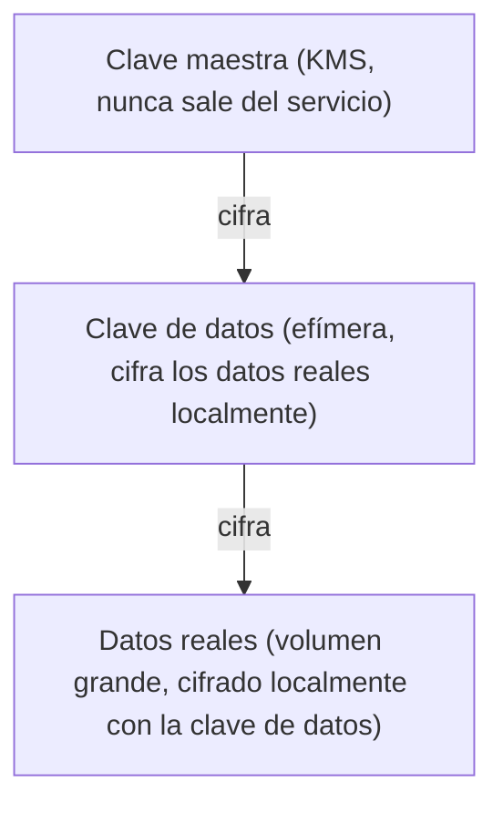
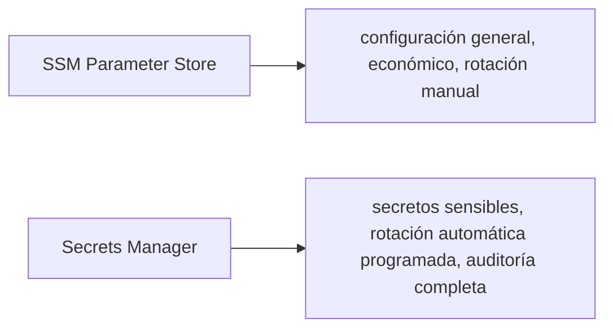

# Módulo 10: Secretos y configuración: Secrets Manager, Key Vault y Secret Manager


## Aprende construyendo

### Tema 1: Secrets Manager y por qué no usar variables de entorno hardcodeadas

#### Paso 1 · Objetivo y preparación
Al finalizar vas a sacar una clave real de RutaFlow de un archivo versionado y meterla donde corresponde. Prerrequisitos: Módulo 9 completo.
#### Paso 2 · Contexto y caso real
`confirmar-entrega` necesita notificar al cliente por SMS cuando su envío queda `entregado` — eso requiere la API key de un proveedor de SMS externo, y esa key no puede vivir en un `.env` versionado junto al código.
#### Paso 3 · Teoría, modelo mental y analogía
Un gestor de secretos es una caja fuerte con registro, rotación y acceso limitado — no un cajón sin cerradura donde cualquiera con acceso al código puede mirar.
#### Paso 4 · Demostración guiada
```bash
echo "SMS_GATEWAY_API_KEY=sk_live_rutaflow_demo_12345" > .env
grep SMS_GATEWAY_API_KEY .env
aws secretsmanager create-secret --name /rutaflow/sms-gateway-api-key --secret-string "sk_live_rutaflow_demo_12345"
```
Resultado esperado: el `grep` confirma que la clave está ahí, en texto plano, en un archivo que un `git add .` descuidado versionaría sin pensarlo dos veces; `create-secret` la guarda cifrada en reposo, en un servicio separado del código.
#### Paso 5 · Práctica guiada
Pista: ese `.env` del Paso 4 ES el fallo deliberado — corré `git log --all --oneline -- .env` (si llegaste a commitearlo alguna vez) para confirmar que, aunque borres el archivo ahora, el historial de Git seguiría teniendo la clave para siempre. Corregilo borrando el archivo (`rm .env`) y confirmando con `aws secretsmanager get-secret-value --secret-id /rutaflow/sms-gateway-api-key --query SecretString --output text` que la aplicación puede seguir obteniendo la clave sin que exista en ningún archivo local.
#### Paso 6 · Práctica independiente
Documentá, en una frase, cada cuánto correspondería rotar `/rutaflow/sms-gateway-api-key` si el proveedor de SMS sufriera una filtración, y qué comando usarías para revisar quién accedió a ese secreto en los últimos días (pista: es un servicio distinto de Secrets Manager, el mismo que audita accesos IAM en general).
#### Paso 7 · Cierre y evidencia
Entregá la clave expuesta en `.env`, su migración a Secrets Manager, y la respuesta del Paso 6; explicá por qué borrar un archivo no borra su historial de Git. Siguiente paso: cifrado. Errores comunes: secretos en logs y acceso global. Fuente oficial: https://docs.aws.amazon.com/secretsmanager/latest/userguide/intro.html.
**Conceptos clave:** un secreto centralizado, auditable y rotable, no disperso en archivos de configuración.

```bash
aws secretsmanager create-secret --name /app/db-password --secret-string "mi-password-segura"
aws secretsmanager get-secret-value --secret-id /app/db-password --query SecretString --output text
```

En el primer comando, `--name` es el identificador con el que vas a referirte a este secreto después (aquí, una ruta tipo carpeta: `/app/db-password`) y `--secret-string` es el valor real que querés guardar, en texto plano en el comando pero cifrado en reposo por Secrets Manager. En el segundo comando, `--secret-id` es ese mismo identificador para pedir el secreto de vuelta; `--query` filtra la respuesta JSON completa que devolvería la API usando una expresión JMESPath (aquí, `SecretString` se queda solo con el valor del secreto, descartando metadatos como fecha de creación o ARN); y `--output text` le dice a la AWS CLI que imprima ese resultado como texto plano en vez de JSON, más cómodo para copiar o pasar a otro comando. En resumen: `--secret-id` es la bandera que identifica qué secreto pedís, `--query` es la bandera que filtra la respuesta con JMESPath, y `--output` es la bandera que fija el formato de esa salida.

Guardar una contraseña de base de datos directamente como una variable de entorno hardcodeada en un archivo `.env` versionado (o peor, directamente en el código fuente) expone ese secreto a cualquiera con acceso de lectura al repositorio, incluyendo el historial completo de commits pasados incluso si se elimina posteriormente del código actual; AWS Secrets Manager centraliza ese secreto en un servicio dedicado, cifrado en reposo, con control de acceso granular vía IAM (Módulo 7) que determina exactamente qué usuarios o roles pueden leer ese secreto específico, y con un historial de auditoría de cada acceso, capacidades que ningún archivo de configuración plano puede ofrecer de forma nativa.

Leer el secreto desde Python (`client.get_secret_value(SecretId="/app/db-password")`) en tiempo de ejecución, en vez de inyectarlo como variable de entorno al desplegar, significa que el valor del secreto nunca necesita persistir en ningún archivo de configuración de despliegue, reduciendo la superficie de exposición a solo el momento exacto en que la aplicación efectivamente lo necesita, con el beneficio adicional de que rotar el secreto (cambiar la contraseña) no requiere redesplegar la aplicación, solo actualizar el valor en Secrets Manager para que la próxima lectura obtenga automáticamente el valor nuevo.

**Analogía:** Secrets Manager es como una caja fuerte central con registro de auditoría de cada apertura, en vez de dejar la llave de la casa bajo el felpudo (una variable de entorno hardcodeada) donde cualquiera que sepa buscar ahí puede encontrarla sin dejar ningún rastro de que lo hizo.

**¿Por qué es importante?** Guardar secretos en variables de entorno hardcodeadas expone el valor a cualquiera con acceso al código (incluyendo el historial de versiones), sin auditoría ni control de acceso granular; Secrets Manager centraliza, cifra, audita y permite rotar secretos sin redesplegar la aplicación.

**Prueba en terminal:**

```bash
aws secretsmanager create-secret --name /app/db-password --secret-string "mi-password-segura"
aws secretsmanager get-secret-value --secret-id /app/db-password --query SecretString --output text
```

### Tema 2: KMS y envelope encryption

#### Paso 1 · Objetivo y preparación
Al finalizar vas a cifrar un respaldo local de la clave del Tema 1 con KMS, y a comprobar qué pasa si alguien sin permiso intenta descifrarlo. Prerrequisitos: Tema 1 de este módulo.
#### Paso 2 · Contexto y caso real
RutaFlow necesita guardar un respaldo exportado de `/rutaflow/sms-gateway-api-key` fuera de Secrets Manager (por ejemplo, para un proceso de recuperación ante desastres) — ese respaldo no puede quedar en texto plano en ningún disco.
#### Paso 3 · Teoría, modelo mental y analogía
Se cifra el contenido con una llave de datos efímera, y esa llave de datos se cifra a su vez con una llave maestra que nunca sale de KMS.
#### Paso 4 · Demostración guiada
```bash
aws kms create-key --description "Clave de respaldo RutaFlow" --query KeyMetadata.KeyId --output text
aws kms create-alias --alias-name alias/rutaflow-backup --target-key-id "$(aws kms list-keys --query 'Keys[-1].KeyId' --output text)"
echo "sk_live_rutaflow_demo_12345" > respaldo-secreto.txt
aws kms encrypt --key-id alias/rutaflow-backup --plaintext fileb://respaldo-secreto.txt --query CiphertextBlob --output text | base64 -d > respaldo-secreto.enc
aws kms decrypt --ciphertext-blob fileb://respaldo-secreto.enc --query Plaintext --output text | base64 -d
```
Resultado esperado: el `decrypt` final devuelve exactamente `sk_live_rutaflow_demo_12345` — el archivo `.enc` en disco nunca es legible por sí solo, necesita pasar siempre por KMS para recuperar el valor real.
#### Paso 5 · Práctica guiada
Pista: creá una política que deniegue `kms:Decrypt` sobre `alias/rutaflow-backup` para el rol `RutaFlowConfirmarEntregaRole` (Módulo 7), simulala con `aws iam simulate-custom-policy`, y confirmá `implicitDeny` — ese es el fallo deliberado que corresponde: `confirmar-entrega` nunca debería poder descifrar el respaldo completo, solo leer el secreto puntual que ya tiene permitido en Secrets Manager.
#### Paso 6 · Práctica independiente
Documentá por escrito qué pasaría si perdieras `respaldo-secreto.enc` sin haber guardado nunca la clave KMS que lo cifró (pista: sin la clave maestra, ese archivo queda irrecuperable para siempre, no solo "difícil de leer").
#### Paso 7 · Cierre y evidencia
Entregá el ciclo completo de cifrado/descifrado, la denegación simulada del Paso 5 y la reflexión del Paso 6; explicá por qué cifrar el respaldo completo con la clave maestra sería más lento que usar una clave de datos efímera. Siguiente paso: parámetros. Errores comunes: compartir claves maestras y perder contexto. Fuente oficial: https://docs.aws.amazon.com/kms/latest/developerguide/concepts.html.
**Conceptos clave:** cifrar la clave que cifra los datos, no solo los datos directamente.

```bash
aws kms create-key --description "Clave de la app"
aws kms encrypt --key-id alias/mi-clave --plaintext fileb://secreto.txt --query CiphertextBlob --output text | base64 -d > secreto.enc
aws kms decrypt --ciphertext-blob fileb://secreto.enc --query Plaintext --output text | base64 -d
```

`--description` es solo una etiqueta legible para identificar la clave más adelante (no afecta el cifrado). `--key-id` señala qué clave maestra usar para cifrar — acá, un alias legible (`alias/mi-clave`) en vez del identificador interno de la clave. `--plaintext` es el archivo con el dato sin cifrar que le entregás al comando (el prefijo `fileb://` le dice a la CLI que lo lea como binario); el resultado cifrado sale por `--query CiphertextBlob`, el mismo filtro JMESPath que ya viste en Secrets Manager. Para revertir el proceso, `--ciphertext-blob` es el archivo cifrado que querés descifrar. En resumen: `--description` es la bandera que asigna una etiqueta legible a la clave; `--key-id` es la bandera que selecciona qué clave maestra usar.

KMS (Key Management Service) gestiona claves de cifrado (CMK, Customer Master Keys) usadas para cifrar y descifrar datos directamente mediante `encrypt`/`decrypt`, pero su uso más común y eficiente en la práctica es a través de "envelope encryption": en vez de cifrar directamente un volumen grande de datos con la clave maestra (una operación relativamente costosa y con límites de tamaño de payload), se genera una clave de datos temporal (data key) cifrada por la clave maestra de KMS, se usa esa clave de datos para cifrar el volumen real de información (una operación local, rápida, sin límite de tamaño), y se almacena junto a los datos cifrados únicamente la clave de datos ya cifrada (nunca en texto plano); para descifrar, primero se usa KMS para descifrar la clave de datos, y luego esa clave de datos ya descifrada se usa localmente para descifrar el volumen real de información.

Este patrón de dos niveles (una clave maestra centralizada en KMS que nunca sale del servicio, protegiendo claves de datos más efímeras que sí se usan directamente sobre los datos) es el mismo principio que sustenta el cifrado de discos completos en sistemas operativos modernos, y explica por qué servicios como S3 o RDS pueden ofrecer cifrado en reposo transparente sin sacrificar rendimiento: la operación costosa de KMS ocurre una única vez por clave de datos, no en cada operación individual sobre los datos.

**Analogía:** envelope encryption es como guardar el contenido valioso de una caja fuerte (los datos) usando una combinación temporal específica de esa caja (la clave de datos), y luego guardar esa combinación temporal dentro de otra caja fuerte maestra central mucho más protegida (KMS) que rara vez se abre directamente, en vez de usar la combinación de la caja fuerte maestra directamente sobre cada objeto individual que se quiere proteger.

**¿Por qué es importante?** Envelope encryption permite cifrar grandes volúmenes de datos de forma eficiente localmente, mientras la clave maestra centralizada en KMS (que nunca sale del servicio) protege únicamente la clave de datos más pequeña y efímera, combinando seguridad centralizada con rendimiento práctico.

**Diagrama:**



### Tema 3: SSM Parameter Store vs Secrets Manager

#### Paso 1 · Objetivo y preparación
Al finalizar vas a separar, para RutaFlow, qué va en SSM Parameter Store y qué va en Secrets Manager, y a comprobar por qué un rol sin permiso específico no puede leer ninguno de los dos. Prerrequisitos: Temas 1-2 de este módulo.
#### Paso 2 · Contexto y caso real
RutaFlow necesita guardar la URL base del proveedor de SMS (pública, no sensible) junto a la API key del Tema 1 (sensible) — mezclarlas en el mismo servicio sería tratar dos cosas distintas igual.
#### Paso 3 · Teoría, modelo mental y analogía
Parameter Store es el tablero de anuncios de configuración general; Secrets Manager es la bóveda reservada para lo que de verdad necesita rotación y auditoría.
#### Paso 4 · Demostración guiada
```bash
aws ssm put-parameter --name /rutaflow/sms-gateway-url --value "https://sms-provider.example.com/v1" --type String
aws ssm get-parameter --name /rutaflow/sms-gateway-url --query Parameter.Value --output text
```
Resultado esperado: `get-parameter` devuelve la URL sin ningún cifrado de por medio — es configuración pública, no necesita las garantías de Secrets Manager, y además es gratis en SSM mientras que cada secreto en Secrets Manager tiene costo mensual.
#### Paso 5 · Práctica guiada
Pista: usá `aws iam simulate-custom-policy` con la política `policy-crud.json` del Módulo 9 (la de `lambda-crud-tareas`, que nunca menciona `ssm:GetParameter` ni `secretsmanager:GetSecretValue`) contra la acción `ssm:GetParameter` sobre `/rutaflow/sms-gateway-url` — ese es el fallo deliberado: `implicitDeny`, el mismo patrón de "denegado por defecto" del Módulo 7, ahora aplicado a configuración, no solo a datos.
#### Paso 6 · Práctica independiente
Clasificá estos cinco valores de RutaFlow como "SSM Parameter Store" o "Secrets Manager", justificando cada uno en una frase: la URL del proveedor de SMS, la API key del proveedor de SMS, el nombre de la tabla `ShipmentEvents`, la contraseña de una futura base de datos relacional (Módulo 13), y el `BatchSize` del event source mapping del Módulo 5.
#### Paso 7 · Cierre y evidencia
Entregá el parámetro creado, la denegación simulada del Paso 5 y la clasificación justificada del Paso 6; explicá qué regla usaste para decidir cada caso. Siguiente paso: mensajería. Errores comunes: guardar secretos como configuración común y no rotar. Fuente oficial: https://docs.aws.amazon.com/systems-manager/latest/userguide/systems-manager-parameter-store.html.
**Conceptos clave:** configuración general frente a secretos sensibles con rotación automática.

```bash
aws ssm put-parameter --name /app/api-url --value "http://localhost:4566" --type String
```

`--name` vuelve a ser el identificador del parámetro (igual que en Secrets Manager); `--value` es el contenido que guardás; `--type` declara qué clase de parámetro es — `String` para texto plano, `StringList` para una lista, o `SecureString` cuando querés que SSM lo cifre igual que un secreto.

SSM Parameter Store almacena configuración general de la aplicación (URLs de endpoints, flags de features, valores no necesariamente sensibles) de forma más simple y económica que Secrets Manager, con soporte también para valores cifrados (`SecureString`) cuando se necesita, pero sin las capacidades avanzadas específicas de gestión de secretos como rotación automática programada (Secrets Manager puede rotar automáticamente una contraseña de base de datos en un horario configurado, invocando una Lambda que genera una nueva contraseña, la actualiza en la base de datos, y actualiza el secreto almacenado, todo sin intervención manual) o integración nativa más profunda con otros servicios de gestión de credenciales de bases de datos.

La elección práctica entre ambos suele seguir una regla simple: usar Parameter Store para configuración general de la app (más económico, suficiente para ese caso), y reservar Secrets Manager específicamente para credenciales sensibles que se benefician de rotación automática y de las capacidades de auditoría más completas de ese servicio dedicado; AWS Config, por su parte, es un servicio distinto que audita continuamente la configuración de los recursos de la cuenta (no de la aplicación), verificando que cumplan reglas de compliance definidas (por ejemplo, que ningún bucket S3 sea público accidentalmente).

**Analogía:** Parameter Store es como un tablón de anuncios general de la oficina donde se publican configuraciones y avisos rutinarios; Secrets Manager es como una bóveda especializada con protocolo de cambio periódico automático de combinación, reservada específicamente para los objetos más sensibles que requieren ese nivel adicional de protección y renovación.

**¿Por qué es importante?** SSM Parameter Store es apropiado y más económico para configuración general no sensible; Secrets Manager se reserva para credenciales sensibles que se benefician de rotación automática programada y auditoría más completa.

**Diagrama:**



---


## Laboratorio práctico

> Este laboratorio asume que ya ejecutaste `floci start` y `eval $(floci env)` (Módulo 1) en tu sesión de terminal, así que los comandos de `aws` no repiten `--endpoint-url`.

**Objetivo del laboratorio:** construir una aplicación que lee todos sus secretos y configuración desde la nube, sin nada hardcodeado.

**Requisitos previos:** Módulos 0-9 completados (cloud local corriendo).

| Paso | Acción | Comando | Explicación |
|---|---|---|---|
| 1 | Crear un secreto en Secrets Manager | `aws secretsmanager create-secret --name /app/db-password --secret-string "..."` | Cifrado en reposo |
| 2 | Leerlo desde Python con boto3 | `client.get_secret_value(SecretId="/app/db-password")` | En tiempo de ejecución |
| 3 | Cifrar/descifrar con KMS | `aws kms encrypt` / `aws kms decrypt` | Envelope encryption |
| 4 | Guardar configuración con SSM | `aws ssm put-parameter --name /app/api-url --value "..." --type String` | No sensible |
| 5 | Repetir en GCP Secret Manager y Azure Key Vault | `gcloud secrets create` / `az keyvault secret set` | Mismo patrón multi-nube |

**Verificación:** el laboratorio se considera exitoso si la aplicación no contiene ningún secreto ni configuración hardcodeada en su código fuente, leyendo todo dinámicamente desde los servicios correspondientes en tiempo de ejecución.

**Errores comunes y soluciones**

- **Guardar contraseñas en un archivo `.env` versionado en el repositorio.** Migra a Secrets Manager, cifrado y auditable.
- **Usar Secrets Manager para configuración simple no sensible.** Usa SSM Parameter Store, más económico para ese caso.
- **Cifrar directamente volúmenes grandes de datos con la clave maestra de KMS.** Usa envelope encryption con una clave de datos efímera para eficiencia.

---
