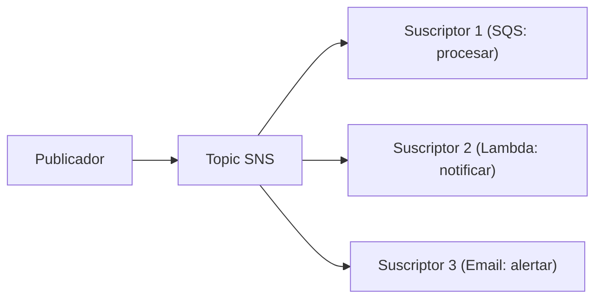
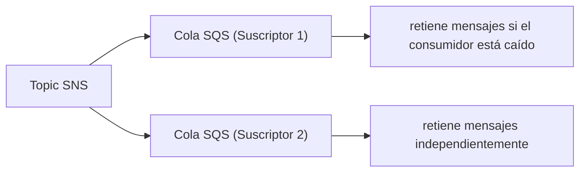

# Módulo 11: Mensajería Pub/Sub: SNS, EventBridge y Azure Event Hubs


## Aprende construyendo

### Tema 1: El patrón fan-out con SNS

#### Paso 1 · Objetivo y preparación
Al finalizar podrás distribuir eventos desde cero. Prerrequisitos: Node.js y AWS CLI; verifica `node --version`.
#### Paso 2 · Contexto y caso real
Una entrega debe notificar a conductor, cliente y auditoría sin duplicar productores.
#### Paso 3 · Teoría, modelo mental y analogía
Fan-out es un altavoz: una publicación llega a varias bandejas independientes.
#### Paso 4 · Demostración guiada
Crea `src/fanout.js` desde una carpeta vacía.
```bash
mkdir ejemplo-fanout
node --version
```
Resultado esperado: Node disponible.
#### Paso 5 · Práctica guiada
Pista: desconecta una suscripción para provocar un fallo deliberado y corrígelo.
#### Paso 6 · Práctica independiente
Añade tres consumidores y verifica aislamiento.
#### Paso 7 · Cierre y evidencia
Entrega topología, salida, fallo y corrección; explica el resultado. Siguiente paso: filtrado. Errores comunes: asumir orden global y no monitorizar suscriptores. Fuente oficial: https://docs.aws.amazon.com/sns/latest/dg/welcome.html.
**Conceptos clave:** un único mensaje publicado, múltiples suscriptores lo reciben independientemente.

```bash
aws sns create-topic --name mis-alertas
aws sns subscribe --topic-arn arn:aws:sns:us-east-1:000000000000:mis-alertas --protocol sqs --notification-endpoint arn:aws:sqs:us-east-1:000000000000:mi-cola
aws sns publish --topic-arn ... --message "Alerta importante"
```

`--topic-arn` identifica el topic (el ARN es el identificador único de cualquier recurso de AWS, como una dirección completa). Al suscribir, `--protocol` dice qué tipo de destino es el suscriptor (`sqs`, `lambda`, `email`, `http`...) y `--notification-endpoint` es la dirección concreta de ese destino (acá, el ARN de la cola SQS que va a recibir los mensajes). Al publicar, `--message` es el contenido que le llega a todos los suscriptores.

El patrón fan-out distribuye una única publicación hacia múltiples suscriptores independientes simultáneamente: publicar un mensaje en un topic SNS lo entrega automáticamente a **todos** los suscriptores activos de ese topic (que pueden ser colas SQS, funciones Lambda, endpoints HTTP, direcciones de email), sin que el publicador necesite conocer de antemano cuántos ni cuáles son esos suscriptores, a diferencia de SQS solo (Módulo 3), donde un mensaje enviado a una cola es consumido por **un único** consumidor entre los que compiten por leerlo de esa cola.

Este desacoplamiento entre publicador y número/identidad de suscriptores es especialmente valioso cuando un mismo evento de negocio (por ejemplo, "se creó una tarea nueva") necesita disparar múltiples acciones independientes entre sí (enviar una notificación por email, actualizar un índice de búsqueda, registrar una métrica de analítica): con SNS, cada una de esas acciones se suscribe independientemente al mismo topic sin que el código que publica el evento original necesite conocer ni coordinar esas acciones dependientes explícitamente.

**Analogía:** un topic SNS es como una estación de radio que transmite un anuncio una única vez, y cualquier receptor sintonizado a esa frecuencia (suscriptor) lo recibe simultáneamente sin que la estación necesite conocer cuántos receptores específicos están escuchando en ese momento; una cola SQS sola es como una fila única donde solo la primera persona disponible atiende cada solicitud individual.

**¿Por qué es importante?** SNS distribuye un mensaje a múltiples suscriptores independientes simultáneamente (fan-out), sin que el publicador conozca su número o identidad, apropiado cuando un mismo evento debe disparar múltiples acciones independientes entre sí.

**Diagrama:**



### Tema 2: EventBridge: bus de eventos con filtrado declarativo

#### Paso 1 · Objetivo y preparación
Al finalizar podrás filtrar eventos desde cero. Prerrequisitos: Node.js y AWS CLI; verifica `node --version`.
#### Paso 2 · Contexto y caso real
Solo ciertos cambios de estado deben activar cada proceso.
#### Paso 3 · Teoría, modelo mental y analogía
El filtro es un clasificador que lee atributos, no una ruta fija.
#### Paso 4 · Demostración guiada
Crea `src/event-filter.js` desde una carpeta vacía.
```bash
mkdir ejemplo-eventbridge
node --version
```
Resultado esperado: Node disponible.
#### Paso 5 · Práctica guiada
Pista: usa un patrón inválido para provocar un fallo deliberado y corrígelo.
#### Paso 6 · Práctica independiente
Define eventos válido, límite e inválido.
#### Paso 7 · Cierre y evidencia
Entrega patrones, salida, fallo y corrección; explica el resultado. Siguiente paso: combinar SNS y SQS. Errores comunes: filtros demasiado amplios y eventos sin versión. Fuente oficial: https://docs.aws.amazon.com/eventbridge/latest/userguide/eb-event-patterns.html.
**Conceptos clave:** enrutamiento basado en el contenido del evento, no solo en el destino fijo de una suscripción.

```bash
aws events create-event-bus --name mi-bus
aws events put-rule --name ReglaEjemplo --event-bus-name mi-bus --event-pattern '{"source":["mi.app"]}'
aws events put-events --entries '[{"Source":"mi.app","DetailType":"TareaCreada","Detail":"{\"id\":\"001\"}","EventBusName":"mi-bus"}]'
```

`--event-bus-name` es la bandera que indica en qué bus vive la regla (podés tener varios buses independientes). `--event-pattern` es el filtro declarativo en JSON que decide qué eventos activan esa regla — acá, solo los que tengan `"source":"mi.app"`. Al publicar eventos, `--entries` es la lista de eventos a enviar (podés mandar varios en una sola llamada), cada uno con su propio `Source`, `DetailType` y `Detail`.

EventBridge extiende el concepto de fan-out de SNS agregando enrutamiento basado en filtros de contenido declarativos sobre la estructura del evento mismo (`event-pattern`), no solo un destino fijo por suscripción: una regla puede especificar que solo eventos con un `source` específico, o con un campo particular dentro del `Detail` cumpliendo cierta condición, disparen una acción determinada, permitiendo que un único bus reciba eventos de múltiples orígenes distintos y los enrute selectivamente hacia distintos consumidores según el contenido específico de cada evento, sin que cada consumidor tenga que filtrar manualmente los eventos irrelevantes que no le interesan.

EventBridge Scheduler complementa esta capacidad de enrutamiento basado en eventos con programación temporal declarativa (`rate(1 minute)`), permitiendo disparar acciones periódicas sin necesidad de un servidor propio ejecutando un cron job tradicional, el equivalente serverless de una tarea programada.

**Analogía:** SNS es como un altavoz que transmite el mismo anuncio a todos los que estén sintonizados a esa frecuencia específica; EventBridge es como un sistema de clasificación postal automático que examina el contenido de cada carta entrante y la enruta selectivamente hacia el departamento correcto según reglas de filtrado específicas sobre ese contenido, sin que cada departamento tenga que revisar manualmente toda la correspondencia entrante para descartar la que no le corresponde.

**¿Por qué es importante?** EventBridge agrega enrutamiento basado en filtros de contenido declarativos sobre la estructura del evento, permitiendo que un único bus centralice eventos de múltiples orígenes y los distribuya selectivamente según reglas de filtrado, sin que cada consumidor filtre manualmente eventos irrelevantes.

**Prueba en terminal:**

```bash
aws events put-rule --name ReglaEjemplo --event-bus-name mi-bus --event-pattern '{"source":["mi.app"]}'
# Solo eventos con source="mi.app" disparan esta regla, filtrado declarativo sobre el contenido
```

### Tema 3: SNS + SQS juntos, y Azure Event Hubs

#### Paso 1 · Objetivo y preparación
Al finalizar podrás combinar publicación y cola desde cero. Prerrequisitos: Node.js y AWS CLI; verifica `node --version`.
#### Paso 2 · Contexto y caso real
Un consumidor caído debe recuperar mensajes sin perder eventos.
#### Paso 3 · Teoría, modelo mental y analogía
SNS reparte y SQS conserva; juntos separan velocidad de disponibilidad.
#### Paso 4 · Demostración guiada
Crea `src/sns-sqs.js` desde una carpeta vacía.
```bash
mkdir ejemplo-sns-sqs
node --version
```
Resultado esperado: Node disponible.
#### Paso 5 · Práctica guiada
Pista: detén un consumidor para provocar un fallo deliberado y corrígelo.
#### Paso 6 · Práctica independiente
Reanuda el consumidor y comprueba recuperación.
#### Paso 7 · Cierre y evidencia
Entrega topología, salida, fallo y corrección; explica el resultado. Siguiente paso: observabilidad. Errores comunes: publicar sin DLQ y olvidar visibilidad. Fuente oficial: https://docs.aws.amazon.com/sns/latest/dg/sns-sqs-as-subscriber.html.
**Conceptos clave:** combinar fan-out con garantía de entrega, no perder mensajes si un consumidor está temporalmente caído.

Combinar SNS con una cola SQS como suscriptor (en vez de un endpoint HTTP directo o una Lambda invocada directamente) agrega una capa de resiliencia importante: si el consumidor final que procesa los mensajes de esa cola SQS está temporalmente caído o sobrecargado, los mensajes permanecen retenidos de forma segura en la cola hasta que el consumidor pueda procesarlos, en vez de perderse si SNS hubiera intentado entregarlos directamente a un endpoint HTTP que no respondió en ese momento; esto combina el fan-out de SNS (distribución a múltiples destinos) con la garantía de entrega y reintentos de SQS (Módulo 3) para cada destino individual, un patrón arquitectónico extremadamente común conocido informalmente como "fan-out con colas".

Azure Event Hubs (usando el protocolo AMQP en el puerto 5672, ya mencionado como protocolo estándar de mensajería empresarial) cumple un rol conceptualmente similar al de EventBridge/Kinesis en el ecosistema Azure, aunque más orientado específicamente a streaming de eventos de alto volumen que al enrutamiento basado en filtros de contenido puro de EventBridge; esta comparación entre servicios equivalentes de distintos proveedores refuerza que los patrones arquitectónicos fundamentales de mensajería (fan-out, colas con garantía de entrega, streaming de eventos) son universales, aunque cada proveedor los implemente con servicios y APIs específicas propias.

**Analogía:** combinar SNS con SQS es como agregar una bandeja de recepción segura debajo de un buzón de distribución masiva: si el destinatario final no está disponible para recoger su correspondencia de inmediato, la bandeja la retiene de forma segura hasta que pueda hacerlo, en vez de que la correspondencia se pierda si nadie estaba presente para recibirla en el momento exacto de la entrega.

**¿Por qué es importante?** SQS + SNS juntos combinan la distribución a múltiples destinos de SNS con la garantía de retención y reintentos de SQS para cada destino individual, evitando pérdida de mensajes si un consumidor está temporalmente no disponible, más robusto que SNS entregando directamente a un endpoint sin esa capa intermedia.

**Diagrama:**



---


## Laboratorio práctico

> Este laboratorio asume que ya ejecutaste `floci start` y `eval $(floci env)` (Módulo 1) en tu sesión de terminal, así que los comandos de `aws` no repiten `--endpoint-url`.

**Objetivo del laboratorio:** construir un sistema de notificaciones que distribuye alertas por SNS a múltiples destinos.

**Requisitos previos:** Módulo 10 completado.

| Paso | Acción | Comando | Explicación |
|---|---|---|---|
| 1 | Crear un topic SNS | `aws sns create-topic --name mis-alertas` | Fan-out |
| 2 | Suscribir una cola SQS al topic | `aws sns subscribe --protocol sqs ...` | Garantía de entrega |
| 3 | Publicar un mensaje y verificar la entrega | `aws sns publish --topic-arn ... --message "..."` | Llega a la cola |
| 4 | Crear un Event Bus con regla de filtrado | `aws events create-event-bus` + `put-rule` | Filtrado declarativo |
| 5 | Configurar EventBridge Scheduler | `aws scheduler create-schedule --schedule-expression "rate(1 minute)"` | Ejecución periódica |

**Verificación:** el laboratorio se considera exitoso si el mensaje publicado en el topic SNS llega correctamente a la cola SQS suscrita, y si la regla de EventBridge filtra correctamente solo los eventos con el `source` especificado.

**Errores comunes y soluciones**

- **Usar SNS entregando directamente a un endpoint HTTP sin una cola intermedia.** Combina con SQS para retención y reintentos si el consumidor está temporalmente caído.
- **Usar SQS solo cuando múltiples consumidores independientes necesitan el mismo evento.** Usa SNS para fan-out real hacia múltiples destinos.
- **No usar filtros de contenido en EventBridge, forzando a cada consumidor a filtrar manualmente.** Declara el filtrado en la regla misma.

---
