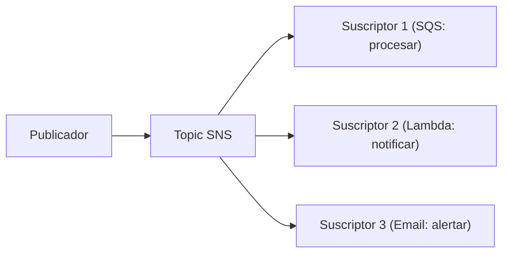
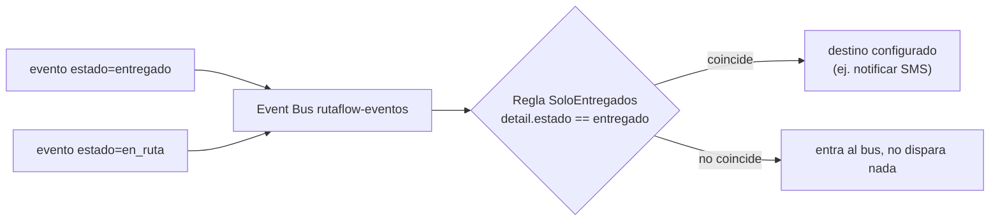
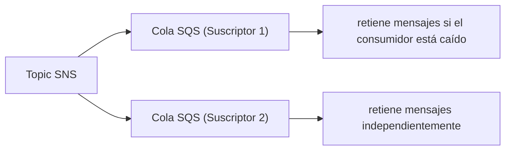

# Módulo 11: Mensajería Pub/Sub: SNS, EventBridge y Azure Event Hubs


## Aprende construyendo

### Tema 1: El patrón fan-out con SNS

#### Paso 1 · Objetivo y preparación
Al finalizar vas a distribuir el evento real "envío entregado" de RutaFlow a dos consumidores independientes sin que `confirmar-entrega` conozca a ninguno de los dos. Prerrequisitos: Módulo 5 completo.
#### Paso 2 · Contexto y caso real
Cuando `confirmar-entrega` marca un envío como `entregado`, RutaFlow necesita avisar al cliente por SMS Y registrar el evento para analítica — dos acciones independientes sobre el mismo hecho, sin que `confirmar-entrega` tenga que conocer ni coordinar ninguna de las dos.
#### Paso 3 · Teoría, modelo mental y analogía
Un topic SNS es un altavoz: una publicación llega a varias bandejas independientes al mismo tiempo, sin que el publicador sepa cuántas hay escuchando.
#### Paso 4 · Demostración guiada
```bash
TOPIC_ARN=$(aws sns create-topic --name rutaflow-envio-entregado --query TopicArn --output text)
NOTIF_Q=$(aws sqs create-queue --queue-name notificaciones-cliente --query QueueUrl --output text)
ANALYTICS_Q=$(aws sqs create-queue --queue-name analitica-entregas --query QueueUrl --output text)
aws sns subscribe --topic-arn "$TOPIC_ARN" --protocol sqs --notification-endpoint "$(aws sqs get-queue-attributes --queue-url "$NOTIF_Q" --attribute-names QueueArn --query Attributes.QueueArn --output text)"
aws sns subscribe --topic-arn "$TOPIC_ARN" --protocol sqs --notification-endpoint "$(aws sqs get-queue-attributes --queue-url "$ANALYTICS_Q" --attribute-names QueueArn --query Attributes.QueueArn --output text)"
aws sns publish --topic-arn "$TOPIC_ARN" --message '{"shipmentId":"env-4471","estado":"entregado"}'
aws sqs receive-message --queue-url "$NOTIF_Q"
aws sqs receive-message --queue-url "$ANALYTICS_Q"
```
Resultado esperado: AMBAS colas reciben su propia copia del mismo mensaje — `confirmar-entrega` publicó una sola vez, y ni `notificaciones-cliente` ni `analitica-entregas` sabían de la existencia de la otra.
#### Paso 5 · Práctica guiada
Pista: desuscribí `analitica-entregas` (`aws sns unsubscribe --subscription-arn <arn-de-esa-suscripción>`) y publicá un segundo mensaje — ese es el fallo deliberado: `notificaciones-cliente` sigue recibiendo todo con normalidad, pero `analitica-entregas` nunca va a ver ese segundo mensaje, porque ya no está suscrita, sin que `confirmar-entrega` se entere de que algo cambió del lado de los consumidores.
#### Paso 6 · Práctica independiente
Agregá una tercera cola `auditoria-entregas`, suscribila al mismo topic, publicá un tercer mensaje, y confirmá que las tres colas activas (`notificaciones-cliente`, `auditoria-entregas`, y `analitica-entregas` si la volviste a suscribir) reciben copia, cada una de forma completamente aislada de las demás.
#### Paso 7 · Cierre y evidencia
Entregá las dos colas recibiendo el mismo mensaje del Paso 4, la desuscripción silenciosa del Paso 5, y la tercera cola del Paso 6; explicá por qué `confirmar-entrega` nunca necesitó cambiar su código al agregar o quitar consumidores. Siguiente paso: filtrado. Errores comunes: asumir orden global y no monitorizar suscriptores. Fuente oficial: https://docs.aws.amazon.com/sns/latest/dg/welcome.html.
**Conceptos clave:** un único mensaje publicado, múltiples suscriptores lo reciben independientemente.

```bash
aws sns create-topic --name mis-alertas
aws sns subscribe --topic-arn arn:aws:sns:us-east-1:000000000000:mis-alertas --protocol sqs --notification-endpoint arn:aws:sqs:us-east-1:000000000000:mi-cola
aws sns publish --topic-arn ... --message "Alerta importante"
```

`--topic-arn` identifica el topic (el ARN es el identificador único de cualquier recurso de AWS, como una dirección completa). Al suscribir, `--protocol` dice qué tipo de destino es el suscriptor (`sqs`, `lambda`, `email`, `http`...) y `--notification-endpoint` es la dirección concreta de ese destino (acá, el ARN de la cola SQS que va a recibir los mensajes). Al publicar, `--message` es el contenido que le llega a todos los suscriptores.

El patrón fan-out distribuye una única publicación hacia múltiples suscriptores independientes simultáneamente: publicar un mensaje en un topic SNS lo entrega automáticamente a **todos** los suscriptores activos de ese topic (que pueden ser colas SQS, funciones Lambda, endpoints HTTP, direcciones de email), sin que el publicador necesite conocer de antemano cuántos ni cuáles son esos suscriptores, a diferencia de SQS solo (Módulo 3), donde un mensaje enviado a una cola es consumido por **un único** consumidor entre los que compiten por leerlo de esa cola.

Este desacoplamiento entre publicador y número/identidad de suscriptores es especialmente valioso cuando un mismo evento de negocio (por ejemplo, "se creó una tarea nueva") necesita disparar múltiples acciones independientes entre sí (enviar una notificación por email, actualizar un índice de búsqueda, registrar una métrica de analítica): con SNS, cada una de esas acciones se suscribe independientemente al mismo topic sin que el código que publica el evento original necesite conocer ni coordinar esas acciones dependientes explícitamente.

**Analogía:** un topic SNS es como una estación de radio que transmite un anuncio una única vez, y cualquier receptor sintonizado a esa frecuencia (suscriptor) lo recibe simultáneamente sin que la estación necesite conocer cuántos receptores específicos están escuchando en ese momento; una cola SQS sola es como una fila única donde solo la primera persona disponible atiende cada solicitud individual.

**¿Por qué es importante?** SNS distribuye un mensaje a múltiples suscriptores independientes simultáneamente (fan-out), sin que el publicador conozca su número o identidad, apropiado cuando un mismo evento debe disparar múltiples acciones independientes entre sí.

**Diagrama:**


```mermaid
flowchart LR
    P["Publicador"] --> T["Topic SNS"]
    T --> S1["Suscriptor 1 (SQS: procesar)"]
    T --> S2["Suscriptor 2 (Lambda: notificar)"]
    T --> S3["Suscriptor 3 (Email: alertar)"]
```

En el proyecto integrador RutaFlow, este topic `rutaflow-envio-entregado` es el paso siguiente
natural para `ConfirmarEntregaFn`: hoy esa función (declarada en
`examples/rutaflow/cloud/template.yaml`) escribe directo en `ShipmentEvents`; agregarle un
`sns:Publish` a este topic permitiría notificar al cliente y a analítica sin tocar su lógica de
escritura actual.

### Tema 2: EventBridge: bus de eventos con filtrado declarativo

#### Paso 1 · Objetivo y preparación
Al finalizar vas a filtrar los eventos de `ShipmentEvents` (Módulo 4) para que solo "entregado" dispare la notificación SMS, sin que `creado` o `en_ruta` la activen por error. Prerrequisitos: Tema 1 de este módulo.
#### Paso 2 · Contexto y caso real
RutaFlow emite eventos para cada cambio de estado de un envío, pero el SMS al cliente solo debe salir cuando `estado` es `entregado` — mandar un SMS en cada evento intermedio sería spam, no notificación.
#### Paso 3 · Teoría, modelo mental y analogía
El filtro de EventBridge es un clasificador que lee el contenido del evento (`detail.estado`), no una ruta fija por tipo de suscriptor como en SNS.
#### Paso 4 · Demostración guiada
```bash
aws events create-event-bus --name rutaflow-eventos
aws events put-rule --name SoloEntregados --event-bus-name rutaflow-eventos \
  --event-pattern '{"source":["rutaflow.envios"],"detail":{"estado":["entregado"]}}'
aws events put-events --entries '[{"Source":"rutaflow.envios","DetailType":"CambioEstado","Detail":"{\"shipmentId\":\"env-4471\",\"estado\":\"entregado\"}","EventBusName":"rutaflow-eventos"}]'
aws events put-events --entries '[{"Source":"rutaflow.envios","DetailType":"CambioEstado","Detail":"{\"shipmentId\":\"env-4471\",\"estado\":\"en_ruta\"}","EventBusName":"rutaflow-eventos"}]'
```
Resultado esperado: ambos `put-events` responden con éxito (EventBridge siempre acepta el evento en el bus), pero solo el primero (estado `entregado`) coincide con el patrón `SoloEntregados` y dispararía su destino configurado; el segundo (`en_ruta`) entra al bus y se pierde sin disparar nada, exactamente como se espera.
#### Paso 5 · Práctica guiada
Pista: probá `aws events put-rule --name ReglaRota --event-bus-name rutaflow-eventos --event-pattern '{"detail":{"estado": "entregado"}}'` (sin los corchetes de array alrededor de `"entregado"`) — ese es el fallo deliberado: `InvalidEventPatternException`, porque EventBridge exige que los valores de un patrón vengan siempre dentro de un array, aunque sea de un solo elemento.
#### Paso 6 · Práctica independiente
Definí tres eventos de prueba con `estado`: `"entregado"` (válido, dispara la regla), `"ENTREGADO"` en mayúsculas (límite: EventBridge compara el string exacto, así que esto NO dispara la regla aunque el significado de negocio sea el mismo), y `"cancelado"` (claramente inválido para esta regla) — confirmá el comportamiento de cada uno con `put-events`.
#### Paso 7 · Cierre y evidencia
Entregá la regla creada, el evento filtrado correctamente del Paso 4, el patrón inválido del Paso 5, y los tres casos del Paso 6; explicá por qué EventBridge compara el string exacto y no el significado. Siguiente paso: combinar SNS y SQS. Errores comunes: filtros demasiado amplios y eventos sin versión. Fuente oficial: https://docs.aws.amazon.com/eventbridge/latest/userguide/eb-event-patterns.html.
**Conceptos clave:** enrutamiento basado en el contenido del evento, no solo en el destino fijo de una suscripción.

```bash
aws events create-event-bus --name mi-bus
aws events put-rule --name ReglaEjemplo --event-bus-name mi-bus --event-pattern '{"source":["mi.app"]}'
aws events put-events --entries '[{"Source":"mi.app","DetailType":"TareaCreada","Detail":"{\"id\":\"001\"}","EventBusName":"mi-bus"}]'
```

`--event-bus-name` es la bandera que indica en qué bus vive la regla (podés tener varios buses independientes). `--event-pattern` es el filtro declarativo en JSON que decide qué eventos activan esa regla — acá, solo los que tengan `"source":"mi.app"`. Al publicar eventos, `--entries` es la lista de eventos a enviar (podés mandar varios en una sola llamada), cada uno con su propio `Source`, `DetailType` y `Detail`.

EventBridge extiende el concepto de fan-out de SNS agregando enrutamiento basado en filtros de contenido declarativos sobre la estructura del evento mismo (`event-pattern`), no solo un destino fijo por suscripción: una regla puede especificar que solo eventos con un `source` específico, o con un campo particular dentro del `Detail` cumpliendo cierta condición, disparen una acción determinada, permitiendo que un único bus reciba eventos de múltiples orígenes distintos y los enrute selectivamente hacia distintos consumidores según el contenido específico de cada evento, sin que cada consumidor tenga que filtrar manualmente los eventos irrelevantes que no le interesan.

EventBridge Scheduler complementa esta capacidad de enrutamiento basado en eventos con programación temporal declarativa (`rate(1 minute)`), permitiendo disparar acciones periódicas sin necesidad de un servidor propio ejecutando un cron job tradicional, el equivalente serverless de una tarea programada.

**Analogía:** SNS es como un altavoz que transmite el mismo anuncio a todos los que estén sintonizados a esa frecuencia específica; EventBridge es como un sistema de clasificación postal automático que examina el contenido de cada carta entrante y la enruta selectivamente hacia el departamento correcto según reglas de filtrado específicas sobre ese contenido, sin que cada departamento tenga que revisar manualmente toda la correspondencia entrante para descartar la que no le corresponde.

**¿Por qué es importante?** EventBridge agrega enrutamiento basado en filtros de contenido declarativos sobre la estructura del evento, permitiendo que un único bus centralice eventos de múltiples orígenes y los distribuya selectivamente según reglas de filtrado, sin que cada consumidor filtre manualmente eventos irrelevantes.

**Prueba en terminal:**

```bash
aws events put-rule --name ReglaEjemplo --event-bus-name mi-bus --event-pattern '{"source":["mi.app"]}'
# Solo eventos con source="mi.app" disparan esta regla, filtrado declarativo sobre el contenido
```

**Diagrama del filtrado declarativo:**


```mermaid
flowchart LR
    E1["evento estado=entregado"] --> BUS["Event Bus rutaflow-eventos"]
    E2["evento estado=en_ruta"] --> BUS
    BUS --> RULE{"Regla SoloEntregados\ndetail.estado == entregado"}
    RULE -->|"coincide"| DEST["destino configurado\n(ej. notificar SMS)"]
    RULE -->|"no coincide"| DROP["entra al bus, no dispara nada"]
```

En el proyecto integrador RutaFlow, esta regla reemplazaría la lógica de filtrado que hoy
viviría dentro de `ConfirmarEntregaFn` (`examples/rutaflow/cloud/template.yaml`): en vez de que
la función decida en código si notificar o no, EventBridge filtra declarativamente antes de que
cualquier consumidor se entere del evento.

### Tema 3: SNS + SQS juntos, y Azure Event Hubs

#### Paso 1 · Objetivo y preparación
Al finalizar vas a comprobar que `notificaciones-cliente` (Tema 1) no pierde ningún mensaje aunque nadie lo esté leyendo por un rato. Prerrequisitos: Tema 1 de este módulo.
#### Paso 2 · Contexto y caso real
Si el servicio que envía los SMS reales estuviera caído por mantenimiento, los eventos de entrega de RutaFlow no pueden perderse — tienen que quedar esperando hasta que el servicio vuelva.
#### Paso 3 · Teoría, modelo mental y analogía
SNS reparte el mensaje a cada suscriptor; la cola SQS detrás de cada uno lo conserva hasta que alguien lo retire — juntos separan "distribuir rápido" de "garantizar que nadie se quede sin recibirlo".
#### Paso 4 · Demostración guiada
```bash
aws sns publish --topic-arn "$TOPIC_ARN" --message '{"shipmentId":"env-5002","estado":"entregado"}'
aws sns publish --topic-arn "$TOPIC_ARN" --message '{"shipmentId":"env-5003","estado":"entregado"}'
aws sqs get-queue-attributes --queue-url "$NOTIF_Q" --attribute-names ApproximateNumberOfMessages
```
Resultado esperado: `ApproximateNumberOfMessages` muestra 2 — nadie llamó a `receive-message` todavía (el "servicio de SMS" simulado está caído), y los dos mensajes siguen esperando intactos en `notificaciones-cliente`, sin que SNS ni SQS los descarten por no haber sido leídos.
#### Paso 5 · Práctica guiada
Pista: el fallo real que este patrón evita es el contrario — probá qué pasaría SIN la cola: si `notificaciones-cliente` fuera un endpoint HTTP directo (en vez de SQS) y ese endpoint estuviera caído en el momento exacto de la publicación, SNS reintentaría un número limitado de veces y después descartaría el mensaje para siempre. Documentá esa diferencia como el "fallo deliberado" conceptual de este Tema: la ausencia de la cola, no un comando roto.
#### Paso 6 · Práctica independiente
"Reanudá" el consumidor corriendo `aws sqs receive-message --queue-url "$NOTIF_Q" --max-number-of-messages 10` y confirmá que los dos mensajes del Paso 4 aparecen completos, con el mismo contenido que se publicó, demostrando que la espera no corrompió ni perdió nada.
#### Paso 7 · Cierre y evidencia
Entregá los dos mensajes retenidos del Paso 4, la comparación conceptual del Paso 5 y la recepción completa del Paso 6; explicá por qué SNS+SQS es más robusto que SNS entregando directo a un endpoint HTTP. Siguiente paso: observabilidad. Errores comunes: publicar sin DLQ y olvidar visibilidad. Fuente oficial: https://docs.aws.amazon.com/sns/latest/dg/sns-sqs-as-subscriber.html.
**Conceptos clave:** combinar fan-out con garantía de entrega, no perder mensajes si un consumidor está temporalmente caído.

Combinar SNS con una cola SQS como suscriptor (en vez de un endpoint HTTP directo o una Lambda invocada directamente) agrega una capa de resiliencia importante: si el consumidor final que procesa los mensajes de esa cola SQS está temporalmente caído o sobrecargado, los mensajes permanecen retenidos de forma segura en la cola hasta que el consumidor pueda procesarlos, en vez de perderse si SNS hubiera intentado entregarlos directamente a un endpoint HTTP que no respondió en ese momento; esto combina el fan-out de SNS (distribución a múltiples destinos) con la garantía de entrega y reintentos de SQS (Módulo 3) para cada destino individual, un patrón arquitectónico extremadamente común conocido informalmente como "fan-out con colas".

Azure Event Hubs (usando el protocolo AMQP en el puerto 5672, ya mencionado como protocolo estándar de mensajería empresarial) cumple un rol conceptualmente similar al de EventBridge/Kinesis en el ecosistema Azure, aunque más orientado específicamente a streaming de eventos de alto volumen que al enrutamiento basado en filtros de contenido puro de EventBridge; esta comparación entre servicios equivalentes de distintos proveedores refuerza que los patrones arquitectónicos fundamentales de mensajería (fan-out, colas con garantía de entrega, streaming de eventos) son universales, aunque cada proveedor los implemente con servicios y APIs específicas propias.

**Analogía:** combinar SNS con SQS es como agregar una bandeja de recepción segura debajo de un buzón de distribución masiva: si el destinatario final no está disponible para recoger su correspondencia de inmediato, la bandeja la retiene de forma segura hasta que pueda hacerlo, en vez de que la correspondencia se pierda si nadie estaba presente para recibirla en el momento exacto de la entrega.

**¿Por qué es importante?** SQS + SNS juntos combinan la distribución a múltiples destinos de SNS con la garantía de retención y reintentos de SQS para cada destino individual, evitando pérdida de mensajes si un consumidor está temporalmente no disponible, más robusto que SNS entregando directamente a un endpoint sin esa capa intermedia.

**Diagrama:**


```mermaid
flowchart LR
    T["Topic SNS"] --> Q1["Cola SQS (Suscriptor 1)"] --> R1["retiene mensajes si el consumidor está caído"]
    T --> Q2["Cola SQS (Suscriptor 2)"] --> R2["retiene mensajes independientemente"]
```

En el proyecto integrador RutaFlow, `notificaciones-cliente` como cola SQS (en vez de un
endpoint HTTP directo hacia el proveedor de SMS) es la misma decisión de resiliencia que
`DeliveryCommandsDLQ` en `examples/rutaflow/cloud/template.yaml`: aislar un consumidor lento o
caído detrás de una cola, en vez de dejar que su disponibilidad afecte al resto del sistema.

---


## Laboratorio práctico

> Este laboratorio asume que ya ejecutaste `floci start` y `eval $(floci env)` (Módulo 1) en tu sesión de terminal, así que los comandos de `aws` no repiten `--endpoint-url`.

**Objetivo del laboratorio:** construir un sistema de notificaciones que distribuye alertas por SNS a múltiples destinos.

**Requisitos previos:** Módulo 10 completado.

| Paso | Acción | Comando | Explicación |
|---|---|---|---|
| 1 | Crear un topic SNS | `aws sns create-topic --name mis-alertas` | Fan-out |
| 2 | Suscribir una cola SQS al topic | `aws sns subscribe --protocol sqs ...` | Garantía de entrega |
| 3 | Publicar un mensaje y verificar la entrega | `aws sns publish --topic-arn ... --message "..."` | Llega a la cola |
| 4 | Crear un Event Bus con regla de filtrado | `aws events create-event-bus` + `put-rule` | Filtrado declarativo |
| 5 | Configurar EventBridge Scheduler | `aws scheduler create-schedule --schedule-expression "rate(1 minute)"` | Ejecución periódica |

**Verificación:** el laboratorio se considera exitoso si el mensaje publicado en el topic SNS llega correctamente a la cola SQS suscrita, y si la regla de EventBridge filtra correctamente solo los eventos con el `source` especificado.

**Errores comunes y soluciones**

- **Usar SNS entregando directamente a un endpoint HTTP sin una cola intermedia.** Combina con SQS para retención y reintentos si el consumidor está temporalmente caído.
- **Usar SQS solo cuando múltiples consumidores independientes necesitan el mismo evento.** Usa SNS para fan-out real hacia múltiples destinos.
- **No usar filtros de contenido en EventBridge, forzando a cada consumidor a filtrar manualmente.** Declara el filtrado en la regla misma.

---
