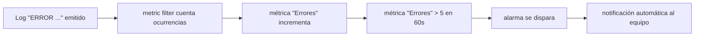
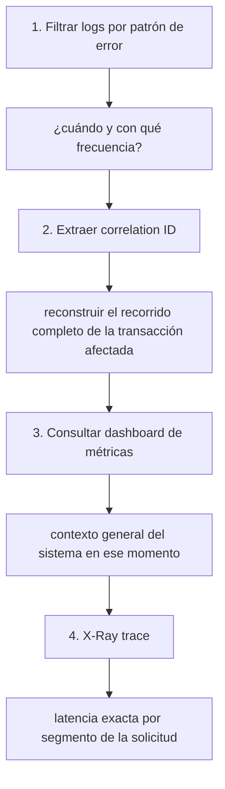

# Módulo 12: Observabilidad con CloudWatch: logs, métricas y alarmas


## Aprende construyendo

### Tema 1: Log groups, log streams y correlation ID

#### Paso 1 · Objetivo y preparación
Al finalizar vas a usar `shipmentId` como correlation ID real para seguir una entrega a través de `confirmar-entrega` (Módulo 5), API Gateway (Módulo 6) y SQS (Módulo 5 Tema 6). Prerrequisitos: Módulo 5 completo.
#### Paso 2 · Contexto y caso real
Una confirmación de entrega cruza API Gateway, la Lambda y, en el flujo asíncrono, la cola `DeliveryCommands` — sin un identificador común, diagnosticar por qué una entrega específica falló significa adivinar basándose en timestamps.
#### Paso 3 · Teoría, modelo mental y analogía
`shipmentId` ya es, sin que lo hayas planeado como tal, el correlation ID natural de RutaFlow: el número de guía que debería aparecer en cada línea de log de cada servicio que toca ese envío.
#### Paso 4 · Demostración guiada
```bash
aws logs create-log-group --log-group-name /rutaflow/confirmar-entrega
aws logs create-log-stream --log-group-name /rutaflow/confirmar-entrega --log-stream-name invocacion-001
aws logs put-log-events --log-group-name /rutaflow/confirmar-entrega --log-stream-name invocacion-001 \
  --log-events "[{\"timestamp\":$(date +%s000),\"message\":\"shipmentId=env-4471 accion=confirmar status=delivered\"}]"
aws logs filter-log-events --log-group-name /rutaflow/confirmar-entrega --filter-pattern "env-4471"
```
Resultado esperado: `filter-log-events` devuelve exactamente la línea que mencionaba `env-4471` — con un envío real cruzando varios servicios, este mismo filtro encontraría su rastro completo en cualquiera de ellos, siempre que todos loguearan el mismo `shipmentId`.
#### Paso 5 · Práctica guiada
Pista: emití un segundo evento de log SIN `shipmentId` (`"message":"accion=confirmar status=delivered"`) — ese es el fallo deliberado: `filter-log-events --filter-pattern "env-5002"` sobre ese log nunca lo va a encontrar, aunque sea la línea correcta, porque nunca incluyó el identificador que necesitabas para correlacionarlo.
#### Paso 6 · Práctica independiente
Emití logs para dos envíos distintos (`env-4471` y `env-5002`) intercalados en el mismo stream, y confirmá que `filter-log-events --filter-pattern "env-5002"` devuelve solo las líneas de ese envío, sin mezclarse con las de `env-4471` aunque estén en el mismo log group.
#### Paso 7 · Cierre y evidencia
Entregá el log correlacionado por `shipmentId`, el log sin ID del Paso 5 y su diagnóstico, y la separación limpia del Paso 6; explicá por qué `shipmentId` es un correlation ID mejor que un UUID genérico para este caso. Siguiente paso: métricas. Errores comunes: datos sensibles en logs y texto no estructurado. Fuente oficial: https://docs.aws.amazon.com/AmazonCloudWatch/latest/logs/WhatIsCloudWatchLogs.html.
**Conceptos clave:** logs centralizados y correlacionables entre servicios distintos.

```bash
aws logs create-log-group --log-group-name /mi-app/backend
aws logs create-log-stream --log-group-name /mi-app/backend --log-stream-name app-001
aws logs put-log-events --log-group-name /mi-app/backend --log-stream-name app-001 --log-events '[{"timestamp":...,"message":"ERROR request_id=abc tarea_id=001 msg=fallo"}]'
```

`--log-group-name` identifica el log group (el "archivo" del componente); `--log-stream-name` identifica un stream específico dentro de ese group (por ejemplo, una instancia o invocación puntual); `--log-events` es el arreglo de eventos de log que efectivamente estás enviando, cada uno con su marca de tiempo y mensaje. En resumen: `--log-group-name` es la bandera que fija el grupo de logs, y `--log-stream-name` es la bandera que fija el stream específico dentro de ese grupo.

Un log group centraliza los logs de un componente lógico de la aplicación (por ejemplo, todos los logs de un servicio backend específico), organizado internamente en log streams (típicamente uno por instancia o invocación en ejecución); centralizar logs en CloudWatch en vez de dejarlos dispersos en archivos locales de cada instancia individual permite consultar y correlacionar logs de múltiples instancias simultáneamente desde un único lugar, esencial en cualquier arquitectura distribuida donde un problema puede manifestarse a través de múltiples componentes ejecutándose en paralelo.

```python
import uuid
correlation_id = str(uuid.uuid4())
logging.info(f"correlation_id={correlation_id} accion=procesar_tarea")
```

Un correlation ID es un identificador único generado al inicio de una solicitud (o transacción) que se propaga consistentemente a través de cada log emitido durante el procesamiento de esa solicitud específica, incluso si esa solicitud atraviesa múltiples servicios o funciones distintas; sin un correlation ID, diagnosticar un problema reportado por un usuario específico requiere intentar correlacionar manualmente logs dispersos basándose en timestamps aproximados o suposiciones, un proceso lento y propenso a error, mientras que con un correlation ID consistente, filtrar todos los logs relacionados con esa transacción específica es una simple búsqueda directa por ese identificador exacto.

**Analogía:** un log group centralizado es como un archivo único de la empresa donde todos los departamentos registran sus actividades en un formato consistente, en vez de que cada departamento mantenga su propio archivo local aislado; un correlation ID es como un número de expediente único que acompaña a un trámite a través de cada departamento por el que pasa, permitiendo reconstruir el recorrido completo de ese trámite específico buscando simplemente ese número, sin tener que adivinar qué actividades en cada departamento corresponden a ese trámite en particular.

**¿Por qué es importante?** El correlation ID es esencial para diagnosticar problemas porque permite filtrar todos los logs relacionados con una transacción específica que atraviesa múltiples servicios mediante una búsqueda directa, en vez de correlacionar manualmente logs dispersos basándose en suposiciones de timing.

**Código del ejemplo:**

```python
correlation_id = str(uuid.uuid4())
logging.info(f"correlation_id={correlation_id} accion=procesar_tarea")
# El mismo correlation_id se propaga a través de CADA servicio que procesa esta solicitud
```

### Tema 2: Metric filters y alarmas

#### Paso 1 · Objetivo y preparación
Al finalizar vas a convertir el error de validación real de `confirmar-entrega` (Módulo 5, "comando de entrega inválido") en una métrica con alarma. Prerrequisitos: Tema 1 de este módulo.
#### Paso 2 · Contexto y caso real
RutaFlow necesita saber si los comandos de entrega inválidos empiezan a dispararse en volumen (señal de un bug en la app del conductor) sin que nadie tenga que leer logs manualmente todo el día.
#### Paso 3 · Teoría, modelo mental y analogía
Un metric filter transforma una marca de texto repetida en los logs en un contador numérico observable, sin que tengas que instrumentar manualmente cada punto del código.
#### Paso 4 · Demostración guiada
```bash
aws logs put-metric-filter --log-group-name /rutaflow/confirmar-entrega --filter-name ComandosInvalidos \
  --filter-pattern "\"comando de entrega inválido\"" \
  --metric-transformations metricName=ComandosInvalidos,metricNamespace=RutaFlow,metricValue=1
aws logs put-log-events --log-group-name /rutaflow/confirmar-entrega --log-stream-name invocacion-001 \
  --log-events "[{\"timestamp\":$(date +%s000),\"message\":\"shipmentId=env-6001 comando de entrega inválido\"}]"
aws cloudwatch get-metric-statistics --namespace RutaFlow --metric-name ComandosInvalidos \
  --start-time "$(date -u -v-5M +%Y-%m-%dT%H:%M:%S)" --end-time "$(date -u +%Y-%m-%dT%H:%M:%S)" --period 60 --statistics Sum
```
Resultado esperado: `get-metric-statistics` muestra `Sum: 1` — la línea de log con exactamente ese texto incrementó la métrica `ComandosInvalidos` sin que ninguna Lambda tuviera que llamar explícitamente a `put-metric-data`.
#### Paso 5 · Práctica guiada
Pista: emití un log con un error distinto (`"message":"shipmentId=env-6002 recipientPin invalido"`, sin la frase exacta "comando de entrega inválido") — ese es el fallo deliberado: la métrica `ComandosInvalidos` NO sube, porque el filtro compara el patrón de texto literal, no el significado del error; un error real de validación puede pasar completamente desapercibido si el mensaje no coincide con el patrón exacto configurado.
#### Paso 6 · Práctica independiente
Creá una alarma sobre `ComandosInvalidos` con `aws cloudwatch put-metric-alarm --alarm-name RutaFlowComandosInvalidos --namespace RutaFlow --metric-name ComandosInvalidos --statistic Sum --period 300 --threshold 5 --comparison-operator GreaterThanThreshold --evaluation-periods 1`, y documentá qué umbral tendría sentido real (¿5 en 5 minutos es demasiado sensible o demasiado laxo para esta alarma?).
#### Paso 7 · Cierre y evidencia
Entregá el metric filter funcionando, el error que no coincidió en el Paso 5, y la alarma del Paso 6; explicá por qué el patrón de texto exacto es tanto la fortaleza como el punto débil de un metric filter. Siguiente paso: trazas. Errores comunes: umbral sin objetivo y alarmas ruidosas. Fuente oficial: https://docs.aws.amazon.com/AmazonCloudWatch/latest/monitoring/CloudWatch_Metric_Streams.html.
**Conceptos clave:** convertir patrones de texto en logs a métricas numéricas monitoreables, más económico que métricas custom manuales.

```bash
aws logs put-metric-filter --log-group-name /mi-app/backend --filter-name ContarErrores --filter-pattern "ERROR" --metric-transformations metricName=Errores,metricNamespace=MiApp,metricValue=1
aws cloudwatch put-metric-alarm --alarm-name MuchosErrores --metric-name Errores --namespace MiApp --statistic Sum --period 60 --threshold 5 --comparison-operator GreaterThanThreshold --evaluation-periods 1
```

En el primer comando, `--filter-name` identifica el filtro; `--filter-pattern` es el texto o patrón que buscás dentro de cada línea de log (acá, literalmente `"ERROR"`); `--metric-transformations` define cómo ese patrón se convierte en métrica: `--namespace` (dentro del mismo flag) agrupa métricas relacionadas, `--metric-name` es el nombre de la métrica resultante, y su valor es cuánto suma cada coincidencia. En el segundo comando, `--alarm-name` identifica la alarma; `--statistic` es la agregación que evalúa (`Sum`, `Average`...); `--period` es la ventana de tiempo en segundos sobre la que se calcula esa agregación; `--threshold` es el valor límite; `--comparison-operator` define la comparación (por ejemplo, "mayor que"); y `--evaluation-periods` es cuántos períodos consecutivos deben cumplir esa condición antes de disparar la alarma. En resumen: `--metric-transformations` es la bandera que define cómo se deriva la métrica desde el patrón de log, y `--evaluation-periods` es la bandera que fija cuántos períodos consecutivos se exigen antes de disparar la alarma.

Un metric filter examina continuamente los logs entrantes de un log group buscando un patrón específico (`"ERROR"`), incrementando una métrica numérica cada vez que ese patrón aparece, sin que la aplicación necesite emitir explícitamente una métrica custom por separado además del log de error mismo: la métrica se deriva automáticamente del log ya existente, aprovechando información que la aplicación ya está registrando de todas formas por razones de depuración, en vez de duplicar ese esfuerzo instrumentando manualmente un contador de métricas custom adicional para el mismo propósito, lo que hace a los metric filters considerablemente más económicos en esfuerzo de instrumentación que las métricas custom manuales.

Una alarma configurada sobre esa métrica derivada (`threshold=5`, `evaluation-periods=1`) dispara una notificación automáticamente cuando el conteo de errores supera el umbral definido dentro del período configurado, permitiendo que el equipo de desarrollo se entere de un problema de producción de forma proactiva (antes de que múltiples usuarios reporten el mismo problema por otros canales), cerrando el ciclo completo desde "el código registra un error" hasta "el equipo responsable recibe una notificación automática accionable".

**Analogía:** un metric filter es como un sistema de conteo automático que registra cuántas veces aparece una palabra clave específica en los reportes diarios ya existentes de una oficina, sin requerir un formulario de conteo separado adicional; una alarma es como una campana automática que suena cuando ese conteo supera un umbral preocupante dentro de un período específico, alertando al supervisor antes de que el problema se vuelva evidente por sus consecuencias visibles.

**¿Por qué es importante?** Un metric filter es más barato que una métrica custom porque deriva la métrica automáticamente de logs que la aplicación ya emite, sin instrumentación manual adicional; las alarmas permiten detectar problemas proactivamente antes de que los usuarios los reporten por otros canales.

**Diagrama:**



### Tema 3: Diagnóstico sistemático y X-Ray

#### Paso 1 · Objetivo y preparación
Al finalizar podrás investigar incidentes desde cero. Prerrequisitos: Node.js y Docker; verifica `node --version`.
#### Paso 2 · Contexto y caso real
Una alerta debe llevar a una hipótesis verificable y una acción.
#### Paso 3 · Teoría, modelo mental y analogía
Diagnosticar es reconstruir una ruta con logs, métricas y tiempos.
#### Paso 4 · Demostración guiada
Crea `src/incident.md` desde una carpeta vacía.
```bash
mkdir ejemplo-incidente
node --version
```
Resultado esperado: Node disponible.
#### Paso 5 · Práctica guiada
Pista: oculta una señal para provocar un fallo deliberado de diagnóstico y corrígelo.
#### Paso 6 · Práctica independiente
Escribe timeline, hipótesis y prueba.
#### Paso 7 · Cierre y evidencia
Entrega timeline, salida, fallo y corrección; explica el resultado. Siguiente paso: seguridad operacional. Errores comunes: culpar sin evidencia y no registrar decisiones. Fuente oficial: https://sre.google/sre-book/incident-response/.
**Conceptos clave:** encontrar la causa raíz con evidencia, no adivinando.

Encontrar la causa de un error sin adivinar requiere un proceso sistemático que combina las herramientas anteriores: filtrar logs por el patrón de error específico (`filter-log-events --filter-pattern "ERROR"`) para identificar cuándo y con qué frecuencia ocurre, extraer el correlation ID de las ocurrencias específicas para reconstruir el recorrido completo de las transacciones afectadas a través de todos los servicios involucrados, y consultar un dashboard con las métricas clave de la API (latencia, tasa de error, throughput) para entender el contexto general del sistema en el momento del incidente, en vez de depender de conjeturas basadas en la memoria de qué cambió recientemente sin evidencia concreta que lo respalde.

X-Ray (un servicio de tracing distribuido, mencionado como complemento a estas herramientas) permite visualizar el recorrido completo de una solicitud a través de múltiples servicios como un trace único con tiempos de latencia por cada segmento, complementando los logs y métricas con una vista temporal explícita de dónde específicamente se consumió el tiempo de una solicitud lenta, información que ni los logs ni las métricas agregadas por sí solos pueden mostrar con la misma granularidad de segmento por segmento.

**Analogía:** diagnosticar sistemáticamente con logs, métricas y traces es como una investigación forense que reconstruye los hechos a partir de evidencia concreta y verificable (registros, mediciones, un mapa detallado del recorrido) en vez de depender de testimonios vagos sobre lo que "probablemente" ocurrió sin ninguna evidencia que lo respalde directamente.

**¿Por qué es importante?** Combinar logs filtrados, correlation IDs para reconstruir transacciones completas, y métricas de contexto general permite encontrar la causa raíz de un error con evidencia concreta, en vez de depender de conjeturas sin respaldo verificable.

**Diagrama:**



---


## Laboratorio práctico

> Este laboratorio asume que ya ejecutaste `floci start` y `eval $(floci env)` (Módulo 1) en tu sesión de terminal, así que los comandos de `aws` no repiten `--endpoint-url`.

**Objetivo del laboratorio:** construir un dashboard de CloudWatch con logs, métricas de errores y alarma configurada.

**Requisitos previos:** Módulo 11 completado.

| Paso | Acción | Comando | Explicación |
|---|---|---|---|
| 1 | Crear un log group y enviar logs con correlation ID | Ver Tema 1 | Con `uuid` propagado |
| 2 | Filtrar logs por patrón de error | `aws logs filter-log-events --filter-pattern "ERROR"` | Extraer ocurrencias |
| 3 | Crear un metric filter que cuente errores | `aws logs put-metric-filter` | Derivado de logs existentes |
| 4 | Crear una alarma sobre esa métrica | `aws cloudwatch put-metric-alarm` | Umbral de 5 errores |
| 5 | Crear un Dashboard con métricas clave | Consola/CLI de CloudWatch | Latencia, errores, throughput |

**Verificación:** el laboratorio se considera exitoso si la alarma se dispara correctamente al superar el umbral de errores configurado, y si es posible reconstruir el recorrido completo de una transacción específica filtrando por su correlation ID.

**Errores comunes y soluciones**

- **Emitir logs sin ningún correlation ID consistente.** Dificulta correlacionar logs de una misma transacción entre distintos servicios; propágalo desde el inicio de cada solicitud.
- **Instrumentar una métrica custom manual cuando un metric filter derivado de logs existentes sería suficiente.** Usa metric filters para reducir el esfuerzo de instrumentación.
- **Diagnosticar problemas basándose en conjeturas sin evidencia de logs, métricas o traces.** Sigue el proceso sistemático de filtrar, correlacionar y contextualizar con las herramientas disponibles.

---
