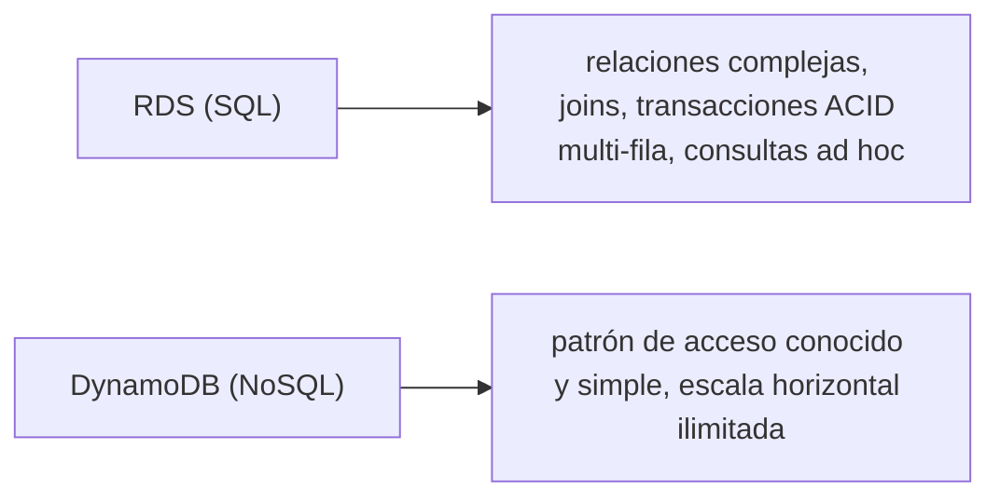
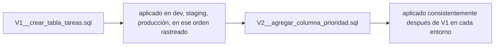

# Módulo 13: Bases de datos relacionales con RDS (PostgreSQL real)


## Aprende construyendo

### Tema 1: RDS Instance y cuándo elegir SQL sobre NoSQL

#### Paso 1 · Objetivo y preparación
Al finalizar vas a crear el esquema relacional real de facturación de RutaFlow, y a comprobar por qué DynamoDB (Módulo 4) no sería la elección correcta para este caso específico. Prerrequisitos: Módulo 4 completo.
#### Paso 2 · Contexto y caso real
Facturación necesita saber "todos los pagos de esta factura, y a qué cliente pertenece" — un join de tres tablas con integridad garantizada, algo que `ShipmentEvents` (clave simple shipmentId+sequence) no está diseñado para resolver.
#### Paso 3 · Teoría, modelo mental y analogía
Una base relacional es un libro contable con referencias cruzadas y reglas de integridad que la propia base impone, no que cada consulta tenga que verificar por su cuenta.
#### Paso 4 · Demostración guiada
```bash
aws rds create-db-instance --db-instance-identifier rutaflow-facturacion --db-instance-class db.t3.micro \
  --engine postgres --master-username admin --master-user-password admin123 --allocated-storage 20
aws rds wait db-instance-available --db-instance-identifier rutaflow-facturacion
psql -h localhost -U admin -d postgres -c "
CREATE TABLE clientes (id SERIAL PRIMARY KEY, nombre TEXT);
CREATE TABLE facturas (id SERIAL PRIMARY KEY, cliente_id INT REFERENCES clientes(id), shipment_id TEXT, monto NUMERIC);
CREATE TABLE pagos (id SERIAL PRIMARY KEY, factura_id INT REFERENCES facturas(id), monto NUMERIC);
"
```
Resultado esperado: las tres tablas se crean sin error, con `facturas.cliente_id` y `pagos.factura_id` como claves foráneas reales — Postgres va a rechazar cualquier fila que intente violar esas referencias, algo que DynamoDB nunca haría por sí solo.
#### Paso 5 · Práctica guiada
Pista: intentá `INSERT INTO pagos (factura_id, monto) VALUES (9999, 100);` (una `factura_id` que no existe) — ese es el fallo deliberado: `ERROR: insert or update on table "pagos" violates foreign key constraint`, la base de datos rechaza la fila antes de guardarla, sin que tu aplicación tuviera que validar manualmente que la factura existe.
#### Paso 6 · Práctica independiente
Insertá un cliente, una factura ligada a ese cliente y a un `shipment_id` real (por ejemplo `env-4471`, el mismo de `ShipmentEvents`), y un pago ligado a esa factura — y confirmá con un `JOIN` de las tres tablas que podés reconstruir "qué cliente pagó cuánto por qué envío" en una sola consulta.
#### Paso 7 · Cierre y evidencia
Entregá el esquema creado, el error de integridad del Paso 5 y el join exitoso del Paso 6; explicá por qué este caso concreto justifica RDS sobre DynamoDB aunque el resto de RutaFlow use DynamoDB. Siguiente paso: copias. Errores comunes: relaciones implícitas y transacciones incompletas. Fuente oficial: https://docs.aws.amazon.com/AmazonRDS/latest/UserGuide/Welcome.html.
**Conceptos clave:** relaciones estructuradas y consultas complejas frente a escala horizontal simple.

```bash
aws rds create-db-instance --db-instance-identifier mi-postgres --db-instance-class db.t3.micro --engine postgres --master-username admin --master-user-password admin123 --allocated-storage 20
aws rds wait db-instance-available --db-instance-identifier mi-postgres
```

`--db-instance-identifier` es el nombre con el que vas a referirte a esta instancia después; `--db-instance-class` es el tamaño de la máquina que la corre (CPU y memoria — `db.t3.micro` es la clase más pequeña); `--engine` elige el motor de base de datos (`postgres`, `mysql`...); `--master-username` y `--master-user-password` son las credenciales del usuario administrador inicial; `--allocated-storage` es cuánto disco (en GB) reserva la instancia. En resumen: `--master-username` es la bandera que fija el usuario administrador, `--master-user-password` es la bandera que fija su contraseña, y `--allocated-storage` es la bandera que fija el disco reservado.

RDS gestiona una base de datos relacional completa (PostgreSQL, MySQL, entre otros motores) como un servicio administrado: encargándose de parcheo, backups automáticos, y escalado vertical de la instancia subyacente, sin que el desarrollador tenga que gestionar manualmente un servidor de base de datos propio; a diferencia de cloud local corriendo servicios emulados en memoria para muchos otros servicios, al crear una instancia RDS, cloud local efectivamente levanta un PostgreSQL **real** (el mismo motor de base de datos que correría en producción), con la única diferencia práctica siendo el endpoint al que se conecta (local en vez del endpoint de AWS real), una fidelidad de emulación considerablemente mayor que la de servicios simulados con lógica interna propia distinta al servicio real.

Elegir RDS (SQL relacional) sobre DynamoDB (NoSQL, Módulo 4) es apropiado cuando la aplicación necesita relaciones complejas entre entidades (joins entre múltiples tablas), transacciones ACID estrictas que abarcan múltiples filas o tablas simultáneamente, o consultas ad hoc flexibles con predicados complejos no conocidos de antemano al momento de diseñar el esquema; DynamoDB sigue siendo preferible cuando el patrón de acceso a los datos es conocido de antemano y relativamente simple (consultas por clave), y se necesita escala horizontal prácticamente ilimitada sin gestión operativa, una decisión de arquitectura fundamental que determina buena parte del resto del diseño de una aplicación de backend.

**Analogía:** RDS es como contratar un archivo relacional completo con un bibliotecario profesional que gestiona backups y mantenimiento por su cuenta, apropiado cuando se necesitan consultas complejas que cruzan múltiples categorías de información (joins); DynamoDB es como un sistema de casilleros numerados de acceso instantáneo, ideal cuando siempre se sabe exactamente qué casillero específico se necesita consultar, sin necesidad de cruzar información entre casilleros distintos.

**¿Por qué es importante?** Elegir DynamoDB sobre RDS (o viceversa) depende de si la aplicación necesita relaciones complejas y consultas ad hoc flexibles (RDS) o patrones de acceso simples y conocidos con escala horizontal ilimitada (DynamoDB), una decisión arquitectónica fundamental.

**Diagrama:**



### Tema 2: Snapshots y restore

#### Paso 1 · Objetivo y preparación
Al finalizar vas a respaldar `rutaflow-facturacion` (Tema 1) y a restaurarlo como una instancia nueva, probando que el histórico de facturas sobrevive a un error humano. Prerrequisitos: Tema 1 de este módulo.
#### Paso 2 · Contexto y caso real
Un `DELETE` sin `WHERE` sobre `facturas` en producción no debería significar perder el historial contable para siempre — necesitás un punto de restauración probado, no solo "confiar" en que existe un backup automático.
#### Paso 3 · Teoría, modelo mental y analogía
Un snapshot es una fotografía fechada de toda la instancia; de nada sirve si nunca probaste que la foto realmente se puede revelar (restaurar).
#### Paso 4 · Demostración guiada
```bash
aws rds create-db-snapshot --db-instance-identifier rutaflow-facturacion --db-snapshot-identifier snap-facturacion-001
aws rds wait db-snapshot-available --db-snapshot-identifier snap-facturacion-001
aws rds restore-db-instance-from-db-snapshot --db-instance-identifier rutaflow-facturacion-restaurada --db-snapshot-identifier snap-facturacion-001
aws rds wait db-instance-available --db-instance-identifier rutaflow-facturacion-restaurada
psql -h localhost -U admin -d postgres -c "SELECT count(*) FROM facturas;"
```
Resultado esperado: la instancia restaurada (`rutaflow-facturacion-restaurada`) existe de forma completamente independiente, y el `SELECT count(*)` muestra la misma factura del Tema 1 — la instancia original nunca se tocó durante este proceso.
#### Paso 5 · Práctica guiada
Pista: probá `aws rds restore-db-instance-from-db-snapshot --db-instance-identifier otra-instancia --db-snapshot-identifier snap-que-no-existe` — ese es el fallo deliberado: `DBSnapshotNotFoundFault`, confirmando que un plan de recuperación que nunca se probó con un identificador real es indistinguible, en el momento de necesitarlo, de no tener backup en absoluto.
#### Paso 6 · Práctica independiente
Documentá, para `rutaflow-facturacion`, un RPO (cuántos datos podés permitirte perder: la ventana entre snapshots) y un RTO (cuánto tiempo real tomó este `restore` desde el Paso 4 hasta que la instancia quedó disponible) — con el tiempo real medido, no una estimación.
#### Paso 7 · Cierre y evidencia
Entregá el snapshot y restore exitosos del Paso 4, el error de snapshot inexistente del Paso 5, y el RPO/RTO documentados del Paso 6; explicá por qué un backup nunca probado no cuenta como plan de recuperación. Siguiente paso: migraciones. Errores comunes: backup sin restore probado y retención insuficiente. Fuente oficial: https://docs.aws.amazon.com/AmazonRDS/latest/UserGuide/CHAP_CommonTasks.BackupRestore.html.
**Conceptos clave:** copias de seguridad puntuales restaurables como una nueva instancia independiente.

```bash
aws rds create-db-snapshot --db-instance-identifier mi-postgres --db-snapshot-identifier snap-001
aws rds restore-db-instance-from-db-snapshot --db-instance-identifier mi-postgres-2 --db-snapshot-identifier snap-001
```

`--db-snapshot-identifier` es el nombre que le das a esa copia puntual, para poder referenciarla después al restaurar (como en el segundo comando, donde identifica de qué snapshot restaurar hacia la nueva instancia).

Un snapshot de RDS captura el estado completo de una instancia en un momento específico, permitiendo restaurarlo posteriormente como una instancia **nueva** e independiente (no sobrescribiendo la instancia original), lo que habilita casos de uso valiosos como recuperación ante desastres (restaurar a un punto anterior conocido y correcto tras una corrupción de datos accidental), clonar un entorno de producción hacia un entorno de pruebas con datos realistas sin afectar la instancia productiva original, o simplemente mantener puntos de restauración periódicos como parte de una estrategia de backup regular.

Esta capacidad de restaurar hacia una instancia nueva e independiente (en vez de una operación destructiva sobre la instancia existente) es una característica de diseño deliberada que previene que una restauración accidental o mal ejecutada afecte a un sistema en producción actualmente en uso, dado que la instancia original permanece intacta y disponible durante todo el proceso de restauración de la copia.

**Analogía:** un snapshot de RDS es como una fotografía completa de un archivo físico en un momento específico, que puede usarse posteriormente para reconstruir una copia idéntica completa de ese archivo en una ubicación nueva y separada, sin alterar en absoluto el archivo original que sigue existiendo y en uso durante todo el proceso.

**¿Por qué es importante?** Los snapshots permiten recuperación ante desastres y clonación de entornos hacia instancias nuevas e independientes, sin afectar la instancia original, una característica de diseño que previene que una restauración accidental dañe un sistema productivo en uso.

**Prueba en terminal:**

```bash
aws rds create-db-snapshot --db-instance-identifier mi-postgres --db-snapshot-identifier snap-001
aws rds restore-db-instance-from-db-snapshot --db-instance-identifier mi-postgres-2 --db-snapshot-identifier snap-001
# mi-postgres-2 es una instancia NUEVA e independiente; mi-postgres original permanece intacta
```

### Tema 3: Migrations

#### Paso 1 · Objetivo y preparación
Al finalizar vas a agregar una columna nueva a `facturas` (Tema 1) con una migración versionada, y a comprobar qué pasa si la corrés dos veces por accidente. Prerrequisitos: Tema 1 de este módulo.
#### Paso 2 · Contexto y caso real
RutaFlow necesita agregar `estado_pago` (`pendiente`/`pagada`) a `facturas`, una tabla que ya tiene datos reales en producción — no se puede simplemente borrar y recrear la tabla.
#### Paso 3 · Teoría, modelo mental y analogía
Una migración es una receta versionada y numerada que se aplica una sola vez y queda registrada, no un comando SQL suelto que alguien corrió manualmente y nadie más puede reproducir.
#### Paso 4 · Demostración guiada
```bash
psql -h localhost -U admin -d postgres -c "
CREATE TABLE IF NOT EXISTS migraciones_aplicadas (version INT PRIMARY KEY, aplicada_en TIMESTAMP DEFAULT now());
"
psql -h localhost -U admin -d postgres -c "
DO \$\$
BEGIN
  IF NOT EXISTS (SELECT 1 FROM migraciones_aplicadas WHERE version = 1) THEN
    ALTER TABLE facturas ADD COLUMN estado_pago TEXT DEFAULT 'pendiente';
    INSERT INTO migraciones_aplicadas (version) VALUES (1);
  END IF;
END \$\$;
"
```
Resultado esperado: `facturas` ahora tiene la columna `estado_pago`, y `migraciones_aplicadas` registra que la versión 1 ya se aplicó — cualquiera que corra este mismo script contra otro ambiente obtiene exactamente el mismo resultado.
#### Paso 5 · Práctica guiada
Pista: corré el mismo bloque `DO $$ ... END $$;` del Paso 4 una segunda vez SIN el `IF NOT EXISTS` de `migraciones_aplicadas` (quitalo mentalmente o probalo con un `ALTER TABLE facturas ADD COLUMN estado_pago TEXT` suelto) — ese es el fallo deliberado: `ERROR: column "estado_pago" of relation "facturas" already exists`. Una migración que no es idempotente rompe apenas alguien la corre dos veces por error.
#### Paso 6 · Práctica independiente
Escribí la migración de rollback correspondiente (`ALTER TABLE facturas DROP COLUMN estado_pago; DELETE FROM migraciones_aplicadas WHERE version = 1;`), y confirmá que después de aplicarla la tabla vuelve exactamente a su forma anterior al Tema 3.
#### Paso 7 · Cierre y evidencia
Entregá la migración idempotente del Paso 4, el error de columna duplicada del Paso 5, y el rollback del Paso 6; explicá por qué `migraciones_aplicadas` es lo que hace que la migración sea segura de reintentar. Siguiente paso: almacenamiento distribuido. Errores comunes: editar producción manualmente y no respaldar. Fuente oficial: https://docs.aws.amazon.com/AmazonRDS/latest/UserGuide/CHAP_BestPractices.html.
**Conceptos clave:** evolución versionada y reproducible del esquema, no cambios manuales ad hoc.

```sql
CREATE TABLE tareas (id SERIAL PRIMARY KEY, titulo TEXT, estado TEXT);
INSERT INTO tareas (titulo, estado) VALUES ('Mi tarea', 'pendiente');
```

Una migration es un cambio de esquema versionado y ejecutado de forma reproducible (típicamente mediante una herramienta de migraciones que rastrea qué cambios ya se aplicaron a una base de datos específica), en vez de ejecutar comandos SQL de modificación de esquema manualmente y de forma ad hoc directamente contra la base de datos de producción; esto es importante porque garantiza que el esquema de la base de datos evolucione de forma consistente y rastreable a través de distintos entornos (desarrollo, pruebas, producción) y a través del tiempo, con un historial claro de qué cambios se aplicaron y en qué orden, permitiendo además revertir un cambio problemático de forma controlada si fuera necesario.

Esta necesidad de gestionar la evolución del esquema de forma versionada es exactamente el mismo principio ya estudiado con Flyway en Spring Boot (Módulo 3 de ese track) y con las migraciones de Room en Android (Módulo 6 de ese track): sin un mecanismo formal de migraciones, cada entorno de despliegue podría terminar con un esquema ligeramente distinto e inconsistente entre sí, dependiendo de qué cambios manuales se aplicaron o se olvidaron aplicar en cada uno de ellos.

**Analogía:** una migration es como una bitácora de construcción versionada que documenta cada modificación estructural realizada a un edificio en un orden específico y verificable, permitiendo reconstruir exactamente el mismo edificio en una ubicación nueva siguiendo esa misma bitácora paso a paso, en vez de intentar replicar modificaciones ad hoc no documentadas de memoria.

**¿Por qué es importante?** Las migrations garantizan que el esquema de la base de datos evolucione de forma consistente y rastreable a través de distintos entornos y en el tiempo, evitando la inconsistencia de aplicar cambios manuales ad hoc no documentados directamente contra producción.

**Diagrama:**



---


## Laboratorio práctico

> Este laboratorio asume que ya ejecutaste `floci start` y `eval $(floci env)` (Módulo 1) en tu sesión de terminal, así que los comandos de `aws` no repiten `--endpoint-url`.

**Objetivo del laboratorio:** construir una API que usa RDS PostgreSQL como backend, con migraciones de esquema ejecutadas automáticamente.

**Requisitos previos:** Módulo 12 completado.

| Paso | Acción | Comando | Explicación |
|---|---|---|---|
| 1 | Crear una instancia RDS PostgreSQL | `aws rds create-db-instance ...` | Espera con `wait db-instance-available` |
| 2 | Conectarse con `psql` y crear una tabla | Ver Tema 1 | Operaciones SQL básicas |
| 3 | Tomar un snapshot | `aws rds create-db-snapshot` | Copia puntual |
| 4 | Restaurar desde el snapshot | `aws rds restore-db-instance-from-db-snapshot` | Instancia nueva e independiente |
| 5 | Conectarse desde Python con `psycopg2` | Ver Tema 1 | Integración con la aplicación |

**Verificación:** el laboratorio se considera exitoso si la API se conecta correctamente a RDS y ejecuta operaciones CRUD reales sobre PostgreSQL, y si la instancia restaurada desde el snapshot contiene exactamente los datos capturados en el momento de esa captura.

**Errores comunes y soluciones**

- **Elegir DynamoDB para un caso de uso que requiere joins complejos entre entidades.** Prefiere RDS para relaciones complejas y consultas ad hoc.
- **Aplicar cambios de esquema manualmente y sin versionar directamente contra producción.** Usa una herramienta de migraciones para consistencia rastreable entre entornos.
- **Restaurar un snapshot sobrescribiendo la instancia original en vez de crear una nueva.** RDS restaura hacia una instancia nueva e independiente por diseño; aprovecha esa seguridad.

---
