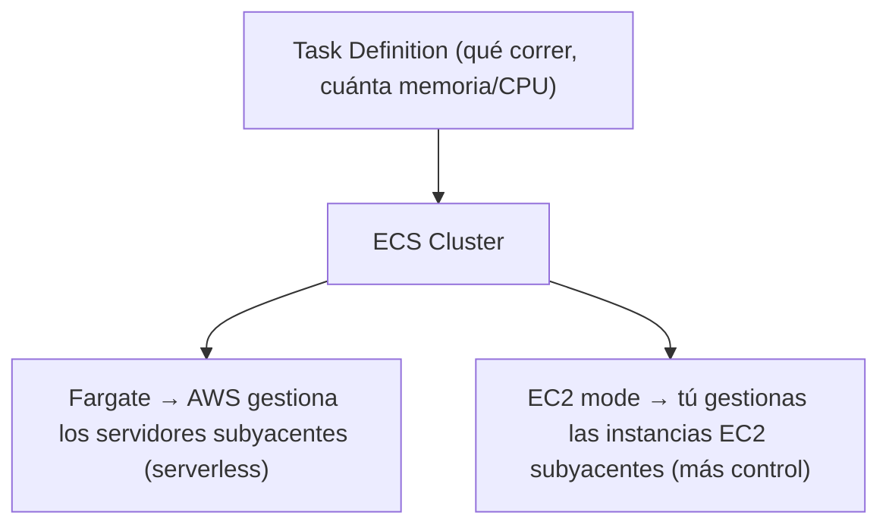
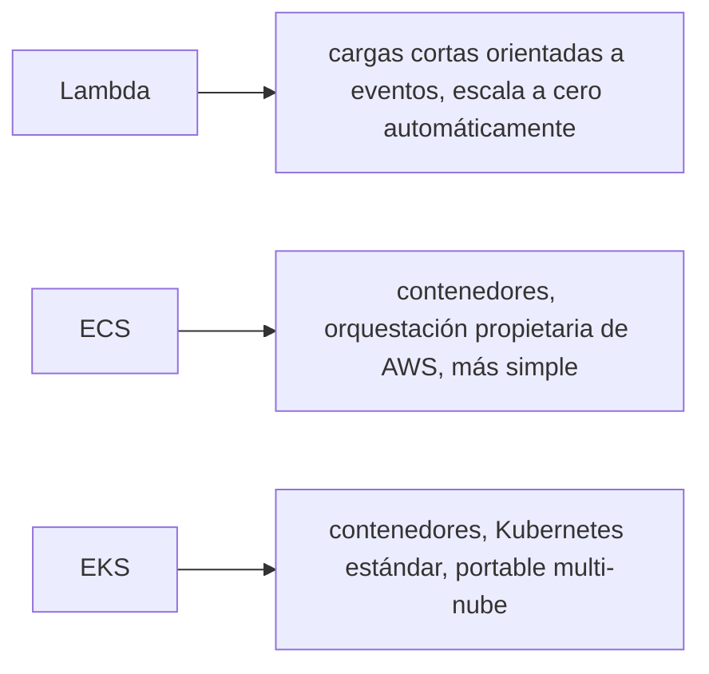

# Módulo 14: Contenedores: ECR, ECS y comparación con Cloud Run


## Aprende construyendo

### Tema 1: ECR y por qué no basta con Docker Hub

#### Paso 1 · Objetivo y preparación
Al finalizar podrás publicar imágenes privadas desde cero. Prerrequisitos: Docker y Node.js; verifica `node --version`.
#### Paso 2 · Contexto y caso real
Una imagen de producción debe tener acceso restringido y trazabilidad.
#### Paso 3 · Teoría, modelo mental y analogía
Un registro privado es almacén cerrado con identidad y auditoría.
#### Paso 4 · Demostración guiada
Crea `src/registry.js` desde una carpeta vacía.
```bash
mkdir ejemplo-registry-privado
node --version
```
Resultado esperado: Node disponible.
#### Paso 5 · Práctica guiada
Pista: intenta extraer sin permiso para provocar un fallo deliberado y corrígelo.
#### Paso 6 · Práctica independiente
Etiqueta, publica y verifica digest.
#### Paso 7 · Cierre y evidencia
Entrega policy, salida, fallo y corrección; explica el resultado. Siguiente paso: orquestación. Errores comunes: usar tags mutables y credenciales compartidas. Fuente oficial: https://docs.aws.amazon.com/AmazonECR/latest/userguide/what-is-ecr.html.
**Conceptos clave:** registro privado con control de acceso IAM integrado, no un registro público genérico.

```bash
docker build -t mi-api:latest .
aws ecr create-repository --repository-name mi-api
aws ecr get-login-password | docker login --username AWS --password-stdin localhost:4566
docker tag mi-api:latest localhost:4566/mi-api:latest && docker push localhost:4566/mi-api:latest
```

En esos comandos, `--repository-name` es el nombre del repositorio dentro de ECR (equivalente a un nombre de imagen en Docker Hub); `--password-stdin` le dice a `docker login` que lea la contraseña desde la entrada estándar (lo que le llega por la tubería `|` del comando anterior) en vez de pedirla interactiva o pasarla como texto plano en la terminal, y `--username` es el usuario con el que iniciás sesión en el registro (`AWS`, un valor fijo cuando te autenticás contra ECR). En resumen: `--password-stdin` es la bandera que hace que `docker login` lea la contraseña por la entrada estándar.

ECR es un registro de imágenes Docker (formato OCI, el estándar abierto de imágenes de contenedor que Docker Hub, ECR y otros registros comparten) privado y específicamente integrado con el control de acceso de IAM (Módulo 7): a diferencia de Docker Hub (un registro público orientado principalmente a imágenes de código abierto compartidas, aunque también ofrece repositorios privados), ECR permite definir políticas de acceso granulares directamente vía IAM sobre quién puede leer o escribir en cada repositorio específico, integrándose naturalmente con el resto de la infraestructura de permisos ya gestionada en la misma cuenta cloud, sin necesidad de gestionar credenciales separadas de un servicio de terceros externo a esa infraestructura.

Esta integración nativa con IAM es especialmente valiosa para imágenes que contienen código propietario de la empresa (no destinado a compartirse públicamente), donde el control de acceso granular y auditado es un requisito de seguridad, no solo una conveniencia operativa.

**Analogía:** ECR es como un almacén privado de una empresa con control de acceso vinculado directamente al sistema de credenciales corporativo existente, mientras Docker Hub es como un mercado público donde cualquiera puede publicar y consultar mercancía (con la opción de secciones privadas, pero gestionadas con un sistema de acceso separado del control interno de la empresa).

**¿Por qué es importante?** ECR ofrece control de acceso granular integrado nativamente con IAM sobre repositorios privados de imágenes, apropiado para código propietario que requiere ese nivel de control de acceso auditado, integrado con el resto de la infraestructura de permisos de la misma cuenta.

**Prueba en terminal:**

```bash
docker build -t mi-api:latest .
aws ecr create-repository --repository-name mi-api
docker push localhost:4566/mi-api:latest
```

### Tema 2: Task Definition y ECS Cluster

#### Paso 1 · Objetivo y preparación
Al finalizar podrás describir un workload orquestado desde cero. Prerrequisitos: Docker y Node.js; verifica `node --version`.
#### Paso 2 · Contexto y caso real
Una plataforma necesita reiniciar, escalar y actualizar contenedores.
#### Paso 3 · Teoría, modelo mental y analogía
La definición declarativa es un plano; el cluster mantiene el estado deseado.
#### Paso 4 · Demostración guiada
Crea `src/workload.yaml` desde una carpeta vacía.
```bash
mkdir ejemplo-workload
node --version
```
Resultado esperado: Node disponible.
#### Paso 5 · Práctica guiada
Pista: usa una imagen inexistente para provocar un fallo deliberado y corrígelo.
#### Paso 6 · Práctica independiente
Añade healthcheck y actualización gradual.
#### Paso 7 · Cierre y evidencia
Entrega YAML, salida, fallo y corrección; explica el resultado. Siguiente paso: elegir servicio. Errores comunes: estado manual y no definir límites. Fuente oficial: https://docs.aws.amazon.com/eks/latest/userguide/what-is-eks.html.
**Conceptos clave:** especificación declarativa de cómo ejecutar un contenedor, orquestada por un cluster.

```bash
aws ecs register-task-definition --family mi-api-task --container-definitions '[{"name":"mi-api","image":"localhost:4566/mi-api:latest","portMappings":[{"containerPort":3000}]}]'
aws ecs create-cluster --cluster-name mi-cluster
aws ecs run-task --cluster mi-cluster --task-definition mi-api-task
```

`--family` agrupa versiones sucesivas de la misma Task Definition bajo un nombre común; `--container-definitions` es el JSON que describe cada contenedor de la tarea (imagen, puertos, memoria...). Al crear el cluster, `--cluster-name` lo identifica; al correr la tarea, `--cluster` dice en qué cluster ejecutarla y `--task-definition` cuál definición usar. En resumen: `--family` es la bandera que agrupa versiones de la Task Definition, `--cluster-name` es la bandera que nombra el cluster al crearlo, `--cluster` es la bandera que elige el cluster al ejecutar, y `--task-definition` es la bandera que elige qué definición correr.

Un Task Definition especifica declarativamente cómo ejecutar uno o más contenedores relacionados como una unidad (qué imagen usar, qué puertos exponer, cuánta memoria y CPU asignar, variables de entorno), de forma conceptualmente similar a un `docker-compose.yml` pero gestionado por ECS en vez de por Docker Compose localmente; un ECS Cluster es el conjunto de recursos de cómputo (ya sea infraestructura EC2 gestionada explícitamente, o Fargate, el modo serverless donde AWS gestiona los servidores subyacentes de forma completamente transparente) sobre el cual ECS programa la ejecución efectiva de los tasks definidos.

Fargate (modo serverless) elimina completamente la necesidad de aprovisionar y gestionar instancias EC2 subyacentes para correr los contenedores, similar en espíritu a cómo Lambda elimina la gestión de servidores para funciones (Módulo 5), mientras que el modo EC2 tradicional da control más fino sobre el tipo específico de instancia subyacente (útil para cargas de trabajo con requisitos de hardware muy específicos, como GPUs), a costa de requerir gestión explícita de esas instancias por parte del equipo.

**Analogía:** un Task Definition es como el manifiesto de carga detallado de un envío (qué contiene, cuánto espacio necesita, requisitos especiales de manejo); un ECS Cluster es como el puerto de destino donde ese envío se despacha efectivamente, con Fargate siendo un servicio de despacho completamente gestionado (sin preocuparse por la infraestructura del puerto) y el modo EC2 siendo gestionar directamente la infraestructura portuaria propia con más control pero más responsabilidad operativa.

**¿Por qué es importante?** El Task Definition especifica declarativamente cómo ejecutar contenedores relacionados como unidad; Fargate elimina la gestión de servidores subyacentes de forma análoga a Lambda, mientras el modo EC2 da más control a costa de gestión operativa explícita.

**Diagrama:**



### Tema 3: Contenedores vs Lambda, y EKS

#### Paso 1 · Objetivo y preparación
Al finalizar podrás elegir una opción de cómputo desde cero. Prerrequisitos: Docker y Node.js; verifica `node --version`.
#### Paso 2 · Contexto y caso real
Una tarea breve no necesita la misma plataforma que un proceso persistente.
#### Paso 3 · Teoría, modelo mental y analogía
Elegir runtime es comparar taxi, alquiler y flota propia según uso.
#### Paso 4 · Demostración guiada
Crea `src/compute-choice.js` desde una carpeta vacía.
```bash
mkdir ejemplo-compute
node --version
```
Resultado esperado: Node disponible.
#### Paso 5 · Práctica guiada
Pista: asigna un servicio incompatible para provocar un fallo deliberado y corrígelo.
#### Paso 6 · Práctica independiente
Construye una matriz de duración, control y coste.
#### Paso 7 · Cierre y evidencia
Entrega decisión, salida, fallo y corrección; explica el resultado. Siguiente paso: seguridad operacional. Errores comunes: elegir por moda y olvidar observabilidad. Fuente oficial: https://aws.amazon.com/compute/.
**Conceptos clave:** elegir según duración, control de runtime y complejidad de la carga de trabajo.

Usar contenedores (ECS) sobre Lambda es apropiado cuando la carga de trabajo tiene una duración prolongada más allá de los límites de tiempo de ejecución de una función Lambda, requiere un control más fino sobre el entorno de ejecución (versiones específicas de librerías del sistema operativo, dependencias binarias particulares que no encajan bien en el modelo de runtime más restringido de Lambda), o cuando la aplicación ya está empaquetada como un contenedor por otras razones (por ejemplo, un mismo artefacto de contenedor que también corre en Kubernetes en otro contexto); Lambda sigue siendo preferible para cargas de trabajo cortas, orientadas a eventos, donde el modelo de escalado automático a cero (sin costo cuando no hay invocaciones) es especialmente valioso.

```bash
aws eks create-cluster --name dev-cluster --role-arn arn:aws:iam::000000000000:role/eks-role
aws eks update-kubeconfig --name dev-cluster
kubectl run nginx --image=nginx:alpine
```

`--role-arn` es la bandera que le da al cluster de EKS un rol de IAM con los permisos que necesita para operar (crear recursos, hablar con otros servicios); `--image` en el comando de `kubectl` es la imagen de contenedor que ese Pod va a correr. `kubectl` en sí es la herramienta de línea de comandos estándar de Kubernetes (no específica de AWS): con ella hablás con cualquier cluster de Kubernetes, sea EKS, GKE o uno local, una vez que `update-kubeconfig` configuró las credenciales de conexión.

EKS (Elastic Kubernetes Service) ofrece Kubernetes gestionado como alternativa a ECS, apropiado específicamente cuando el equipo ya tiene experiencia y tooling construido alrededor de Kubernetes (el estándar de facto de orquestación de contenedores multi-nube, estudiado en el track de DevOps), o necesita portabilidad explícita entre proveedores cloud usando exactamente las mismas herramientas y manifiestos de Kubernetes; ECS, en contraste, es una solución de orquestación específica y propietaria de AWS, más simple de operar si no se requiere esa portabilidad multi-nube o el ecosistema específico de herramientas de Kubernetes. Cloud Run en GCP ocupa un espacio conceptualmente intermedio, ofreciendo contenedores con un modelo de escalado serverless más cercano en experiencia a Lambda que a la gestión explícita de clusters de ECS/EKS.

**Analogía:** elegir entre Lambda y contenedores es como elegir entre contratar un especialista puntual para una tarea corta y específica (Lambda) frente a montar un taller completo con equipo propio para trabajos más prolongados o con requisitos muy particulares de herramientas (contenedores); EKS es como adoptar un estándar de gestión de talleres reconocido internacionalmente (Kubernetes) frente a un sistema de gestión propietario específico de un único proveedor (ECS).

**¿Por qué es importante?** Los contenedores son apropiados para cargas prolongadas o con requisitos de runtime específicos que Lambda no acomoda bien; EKS ofrece portabilidad vía el estándar Kubernetes, mientras ECS es más simple pero específico de AWS.

**Diagrama:**



---


## Laboratorio práctico

> Este laboratorio asume que ya ejecutaste `floci start` y `eval $(floci env)` (Módulo 1) en tu sesión de terminal, así que los comandos de `aws` no repiten `--endpoint-url`.

**Objetivo del laboratorio:** publicar una imagen Docker en ECR y ejecutarla como task en ECS.

**Requisitos previos:** Módulo 13 completado.

| Paso | Acción | Comando | Explicación |
|---|---|---|---|
| 1 | Construir la imagen Docker | `docker build -t mi-api:latest .` | Formato OCI |
| 2 | Crear el repositorio ECR y publicar la imagen | `aws ecr create-repository` + `docker push` | Registro privado |
| 3 | Registrar un Task Definition | `aws ecs register-task-definition` | Especificación declarativa |
| 4 | Crear un cluster y ejecutar el task | `aws ecs create-cluster` + `run-task` | Verifica con `docker ps` |
| 5 | Explorar EKS como alternativa | `aws eks create-cluster` + `kubectl run` | Compara con ECS |

**Verificación:** el laboratorio se considera exitoso si la imagen se publica correctamente en ECR, y si el task se ejecuta correctamente en el cluster ECS, verificable con `docker ps` mostrando el contenedor corriendo.

**Errores comunes y soluciones**

- **Usar Docker Hub para imágenes propietarias que requieren control de acceso granular vía IAM.** Usa ECR para esa integración nativa.
- **Elegir Lambda para una carga de trabajo de larga duración o con requisitos de runtime muy específicos.** Considera contenedores (ECS/EKS) para esos casos.
- **Elegir EKS sin necesidad real de portabilidad multi-nube o del ecosistema de Kubernetes.** ECS es más simple si esa portabilidad no es un requisito.

---
