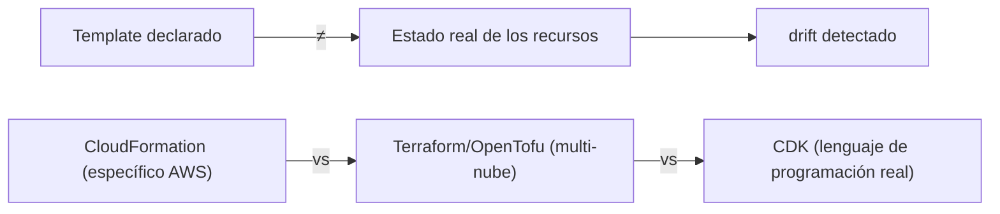

# Módulo 15: Infraestructura como código con CloudFormation


## Aprende construyendo

### Tema 1: Stack, Template y por qué no crear recursos manualmente con la CLI

#### Paso 1 · Objetivo y preparación
Al finalizar podrás declarar infraestructura desde cero. Prerrequisitos: Terraform y Docker; verifica `terraform --version`.
#### Paso 2 · Contexto y caso real
Una plataforma de entregas necesita repetir ambientes sin configurarlos a mano.
#### Paso 3 · Teoría, modelo mental y analogía
IaC es un plano versionado: el motor compara deseo y realidad.
#### Paso 4 · Demostración guiada
Crea `main.tf` desde una carpeta vacía.
```bash
mkdir ejemplo-terraform
terraform --version
```
Resultado esperado: Terraform disponible.
#### Paso 5 · Práctica guiada
Pista: declara un recurso inválido para provocar un fallo deliberado y corrígelo.
#### Paso 6 · Práctica independiente
Añade variables, outputs y un módulo.
#### Paso 7 · Cierre y evidencia
Entrega archivos, salida, fallo y corrección; explica el resultado. Siguiente paso: plan. Errores comunes: estado local perdido y secretos en variables. Fuente oficial: https://developer.hashicorp.com/terraform/docs.
**Conceptos clave:** estado deseado declarado una vez, reproducible y versionable.

```yaml
Resources:
  MiBucket:
    Type: AWS::S3::Bucket
  MiCola:
    Type: AWS::SQS::Queue
Outputs:
  NombreBucket:
    Value: !Ref MiBucket
```

```bash
aws cloudformation deploy --template-file stack-basico.yaml --stack-name mi-stack
```

(`terraform` es una herramienta de infraestructura como código, de HashiCorp, que este módulo usa para verificar tu entorno pero que no es la protagonista aquí — CloudFormation, el servicio nativo de IaC de AWS, sí lo es; volverás a Terraform con más detalle en el track de DevOps.) En los comandos de CloudFormation, `--template-file` es la ruta al archivo que declara los recursos deseados, y `--stack-name` es el nombre con el que identificás ese despliegue como unidad (para poder actualizarlo o borrarlo después).

Un template de CloudFormation declara el estado deseado de la infraestructura completa (qué recursos deben existir y cómo deben estar configurados) en un único archivo de texto versionable en el control de versiones junto al resto del código de la aplicación; un stack es la instancia desplegada de ese template, gestionada como una unidad completa por CloudFormation. Crear recursos manualmente con comandos individuales de la CLI (como se hizo en módulos anteriores para aprender cada servicio de forma aislada) funciona bien para exploración y aprendizaje, pero se vuelve insostenible para gestionar infraestructura real: no hay ningún registro versionado de qué comandos exactos se ejecutaron ni en qué orden, recrear la misma infraestructura en un entorno nuevo requiere repetir manualmente cada comando (propenso a errores de omisión), y no existe una forma sencilla de saber qué recursos pertenecen a qué sistema o pueden eliminarse de forma segura sin dejar recursos huérfanos.

CloudFormation resuelve todos estos problemas al tratar la infraestructura completa como una unidad versionada: el mismo template puede desplegarse de forma idéntica y reproducible en múltiples entornos (desarrollo, staging, producción), revisarse como cualquier otro cambio de código antes de fusionarse, y eliminarse por completo con un único comando que CloudFormation garantiza que limpia exactamente los recursos que él mismo creó, sin dejar residuos huérfanos ni requerir que un humano recuerde manualmente cada recurso individual a eliminar.

**Analogía:** un template de CloudFormation es como los planos arquitectónicos completos y versionados de un edificio, permitiendo reconstruir exactamente la misma estructura en cualquier terreno nuevo siguiendo esos planos exactos, en vez de intentar reproducir de memoria una construcción realizada previamente sin ningún plano documentado que la respalde.

**¿Por qué es importante?** CloudFormation ofrece infraestructura versionada, reproducible entre entornos, y con eliminación garantizada sin residuos huérfanos, ventajas concretas frente a crear y gestionar recursos manualmente con comandos individuales de la CLI sin ningún registro estructurado.

**Configuración del ejemplo:**

```yaml
Resources:
  MiBucket: { Type: AWS::S3::Bucket }
  MiCola: { Type: AWS::SQS::Queue }
Outputs:
  NombreBucket: { Value: !Ref MiBucket }
```

### Tema 2: Change sets

#### Paso 1 · Objetivo y preparación
Al finalizar podrás revisar un plan desde cero. Prerrequisitos: Terraform y Docker; verifica `terraform --version`.
#### Paso 2 · Contexto y caso real
Antes de cambiar producción necesitas conocer recursos que se crearán o destruirán.
#### Paso 3 · Teoría, modelo mental y analogía
Plan es ensayo general: muestra consecuencias sin tocar el escenario.
#### Paso 4 · Demostración guiada
Crea `main.tf` y `variables.tf` desde una carpeta vacía.
```bash
mkdir ejemplo-plan
terraform --version
```
Resultado esperado: Terraform disponible.
#### Paso 5 · Práctica guiada
Pista: modifica una variable para provocar un fallo deliberado de validación y corrígelo.
#### Paso 6 · Práctica independiente
Guarda plan y revisa cambios peligrosos.
#### Paso 7 · Cierre y evidencia
Entrega plan, salida, fallo y corrección; explica el resultado. Siguiente paso: drift. Errores comunes: aplicar sin revisar y no fijar versiones. Fuente oficial: https://developer.hashicorp.com/terraform/cli/commands/plan.
**Conceptos clave:** previsualizar el impacto exacto de un cambio antes de aplicarlo realmente.

```bash
aws cloudformation create-change-set --stack-name mi-stack --template-body file://stack-basico.yaml --change-set-name cambio-001
aws cloudformation describe-change-set --stack-name mi-stack --change-set-name cambio-001
aws cloudformation execute-change-set --stack-name mi-stack --change-set-name cambio-001
```

`--template-body` es una forma alternativa de pasar el template: en vez de una ruta de archivo (`--template-file`, Tema 1), `file://` seguido de la ruta le dice a la CLI que lea el contenido del archivo e incluya ese contenido directamente en la petición. `--change-set-name` identifica este cálculo de impacto en particular, para poder describirlo o ejecutarlo después sin volver a calcularlo. En resumen: `--change-set-name` es la bandera que nombra ese cálculo de impacto para referirte a él después.

Un change set calcula y muestra exactamente qué recursos serían creados, modificados o **eliminados** si se aplicara un template modificado, sin aplicar ese cambio todavía: revisar ese change set antes de ejecutarlo permite detectar consecuencias inesperadas de una modificación aparentemente inocua (por ejemplo, cambiar una propiedad de un recurso que CloudFormation solo puede aplicar destruyendo y recreando ese recurso desde cero, perdiendo potencialmente datos si es una base de datos), evitando aplicar un cambio destructivo sin haberlo anticipado explícitamente.

Esta capacidad de previsualización es especialmente crítica en infraestructura de producción, donde un cambio aparentemente menor en el template (modificar un parámetro que en realidad fuerza un reemplazo completo del recurso subyacente) podría causar una interrupción de servicio significativa o pérdida de datos si se aplicara directamente sin revisión previa; revisar el change set convierte ese riesgo implícito en una decisión explícita e informada antes de proceder.

**Analogía:** un change set es como una simulación de construcción que muestra exactamente qué partes de un edificio existente serían modificadas, agregadas o demolidas antes de que la maquinaria pesada real comience a trabajar, permitiendo detectar y cancelar un plan de demolición no intencionado antes de que ocurra de forma irreversible.

**¿Por qué es importante?** Revisar un change set antes de aplicarlo convierte el riesgo implícito de un cambio potencialmente destructivo (reemplazo completo de un recurso, pérdida de datos) en una decisión explícita e informada, evitando sorpresas al aplicar modificaciones de infraestructura en producción.

**Prueba en terminal:**

```bash
create-change-set   → calcula el impacto SIN aplicar el cambio
describe-change-set → revisa exactamente qué se crearía/modificaría/eliminaría
execute-change-set  → aplica el cambio YA revisado y aprobado
```

### Tema 3: Drift detection, Terraform/CDK, y compatibilidad multi-herramienta

#### Paso 1 · Objetivo y preparación
Al finalizar podrás detectar drift desde cero. Prerrequisitos: Terraform y Docker; verifica `terraform --version`.
#### Paso 2 · Contexto y caso real
Un cambio manual en consola puede dejar infraestructura fuera del control del repositorio.
#### Paso 3 · Teoría, modelo mental y analogía
Drift es una diferencia entre plano y edificio construido.
#### Paso 4 · Demostración guiada
Crea `main.tf` y `README.md` desde una carpeta vacía.
```bash
mkdir ejemplo-drift
terraform --version
```
Resultado esperado: Terraform disponible.
#### Paso 5 · Práctica guiada
Pista: cambia un recurso manualmente para provocar un fallo deliberado de convergencia y corrígelo.
#### Paso 6 · Práctica independiente
Documenta importación y reconciliación.
#### Paso 7 · Cierre y evidencia
Entrega diff, salida, fallo y corrección; explica el resultado. Siguiente paso: CI/CD. Errores comunes: aceptar cambios manuales y no proteger estado. Fuente oficial: https://developer.hashicorp.com/terraform/language/state.
**Conceptos clave:** detectar divergencia entre el estado declarado y el estado real.

Drift detection compara el estado actual real de los recursos desplegados contra el estado declarado en el template de CloudFormation, señalando cualquier divergencia (por ejemplo, si alguien modificó manualmente una configuración de un recurso directamente en la consola, fuera del proceso de CloudFormation, sin actualizar el template correspondiente); detectar ese drift es importante porque, sin esa verificación, el template deja de ser una fuente de verdad confiable sobre el estado real de la infraestructura, socavando precisamente el beneficio central de tratar la infraestructura como código versionado y reproducible.

Terraform (y su fork de código abierto OpenTofu) es una alternativa multi-nube a CloudFormation, usando su propio lenguaje declarativo (HCL) con el mismo concepto central de estado deseado (`plan` para previsualizar, análogo a un change set; `apply` para ejecutar), pero con la ventaja de poder gestionar recursos de múltiples proveedores cloud simultáneamente desde un único conjunto de archivos, mientras CloudFormation es específico de AWS; AWS CDK va un paso más allá, permitiendo definir infraestructura usando lenguajes de programación de propósito general reales (TypeScript, Python) en vez de YAML/JSON declarativo puro, generando CloudFormation por debajo, apropiado para equipos que prefieren la expresividad de un lenguaje de programación completo (bucles, funciones, abstracciones reutilizables) sobre la sintaxis más limitada de un template declarativo puro. Cloud local mantiene compatibilidad con todas estas herramientas (AWS CLI v2, los SDKs v2/v3, boto3, Go, Rust, y Terraform) precisamente porque emula las APIs reales de AWS, permitiendo practicar con cualquiera de estas herramientas exactamente como se usarían contra AWS real.

**Terraform y OpenTofu** comparten el flujo declarativo `plan`/`apply`; estudia ambos como opciones explícitas y verifica su compatibilidad con el proveedor y la versión usados en el laboratorio.

**Analogía:** drift detection es como una auditoría periódica que compara los planos oficiales archivados de un edificio contra su estado físico real, revelando cualquier modificación no documentada realizada fuera del proceso oficial de actualización de planos; Terraform es como un sistema de planificación arquitectónica universal aceptado por constructoras de distintos países (proveedores cloud), mientras CloudFormation es el sistema de planificación específico exigido únicamente por un país en particular (AWS).

**¿Por qué es importante?** Drift detection revela cuándo el estado real diverge del template declarado, preservando la confiabilidad de la infraestructura como código; Terraform/CDK ofrecen alternativas multi-nube o más expresivas respectivamente, y cloud local mantiene compatibilidad con todas ellas al emular las APIs reales.

**Diagrama:**



---


## Laboratorio práctico

> Este laboratorio asume que ya ejecutaste `floci start` y `eval $(floci env)` (Módulo 1) en tu sesión de terminal, así que los comandos de `aws` no repiten `--endpoint-url`.

**Objetivo del laboratorio:** construir un stack YAML que despliega S3 + SQS + DynamoDB + Lambda con un solo `aws cloudformation deploy`.

**Requisitos previos:** Módulo 14 completado.

| Paso | Acción | Comando | Explicación |
|---|---|---|---|
| 1 | Escribir el template con Resources y Outputs | Ver Tema 1 | S3 + SQS + DynamoDB |
| 2 | Desplegar el stack | `aws cloudformation deploy --template-file ... --stack-name mi-stack` | Un solo comando |
| 3 | Verificar los recursos creados | `aws cloudformation describe-stack-resources` | Confirma la creación |
| 4 | Crear, revisar y aplicar un change set | Ver Tema 2 | Con un parámetro nuevo |
| 5 | Destruir el stack completo | `aws cloudformation delete-stack` | Verifica que desaparecen todos los recursos |

**Verificación:** el laboratorio se considera exitoso si el stack completo se despliega y destruye con un único comando cada vez, sin dejar ningún recurso huérfano tras la destrucción, y si el change set revisado refleja correctamente el impacto del cambio antes de aplicarlo.

**Errores comunes y soluciones**

- **Crear recursos manualmente con la CLI para infraestructura de producción.** Usa CloudFormation (o Terraform) para reproducibilidad y versionado.
- **Aplicar un cambio de template sin revisar el change set primero.** Revisa siempre el change set para anticipar reemplazos destructivos.
- **Modificar recursos manualmente en la consola fuera del proceso de CloudFormation.** Provoca drift; usa drift detection para identificarlo y corregirlo.

---
