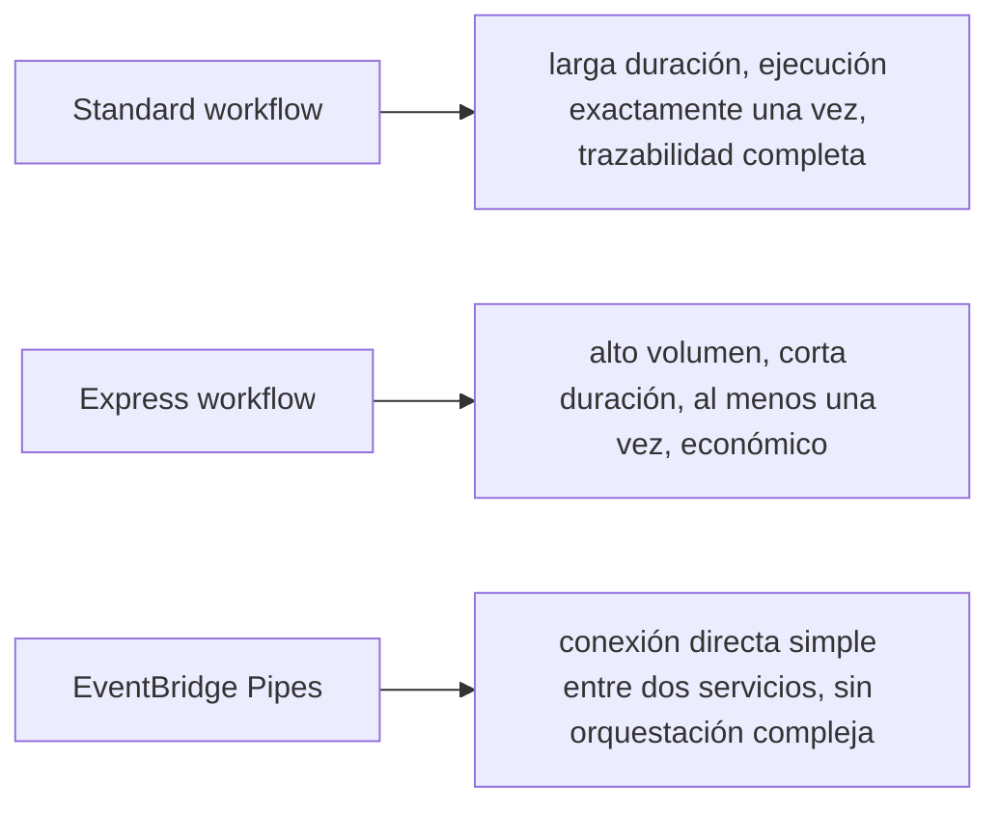

# Módulo 16: Orquestación de flujos con Step Functions


## Aprende construyendo

### Tema 1: State machine y Task states

#### Paso 1 · Objetivo y preparación
Al finalizar vas a declarar como state machine el mismo flujo que `confirmar-entrega` (Módulo 5) ya hace en código: validar, guardar el evento, notificar. Prerrequisitos: Módulos 5 y 11 completos.
#### Paso 2 · Contexto y caso real
Hoy, si `confirmar-entrega` falla a mitad de camino (guardó en `ShipmentEvents` pero no llegó a publicar en SNS), lo único que tenés son los logs de CloudWatch del Módulo 12 para reconstruir qué pasó — una state machine lo haría visible por diseño.
#### Paso 3 · Teoría, modelo mental y analogía
Una state machine es un tablero de estados con transiciones visibles: `ValidarComando → GuardarEvento → Notificar`, en vez de esa misma secuencia escondida dentro del código imperativo de una sola función.
#### Paso 4 · Demostración guiada
```bash
cat > maquina-confirmar.json <<'EOF'
{
  "StartAt": "GuardarEvento",
  "States": {
    "GuardarEvento": {
      "Type": "Task",
      "Resource": "arn:aws:states:::dynamodb:putItem",
      "Parameters": {"TableName": "ShipmentEvents", "Item": {"shipmentId": {"S.$": "$.shipmentId"}, "sequence": {"N": "1"}, "estado": {"S": "entregado"}}},
      "Next": "Notificar"
    },
    "Notificar": {
      "Type": "Task",
      "Resource": "arn:aws:states:::sns:publish",
      "Parameters": {"TopicArn": "arn:aws:sns:us-east-1:000000000000:rutaflow-envio-entregado", "Message.$": "$.shipmentId"},
      "End": true
    }
  }
}
EOF
aws stepfunctions create-state-machine --name ConfirmarEntregaFlow --definition file://maquina-confirmar.json --role-arn arn:aws:iam::000000000000:role/sfn-role
aws stepfunctions start-execution --state-machine-arn arn:aws:states:us-east-1:000000000000:stateMachine:ConfirmarEntregaFlow --input '{"shipmentId":"env-7001"}'
```
Resultado esperado: `describe-execution` sobre esa ejecución muestra claramente que pasó por `GuardarEvento` y después por `Notificar` — la misma secuencia que `confirmar-entrega` hace en código, ahora visible como un historial de transiciones, no como líneas de log dispersas.
#### Paso 5 · Práctica guiada
Pista: quitá el estado `Notificar` del JSON (dejá `GuardarEvento` con `"End": true`) y volvé a crear la state machine con otro nombre — ese es el fallo deliberado: el flujo "funciona" (guarda el evento), pero la notificación al cliente desaparece silenciosamente porque el estado que la ejecutaba nunca llegó a declararse.
#### Paso 6 · Práctica independiente
Agregale un `TimeoutSeconds: 10` al estado `GuardarEvento`, y documentá qué pasaría si DynamoDB tardara más de eso en responder (pista: Step Functions marcaría la ejecución como fallida por `States.Timeout`, no se quedaría esperando indefinidamente).
#### Paso 7 · Cierre y evidencia
Entregá la state machine completa ejecutándose, el estado faltante del Paso 5 y el timeout del Paso 6; explicá qué visibilidad ganaste frente a la misma lógica escrita como código imperativo en `confirmar-entrega`. Siguiente paso: errores. Errores comunes: estados sin timeout y efectos duplicados. Fuente oficial: https://docs.aws.amazon.com/step-functions/latest/dg/welcome.html.
**Conceptos clave:** flujo declarado explícitamente como una secuencia de estados, no código imperativo disperso.

```bash
aws stepfunctions create-state-machine --name FlujoTareas --definition file://maquina.json --role-arn arn:aws:iam::000000000000:role/sfn-role
aws stepfunctions start-execution --state-machine-arn arn:aws:states:us-east-1:000000000000:stateMachine:FlujoTareas --input '{"tarea":"001"}'
```

`--definition` es la bandera que apunta al archivo JSON que declara los estados y transiciones del flujo (el "diagrama" en formato Amazon States Language). Al arrancar una ejecución, `--state-machine-arn` identifica qué state machine ejecutar, e `--input` es el JSON con el que arranca esa ejecución en particular (los datos de esta tarea puntual, no la definición del flujo).

Una state machine define un flujo de trabajo completo como una secuencia explícita de estados declarados en JSON/YAML (`ValidarTarea → GuardarEnDynamoDB → EnviarNotificacion`), cada uno típicamente un Task state que invoca un servicio específico (una Lambda, una operación directa sobre DynamoDB o SNS mediante integraciones de servicio nativas); esto contrasta con la alternativa de coordinar la misma secuencia mediante código imperativo dentro de una única función Lambda que llama secuencialmente a cada servicio, un enfoque donde la lógica de orquestación (qué paso sigue a cuál, qué pasa si uno falla) queda implícita y dispersa dentro del código en vez de ser explícita y visualizable como un diagrama de flujo declarado.

Observar una ejecución específica con `describe-execution` muestra exactamente en qué estado se encuentra (o se detuvo) una invocación particular del flujo, con el historial completo de transiciones entre estados, una visibilidad operativa que sería considerablemente más difícil de reconstruir a partir únicamente de logs dispersos de una función Lambda monolítica que coordinara la misma lógica de forma imperativa.

**Analogía:** una state machine es como un diagrama de flujo formal y visual que documenta explícitamente cada paso de un proceso y sus transiciones, en vez de una descripción narrativa en prosa de esos mismos pasos incrustada dentro del código de una única función, donde la estructura del proceso completo es más difícil de visualizar de un vistazo.

**¿Por qué es importante?** Una state machine declara explícitamente la secuencia y lógica de un flujo de trabajo, ofreciendo visibilidad operativa clara sobre en qué estado se encuentra cada ejecución, en contraste con coordinar la misma lógica de forma imperativa dentro de una única función donde esa estructura queda implícita.

**Configuración del ejemplo:**

```json
{
  "StartAt": "ValidarTarea",
  "States": {
    "ValidarTarea": { "Type": "Task", "Resource": "arn:...", "Next": "GuardarEnDynamoDB" },
    "GuardarEnDynamoDB": { "Type": "Task", "Resource": "arn:...", "Next": "EnviarNotificacion" },
    "EnviarNotificacion": { "Type": "Task", "Resource": "arn:...", "End": true }
  }
}
```

### Tema 2: Choice state, Retry y Catch

#### Paso 1 · Objetivo y preparación
Al finalizar vas a agregarle a `ConfirmarEntregaFlow` (Tema 1) manejo explícito de errores: reintentar si DynamoDB está ocupado, y una rama de error que no oculte la causa. Prerrequisitos: Tema 1 de este módulo.
#### Paso 2 · Contexto y caso real
`GuardarEvento` puede fallar transitoriamente si `ShipmentEvents` está siendo throttled en un pico de tráfico — eso no debería tirar toda la ejecución a la basura sin intentarlo de nuevo, pero tampoco debería reintentar para siempre sin límite.
#### Paso 3 · Teoría, modelo mental y analogía
`Retry` y `Catch` son protocolos de contingencia declarados en el propio flujo: señales y salidas de emergencia visibles, no manejo de excepciones escondido dentro del código de cada función.
#### Paso 4 · Demostración guiada
```bash
cat > maquina-confirmar-v2.json <<'EOF'
{
  "StartAt": "GuardarEvento",
  "States": {
    "GuardarEvento": {
      "Type": "Task",
      "Resource": "arn:aws:states:::dynamodb:putItem",
      "Parameters": {"TableName": "ShipmentEvents", "Item": {"shipmentId": {"S.$": "$.shipmentId"}, "sequence": {"N": "1"}, "estado": {"S": "entregado"}}},
      "Retry": [{"ErrorEquals": ["DynamoDB.ProvisionedThroughputExceededException"], "IntervalSeconds": 2, "MaxAttempts": 3, "BackoffRate": 2}],
      "Catch": [{"ErrorEquals": ["States.ALL"], "Next": "RegistrarFalloEntrega"}],
      "Next": "Notificar"
    },
    "Notificar": {"Type": "Task", "Resource": "arn:aws:states:::sns:publish", "Parameters": {"TopicArn": "arn:aws:sns:us-east-1:000000000000:rutaflow-envio-entregado", "Message.$": "$.shipmentId"}, "End": true},
    "RegistrarFalloEntrega": {"Type": "Pass", "Result": {"motivo": "no se pudo guardar el evento tras reintentos"}, "End": true}
  }
}
EOF
aws stepfunctions update-state-machine --state-machine-arn arn:aws:states:us-east-1:000000000000:stateMachine:ConfirmarEntregaFlow --definition file://maquina-confirmar-v2.json
```
Resultado esperado: la definición se actualiza sin error — ahora un fallo transitorio de DynamoDB se reintenta hasta 3 veces con backoff exponencial antes de rendirse, y solo si los 3 reintentos fallan la ejecución cae en `RegistrarFalloEntrega`, nunca en silencio.
#### Paso 5 · Práctica guiada
Pista: corré una ejecución con un `shipmentId` que provoque un error no cubierto por `Retry` (por ejemplo, un `Item` mal formado que DynamoDB rechaza de inmediato con `DynamoDB.AmazonDynamoDBException`) — ese es el fallo deliberado: sin un `Catch` que cubra ese error específico (o `States.ALL`), la ejecución completa queda en estado `FAILED` sin ninguna rama de recuperación, perdiendo visibilidad de qué pasó exactamente.
#### Paso 6 · Práctica independiente
Agregá una rama de compensación real: que `RegistrarFalloEntrega` publique también en una cola SQS de reintentos manuales (`sqs:sendMessage` como integración directa) en vez de solo devolver un `Pass` con un motivo fijo, para que alguien pueda reprocesar esa entrega más tarde.
#### Paso 7 · Cierre y evidencia
Entregá el `Retry`/`Catch` agregados, el fallo sin cobertura del Paso 5, y la compensación real del Paso 6; explicá por qué `Catch: States.ALL` sin pensar qué hacer después solo oculta el error, no lo resuelve. Siguiente paso: elección de servicio. Errores comunes: Catch demasiado amplio y reintentos infinitos. Fuente oficial: https://docs.aws.amazon.com/step-functions/latest/dg/concepts-error-handling.html.
**Conceptos clave:** lógica condicional y manejo de errores declarados, no anidados en código imperativo.

Un Choice state enruta la ejecución hacia distintos estados siguientes según una condición evaluada sobre el input actual (por ejemplo, distinguir entre una tarea "urgente" y una "normal", dirigiendo cada una hacia una rama distinta del flujo con distinto tratamiento), expresando lógica condicional de forma declarativa dentro de la definición de la state machine misma, en vez de anidar esa lógica condicional dentro del código imperativo de una función coordinadora.

```json
"Retry": [{"ErrorEquals": ["States.TaskFailed"], "IntervalSeconds": 2, "MaxAttempts": 3, "BackoffRate": 2}]
"Catch": [{"ErrorEquals": ["States.ALL"], "Next": "EstadoDeError"}]
```

`Retry` declara reintentos automáticos ante un tipo específico de error, con backoff exponencial configurable (esperando progresivamente más tiempo entre reintentos sucesivos, el mismo patrón de resiliencia estudiado en Swift, Módulo 5 del track de iOS), sin que el desarrollador escriba manualmente ningún bucle de reintento imperativo; `Catch` declara hacia qué estado transicionar si un error específico (o cualquier error, con `States.ALL`) ocurre durante un Task state, permitiendo manejar fallos de forma explícita y visible directamente en la definición del flujo, en vez de depender de manejo de excepciones disperso e implícito dentro del código de cada función individual invocada por el flujo.

**Analogía:** un Choice state es como una bifurcación claramente señalizada en un mapa de proceso que indica exactamente qué condición dirige hacia cada camino posible; `Retry`/`Catch` declarados en la state machine son como protocolos de contingencia predefinidos y visibles en el manual de operaciones de un proceso, en vez de reglas de manejo de excepciones dispersas e implícitas que cada operador individual debe recordar aplicar por su cuenta.

**¿Por qué es importante?** `Choice` expresa lógica condicional de forma declarativa y visible en la definición del flujo; `Retry`/`Catch` declaran manejo de errores explícito (con backoff automático) sin código imperativo disperso, haciendo el comportamiento ante fallos parte visible de la definición del flujo mismo.

**Configuración del ejemplo:**

```json
"Retry": [{"ErrorEquals": ["States.TaskFailed"], "IntervalSeconds": 2, "MaxAttempts": 3, "BackoffRate": 2}],
"Catch": [{"ErrorEquals": ["States.ALL"], "Next": "EstadoDeError"}]
```

### Tema 3: Express vs Standard, y cuándo EventBridge Pipes es suficiente

#### Paso 1 · Objetivo y preparación
Al finalizar vas a decidir, con números reales, si `ConfirmarEntregaFlow` debería ser Standard o Express — y si el planificador de rutas (Módulo 14) necesita Step Functions en absoluto. Prerrequisitos: Módulo 14, Temas 1-2 de este módulo.
#### Paso 2 · Contexto y caso real
`ConfirmarEntregaFlow` corre miles de veces al día, dura menos de un segundo, y cada ejecución es casi idéntica; el planificador de rutas corre pocas veces al día, dura 20-30 minutos, y cada fallo necesita trazabilidad completa para auditoría. No son el mismo caso de uso.
#### Paso 3 · Teoría, modelo mental y analogía
Elegir Standard vs Express es comparar un expediente administrativo completo (Standard) con un proceso ágil de alto volumen (Express); EventBridge Pipes es un cable directo cuando ni siquiera hace falta un panel de control.
#### Paso 4 · Demostración guiada
```bash
aws stepfunctions create-state-machine --name ConfirmarEntregaFlow --type EXPRESS \
  --definition file://maquina-confirmar-v2.json --role-arn arn:aws:iam::000000000000:role/sfn-role
```
Resultado esperado: se crea sin error — `ConfirmarEntregaFlow` encaja perfecto en Express (dura segundos, corre miles de veces), mucho más barato por ejecución que Standard para este volumen.
#### Paso 5 · Práctica guiada
Pista: ese es justo el fallo deliberado de coste que advierte este Tema — si hubieras creado `ConfirmarEntregaFlow` como `--type STANDARD` (el tipo por defecto si no especificás `--type`), pagarías por transición de estado en un flujo de altísima frecuencia y corta duración, el peor caso de uso para Standard. Corregilo siempre especificando `--type EXPRESS` para este flujo específico.
#### Paso 6 · Práctica independiente
Para el planificador de rutas del Módulo 14 (larga duración, baja frecuencia, necesita auditoría completa si falla a mitad de camino), razoná por qué Standard es la elección correcta ahí, exactamente al revés que para `ConfirmarEntregaFlow` — y por qué, si el planificador fuera solo "leer de una cola y mandar a una Lambda sin ninguna condición", ni siquiera necesitaría Step Functions: EventBridge Pipes alcanzaría.
#### Paso 7 · Cierre y evidencia
Entregá `ConfirmarEntregaFlow` creado como Express, el riesgo de coste de usar Standard por defecto del Paso 5, y la justificación opuesta para el planificador del Paso 6; explicá qué pregunta (duración y frecuencia) decide entre los tres. Siguiente paso: eventos. Errores comunes: orquestar todo y no medir latencia. Fuente oficial: https://aws.amazon.com/step-functions/.
**Conceptos clave:** elegir según duración y frecuencia de ejecución, o simplificar si no se necesita orquestación compleja.

Standard workflows están diseñados para flujos de larga duración (hasta un año) con garantía de ejecución exactamente una vez y un historial de ejecución detallado y persistente, apropiado para procesos de negocio críticos donde la trazabilidad completa importa; Express workflows están optimizados para flujos de alto volumen y corta duración (hasta cinco minutos), con un modelo de ejecución "al menos una vez" (potencialmente duplicada en casos raros) y un costo considerablemente menor por ejecución, apropiado para procesar eventos de alta frecuencia donde la trazabilidad exhaustiva de Standard no es tan crítica como el costo y el throughput.

Cuando la necesidad real es simplemente conectar dos servicios de forma directa sin lógica condicional compleja, reintentos elaborados, ni múltiples pasos coordinados (por ejemplo, simplemente enviar cada mensaje de una cola SQS directamente hacia una Lambda sin ninguna transformación u orquestación intermedia), EventBridge Pipes ofrece esa conexión directa de forma considerablemente más simple y económica que definir una state machine completa de Step Functions para un caso que no requiere ese nivel de orquestación; reservar Step Functions específicamente para casos que genuinamente necesitan lógica condicional, reintentos declarativos complejos, o coordinación de múltiples pasos secuenciales o paralelos evita la sobre-ingeniería de introducir una herramienta de orquestación completa donde una conexión simple sería suficiente.

**Analogía:** elegir entre Standard y Express es como elegir entre un proceso administrativo formal con expediente completo archivado (Standard, para trámites críticos que requieren trazabilidad total) y un proceso ágil de alto volumen con menor formalidad de registro (Express, para trámites rutinarios de bajo riesgo); EventBridge Pipes frente a Step Functions es como elegir un cable directo simple entre dos dispositivos en vez de instalar un panel de control completo con lógica programable cuando la necesidad real es simplemente conectar A con B sin ninguna condición intermedia.

**¿Por qué es importante?** Elegir entre Standard (trazabilidad completa, larga duración) y Express (alto volumen, económico) depende de los requisitos específicos del flujo; EventBridge Pipes es suficiente y más simple cuando no se necesita lógica condicional ni coordinación de múltiples pasos, evitando sobre-ingeniería.

**Diagrama:**



---


## Laboratorio práctico

> Este laboratorio asume que ya ejecutaste `floci start` y `eval $(floci env)` (Módulo 1) en tu sesión de terminal, así que los comandos de `aws` no repiten `--endpoint-url`.

**Objetivo del laboratorio:** construir un flujo de procesamiento de tareas con validación, guardado, notificación y manejo de errores.

**Requisitos previos:** Módulo 15 completado.

| Paso | Acción | Comando | Explicación |
|---|---|---|---|
| 1 | Escribir la state machine con estados secuenciales | Ver Tema 1 | ValidarTarea → Guardar → Notificar |
| 2 | Crear e iniciar una ejecución | `aws stepfunctions create-state-machine` + `start-execution` | Observa con `describe-execution` |
| 3 | Agregar un Choice state | Ver Tema 2 | Enruta según tipo de tarea |
| 4 | Configurar Retry y Catch | Ver Tema 2 | Manejo declarativo de errores |
| 5 | Comparar con EventBridge Pipes | Ver Tema 3 | ¿Cuándo sería suficiente? |

**Verificación:** el laboratorio se considera exitoso si la ejecución completa el flujo correctamente para el caso feliz, y si el manejo de Retry/Catch responde correctamente ante un fallo simulado en uno de los estados.

**Errores comunes y soluciones**

- **Coordinar un flujo complejo con código imperativo disperso en una función monolítica.** Considera declarar el flujo con Step Functions para visibilidad y manejo de errores explícito.
- **Usar Standard workflows para eventos de alto volumen y corta duración.** Considera Express, más económico para ese caso.
- **Introducir Step Functions para una simple conexión directa entre dos servicios sin lógica condicional.** Considera EventBridge Pipes, más simple para ese caso.

---
