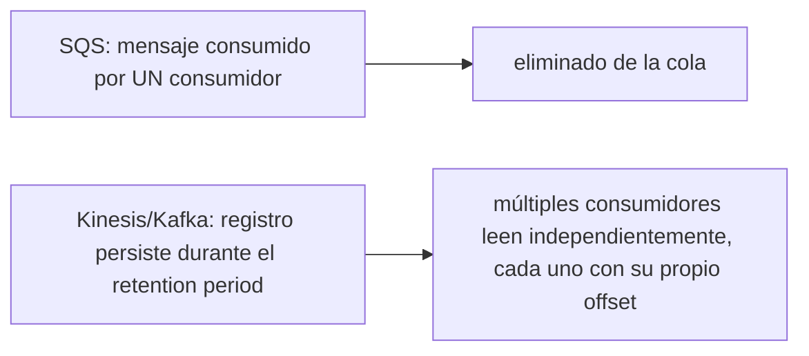
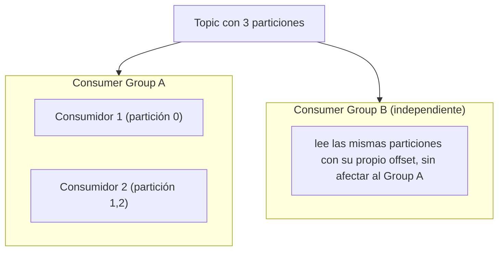
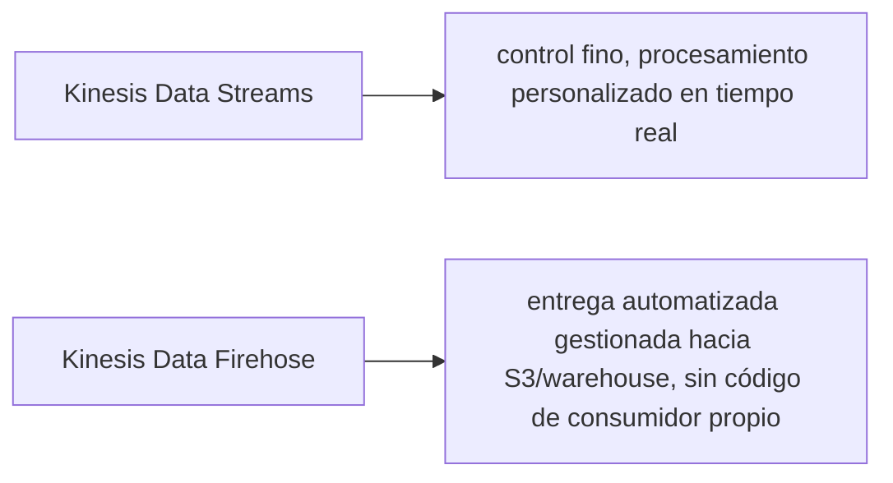

# Módulo 17: Streaming: Kinesis, MSK (Kafka) y Pub/Sub avanzado


## Aprende construyendo

### Tema 1: Streams vs colas

#### Paso 1 · Objetivo y preparación
Al finalizar vas a transmitir la ubicación GPS real de un conductor de RutaFlow por un stream que dos consumidores distintos leen de forma independiente. Prerrequisitos: Módulo 4 completo.
#### Paso 2 · Contexto y caso real
La ubicación de un conductor debe alimentar el mapa en vivo del cliente Y un proceso de analítica de rutas al mismo tiempo — con SQS (Módulo 3), solo uno de los dos podría leer cada ping antes de que desapareciera de la cola.
#### Paso 3 · Teoría, modelo mental y analogía
Un stream de Kinesis es un cuaderno append-only: cada lector lo recorre a su propio ritmo sin borrar nada para los demás, a diferencia de una cola SQS donde leer un mensaje lo retira.
#### Paso 4 · Demostración guiada
```bash
aws kinesis create-stream --stream-name rutaflow-ubicacion-conductores --shard-count 1
aws kinesis put-record --stream-name rutaflow-ubicacion-conductores --partition-key conductor-c891 --data $(echo -n '{"conductorId":"c-891","lat":4.6097,"lon":-74.0817}' | base64)
SHARD_ID=$(aws kinesis describe-stream --stream-name rutaflow-ubicacion-conductores --query 'StreamDescription.Shards[0].ShardId' --output text)
ITERATOR=$(aws kinesis get-shard-iterator --stream-name rutaflow-ubicacion-conductores --shard-id "$SHARD_ID" --shard-iterator-type TRIM_HORIZON --query ShardIterator --output text)
aws kinesis get-records --shard-iterator "$ITERATOR"
```
Resultado esperado: `get-records` devuelve el ping GPS que publicaste, con su `Data` codificado en base64 — ese mismo registro va a seguir disponible para un segundo consumidor completamente distinto que lea el stream con su propio iterador.
#### Paso 5 · Práctica guiada
Pista: pedí un nuevo iterador con `--shard-iterator-type LATEST` (en vez de `TRIM_HORIZON`) después de publicar un segundo ping — ese es el fallo deliberado: un consumidor que "reinicia" sin guardar su posición anterior y usa `LATEST` se salta todo lo publicado antes de pedir ese iterador nuevo, perdiendo pings de ubicación que sí estaban disponibles.
#### Paso 6 · Práctica independiente
Pedí un segundo iterador independiente con `TRIM_HORIZON` (simulando el consumidor de analítica, separado del mapa en vivo) y confirmá que lee exactamente los mismos registros desde el principio, sin que el primer consumidor haya "gastado" ninguno.
#### Paso 7 · Cierre y evidencia
Entregá el ping leído con `TRIM_HORIZON`, el ping perdido por `LATEST` del Paso 5, y la lectura independiente del Paso 6; explicá por qué SQS no podría alimentar dos consumidores independientes con el mismo ping. Siguiente paso: offsets. Errores comunes: borrar eventos y confundir stream con cola. Fuente oficial: https://docs.aws.amazon.com/streams/latest/dev/introduction.html.
**Conceptos clave:** un registro persistente leído por múltiples consumidores independientes, no un mensaje que se elimina al consumirse.

```bash
aws kinesis create-stream --stream-name mi-stream --shard-count 2
aws kinesis put-record --stream-name mi-stream --partition-key user-001 --data $(echo -n "evento-1" | base64)
```

`--stream-name` es la bandera que identifica el stream; `--shard-count` es la bandera que fija cuántos shards tiene al crearlo (más shards, más capacidad de escritura/lectura en paralelo — el concepto se explica abajo). Al escribir un registro, `--partition-key` es la bandera que decide a qué shard va ese registro (mismo valor de partition key → mismo shard, preservando orden entre ellos) y `--data` es el contenido del registro, codificado en base64 porque Kinesis lo trata como datos binarios opacos.

Kinesis (y Kafka de forma conceptualmente similar) retiene los registros publicados durante un período de retención configurado (hasta 7 días en Kinesis, comparado con hasta 14 días en SQS), y **múltiples consumidores independientes pueden leer el mismo stream completo, cada uno manteniendo su propia posición de lectura (offset) sin afectar a los demás consumidores**; esto contrasta fundamentalmente con SQS, donde un mensaje se elimina de la cola una vez que un consumidor lo procesa exitosamente, de modo que dos consumidores distintos compiten por los mismos mensajes en vez de poder leer independientemente el stream completo desde su propio punto de referencia.

Un shard es la unidad de capacidad de un stream de Kinesis (cada shard soporta un throughput específico de escritura y lectura); la `partition-key` determina a qué shard específico se enruta cada registro (registros con la misma partition key van consistentemente al mismo shard, preservando el orden relativo entre ellos), de forma análoga al concepto de partición en Kafka, donde el orden se garantiza dentro de una partición específica, no a través del stream completo.

**Analogía:** una cola SQS es como una fila de atención al público donde cada solicitud es atendida por un único empleado y luego desaparece de la fila; un stream de Kinesis/Kafka es como una grabación de video que múltiples espectadores independientes pueden reproducir desde el punto donde cada uno se quedó, sin que un espectador "consuma" o elimine el video para los demás.

**¿Por qué es importante?** Kinesis/Kafka permiten que múltiples consumidores independientes lean el mismo stream completo manteniendo su propia posición, a diferencia de SQS donde un mensaje se elimina al ser consumido por un único consumidor competitivo, una diferencia fundamental de modelo que determina cuándo cada uno es la herramienta correcta.

**Diagrama:**



### Tema 2: MSK (Kafka gestionado) y consumer groups

#### Paso 1 · Objetivo y preparación
Al finalizar vas a modelar el mismo topic de ubicaciones del Tema 1 sobre MSK, con dos consumer groups independientes (mapa en vivo y alertas de desvío). Prerrequisitos: Tema 1 de este módulo.
#### Paso 2 · Contexto y caso real
El grupo "mapa-en-vivo" y el grupo "alertas-desvio" deben procesar los mismos pings de ubicación de forma completamente aislada — si uno se reinicia, no debería perder su propio progreso ni afectar al otro.
#### Paso 3 · Teoría, modelo mental y analogía
El offset es un separador que marca hasta dónde leyó cada consumer group específico, no un marcador global del topic ni por consumidor individual aislado.
#### Paso 4 · Demostración guiada
```bash
aws kafka create-cluster --cluster-name rutaflow-ubicacion-kafka \
  --broker-node-group-info '{"InstanceType":"kafka.m5.large","ClientSubnets":["subnet-local"]}' \
  --number-of-broker-nodes 1 --kafka-version "3.5.1"
kafka-topics.sh --create --topic ubicacion-conductores --bootstrap-server localhost:9092
kafka-console-consumer.sh --topic ubicacion-conductores --group mapa-en-vivo --bootstrap-server localhost:9092 --from-beginning --max-messages 1
kafka-consumer-groups.sh --describe --group mapa-en-vivo --bootstrap-server localhost:9092
```
Resultado esperado: `--describe` muestra el offset actual del grupo `mapa-en-vivo` para el topic `ubicacion-conductores` — ese número es exclusivo de ese grupo, ningún otro grupo lo comparte ni lo modifica.
#### Paso 5 · Práctica guiada
Pista: corré `kafka-consumer-groups.sh --reset-offsets --group mapa-en-vivo --topic ubicacion-conductores --to-offset 0 --execute --bootstrap-server localhost:9092` por error (pensando que afectaría solo mensajes nuevos) — ese es el fallo deliberado: el grupo entero vuelve a leer desde el principio del topic en su próxima lectura, reprocesando pings de ubicación que el mapa en vivo ya había mostrado hace rato.
#### Paso 6 · Práctica independiente
Creá el grupo `alertas-desvio` leyendo el mismo topic `ubicacion-conductores`, confirmá con `kafka-consumer-groups.sh --describe --group alertas-desvio` que su offset es completamente independiente del de `mapa-en-vivo` (incluso después del reset accidental del Paso 5), y documentá por qué eso es exactamente lo que se espera.
#### Paso 7 · Cierre y evidencia
Entregá el offset por grupo del Paso 4, el reset accidental del Paso 5 y la independencia confirmada en el Paso 6; explicá por qué un offset compartido entre grupos rompería el aislamiento que este Tema busca demostrar. Siguiente paso: Firehose. Errores comunes: compartir offset entre grupos y no hacer commit. Fuente oficial: https://docs.aws.amazon.com/kinesis/latest/dev/key-concepts.html.
**Conceptos clave:** posición de lectura persistida por grupo de consumidores, no por consumidor individual aislado.

```bash
aws kafka create-cluster --cluster-name mi-kafka --broker-node-group-info '{"InstanceType":"kafka.m5.large", ...}' --number-of-broker-nodes 1 --kafka-version "3.5.1"
```

`--cluster-name` identifica el cluster de MSK; `--broker-node-group-info` describe el hardware de los brokers (los servidores que forman el cluster de Kafka — acá, su tipo de instancia); `--number-of-broker-nodes` es cuántos brokers levantar; `--kafka-version` fija qué versión del motor Kafka correr. En resumen: `--broker-node-group-info` es la bandera que define el hardware de los brokers, `--number-of-broker-nodes` es la bandera que fija cuántos brokers levantar, y `--kafka-version` es la bandera que fija la versión del motor.

MSK (Managed Streaming for Kafka) gestiona un cluster de Kafka real como servicio administrado, ahorrando la operación manual de brokers Kafka propios; un consumer group es un conjunto de consumidores que colaboran para procesar las particiones de un topic de Kafka, cada partición asignada exclusivamente a un único consumidor dentro de ese grupo específico en un momento dado (permitiendo paralelizar el procesamiento entre múltiples consumidores del mismo grupo), mientras que el offset (la posición de lectura) se rastrea por consumer group, permitiendo que un consumidor que se reinicia recupere su posición exacta de lectura anterior dentro de ese grupo, sin reprocesar mensajes ya consumidos ni saltarse mensajes pendientes.

Un consumer group existe precisamente para permitir escalar horizontalmente el procesamiento de un stream de alto volumen distribuyendo las particiones entre múltiples instancias de consumidor que trabajan en paralelo dentro del mismo grupo lógico, mientras distintos consumer groups completamente independientes pueden leer el mismo topic de forma totalmente aislada entre sí (por ejemplo, un grupo procesa eventos para analítica mientras otro grupo completamente separado los procesa para notificaciones, sin que ninguno de los dos afecte la posición de lectura del otro).

**Analogía:** un consumer group es como un equipo de trabajadores que se dividen las secciones de un archivo extenso para procesarlo en paralelo, cada trabajador recordando exactamente hasta dónde llegó en su sección asignada específica, de modo que si un trabajador se detiene y reanuda su tarea más tarde, continúa exactamente desde donde se quedó sin repetir ni saltarse trabajo, sin interferir con otros equipos completamente distintos que procesan el mismo archivo original con un propósito diferente.

**¿Por qué es importante?** El offset rastreado por consumer group permite que un consumidor que se reinicia recupere exactamente su posición de lectura anterior sin reprocesar ni saltarse mensajes, y permite paralelizar el procesamiento entre múltiples consumidores del mismo grupo mientras distintos grupos leen el mismo topic de forma completamente independiente.

**Diagrama:**



### Tema 3: Kinesis Data Streams vs Firehose, y GCP Managed Kafka

#### Paso 1 · Objetivo y preparación
Al finalizar vas a decidir qué parte del flujo de ubicaciones de RutaFlow necesita Kinesis Data Streams y cuál puede resolverse con Firehose. Prerrequisitos: Tema 1 de este módulo.
#### Paso 2 · Contexto y caso real
Las alertas de desvío (Tema 2) necesitan procesamiento inmediato con lógica propia sobre cada ping; el histórico de ubicaciones para auditoría solo necesita terminar guardado en S3, sin ninguna lógica personalizada en el camino.
#### Paso 3 · Teoría, modelo mental y analogía
Kinesis Data Streams da control fino sobre cada registro; Firehose es una cinta transportadora que entrega automáticamente hacia un destino, sin que escribas código de consumidor.
#### Paso 4 · Demostración guiada
```bash
aws s3 mb s3://rutaflow-ubicaciones-historico
aws firehose create-delivery-stream --delivery-stream-name ubicaciones-a-s3 \
  --s3-destination-configuration RoleARN=arn:aws:iam::000000000000:role/firehose-role,BucketARN=arn:aws:s3:::rutaflow-ubicaciones-historico
aws firehose put-record --delivery-stream-name ubicaciones-a-s3 --record Data=$(echo -n '{"conductorId":"c-891","lat":4.6097,"lon":-74.0817}' | base64)
```
Resultado esperado: el registro queda en el buffer de Firehose y, pasado el intervalo de buffering configurado, aparece como un objeto nuevo en `rutaflow-ubicaciones-historico` — sin que hayas escrito ninguna función que leyera el stream y lo copiara a mano.
#### Paso 5 · Práctica guiada
Pista: probá `aws firehose create-delivery-stream --delivery-stream-name ubicaciones-invalido --s3-destination-configuration RoleARN=arn:aws:iam::000000000000:role/rol-sin-permiso-s3,BucketARN=arn:aws:s3:::rutaflow-ubicaciones-historico` con un rol que nunca tuvo permiso de escritura sobre ese bucket — ese es el fallo deliberado: Firehose acepta registros pero nunca logra entregarlos al destino, acumulando errores de entrega en silencio hasta que alguien revisa las métricas de Firehose.
#### Paso 6 · Práctica independiente
Construí una tabla de dos filas (alertas de desvío del Tema 2 / histórico de este Tema) con tres columnas (¿necesita lógica personalizada por registro?, latencia tolerable, mantenimiento del consumidor) y completala para justificar por qué una usa Kinesis Data Streams y la otra Firehose.
#### Paso 7 · Cierre y evidencia
Entregá la entrega exitosa a S3 del Paso 4, el fallo de permisos del Paso 5, y la tabla comparativa del Paso 6; explicá la misma distinción "control fino vs conveniencia gestionada" que ya viste entre contenedores y Lambda en el Módulo 14. Siguiente paso: analytics. Errores comunes: ignorar buffering y coste por destino. Fuente oficial: https://docs.aws.amazon.com/firehose/latest/dev/what-is-this-service.html.
**Conceptos clave:** streaming de bajo nivel con control fino frente a entrega automatizada hacia un destino final.

Kinesis Data Streams (lo estudiado en este módulo) da control de bajo nivel sobre cómo se leen y procesan los registros, apropiado cuando la aplicación necesita lógica de procesamiento personalizada en tiempo real sobre cada evento; Kinesis Data Firehose, en cambio, es un servicio de entrega completamente gestionado que automáticamente transporta registros desde un stream hacia un destino final (S3, un data warehouse, un servicio de búsqueda) con transformaciones opcionales configurables, sin que el desarrollador escriba código de consumidor personalizado para ese caso de uso específico de "simplemente mover datos de A a B con alguna transformación estándar", una distinción similar a la de "control fino vs conveniencia gestionada" ya vista entre EC2/contenedores y Lambda.

GCP Managed Kafka (basado en Redpanda, una implementación compatible con el protocolo de Kafka) ofrece un servicio conceptualmente equivalente en el ecosistema GCP, reforzando que streaming de alto volumen con consumer groups y particiones es un patrón universal de la industria, disponible con implementaciones específicas en cada proveedor cloud mayor, aunque los detalles operativos y de API varíen entre ellos.

**Analogía:** Kinesis Data Streams es como recibir directamente el flujo de correspondencia entrante para procesarla personalmente según reglas propias específicas; Kinesis Data Firehose es como contratar un servicio de reenvío automático que entrega esa misma correspondencia directamente a un archivo final predeterminado sin necesidad de procesarla manualmente en el camino, apropiado cuando el objetivo es simplemente el almacenamiento final, no un procesamiento personalizado intermedio.

**¿Por qué es importante?** Kinesis Data Streams ofrece control fino de bajo nivel para procesamiento personalizado en tiempo real; Kinesis Data Firehose automatiza la entrega hacia un destino final sin código de consumidor personalizado, apropiado cuando el objetivo es simplemente transportar datos con alguna transformación estándar.

**Diagrama:**



---


## Laboratorio práctico

> Este laboratorio asume que ya ejecutaste `floci start` y `eval $(floci env)` (Módulo 1) en tu sesión de terminal, así que los comandos de `aws` no repiten `--endpoint-url`.

**Objetivo del laboratorio:** construir un pipeline de streaming que ingiere eventos de Kinesis, los procesa con Lambda y los almacena en S3.

**Requisitos previos:** Módulo 16 completado.

| Paso | Acción | Comando | Explicación |
|---|---|---|---|
| 1 | Crear un data stream con 2 shards | `aws kinesis create-stream --shard-count 2` | Unidad de capacidad |
| 2 | Producir y consumir registros | `put-record` + `get-shard-iterator` + `get-records` | Con partition key |
| 3 | Crear un cluster MSK | `aws kafka create-cluster` | Kafka gestionado |
| 4 | Producir/consumir con consumer group | `kafka-console-producer`/`consumer` | Mantiene su offset |
| 5 | Comparar retención y orden Kinesis vs SQS | Ver Tema 1 | Documenta las diferencias |

**Verificación:** el laboratorio se considera exitoso si el pipeline procesa correctamente eventos desde Kinesis hacia S3 vía Lambda, y si el consumidor de Kafka recupera correctamente su posición (offset) tras reiniciarse, sin reprocesar ni saltarse mensajes.

**Errores comunes y soluciones**

- **Usar SQS cuando múltiples consumidores independientes necesitan leer el mismo flujo completo de eventos.** Usa Kinesis/Kafka para ese caso.
- **No mantener el offset del consumidor, perdiendo la posición de lectura tras un reinicio.** Usa consumer groups para persistir esa posición correctamente.
- **Escribir un consumidor personalizado cuando Kinesis Data Firehose ya resolvería la entrega automatizada necesaria.** Considera Firehose para casos de simple transporte sin procesamiento personalizado.

---
