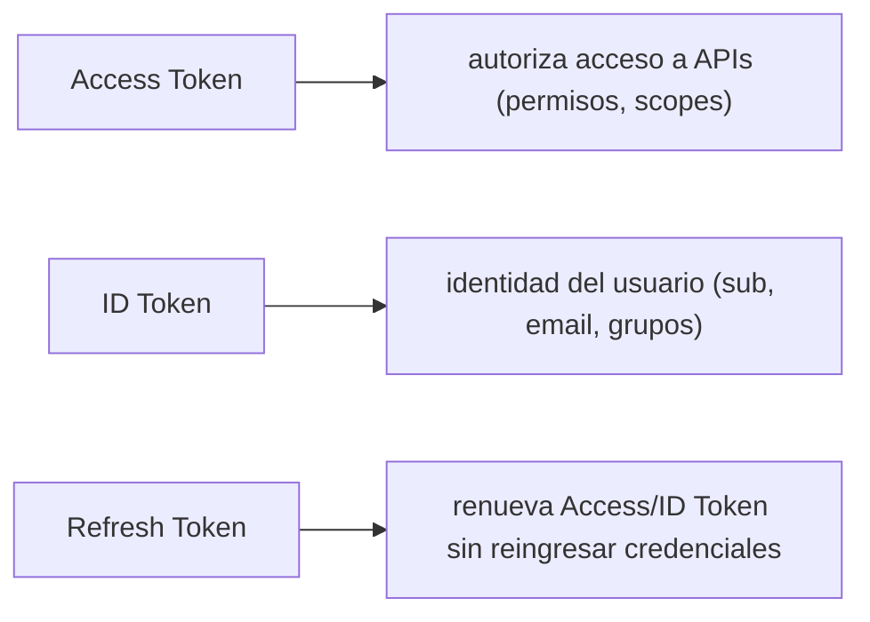
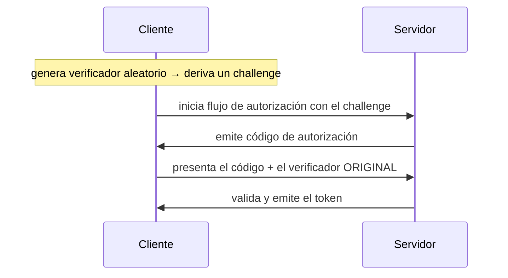

# Módulo 18: Autenticación de usuarios con Cognito


## Aprende construyendo

### Tema 1: Por qué no construir tu propio sistema de autenticación

#### Paso 1 · Objetivo y preparación
Al finalizar vas a registrar un conductor real de RutaFlow en Cognito, en vez de inventar un sistema de login propio para la app del conductor. Prerrequisitos: Módulo 6 completo.
#### Paso 2 · Contexto y caso real
Antes de que un conductor pueda confirmar una entrega vía `POST /entregas` (Módulo 6), RutaFlow necesita saber con certeza quién es esa persona — y reinventar el manejo de contraseñas para eso es exactamente el tipo de componente de seguridad que no conviene construir a mano.
#### Paso 3 · Teoría, modelo mental y analogía
Autenticar es comprobar que este conductor es quien dice ser; autorizar (Módulo 7, IAM) es comprobar qué puede hacer una vez identificado — dos preguntas distintas que Cognito resuelve para la primera.
#### Paso 4 · Demostración guiada
```bash
POOL_ID=$(aws cognito-idp create-user-pool --pool-name RutaFlowConductores --auto-verified-attributes email --query UserPool.Id --output text)
CLIENT_ID=$(aws cognito-idp create-user-pool-client --user-pool-id "$POOL_ID" --client-name app-conductor --no-generate-secret --query UserPoolClient.ClientId --output text)
aws cognito-idp sign-up --client-id "$CLIENT_ID" --username conductor-c891@rutaflow.com --password "Segura123!" \
  --user-attributes Name=email,Value=conductor-c891@rutaflow.com
```
Resultado esperado: `sign-up` responde con `UserConfirmed: false` y un `UserSub` — el conductor ya existe en el directorio de RutaFlow, pendiente de confirmar su email, sin que ninguna línea de este proyecto tuviera que implementar hashing de contraseñas ni envío de códigos.
#### Paso 5 · Práctica guiada
Pista: confirmá el registro con un código inventado (`aws cognito-idp confirm-sign-up --client-id "$CLIENT_ID" --username conductor-c891@rutaflow.com --confirmation-code "000000"`) — ese es el fallo deliberado: `CodeMismatchException`, porque Cognito rechaza explícitamente cualquier código que no sea el que realmente envió, sin dar pistas sobre cuál sería el correcto.
#### Paso 6 · Práctica independiente
Intentá `initiate-auth` con ese mismo conductor antes de confirmar su registro, y después de confirmarlo (usando el código real que Floci expone en local) — comparando el error `UserNotConfirmedException` del primer intento contra el login exitoso del segundo.
#### Paso 7 · Cierre y evidencia
Entregá el registro del conductor, el código inválido del Paso 5 y la diferencia confirmado/no confirmado del Paso 6; explicá qué parte de este flujo habrías tenido que construir a mano sin Cognito. Siguiente paso: JWT. Errores comunes: confiar solo en frontend y mensajes que revelan usuarios. Fuente oficial: https://owasp.org/www-project-authentication-cheat-sheet/.
**Conceptos clave:** autenticación es un problema resuelto con implicaciones de seguridad severas si se hace incorrectamente.

```bash
aws cognito-idp create-user-pool --pool-name MiApp --auto-verified-attributes email
aws cognito-idp sign-up --client-id <client-id> --username alice@ejemplo.com --password "Segura123!" --user-attributes Name=email,Value=alice@ejemplo.com
```

`--pool-name` nombra el User Pool (el directorio de usuarios, explicado abajo); `--auto-verified-attributes email` le dice a Cognito que verifique automáticamente el email de cada usuario nuevo (enviando un código de confirmación) antes de dejarlo iniciar sesión. Al registrar un usuario, `--client-id` identifica el App Client (la aplicación que hace el pedido, explicada abajo); `--username` y `--password` son las credenciales del usuario nuevo; `--user-attributes` son datos adicionales del perfil (acá, el mismo email en formato `Name=...,Value=...`). Al crear el App Client, `--client-name` lo identifica y `--no-generate-secret` indica que este cliente (por ejemplo, una app web pública) no necesita un secreto compartido, a diferencia de un backend que sí podría requerirlo; `--user-pool-id` en ese mismo comando indica a qué User Pool pertenece ese cliente. En resumen: `--pool-name` es la bandera que nombra el User Pool; `--auto-verified-attributes` es la bandera que activa la verificación automática de un atributo; `--client-id` es la bandera que identifica el App Client al autenticar; `--password` es la bandera con la contraseña del usuario; `--user-attributes` es la bandera con datos adicionales del perfil; `--client-name` es la bandera que nombra el App Client al crearlo; `--no-generate-secret` es la bandera que indica que ese cliente no necesita secreto compartido; y `--user-pool-id` es la bandera que fija a qué User Pool pertenece el cliente.

Construir un sistema de autenticación propio (hashing de contraseñas, gestión de sesiones, recuperación de contraseña, verificación de email, protección contra ataques de fuerza bruta) requiere resolver correctamente un conjunto extenso de detalles de seguridad donde un único error (un algoritmo de hashing débil, un flujo de recuperación de contraseña vulnerable a enumeración de usuarios) puede comprometer completamente la seguridad de todos los usuarios de la aplicación; Cognito (y servicios equivalentes como Auth0 o Firebase Authentication) encapsula toda esta complejidad ya resuelta y auditada extensamente por expertos en seguridad, permitiendo que un equipo de desarrollo de aplicación se enfoque en su lógica de negocio específica en vez de reinventar y potencialmente comprometer un componente de seguridad tan crítico y con tan poco margen de error aceptable.

Un User Pool es el directorio de usuarios completo (gestiona su registro, verificación, atributos, y credenciales); un App Client representa una aplicación cliente específica autorizada a interactuar con ese User Pool (una web app y una app móvil de la misma organización podrían tener App Clients distintos con configuraciones de seguridad diferenciadas, como si requieren o no un secreto de cliente).

**Analogía:** construir tu propio sistema de autenticación es como fabricar tu propia cerradura de seguridad desde cero sin experiencia previa en cerrajería, arriesgando que un defecto de diseño no detectado comprometa la seguridad completa de la puerta; usar Cognito es como instalar una cerradura certificada y probada extensamente por especialistas, con la garantía de que los defectos de diseño más comunes ya fueron identificados y corregidos por expertos antes de llegar al mercado.

**¿Por qué es importante?** NO debes construir tu propio sistema de autenticación porque requiere resolver correctamente numerosos detalles críticos de seguridad donde un único error puede comprometer completamente la seguridad de todos los usuarios, mientras que Cognito encapsula esa complejidad ya auditada y resuelta por expertos.

**Prueba en terminal:**

```bash
aws cognito-idp create-user-pool --pool-name MiApp --auto-verified-attributes email
aws cognito-idp create-user-pool-client --user-pool-id <pool-id> --client-name web-client --no-generate-secret
```

### Tema 2: Access Token, ID Token y Refresh Token

#### Paso 1 · Objetivo y preparación
Al finalizar vas a loguear al conductor del Tema 1 y a distinguir cuál de los tres tokens que recibís debería usarse para llamar `POST /entregas`. Prerrequisitos: Tema 1 de este módulo.
#### Paso 2 · Contexto y caso real
`POST /entregas` (Módulo 6) necesita saber que quien llama tiene permiso para confirmar entregas (Access Token), mientras que la app del conductor necesita mostrar "Hola, conductor c-891" en su UI (ID Token) — mezclarlos es el error típico al integrar Cognito con una API.
#### Paso 3 · Teoría, modelo mental y analogía
Son tres pases distintos: el Access Token es la credencial que abre la puerta de la API; el ID Token es la ficha de identidad; el Refresh Token es el comprobante para pedir pases nuevos sin volver a mostrar documentos.
#### Paso 4 · Demostración guiada
```bash
aws cognito-idp initiate-auth --client-id "$CLIENT_ID" --auth-flow USER_PASSWORD_AUTH \
  --auth-parameters USERNAME=conductor-c891@rutaflow.com,PASSWORD="Segura123!" \
  --query 'AuthenticationResult.{Access:AccessToken,Id:IdToken,Refresh:RefreshToken}'
```
Resultado esperado: tres JWT distintos — decodificá el `IdToken` (solo la parte del medio, separada por puntos, en base64) y vas a ver `email: conductor-c891@rutaflow.com`; decodificá el `AccessToken` y vas a ver `scope`, pero nunca el email. Ese es exactamente el token que `POST /entregas` debería exigir en su cabecera `Authorization`.
#### Paso 5 · Práctica guiada
Pista: ese es el error real que advierte este Tema — si `POST /entregas` validara el `IdToken` en vez del `AccessToken` (un error de integración común), estaría usando un token diseñado para comunicar identidad al cliente, no para autorizar acceso a una API; documentá por escrito qué información le faltaría a un autorizador que solo revisa `scope` si le llega un `IdToken` en su lugar.
#### Paso 6 · Práctica independiente
Guardá el `RefreshToken`, esperá a que el `AccessToken` esté cerca de expirar (o simulá la espera), y corré `aws cognito-idp initiate-auth --client-id "$CLIENT_ID" --auth-flow REFRESH_TOKEN_AUTH --auth-parameters REFRESH_TOKEN=<refresh-token>` para confirmar que el conductor obtiene un `AccessToken` nuevo sin volver a escribir su contraseña.
#### Paso 7 · Cierre y evidencia
Entregá los tres tokens decodificados del Paso 4, la explicación del error de confundirlos del Paso 5, y la renovación del Paso 6; explicá por qué `POST /entregas` debe validar específicamente el Access Token. Siguiente paso: OAuth. Errores comunes: guardar refresh en local inseguro y no rotar. Fuente oficial: https://datatracker.ietf.org/doc/html/rfc7519.
**Conceptos clave:** tres tokens JWT con propósitos distintos, no intercambiables entre sí.

```bash
aws cognito-idp initiate-auth --client-id <client-id> --auth-flow USER_PASSWORD_AUTH --auth-parameters USERNAME=alice@ejemplo.com,PASSWORD="Segura123!"
```

`--auth-flow` elige el mecanismo de autenticación (`USER_PASSWORD_AUTH` es el flujo clásico de usuario y contraseña; Cognito soporta otros, como autenticación sin contraseña); `--auth-parameters` son los datos que ese flujo específico necesita — para `USER_PASSWORD_AUTH`, el usuario y la contraseña. En resumen: `--auth-parameters` es la bandera que lleva esos datos según el flujo elegido.

Tras un login exitoso, Cognito emite tres tokens JWT con propósitos claramente diferenciados: el **Access Token** autoriza al portador a acceder a recursos protegidos (APIs), conteniendo claims relacionados con permisos y scopes, pero deliberadamente sin información de identidad personal del usuario; el **ID Token** contiene específicamente información de identidad del usuario (claims como `sub`, `email`, `cognito:groups`), destinado a que la aplicación cliente conozca quién es el usuario autenticado, no para autorizar acceso a APIs; el **Refresh Token** tiene una vida útil considerablemente más larga que los otros dos y se usa exclusivamente para obtener un nuevo Access Token/ID Token cuando estos expiran, sin requerir que el usuario vuelva a ingresar sus credenciales completas cada vez.

Esta separación de propósitos (autorización vs identidad vs renovación) sigue el estándar OpenID Connect construido sobre OAuth 2.0, y es importante respetarla estrictamente: usar el ID Token para autorizar acceso a una API (en vez del Access Token diseñado específicamente para ese propósito) es un error de seguridad común que mezcla incorrectamente información de identidad con autorización de acceso, potencialmente exponiendo datos de identidad innecesarios a servicios que solo deberían verificar permisos.

**Analogía:** el Access Token es como una credencial de acceso que abre puertas específicas sin revelar quién la porta; el ID Token es como una tarjeta de identificación que confirma quién es la persona sin autorizar acceso a ninguna puerta específica; el Refresh Token es como un comprobante de registro que permite solicitar credenciales de acceso renovadas sin tener que presentar de nuevo toda la documentación de identidad original completa.

**¿Por qué es importante?** El Access Token autoriza acceso a APIs; el ID Token comunica identidad al cliente; el Refresh Token renueva los otros dos sin reingreso de credenciales, cada uno con un propósito distinto y no intercambiable que debe respetarse estrictamente para evitar errores de seguridad.

**Diagrama:**


```mermaid
flowchart LR
    A["Access Token"] --> A1["autoriza acceso a APIs (permisos, scopes)"]
    B["ID Token"] --> B1["identidad del usuario (sub, email, grupos)"]
    C["Refresh Token"] --> C1["renueva Access/ID Token sin reingresar credenciales"]
```

### Tema 3: OAuth 2.0 y PKCE

#### Paso 1 · Objetivo y preparación
Al finalizar vas a armar el flujo OAuth 2.0 con PKCE que la app móvil del conductor necesita, porque esa app no puede guardar ningún secreto de cliente de forma segura. Prerrequisitos: Temas 1-2 de este módulo.
#### Paso 2 · Contexto y caso real
El `app-conductor` del Tema 1 ya se creó con `--no-generate-secret`: es un cliente público, el mismo tipo que una app móvil nativa, donde cualquier secreto embebido en el binario sería extraíble por cualquiera con el APK.
#### Paso 3 · Teoría, modelo mental y analogía
OAuth entrega un permiso delegado, no la contraseña del conductor; PKCE agrega un código de verificación que solo la app original conoce, para que interceptar el código de autorización en el camino no alcance para robar la sesión.
#### Paso 4 · Demostración guiada
```bash
CODE_VERIFIER=$(openssl rand -base64 32 | tr -d '=+/')
CODE_CHALLENGE=$(echo -n "$CODE_VERIFIER" | openssl dgst -sha256 -binary | base64 | tr -d '=+/')
echo "Abrí en el navegador: https://localhost:4566/oauth2/authorize?client_id=$CLIENT_ID&response_type=code&code_challenge=$CODE_CHALLENGE&code_challenge_method=S256&redirect_uri=rutaflow://callback"
```
Resultado esperado: el flujo arranca con un `code_challenge` derivado del `code_verifier`, nunca el verificador en sí — ese valor original solo vive en la app del conductor hasta el último paso del intercambio.
#### Paso 5 · Práctica guiada
Pista: en el intercambio final, probá `POST /oauth2/token` con el código de autorización pero SIN el parámetro `code_verifier` — ese es el fallo deliberado: Cognito rechaza el intercambio (`invalid_grant` o un error equivalente de verificación PKCE fallida), porque sin el verificador original no hay forma de confirmar que quien presenta el código es la misma app que inició el flujo.
#### Paso 6 · Práctica independiente
Documentá, para `app-conductor`, qué `redirect_uri` debería aceptar Cognito (pista: una URI de esquema personalizado como `rutaflow://callback`, nunca un wildcard abierto que acepte cualquier destino) y qué scope mínimo necesitaría pedir para confirmar entregas, sin pedir de más.
#### Paso 7 · Cierre y evidencia
Entregá el `code_challenge` generado del Paso 4, el intercambio rechazado sin `code_verifier` del Paso 5, y el `redirect_uri`/scope documentados del Paso 6; explicá por qué un cliente público como `app-conductor` necesita PKCE y un backend con secreto propio no lo necesitaría de la misma forma. Siguiente paso: autorización por roles. Errores comunes: redirect abierto y scopes excesivos. Fuente oficial: https://www.rfc-editor.org/rfc/rfc6749.
**Conceptos clave:** protocolo de autorización delegada, protección adicional para clientes que no pueden guardar secretos de forma segura.

OAuth 2.0 es el protocolo estándar de la industria para autorización delegada (permitir que una aplicación acceda a recursos en nombre de un usuario sin que ese usuario comparta directamente su contraseña con esa aplicación), y Cognito implementa flujos OAuth 2.0 completos, permitiendo integraciones estándar con proveedores de identidad externos (Google, Facebook) además de la autenticación directa con usuario y contraseña propia estudiada en el Tema 2.

PKCE (Proof Key for Code Exchange) es una extensión de seguridad de OAuth 2.0 diseñada específicamente para clientes que no pueden almacenar un secreto de forma segura (aplicaciones móviles nativas o aplicaciones de una sola página en el navegador, donde cualquier secreto embebido en el código del cliente sería potencialmente extraíble por un atacante); PKCE genera un verificador aleatorio y su correspondiente desafío derivado criptográficamente al inicio del flujo de autorización, y exige presentar ese verificador original al final del intercambio para obtener el token, de modo que incluso si un atacante interceptara el código de autorización intermedio, no podría completar el intercambio sin también poseer el verificador original que nunca se transmitió en ese paso intermedio interceptable.

**Analogía:** OAuth 2.0 es como un sistema de valet parking donde el cliente entrega una llave de acceso limitada y específica (no la llave maestra de su casa) que solo permite mover el auto, no acceder a otras propiedades del cliente; PKCE es como un código de verificación adicional generado al momento de entregar esa llave limitada, que solo el cliente original conoce y que debe presentarse nuevamente al recuperar el vehículo, previniendo que alguien que intercepte la llave limitada en el camino pueda usarla sin también conocer ese código adicional.

**¿Por qué es importante?** OAuth 2.0 permite autorización delegada sin compartir contraseñas directamente; PKCE protege específicamente a clientes que no pueden guardar secretos de forma segura (apps móviles, SPAs), previniendo que un código de autorización interceptado sea explotable sin también poseer el verificador original nunca transmitido en ese paso interceptable.

**Diagrama:**


```mermaid
sequenceDiagram
    participant Cliente
    participant Servidor
    Note over Cliente: genera verificador aleatorio → deriva un challenge
    Cliente->>Servidor: inicia flujo de autorización con el challenge
    Servidor->>Cliente: emite código de autorización
    Cliente->>Servidor: presenta el código + el verificador ORIGINAL
    Servidor->>Cliente: valida y emite el token
```

---


## Laboratorio práctico

> Este laboratorio asume que ya ejecutaste `floci start` y `eval $(floci env)` (Módulo 1) en tu sesión de terminal, así que los comandos de `aws` no repiten `--endpoint-url`.

**Objetivo del laboratorio:** construir una API REST protegida con Cognito Authorizer donde solo usuarios autenticados pueden crear tareas.

**Requisitos previos:** Módulo 17 completado.

| Paso | Acción | Comando | Explicación |
|---|---|---|---|
| 1 | Crear un User Pool y un App Client | Ver Tema 1 | Sin secret para cliente web |
| 2 | Registrar y confirmar un usuario | `sign-up` + `admin-confirm-sign-up` | Flujo completo |
| 3 | Iniciar sesión y obtener tokens JWT | `initiate-auth` | Access/ID/Refresh |
| 4 | Decodificar el JWT y examinar sus claims | Ver Tema 2 | `sub`, `email`, `cognito:groups` |
| 5 | Proteger API Gateway con Cognito Authorizer | `aws apigateway create-authorizer --type COGNITO_USER_POOLS` | Solo usuarios autenticados |

**Verificación:** el laboratorio se considera exitoso si un request sin token válido es rechazado por el API Gateway, y si un request con un Access Token válido puede crear tareas correctamente.

**Errores comunes y soluciones**

- **Usar el ID Token para autorizar acceso a una API en vez del Access Token.** Mezcla identidad con autorización incorrectamente; usa el Access Token para ese propósito.
- **Construir un sistema de autenticación propio para ahorrar la integración con Cognito.** Arriesga vulnerabilidades críticas de seguridad ya resueltas por servicios auditados como Cognito.
- **Omitir PKCE en una app móvil o SPA que no puede guardar un secreto de forma segura.** Usa PKCE específicamente para esos clientes.

---
