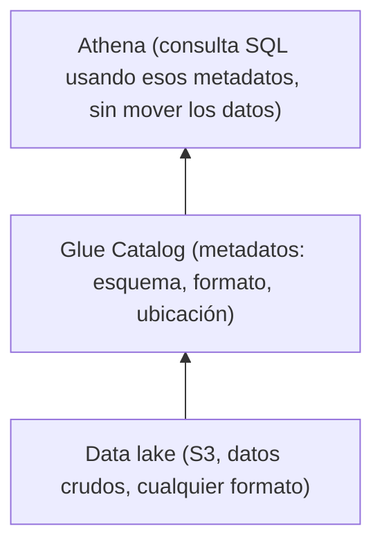
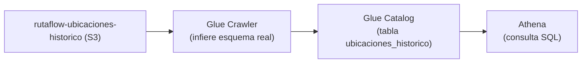
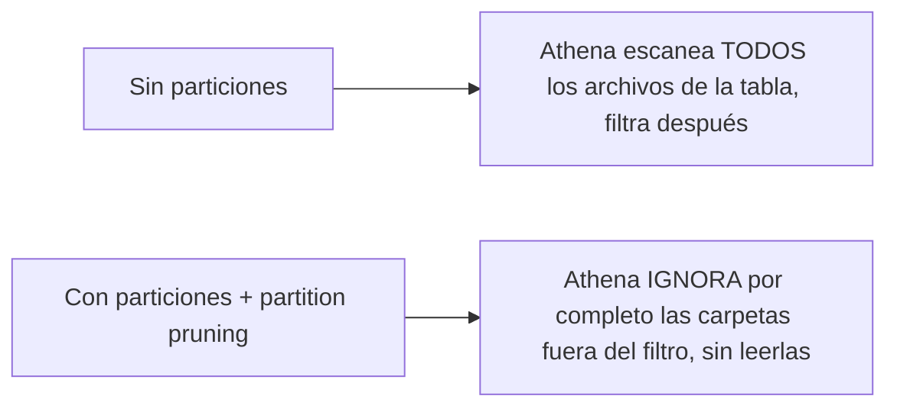

# Módulo 19: Analítica de datos con Athena y Glue


## Aprende construyendo

### Tema 1: Data lake y Glue Catalog

#### Paso 1 · Objetivo y preparación
Al finalizar vas a catalogar, sin moverlos, los archivos de ubicación histórica que Firehose (Módulo 17) ya deposita en `rutaflow-ubicaciones-historico`. Prerrequisitos: Módulo 17 completo.
#### Paso 2 · Contexto y caso real
Esos archivos ya existen en S3 desde el Módulo 17 — el equipo de analítica de RutaFlow necesita consultarlos con SQL sin que nadie los copie a ninguna base de datos nueva.
#### Paso 3 · Teoría, modelo mental y analogía
Es como consultar un archivo sin trasladarlo a otra oficina: los datos se quedan en `rutaflow-ubicaciones-historico`, y el esquema que describe sus columnas vive aparte, en Glue Catalog.
#### Paso 4 · Demostración guiada
```bash
aws glue create-database --database-input '{"Name":"rutaflow_analytics"}'
aws glue create-table --database-name rutaflow_analytics --table-input '{
  "Name":"ubicaciones",
  "StorageDescriptor":{
    "Columns":[{"Name":"conductorId","Type":"string"},{"Name":"lat","Type":"double"},{"Name":"lon","Type":"double"}],
    "Location":"s3://rutaflow-ubicaciones-historico/",
    "InputFormat":"org.apache.hadoop.mapred.TextInputFormat"
  }
}'
aws athena start-query-execution --query-string "SELECT conductorId, lat, lon FROM rutaflow_analytics.ubicaciones LIMIT 5" \
  --result-configuration OutputLocation=s3://rutaflow-ubicaciones-historico/resultados/
```
Resultado esperado: Athena devuelve filas reales leídas directamente de los objetos que Firehose ya escribió — ni Glue ni Athena movieron un solo byte de `rutaflow-ubicaciones-historico`, solo le agregaron una descripción consultable con SQL.
#### Paso 5 · Práctica guiada
Pista: declará la tabla con una columna `velocidad` que ningún archivo real tiene, y corré `SELECT velocidad FROM rutaflow_analytics.ubicaciones` — ese es el fallo deliberado: la consulta puede devolver `NULL` para todas las filas (o fallar, según el formato) porque el esquema declarado no coincide con lo que realmente hay en los archivos; Glue Catalog describe lo que vos le dijiste, no lo que los archivos contienen de verdad.
#### Paso 6 · Práctica independiente
Corregí la tabla quitando `velocidad` y agregando solo las columnas reales (`conductorId`, `lat`, `lon`), y conservá la salida de una consulta exitosa como evidencia de que el esquema ahora coincide con los datos reales.
#### Paso 7 · Cierre y evidencia
Entregá la tabla catalogada, la consulta con la columna inventada del Paso 5, y la corrección del Paso 6; explicá por qué "schema-on-read" significa que el esquema puede mentir si nadie lo mantiene sincronizado. Siguiente paso: formato. Errores comunes: esquema desactualizado y permisos excesivos. Fuente oficial: https://docs.aws.amazon.com/athena/latest/ug/what-is.html.
**Conceptos clave:** los datos permanecen en su ubicación original de almacenamiento de objetos, el esquema se define por separado.

```bash
aws glue create-database --database-input '{"Name":"tienda"}'
aws glue create-table --database-name tienda --table-input '{"Name":"pedidos","StorageDescriptor":{...}}'
```

`--database-input` es el JSON que describe la base de datos lógica a crear dentro del catálogo (acá, solo su nombre); `--database-name` indica en cuál de esas bases de datos crear la tabla; `--table-input` es el JSON con la estructura de la tabla (columnas, formato de archivo, ubicación en S3).

Un data lake almacena datos en su formato original (crudo o semi-procesado) directamente en almacenamiento de objetos como S3, sin cargarlos primero hacia una base de datos estructurada tradicional (un data warehouse), difiriendo la definición de esquema hasta el momento de la consulta ("schema-on-read") en vez de exigir un esquema rígido predefinido antes de poder almacenar cualquier dato ("schema-on-write", el modelo tradicional de bases de datos relacionales); esta flexibilidad permite almacenar datos de fuentes y formatos heterogéneos sin necesidad de transformarlos todos hacia un esquema único común de antemano, a costa de requerir herramientas adicionales (como Athena) para consultar esos datos de forma estructurada cuando sea necesario.

Glue Catalog actúa como el catálogo centralizado de metadatos que describe el esquema de los datos almacenados en S3 (qué columnas tiene una tabla lógica, en qué formato están los archivos, dónde exactamente en S3 se ubican), sin mover ni duplicar los datos reales: es simplemente una capa de metadatos que permite a herramientas como Athena saber cómo interpretar los archivos crudos almacenados en S3 como si fueran una tabla estructurada consultable con SQL.

**Analogía:** un data lake es como un gran almacén que acepta mercancía de cualquier tipo y formato sin exigir una clasificación previa estricta al momento de recibirla, difiriendo esa clasificación hasta el momento en que alguien efectivamente necesita buscar algo específico; Glue Catalog es como el índice centralizado de ese almacén que describe dónde está cada tipo de mercancía y cómo interpretarla, sin mover físicamente ningún artículo de su ubicación original.

**¿Por qué es importante?** Un data lake permite almacenar datos heterogéneos sin esquema rígido predefinido de antemano (schema-on-read), difiriendo esa estructuración hasta el momento de la consulta; Glue Catalog provee los metadatos necesarios para que herramientas como Athena consulten esos datos crudos como tablas estructuradas sin moverlos.

**Diagrama:**



En el proyecto integrador RutaFlow, `rutaflow-ubicaciones-historico` es el mismo bucket que
`examples/rutaflow/cloud/template.yaml` declararía como destino de Firehose: catalogarlo con
Glue no conviene hacerlo copiando los datos a otra tabla — el límite real de schema-on-read es
que el esquema declarado puede desincronizarse de los archivos reales si nadie lo mantiene, a
diferencia de una tabla RDS (Módulo 13) donde la propia base impone el esquema en cada escritura.

### Tema 2: Glue Crawler y Athena

#### Paso 1 · Objetivo y preparación
Al finalizar vas a dejar que un Glue Crawler descubra solo el esquema real de `rutaflow-ubicaciones-historico`, en vez de declararlo a mano como en el Tema 1. Prerrequisitos: Tema 1 de este módulo.
#### Paso 2 · Contexto y caso real
Si RutaFlow agrega un campo nuevo a los pings de ubicación (por ejemplo, `velocidad`) más adelante, nadie debería tener que recordar actualizar manualmente la tabla de Glue cada vez — el crawler puede detectarlo solo.
#### Paso 3 · Teoría, modelo mental y analogía
El crawler es un inspector que examina muestras reales de los archivos y propone la estructura, en vez de confiar en lo que un humano cree que debería haber ahí.
#### Paso 4 · Demostración guiada
```bash
aws glue create-crawler --name crawler-ubicaciones --role arn:aws:iam::000000000000:role/glue-crawler-role \
  --targets '{"S3Targets":[{"Path":"s3://rutaflow-ubicaciones-historico/"}]}' --database-name rutaflow_analytics
aws glue start-crawler --name crawler-ubicaciones
aws glue get-table --database-name rutaflow_analytics --name ubicaciones_historico --query 'Table.StorageDescriptor.Columns'
```
Resultado esperado: `get-table` muestra las columnas que el crawler encontró de verdad en los archivos (`conductorId`, `lat`, `lon`), sin la columna `velocidad` inventada del Tema 1 — porque esta vez nadie la declaró, el crawler solo reporta lo que existe.
#### Paso 5 · Práctica guiada
Pista: subí manualmente a `rutaflow-ubicaciones-historico` un archivo con una fila en formato JSON junto a los que Firehose ya depositó en CSV — ese es el fallo deliberado de inferencia: el crawler, al encontrar formatos mezclados en la misma ruta, puede fallar en inferir un esquema único consistente, o crear más de una tabla donde esperabas una sola.
#### Paso 6 · Práctica independiente
Compará, en una tabla de dos columnas, el esquema que declaraste a mano en el Tema 1 contra el que el crawler descubrió en este Tema — identificá cualquier diferencia y documentá cuál de los dos confiarías más si los archivos cambiaran sin avisarte.
#### Paso 7 · Cierre y evidencia
Entregá el esquema descubierto por el crawler, el problema de formatos mezclados del Paso 5, y la comparación del Paso 6; explicá cuándo conviene declarar el esquema a mano y cuándo dejar que el crawler lo infiera. Siguiente paso: particiones. Errores comunes: confiar ciegamente en inferencia y no versionar esquema. Fuente oficial: https://docs.aws.amazon.com/glue/latest/dg/catalog-and-crawler.html.
**Conceptos clave:** descubrimiento automático de esquema, consulta SQL directa sobre archivos en S3.

```bash
aws glue create-crawler --name crawler-pedidos --targets '{"S3Targets":[{"Path":"s3://analytics-bucket/pedidos"}]}' --database-name tienda
aws glue start-crawler --name crawler-pedidos
```

`--targets` es la bandera que le dice al crawler dónde buscar archivos (acá, una ruta de S3); el resto de las banderas ya las conocés de Tema 1.

Un Glue Crawler examina automáticamente los archivos almacenados en una ubicación de S3, infiere el esquema (nombres y tipos de columnas) a partir de su contenido real, y registra esa definición de tabla en Glue Catalog sin que un humano tenga que declarar manualmente cada columna y tipo, especialmente valioso cuando el formato exacto de los datos no se conoce de antemano con precisión o cuando evoluciona con el tiempo (agregando nuevas columnas que el crawler puede detectar en ejecuciones sucesivas).

```bash
aws athena start-query-execution --query-string "SELECT cliente, SUM(monto) as total FROM tienda.pedidos GROUP BY cliente ORDER BY total DESC" --result-configuration OutputLocation=s3://analytics-bucket/resultados/
```

`--query-string` es la consulta SQL a ejecutar; `--result-configuration` indica dónde escribir el resultado (Athena no devuelve solo texto en pantalla: siempre guarda el resultado completo como archivo en S3, en la ubicación que indiques con `OutputLocation`).

Athena ejecuta SQL estándar directamente sobre los datos en S3 usando el esquema registrado en Glue Catalog, sin requerir ningún servidor de base de datos persistente corriendo continuamente: cada consulta se ejecuta bajo demanda como un job serverless, escaneando únicamente los archivos relevantes de S3 según el esquema y las particiones definidas, con el resultado de la consulta escrito de vuelta hacia una ubicación de S3 especificada; un Athena Workgroup permite aislar y controlar los costos de consultas de distintos equipos o propósitos (por ejemplo, limitando cuántos bytes puede escanear un workgroup específico por consulta, previniendo consultas descontroladamente costosas).

**Analogía:** un Glue Crawler es como un inspector que examina automáticamente el contenido de cajas sin etiquetar en un almacén y genera una ficha catalográfica describiendo su contenido, sin que un empleado tenga que abrir y catalogar manualmente cada caja una por una; Athena es como un servicio de consulta bajo demanda que responde preguntas específicas sobre el contenido del almacén completo usando esas fichas catalográficas, cobrando únicamente por la cantidad de cajas efectivamente revisadas para responder cada pregunta específica.

**¿Por qué es importante?** El Glue Crawler descubre automáticamente el esquema de datos sin declaración manual, especialmente valioso cuando el formato evoluciona con el tiempo; Athena consulta esos datos con SQL estándar sin servidor persistente, cobrando por consulta según los bytes efectivamente escaneados.

**Prueba en terminal:**

```bash
aws glue start-crawler --name crawler-pedidos
# → descubre esquema automáticamente y lo registra en Glue Catalog

aws athena start-query-execution --query-string "SELECT ... FROM tienda.pedidos ..."
# → consulta SQL directa sobre los archivos en S3, usando ese esquema
```

**Diagrama:**



En el proyecto integrador RutaFlow, este crawler reemplazaría la declaración manual del Tema 1
cada vez que `examples/rutaflow/cloud/template.yaml` cambie el formato de lo que Firehose
deposita en `rutaflow-ubicaciones-historico`, sin que nadie tenga que acordarse de actualizar
la tabla a mano.

### Tema 3: Parquet vs CSV, y partition pruning

#### Paso 1 · Objetivo y preparación
Al finalizar vas a medir, con bytes escaneados reales, cuánto cuesta de más consultar `rutaflow-ubicaciones-historico` sin particionar por fecha. Prerrequisitos: Tema 2 de este módulo.
#### Paso 2 · Contexto y caso real
RutaFlow acumula pings de ubicación de todos los días desde que arrancó Firehose — una consulta que solo necesita "hoy" no debería tener que leer los archivos de hace tres meses.
#### Paso 3 · Teoría, modelo mental y analogía
Particionar por fecha es como ordenar un archivo físico por año y abrir solo el cajón del año que te interesa, en vez de revisar el archivo completo cada vez.
#### Paso 4 · Demostración guiada
```bash
aws athena start-query-execution --query-string "SELECT conductorId FROM rutaflow_analytics.ubicaciones WHERE anio=2026 AND mes=10 AND dia=5" \
  --result-configuration OutputLocation=s3://rutaflow-ubicaciones-historico/resultados/
aws athena get-query-execution --query-execution-id <id-de-la-ejecucion-anterior> --query 'QueryExecution.Statistics.DataScannedInBytes'
```
Resultado esperado: `DataScannedInBytes` reporta solo los bytes de los archivos bajo la partición `anio=2026/mes=10/dia=5/` — Athena nunca abrió los archivos de otras fechas, porque la cláusula `WHERE` coincide exactamente con las claves de partición.
#### Paso 5 · Práctica guiada
Pista: repetí la misma consulta de negocio pero SIN el `WHERE` de partición (`SELECT conductorId FROM rutaflow_analytics.ubicaciones`) y compará `DataScannedInBytes` — ese es el fallo deliberado de coste: escaneás TODOS los archivos históricos para responder una pregunta que, en la mayoría de los casos reales, solo necesitaba un día específico.
#### Paso 6 · Práctica independiente
Convertí mentalmente (o con `CREATE TABLE AS SELECT`) los mismos datos de CSV a Parquet, y documentá por qué, incluso sin particiones, Parquet ya reduciría los bytes escaneados para una consulta que solo pide `conductorId` de una tabla con muchas más columnas.
#### Paso 7 · Cierre y evidencia
Entregá los bytes escaneados con partición del Paso 4, los bytes sin partición del Paso 5, y la comparación CSV/Parquet del Paso 6; explicá por qué particionar y elegir el formato correcto son dos palancas de costo independientes, no la misma. Siguiente paso: analítica. Errores comunes: particiones pequeñas y formato no columnar. Fuente oficial: https://docs.aws.amazon.com/athena/latest/ug/partitions.html.
**Conceptos clave:** el formato de archivo y la organización en particiones determinan drásticamente el costo de cada consulta.

Parquet es un formato de almacenamiento columnar (organiza los datos por columna en vez de por fila, como CSV/JSON) que permite a Athena leer únicamente las columnas efectivamente referenciadas en una consulta específica (en vez de tener que leer el archivo completo fila por fila, extrayendo todas las columnas incluso las no relevantes para esa consulta particular como ocurre inevitablemente con CSV), además de aplicar compresión considerablemente más eficiente gracias a que valores similares del mismo tipo de columna quedan almacenados contiguos entre sí; esta combinación hace que Parquet sea típicamente 10 veces más eficiente en bytes escaneados (y por lo tanto en costo, dado que Athena cobra según bytes escaneados) que CSV para consultas analíticas típicas que solo necesitan un subconjunto de columnas de una tabla ancha.

Particionar los datos por una columna de alta relevancia para el patrón de consulta habitual (por ejemplo, por fecha, organizando los archivos físicamente en carpetas separadas de S3 según el año/mes) permite a Athena aplicar "partition pruning": si una consulta filtra explícitamente por un rango de fechas específico, Athena puede ignorar por completo las particiones (carpetas) que quedan fuera de ese rango sin siquiera necesitar leerlas, reduciendo drásticamente los bytes escaneados y por lo tanto el costo y la latencia de la consulta, comparado con escanear la tabla completa sin ningún criterio de exclusión física previo basado en la organización de los archivos.

**Analogía:** Parquet es como un archivo organizado por categoría temática en vez de por orden cronológico mezclado, permitiendo extraer directamente solo la categoría de interés sin hojear documentos irrelevantes de por medio; particionar por fecha con partition pruning es como tener carpetas físicas separadas por año en un archivo, permitiendo ignorar por completo las carpetas de años no solicitados sin siquiera abrirlas, en vez de revisar cada documento individual del archivo completo para determinar si corresponde al período de interés.

**¿Por qué es importante?** Parquet es hasta 10 veces más eficiente que CSV para analítica porque permite leer solo las columnas relevantes con mejor compresión; las particiones con partition pruning reducen drásticamente los bytes escaneados al ignorar por completo carpetas fuera del rango de filtro de la consulta, reduciendo costo y latencia de forma significativa.

**Diagrama:**



En el proyecto integrador RutaFlow, partition pruning sobre `rutaflow-ubicaciones-historico`
(el bucket que `examples/rutaflow/cloud/template.yaml` alimenta vía Firehose) no conviene
dejarlo para "cuando crezca": el límite real es que, sin particiones desde el día uno, migrar
meses de archivos ya escritos a una nueva estructura de carpetas es un trabajo de reprocesamiento
completo, no un simple cambio de configuración.

---


## Laboratorio práctico

> Este laboratorio asume que ya ejecutaste `floci start` y `eval $(floci env)` (Módulo 1) en tu sesión de terminal, así que los comandos de `aws` no repiten `--endpoint-url`.

**Objetivo del laboratorio:** construir una query SQL que analiza 100k registros en S3 y devuelve el top 10 de clientes en menos de 1 segundo.

**Requisitos previos:** Módulo 18 completado.

| Paso | Acción | Comando | Explicación |
|---|---|---|---|
| 1 | Subir datos de prueba a S3 | `aws s3 cp orders.json s3://analytics-bucket/pedidos/2024/01/` | Estructura particionada por fecha |
| 2 | Crear la base de datos y tabla en Glue Catalog | `aws glue create-database` + `create-table` | Con `PartitionKeys` |
| 3 | Ejecutar un Glue Crawler | `aws glue create-crawler` + `start-crawler` | Descubre el esquema |
| 4 | Ejecutar la query con Athena | `aws athena start-query-execution` | Top 10 clientes por monto |
| 5 | Comparar rendimiento JSON vs Parquet, con y sin particiones | Ver Temas 2-3 | Bytes escaneados |

**Verificación:** el laboratorio se considera exitoso si la query devuelve el top 10 de clientes correctamente, y si la comparación demuestra una reducción medible de bytes escaneados al usar Parquet y particiones frente a JSON sin particionar.

**Errores comunes y soluciones**

- **Almacenar datos analíticos en CSV/JSON sin considerar Parquet.** Convierte a Parquet para reducir drásticamente bytes escaneados y costo.
- **No particionar datos consultados frecuentemente por un criterio como fecha.** Particiona por esa columna para habilitar partition pruning.
- **Declarar manualmente el esquema de una tabla con formato de datos desconocido o cambiante.** Usa un Glue Crawler para descubrimiento automático.

---
