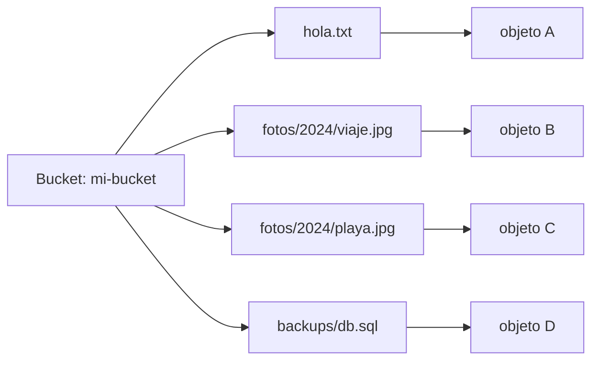
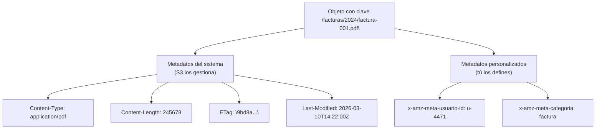
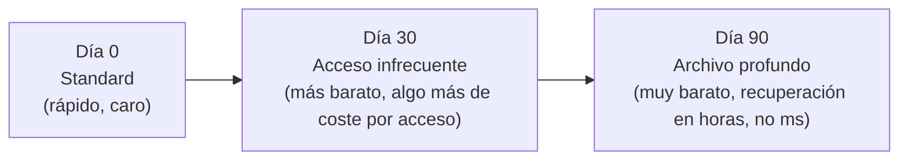
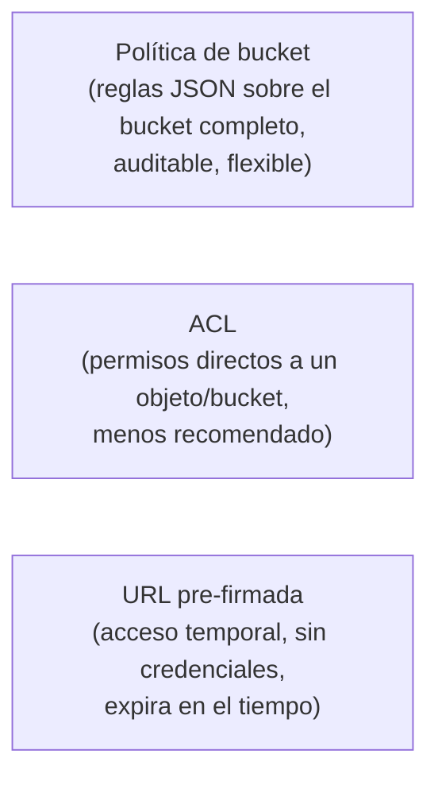
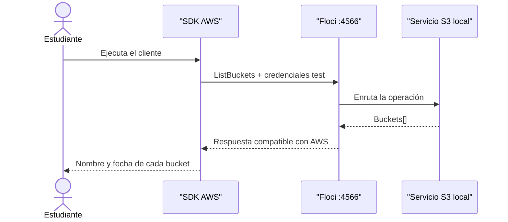

# Módulo 2: Almacenamiento en la nube con S3


## Aprende construyendo

### Tema 1: Objetos, buckets y su nomenclatura

#### Paso 1 · Objetivo y preparación
Al finalizar podrás almacenar un objeto desde cero. Prerrequisitos: Docker y AWS CLI; verifica `aws --version`.
#### Paso 2 · Contexto y caso real
Una entrega necesita conservar archivos con nombre, contenido y permisos.
#### Paso 3 · Teoría, modelo mental y analogía
Un bucket es un almacén y la key es la etiqueta única de cada paquete.
#### Paso 4 · Demostración guiada
Crea `src/upload.js` desde una carpeta vacía.
```bash
mkdir ejemplo-s3
aws --version
node --version
```
Resultado esperado: CLI disponible.
#### Paso 5 · Práctica guiada
Pista: usa un bucket inexistente para provocar un fallo deliberado y corrígelo.
#### Paso 6 · Práctica independiente
Sube, descarga y verifica un archivo.
#### Paso 7 · Cierre y evidencia
Entrega comandos, salida, fallo y corrección; explica el resultado. Siguiente paso: claves y metadatos. Errores comunes: confundir key y ruta local. Fuente oficial: https://docs.aws.amazon.com/AmazonS3/latest/userguide/Welcome.html.
**Conceptos clave:** objeto, bucket, almacenamiento de objetos (frente a almacenamiento de bloques o de archivos), nombre único global.

`aws` es el ejecutable de AWS CLI, la herramienta de línea de comandos oficial de Amazon para interactuar con cualquier servicio de AWS (S3, DynamoDB, Lambda y el resto) desde la terminal en lugar de la consola web. Cada subcomando sigue el patrón `aws <servicio> <acción> [opciones]` — por ejemplo, `aws s3 ls` para listar, o `aws s3 cp` para copiar, introducido más adelante en este módulo. En este curso, la AWS CLI se dirige a Floci en lugar de a AWS real mediante un `--endpoint-url` local (Módulo 0, Tema 4); la sintaxis de los comandos es idéntica a la que se emplearía contra una cuenta real.

**Definición.** S3 (*Simple Storage Service*) es un servicio de almacenamiento de objetos: cada archivo se guarda como un objeto, identificado por una clave (*key*) dentro de un contenedor lógico llamado bucket. A diferencia de un sistema de archivos jerárquico convencional (FAT, ext4, NTFS), S3 no implementa una relación real de padre-hijo entre directorios: la aparente estructura de carpetas de una clave como `fotos/2024/viaje.jpg` es una convención de nomenclatura interpretada visualmente por las herramientas cliente —incluida la consola web de AWS—, no una jerarquía existente en el almacenamiento subyacente.

Un bucket es la unidad de organización de primer nivel: todo objeto pertenece exactamente a un bucket, y el nombre de este debe ser único dentro del espacio de nombres global de AWS —no solo de la cuenta del usuario—, porque S3 incorpora el nombre del bucket en la URL pública del servicio. En una cuenta real, esto implica que un nombre de bucket ya registrado por cualquier otra cuenta en cualquier parte del mundo queda indisponible; en Floci, al tratarse de un entorno aislado sin espacio de nombres compartido con la nube real ni con otras instancias, esta restricción de unicidad global no se aplica de la misma forma.

Los nombres de bucket están sujetos a reglas sintácticas estrictas: únicamente letras minúsculas, dígitos, puntos y guiones; entre 3 y 63 caracteres; deben comenzar y terminar con una letra o dígito; y no pueden tener formato de dirección IP. Estas restricciones derivan de que el nombre del bucket puede formar parte de un nombre de host DNS (estilo de acceso *virtual-hosted*, donde el bucket aparece como subdominio: `mi-bucket.s3.amazonaws.com`), heredando así las restricciones propias de los nombres de host DNS.

La organización interna de un bucket es plana: no existe un límite práctico al número de objetos almacenables, ni el concepto de "mover" un objeto entre "carpetas" como operación atómica nativa —los SDK y la CLI simulan esa operación copiando el objeto bajo la nueva clave y eliminando el original. Esta ausencia de jerarquía real explica por qué operaciones que resultan triviales en un sistema de archivos convencional, como renombrar una carpeta completa, requieren en S3 copiar y eliminar cada objeto de forma individual.

**¿Por qué es importante?** La mayoría de las aplicaciones necesita almacenar archivos que no encajan de forma natural en una base de datos relacional o documental: imágenes, documentos, video, copias de seguridad, registros de auditoría. S3 —y sus equivalentes en otros proveedores, Blob Storage y Cloud Storage, tratados en el Módulo 8— constituye el servicio de referencia de la industria para ese caso de uso. Comprender su modelo de objeto plano, sin jerarquía real de directorios, evita errores de diseño frecuentes, como asumir que renombrar una "carpeta" con miles de archivos es una operación de coste constante.

**Diagrama:**



No hay carpetas reales: "fotos/2024/" es solo texto dentro de cada clave, no una estructura física.

### Tema 2: Claves y metadatos

#### Paso 1 · Objetivo y preparación
Al finalizar podrás describir un objeto desde cero. Prerrequisitos: Docker y AWS CLI; verifica `aws --version`.
#### Paso 2 · Contexto y caso real
Los metadatos permiten validar tipo, integridad y comportamiento de una descarga.
#### Paso 3 · Teoría, modelo mental y analogía
La key es etiqueta; Content-Type y ETag son la ficha técnica y huella del paquete.
#### Paso 4 · Demostración guiada
Crea `src/metadata.js` desde una carpeta vacía.
```bash
mkdir ejemplo-metadatos
aws --version
node --version
```
Resultado esperado: CLI disponible.
#### Paso 5 · Práctica guiada
Pista: declara un tipo incorrecto para provocar un fallo deliberado y corrígelo.
#### Paso 6 · Práctica independiente
Compara ETag y Content-Type.
#### Paso 7 · Cierre y evidencia
Entrega comandos, salida, fallo y corrección; explica el resultado. Siguiente paso: versionado. Errores comunes: confiar en extensión y no validar integridad. Fuente oficial: https://docs.aws.amazon.com/AmazonS3/latest/userguide/UsingMetadata.html.
**Conceptos clave:** clave (key), metadatos del sistema, metadatos personalizados, Content-Type, ETag.

**Definición.** La clave de un objeto es su identificador único dentro de un bucket: dos objetos del mismo bucket no pueden compartir clave —subir un archivo bajo una clave ya existente sobrescribe el objeto anterior, salvo que el versionado esté activo (Tema 3). La clave es una cadena de texto de hasta 1024 bytes, sin estructura obligatoria más allá de esa longitud; el uso de barras para simular una jerarquía de carpetas es una convención de nomenclatura ampliamente adoptada, no una restricción del formato.

Todo objeto en S3 lleva asociados metadatos, clasificados en dos categorías. Los metadatos del sistema son gestionados automáticamente por S3: tamaño en bytes, fecha de última modificación y el ETag —un hash del contenido que permite detectar cambios sin necesidad de descargar el objeto completo. El `Content-Type` indica a un navegador o cliente HTTP cómo interpretar el archivo (por ejemplo, `image/jpeg` o `application/pdf`); en ausencia de un valor explícito, muchos clientes —incluida la AWS CLI— lo infieren a partir de la extensión del archivo, con resultados no siempre correctos, por lo que se recomienda declararlo de forma explícita para archivos servidos directamente desde un navegador.

Los metadatos personalizados son pares clave-valor arbitrarios definidos por el remitente al subir el objeto, transmitidos con el prefijo `x-amz-meta-` cuando se envían directamente por la API HTTP (la CLI simplifica esto con la opción `--metadata`). Permiten asociar información de negocio al archivo sin recurrir a una base de datos separada —por ejemplo, el identificador del usuario que subió una imagen, o la categoría de un documento.

Los metadatos personalizados presentan una limitación práctica relevante: no son consultables de forma eficiente. S3 no ofrece un mecanismo nativo para "recuperar todos los objetos cuyo metadato `categoria` sea `factura`" sin recorrer secuencialmente el bucket completo. Cuando una aplicación requiere búsquedas eficientes por atributo, la práctica establecida consiste en indexar esos atributos en una base de datos —como DynamoDB, tratada en el Módulo 4— que referencie la clave del objeto en S3, en lugar de depender de los metadatos de S3 como único mecanismo de búsqueda.

**¿Por qué es importante?** El diseño del esquema de claves y la decisión de qué información almacenar como metadato frente a qué delegar a una base de datos constituyen decisiones de arquitectura recurrentes al trabajar con almacenamiento de objetos. Un esquema de claves deficiente —por ejemplo, un prefijo secuencial como `00001`, `00002`— puede introducir problemas de rendimiento a gran escala en la nube real, un aspecto documentado en detalle por AWS y relevante aunque no observable en Floci a la escala de un laboratorio.

**Diagrama:**



### Tema 3: Versionado y ciclo de vida

#### Paso 1 · Objetivo y preparación
Al finalizar podrás recuperar versiones desde cero. Prerrequisitos: Docker y AWS CLI; verifica `aws --version`.
#### Paso 2 · Contexto y caso real
Un archivo reemplazado accidentalmente debe poder recuperarse.
#### Paso 3 · Teoría, modelo mental y analogía
Versionar es conservar ediciones con identificador, no sobrescribir la historia.
#### Paso 4 · Demostración guiada
Crea `src/versioning.js` desde una carpeta vacía.
```bash
mkdir ejemplo-versiones
aws --version
node --version
```
Resultado esperado: CLI disponible.
#### Paso 5 · Práctica guiada
Pista: borra una versión equivocada para provocar un fallo deliberado y corrígelo.
#### Paso 6 · Práctica independiente
Prueba marcador de borrado y ciclo de vida.
#### Paso 7 · Cierre y evidencia
Entrega comandos, salida, fallo y corrección; explica el resultado. Siguiente paso: clases de almacenamiento. Errores comunes: creer que borrar elimina todo y olvidar costes. Fuente oficial: https://docs.aws.amazon.com/AmazonS3/latest/userguide/Versioning.html.
**Conceptos clave:** versionado, ID de versión, marcador de borrado (delete marker), reglas de ciclo de vida (lifecycle rules).

**Definición.** Por defecto, al subir un objeto bajo una clave ya existente, S3 sobrescribe el contenido anterior sin conservar rastro: la versión previa se pierde de forma irrecuperable. El versionado modifica este comportamiento: una vez activado sobre un bucket, cada subida a una clave existente conserva ambas versiones —la anterior y la nueva—, identificadas cada una por un ID de versión único, en lugar de sobrescribir. El mecanismo permite listar el historial completo de versiones de una clave, recuperar cualquier versión anterior, o restaurar una versión antigua como versión "actual" mediante una nueva subida.

Con el versionado activo, eliminar un objeto tampoco lo elimina físicamente de forma inmediata: S3 inserta un marcador de borrado (*delete marker*) como versión más reciente de esa clave. El objeto deja de aparecer en un listado estándar —el marcador oculta las versiones anteriores en las operaciones habituales—, pero el contenido real permanece almacenado y es recuperable eliminando ese marcador. Este mecanismo añade una capa de protección frente a borrados accidentales, con dos implicaciones directas: el versionado, una vez activado sobre un bucket, no admite desactivación completa —únicamente suspensión—, y un bucket versionado incrementa su consumo de almacenamiento al conservar cada versión histórica.

El ciclo de vida (*lifecycle*) de un objeto se gestiona mediante reglas que S3 aplica automáticamente con el transcurso del tiempo, sin intervención manual. Una regla de ciclo de vida puede, por ejemplo, trasladar objetos con más de 30 días de antigüedad a una capa de almacenamiento de coste reducido para acceso infrecuente, eliminar versiones con más de 90 días de antigüedad, o retirar marcadores de borrado huérfanos. Estas reglas se definen sobre un bucket completo o sobre un prefijo de claves específico —por ejemplo, únicamente `logs/`— y se evalúan de forma asíncrona en segundo plano por el propio servicio.

La combinación de versionado con reglas de ciclo de vida constituye un patrón habitual en producción: el versionado protege frente a sobrescrituras y borrados accidentales, mientras que una regla de ciclo de vida asociada elimina automáticamente versiones que superan cierta antigüedad, acotando el crecimiento del coste de almacenamiento que implicaría conservar indefinidamente cada versión histórica.

**¿Por qué es importante?** El versionado constituye la defensa más simple y efectiva frente al error operativo más frecuente al trabajar con almacenamiento: la sobrescritura o eliminación accidental del archivo equivocado. Todo bucket que almacene datos cuya pérdida resulte inaceptable —copias de seguridad, documentos de usuario, artefactos de código empaquetado— debería, como práctica estándar de la industria, tener el versionado activo desde su creación.

**Diagrama:**

```mermaid
flowchart LR
    subgraph K["Clave: \"informe.pdf\" — versionado ACTIVO"]
        S1["Subida 1"] --> V1["versión v1\n(contenido A)"]
        V1 --> S2["Subida 2"] --> V2["versión v2\n(contenido B)\n← versión actual"]
        V2 --> BR["Borrado"] --> DM["marcador de borrado\n← versión actual\n(oculta v1 y v2 del listado normal)"]
    end
```

v1 y v2 siguen existiendo y son recuperables eliminando el marcador de borrado.

### Tema 4: Transición entre capas de almacenamiento

#### Paso 1 · Objetivo y preparación
Al finalizar podrás elegir una clase desde cero. Prerrequisitos: Docker y AWS CLI; verifica `aws --version`.
#### Paso 2 · Contexto y caso real
El coste y la latencia dependen de la frecuencia con que se consulta un archivo.
#### Paso 3 · Teoría, modelo mental y analogía
Es elegir entre una bodega cercana y otra barata pero lenta.
#### Paso 4 · Demostración guiada
Crea `src/storage-class.js` desde una carpeta vacía.
```bash
mkdir ejemplo-storage
aws --version
node --version
```
Resultado esperado: CLI disponible.
#### Paso 5 · Práctica guiada
Pista: usa una clase no soportada para provocar un fallo deliberado y corrígelo.
#### Paso 6 · Práctica independiente
Compara coste, recuperación y retención.
#### Paso 7 · Cierre y evidencia
Entrega matriz, salida, fallo y corrección; explica el resultado. Siguiente paso: seguridad. Errores comunes: optimizar solo almacenamiento y olvidar recuperación. Fuente oficial: https://docs.aws.amazon.com/AmazonS3/latest/userguide/storage-class-intro.html.
**Conceptos clave:** clase de almacenamiento (storage class), Standard, Infrequent Access, Glacier, coste frente a latencia de acceso.

**Definición.** S3 ofrece varias clases de almacenamiento, cada una con un equilibrio distinto entre coste por gigabyte, coste por operación de acceso y tiempo de recuperación. La clase Standard es de propósito general, orientada a datos consultados con frecuencia y que requieren recuperación inmediata. Las clases de acceso infrecuente reducen el coste por gigabyte almacenado a cambio de un coste mayor por operación de lectura, orientadas a datos consultados rara vez pero sin tolerancia a demora cuando se necesitan. Las clases de archivo profundo —Glacier, en la nomenclatura de AWS— reducen sustancialmente el coste por gigabyte, con un tiempo de recuperación medido en horas en lugar de milisegundos, dado que el dato se almacena optimizado para coste, no para acceso inmediato.

Esta variedad responde a que el patrón de acceso a un dato varía a lo largo de su ciclo de vida. Un archivo de registro recién generado se consulta con frecuencia durante sus primeros días —típicamente para depurar un incidente reciente—, con una caída pronunciada de consultas transcurridas unas semanas, hasta llegar, tras un año, a conservarse casi exclusivamente por requisitos de auditoría o cumplimiento normativo, sin expectativa realista de consulta activa. Mantener ese archivo en la capa Standard durante todo ese período representa un gasto de almacenamiento no justificado por el patrón de acceso real.

Las reglas de ciclo de vida introducidas en el tema anterior son, precisamente, el mecanismo que automatiza esta transición: una regla puede especificar que, transcurridos 30 días, los objetos se trasladen a la capa de acceso infrecuente, y que a los 90 días se trasladen a archivo profundo — S3 ejecuta estas transiciones automáticamente, sin intervención manual ni un proceso externo dedicado.

La evaluación del patrón de acceso real resulta indispensable antes de aplicar transiciones agresivas: trasladar a archivo profundo datos que en la práctica requieren consulta periódica puede generar un coste de recuperación superior al ahorro en almacenamiento, además de introducir la latencia de recuperación —horas, no milisegundos— como una limitación operativa real ante una necesidad urgente.

**¿Por qué es importante?** El coste de almacenamiento a gran escala en la nube puede representar una de las partidas de gasto más significativas en una aplicación con volumen considerable de datos históricos. El diseño correcto de reglas de transición de ciclo de vida, frente a mantener todo indefinidamente en la capa más costosa, constituye una de las optimizaciones de coste de mayor impacto directo en arquitecturas cloud de producción.

**Diagrama:**



### Tema 5: Políticas de bucket, ACL y URLs pre-firmadas

#### Paso 1 · Objetivo y preparación
Al finalizar podrás compartir un objeto con mínimo privilegio. Prerrequisitos: Docker y AWS CLI; verifica `aws --version`.
#### Paso 2 · Contexto y caso real
Una URL temporal debe permitir una acción concreta sin entregar credenciales.
#### Paso 3 · Teoría, modelo mental y analogía
La policy es reglamento, ACL es excepción y URL prefirmada es pase temporal.
#### Paso 4 · Demostración guiada
Crea `src/presigned-url.js` desde una carpeta vacía.
```bash
mkdir ejemplo-seguridad
aws --version
node --version
```
Resultado esperado: CLI disponible.
#### Paso 5 · Práctica guiada
Pista: usa un permiso excesivo para provocar un fallo deliberado y corrígelo.
#### Paso 6 · Práctica independiente
Expira la URL y verifica la denegación.
#### Paso 7 · Cierre y evidencia
Entrega policy, salida, fallo y corrección; explica el resultado. Siguiente paso: colas. Errores comunes: ACL pública y URLs sin expiración. Fuente oficial: https://docs.aws.amazon.com/AmazonS3/latest/userguide/access-control-best-practices.html.
**Conceptos clave:** bucket policy, ACL (lista de control de acceso), URL pre-firmada (presigned URL), principio de mínimo privilegio.

**Definición.** El control de acceso a un bucket o a sus objetos se articula mediante tres mecanismos, cada uno orientado a un caso de uso distinto. Una política de bucket es un documento JSON adjunto al bucket completo que define reglas de acceso en función del principal (quién realiza la petición), la acción (qué operación se solicita) y el recurso (sobre qué objetos o el bucket completo se aplica). Constituye el mecanismo más flexible y el recomendado en la mayoría de los casos, al permitir expresar reglas compuestas —por ejemplo, permitir lectura pública exclusivamente sobre el prefijo `publico/` y denegar el resto.

Las ACL (listas de control de acceso) constituyen un mecanismo anterior y de menor expresividad, aplicable a nivel de bucket u objeto individual, que concede permisos a un conjunto reducido de destinatarios predefinidos —el propietario, una cuenta de AWS específica, o acceso público. AWS recomienda evitar las ACL en favor de políticas de bucket e IAM siempre que sea posible, dado que su auditoría a gran escala resulta más costosa: verificar el acceso efectivo a un bucket exige revisar la política del bucket, las políticas IAM de cada entidad y, adicionalmente, las ACL de cada objeto individual que las tenga configuradas.

Una URL pre-firmada resuelve un problema distinto: conceder acceso temporal y acotado a un objeto específico sin hacer público el bucket ni compartir credenciales. Se genera firmando criptográficamente una URL con unas credenciales dadas, incorporando una fecha de expiración en la propia firma; cualquier poseedor de esa URL puede ejecutar la operación permitida —típicamente descarga o subida de un objeto concreto— hasta su expiración, sin requerir credenciales de AWS propias. Es el mecanismo habitual para, por ejemplo, permitir la descarga de un archivo privado durante un intervalo acotado sin exponer el bucket completo ni credenciales reales.

El principio subyacente a los tres mecanismos es el de mínimo privilegio: conceder exactamente el acceso necesario, y preferir el mecanismo más explícito y auditable —políticas de bucket combinadas con políticas IAM— frente a atajos de mayor alcance y menor trazabilidad, como ACL públicas o el uso de credenciales permanentes en lugar de acceso temporal. Este principio se formaliza con mayor detalle en el Módulo 7, dedicado íntegramente a IAM.

**¿Por qué es importante?** La configuración incorrecta de acceso a buckets S3 —típicamente, buckets expuestos públicamente por una política o ACL excesivamente permisiva— figura entre las causas más frecuentes de filtraciones de datos reportadas en la industria. Comprender la diferencia entre estos tres mecanismos, y adoptar por defecto el más restrictivo y auditable, constituye una de las competencias de seguridad más transferibles a entornos de producción reales.

**Diagrama:**



---


## Construcción guiada: almacena y recupera un archivo

> Esta construcción asume que ya ejecutaste `floci start` y `eval $(floci env)` (Módulo 1) en tu sesión de terminal, así que los comandos de `aws` no repiten `--endpoint-url`.

**Objetivo:** realizar el ciclo completo de operaciones CRUD sobre un bucket S3 en Floci, y después practicar versionado subiendo múltiples versiones de un mismo archivo.

**Requisitos previos:** Floci corriendo (Módulo 1) con el servicio S3 activo, AWS CLI configurada contra `http://localhost:4566`.

### Antes de escribir código: ubica el ejemplo

No necesitas inventar una estructura ni copiar un fragmento aislado. El repositorio ya contiene dos clientes ejecutables que realizan la misma consulta con SDK diferentes:

```text
Academia_Floci/
└── examples/
    ├── node/
    │   ├── package.json
    │   └── s3-list-buckets.js
    └── python/
        ├── requirements.txt
        └── s3_list_buckets.py
```

El archivo `package.json` declara AWS SDK para JavaScript; `requirements.txt` declara `boto3` para Python. Los archivos `s3-list-buckets.js` y `s3_list_buckets.py` son los puntos de entrada: configuran el cliente, envían `ListBuckets` y convierten la respuesta del SDK en una salida legible.



### Opción A — JavaScript con AWS SDK v3

Abre una terminal en la raíz del repositorio y ejecuta:

```bash
cd examples/node
npm install
node s3-list-buckets.js
```

El ejemplo usa `S3Client` como conexión reutilizable y `ListBucketsCommand` como descripción de una operación concreta. `endpoint` evita enviar la petición a AWS real; `forcePathStyle` genera rutas compatibles con el entorno local; las credenciales `test` son deliberadamente falsas y solo sirven para firmar la petición compatible.

Si todavía no creaste buckets, la salida será:

```text
No hay buckets todavía. Crea uno con s3-create-bucket.js
```

Después de crear `mi-bucket` con el paso 1 de la Parte 1, vuelve a ejecutar el cliente. Debes observar una línea similar a:

```text
Buckets:
  - mi-bucket (creado 2026-07-19T14:20:00.000Z)
```

### Opción B — Python con boto3

En otra terminal, desde la raíz del repositorio:

```bash
cd examples/python
python3 -m venv .venv
source .venv/bin/activate          # macOS o Linux
# En PowerShell de Windows usa: .venv\Scripts\Activate.ps1
python -m pip install -r requirements.txt
python s3_list_buckets.py
```

`boto3.client("s3", ...)` cumple el mismo papel que `S3Client`: guarda endpoint, región y credenciales. `list_buckets()` realiza la llamada; `result.get("Buckets", [])` trata de forma segura el caso sin resultados. La salida debe coincidir con la del cliente JavaScript porque ambos consultan el mismo runtime local.

### Provoca un fallo útil antes de continuar

Detén Floci y ejecuta cualquiera de los clientes. Debes obtener un error de conexión contra `localhost:4566`. Ese fallo demuestra que el SDK no contiene datos ficticios: depende del servicio local. Inicia Floci de nuevo y confirma que el mismo comando vuelve a funcionar. Si el error menciona AWS real o credenciales de producción, revisa `endpoint`; no añadas claves reales para “arreglarlo”.

**Modificación guiada:** cambia temporalmente la región a `eu-west-1` en uno de los clientes y predice si el listado cambiará en el emulador. Ejecuta, compara el resultado y documenta la diferencia esperada al pasar a AWS real. Luego restaura `us-east-1` para continuar. Esta comparación conecta configuración local con una decisión real de arquitectura, en vez de limitarse a copiar comandos.

### Parte 1 — Operaciones CRUD básicas

| Paso | Acción | Comando | Explicación | Salida esperada |
|---|---|---|---|---|
| 1 | Crear un bucket | `aws s3 mb s3://mi-bucket` | Crea un bucket nuevo con nombre único dentro de tu Floci | `make_bucket: mi-bucket` |
| 2 | Crear un archivo local de prueba | `echo "Hola mundo" > hola.txt` | Prepara un archivo simple para subir | El archivo `hola.txt` aparece en tu directorio actual |
| 3 | Subir el archivo | `aws s3 cp hola.txt s3://mi-bucket/` | Sube el archivo como un objeto con clave `hola.txt` | `upload: ./hola.txt to s3://mi-bucket/hola.txt` |
| 4 | Listar los objetos del bucket | `aws s3 ls s3://mi-bucket/` | Confirma que el objeto existe en el bucket | Una línea con la fecha, tamaño y nombre `hola.txt` |
| 5 | Descargar el archivo | `aws s3 cp s3://mi-bucket/hola.txt hola-descargado.txt` | Descarga el objeto a un archivo local nuevo | `download: s3://mi-bucket/hola.txt to ./hola-descargado.txt` |
| 6 | Confirmar el contenido descargado | `cat hola-descargado.txt` | Verifica que el contenido descargado coincide con el original | `Hola mundo` |
| 7 | Eliminar el objeto | `aws s3 rm s3://mi-bucket/hola.txt` | Elimina el objeto del bucket | `delete: s3://mi-bucket/hola.txt` |
| 8 | Eliminar el bucket vacío | `aws s3 rb s3://mi-bucket` | Elimina el bucket, ya sin objetos dentro | `remove_bucket: mi-bucket` |

### Parte 2 — Versionado

| Paso | Acción | Comando | Explicación | Salida esperada |
|---|---|---|---|---|
| 1 | Crear un bucket nuevo para este laboratorio | `aws s3 mb s3://mi-bucket-versionado` | Bucket dedicado para practicar versionado sin interferir con el laboratorio anterior | `make_bucket: mi-bucket-versionado` |
| 2 | Activar el versionado | `aws s3api put-bucket-versioning --bucket mi-bucket-versionado --versioning-configuration Status=Enabled` | A partir de aquí, cada subida a una misma clave conserva la versión anterior en vez de sobrescribirla | Sin salida (comando exitoso) |
| 3 | Subir la primera versión | `echo "version 1" > informe.txt && aws s3 cp informe.txt s3://mi-bucket-versionado/` | Sube el contenido inicial | `upload: ./informe.txt to s3://mi-bucket-versionado/informe.txt` |
| 4 | Subir una segunda versión con el mismo nombre | `echo "version 2" > informe.txt && aws s3 cp informe.txt s3://mi-bucket-versionado/` | Con versionado activo, esto NO borra la versión 1; crea una versión nueva | `upload: ./informe.txt to s3://mi-bucket-versionado/informe.txt` |
| 5 | Listar todas las versiones de la clave | `aws s3api list-object-versions --bucket mi-bucket-versionado` | Muestra ambas versiones con sus IDs de versión distintos | Un JSON con dos entradas en `Versions`, cada una con un `VersionId` distinto |
| 6 | Descargar específicamente la versión más antigua | `aws s3api get-object --bucket mi-bucket-versionado --key informe.txt --version-id <VersionId-de-la-primera-version> version-1-recuperada.txt` | Recupera exactamente el contenido de la primera versión, aunque ya no sea la "versión actual" | `cat version-1-recuperada.txt` debe mostrar `version 1` |

**Verificación visual con ambas interfaces:** realiza la construcción con StackPort en `http://localhost:8080` y repítela con Floci UI en `http://localhost:4500` → **Cloud Explorer → Storage**. Si configuraste ambas interfaces contra el mismo runtime, puedes compararlas en paralelo; de lo contrario, recuerda que cada stack predeterminado mantiene recursos independientes. En todos los casos confirma con `aws s3 ls s3://NOMBRE --recursive` contra el endpoint correcto.

**Verificación:** en la Parte 1, el contenido observado en Floci UI debe coincidir con `aws s3 ls`; tras el paso 8, ambos deben confirmar que el bucket ya no existe. En la Parte 2, `list-object-versions` debe mostrar exactamente dos versiones para la clave `informe.txt`, con IDs distintos, y la versión recuperada explícitamente por su ID debe contener el texto `version 1`, no `version 2`.

**Errores comunes y soluciones**

- **`An error occurred (BucketAlreadyOwnedByYou)` al crear un bucket.** El nombre ya existe en tu instancia de Floci (por ejemplo, de un intento anterior que no eliminaste). Usa un nombre distinto o elimina primero el bucket existente con `aws s3 rb s3://nombre --force` (el `--force` elimina también los objetos que contenga).
- **`An error occurred (NoSuchBucket)` al subir un archivo.** El bucket no se creó correctamente, o escribiste mal el nombre. Verifica con `aws s3 ls` (sin especificar bucket) que el nombre aparece en la lista.
- **`fatal error: An error occurred (BucketNotEmpty)` al intentar eliminar un bucket.** El bucket todavía tiene objetos (o versiones, si el versionado está activo) dentro. Elimina primero todos los objetos con `aws s3 rm s3://bucket --recursive`, y si hay versionado activo, puede que necesites eliminar también las versiones y marcadores de borrado individualmente antes de poder borrar el bucket.
- **La AWS CLI intenta hablar con AWS real en vez de con Floci.** Olvidaste ejecutar `eval $(floci env)` en la sesión actual de terminal, o abriste una pestaña nueva donde esas variables no están exportadas — normalmente produce un error de credenciales o de conectividad. Vuelve a ejecutar `eval $(floci env)` (Módulo 1); si prefieres no depender de una variable de sesión, puedes añadir `--endpoint-url http://localhost:4566` a un comando puntual.

---
