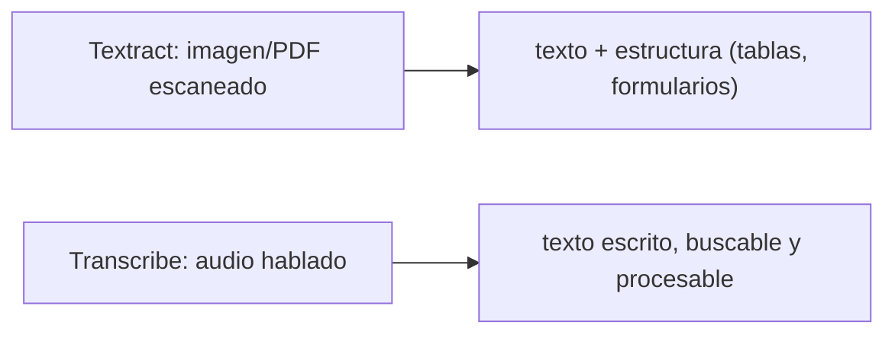
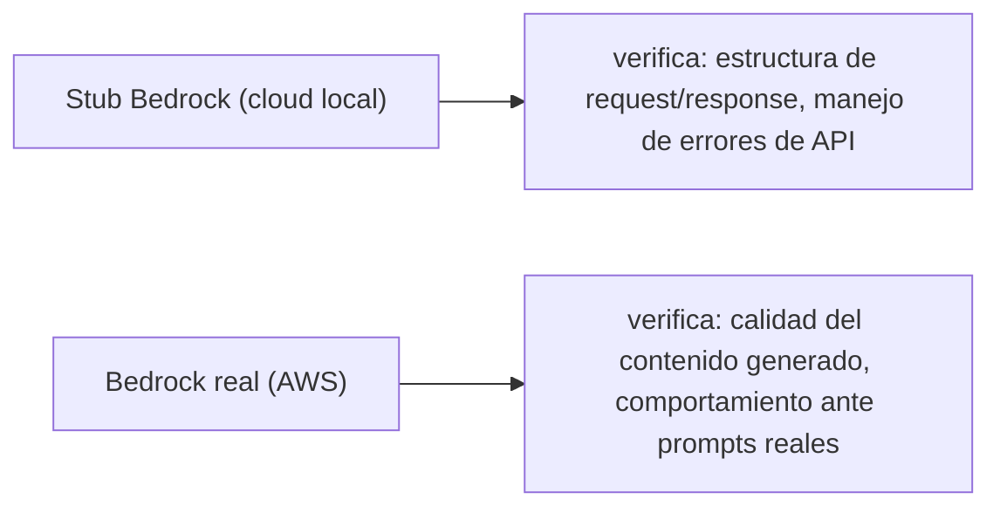

# Módulo 20: IA y servicios especializados: Bedrock, Textract y Transcribe


## Aprende construyendo

### Tema 1: Bedrock Runtime y respuestas stub deterministas

#### Paso 1 · Objetivo y preparación
Al finalizar vas a usar Bedrock para redactar el texto del SMS de confirmación de entrega (Módulo 10-11), y a comprobar qué parte de eso es realmente verificable en local. Prerrequisitos: Módulos 10 y 11 completos.
#### Paso 2 · Contexto y caso real
En vez de un SMS con texto fijo, RutaFlow quiere que un LLM redacte un mensaje breve y natural por cada entrega ("Tu pedido env-4471 llegó a las 14:32") — pero ese texto va a cambiar entre invocaciones reales, así que el código que lo consume no puede depender de un contenido exacto.
#### Paso 3 · Teoría, modelo mental y analogía
El contrato (la forma del JSON de entrada y salida) es el formulario; el contenido generado puede variar y se evalúa por separado, nunca con un `assert` de texto exacto.
#### Paso 4 · Demostración guiada
```bash
aws bedrock-runtime invoke-model --model-id anthropic.claude-3-sonnet-20240229-v1:0 \
  --body '{"prompt":"Redacta un SMS breve confirmando la entrega del envío env-4471","max_tokens":50}' \
  --cli-binary-format raw-in-base64-out salida1.json
aws bedrock-runtime invoke-model --model-id anthropic.claude-3-sonnet-20240229-v1:0 \
  --body '{"prompt":"Redacta un SMS breve confirmando la entrega del envío env-4471","max_tokens":50}' \
  --cli-binary-format raw-in-base64-out salida2.json
diff salida1.json salida2.json
```
Resultado esperado: `diff` no muestra ninguna diferencia — Floci devuelve exactamente la misma respuesta stub para el mismo prompt, algo que un modelo real jamás garantizaría. Esto te deja probar con confianza que tu código parsea bien la respuesta, no que el texto generado es bueno.
#### Paso 5 · Práctica guiada
Pista: escribí el código que lee la respuesta asumiendo un campo `completion` (en vez del campo real que Floci devuelve en su stub) — ese es el fallo deliberado: tu parseo falla con un valor `undefined`, no porque Bedrock haya cambiado nada, sino porque asumiste la forma del contrato sin confirmarla primero contra la respuesta real del stub.
#### Paso 6 · Práctica independiente
Probá qué pasa si el prompt pide explícitamente algo fuera del `max_tokens` configurado (un mensaje mucho más largo que 50 tokens), y documentá cómo tu código debería manejar una respuesta truncada sin que el SMS le llegue cortado a la mitad al cliente.
#### Paso 7 · Cierre y evidencia
Entregá el stub determinista del Paso 4, el error de contrato mal asumido del Paso 5, y el manejo de truncamiento del Paso 6; explicá qué de todo esto seguiría siendo cierto contra el Bedrock real, y qué no. Siguiente paso: extracción. Errores comunes: probar solo texto feliz y filtrar datos sensibles. Fuente oficial: https://docs.aws.amazon.com/bedrock/latest/userguide/what-is-bedrock.html.
**Conceptos clave:** probar la estructura del contrato de integración, no el contenido generativo real.

```bash
aws bedrock-runtime invoke-model --model-id anthropic.claude-3-sonnet-20240229-v1:0 --body '{"prompt":"Hola","max_tokens":100}' --cli-binary-format raw-in-base64-out output.json
```

`--model-id` elige qué modelo invocar (acá, un modelo de Claude 3 de Anthropic); `--body` es el JSON con el prompt y los parámetros de generación (aquí, `max_tokens` limita cuánto puede responder el modelo); `--cli-binary-format raw-in-base64-out` es un ajuste de formato de la propia AWS CLI (no del modelo) necesario porque `invoke-model` maneja datos binarios — le dice a la CLI que acepte el `--body` tal cual en vez de esperar que ya venga codificado en base64.

Bedrock Runtime expone modelos de IA generativa (LLMs de distintos proveedores) a través de una API HTTP unificada (`InvokeModel`), permitiendo integrar capacidades de generación de texto, resumen, o análisis en una aplicación sin gestionar infraestructura de modelo propia; cloud local, al no poder ejecutar modelos de lenguaje reales localmente (por su tamaño y requisitos computacionales), devuelve en cambio una respuesta stub determinista: la misma entrada siempre produce exactamente la misma salida predefinida, en vez de la variabilidad inherente y no determinista de un modelo real (donde incluso el mismo prompt exacto puede producir respuestas ligeramente distintas en invocaciones sucesivas).

Esta determinismo del stub es una característica deliberada y valiosa para testing: permite escribir pruebas automatizadas confiables sobre el flujo de integración completo (¿la aplicación construye correctamente el prompt? ¿parsea correctamente la estructura de la respuesta? ¿maneja correctamente errores de la API?) sin la variabilidad no determinista que haría frágil cualquier aserción sobre el contenido exacto de una respuesta generativa real.

**Analogía:** un stub determinista de Bedrock es como un maniquí de práctica que siempre responde de forma idéntica y predecible ante el mismo estímulo específico de entrenamiento, permitiendo verificar consistentemente que el procedimiento de interacción se ejecuta correctamente, en vez de practicar con una persona real cuyas respuestas variarían de forma natural entre cada repetición del mismo ejercicio.

**¿Por qué es importante?** cloud local usa stubs deterministas para IA en vez de modelos reales porque permite escribir pruebas automatizadas confiables sobre la estructura del flujo de integración, sin la variabilidad no determinista inherente de un modelo real que haría frágil cualquier aserción sobre contenido exacto.

**Prueba en terminal:**

```bash
aws bedrock-runtime invoke-model --model-id ... --body '{"prompt":"Hola"}' ...
# cloud local: MISMA entrada → SIEMPRE la misma salida stub (determinista)
# AWS real: misma entrada → puede variar entre invocaciones (no determinista)
```

### Tema 2: Textract y Transcribe

#### Paso 1 · Objetivo y preparación
Al finalizar vas a extraer automáticamente cliente y monto de una factura escaneada (Módulo 13) con Textract, y a transcribir el reporte de voz de un conductor con Transcribe. Prerrequisitos: Módulo 13 completo.
#### Paso 2 · Contexto y caso real
Facturación recibe fotos de facturas en papel que hoy alguien transcribe a mano a la tabla `facturas` (Módulo 13); y un conductor reporta incidencias por nota de voz que nadie escucha hasta el día siguiente.
#### Paso 3 · Teoría, modelo mental y analogía
La extracción es pasar de una imagen de factura a un formulario estructurado con campos nombrados, en vez de que un humano la transcriba línea por línea.
#### Paso 4 · Demostración guiada
```bash
aws s3 cp factura-escaneada.jpg s3://adjuntos-tareas/facturas/factura-001.jpg
aws textract analyze-document --document '{"S3Object":{"Bucket":"adjuntos-tareas","Name":"facturas/factura-001.jpg"}}' --feature-types FORMS
aws transcribe start-transcription-job --transcription-job-name reporte-conductor-c891 \
  --media '{"MediaFileUri":"s3://adjuntos-tareas/audios/reporte-c891.mp3"}' --output-bucket-name adjuntos-tareas
```
Resultado esperado: `analyze-document` devuelve pares clave-valor (`Cliente: ...`, `Monto: ...`) que podrías insertar directamente en la tabla `facturas` del Módulo 13; `start-transcription-job` arranca un trabajo asíncrono cuyo resultado vas a consultar después, no de inmediato.
#### Paso 5 · Práctica guiada
Pista: subí una foto borrosa o con el monto tapado y repetí `analyze-document` — ese es el fallo deliberado: Textract puede devolver el campo `Monto` con un `Confidence` bajo (o directamente no detectarlo), y aceptar ese valor sin revisar la confianza significaría cargar un monto incorrecto a la tabla `facturas` sin que nadie lo note.
#### Paso 6 · Práctica independiente
Escribí la regla de negocio que faltaría en el código: si `Confidence` de cualquier campo extraído es menor a un umbral (por ejemplo 80%), la factura se marca para revisión humana en vez de insertarse directamente en `facturas`.
#### Paso 7 · Cierre y evidencia
Entregá la extracción exitosa del Paso 4, el campo de baja confianza del Paso 5, y la regla de revisión humana del Paso 6; explicá por qué "Textract respondió algo" no es lo mismo que "Textract respondió algo confiable". Siguiente paso: límites. Errores comunes: aceptar extracción sin confianza y no conservar original. Fuente oficial: https://docs.aws.amazon.com/textract/latest/dg/what-is.html.
**Conceptos clave:** extracción estructurada de información desde formatos no estructurados (imágenes, audio).

```bash
aws textract analyze-document --document '{"S3Object":{"Bucket":"mi-bucket","Name":"documento.jpg"}}' --feature-types TABLES FORMS
```

`--document` apunta al archivo a analizar (acá, un objeto en S3); `--feature-types` elige qué tipo de estructura extraer además del texto plano — `TABLES` para tablas, `FORMS` para pares clave-valor de formularios. En resumen: `--document` es la bandera que fija el archivo a analizar, y `--feature-types` es la bandera que elige qué estructura extraer.

Textract extrae texto y estructura (tablas, pares clave-valor de formularios) directamente de imágenes o PDFs escaneados mediante OCR (reconocimiento óptico de caracteres) combinado con comprensión estructural del documento, transformando un documento visual no estructurado en datos estructurados consumibles programáticamente (por ejemplo, extraer automáticamente los campos de una factura escaneada hacia un registro de base de datos), evitando el trabajo manual de transcripción de documentos que de otra forma requeriría intervención humana.

```bash
aws transcribe start-transcription-job --transcription-job-name mi-transcripcion --media '{"MediaFileUri":"s3://mi-bucket/audio.mp3"}' --output-bucket-name mi-bucket
```

`--transcription-job-name` identifica este trabajo de transcripción (para consultar su estado después); `--media` apunta al archivo de audio a transcribir; `--output-bucket-name` es el bucket donde Transcribe va a dejar el resultado una vez que termine. En resumen: `--transcription-job-name` es la bandera que nombra el trabajo de transcripción.

Transcribe convierte audio hablado en texto escrito (speech-to-text), un proceso asíncrono (se inicia el job y se consulta su estado posteriormente, similar al patrón de invocación asíncrona ya visto con otras operaciones de larga duración) apropiado para transcribir grabaciones de llamadas, reuniones, o contenido de audio hacia texto buscable y procesable, ambos servicios (Textract y Transcribe) representando la categoría de servicios de IA especializada preentrenada para una tarea específica bien definida, en contraste con Bedrock que expone modelos generativos de propósito más general.

**Analogía:** Textract es como un asistente que lee automáticamente documentos escaneados y extrae la información relevante hacia un formulario estructurado, sin requerir que un humano transcriba manualmente cada campo; Transcribe es como un taquígrafo automático que convierte una grabación de audio hablado en un documento de texto completo y buscable.

**¿Por qué es importante?** Textract y Transcribe extraen información estructurada de formatos no estructurados (imágenes, audio) automáticamente, evitando transcripción manual humana, representando servicios de IA especializada preentrenada para tareas específicas bien definidas.

**Diagrama:**



En el proyecto integrador RutaFlow, la regla de revisión humana por baja confianza del Paso 6
viviría en la misma función que escribe en la tabla `facturas` (Módulo 13) — una extensión
natural de `ConfirmarEntregaFn` o una Lambda hermana, siguiendo el patrón de
`examples/rutaflow/cloud/template.yaml`, nunca insertando directo sin ese chequeo.

### Tema 3: Stub vs mock, y qué probar localmente

#### Paso 1 · Objetivo y preparación
Al finalizar vas a documentar, para los SMS generados (Tema 1) y las facturas extraídas (Tema 2), qué se puede confiar probando en Floci y qué necesita el servicio real de AWS. Prerrequisitos: Temas 1-2 de este módulo.
#### Paso 2 · Contexto y caso real
Antes de llevar esto a producción, alguien del equipo de RutaFlow va a preguntar "¿ya probamos que esto funciona?" — y la respuesta correcta depende de qué significa "probar" en cada caso.
#### Paso 3 · Teoría, modelo mental y analogía
La prueba local con el stub valida el cableado (¿tu código llama bien a la API y parsea bien la respuesta?); el servicio real valida el comportamiento (¿el SMS generado suena natural? ¿Textract leyó bien una factura arrugada de verdad?).
#### Paso 4 · Demostración guiada
```bash
# Lo que SÍ confirma el stub de Floci (estructura del contrato):
aws bedrock-runtime invoke-model --model-id anthropic.claude-3-sonnet-20240229-v1:0 \
  --body '{"prompt":"test","max_tokens":10}' --cli-binary-format raw-in-base64-out stub.json
cat stub.json
```
Resultado esperado: confirmás que tu código recibe y parsea correctamente la forma del JSON — eso es exactamente lo que el stub puede validar con confianza, ni más ni menos.
#### Paso 5 · Práctica guiada
Pista: afirmá en tu documentación interna que "ya validamos localmente que el SMS generado suena natural y profesional" basándote solo en la respuesta del stub de Floci — ese es el fallo deliberado: el stub nunca varía su texto, así que no probaste nada sobre la calidad real del lenguaje generado, solo sobre si tu código sabe leer la respuesta.
#### Paso 6 · Práctica independiente
Armá una tabla de dos columnas ("se prueba localmente con el stub" / "necesita el servicio real") y clasificá: parseo de la respuesta de Bedrock, calidad del texto del SMS, forma del JSON de Textract, precisión del OCR sobre una foto real borrosa, manejo de errores HTTP de la API, tiempo de respuesta real bajo carga.
#### Paso 7 · Cierre y evidencia
Entregá la validación de contrato del Paso 4, la afirmación incorrecta corregida del Paso 5, y la tabla de límites del Paso 6; explicá por qué pasar todas las pruebas contra el stub nunca es suficiente para decir "esto ya está probado" sin matices. Siguiente paso: seguridad. Errores comunes: confundir mock con modelo y no medir coste. Fuente oficial: https://docs.aws.amazon.com/bedrock/latest/userguide/model-evaluation.html.
**Conceptos clave:** distinguir qué se puede verificar con confianza localmente frente a lo que requiere el servicio real.

Un stub (usado por cloud local para Bedrock) es una implementación que devuelve respuestas predefinidas y deterministas, útil para verificar que la aplicación maneja correctamente la estructura esperada de una respuesta (¿el código extrae correctamente el campo de texto generado de la respuesta JSON? ¿maneja correctamente un código de error?); un mock, en el sentido más estricto usado en testing (Módulo 9 de varios tracks de esta Academia), típicamente además verifica que se invocó de una forma específica esperada (con ciertos argumentos, un número específico de veces). En la práctica de cloud local, "stub" describe con más precisión el comportamiento: una respuesta fija y predecible, sin verificación de la forma exacta de la invocación en sí misma.

Documentar explícitamente qué partes de la arquitectura de IA se pueden probar localmente con el stub (la estructura del contrato de integración: parseo de request/response, manejo de errores de API, flujo completo de la aplicación) frente a qué partes requieren necesariamente el modelo real de AWS para una validación completa (la calidad y relevancia real del contenido generado, el comportamiento ante prompts ambiguos o adversariales, los límites reales de tokens y su impacto en respuestas truncadas) es una práctica de ingeniería madura que evita la falsa confianza de asumir que pasar pruebas contra el stub garantiza que el sistema de IA completo funcionará correctamente en producción sin ninguna validación adicional contra el servicio real.

**Analogía:** un stub es como un guion de práctica con respuestas fijas y predecibles para ensayar el protocolo de una conversación; un mock añade además la verificación de que se siguieron exactamente los pasos esperados del guion. Documentar qué se prueba localmente frente a qué requiere el entorno real es como distinguir entre un simulacro de emergencia (que verifica el protocolo de procedimiento) y el manejo real de una emergencia genuina (que pone a prueba capacidades que el simulacro no puede replicar completamente).

**¿Por qué es importante?** Un stub devuelve respuestas fijas deterministas sin verificar la forma de invocación (a diferencia de un mock más estricto); documentar qué se prueba localmente frente a lo que requiere el modelo real evita la falsa confianza de asumir cobertura completa solo por pasar pruebas contra el stub.

**Diagrama:**



---


## Laboratorio práctico

> Este laboratorio asume que ya ejecutaste `floci start` y `eval $(floci env)` (Módulo 1) en tu sesión de terminal, así que los comandos de `aws` no repiten `--endpoint-url`.

**Objetivo del laboratorio:** construir una API que procesa documentos con Textract, guarda el texto en DynamoDB y genera un resumen con Bedrock.

**Requisitos previos:** Módulo 19 completado.

| Paso | Acción | Comando | Explicación |
|---|---|---|---|
| 1 | Invocar un modelo de Bedrock Runtime | `aws bedrock-runtime invoke-model` | Observa la respuesta stub determinista |
| 2 | Extraer texto de una imagen con Textract | `aws textract analyze-document --feature-types TABLES FORMS` | OCR + estructura |
| 3 | Transcribir un audio con Transcribe | `aws transcribe start-transcription-job` | Proceso asíncrono |
| 4 | Escribir una prueba de contrato para el stub | Ver Tema 3 | Verifica estructura, no contenido exacto |
| 5 | Documentar qué partes requieren AWS real | Ver Tema 3 | Contratos locales vs validación real |

**Verificación:** el laboratorio se considera exitoso si la API procesa correctamente un documento (extrae texto, lo guarda, genera un resumen), y si la prueba de contrato verifica la estructura de la respuesta del stub sin depender de un contenido exacto no determinista.

**Errores comunes y soluciones**

- **Asumir que pasar pruebas contra el stub de Bedrock garantiza calidad del contenido generado en producción.** Documenta explícitamente qué requiere validación contra el modelo real.
- **Escribir aserciones sobre el contenido exacto de una respuesta de IA real esperando determinismo.** Los modelos reales no son deterministas; verifica estructura, no contenido exacto, en pruebas automatizadas.
- **Confundir un stub simple con un mock que verifica invocaciones.** Distingue el propósito de cada uno según lo que necesitas verificar.

---
