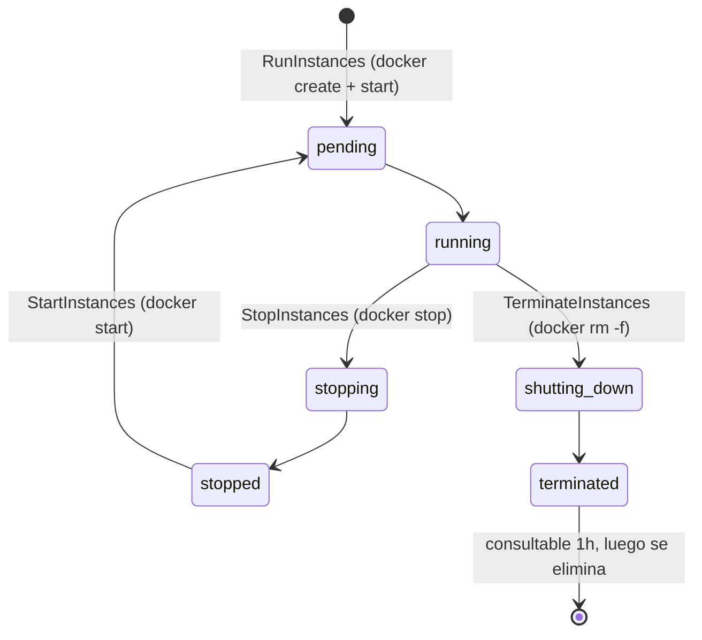

# Módulo 21: Cómputo elástico con EC2 y Auto Scaling


## Aprende construyendo

### Tema 1: El modelo de ejecución de EC2 — instancias que son contenedores Docker reales

#### Paso 1 · Objetivo y preparación
Al finalizar podrás lanzar una instancia desde cero. Prerrequisitos: Docker y Node.js; verifica `node --version`.
#### Paso 2 · Contexto y caso real
Una tarea persistente necesita control del sistema operativo y del proceso.
#### Paso 3 · Teoría, modelo mental y analogía
Una instancia es alquilar una máquina completa con ciclo de vida explícito.
#### Paso 4 · Demostración guiada
Crea `src/instance.js` desde una carpeta vacía.
```bash
mkdir ejemplo-ec2
node --version
```
Resultado esperado: Node disponible.
#### Paso 5 · Práctica guiada
Pista: usa una imagen inexistente para provocar un fallo deliberado y corrígelo.
#### Paso 6 · Práctica independiente
Inicia, inspecciona y detén una instancia simulada.
#### Paso 7 · Cierre y evidencia
Entrega configuración, salida, fallo y corrección; explica el resultado. Siguiente paso: seguridad. Errores comunes: instancias sin apagado y puertos abiertos. Fuente oficial: https://docs.aws.amazon.com/ec2/.
**Conceptos clave:** `RunInstances`, ciclo de vida de instancia, contenedor Docker real, `tail -f /dev/null`.

A diferencia de un emulador que solo devuelve un JSON con un `instance-id` falso, Floci traduce cada llamada a `RunInstances` en un `docker run` real: se lanza un contenedor Docker verdadero que se mantiene activo con `tail -f /dev/null`, un truco que permite que funcione cualquier imagen base sin importar cuál sea su `CMD` por defecto. El ciclo de vida completo de una instancia EC2 se mapea directamente a operaciones de Docker: `pending → running` es un contenedor creado e iniciado, `stopping → stopped` es un `docker stop` (con 30 segundos de gracia antes de `SIGKILL`), y `shutting-down → terminated` es un `docker rm -f`. Las instancias terminadas siguen siendo consultables durante una hora antes de desaparecer, replicando el comportamiento real de EC2.

Esta decisión de diseño —contenedores reales en vez de estado simulado— es la misma filosofía que ya viste con Lambda, RDS y ECS: Floci prioriza fidelidad de comportamiento sobre velocidad de implementación cuando el servicio lo justifica. El resultado práctico es que dentro de una instancia EC2 de Floci puedes instalar paquetes, ejecutar procesos reales y conectarte por SSH exactamente como lo harías en una instancia real, solo que el "hardware" subyacente es el motor Docker de tu máquina.

**Analogía:** una instancia EC2 en Floci es como un departamento amueblado de verdad dentro de un edificio de pruebas: no es una maqueta de cartón, es un espacio real donde puedes vivir, solo que el edificio completo (el datacenter de AWS) es en realidad tu propio computador.

**¿Por qué es importante?** Entender que `RunInstances` lanza un contenedor real —no un stub— es lo que te permite razonar correctamente sobre qué vas a poder hacer dentro de la instancia (instalar software, correr servicios, usar SSH) y qué limitaciones existen (comparte el kernel de tu máquina, no aísla red a nivel de paquete).

**Diagrama:**



**Practícalo tú:**

```bash
# archivo: src/labs/modulo-21/tema-1-ciclo-de-vida.sh — ejecutar con: bash tema-1-ciclo-de-vida.sh
ID=$(aws ec2 run-instances --image-id ami-amazonlinux2023 --instance-type t2.micro \
  --query 'Instances[0].InstanceId' --output text)
docker ps | grep "$ID"          # contenedor real, estado "Up"
aws ec2 stop-instances --instance-ids "$ID"
sleep 3
docker ps -a | grep "$ID"       # mismo contenedor, ahora "Exited"
```

`--image-id` es la bandera que elige qué AMI (imagen de máquina) lanzar — acá resuelta a una imagen Docker real, como ves más abajo; `--instance-type` es el tamaño de la instancia (CPU/memoria — `t2.micro` es de las más chicas); `--instance-ids` (usado más abajo con `stop-instances`) identifica qué instancia puntual controlar, tomando el valor que guardaste del primer comando.

**Resultado esperado:** el primer `docker ps` muestra el contenedor en estado `Up`; después de `stop-instances`, `docker ps -a` lo muestra `Exited` — la prueba de que `pending/running/stopped` de EC2 son estados reales de Docker, no un campo simulado en una base de datos.

**Modifica esto:** repite el experimento pero termina la instancia con `aws ec2 terminate-instances` en vez de detenerla, y confirma con `docker ps -a` que el contenedor desaparece por completo (`docker rm -f`) en vez de quedar `Exited`.

**Cuándo no usarlo:** no asumas que el contenedor aísla red, CPU o memoria como lo haría una instancia EC2 real; comparte el kernel y la red de tu máquina, así que no sirve para pruebas de aislamiento o de rendimiento comparables a producción.

**Cómo crece tu proyecto:** esta instancia es el primer nodo de cómputo que usará tu proyecto para correr el agente de seguimiento del proyecto integrador — arráncala y detenla aquí antes de conectarla a nada más.

### Tema 2: AMIs, grupos de seguridad y claves SSH

#### Paso 1 · Objetivo y preparación
Al finalizar podrás preparar acceso seguro desde cero. Prerrequisitos: Docker y Node.js; verifica `node --version`.
#### Paso 2 · Contexto y caso real
Una instancia necesita identidad, red y acceso controlado.
#### Paso 3 · Teoría, modelo mental y analogía
La AMI es molde, security group es portería y key pair es llave.
#### Paso 4 · Demostración guiada
Crea `src/access.js` desde una carpeta vacía.
```bash
mkdir ejemplo-acceso
node --version
```
Resultado esperado: Node disponible.
#### Paso 5 · Práctica guiada
Pista: deniega el puerto necesario para provocar un fallo deliberado y corrígelo.
#### Paso 6 · Práctica independiente
Documenta regla mínima y acceso SSH.
#### Paso 7 · Cierre y evidencia
Entrega reglas, salida, fallo y corrección; explica el resultado. Siguiente paso: UserData. Errores comunes: claves en repositorio y 0.0.0.0/0 innecesario. Fuente oficial: https://docs.aws.amazon.com/AWSEC2/latest/UserGuide/ec2-security-groups.html.
**Conceptos clave:** mapeo de AMI a imagen Docker, `CreateSecurityGroup`, `ImportKeyPair`, inyección de clave pública.

**Practícalo tú:**

```bash
# archivo: src/labs/modulo-21/tema-2-security-group-y-clave.sh — ejecutar con: bash tema-2-security-group-y-clave.sh
GROUP_ID=$(aws ec2 create-security-group \
  --group-name demo-nodo --description "SG del primer nodo demo" \
  --query 'GroupId' --output text)
aws ec2 authorize-security-group-ingress --group-id "$GROUP_ID" --protocol tcp --port 22 --cidr 0.0.0.0/0
aws ec2 import-key-pair --key-name demo-key --public-key-material fileb://~/.ssh/id_rsa.pub
```

`--group-name` nombra el grupo de seguridad al crearlo; el ID que devuelve ese comando es lo que después identifica con `--group-id` en el comando de `authorize-security-group-ingress`. Ese comando abre una regla de entrada: `--protocol` y `--port` (acá, TCP puerto 22, el de SSH) definen qué tráfico permitir, y `--cidr` es el rango de IPs de origen autorizado (`0.0.0.0/0` significa "cualquier IP", sin restricción). `--key-name` nombra el par de claves al importarlo; `--public-key-material` es el contenido de tu clave pública SSH real (`fileb://` la lee como archivo binario). En resumen: `--group-name` es la bandera que nombra el grupo al crearlo, y `--group-id` es la bandera que lo identifica en comandos posteriores.

**Resultado esperado:** `create-security-group` devuelve un `GroupId`; `import-key-pair` devuelve un `KeyFingerprint`. Ambos quedan guardados y consultables — pero, como leíste arriba, el `GroupId` no bloquea ni permite tráfico real: la regla vive en el registro de Floci, no en la red puente de Docker.

**Modifica esto:** ejecuta `aws ec2 describe-security-groups --group-ids $GROUP_ID` y confirma que la regla de entrada al puerto 22 aparece en la respuesta aunque, como acabas de leer, no se aplique de verdad.

**Cuándo no usarlo:** no valides reglas de firewall de producción contra este grupo de seguridad; esa prueba solo es válida contra AWS real.

**Cómo crece tu proyecto:** `demo-nodo` y `demo-key` son el grupo y la clave que usarás para lanzar y conectarte por SSH al primer nodo de cómputo de reparto del proyecto integrador.

Floci resuelve identificadores de AMI en imágenes Docker reales mediante una tabla de mapeo incorporada: `ami-amazonlinux2023` apunta a `public.ecr.aws/amazonlinux/amazonlinux:2023`, `ami-ubuntu2204` a `public.ecr.aws/docker/library/ubuntu:22.04`, y así con Debian y Alpine. Cualquier ID de AMI que no reconozca —incluyendo IDs reales de AWS como `ami-0abc12345678`— cae por defecto en Amazon Linux 2023, así que scripts existentes que referencian AMIs reales siguen funcionando sin modificación.

Los grupos de seguridad se crean, almacenan y devuelven correctamente vía `CreateSecurityGroup` y `AuthorizeSecurityGroupIngress`, pero **no se aplican a nivel de red**: es la red puente de Docker la que maneja el enrutamiento real, no las reglas de tu grupo de seguridad. Esto es importante para no asumir aislamiento de red que en Floci no existe. Donde sí hay comportamiento real es en las claves SSH: `CreateKeyPair` genera un PEM ficticio que no sirve para SSH real, pero `ImportKeyPair` acepta una clave pública tuya de verdad, y Floci la copia dentro del contenedor en `/root/.ssh/authorized_keys` al arrancar, exponiendo el puerto 22 del contenedor en un puerto del host (rango por defecto 2200–2299).

**Analogía:** el mapeo de AMI a imagen Docker es como pedir "una copia de Ubuntu 22.04" en un catálogo y que siempre te entreguen exactamente esa versión, sin importar qué código de catálogo internacional escribas si no lo reconocen: por defecto te dan la opción más segura y común.

**¿Por qué es importante?** Saber que los grupos de seguridad no filtran tráfico realmente en Floci evita que confundas "mi laboratorio funcionó a pesar de reglas restrictivas" con "mis reglas de seguridad son correctas": esa validación real solo la obtienes contra AWS de verdad.

### Tema 3: UserData e IMDS — arranque automatizado y credenciales por instancia

#### Paso 1 · Objetivo y preparación
Al finalizar podrás inicializar una instancia desde cero. Prerrequisitos: Docker y Node.js; verifica `node --version`.
#### Paso 2 · Contexto y caso real
El arranque debe instalar dependencias sin incrustar credenciales.
#### Paso 3 · Teoría, modelo mental y analogía
UserData es la lista de apertura; IMDSv2 entrega credenciales con token.
#### Paso 4 · Demostración guiada
Crea `src/bootstrap.sh` desde una carpeta vacía.
```bash
mkdir ejemplo-bootstrap
node --version
```
Resultado esperado: Node disponible.
#### Paso 5 · Práctica guiada
Pista: usa una instrucción inválida para provocar un fallo deliberado y corrígelo.
#### Paso 6 · Práctica independiente
Verifica idempotencia y logs de arranque.
#### Paso 7 · Cierre y evidencia
Entrega script, salida, fallo y corrección; explica el resultado. Siguiente paso: escalado. Errores comunes: secretos en UserData y usar IMDSv1. Fuente oficial: https://docs.aws.amazon.com/AWSEC2/latest/UserGuide/user-data.html.
**Conceptos clave:** `UserData` en base64, IMDSv1 vs IMDSv2, token de sesión, credenciales IAM vía perfil de instancia.

La bandera `--user-data` de `run-instances` es donde le pasás ese script. `UserData` es un script que se ejecuta automáticamente al arrancar la instancia, codificado en base64 en la petición (igual que en AWS real). Floci lo decodifica, lo copia a `/tmp/user-data.sh` dentro del contenedor y lo ejecuta con `sh` justo después de inyectar la clave SSH, capturando su salida en los logs. Esto es lo que te permite, por ejemplo, instalar y arrancar `nginx` automáticamente al lanzar la instancia, sin conectarte manualmente después.

El servicio de metadatos de instancia (IMDS) es un servidor HTTP que Floci expone en el puerto `9169` del host, y cada contenedor lanzado recibe la variable `AWS_EC2_METADATA_SERVICE_ENDPOINT` apuntando a él. IMDSv1 responde sin autenticación; IMDSv2 exige primero pedir un token con `PUT /latest/api/token` y usarlo en cada petición posterior — el flujo moderno y más seguro que ya deberías preferir siempre. Cuando lanzas una instancia con un perfil de instancia IAM (`--iam-instance-profile`), IMDS entrega credenciales temporales reales en `/latest/meta-data/iam/security-credentials/{role}`, que el AWS SDK dentro del contenedor puede usar automáticamente para llamar a otros servicios de Floci con validación SigV4 completa — el mismo patrón que usarías en producción real.

**Analogía:** IMDS es como una recepción interna del edificio que solo el inquilino de un departamento específico puede consultar para pedir "¿cuál es mi dirección? ¿tengo paquetes esperando? ¿cuáles son mis llaves temporales de acceso?" — información contextual sobre uno mismo, no del edificio entero.

**¿Por qué es importante?** El patrón "instancia con rol IAM que obtiene credenciales vía IMDS" es la forma correcta y recomendada de dar permisos a una instancia EC2 real, en vez de hardcodear credenciales de larga duración dentro de la instancia — un error de seguridad común que quieres evitar desde el principio.

**Practícalo tú:**

```bash
# archivo: src/labs/modulo-21/tema-3-userdata-imds.sh — ejecutar con: bash tema-3-userdata-imds.sh
aws ec2 run-instances --image-id ami-amazonlinux2023 --instance-type t2.micro \
  --user-data '#!/bin/bash
echo "listo" > /tmp/listo.txt'
# docker ps -lq = el contenedor creado más recientemente (el que acabas de lanzar)
docker logs "$(docker ps -lq)" | grep listo

TOKEN=$(curl -s -X PUT http://localhost:9169/latest/api/token -H "x-aws-ec2-metadata-token-ttl-seconds: 21600")
curl -s -H "x-aws-ec2-metadata-token: $TOKEN" http://localhost:9169/latest/meta-data/instance-id
```

**Resultado esperado:** `docker logs` muestra la ejecución del script de `UserData` (no hace falta conectarte por SSH para confirmarlo); la petición IMDSv2 devuelve el mismo `InstanceId` que reportó `run-instances`.

**Modifica esto:** cambia el `UserData` para que también escriba la fecha (`date >> /tmp/listo.txt`) y confirma en los logs que ambas líneas aparecen en orden.

**Cuándo no usarlo:** no confíes en IMDSv1 (sin token) para nada que dependas en producción real; AWS lo desalienta activamente por motivos de seguridad (SSRF) y Floci lo soporta solo por compatibilidad con scripts antiguos.

**Cómo crece tu proyecto:** el patrón `UserData` + credenciales por `IMDS` es el que usará el nodos de reparto para autoconfigurarse al arrancar, sin que nadie tenga que conectarse manualmente a instalarlo.

### Tema 4: Auto Scaling — configuraciones de lanzamiento y grupos

#### Paso 1 · Objetivo y preparación
Al finalizar podrás definir capacidad automática desde cero. Prerrequisitos: Docker y Node.js; verifica `node --version`.
#### Paso 2 · Contexto y caso real
La demanda de entregas cambia durante el día y necesita capacidad elástica.
#### Paso 3 · Teoría, modelo mental y analogía
ASG es una flota con mínimo, máximo y objetivo declarados.
#### Paso 4 · Demostración guiada
Crea `src/asg.js` desde una carpeta vacía.
```bash
mkdir ejemplo-asg
node --version
```
Resultado esperado: Node disponible.
#### Paso 5 · Práctica guiada
Pista: configura mínimo mayor que máximo para provocar un fallo deliberado y corrígelo.
#### Paso 6 · Práctica independiente
Simula scale-out y scale-in.
#### Paso 7 · Cierre y evidencia
Entrega configuración, salida, fallo y corrección; explica el resultado. Siguiente paso: políticas. Errores comunes: capacidad deseada inconsistente y healthcheck ausente. Fuente oficial: https://docs.aws.amazon.com/autoscaling/ec2/userguide/what-is-amazon-ec2-auto-scaling.html.
**Conceptos clave:** launch configuration, Auto Scaling Group, capacidad mínima/máxima/deseada, adjunto a grupos objetivo ELB.

Una configuración de lanzamiento (`CreateLaunchConfiguration`) es una plantilla que describe qué instancia lanzar: imagen, tipo de instancia, clave SSH, grupos de seguridad y UserData. Un Auto Scaling Group (`CreateAutoScalingGroup`) referencia esa plantilla y define capacidad mínima, máxima y deseada, además de las zonas de disponibilidad donde debe distribuir instancias. A partir de ahí, el grupo se encarga de mantener el número de instancias `InService` alineado con la capacidad deseada — tú declaras el resultado que quieres, no los pasos para lograrlo.

Los grupos de Auto Scaling se pueden adjuntar a grupos objetivo de un Application/Network Load Balancer (`AttachLoadBalancerTargetGroups`): cuando el reconciliador lanza una instancia nueva, la registra automáticamente en esos grupos objetivo como `InService`, y cuando termina una instancia, la da de baja del balanceador antes de eliminarla — evitando que el balanceador siga enviando tráfico a una instancia que ya no existe.

**Analogía:** una configuración de lanzamiento es la receta de un plato; un Auto Scaling Group es el compromiso de un restaurante de "siempre tener entre 2 y 5 porciones de ese plato listas en la cocina, ajustando cuántas se cocinan según la demanda del momento".

**¿Por qué es importante?** Separar la plantilla (qué lanzar) de la política de capacidad (cuántas y cuándo) es el mismo patrón declarativo que verás una y otra vez en infraestructura moderna — Kubernetes Deployments, ECS Services — y entenderlo aquí te da una base sólida para reconocerlo en cualquier plataforma.

**Practícalo tú:**

```bash
# archivo: src/labs/modulo-21/tema-4-launch-config.sh — ejecutar con: bash tema-4-launch-config.sh
aws autoscaling create-launch-configuration \
  --launch-configuration-name demo-lc \
  --image-id ami-amazonlinux2023 --instance-type t2.micro
aws autoscaling create-auto-scaling-group \
  --auto-scaling-group-name demo-asg \
  --launch-configuration-name demo-lc \
  --min-size 1 --max-size 3 --desired-capacity 1 \
  --availability-zones us-east-1a
```

`--launch-configuration-name` nombra la plantilla (creada en el primer comando, referenciada en el segundo); `--auto-scaling-group-name` nombra el grupo; `--min-size`, `--max-size` y `--desired-capacity` son, respectivamente, el mínimo, el máximo y la cantidad que el grupo intenta mantener activa en todo momento; `--availability-zones` es en qué zonas físicas distribuir esas instancias. En resumen: `--launch-configuration-name` es la bandera que nombra la plantilla, `--auto-scaling-group-name` es la bandera que nombra el grupo, y `--min-size`/`--max-size`/`--desired-capacity` son las banderas que fijan el mínimo, el máximo y la capacidad deseada.

**Resultado esperado:** ambos comandos terminan sin salida (éxito silencioso, igual que en AWS real); `aws autoscaling describe-auto-scaling-groups --auto-scaling-group-names demo-asg` muestra el grupo con una instancia en `LifecycleState: InService` a los pocos segundos.

**Modifica esto:** guarda la definición de la configuración de lanzamiento en `launch-config.json` y vuelve a crearla pasando `--cli-input-json file://launch-config.json` en vez de flags sueltos — así es como versionarías esta plantilla en un repositorio real.

**Cuándo no usarlo:** las configuraciones de lanzamiento (launch configurations) están en modo de solo-mantenimiento en AWS real desde 2023; en un proyecto nuevo fuera de este curso usarías Launch Templates, no este recurso.

**Cómo crece tu proyecto:** `demo-asg` es el grupo que mantiene siempre disponible al menos un nodo de reparto activo para el proyecto integrador, incluso si uno falla.

### Tema 5: El reconciliador de capacidad y las políticas de escalado

#### Paso 1 · Objetivo y preparación
Al finalizar podrás operar escalado desde cero. Prerrequisitos: Docker y Node.js; verifica `node --version`.
#### Paso 2 · Contexto y caso real
Una política debe reaccionar a métricas sin generar oscilaciones.
#### Paso 3 · Teoría, modelo mental y analogía
El reconciliador compara señal y capacidad, como un supervisor de turnos.
#### Paso 4 · Demostración guiada
Crea `src/scaling.js` desde una carpeta vacía.
```bash
mkdir ejemplo-scaling
node --version
```
Resultado esperado: Node disponible.
#### Paso 5 · Práctica guiada
Pista: fija un umbral imposible para provocar un fallo deliberado y corrígelo.
#### Paso 6 · Práctica independiente
Añade cooldown y lifecycle hook.
#### Paso 7 · Cierre y evidencia
Entrega política, salida, fallo y corrección; explica el resultado. Siguiente paso: VPC. Errores comunes: escalar por métrica ruidosa y olvidar cooldown. Fuente oficial: https://docs.aws.amazon.com/autoscaling/ec2/userguide/as-scaling-simple-step.html.
**Conceptos clave:** reconciliador de capacidad, ciclo de 10 segundos, scale-out, scale-in, lifecycle hooks, políticas de escalado.

Floci ejecuta en segundo plano un reconciliador de capacidad que corre cada 10 segundos: compara el número de instancias `InService` de cada grupo contra su `DesiredCapacity`. Si faltan instancias (scale-out), llama a `RunInstances` con la configuración de lanzamiento del grupo y las nuevas instancias pasan de `Pending` a `InService` en cuanto EC2 las reporta `running`, registrándose automáticamente en cualquier grupo objetivo ELB adjunto. Si sobran instancias (scale-in), selecciona instancias no protegidas contra reducción, las da de baja de los grupos objetivo y las termina. Cada evento de escalado queda registrado en el historial de actividad del grupo (`DescribeScalingActivities`), así que siempre puedes auditar cuándo y por qué cambió la capacidad.

Los lifecycle hooks (`PutLifecycleHook`) te permiten insertar una pausa controlada durante el lanzamiento o la terminación de una instancia —por ejemplo, para ejecutar un script de configuración antes de marcarla `InService`— señalizando `CONTINUE` o `ABANDON` cuando termines. Las políticas de escalado (`PutScalingPolicy`) automatizan el ajuste de `DesiredCapacity` en respuesta a eventos, aunque en este curso vas a practicar el caso más simple: cambiarlo manualmente con `SetDesiredCapacity` y observar al reconciliador reaccionar.

**Analogía:** el reconciliador de capacidad es como un encargado de turno que cada 10 segundos cuenta cuántos meseros hay trabajando, y si faltan llama a alguien de la lista de guardia; si sobran, envía a alguien a casa — sin que el gerente tenga que estar pendiente minuto a minuto.

**¿Por qué es importante?** Este patrón de "reconciliación continua hacia un estado deseado" es el mismo principio detrás de Kubernetes, Terraform y casi toda la infraestructura declarativa moderna: aprenderlo aquí, con un ciclo de 10 segundos que puedes observar en vivo, es mucho más intuitivo que leerlo solo en teoría.

**Practícalo tú:**

```bash
# archivo: src/labs/modulo-21/tema-5-reconciliador.sh — ejecutar con: bash tema-5-reconciliador.sh
aws autoscaling set-desired-capacity --auto-scaling-group-name demo-asg --desired-capacity 3
sleep 12
aws autoscaling describe-scaling-activities --auto-scaling-group-name demo-asg
```

**Resultado esperado:** en los ~12 segundos de espera (más de un ciclo de reconciliación de 10 s), el reconciliador lanza 2 instancias adicionales; `describe-scaling-activities` muestra las actividades de lanzamiento hasta llegar a 3 instancias `InService`, sin que tú hayas llamado a `run-instances` manualmente.

**Modifica esto:** vuelve a bajar `--desired-capacity` a 1 y observa en `describe-scaling-activities` cómo el reconciliador ahora termina instancias (scale-in) en vez de lanzarlas, hasta volver a 1 `InService`.

**Cuándo no usarlo:** no uses `set-desired-capacity` manual como sustituto de una política de escalado real en producción; ahí querrías políticas dirigidas por métricas (`PutScalingPolicy`) que reaccionen solas a CPU o latencia, no un valor fijo que cambias a mano.

**Cómo crece tu proyecto:** este es el mismo mecanismo que mantiene la flota de nodos de reparto al tamaño correcto durante picos de pedidos, sin intervención manual.

---


## Laboratorio práctico

> Este laboratorio asume que ya ejecutaste `floci start` y `eval $(floci env)` (Módulo 1) en tu sesión de terminal, así que los comandos de `aws` no repiten `--endpoint-url`.

**Objetivo del laboratorio:** lanzar una instancia EC2 real con acceso SSH funcional verificado vía IMDS, y luego crear un Auto Scaling Group y observar al reconciliador de Floci mantener la capacidad deseada automáticamente.

**Requisitos previos:** Floci corriendo con el socket Docker montado (`-v /var/run/docker.sock:/var/run/docker.sock`) y el puerto `9169` (IMDS) expuesto si necesitas consultarlo desde fuera de la red puente de Docker.

### Laboratorio 21.1 — Lanzar una instancia EC2 con acceso SSH e IMDS

| Paso | Acción | Comando | Explicación | Salida esperada |
|---|---|---|---|---|
| 1 | Importa tu clave pública SSH | `aws ec2 import-key-pair --key-name mi-clave --public-key-material fileb://~/.ssh/id_rsa.pub` | Registra tu clave pública real para inyectarla en la instancia | Un `KeyFingerprint` en la respuesta |
| 2 | Lanza una instancia con UserData | `aws ec2 run-instances --image-id ami-amazonlinux2023 --instance-type t2.micro --key-name mi-clave --user-data '#!/bin/bash\necho hola > /tmp/listo.txt'` | Crea un contenedor Docker real basado en Amazon Linux 2023 y ejecuta el script al arrancar | Un `InstanceId` con estado `pending` |
| 3 | Confirma que está en ejecución | `aws ec2 describe-instances --instance-ids <id>` | El estado debe pasar a `running` en pocos segundos | `"Name": "running"` en `State` |
| 4 | Verifica que Docker realmente la lanzó | `docker ps \| grep <id>` | Confirma que existe un contenedor real, no solo un registro simulado | Una fila con el contenedor de la instancia |
| 5 | Consulta IMDSv2 desde dentro del contenedor | `docker exec <container-id> sh -c 'TOKEN=$(curl -s -X PUT http://169.254.169.254/latest/api/token -H "x-aws-ec2-metadata-token-ttl-seconds: 21600"); curl -s -H "x-aws-ec2-metadata-token: $TOKEN" http://169.254.169.254/latest/meta-data/instance-id'` | Pide un token IMDSv2 y lo usa para consultar el instance-id | El mismo `InstanceId` devuelto en el paso 2 |

### Laboratorio 21.2 — Auto Scaling Group con reconciliador en vivo

| Paso | Acción | Comando | Explicación | Salida esperada |
|---|---|---|---|---|
| 1 | Crea una configuración de lanzamiento | `aws autoscaling create-launch-configuration --launch-configuration-name mi-lc --image-id ami-amazonlinux2023 --instance-type t2.micro` | Define la plantilla que usará el grupo para lanzar instancias | Sin salida (éxito silencioso) |
| 2 | Crea el grupo con capacidad deseada 2 | `aws autoscaling create-auto-scaling-group --auto-scaling-group-name mi-asg --launch-configuration-name mi-lc --min-size 1 --max-size 5 --desired-capacity 2 --availability-zones us-east-1a` | Arranca el ciclo de reconciliación de capacidad | Sin salida (éxito silencioso) |
| 3 | Observa cómo aparecen las instancias | `aws autoscaling describe-auto-scaling-groups --auto-scaling-group-names mi-asg` | El reconciliador lanza instancias cada 10 s hasta alcanzar la capacidad deseada | 2 instancias listadas con `LifecycleState: InService` |
| 4 | Sube la capacidad deseada a 4 | `aws autoscaling set-desired-capacity --auto-scaling-group-name mi-asg --desired-capacity 4` | Ordena un scale-out | Sin salida (éxito silencioso) |
| 5 | Confirma el escalado y revisa el historial | `aws autoscaling describe-scaling-activities --auto-scaling-group-name mi-asg` | El reconciliador lanza 2 instancias adicionales en los siguientes ~10 s | Actividades de tipo lanzamiento registradas hasta llegar a 4 instancias `InService` |

**Verificación:** el laboratorio se considera exitoso si `docker ps` muestra un contenedor real para la instancia EC2 lanzada, la consulta a IMDSv2 devuelve el mismo `InstanceId` que reportó `run-instances`, y `describe-auto-scaling-groups` muestra que el grupo llegó a 4 instancias `InService` después de subir la capacidad deseada, sin que hayas lanzado ninguna manualmente.

**Errores comunes y soluciones**

- **IMDS no responde desde fuera del contenedor.** El puerto `9169` no está expuesto en tu `docker-compose.yml`. Añade `"9169:9169"` a los `ports` del servicio `floci` y reinicia con `docker compose up -d`.
- **`ImportKeyPair` funciona pero SSH pide contraseña.** Revisa que estés usando la clave privada correspondiente a la pública importada, y que el puerto SSH asignado (rango 2200–2299) sea el correcto: consúltalo con `docker port <container-id>`.
- **El Auto Scaling Group no lanza instancias.** Verifica que el socket Docker esté montado (`-v /var/run/docker.sock:/var/run/docker.sock`); sin él, EC2 —y por lo tanto Auto Scaling— no puede lanzar contenedores reales.
- **Las instancias no se registran en el grupo objetivo del balanceador.** Confirma que usaste `attach-load-balancer-target-groups` con el ARN correcto del Módulo 22, y que el grupo objetivo existe antes de adjuntarlo.

---
