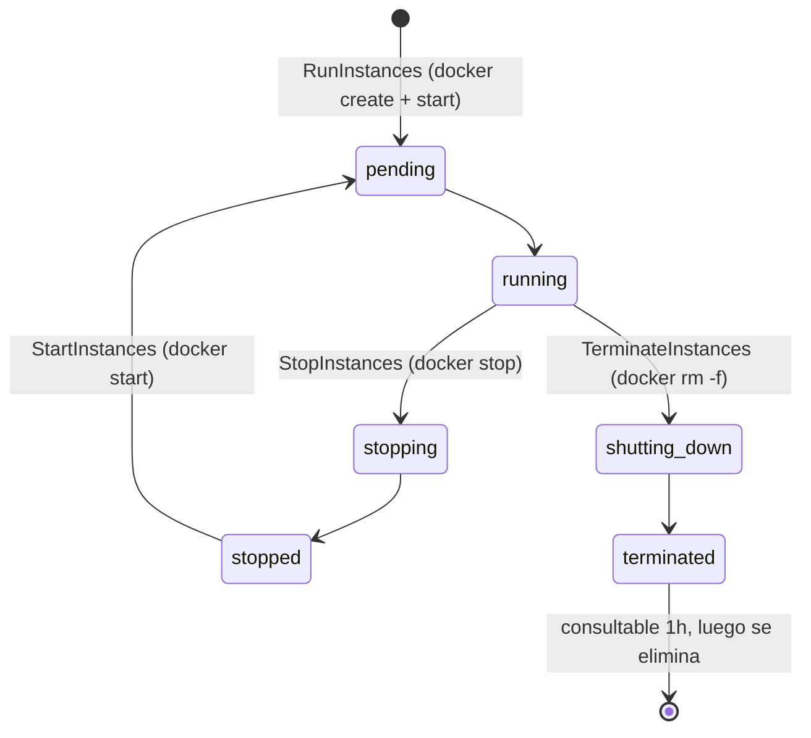

# Módulo 21: Cómputo elástico con EC2 y Auto Scaling

## Sílabo

**Objetivo general**

Entender el modelo de ejecución de instancias EC2 en Floci —contenedores Docker reales, no simulaciones—, dominar el ciclo de vida completo de una instancia (lanzar, detener, reiniciar, terminar), el servicio de metadatos (IMDS) y la inyección de claves SSH y UserData, y usar Auto Scaling para mantener automáticamente una capacidad deseada de instancias sin intervención manual.

**Objetivos específicos**

1. Lanzar una instancia EC2 con `RunInstances` y explicar en qué contenedor Docker real se traduce.
2. Inyectar una clave SSH con `ImportKeyPair` y conectarte a la instancia por SSH.
3. Consultar el servicio de metadatos de instancia (IMDS) desde dentro del contenedor, incluyendo credenciales IAM temporales.
4. Crear un Auto Scaling Group con capacidad mínima, máxima y deseada, y observar cómo el reconciliador de Floci lanza y termina instancias para mantenerla.

**Contenido**

- Modelo de ejecución EC2: `RunInstances` como `docker run` real, mapeo de estados.
- AMIs soportadas y su traducción a imágenes Docker.
- Grupos de seguridad, pares de claves e inyección SSH.
- UserData y el servicio de metadatos de instancia (IMDS v1/v2).
- Launch configurations y Auto Scaling Groups.
- El reconciliador de capacidad y las políticas de escalado.

**Evaluación**

Dos laboratorios prácticos (lanzar una instancia real con acceso SSH y crear un Auto Scaling Group que se autorregula) y tres ejercicios de evaluación.

---

## Contenido teórico

### Tema 1: El modelo de ejecución de EC2 — instancias que son contenedores Docker reales

**Conceptos clave:** `RunInstances`, ciclo de vida de instancia, contenedor Docker real, `tail -f /dev/null`.

A diferencia de un emulador que solo devuelve un JSON con un `instance-id` falso, Floci traduce cada llamada a `RunInstances` en un `docker run` real: se lanza un contenedor Docker verdadero que se mantiene activo con `tail -f /dev/null`, un truco que permite que funcione cualquier imagen base sin importar cuál sea su `CMD` por defecto. El ciclo de vida completo de una instancia EC2 se mapea directamente a operaciones de Docker: `pending → running` es un contenedor creado e iniciado, `stopping → stopped` es un `docker stop` (con 30 segundos de gracia antes de `SIGKILL`), y `shutting-down → terminated` es un `docker rm -f`. Las instancias terminadas siguen siendo consultables durante una hora antes de desaparecer, replicando el comportamiento real de EC2.

Esta decisión de diseño —contenedores reales en vez de estado simulado— es la misma filosofía que ya viste con Lambda, RDS y ECS: Floci prioriza fidelidad de comportamiento sobre velocidad de implementación cuando el servicio lo justifica. El resultado práctico es que dentro de una instancia EC2 de Floci puedes instalar paquetes, ejecutar procesos reales y conectarte por SSH exactamente como lo harías en una instancia real, solo que el "hardware" subyacente es el motor Docker de tu máquina.

**Analogía:** una instancia EC2 en Floci es como un departamento amueblado de verdad dentro de un edificio de pruebas: no es una maqueta de cartón, es un espacio real donde puedes vivir, solo que el edificio completo (el datacenter de AWS) es en realidad tu propio computador.

**¿Por qué es importante?** Entender que `RunInstances` lanza un contenedor real —no un stub— es lo que te permite razonar correctamente sobre qué vas a poder hacer dentro de la instancia (instalar software, correr servicios, usar SSH) y qué limitaciones existen (comparte el kernel de tu máquina, no aísla red a nivel de paquete).

**Diagrama:**

### Tema 2: AMIs, grupos de seguridad y claves SSH

**Conceptos clave:** mapeo de AMI a imagen Docker, `CreateSecurityGroup`, `ImportKeyPair`, inyección de clave pública.

Floci resuelve identificadores de AMI en imágenes Docker reales mediante una tabla de mapeo incorporada: `ami-amazonlinux2023` apunta a `public.ecr.aws/amazonlinux/amazonlinux:2023`, `ami-ubuntu2204` a `public.ecr.aws/docker/library/ubuntu:22.04`, y así con Debian y Alpine. Cualquier ID de AMI que no reconozca —incluyendo IDs reales de AWS como `ami-0abc12345678`— cae por defecto en Amazon Linux 2023, así que scripts existentes que referencian AMIs reales siguen funcionando sin modificación.

Los grupos de seguridad se crean, almacenan y devuelven correctamente vía `CreateSecurityGroup` y `AuthorizeSecurityGroupIngress`, pero **no se aplican a nivel de red**: es la red puente de Docker la que maneja el enrutamiento real, no las reglas de tu grupo de seguridad. Esto es importante para no asumir aislamiento de red que en Floci no existe. Donde sí hay comportamiento real es en las claves SSH: `CreateKeyPair` genera un PEM ficticio que no sirve para SSH real, pero `ImportKeyPair` acepta una clave pública tuya de verdad, y Floci la copia dentro del contenedor en `/root/.ssh/authorized_keys` al arrancar, exponiendo el puerto 22 del contenedor en un puerto del host (rango por defecto 2200–2299).

**Analogía:** el mapeo de AMI a imagen Docker es como pedir "una copia de Ubuntu 22.04" en un catálogo y que siempre te entreguen exactamente esa versión, sin importar qué código de catálogo internacional escribas si no lo reconocen: por defecto te dan la opción más segura y común.

**¿Por qué es importante?** Saber que los grupos de seguridad no filtran tráfico realmente en Floci evita que confundas "mi laboratorio funcionó a pesar de reglas restrictivas" con "mis reglas de seguridad son correctas": esa validación real solo la obtienes contra AWS de verdad.

### Tema 3: UserData e IMDS — arranque automatizado y credenciales por instancia

**Conceptos clave:** `UserData` en base64, IMDSv1 vs IMDSv2, token de sesión, credenciales IAM vía perfil de instancia.

`UserData` es un script que se ejecuta automáticamente al arrancar la instancia, codificado en base64 en la petición (igual que en AWS real). Floci lo decodifica, lo copia a `/tmp/user-data.sh` dentro del contenedor y lo ejecuta con `sh` justo después de inyectar la clave SSH, capturando su salida en los logs. Esto es lo que te permite, por ejemplo, instalar y arrancar `nginx` automáticamente al lanzar la instancia, sin conectarte manualmente después.

El servicio de metadatos de instancia (IMDS) es un servidor HTTP que Floci expone en el puerto `9169` del host, y cada contenedor lanzado recibe la variable `AWS_EC2_METADATA_SERVICE_ENDPOINT` apuntando a él. IMDSv1 responde sin autenticación; IMDSv2 exige primero pedir un token con `PUT /latest/api/token` y usarlo en cada petición posterior — el flujo moderno y más seguro que ya deberías preferir siempre. Cuando lanzas una instancia con un perfil de instancia IAM (`--iam-instance-profile`), IMDS entrega credenciales temporales reales en `/latest/meta-data/iam/security-credentials/{role}`, que el AWS SDK dentro del contenedor puede usar automáticamente para llamar a otros servicios de Floci con validación SigV4 completa — el mismo patrón que usarías en producción real.

**Analogía:** IMDS es como una recepción interna del edificio que solo el inquilino de un departamento específico puede consultar para pedir "¿cuál es mi dirección? ¿tengo paquetes esperando? ¿cuáles son mis llaves temporales de acceso?" — información contextual sobre uno mismo, no del edificio entero.

**¿Por qué es importante?** El patrón "instancia con rol IAM que obtiene credenciales vía IMDS" es la forma correcta y recomendada de dar permisos a una instancia EC2 real, en vez de hardcodear credenciales de larga duración dentro de la instancia — un error de seguridad común que quieres evitar desde el principio.

### Tema 4: Auto Scaling — configuraciones de lanzamiento y grupos

**Conceptos clave:** launch configuration, Auto Scaling Group, capacidad mínima/máxima/deseada, adjunto a grupos objetivo ELB.

Una configuración de lanzamiento (`CreateLaunchConfiguration`) es una plantilla que describe qué instancia lanzar: imagen, tipo de instancia, clave SSH, grupos de seguridad y UserData. Un Auto Scaling Group (`CreateAutoScalingGroup`) referencia esa plantilla y define capacidad mínima, máxima y deseada, además de las zonas de disponibilidad donde debe distribuir instancias. A partir de ahí, el grupo se encarga de mantener el número de instancias `InService` alineado con la capacidad deseada — tú declaras el resultado que quieres, no los pasos para lograrlo.

Los grupos de Auto Scaling se pueden adjuntar a grupos objetivo de un Application/Network Load Balancer (`AttachLoadBalancerTargetGroups`): cuando el reconciliador lanza una instancia nueva, la registra automáticamente en esos grupos objetivo como `InService`, y cuando termina una instancia, la da de baja del balanceador antes de eliminarla — evitando que el balanceador siga enviando tráfico a una instancia que ya no existe.

**Analogía:** una configuración de lanzamiento es la receta de un plato; un Auto Scaling Group es el compromiso de un restaurante de "siempre tener entre 2 y 5 porciones de ese plato listas en la cocina, ajustando cuántas se cocinan según la demanda del momento".

**¿Por qué es importante?** Separar la plantilla (qué lanzar) de la política de capacidad (cuántas y cuándo) es el mismo patrón declarativo que verás una y otra vez en infraestructura moderna — Kubernetes Deployments, ECS Services — y entenderlo aquí te da una base sólida para reconocerlo en cualquier plataforma.

### Tema 5: El reconciliador de capacidad y las políticas de escalado

**Conceptos clave:** reconciliador de capacidad, ciclo de 10 segundos, scale-out, scale-in, lifecycle hooks, políticas de escalado.

Floci ejecuta en segundo plano un reconciliador de capacidad que corre cada 10 segundos: compara el número de instancias `InService` de cada grupo contra su `DesiredCapacity`. Si faltan instancias (scale-out), llama a `RunInstances` con la configuración de lanzamiento del grupo y las nuevas instancias pasan de `Pending` a `InService` en cuanto EC2 las reporta `running`, registrándose automáticamente en cualquier grupo objetivo ELB adjunto. Si sobran instancias (scale-in), selecciona instancias no protegidas contra reducción, las da de baja de los grupos objetivo y las termina. Cada evento de escalado queda registrado en el historial de actividad del grupo (`DescribeScalingActivities`), así que siempre puedes auditar cuándo y por qué cambió la capacidad.

Los lifecycle hooks (`PutLifecycleHook`) te permiten insertar una pausa controlada durante el lanzamiento o la terminación de una instancia —por ejemplo, para ejecutar un script de configuración antes de marcarla `InService`— señalizando `CONTINUE` o `ABANDON` cuando termines. Las políticas de escalado (`PutScalingPolicy`) automatizan el ajuste de `DesiredCapacity` en respuesta a eventos, aunque en este curso vas a practicar el caso más simple: cambiarlo manualmente con `SetDesiredCapacity` y observar al reconciliador reaccionar.

**Analogía:** el reconciliador de capacidad es como un encargado de turno que cada 10 segundos cuenta cuántos meseros hay trabajando, y si faltan llama a alguien de la lista de guardia; si sobran, envía a alguien a casa — sin que el gerente tenga que estar pendiente minuto a minuto.

**¿Por qué es importante?** Este patrón de "reconciliación continua hacia un estado deseado" es el mismo principio detrás de Kubernetes, Terraform y casi toda la infraestructura declarativa moderna: aprenderlo aquí, con un ciclo de 10 segundos que puedes observar en vivo, es mucho más intuitivo que leerlo solo en teoría.

---

## Criterio transversal de calidad del código

Aplica estas decisiones en todos los ejemplos y en tu entrega:

- usa nombres que expresen intención, dominio y unidades; evita `data`, `temp`, `manager` o `process` cuando exista un término preciso;
- mantén funciones, componentes, clases, consultas y módulos cohesionados alrededor de una responsabilidad comprobable;
- haz visibles las dependencias y los efectos de red, tiempo, archivos, estado y base de datos;
- valida entradas en la frontera y representa errores con contexto, sin ocultar la causa ni registrar secretos;
- elimina duplicación de reglas, no toda repetición textual; una abstracción incorrecta cuesta más que dos líneas parecidas;
- escribe primero la solución más simple que satisface el requisito y refactoriza con pruebas verdes;
- aplica SOLID únicamente cuando exista una necesidad real de cambio, extensión, sustitución o aislamiento.

**SOLID con criterio:** responsabilidad única significa una razón coherente de cambio, no una clase por función. Abierto/cerrado justifica estrategias cuando hay variantes reales. Sustitución exige respetar contratos. Segregación evita obligar a consumidores a depender de operaciones que no usan. Inversión de dependencias protege el dominio frente a detalles externos; no exige crear interfaces para cada objeto.

**Comprobación antes de continuar:** ¿otra persona puede entender los nombres y el flujo?, ¿los casos de error son observables?, ¿una prueba demuestra la regla principal?, ¿cada abstracción aporta más claridad de la que cuesta? Registra una decisión de refactorización y una decisión consciente de *no abstraer*.

## Laboratorio práctico

> Este laboratorio asume que ya ejecutaste `floci start` y `eval $(floci env)` (Módulo 1) en tu sesión de terminal, así que los comandos de `aws` no repiten `--endpoint-url`.

**Objetivo del laboratorio:** lanzar una instancia EC2 real con acceso SSH funcional verificado vía IMDS, y luego crear un Auto Scaling Group y observar al reconciliador de Floci mantener la capacidad deseada automáticamente.

**Requisitos previos:** Floci corriendo con el socket Docker montado (`-v /var/run/docker.sock:/var/run/docker.sock`) y el puerto `9169` (IMDS) expuesto si necesitas consultarlo desde fuera de la red puente de Docker.

### Laboratorio 21.1 — Lanzar una instancia EC2 con acceso SSH e IMDS

| Paso | Acción | Comando | Explicación | Salida esperada |
|---|---|---|---|---|
| 1 | Importa tu clave pública SSH | `aws ec2 import-key-pair --key-name mi-clave --public-key-material fileb://~/.ssh/id_rsa.pub` | Registra tu clave pública real para inyectarla en la instancia | Un `KeyFingerprint` en la respuesta |
| 2 | Lanza una instancia con UserData | `aws ec2 run-instances --image-id ami-amazonlinux2023 --instance-type t2.micro --key-name mi-clave --user-data '#!/bin/bash\necho hola > /tmp/listo.txt'` | Crea un contenedor Docker real basado en Amazon Linux 2023 y ejecuta el script al arrancar | Un `InstanceId` con estado `pending` |
| 3 | Confirma que está en ejecución | `aws ec2 describe-instances --instance-ids <id>` | El estado debe pasar a `running` en pocos segundos | `"Name": "running"` en `State` |
| 4 | Verifica que Docker realmente la lanzó | `docker ps \| grep <id>` | Confirma que existe un contenedor real, no solo un registro simulado | Una fila con el contenedor de la instancia |
| 5 | Consulta IMDSv2 desde dentro del contenedor | `docker exec <container-id> sh -c 'TOKEN=$(curl -s -X PUT http://169.254.169.254/latest/api/token -H "x-aws-ec2-metadata-token-ttl-seconds: 21600"); curl -s -H "x-aws-ec2-metadata-token: $TOKEN" http://169.254.169.254/latest/meta-data/instance-id'` | Pide un token IMDSv2 y lo usa para consultar el instance-id | El mismo `InstanceId` devuelto en el paso 2 |

### Laboratorio 21.2 — Auto Scaling Group con reconciliador en vivo

| Paso | Acción | Comando | Explicación | Salida esperada |
|---|---|---|---|---|
| 1 | Crea una configuración de lanzamiento | `aws autoscaling create-launch-configuration --launch-configuration-name mi-lc --image-id ami-amazonlinux2023 --instance-type t2.micro` | Define la plantilla que usará el grupo para lanzar instancias | Sin salida (éxito silencioso) |
| 2 | Crea el grupo con capacidad deseada 2 | `aws autoscaling create-auto-scaling-group --auto-scaling-group-name mi-asg --launch-configuration-name mi-lc --min-size 1 --max-size 5 --desired-capacity 2 --availability-zones us-east-1a` | Arranca el ciclo de reconciliación de capacidad | Sin salida (éxito silencioso) |
| 3 | Observa cómo aparecen las instancias | `aws autoscaling describe-auto-scaling-groups --auto-scaling-group-names mi-asg` | El reconciliador lanza instancias cada 10 s hasta alcanzar la capacidad deseada | 2 instancias listadas con `LifecycleState: InService` |
| 4 | Sube la capacidad deseada a 4 | `aws autoscaling set-desired-capacity --auto-scaling-group-name mi-asg --desired-capacity 4` | Ordena un scale-out | Sin salida (éxito silencioso) |
| 5 | Confirma el escalado y revisa el historial | `aws autoscaling describe-scaling-activities --auto-scaling-group-name mi-asg` | El reconciliador lanza 2 instancias adicionales en los siguientes ~10 s | Actividades de tipo lanzamiento registradas hasta llegar a 4 instancias `InService` |

**Verificación:** el laboratorio se considera exitoso si `docker ps` muestra un contenedor real para la instancia EC2 lanzada, la consulta a IMDSv2 devuelve el mismo `InstanceId` que reportó `run-instances`, y `describe-auto-scaling-groups` muestra que el grupo llegó a 4 instancias `InService` después de subir la capacidad deseada, sin que hayas lanzado ninguna manualmente.

**Errores comunes y soluciones**

- **IMDS no responde desde fuera del contenedor.** El puerto `9169` no está expuesto en tu `docker-compose.yml`. Añade `"9169:9169"` a los `ports` del servicio `floci` y reinicia con `docker compose up -d`.
- **`ImportKeyPair` funciona pero SSH pide contraseña.** Revisa que estés usando la clave privada correspondiente a la pública importada, y que el puerto SSH asignado (rango 2200–2299) sea el correcto: consúltalo con `docker port <container-id>`.
- **El Auto Scaling Group no lanza instancias.** Verifica que el socket Docker esté montado (`-v /var/run/docker.sock:/var/run/docker.sock`); sin él, EC2 —y por lo tanto Auto Scaling— no puede lanzar contenedores reales.
- **Las instancias no se registran en el grupo objetivo del balanceador.** Confirma que usaste `attach-load-balancer-target-groups` con el ARN correcto del Módulo 22, y que el grupo objetivo existe antes de adjuntarlo.

---

## Ejercicios de evaluación

### Ejercicio 1: RunInstances vs docker run directo

**Enunciado:** lanza un contenedor con `docker run -d alpine tail -f /dev/null` directamente, y por otro lado lanza una instancia EC2 con `aws ec2 run-instances --image-id ami-alpine`. Compara ambos con `docker inspect` y explica qué hace Floci de más en el segundo caso.

**Solución esperada:** ambos terminan siendo contenedores Docker reales y muy similares en `docker inspect`, pero el lanzado vía EC2 tiene metadatos adicionales (variables de entorno con el endpoint IMDS, posiblemente una clave SSH inyectada) y está registrado en el estado interno de Floci como una instancia EC2 con `InstanceId`, estado y atributos consultables vía `describe-instances` — algo que el contenedor lanzado directamente con `docker run` no tiene.

**Criterios de éxito:**
- Ejecutaste ambos comandos y comparaste su salida real con `docker inspect`.
- Identificas correctamente que la capa EC2 añade metadatos y registro de estado sobre el mismo mecanismo de Docker.

### Ejercicio 2: Diagnosticar un IMDS que no responde

**Enunciado:** intenta consultar IMDS desde tu terminal (fuera de cualquier contenedor) con `curl http://localhost:9169/latest/meta-data/instance-id` y probablemente falle si no expusiste el puerto. Diagnostica el problema y corrígelo sin destruir la instancia que ya tienes corriendo.

**Solución esperada:** el puerto `9169` no estaba expuesto en el `docker-compose.yml` del host de Floci (aunque dentro del contenedor de la instancia sí funciona vía `169.254.169.254`). La corrección es añadir el mapeo de puerto y reiniciar Floci; la instancia EC2 en sí no se ve afectada porque su ciclo de vida es independiente del reinicio de Floci si usas almacenamiento persistente.

**Criterios de éxito:**
- Diagnosticaste correctamente que el problema es de exposición de puerto del host, no del servicio IMDS en sí.
- Aplicaste la corrección y verificaste con un nuevo `curl` que ahora responde.

### Ejercicio 3: Scale-in manual y protección de instancias

**Enunciado:** con tu Auto Scaling Group en 4 instancias, baja la capacidad deseada a 1 con `set-desired-capacity`, y documenta con `describe-scaling-activities` qué instancias se terminaron y en qué orden. Luego explica cómo protegerías una instancia específica de ser terminada en un scale-in.

**Solución esperada:** el reconciliador selecciona 3 instancias `InService` no protegidas, las da de baja de cualquier grupo objetivo adjunto y las termina, dejando exactamente 1 activa. Para proteger una instancia específica de terminación durante scale-in, se marcaría con protección contra reducción de escala (instance scale-in protection) antes de bajar la capacidad deseada.

**Criterios de éxito:**
- Documentaste con evidencia real de `describe-scaling-activities` las 3 terminaciones.
- Explicas correctamente el mecanismo de protección contra scale-in, aunque no lo hayas ejecutado.

---

## Rúbrica del proyecto

Esta rúbrica evalúa el laboratorio y los ejercicios como evidencia de dominio, no la mera finalización de pasos.

| Criterio | Peso | Evidencia esperada |
|---|---:|---|
| Comprensión conceptual | 20% | Explica el mecanismo, sus límites y por qué la solución funciona. |
| Implementación funcional | 30% | El artefacto satisface requisitos normales, límite y de error. |
| Verificación | 20% | Incluye pruebas, mediciones o inspecciones reproducibles. |
| Diseño y calidad | 15% | Nombres, estructura, seguridad y mantenibilidad son deliberados. |
| Comunicación profesional | 15% | README, decisiones, comandos y resultados permiten repetir el trabajo. |

Se alcanza competencia con 70/100 y sin cero en implementación o verificación. El nivel experto exige comparar alternativas, justificar trade-offs y reconocer condiciones donde la solución dejaría de ser válida.

## Bibliografía y fundamento académico

Estas fuentes sustentan los conceptos y deben consultarse para verificar detalles que cambian entre versiones:

- AWS, Microsoft Azure y Google Cloud, marcos oficiales de arquitectura bien diseñada.
- NIST, *Cloud Computing Standards Roadmap* y *Secure Software Development Framework*.
- Beyer et al., *Site Reliability Engineering*.
- ACM/IEEE-CS/AAAI, *Computer Science Curricula 2023*.
- IEEE Computer Society, *SWEBOK Guide V4.0*.

## Resumen del módulo

En este módulo aprendiste que las instancias EC2 en Floci son contenedores Docker reales, no simulaciones: `RunInstances` ejecuta un `docker run` de verdad, con un ciclo de vida que se mapea directamente a operaciones de Docker. Practicaste la inyección de claves SSH reales, el consumo del servicio de metadatos IMDS (incluyendo el flujo seguro IMDSv2 con token), y UserData para arranque automatizado. Con Auto Scaling, viste cómo un reconciliador que corre cada 10 segundos mantiene la capacidad deseada de un grupo sin intervención manual, lanzando y terminando instancias, y registrándolas automáticamente en los grupos objetivo de un balanceador de carga — el mismo patrón de reconciliación continua que sustenta la infraestructura declarativa moderna.
