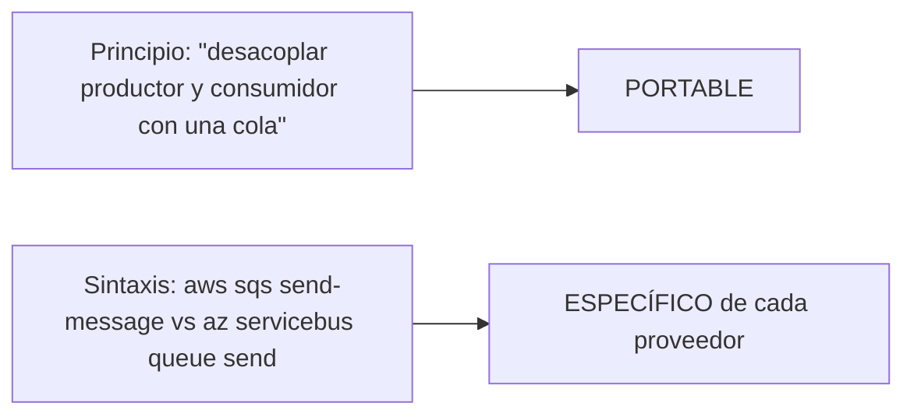
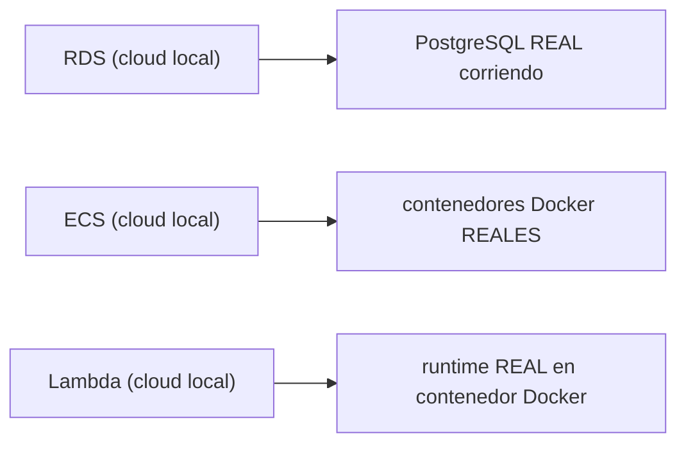
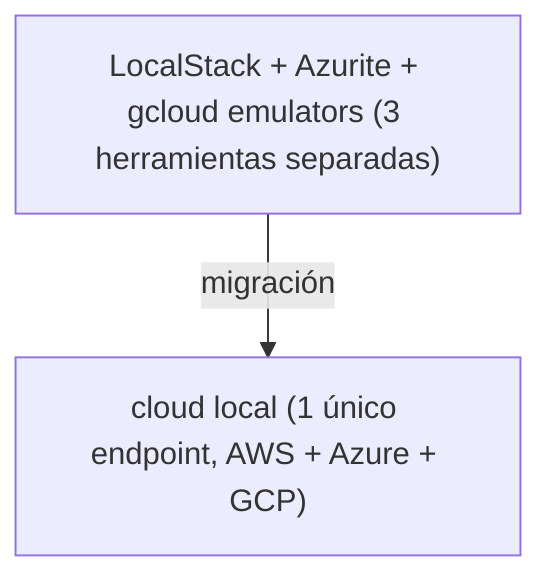
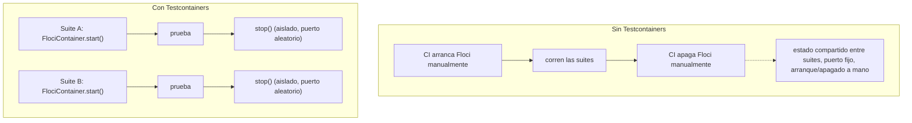

# Módulo 31: Proyecto integrador: API multi-nube con AWS, Azure y GCP


## Aprende construyendo

### Tema 1: Arquitectura multi-nube y portabilidad de conocimiento

#### Paso 1 · Objetivo y preparación
Al finalizar podrás diseñar contra interfaces desde cero. Prerrequisitos: Node.js y Docker; verifica `node --version`.
#### Paso 2 · Contexto y caso real
Una aplicación multi-cloud necesita cambiar proveedor sin rehacer dominio.
#### Paso 3 · Teoría, modelo mental y analogía
Los principios son planos; las APIs son herramientas locales.
#### Paso 4 · Demostración guiada
Crea `src/ports.js` desde una carpeta vacía.
```bash
mkdir ejemplo-ports
node --version
```
Resultado esperado: Node disponible.
#### Paso 5 · Práctica guiada
Pista: acopla dominio a SDK para provocar un fallo deliberado de diseño y corrígelo.
#### Paso 6 · Práctica independiente
Implementa dos adaptadores con el mismo puerto.
#### Paso 7 · Cierre y evidencia
Entrega diagrama, salida, fallo y corrección; explica el resultado. Siguiente paso: Testcontainers. Errores comunes: abstraer detalles sin necesidad y filtrar tipos del proveedor. Fuente oficial: https://12factor.net/.
**Conceptos clave:** los principios arquitectónicos son transferibles, las APIs específicas no lo son.

```
AWS: API Gateway → Lambda → DynamoDB / SQS / S3, protegido con Cognito, desplegado con CloudFormation
Azure: Functions → Cosmos DB / Service Bus / Blob Storage local
GCP: Firestore + Cloud Storage + Pub/Sub local (solo lectura)
```

Construir la misma API "Gestor de Tareas" tres veces, una por proveedor, revela directamente qué conocimiento es genuinamente transferible entre proveedores cloud y qué es específico de cada uno: los principios arquitectónicos fundamentales estudiados a lo largo de todo el track (funciones serverless orientadas a eventos, colas para desacoplar productores y consumidores, bases de datos NoSQL para patrones de acceso simples y conocidos, almacenamiento de objetos para archivos, autenticación delegada a un servicio especializado) se aplican de forma prácticamente idéntica en los tres proveedores, mientras que la sintaxis exacta de cada API, los nombres específicos de cada servicio, y ciertos detalles operativos particulares (cómo se configuran los triggers, el formato exacto de las políticas de permisos) sí difieren considerablemente entre AWS, Azure y GCP.

Esta distinción entre "principios portables" y "sintaxis específica de proveedor" es exactamente el mismo patrón de aprendizaje observado repetidamente a lo largo de toda la Academia: UDF es el mismo principio en Android, iOS, React y Angular aunque cada uno lo exprese con herramientas distintas (StateFlow, Combine, hooks, signals); de la misma forma, "desacoplar productores de consumidores con una cola" es el mismo principio en SQS, Service Bus y Pub/Sub, aunque cada API tenga su propia sintaxis particular de configuración.

**Analogía:** construir la misma app en tres proveedores cloud es como aprender a conducir vehículos de tres fabricantes distintos: los principios fundamentales de conducción (acelerar, frenar, girar, las reglas de tránsito) son completamente transferibles entre todos ellos, mientras que la ubicación exacta de cada control específico y ciertos detalles operativos particulares de cada fabricante requieren familiarización específica con cada modelo individual.

**¿Por qué es importante?** Lo que aprendiste en AWS aplica directamente en Azure y GCP a nivel de principios arquitectónicos fundamentales (serverless, colas, NoSQL, auth delegada), mientras la sintaxis exacta de cada API y ciertos detalles operativos son fundamentalmente diferentes y requieren aprendizaje específico por proveedor.

**Diagrama:**



### Tema 2: Arquitectura interna de cloud local y su uso en CI/CD

#### Paso 1 · Objetivo y preparación
Al finalizar podrás probar contra motores reales desde cero. Prerrequisitos: Docker y Node.js; verifica `node --version`.
#### Paso 2 · Contexto y caso real
Una prueba de integración debe detectar diferencias que un mock oculta.
#### Paso 3 · Teoría, modelo mental y analogía
Testcontainers levanta una instalación temporal, como un laboratorio desechable.
#### Paso 4 · Demostración guiada
Crea `tests/container.test.js` desde una carpeta vacía.
```bash
mkdir ejemplo-testcontainers
node --version
```
Resultado esperado: Node disponible.
#### Paso 5 · Práctica guiada
Pista: usa imagen inexistente para provocar un fallo deliberado y corrígelo.
#### Paso 6 · Práctica independiente
Arranca, prueba y destruye un contenedor.
#### Paso 7 · Cierre y evidencia
Entrega test, salida, fallo y corrección; explica el resultado. Siguiente paso: LocalStack. Errores comunes: contenedores persistentes y tests no aislados. Fuente oficial: https://testcontainers.com/guides/getting-started-with-testcontainers-for-node/.
**Conceptos clave:** motores reales, no simulaciones aproximadas; sin costo para pruebas de integración repetidas.

cloud local se distingue de simulaciones más superficiales de servicios cloud por su filosofía de "real engines, not mocks": cuando se crea una instancia RDS, corre PostgreSQL real (Módulo 13); cuando se crea un cluster ECS, corren contenedores Docker reales (Módulo 14); cuando se invoca Lambda, ejecuta el runtime real correspondiente en un contenedor Docker real, no una simulación aproximada de su comportamiento con lógica propia potencialmente divergente del comportamiento real de AWS; esta fidelidad de emulación, construida internamente sobre GraalVM (una máquina virtual que permite arranque considerablemente más rápido, en el orden de ~24 milisegundos, comparado con el arranque de una JVM tradicional) hace que cloud local sea considerablemente más confiable como entorno de pruebas que emuladores que reimplementan la lógica de cada servicio de forma aproximada y potencialmente divergente del comportamiento real.

Esta fidelidad hace que cloud local sea especialmente valioso integrado en pipelines de CI/CD: ejecutar pruebas de integración completas contra servicios cloud reales (no solo unit tests con mocks) en cada pull request, sin ningún costo asociado a crear y destruir recursos reales de AWS repetidamente, y con integración directa vía Testcontainers (una librería que gestiona el ciclo de vida de contenedores Docker específicamente para pruebas automatizadas, arrancando y destruyendo cloud local automáticamente alrededor de cada suite de pruebas de integración).

**Analogía:** cloud local es como un simulador de vuelo que usa los mismos sistemas de aviónica reales que un avión genuino, en vez de una recreación aproximada con lógica simplificada propia; usarlo en CI/CD es como poder entrenar con ese simulador de alta fidelidad tantas veces como sea necesario sin el costo ni el riesgo de usar un avión real para cada sesión de entrenamiento repetida.

**¿Por qué es importante?** cloud local usa motores reales (PostgreSQL real, Docker real, runtimes reales) en vez de simulaciones aproximadas, ofreciendo pruebas de integración de alta fidelidad sin costo en CI/CD, integrado con Testcontainers para gestionar automáticamente su ciclo de vida alrededor de cada suite de pruebas.

**Diagrama:**



Los tres casos siguen el mismo principio: "real engines, not mocks".

### Tema 3: Migración desde otros emuladores, y límites de un emulador

#### Paso 1 · Objetivo y preparación
Al finalizar podrás levantar una nube local desde cero. Prerrequisitos: Docker y Node.js; verifica `node --version`.
#### Paso 2 · Contexto y caso real
Un equipo necesita probar integraciones sin credenciales ni coste real.
#### Paso 3 · Teoría, modelo mental y analogía
Un endpoint unificado es un aeropuerto de entrenamiento con servicios simulados.
#### Paso 4 · Demostración guiada
Crea `docker-compose.yml` desde una carpeta vacía.
```bash
mkdir ejemplo-localstack
node --version
```
Resultado esperado: Node disponible.
#### Paso 5 · Práctica guiada
Pista: usa servicio no emulado para provocar un fallo deliberado y documenta el límite.
#### Paso 6 · Práctica independiente
Levanta, prueba y apaga el entorno.
#### Paso 7 · Cierre y evidencia
Entrega compose, salida, fallo y corrección; explica el resultado. Siguiente paso: módulos por lenguaje. Errores comunes: usar emulador en producción y asumir paridad total. Fuente oficial: https://docs.localstack.cloud/.
**Conceptos clave:** un único endpoint unificado multi-servicio, apropiado para desarrollo, no para producción.

Migrar desde LocalStack (el emulador de AWS más establecido históricamente), Azurite (el emulador oficial de Azure Storage), o los emuladores individuales de gcloud hacia un único endpoint de cloud local que emula los tres proveedores simplifica la configuración de un entorno de desarrollo que necesita trabajar con múltiples servicios cloud simultáneamente (por ejemplo, el proyecto multi-nube de este mismo módulo), evitando gestionar tres herramientas de emulación completamente separadas con configuraciones, puertos y comportamientos potencialmente inconsistentes entre sí.

La **Migración desde LocalStack** comienza inventariando servicios, endpoints, variables, inicializadores y diferencias de compatibilidad antes de sustituir el contenedor; después se ejecuta la misma suite de integración contra ambos entornos y se documenta cualquier comportamiento distinto.

Un límite importante que debe reconocerse explícitamente: cloud local (como cualquier emulador, sin importar su fidelidad) es una herramienta diseñada para desarrollo y pruebas, no un sustituto completo de una prueba final contra la nube real antes de un despliegue a producción; aspectos como límites reales de cuota, latencia de red genuina entre regiones geográficas reales, comportamiento bajo carga a escala de producción real, y ciertas particularidades de servicios gestionados completamente específicas de la infraestructura real de cada proveedor (no replicables ni siquiera por un emulador de alta fidelidad) requieren necesariamente una validación final contra el entorno real antes de considerar cualquier sistema listo para producción. Igualmente, la persistencia de estado entre reinicios de cloud local (para servicios como ECS, CodeBuild, Config) tiene límites específicos documentados que conviene conocer antes de depender de esa persistencia para flujos de trabajo críticos de desarrollo.

**Analogía:** cloud local es como un excelente campo de entrenamiento con equipo real y de alta fidelidad para practicar procedimientos, pero ninguna cantidad de entrenamiento en ese campo sustituye completamente la validación final en las condiciones reales y variables del entorno de producción genuino, con todas sus particularidades y escala que ningún entorno de práctica, por fiel que sea, puede replicar completamente.

**¿Por qué es importante?** Un único endpoint de cloud local simplifica trabajar con múltiples proveedores simultáneamente frente a gestionar herramientas de emulación separadas; sin embargo, ninguna prueba local, sin importar su fidelidad, sustituye una prueba final contra la nube real antes de producción, dado que aspectos como escala, latencia real y cuotas no son replicables completamente por un emulador.

**Diagrama:**



Pero: cloud local es para desarrollo/pruebas y SIEMPRE requiere validación final contra la nube real antes de producción.

### Tema 4: Testcontainers — pruebas de integración automatizadas

#### Paso 1 · Objetivo y preparación
Al finalizar podrás aislar suites de prueba desde cero. Prerrequisitos: Docker y Node.js; verifica `node --version`.
#### Paso 2 · Contexto y caso real
Cada suite necesita entorno limpio y puertos no predecibles.
#### Paso 3 · Teoría, modelo mental y analogía
El módulo gestiona ciclo de vida como un técnico que prepara y limpia el laboratorio.
#### Paso 4 · Demostración guiada
Crea `tests/isolated.test.js` desde una carpeta vacía.
```bash
mkdir ejemplo-isolated-tests
node --version
```
Resultado esperado: Node disponible.
#### Paso 5 · Práctica guiada
Pista: fija un puerto ocupado para provocar un fallo deliberado y corrígelo.
#### Paso 6 · Práctica independiente
Ejecuta suites en paralelo y verifica limpieza.
#### Paso 7 · Cierre y evidencia
Entrega tests, salida, fallo y corrección; explica el resultado. Siguiente paso: CI. Errores comunes: depender de puertos fijos y dejar contenedores vivos. Fuente oficial: https://testcontainers.com/.
**Conceptos clave:** módulo Testcontainers oficial por lenguaje, ciclo de vida gestionado automáticamente, sin puerto fijo ni contenedor persistente entre suites.

Floci publica módulos Testcontainers propios para los lenguajes SDK principales: `io.floci:testcontainers-floci` en Maven Central (Java), `@floci/testcontainers` en npm (Node.js/TypeScript) y `testcontainers-floci` en PyPI (Python). Cada módulo expone una clase `FlociContainer` que envuelve la imagen `floci/floci:latest`: al arrancar, espera a que el puerto 4566 esté listo dentro del contenedor y expone cuatro métodos — `getEndpoint()`, `getRegion()`, `getAccessKey()` y `getSecretKey()` — que se pasan directamente al cliente del SDK que estés probando, sin variables de entorno ni configuración manual del endpoint.

La diferencia frente a levantar Floci con `floci start` o Docker Compose (como hiciste en el resto del track) es el ciclo de vida: Testcontainers arranca un contenedor Floci **nuevo y aislado** para cada suite de pruebas (o para toda la sesión de pruebas, según el scope que elijas) y lo destruye automáticamente al terminar. Esto elimina dos problemas típicos de compartir un único Floci de larga duración entre suites de test: estado que se filtra de una prueba a otra (un bucket creado en el test A todavía existe cuando corre el test B), y conflictos de puerto cuando varias suites corren en paralelo (Testcontainers asigna un puerto de host aleatorio y disponible en cada arranque, expuesto vía `getEndpoint()`).

**Ejemplo en Java (JUnit 5):**

```java
import io.floci.testcontainers.FlociContainer;
import org.junit.jupiter.api.Test;
import org.testcontainers.junit.jupiter.Container;
import org.testcontainers.junit.jupiter.Testcontainers;
import software.amazon.awssdk.auth.credentials.AwsBasicCredentials;
import software.amazon.awssdk.auth.credentials.StaticCredentialsProvider;
import software.amazon.awssdk.regions.Region;
import software.amazon.awssdk.services.s3.S3Client;

import java.net.URI;

import static org.assertj.core.api.Assertions.assertThat;

@Testcontainers
class S3IntegrationTest {

    @Container
    static FlociContainer floci = new FlociContainer();

    @Test
    void shouldCreateBucket() {
        S3Client s3 = S3Client.builder()
                .endpointOverride(URI.create(floci.getEndpoint()))
                .region(Region.of(floci.getRegion()))
                .credentialsProvider(StaticCredentialsProvider.create(
                        AwsBasicCredentials.create(floci.getAccessKey(), floci.getSecretKey())))
                .forcePathStyle(true)
                .build();

        s3.createBucket(b -> b.bucket("my-bucket"));

        assertThat(s3.listBuckets().buckets())
                .anyMatch(b -> b.name().equals("my-bucket"));
    }
}
```

**Ejemplo en Node.js (Jest):**

```typescript
import { FlociContainer } from "@floci/testcontainers";
import { S3Client, CreateBucketCommand, ListBucketsCommand } from "@aws-sdk/client-s3";

describe("S3", () => {
    let floci: FlociContainer;

    beforeAll(async () => {
        floci = await new FlociContainer().start();
    });

    afterAll(async () => {
        await floci.stop();
    });

    it("should create and list a bucket", async () => {
        const s3 = new S3Client({
            endpoint: floci.getEndpoint(),
            region: floci.getRegion(),
            credentials: {
                accessKeyId: floci.getAccessKey(),
                secretAccessKey: floci.getSecretKey(),
            },
            forcePathStyle: true,
        });

        await s3.send(new CreateBucketCommand({ Bucket: "my-bucket" }));

        const { Buckets } = await s3.send(new ListBucketsCommand({}));
        expect(Buckets?.some(b => b.Name === "my-bucket")).toBe(true);
    });
});
```

**Ejemplo en Python (pytest, fixture de sesión):**

```python
import pytest
import boto3
from testcontainers_floci import FlociContainer


@pytest.fixture(scope="session")
def floci():
    with FlociContainer() as container:
        yield container


@pytest.fixture(scope="session")
def s3_client(floci):
    return boto3.client(
        "s3",
        endpoint_url=floci.get_endpoint(),
        region_name=floci.get_region(),
        aws_access_key_id=floci.get_access_key(),
        aws_secret_access_key=floci.get_secret_key(),
    )


def test_create_bucket(s3_client):
    s3_client.create_bucket(Bucket="my-bucket")
    buckets = [b["Name"] for b in s3_client.list_buckets()["Buckets"]]
    assert "my-bucket" in buckets
```

Fíjate en el patrón compartido por los tres lenguajes: el contenedor se declara una sola vez con alcance de sesión o de clase (`@Container static` en Java, `beforeAll`/`afterAll` en Jest, el fixture `scope="session"` en pytest), no dentro de cada test individual — arrancar un contenedor Docker por cada test sería innecesariamente lento. El módulo Go equivalente (`testcontainers-floci-go`) está en desarrollo activo en el momento de escribir esto; para Go, sigue usando el patrón manual del Módulo 1 (`floci start` + variables de entorno) en tus pruebas de integración.

**Analogía:** un Floci levantado con `floci start` para desarrollo diario es como la cocina de tu propia casa: siempre está ahí, acumula lo que vas dejando en ella entre una comida y otra. Un Floci gestionado por Testcontainers es como una cocina de alquiler por horas que llega completamente limpia y vacía para cada evento, y se desmonta por completo al terminar — ideal precisamente porque ninguna prueba puede heredar por accidente algo que dejó la prueba anterior.

**¿Por qué es importante?** Los módulos Testcontainers oficiales convierten "prueba de integración contra Floci" en una línea de configuración dentro del propio código de test, sin depender de que un Floci externo esté corriendo de antemano (ni en tu máquina ni en el runner de CI) ni de gestionar manualmente su ciclo de vida — el mismo patrón que ya usaste conceptualmente en el Módulo 9 al mencionar CI/CD, pero ahora con el contenedor arrancando y destruyéndose automáticamente alrededor de cada suite.

**Diagrama:**



---

## Laboratorio práctico

> Este laboratorio asume que ya ejecutaste `floci start` y `eval $(floci env)` (Módulo 1) en tu sesión de terminal, así que los comandos de `aws` no repiten `--endpoint-url`.

**Objetivo del laboratorio:** construir una API completa con los mismos endpoints funcionando en AWS local, Azure local y GCP local.

**Requisitos previos:** Módulos 0-30 completados.

| Paso | Acción | Explicación |
|---|---|---|
| 1 | AWS: implementar GET/POST /tareas con Lambda + API Gateway + DynamoDB + SQS + S3 + CloudWatch | Stack completo estudiado en el track |
| 2 | AWS: agregar autenticación con Cognito y desplegar con CloudFormation | Módulos 15 y 18 |
| 3 | Azure: implementar la misma API con Functions + Service Bus + Cosmos DB + Blob Storage local | Comparar sintaxis |
| 4 | GCP: implementar endpoints de solo lectura con Firestore + Cloud Storage + Pub/Sub local | Comparar sintaxis |
| 5 | Escribir pruebas de integración contra los tres emuladores, y documentar en una tabla qué fue igual y qué fue diferente | Portabilidad de conocimiento |

**Verificación:** el proyecto se considera exitoso si la misma funcionalidad de "Gestor de Tareas" opera correctamente en los tres proveedores locales, si las pruebas de integración pasan contra los tres, y si la tabla comparativa identifica correctamente los principios compartidos frente a las diferencias específicas de sintaxis y API de cada proveedor.

**Errores comunes y soluciones**

- **Asumir que la sintaxis de la API es igual entre proveedores solo porque el principio arquitectónico es el mismo.** Documenta explícitamente las diferencias de sintaxis específicas de cada uno.
- **Depender únicamente de pruebas contra cloud local sin ninguna validación final contra la nube real antes de producción.** Reconoce los límites de fidelidad de cualquier emulador.
- **Gestionar LocalStack, Azurite y emuladores de gcloud por separado en vez de un único endpoint unificado.** Simplifica la configuración con cloud local para proyectos multi-nube.

---
