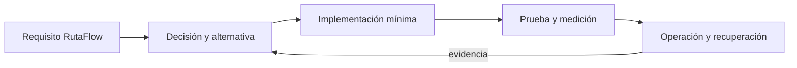

# Módulo 33: Cloud Master: plataforma, seguridad, datos y FinOps

## Sílabo

**Objetivo general:** dominar las capacidades avanzadas señaladas en la auditoría del track mediante una ampliación ejecutable de RutaFlow, decisiones justificadas, pruebas, seguridad y evidencia operacional.

**Resultados observables:** explicar cada tecnología sin depender de marcas; implementar un incremento pequeño; comparar alternativas; provocar un fallo; medir el resultado; y escribir un runbook de recuperación.

**Evaluación:** 20 % fundamento, 35 % implementación, 25 % pruebas y fallos, 10 % seguridad, 10 % documentación y comunicación.

## Contenido teórico

### Tema 1: Terraform avanzado y CI/CD cloud

**Conceptos clave:** propósito, modelo de ejecución, configuración, seguridad, coste, pruebas y operación.

Terraform avanzado y CI/CD cloud se estudia como una decisión de ingeniería y no como una colección de comandos. Primero identifica el problema que resuelve y los límites de la plataforma; luego construye el incremento mínimo dentro de RutaFlow. Registra entradas, salidas, dependencias y condiciones de fallo. Compara al menos una alternativa y conserva la medición que justifica la elección. Si la tecnología es experimental, se aísla del camino estable y se documenta la estrategia de retirada.

En producción debes considerar configuración por ambiente, identidad de máquina y persona, secretos, compatibilidad, telemetría y recuperación. Una demostración exitosa no prueba comportamiento bajo concurrencia, reintentos, pérdida de red o datos inválidos. Por eso el laboratorio introduce un fallo deliberado y exige una prueba de regresión. El resultado debe poder repetirse desde terminal y CI sin pasos secretos del editor.

**Analogía:** es como incorporar una nueva estación a una red logística: no basta con construirla; hay que definir rutas, capacidad, controles, contingencias y cómo sabremos que funciona.

**¿Por qué es importante?** Porque Terraform avanzado y CI/CD cloud aparece cuando el sistema crece y las decisiones dejan de ser locales. Comprender su coste evita adoptar una herramienta por popularidad o descartarla por una primera experiencia incompleta.

**Casos de uso reales:** operación normal, configuración inválida, dependencia lenta, solicitud duplicada, cambio incompatible y recuperación posterior a un despliegue fallido.

**Diagrama:**


### Tema 2: Kubernetes administrado, ECS y Service Mesh

**Conceptos clave:** propósito, modelo de ejecución, configuración, seguridad, coste, pruebas y operación.

Kubernetes administrado, ECS y Service Mesh se estudia como una decisión de ingeniería y no como una colección de comandos. Primero identifica el problema que resuelve y los límites de la plataforma; luego construye el incremento mínimo dentro de RutaFlow. Registra entradas, salidas, dependencias y condiciones de fallo. Compara al menos una alternativa y conserva la medición que justifica la elección. Si la tecnología es experimental, se aísla del camino estable y se documenta la estrategia de retirada.

En producción debes considerar configuración por ambiente, identidad de máquina y persona, secretos, compatibilidad, telemetría y recuperación. Una demostración exitosa no prueba comportamiento bajo concurrencia, reintentos, pérdida de red o datos inválidos. Por eso el laboratorio introduce un fallo deliberado y exige una prueba de regresión. El resultado debe poder repetirse desde terminal y CI sin pasos secretos del editor.

**Analogía:** es como incorporar una nueva estación a una red logística: no basta con construirla; hay que definir rutas, capacidad, controles, contingencias y cómo sabremos que funciona.

**¿Por qué es importante?** Porque Kubernetes administrado, ECS y Service Mesh aparece cuando el sistema crece y las decisiones dejan de ser locales. Comprender su coste evita adoptar una herramienta por popularidad o descartarla por una primera experiencia incompleta.

**Casos de uso reales:** operación normal, configuración inválida, dependencia lenta, solicitud duplicada, cambio incompatible y recuperación posterior a un despliegue fallido.

**Diagrama:**


### Tema 3: EC2, VPC, RDS, S3 y DynamoDB avanzados

**Conceptos clave:** propósito, modelo de ejecución, configuración, seguridad, coste, pruebas y operación.

EC2, VPC, RDS, S3 y DynamoDB avanzados se estudia como una decisión de ingeniería y no como una colección de comandos. Primero identifica el problema que resuelve y los límites de la plataforma; luego construye el incremento mínimo dentro de RutaFlow. Registra entradas, salidas, dependencias y condiciones de fallo. Compara al menos una alternativa y conserva la medición que justifica la elección. Si la tecnología es experimental, se aísla del camino estable y se documenta la estrategia de retirada.

En producción debes considerar configuración por ambiente, identidad de máquina y persona, secretos, compatibilidad, telemetría y recuperación. Una demostración exitosa no prueba comportamiento bajo concurrencia, reintentos, pérdida de red o datos inválidos. Por eso el laboratorio introduce un fallo deliberado y exige una prueba de regresión. El resultado debe poder repetirse desde terminal y CI sin pasos secretos del editor.

**Analogía:** es como incorporar una nueva estación a una red logística: no basta con construirla; hay que definir rutas, capacidad, controles, contingencias y cómo sabremos que funciona.

**¿Por qué es importante?** Porque EC2, VPC, RDS, S3 y DynamoDB avanzados aparece cuando el sistema crece y las decisiones dejan de ser locales. Comprender su coste evita adoptar una herramienta por popularidad o descartarla por una primera experiencia incompleta.

**Casos de uso reales:** operación normal, configuración inválida, dependencia lenta, solicitud duplicada, cambio incompatible y recuperación posterior a un despliegue fallido.

**Diagrama:**


### Tema 4: Lambda, API Gateway y observabilidad avanzada

**Conceptos clave:** propósito, modelo de ejecución, configuración, seguridad, coste, pruebas y operación.

Lambda, API Gateway y observabilidad avanzada se estudia como una decisión de ingeniería y no como una colección de comandos. Primero identifica el problema que resuelve y los límites de la plataforma; luego construye el incremento mínimo dentro de RutaFlow. Registra entradas, salidas, dependencias y condiciones de fallo. Compara al menos una alternativa y conserva la medición que justifica la elección. Si la tecnología es experimental, se aísla del camino estable y se documenta la estrategia de retirada.

En producción debes considerar configuración por ambiente, identidad de máquina y persona, secretos, compatibilidad, telemetría y recuperación. Una demostración exitosa no prueba comportamiento bajo concurrencia, reintentos, pérdida de red o datos inválidos. Por eso el laboratorio introduce un fallo deliberado y exige una prueba de regresión. El resultado debe poder repetirse desde terminal y CI sin pasos secretos del editor.

**Analogía:** es como incorporar una nueva estación a una red logística: no basta con construirla; hay que definir rutas, capacidad, controles, contingencias y cómo sabremos que funciona.

**¿Por qué es importante?** Porque Lambda, API Gateway y observabilidad avanzada aparece cuando el sistema crece y las decisiones dejan de ser locales. Comprender su coste evita adoptar una herramienta por popularidad o descartarla por una primera experiencia incompleta.

**Casos de uso reales:** operación normal, configuración inválida, dependencia lenta, solicitud duplicada, cambio incompatible y recuperación posterior a un despliegue fallido.

**Diagrama:**


### Tema 5: Seguridad, auditoría y FinOps

**Conceptos clave:** propósito, modelo de ejecución, configuración, seguridad, coste, pruebas y operación.

Seguridad, auditoría y FinOps se estudia como una decisión de ingeniería y no como una colección de comandos. Primero identifica el problema que resuelve y los límites de la plataforma; luego construye el incremento mínimo dentro de RutaFlow. Registra entradas, salidas, dependencias y condiciones de fallo. Compara al menos una alternativa y conserva la medición que justifica la elección. Si la tecnología es experimental, se aísla del camino estable y se documenta la estrategia de retirada.

En producción debes considerar configuración por ambiente, identidad de máquina y persona, secretos, compatibilidad, telemetría y recuperación. Una demostración exitosa no prueba comportamiento bajo concurrencia, reintentos, pérdida de red o datos inválidos. Por eso el laboratorio introduce un fallo deliberado y exige una prueba de regresión. El resultado debe poder repetirse desde terminal y CI sin pasos secretos del editor.

**Analogía:** es como incorporar una nueva estación a una red logística: no basta con construirla; hay que definir rutas, capacidad, controles, contingencias y cómo sabremos que funciona.

**¿Por qué es importante?** Porque Seguridad, auditoría y FinOps aparece cuando el sistema crece y las decisiones dejan de ser locales. Comprender su coste evita adoptar una herramienta por popularidad o descartarla por una primera experiencia incompleta.

**Casos de uso reales:** operación normal, configuración inválida, dependencia lenta, solicitud duplicada, cambio incompatible y recuperación posterior a un despliegue fallido.

**Diagrama:**


### Tema 6: Microservicios, Big Data, AI/ML y multi-cloud

**Conceptos clave:** propósito, modelo de ejecución, configuración, seguridad, coste, pruebas y operación.

Microservicios, Big Data, AI/ML y multi-cloud se estudia como una decisión de ingeniería y no como una colección de comandos. Primero identifica el problema que resuelve y los límites de la plataforma; luego construye el incremento mínimo dentro de RutaFlow. Registra entradas, salidas, dependencias y condiciones de fallo. Compara al menos una alternativa y conserva la medición que justifica la elección. Si la tecnología es experimental, se aísla del camino estable y se documenta la estrategia de retirada.

En producción debes considerar configuración por ambiente, identidad de máquina y persona, secretos, compatibilidad, telemetría y recuperación. Una demostración exitosa no prueba comportamiento bajo concurrencia, reintentos, pérdida de red o datos inválidos. Por eso el laboratorio introduce un fallo deliberado y exige una prueba de regresión. El resultado debe poder repetirse desde terminal y CI sin pasos secretos del editor.

**Analogía:** es como incorporar una nueva estación a una red logística: no basta con construirla; hay que definir rutas, capacidad, controles, contingencias y cómo sabremos que funciona.

**¿Por qué es importante?** Porque Microservicios, Big Data, AI/ML y multi-cloud aparece cuando el sistema crece y las decisiones dejan de ser locales. Comprender su coste evita adoptar una herramienta por popularidad o descartarla por una primera experiencia incompleta.

**Casos de uso reales:** operación normal, configuración inválida, dependencia lenta, solicitud duplicada, cambio incompatible y recuperación posterior a un despliegue fallido.

**Diagrama:**


## Trazabilidad de la auditoría original

- **Terraform Avanzado**: cubierto mediante fundamento, laboratorio y evidencia del capítulo.
- **Kubernetes en Cloud**: cubierto mediante fundamento, laboratorio y evidencia del capítulo.
- **CI/CD en Cloud**: cubierto mediante fundamento, laboratorio y evidencia del capítulo.
- **Observabilidad Avanzada**: cubierto mediante fundamento, laboratorio y evidencia del capítulo.
- **Seguridad Avanzada**: cubierto mediante fundamento, laboratorio y evidencia del capítulo.
- **FinOps**: cubierto mediante fundamento, laboratorio y evidencia del capítulo.
- **Serverless Avanzado**: cubierto mediante fundamento, laboratorio y evidencia del capítulo.
- **Microservicios**: cubierto mediante fundamento, laboratorio y evidencia del capítulo.
- **Big Data**: cubierto mediante fundamento, laboratorio y evidencia del capítulo.
- **AI/ML en Cloud**: cubierto mediante fundamento, laboratorio y evidencia del capítulo.
- **Multi-Cloud**: cubierto mediante fundamento, laboratorio y evidencia del capítulo.
- **EC2 Avanzado**: cubierto mediante fundamento, laboratorio y evidencia del capítulo.
- **VPC Avanzado**: cubierto mediante fundamento, laboratorio y evidencia del capítulo.
- **RDS Avanzado**: cubierto mediante fundamento, laboratorio y evidencia del capítulo.
- **ECS/EKS Avanzado**: cubierto mediante fundamento, laboratorio y evidencia del capítulo.
- **CloudWatch**: cubierto mediante fundamento, laboratorio y evidencia del capítulo.
- **CloudTrail**: cubierto mediante fundamento, laboratorio y evidencia del capítulo.
- **S3 Avanzado**: cubierto mediante fundamento, laboratorio y evidencia del capítulo.
- **DynamoDB Avanzado**: cubierto mediante fundamento, laboratorio y evidencia del capítulo.
- **Lambda Avanzado**: cubierto mediante fundamento, laboratorio y evidencia del capítulo.
- **API Gateway Avanzado**: cubierto mediante fundamento, laboratorio y evidencia del capítulo.
- **IAM Avanzado**: cubierto mediante fundamento, laboratorio y evidencia del capítulo.

## Criterio transversal de calidad del código

Usa nombres del dominio, errores tipados y límites claros. Escribe una prueba que exprese el comportamiento antes de corregir el defecto. SOLID se aplica cuando reduce el coste real de sustituir infraestructura o política; no abstraer antes de observar repetición con el mismo significado. Revisa nombres, cohesión, dependencias, errores, prueba, mínimo privilegio y capacidad de diagnóstico.

## Laboratorio práctico

Selecciona una vertical de RutaFlow —cotización, asignación, tracking, evidencia o liquidación— y crea una rama desde un estado verificable. Para cada tema agrega una capacidad pequeña, no una aplicación paralela. Mantén un diario con hipótesis, comando, resultado, métrica y decisión.

1. Define requisito, amenaza y atributo de calidad medible.
2. Construye la versión mínima con configuración reproducible.
3. Prueba camino feliz, entrada inválida y fallo de dependencia.
4. Ejecuta análisis de seguridad y registra datos sensibles tratados.
5. Mide latencia, coste, tamaño, accesibilidad o recuperación según corresponda.
6. Automatiza la comprobación en CI y documenta rollback.

La definición de terminado requiere código ejecutable, prueba automatizada, diagrama, ADR, enlace oficial con versión, medición antes/después y un procedimiento de limpieza. No se aceptan capturas sin comandos ni resultados imposibles de repetir.

## Ejercicios de evaluación

### Ejercicio 1: comparación profesional

Compara dos alternativas mediante cinco criterios: complejidad, seguridad, coste, portabilidad y operación. Elige una y escribe qué evidencia futura haría cambiar la decisión.

### Ejercicio 2: fallo deliberado

Interrumpe una dependencia o introduce configuración inválida. Conserva la prueba que reproduce el defecto, mejora el mensaje de error y verifica recuperación sin pérdida ni duplicación.

### Ejercicio 3: transferencia a RutaFlow

Integra tres temas del capítulo en una sola vertical. Dibuja las fronteras, identifica el dato sensible y demuestra observabilidad de extremo a extremo mediante correlation ID.

### Ejercicio 4: enseñar para demostrar dominio

Explica el tema más difícil en lenguaje cotidiano, presenta un ejemplo mínimo y responde cuándo no debería utilizarse. La explicación debe diferenciar hecho, estimación y opinión.

## Rúbrica del proyecto

| Criterio | Inicial | Competente | Master verificable |
|---|---|---|---|
| Fundamento | Enumera APIs | Explica propósito | Compara límites y alternativas |
| Implementación | Demo manual | Flujo reproducible | Integración cohesionada y recuperable |
| Calidad | Camino feliz | Pruebas y errores | Fallos, compatibilidad y regresión |
| Seguridad | Secretos locales | Mínimo privilegio | Threat model y evidencia negativa |
| Operación | Sin métricas | Telemetría básica | SLO, coste y runbook ensayado |

## Bibliografía y fundamento académico

- Documentación primaria enlazada en el capítulo de actualizaciones oficiales del track.
- ACM/IEEE CS2023 y SWEBOK V4 para fundamentos, diseño, pruebas, seguridad y operación.
- NIST Secure Software Development Framework y OWASP ASVS/MASVS.
- Martin Kleppmann, *Designing Data-Intensive Applications*.
- Google, *Site Reliability Engineering* y *SRE Workbook*.
- Documentación de accesibilidad W3C/WCAG cuando exista interfaz humana.

<!-- DEFINITIVE-COMPLEMENTS:START -->
## Complementos de la lista definitiva

Las siguientes capacidades no aparecían literalmente en el índice previo. Se incorporan con el mismo criterio del capítulo: fundamento, aplicación en RutaFlow, fallo deliberado y evidencia reproducible.

### Tema complementario: Introducción a la Nube

**Conceptos clave:** Modelos IaaS, PaaS, SaaS; despliegue público, privado, híbrido, multi-cloud.

Este tema se incorpora de forma explícita porque no aparecía con el mismo nombre en el currículo visible. Estúdialo identificando propósito, entradas, salida observable, límites, amenaza y coste de operación. Construye un ejemplo mínimo conectado con RutaFlow y compara una alternativa antes de añadir una dependencia.

**Analogía:** es una pieza del sistema logístico que solo aporta valor cuando se conecta con un proceso, una responsabilidad y una señal verificable.

**¿Por qué es importante?** Porque reconocer `Introducción a la Nube` no demuestra dominio; debes aplicarlo, provocar un fallo y explicar cuándo no conviene utilizarlo.

**Casos de uso reales:** camino feliz, configuración inválida, dato tardío, acceso no autorizado y recuperación tras una dependencia indisponible.

**Práctica breve:** implementa una capacidad pequeña, escribe una prueba de éxito y otra de fallo, registra una métrica y documenta la decisión en un ADR.
### Tema complementario: Infraestructura Global

**Conceptos clave:** Regiones, Zonas de Disponibilidad, Edge Locations.

Este tema se incorpora de forma explícita porque no aparecía con el mismo nombre en el currículo visible. Estúdialo identificando propósito, entradas, salida observable, límites, amenaza y coste de operación. Construye un ejemplo mínimo conectado con RutaFlow y compara una alternativa antes de añadir una dependencia.

**Analogía:** es una pieza del sistema logístico que solo aporta valor cuando se conecta con un proceso, una responsabilidad y una señal verificable.

**¿Por qué es importante?** Porque reconocer `Infraestructura Global` no demuestra dominio; debes aplicarlo, provocar un fallo y explicar cuándo no conviene utilizarlo.

**Casos de uso reales:** camino feliz, configuración inválida, dato tardío, acceso no autorizado y recuperación tras una dependencia indisponible.

**Práctica breve:** implementa una capacidad pequeña, escribe una prueba de éxito y otra de fallo, registra una métrica y documenta la decisión en un ADR.
### Tema complementario: Redes Básicas

**Conceptos clave:** TCP/IP, DNS, HTTP/HTTPS, puertos.

Este tema se incorpora de forma explícita porque no aparecía con el mismo nombre en el currículo visible. Estúdialo identificando propósito, entradas, salida observable, límites, amenaza y coste de operación. Construye un ejemplo mínimo conectado con RutaFlow y compara una alternativa antes de añadir una dependencia.

**Analogía:** es una pieza del sistema logístico que solo aporta valor cuando se conecta con un proceso, una responsabilidad y una señal verificable.

**¿Por qué es importante?** Porque reconocer `Redes Básicas` no demuestra dominio; debes aplicarlo, provocar un fallo y explicar cuándo no conviene utilizarlo.

**Casos de uso reales:** camino feliz, configuración inválida, dato tardío, acceso no autorizado y recuperación tras una dependencia indisponible.

**Práctica breve:** implementa una capacidad pequeña, escribe una prueba de éxito y otra de fallo, registra una métrica y documenta la decisión en un ADR.
### Tema complementario: Arquitectura Cliente-Servidor

**Conceptos clave:** Request/Response, APIs REST, JSON.

Este tema se incorpora de forma explícita porque no aparecía con el mismo nombre en el currículo visible. Estúdialo identificando propósito, entradas, salida observable, límites, amenaza y coste de operación. Construye un ejemplo mínimo conectado con RutaFlow y compara una alternativa antes de añadir una dependencia.

**Analogía:** es una pieza del sistema logístico que solo aporta valor cuando se conecta con un proceso, una responsabilidad y una señal verificable.

**¿Por qué es importante?** Porque reconocer `Arquitectura Cliente-Servidor` no demuestra dominio; debes aplicarlo, provocar un fallo y explicar cuándo no conviene utilizarlo.

**Casos de uso reales:** camino feliz, configuración inválida, dato tardío, acceso no autorizado y recuperación tras una dependencia indisponible.

**Práctica breve:** implementa una capacidad pequeña, escribe una prueba de éxito y otra de fallo, registra una métrica y documenta la decisión en un ADR.
### Tema complementario: IAM Básico

**Conceptos clave:** Usuarios, grupos, roles, políticas.

Este tema se incorpora de forma explícita porque no aparecía con el mismo nombre en el currículo visible. Estúdialo identificando propósito, entradas, salida observable, límites, amenaza y coste de operación. Construye un ejemplo mínimo conectado con RutaFlow y compara una alternativa antes de añadir una dependencia.

**Analogía:** es una pieza del sistema logístico que solo aporta valor cuando se conecta con un proceso, una responsabilidad y una señal verificable.

**¿Por qué es importante?** Porque reconocer `IAM Básico` no demuestra dominio; debes aplicarlo, provocar un fallo y explicar cuándo no conviene utilizarlo.

**Casos de uso reales:** camino feliz, configuración inválida, dato tardío, acceso no autorizado y recuperación tras una dependencia indisponible.

**Práctica breve:** implementa una capacidad pequeña, escribe una prueba de éxito y otra de fallo, registra una métrica y documenta la decisión en un ADR.
### Tema complementario: S3 (Almacenamiento)

**Conceptos clave:** Buckets, objetos, versionado, lifecycle, políticas.

Este tema se incorpora de forma explícita porque no aparecía con el mismo nombre en el currículo visible. Estúdialo identificando propósito, entradas, salida observable, límites, amenaza y coste de operación. Construye un ejemplo mínimo conectado con RutaFlow y compara una alternativa antes de añadir una dependencia.

**Analogía:** es una pieza del sistema logístico que solo aporta valor cuando se conecta con un proceso, una responsabilidad y una señal verificable.

**¿Por qué es importante?** Porque reconocer `S3 (Almacenamiento)` no demuestra dominio; debes aplicarlo, provocar un fallo y explicar cuándo no conviene utilizarlo.

**Casos de uso reales:** camino feliz, configuración inválida, dato tardío, acceso no autorizado y recuperación tras una dependencia indisponible.

**Práctica breve:** implementa una capacidad pequeña, escribe una prueba de éxito y otra de fallo, registra una métrica y documenta la decisión en un ADR.
### Tema complementario: SQS (Colas)

**Conceptos clave:** Creación, envío, recepción, DLQ, FIFO vs Standard.

Este tema se incorpora de forma explícita porque no aparecía con el mismo nombre en el currículo visible. Estúdialo identificando propósito, entradas, salida observable, límites, amenaza y coste de operación. Construye un ejemplo mínimo conectado con RutaFlow y compara una alternativa antes de añadir una dependencia.

**Analogía:** es una pieza del sistema logístico que solo aporta valor cuando se conecta con un proceso, una responsabilidad y una señal verificable.

**¿Por qué es importante?** Porque reconocer `SQS (Colas)` no demuestra dominio; debes aplicarlo, provocar un fallo y explicar cuándo no conviene utilizarlo.

**Casos de uso reales:** camino feliz, configuración inválida, dato tardío, acceso no autorizado y recuperación tras una dependencia indisponible.

**Práctica breve:** implementa una capacidad pequeña, escribe una prueba de éxito y otra de fallo, registra una métrica y documenta la decisión en un ADR.
### Tema complementario: Lambda (Serverless)

**Conceptos clave:** Funciones, eventos, runtime, cold start, layers.

Este tema se incorpora de forma explícita porque no aparecía con el mismo nombre en el currículo visible. Estúdialo identificando propósito, entradas, salida observable, límites, amenaza y coste de operación. Construye un ejemplo mínimo conectado con RutaFlow y compara una alternativa antes de añadir una dependencia.

**Analogía:** es una pieza del sistema logístico que solo aporta valor cuando se conecta con un proceso, una responsabilidad y una señal verificable.

**¿Por qué es importante?** Porque reconocer `Lambda (Serverless)` no demuestra dominio; debes aplicarlo, provocar un fallo y explicar cuándo no conviene utilizarlo.

**Casos de uso reales:** camino feliz, configuración inválida, dato tardío, acceso no autorizado y recuperación tras una dependencia indisponible.

**Práctica breve:** implementa una capacidad pequeña, escribe una prueba de éxito y otra de fallo, registra una métrica y documenta la decisión en un ADR.
### Tema complementario: EC2 (Compute)

**Conceptos clave:** Tipos de instancias, AMIs, Security Groups, EBS, Auto Scaling.

Este tema se incorpora de forma explícita porque no aparecía con el mismo nombre en el currículo visible. Estúdialo identificando propósito, entradas, salida observable, límites, amenaza y coste de operación. Construye un ejemplo mínimo conectado con RutaFlow y compara una alternativa antes de añadir una dependencia.

**Analogía:** es una pieza del sistema logístico que solo aporta valor cuando se conecta con un proceso, una responsabilidad y una señal verificable.

**¿Por qué es importante?** Porque reconocer `EC2 (Compute)` no demuestra dominio; debes aplicarlo, provocar un fallo y explicar cuándo no conviene utilizarlo.

**Casos de uso reales:** camino feliz, configuración inválida, dato tardío, acceso no autorizado y recuperación tras una dependencia indisponible.

**Práctica breve:** implementa una capacidad pequeña, escribe una prueba de éxito y otra de fallo, registra una métrica y documenta la decisión en un ADR.
### Tema complementario: RDS (Bases de datos)

**Conceptos clave:** PostgreSQL, MySQL, Aurora, Multi-AZ, Read Replicas.

Este tema se incorpora de forma explícita porque no aparecía con el mismo nombre en el currículo visible. Estúdialo identificando propósito, entradas, salida observable, límites, amenaza y coste de operación. Construye un ejemplo mínimo conectado con RutaFlow y compara una alternativa antes de añadir una dependencia.

**Analogía:** es una pieza del sistema logístico que solo aporta valor cuando se conecta con un proceso, una responsabilidad y una señal verificable.

**¿Por qué es importante?** Porque reconocer `RDS (Bases de datos)` no demuestra dominio; debes aplicarlo, provocar un fallo y explicar cuándo no conviene utilizarlo.

**Casos de uso reales:** camino feliz, configuración inválida, dato tardío, acceso no autorizado y recuperación tras una dependencia indisponible.

**Práctica breve:** implementa una capacidad pequeña, escribe una prueba de éxito y otra de fallo, registra una métrica y documenta la decisión en un ADR.
### Tema complementario: VPC (Redes)

**Conceptos clave:** Subredes, Route Tables, NAT Gateway, VPC Peering.

Este tema se incorpora de forma explícita porque no aparecía con el mismo nombre en el currículo visible. Estúdialo identificando propósito, entradas, salida observable, límites, amenaza y coste de operación. Construye un ejemplo mínimo conectado con RutaFlow y compara una alternativa antes de añadir una dependencia.

**Analogía:** es una pieza del sistema logístico que solo aporta valor cuando se conecta con un proceso, una responsabilidad y una señal verificable.

**¿Por qué es importante?** Porque reconocer `VPC (Redes)` no demuestra dominio; debes aplicarlo, provocar un fallo y explicar cuándo no conviene utilizarlo.

**Casos de uso reales:** camino feliz, configuración inválida, dato tardío, acceso no autorizado y recuperación tras una dependencia indisponible.

**Práctica breve:** implementa una capacidad pequeña, escribe una prueba de éxito y otra de fallo, registra una métrica y documenta la decisión en un ADR.
### Tema complementario: Sostenibilidad cloud

**Conceptos clave:** carbon-aware computing, eficiencia energética y eliminación de recursos ociosos.

Este tema se incorpora de forma explícita porque no aparecía con el mismo nombre en el currículo visible. Estúdialo identificando propósito, entradas, salida observable, límites, amenaza y coste de operación. Construye un ejemplo mínimo conectado con RutaFlow y compara una alternativa antes de añadir una dependencia.

**Analogía:** es una pieza del sistema logístico que solo aporta valor cuando se conecta con un proceso, una responsabilidad y una señal verificable.

**¿Por qué es importante?** Porque reconocer `Sostenibilidad cloud` no demuestra dominio; debes aplicarlo, provocar un fallo y explicar cuándo no conviene utilizarlo.

**Casos de uso reales:** camino feliz, configuración inválida, dato tardío, acceso no autorizado y recuperación tras una dependencia indisponible.

**Práctica breve:** implementa una capacidad pequeña, escribe una prueba de éxito y otra de fallo, registra una métrica y documenta la decisión en un ADR.
### Tema complementario: Policy as Code

**Conceptos clave:** controles preventivos con OPA, Sentinel o políticas nativas.

Este tema se incorpora de forma explícita porque no aparecía con el mismo nombre en el currículo visible. Estúdialo identificando propósito, entradas, salida observable, límites, amenaza y coste de operación. Construye un ejemplo mínimo conectado con RutaFlow y compara una alternativa antes de añadir una dependencia.

**Analogía:** es una pieza del sistema logístico que solo aporta valor cuando se conecta con un proceso, una responsabilidad y una señal verificable.

**¿Por qué es importante?** Porque reconocer `Policy as Code` no demuestra dominio; debes aplicarlo, provocar un fallo y explicar cuándo no conviene utilizarlo.

**Casos de uso reales:** camino feliz, configuración inválida, dato tardío, acceso no autorizado y recuperación tras una dependencia indisponible.

**Práctica breve:** implementa una capacidad pequeña, escribe una prueba de éxito y otra de fallo, registra una métrica y documenta la decisión en un ADR.
### Tema complementario: Arquitectura de plataforma

**Conceptos clave:** landing zones, golden paths y autoservicio gobernado.

Este tema se incorpora de forma explícita porque no aparecía con el mismo nombre en el currículo visible. Estúdialo identificando propósito, entradas, salida observable, límites, amenaza y coste de operación. Construye un ejemplo mínimo conectado con RutaFlow y compara una alternativa antes de añadir una dependencia.

**Analogía:** es una pieza del sistema logístico que solo aporta valor cuando se conecta con un proceso, una responsabilidad y una señal verificable.

**¿Por qué es importante?** Porque reconocer `Arquitectura de plataforma` no demuestra dominio; debes aplicarlo, provocar un fallo y explicar cuándo no conviene utilizarlo.

**Casos de uso reales:** camino feliz, configuración inválida, dato tardío, acceso no autorizado y recuperación tras una dependencia indisponible.

**Práctica breve:** implementa una capacidad pequeña, escribe una prueba de éxito y otra de fallo, registra una métrica y documenta la decisión en un ADR.

<!-- DEFINITIVE-COMPLEMENTS:END -->

<!-- SUPPLEMENTAL-COMPLEMENTS:START -->
## Ampliación académica suplementaria

Esta sección incorpora los elementos de la nueva auditoría que no aparecían literalmente en el currículo. Cada uno se conecta con fundamento, práctica y evidencia.

### Tema suplementario: Infraestructura de centros de datos

**Conceptos clave:** Servidores físicos, virtualización, redes de centro de datos.

La fuente académica señalada es **Purdue CS 35100**. Este tema se estudia identificando el problema, sus prerrequisitos, un modelo mínimo, un experimento y las limitaciones de la evidencia. En RutaFlow se conecta con una decisión concreta de producto, datos, plataforma u operación, evitando agregar tecnología sin necesidad verificable.

**Analogía:** es una asignatura dentro de un programa universitario: aporta una perspectiva específica y necesita conectarse con las demás para formar criterio profesional.

**¿Por qué es importante?** Porque Infraestructura de centros de datos amplía el mapa mental y permite comprender decisiones que una guía centrada únicamente en frameworks no explica.

**Casos de uso reales:** diseño inicial, restricción de recursos, entrada inválida, fallo parcial, impacto humano y revisión posterior mediante métricas.

**Práctica breve:** construye un ejemplo pequeño, formula una hipótesis, mide el resultado, registra una amenaza o sesgo y explica qué conocimiento adicional necesitarías para usarlo en producción.
### Tema suplementario: Modelos de facturación

**Conceptos clave:** Modelos de servicio, despliegue y facturación en la nube.

La fuente académica señalada es **UNR CS 442**. Este tema se estudia identificando el problema, sus prerrequisitos, un modelo mínimo, un experimento y las limitaciones de la evidencia. En RutaFlow se conecta con una decisión concreta de producto, datos, plataforma u operación, evitando agregar tecnología sin necesidad verificable.

**Analogía:** es una asignatura dentro de un programa universitario: aporta una perspectiva específica y necesita conectarse con las demás para formar criterio profesional.

**¿Por qué es importante?** Porque Modelos de facturación amplía el mapa mental y permite comprender decisiones que una guía centrada únicamente en frameworks no explica.

**Casos de uso reales:** diseño inicial, restricción de recursos, entrada inválida, fallo parcial, impacto humano y revisión posterior mediante métricas.

**Práctica breve:** construye un ejemplo pequeño, formula una hipótesis, mide el resultado, registra una amenaza o sesgo y explica qué conocimiento adicional necesitarías para usarlo en producción.
### Tema suplementario: Replicación y persistencia de datos

**Conceptos clave:** Técnicas de replicación, consistencia, persistencia.

La fuente académica señalada es **UNR CS 442**. Este tema se estudia identificando el problema, sus prerrequisitos, un modelo mínimo, un experimento y las limitaciones de la evidencia. En RutaFlow se conecta con una decisión concreta de producto, datos, plataforma u operación, evitando agregar tecnología sin necesidad verificable.

**Analogía:** es una asignatura dentro de un programa universitario: aporta una perspectiva específica y necesita conectarse con las demás para formar criterio profesional.

**¿Por qué es importante?** Porque Replicación y persistencia de datos amplía el mapa mental y permite comprender decisiones que una guía centrada únicamente en frameworks no explica.

**Casos de uso reales:** diseño inicial, restricción de recursos, entrada inválida, fallo parcial, impacto humano y revisión posterior mediante métricas.

**Práctica breve:** construye un ejemplo pequeño, formula una hipótesis, mide el resultado, registra una amenaza o sesgo y explica qué conocimiento adicional necesitarías para usarlo en producción.
### Tema suplementario: Almacenamiento distribuido

**Conceptos clave:** Sistemas de almacenamiento en la nube, almacenes clave-valor distribuidos.

La fuente académica señalada es **Illinois CS**. Este tema se estudia identificando el problema, sus prerrequisitos, un modelo mínimo, un experimento y las limitaciones de la evidencia. En RutaFlow se conecta con una decisión concreta de producto, datos, plataforma u operación, evitando agregar tecnología sin necesidad verificable.

**Analogía:** es una asignatura dentro de un programa universitario: aporta una perspectiva específica y necesita conectarse con las demás para formar criterio profesional.

**¿Por qué es importante?** Porque Almacenamiento distribuido amplía el mapa mental y permite comprender decisiones que una guía centrada únicamente en frameworks no explica.

**Casos de uso reales:** diseño inicial, restricción de recursos, entrada inválida, fallo parcial, impacto humano y revisión posterior mediante métricas.

**Práctica breve:** construye un ejemplo pequeño, formula una hipótesis, mide el resultado, registra una amenaza o sesgo y explica qué conocimiento adicional necesitarías para usarlo en producción.
### Tema suplementario: Bases de datos en memoria

**Conceptos clave:** Bases de datos in-memory, NewSQL, Spark SQL.

La fuente académica señalada es **Illinois CS**. Este tema se estudia identificando el problema, sus prerrequisitos, un modelo mínimo, un experimento y las limitaciones de la evidencia. En RutaFlow se conecta con una decisión concreta de producto, datos, plataforma u operación, evitando agregar tecnología sin necesidad verificable.

**Analogía:** es una asignatura dentro de un programa universitario: aporta una perspectiva específica y necesita conectarse con las demás para formar criterio profesional.

**¿Por qué es importante?** Porque Bases de datos en memoria amplía el mapa mental y permite comprender decisiones que una guía centrada únicamente en frameworks no explica.

**Casos de uso reales:** diseño inicial, restricción de recursos, entrada inválida, fallo parcial, impacto humano y revisión posterior mediante métricas.

**Práctica breve:** construye un ejemplo pequeño, formula una hipótesis, mide el resultado, registra una amenaza o sesgo y explica qué conocimiento adicional necesitarías para usarlo en producción.
### Tema suplementario: Migración a la nube

**Conceptos clave:** Estrategias y procesos de migración.

La fuente académica señalada es **Athabasca COMP 656**. Este tema se estudia identificando el problema, sus prerrequisitos, un modelo mínimo, un experimento y las limitaciones de la evidencia. En RutaFlow se conecta con una decisión concreta de producto, datos, plataforma u operación, evitando agregar tecnología sin necesidad verificable.

**Analogía:** es una asignatura dentro de un programa universitario: aporta una perspectiva específica y necesita conectarse con las demás para formar criterio profesional.

**¿Por qué es importante?** Porque Migración a la nube amplía el mapa mental y permite comprender decisiones que una guía centrada únicamente en frameworks no explica.

**Casos de uso reales:** diseño inicial, restricción de recursos, entrada inválida, fallo parcial, impacto humano y revisión posterior mediante métricas.

**Práctica breve:** construye un ejemplo pequeño, formula una hipótesis, mide el resultado, registra una amenaza o sesgo y explica qué conocimiento adicional necesitarías para usarlo en producción.
### Tema suplementario: Conectividad y resolución de problemas

**Conceptos clave:** Conectividad en la nube, herramientas de diagnóstico.

La fuente académica señalada es **Athabasca COMP 656**. Este tema se estudia identificando el problema, sus prerrequisitos, un modelo mínimo, un experimento y las limitaciones de la evidencia. En RutaFlow se conecta con una decisión concreta de producto, datos, plataforma u operación, evitando agregar tecnología sin necesidad verificable.

**Analogía:** es una asignatura dentro de un programa universitario: aporta una perspectiva específica y necesita conectarse con las demás para formar criterio profesional.

**¿Por qué es importante?** Porque Conectividad y resolución de problemas amplía el mapa mental y permite comprender decisiones que una guía centrada únicamente en frameworks no explica.

**Casos de uso reales:** diseño inicial, restricción de recursos, entrada inválida, fallo parcial, impacto humano y revisión posterior mediante métricas.

**Práctica breve:** construye un ejemplo pequeño, formula una hipótesis, mide el resultado, registra una amenaza o sesgo y explica qué conocimiento adicional necesitarías para usarlo en producción.
### Tema suplementario: Algoritmos y paradigmas cloud-native

**Conceptos clave:** Algoritmos para sistemas cloud-native.

La fuente académica señalada es **Purdue CS 55100**. Este tema se estudia identificando el problema, sus prerrequisitos, un modelo mínimo, un experimento y las limitaciones de la evidencia. En RutaFlow se conecta con una decisión concreta de producto, datos, plataforma u operación, evitando agregar tecnología sin necesidad verificable.

**Analogía:** es una asignatura dentro de un programa universitario: aporta una perspectiva específica y necesita conectarse con las demás para formar criterio profesional.

**¿Por qué es importante?** Porque Algoritmos y paradigmas cloud-native amplía el mapa mental y permite comprender decisiones que una guía centrada únicamente en frameworks no explica.

**Casos de uso reales:** diseño inicial, restricción de recursos, entrada inválida, fallo parcial, impacto humano y revisión posterior mediante métricas.

**Práctica breve:** construye un ejemplo pequeño, formula una hipótesis, mide el resultado, registra una amenaza o sesgo y explica qué conocimiento adicional necesitarías para usarlo en producción.
### Tema suplementario: Factores económicos de la nube

**Conceptos clave:** Impacto económico, modelos de negocio.

La fuente académica señalada es **Illinois CS**. Este tema se estudia identificando el problema, sus prerrequisitos, un modelo mínimo, un experimento y las limitaciones de la evidencia. En RutaFlow se conecta con una decisión concreta de producto, datos, plataforma u operación, evitando agregar tecnología sin necesidad verificable.

**Analogía:** es una asignatura dentro de un programa universitario: aporta una perspectiva específica y necesita conectarse con las demás para formar criterio profesional.

**¿Por qué es importante?** Porque Factores económicos de la nube amplía el mapa mental y permite comprender decisiones que una guía centrada únicamente en frameworks no explica.

**Casos de uso reales:** diseño inicial, restricción de recursos, entrada inválida, fallo parcial, impacto humano y revisión posterior mediante métricas.

**Práctica breve:** construye un ejemplo pequeño, formula una hipótesis, mide el resultado, registra una amenaza o sesgo y explica qué conocimiento adicional necesitarías para usarlo en producción.
### Tema suplementario: Computación sin servidor (Serverless)

**Conceptos clave:** Arquitecturas serverless, Lambda, optimización de cold start.

La fuente académica señalada es **UPenn CIS**. Este tema se estudia identificando el problema, sus prerrequisitos, un modelo mínimo, un experimento y las limitaciones de la evidencia. En RutaFlow se conecta con una decisión concreta de producto, datos, plataforma u operación, evitando agregar tecnología sin necesidad verificable.

**Analogía:** es una asignatura dentro de un programa universitario: aporta una perspectiva específica y necesita conectarse con las demás para formar criterio profesional.

**¿Por qué es importante?** Porque Computación sin servidor (Serverless) amplía el mapa mental y permite comprender decisiones que una guía centrada únicamente en frameworks no explica.

**Casos de uso reales:** diseño inicial, restricción de recursos, entrada inválida, fallo parcial, impacto humano y revisión posterior mediante métricas.

**Práctica breve:** construye un ejemplo pequeño, formula una hipótesis, mide el resultado, registra una amenaza o sesgo y explica qué conocimiento adicional necesitarías para usarlo en producción.
### Tema suplementario: Computación en el borde (Edge Computing)

**Conceptos clave:** Infraestructura en el borde, IoT.

La fuente académica señalada es **UPenn CIS**. Este tema se estudia identificando el problema, sus prerrequisitos, un modelo mínimo, un experimento y las limitaciones de la evidencia. En RutaFlow se conecta con una decisión concreta de producto, datos, plataforma u operación, evitando agregar tecnología sin necesidad verificable.

**Analogía:** es una asignatura dentro de un programa universitario: aporta una perspectiva específica y necesita conectarse con las demás para formar criterio profesional.

**¿Por qué es importante?** Porque Computación en el borde (Edge Computing) amplía el mapa mental y permite comprender decisiones que una guía centrada únicamente en frameworks no explica.

**Casos de uso reales:** diseño inicial, restricción de recursos, entrada inválida, fallo parcial, impacto humano y revisión posterior mediante métricas.

**Práctica breve:** construye un ejemplo pequeño, formula una hipótesis, mide el resultado, registra una amenaza o sesgo y explica qué conocimiento adicional necesitarías para usarlo en producción.
### Tema suplementario: Computación cuántica en la nube

**Conceptos clave:** Servicios de computación cuántica.

La fuente académica señalada es **UPenn CIS**. Este tema se estudia identificando el problema, sus prerrequisitos, un modelo mínimo, un experimento y las limitaciones de la evidencia. En RutaFlow se conecta con una decisión concreta de producto, datos, plataforma u operación, evitando agregar tecnología sin necesidad verificable.

**Analogía:** es una asignatura dentro de un programa universitario: aporta una perspectiva específica y necesita conectarse con las demás para formar criterio profesional.

**¿Por qué es importante?** Porque Computación cuántica en la nube amplía el mapa mental y permite comprender decisiones que una guía centrada únicamente en frameworks no explica.

**Casos de uso reales:** diseño inicial, restricción de recursos, entrada inválida, fallo parcial, impacto humano y revisión posterior mediante métricas.

**Práctica breve:** construye un ejemplo pequeño, formula una hipótesis, mide el resultado, registra una amenaza o sesgo y explica qué conocimiento adicional necesitarías para usarlo en producción.
### Tema suplementario: Nubes híbridas y multi-cloud

**Conceptos clave:** Estrategias de integración multi-cloud.

La fuente académica señalada es **UC Portugal**. Este tema se estudia identificando el problema, sus prerrequisitos, un modelo mínimo, un experimento y las limitaciones de la evidencia. En RutaFlow se conecta con una decisión concreta de producto, datos, plataforma u operación, evitando agregar tecnología sin necesidad verificable.

**Analogía:** es una asignatura dentro de un programa universitario: aporta una perspectiva específica y necesita conectarse con las demás para formar criterio profesional.

**¿Por qué es importante?** Porque Nubes híbridas y multi-cloud amplía el mapa mental y permite comprender decisiones que una guía centrada únicamente en frameworks no explica.

**Casos de uso reales:** diseño inicial, restricción de recursos, entrada inválida, fallo parcial, impacto humano y revisión posterior mediante métricas.

**Práctica breve:** construye un ejemplo pequeño, formula una hipótesis, mide el resultado, registra una amenaza o sesgo y explica qué conocimiento adicional necesitarías para usarlo en producción.

<!-- SUPPLEMENTAL-COMPLEMENTS:END -->

<!-- REQUESTED-PRACTICAL-EXAMPLES:START -->
## Ejemplos guiados de los temas solicitados

Estos ejemplos acompañan la ampliación académica. No son código para copiar sin contexto: ejecuta, modifica, provoca un fallo y conserva la evidencia.

### Ejemplo guiado: Infraestructura de centros de datos

**Qué demuestra:** convierte el concepto en una evidencia pequeña, explícita y verificable dentro de RutaFlow. El ejemplo separa la decisión del framework para poder probarla y cambiarla.

```hcl
locals {
  capability = "Infraestructura de centros de datos"
  tags = { system = "rutaflow", owner = "platform", managed_by = "terraform" }
}

output "infraestructura_de_centros_de_evidence" { value = local.tags }
```

**Práctica:** reemplaza el resultado exitoso por un fallo realista, agrega una aserción automatizada y registra qué señal permitiría diagnosticarlo en producción.
### Ejemplo guiado: Modelos de facturación y economía de la nube

**Qué demuestra:** convierte el concepto en una evidencia pequeña, explícita y verificable dentro de RutaFlow. El ejemplo separa la decisión del framework para poder probarla y cambiarla.

```hcl
locals {
  capability = "Modelos de facturación y economía de la nube"
  tags = { system = "rutaflow", owner = "platform", managed_by = "terraform" }
}

output "modelos_de_facturacion_y_evidence" { value = local.tags }
```

**Práctica:** reemplaza el resultado exitoso por un fallo realista, agrega una aserción automatizada y registra qué señal permitiría diagnosticarlo en producción.
### Ejemplo guiado: Replicación y persistencia de datos

**Qué demuestra:** convierte el concepto en una evidencia pequeña, explícita y verificable dentro de RutaFlow. El ejemplo separa la decisión del framework para poder probarla y cambiarla.

```hcl
locals {
  capability = "Replicación y persistencia de datos"
  tags = { system = "rutaflow", owner = "platform", managed_by = "terraform" }
}

output "replicacion_y_persistencia_de_evidence" { value = local.tags }
```

**Práctica:** reemplaza el resultado exitoso por un fallo realista, agrega una aserción automatizada y registra qué señal permitiría diagnosticarlo en producción.
### Ejemplo guiado: Almacenamiento distribuido

**Qué demuestra:** convierte el concepto en una evidencia pequeña, explícita y verificable dentro de RutaFlow. El ejemplo separa la decisión del framework para poder probarla y cambiarla.

```hcl
locals {
  capability = "Almacenamiento distribuido"
  tags = { system = "rutaflow", owner = "platform", managed_by = "terraform" }
}

output "almacenamiento_distribuido_evidence" { value = local.tags }
```

**Práctica:** reemplaza el resultado exitoso por un fallo realista, agrega una aserción automatizada y registra qué señal permitiría diagnosticarlo en producción.
### Ejemplo guiado: Bases de datos en memoria (NewSQL)

**Qué demuestra:** convierte el concepto en una evidencia pequeña, explícita y verificable dentro de RutaFlow. El ejemplo separa la decisión del framework para poder probarla y cambiarla.

```hcl
locals {
  capability = "Bases de datos en memoria (NewSQL)"
  tags = { system = "rutaflow", owner = "platform", managed_by = "terraform" }
}

output "bases_de_datos_en_evidence" { value = local.tags }
```

**Práctica:** reemplaza el resultado exitoso por un fallo realista, agrega una aserción automatizada y registra qué señal permitiría diagnosticarlo en producción.
### Ejemplo guiado: Migración a la nube (6R's)

**Qué demuestra:** convierte el concepto en una evidencia pequeña, explícita y verificable dentro de RutaFlow. El ejemplo separa la decisión del framework para poder probarla y cambiarla.

```hcl
locals {
  capability = "Migración a la nube (6R's)"
  tags = { system = "rutaflow", owner = "platform", managed_by = "terraform" }
}

output "migracion_a_la_nube_evidence" { value = local.tags }
```

**Práctica:** reemplaza el resultado exitoso por un fallo realista, agrega una aserción automatizada y registra qué señal permitiría diagnosticarlo en producción.
### Ejemplo guiado: Conectividad y resolución de problemas

**Qué demuestra:** convierte el concepto en una evidencia pequeña, explícita y verificable dentro de RutaFlow. El ejemplo separa la decisión del framework para poder probarla y cambiarla.

```hcl
locals {
  capability = "Conectividad y resolución de problemas"
  tags = { system = "rutaflow", owner = "platform", managed_by = "terraform" }
}

output "conectividad_y_resolucion_de_evidence" { value = local.tags }
```

**Práctica:** reemplaza el resultado exitoso por un fallo realista, agrega una aserción automatizada y registra qué señal permitiría diagnosticarlo en producción.
### Ejemplo guiado: Algoritmos y paradigmas cloud-native

**Qué demuestra:** convierte el concepto en una evidencia pequeña, explícita y verificable dentro de RutaFlow. El ejemplo separa la decisión del framework para poder probarla y cambiarla.

```hcl
locals {
  capability = "Algoritmos y paradigmas cloud-native"
  tags = { system = "rutaflow", owner = "platform", managed_by = "terraform" }
}

output "algoritmos_y_paradigmas_cloud_evidence" { value = local.tags }
```

**Práctica:** reemplaza el resultado exitoso por un fallo realista, agrega una aserción automatizada y registra qué señal permitiría diagnosticarlo en producción.
### Ejemplo guiado: Factores económicos de la nube

**Qué demuestra:** convierte el concepto en una evidencia pequeña, explícita y verificable dentro de RutaFlow. El ejemplo separa la decisión del framework para poder probarla y cambiarla.

```hcl
locals {
  capability = "Factores económicos de la nube"
  tags = { system = "rutaflow", owner = "platform", managed_by = "terraform" }
}

output "factores_economicos_de_la_evidence" { value = local.tags }
```

**Práctica:** reemplaza el resultado exitoso por un fallo realista, agrega una aserción automatizada y registra qué señal permitiría diagnosticarlo en producción.
### Ejemplo guiado: Seguridad en la nube (amenazas, cifrado, compliance)

**Qué demuestra:** convierte el concepto en una evidencia pequeña, explícita y verificable dentro de RutaFlow. El ejemplo separa la decisión del framework para poder probarla y cambiarla.

```hcl
locals {
  capability = "Seguridad en la nube (amenazas, cifrado, compliance)"
  tags = { system = "rutaflow", owner = "platform", managed_by = "terraform" }
}

output "seguridad_en_la_nube_evidence" { value = local.tags }
```

**Práctica:** reemplaza el resultado exitoso por un fallo realista, agrega una aserción automatizada y registra qué señal permitiría diagnosticarlo en producción.
### Ejemplo guiado: Gestión de secretos (Vault)

**Qué demuestra:** convierte el concepto en una evidencia pequeña, explícita y verificable dentro de RutaFlow. El ejemplo separa la decisión del framework para poder probarla y cambiarla.

```hcl
locals {
  capability = "Gestión de secretos (Vault)"
  tags = { system = "rutaflow", owner = "platform", managed_by = "terraform" }
}

output "gestion_de_secretos_vault_evidence" { value = local.tags }
```

**Práctica:** reemplaza el resultado exitoso por un fallo realista, agrega una aserción automatizada y registra qué señal permitiría diagnosticarlo en producción.
### Ejemplo guiado: Serverless avanzado (cold start, layers)

**Qué demuestra:** convierte el concepto en una evidencia pequeña, explícita y verificable dentro de RutaFlow. El ejemplo separa la decisión del framework para poder probarla y cambiarla.

```hcl
locals {
  capability = "Serverless avanzado (cold start, layers)"
  tags = { system = "rutaflow", owner = "platform", managed_by = "terraform" }
}

output "serverless_avanzado_cold_start_evidence" { value = local.tags }
```

**Práctica:** reemplaza el resultado exitoso por un fallo realista, agrega una aserción automatizada y registra qué señal permitiría diagnosticarlo en producción.
### Ejemplo guiado: Edge Computing

**Qué demuestra:** convierte el concepto en una evidencia pequeña, explícita y verificable dentro de RutaFlow. El ejemplo separa la decisión del framework para poder probarla y cambiarla.

```hcl
locals {
  capability = "Edge Computing"
  tags = { system = "rutaflow", owner = "platform", managed_by = "terraform" }
}

output "edge_computing_evidence" { value = local.tags }
```

**Práctica:** reemplaza el resultado exitoso por un fallo realista, agrega una aserción automatizada y registra qué señal permitiría diagnosticarlo en producción.
### Ejemplo guiado: Computación cuántica en la nube

**Qué demuestra:** convierte el concepto en una evidencia pequeña, explícita y verificable dentro de RutaFlow. El ejemplo separa la decisión del framework para poder probarla y cambiarla.

```hcl
locals {
  capability = "Computación cuántica en la nube"
  tags = { system = "rutaflow", owner = "platform", managed_by = "terraform" }
}

output "computacion_cuantica_en_la_evidence" { value = local.tags }
```

**Práctica:** reemplaza el resultado exitoso por un fallo realista, agrega una aserción automatizada y registra qué señal permitiría diagnosticarlo en producción.
### Ejemplo guiado: Multi-cloud y nubes híbridas

**Qué demuestra:** convierte el concepto en una evidencia pequeña, explícita y verificable dentro de RutaFlow. El ejemplo separa la decisión del framework para poder probarla y cambiarla.

```hcl
locals {
  capability = "Multi-cloud y nubes híbridas"
  tags = { system = "rutaflow", owner = "platform", managed_by = "terraform" }
}

output "multi_cloud_y_nubes_evidence" { value = local.tags }
```

**Práctica:** reemplaza el resultado exitoso por un fallo realista, agrega una aserción automatizada y registra qué señal permitiría diagnosticarlo en producción.
### Ejemplo guiado: Terraform avanzado (módulos, state, workspaces)

**Qué demuestra:** convierte el concepto en una evidencia pequeña, explícita y verificable dentro de RutaFlow. El ejemplo separa la decisión del framework para poder probarla y cambiarla.

```hcl
locals {
  capability = "Terraform avanzado (módulos, state, workspaces)"
  tags = { system = "rutaflow", owner = "platform", managed_by = "terraform" }
}

output "terraform_avanzado_modulos_state_evidence" { value = local.tags }
```

**Práctica:** reemplaza el resultado exitoso por un fallo realista, agrega una aserción automatizada y registra qué señal permitiría diagnosticarlo en producción.
### Ejemplo guiado: Kubernetes avanzado (Operators, CRDs, Service Mesh)

**Qué demuestra:** convierte el concepto en una evidencia pequeña, explícita y verificable dentro de RutaFlow. El ejemplo separa la decisión del framework para poder probarla y cambiarla.

```hcl
locals {
  capability = "Kubernetes avanzado (Operators, CRDs, Service Mesh)"
  tags = { system = "rutaflow", owner = "platform", managed_by = "terraform" }
}

output "kubernetes_avanzado_operators_crds_evidence" { value = local.tags }
```

**Práctica:** reemplaza el resultado exitoso por un fallo realista, agrega una aserción automatizada y registra qué señal permitiría diagnosticarlo en producción.
### Ejemplo guiado: CI/CD avanzado (ArgoCD, FluxCD)

**Qué demuestra:** convierte el concepto en una evidencia pequeña, explícita y verificable dentro de RutaFlow. El ejemplo separa la decisión del framework para poder probarla y cambiarla.

```hcl
locals {
  capability = "CI/CD avanzado (ArgoCD, FluxCD)"
  tags = { system = "rutaflow", owner = "platform", managed_by = "terraform" }
}

output "ci_cd_avanzado_argocd_evidence" { value = local.tags }
```

**Práctica:** reemplaza el resultado exitoso por un fallo realista, agrega una aserción automatizada y registra qué señal permitiría diagnosticarlo en producción.
### Ejemplo guiado: Observabilidad avanzada (OpenTelemetry, tracing)

**Qué demuestra:** convierte el concepto en una evidencia pequeña, explícita y verificable dentro de RutaFlow. El ejemplo separa la decisión del framework para poder probarla y cambiarla.

```hcl
locals {
  capability = "Observabilidad avanzada (OpenTelemetry, tracing)"
  tags = { system = "rutaflow", owner = "platform", managed_by = "terraform" }
}

output "observabilidad_avanzada_opentelemetry_tracing_evidence" { value = local.tags }
```

**Práctica:** reemplaza el resultado exitoso por un fallo realista, agrega una aserción automatizada y registra qué señal permitiría diagnosticarlo en producción.

<!-- REQUESTED-PRACTICAL-EXAMPLES:END -->

## Resumen del módulo

Este capítulo vuelve visibles las capacidades solicitadas y las convierte en trabajo evaluable. Completarlo significa poder explicar, implementar, romper, medir y operar una solución; reconocer el nombre de una herramienta no demuestra nivel Master. La evidencia final conecta el track con RutaFlow y conserva decisiones, pruebas y recuperación para que otra persona pueda revisarlas.
