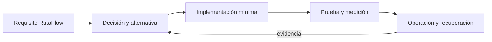

# Módulo 33: Cloud Master: plataforma, seguridad, datos y FinOps

## Sílabo

**Objetivo general:** dominar las capacidades avanzadas señaladas en la auditoría del track mediante una ampliación ejecutable de RutaFlow, decisiones justificadas, pruebas, seguridad y evidencia operacional.

**Resultados observables:** explicar cada tecnología sin depender de marcas; implementar un incremento pequeño; comparar alternativas; provocar un fallo; medir el resultado; y escribir un runbook de recuperación.

**Evaluación:** 20 % fundamento, 35 % implementación, 25 % pruebas y fallos, 10 % seguridad, 10 % documentación y comunicación.

## Aprende construyendo

### Tema 1: Terraform avanzado y CI/CD cloud

**Conceptos clave:** propósito, modelo de ejecución, configuración, seguridad, coste, pruebas y operación.

Terraform avanzado y CI/CD cloud se estudia como una decisión de ingeniería y no como una colección de comandos. Primero identifica el problema que resuelve y los límites de la plataforma; luego construye el incremento mínimo dentro de RutaFlow. Registra entradas, salidas, dependencias y condiciones de fallo. Compara al menos una alternativa y conserva la medición que justifica la elección. Si la tecnología es experimental, se aísla del camino estable y se documenta la estrategia de retirada.

En producción debes considerar configuración por ambiente, identidad de máquina y persona, secretos, compatibilidad, telemetría y recuperación. Una demostración exitosa no prueba comportamiento bajo concurrencia, reintentos, pérdida de red o datos inválidos. Por eso el laboratorio introduce un fallo deliberado y exige una prueba de regresión. El resultado debe poder repetirse desde terminal y CI sin pasos secretos del editor.

**Analogía:** es como incorporar una nueva estación a una red logística: no basta con construirla; hay que definir rutas, capacidad, controles, contingencias y cómo sabremos que funciona.

**¿Por qué es importante?** Porque Terraform avanzado y CI/CD cloud aparece cuando el sistema crece y las decisiones dejan de ser locales. Comprender su coste evita adoptar una herramienta por popularidad o descartarla por una primera experiencia incompleta.

**Casos de uso reales:** operación normal, configuración inválida, dependencia lenta, solicitud duplicada, cambio incompatible y recuperación posterior a un despliegue fallido.

**Diagrama:**

### Tema 2: Kubernetes administrado, ECS y Service Mesh

**Conceptos clave:** propósito, modelo de ejecución, configuración, seguridad, coste, pruebas y operación.

Kubernetes administrado, ECS y Service Mesh se estudia como una decisión de ingeniería y no como una colección de comandos. Primero identifica el problema que resuelve y los límites de la plataforma; luego construye el incremento mínimo dentro de RutaFlow. Registra entradas, salidas, dependencias y condiciones de fallo. Compara al menos una alternativa y conserva la medición que justifica la elección. Si la tecnología es experimental, se aísla del camino estable y se documenta la estrategia de retirada.

En producción debes considerar configuración por ambiente, identidad de máquina y persona, secretos, compatibilidad, telemetría y recuperación. Una demostración exitosa no prueba comportamiento bajo concurrencia, reintentos, pérdida de red o datos inválidos. Por eso el laboratorio introduce un fallo deliberado y exige una prueba de regresión. El resultado debe poder repetirse desde terminal y CI sin pasos secretos del editor.

**Analogía:** es como incorporar una nueva estación a una red logística: no basta con construirla; hay que definir rutas, capacidad, controles, contingencias y cómo sabremos que funciona.

**¿Por qué es importante?** Porque Kubernetes administrado, ECS y Service Mesh aparece cuando el sistema crece y las decisiones dejan de ser locales. Comprender su coste evita adoptar una herramienta por popularidad o descartarla por una primera experiencia incompleta.

**Casos de uso reales:** operación normal, configuración inválida, dependencia lenta, solicitud duplicada, cambio incompatible y recuperación posterior a un despliegue fallido.

**Diagrama:**

### Tema 3: EC2, VPC, RDS, S3 y DynamoDB avanzados

**Conceptos clave:** propósito, modelo de ejecución, configuración, seguridad, coste, pruebas y operación.

EC2, VPC, RDS, S3 y DynamoDB avanzados se estudia como una decisión de ingeniería y no como una colección de comandos. Primero identifica el problema que resuelve y los límites de la plataforma; luego construye el incremento mínimo dentro de RutaFlow. Registra entradas, salidas, dependencias y condiciones de fallo. Compara al menos una alternativa y conserva la medición que justifica la elección. Si la tecnología es experimental, se aísla del camino estable y se documenta la estrategia de retirada.

En producción debes considerar configuración por ambiente, identidad de máquina y persona, secretos, compatibilidad, telemetría y recuperación. Una demostración exitosa no prueba comportamiento bajo concurrencia, reintentos, pérdida de red o datos inválidos. Por eso el laboratorio introduce un fallo deliberado y exige una prueba de regresión. El resultado debe poder repetirse desde terminal y CI sin pasos secretos del editor.

**Analogía:** es como incorporar una nueva estación a una red logística: no basta con construirla; hay que definir rutas, capacidad, controles, contingencias y cómo sabremos que funciona.

**¿Por qué es importante?** Porque EC2, VPC, RDS, S3 y DynamoDB avanzados aparece cuando el sistema crece y las decisiones dejan de ser locales. Comprender su coste evita adoptar una herramienta por popularidad o descartarla por una primera experiencia incompleta.

**Casos de uso reales:** operación normal, configuración inválida, dependencia lenta, solicitud duplicada, cambio incompatible y recuperación posterior a un despliegue fallido.

**Diagrama:**

### Tema 4: Lambda, API Gateway y observabilidad avanzada

**Conceptos clave:** propósito, modelo de ejecución, configuración, seguridad, coste, pruebas y operación.

Lambda, API Gateway y observabilidad avanzada se estudia como una decisión de ingeniería y no como una colección de comandos. Primero identifica el problema que resuelve y los límites de la plataforma; luego construye el incremento mínimo dentro de RutaFlow. Registra entradas, salidas, dependencias y condiciones de fallo. Compara al menos una alternativa y conserva la medición que justifica la elección. Si la tecnología es experimental, se aísla del camino estable y se documenta la estrategia de retirada.

En producción debes considerar configuración por ambiente, identidad de máquina y persona, secretos, compatibilidad, telemetría y recuperación. Una demostración exitosa no prueba comportamiento bajo concurrencia, reintentos, pérdida de red o datos inválidos. Por eso el laboratorio introduce un fallo deliberado y exige una prueba de regresión. El resultado debe poder repetirse desde terminal y CI sin pasos secretos del editor.

**Analogía:** es como incorporar una nueva estación a una red logística: no basta con construirla; hay que definir rutas, capacidad, controles, contingencias y cómo sabremos que funciona.

**¿Por qué es importante?** Porque Lambda, API Gateway y observabilidad avanzada aparece cuando el sistema crece y las decisiones dejan de ser locales. Comprender su coste evita adoptar una herramienta por popularidad o descartarla por una primera experiencia incompleta.

**Casos de uso reales:** operación normal, configuración inválida, dependencia lenta, solicitud duplicada, cambio incompatible y recuperación posterior a un despliegue fallido.

**Diagrama:**

### Tema 5: Seguridad, auditoría y FinOps

**Conceptos clave:** propósito, modelo de ejecución, configuración, seguridad, coste, pruebas y operación.

Seguridad, auditoría y FinOps se estudia como una decisión de ingeniería y no como una colección de comandos. Primero identifica el problema que resuelve y los límites de la plataforma; luego construye el incremento mínimo dentro de RutaFlow. Registra entradas, salidas, dependencias y condiciones de fallo. Compara al menos una alternativa y conserva la medición que justifica la elección. Si la tecnología es experimental, se aísla del camino estable y se documenta la estrategia de retirada.

En producción debes considerar configuración por ambiente, identidad de máquina y persona, secretos, compatibilidad, telemetría y recuperación. Una demostración exitosa no prueba comportamiento bajo concurrencia, reintentos, pérdida de red o datos inválidos. Por eso el laboratorio introduce un fallo deliberado y exige una prueba de regresión. El resultado debe poder repetirse desde terminal y CI sin pasos secretos del editor.

**Analogía:** es como incorporar una nueva estación a una red logística: no basta con construirla; hay que definir rutas, capacidad, controles, contingencias y cómo sabremos que funciona.

**¿Por qué es importante?** Porque Seguridad, auditoría y FinOps aparece cuando el sistema crece y las decisiones dejan de ser locales. Comprender su coste evita adoptar una herramienta por popularidad o descartarla por una primera experiencia incompleta.

**Casos de uso reales:** operación normal, configuración inválida, dependencia lenta, solicitud duplicada, cambio incompatible y recuperación posterior a un despliegue fallido.

**Diagrama:**

### Tema 6: Microservicios, Big Data, AI/ML y multi-cloud

**Conceptos clave:** propósito, modelo de ejecución, configuración, seguridad, coste, pruebas y operación.

Microservicios, Big Data, AI/ML y multi-cloud se estudia como una decisión de ingeniería y no como una colección de comandos. Primero identifica el problema que resuelve y los límites de la plataforma; luego construye el incremento mínimo dentro de RutaFlow. Registra entradas, salidas, dependencias y condiciones de fallo. Compara al menos una alternativa y conserva la medición que justifica la elección. Si la tecnología es experimental, se aísla del camino estable y se documenta la estrategia de retirada.

En producción debes considerar configuración por ambiente, identidad de máquina y persona, secretos, compatibilidad, telemetría y recuperación. Una demostración exitosa no prueba comportamiento bajo concurrencia, reintentos, pérdida de red o datos inválidos. Por eso el laboratorio introduce un fallo deliberado y exige una prueba de regresión. El resultado debe poder repetirse desde terminal y CI sin pasos secretos del editor.

**Analogía:** es como incorporar una nueva estación a una red logística: no basta con construirla; hay que definir rutas, capacidad, controles, contingencias y cómo sabremos que funciona.

**¿Por qué es importante?** Porque Microservicios, Big Data, AI/ML y multi-cloud aparece cuando el sistema crece y las decisiones dejan de ser locales. Comprender su coste evita adoptar una herramienta por popularidad o descartarla por una primera experiencia incompleta.

**Casos de uso reales:** operación normal, configuración inválida, dependencia lenta, solicitud duplicada, cambio incompatible y recuperación posterior a un despliegue fallido.

**Diagrama:**

## Trazabilidad de la auditoría original

- **Terraform Avanzado**: cubierto mediante fundamento, laboratorio y evidencia del capítulo.
- **Kubernetes en Cloud**: cubierto mediante fundamento, laboratorio y evidencia del capítulo.
- **CI/CD en Cloud**: cubierto mediante fundamento, laboratorio y evidencia del capítulo.
- **Observabilidad Avanzada**: cubierto mediante fundamento, laboratorio y evidencia del capítulo.
- **Seguridad Avanzada**: cubierto mediante fundamento, laboratorio y evidencia del capítulo.
- **FinOps**: cubierto mediante fundamento, laboratorio y evidencia del capítulo.
- **Serverless Avanzado**: cubierto mediante fundamento, laboratorio y evidencia del capítulo.
- **Microservicios**: cubierto mediante fundamento, laboratorio y evidencia del capítulo.
- **Big Data**: cubierto mediante fundamento, laboratorio y evidencia del capítulo.
- **AI/ML en Cloud**: cubierto mediante fundamento, laboratorio y evidencia del capítulo.
- **Multi-Cloud**: cubierto mediante fundamento, laboratorio y evidencia del capítulo.
- **EC2 Avanzado**: cubierto mediante fundamento, laboratorio y evidencia del capítulo.
- **VPC Avanzado**: cubierto mediante fundamento, laboratorio y evidencia del capítulo.
- **RDS Avanzado**: cubierto mediante fundamento, laboratorio y evidencia del capítulo.
- **ECS/EKS Avanzado**: cubierto mediante fundamento, laboratorio y evidencia del capítulo.
- **CloudWatch**: cubierto mediante fundamento, laboratorio y evidencia del capítulo.
- **CloudTrail**: cubierto mediante fundamento, laboratorio y evidencia del capítulo.
- **S3 Avanzado**: cubierto mediante fundamento, laboratorio y evidencia del capítulo.
- **DynamoDB Avanzado**: cubierto mediante fundamento, laboratorio y evidencia del capítulo.
- **Lambda Avanzado**: cubierto mediante fundamento, laboratorio y evidencia del capítulo.
- **API Gateway Avanzado**: cubierto mediante fundamento, laboratorio y evidencia del capítulo.
- **IAM Avanzado**: cubierto mediante fundamento, laboratorio y evidencia del capítulo.

## Criterio transversal de calidad del código

Usa nombres del dominio, errores tipados y límites claros. Escribe una prueba que exprese el comportamiento antes de corregir el defecto. SOLID se aplica cuando reduce el coste real de sustituir infraestructura o política; no abstraer antes de observar repetición con el mismo significado. Revisa nombres, cohesión, dependencias, errores, prueba, mínimo privilegio y capacidad de diagnóstico.

## Laboratorio práctico

Selecciona una vertical de RutaFlow —cotización, asignación, tracking, evidencia o liquidación— y crea una rama desde un estado verificable. Para cada tema agrega una capacidad pequeña, no una aplicación paralela. Mantén un diario con hipótesis, comando, resultado, métrica y decisión.

1. Define requisito, amenaza y atributo de calidad medible.
2. Construye la versión mínima con configuración reproducible.
3. Prueba camino feliz, entrada inválida y fallo de dependencia.
4. Ejecuta análisis de seguridad y registra datos sensibles tratados.
5. Mide latencia, coste, tamaño, accesibilidad o recuperación según corresponda.
6. Automatiza la comprobación en CI y documenta rollback.

La definición de terminado requiere código ejecutable, prueba automatizada, diagrama, ADR, enlace oficial con versión, medición antes/después y un procedimiento de limpieza. No se aceptan capturas sin comandos ni resultados imposibles de repetir.

## Rúbrica del proyecto

| Criterio | Inicial | Competente | Master verificable |
|---|---|---|---|
| Fundamento | Enumera APIs | Explica propósito | Compara límites y alternativas |
| Implementación | Demo manual | Flujo reproducible | Integración cohesionada y recuperable |
| Calidad | Camino feliz | Pruebas y errores | Fallos, compatibilidad y regresión |
| Seguridad | Secretos locales | Mínimo privilegio | Threat model y evidencia negativa |
| Operación | Sin métricas | Telemetría básica | SLO, coste y runbook ensayado |

## Bibliografía y fundamento académico

- Documentación primaria enlazada en el capítulo de actualizaciones oficiales del track.
- ACM/IEEE CS2023 y SWEBOK V4 para fundamentos, diseño, pruebas, seguridad y operación.
- NIST Secure Software Development Framework y OWASP ASVS/MASVS.
- Martin Kleppmann, *Designing Data-Intensive Applications*.
- Google, *Site Reliability Engineering* y *SRE Workbook*.
- Documentación de accesibilidad W3C/WCAG cuando exista interfaz humana.

## Resumen del módulo

Este capítulo vuelve visibles las capacidades solicitadas y las convierte en trabajo evaluable. Completarlo significa poder explicar, implementar, romper, medir y operar una solución; reconocer el nombre de una herramienta no demuestra nivel Master. La evidencia final conecta el track con RutaFlow y conserva decisiones, pruebas y recuperación para que otra persona pueda revisarlas.
