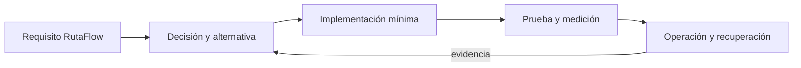

# Módulo 33: Cloud Master: plataforma, seguridad, datos y FinOps


## Aprende construyendo

### Tema 1: Terraform avanzado y CI/CD cloud

#### Paso 1 · Objetivo y preparación
Al finalizar podrás aplicar este tema desde cero. Prerrequisitos: Docker y Node.js; verifica `node --version`.
#### Paso 2 · Contexto y caso real
Una plataforma de entregas necesita un cambio reproducible y operable.
#### Paso 3 · Teoría, modelo mental y analogía
La analogía es una línea de producción con controles y evidencia.
#### Paso 4 · Demostración guiada
Crea `src/example.js` desde una carpeta vacía.
```bash
mkdir ejemplo-master
node --version
```
Resultado esperado: Node disponible.
#### Paso 5 · Práctica guiada
Pista: cambia una configuración para provocar un fallo deliberado y corrígelo.
#### Paso 6 · Práctica independiente
Añade un caso límite y una prueba.
#### Paso 7 · Cierre y evidencia
Entrega código, salida, fallo y corrección; explica el resultado. Siguiente paso: integrar el módulo. Errores comunes: secretos en Git y probar solo el camino feliz. Fuente oficial: https://docs.aws.amazon.com/.
**Conceptos clave:** propósito, modelo de ejecución, configuración, seguridad, coste, pruebas y operación.

Terraform avanzado y CI/CD cloud se estudia como una decisión de ingeniería y no como una colección de comandos. Primero identifica el problema que resuelve y los límites de la plataforma; luego construye el incremento mínimo dentro de RutaFlow. Registra entradas, salidas, dependencias y condiciones de fallo. Compara al menos una alternativa y conserva la medición que justifica la elección. Si la tecnología es experimental, se aísla del camino estable y se documenta la estrategia de retirada.

En producción debes considerar configuración por ambiente, identidad de máquina y persona, secretos, compatibilidad, telemetría y recuperación. Una demostración exitosa no prueba comportamiento bajo concurrencia, reintentos, pérdida de red o datos inválidos. Por eso el laboratorio introduce un fallo deliberado y exige una prueba de regresión. El resultado debe poder repetirse desde terminal y CI sin pasos secretos del editor.

**Analogía:** es como incorporar una nueva estación a una red logística: no basta con construirla; hay que definir rutas, capacidad, controles, contingencias y cómo sabremos que funciona.

**¿Por qué es importante?** Porque Terraform avanzado y CI/CD cloud aparece cuando el sistema crece y las decisiones dejan de ser locales. Comprender su coste evita adoptar una herramienta por popularidad o descartarla por una primera experiencia incompleta.

**Casos de uso reales:** operación normal, configuración inválida, dependencia lenta, solicitud duplicada, cambio incompatible y recuperación posterior a un despliegue fallido.

**Diagrama:**


### Tema 2: Kubernetes administrado, ECS y Service Mesh

#### Paso 1 · Objetivo y preparación
Al finalizar podrás aplicar este tema desde cero. Prerrequisitos: Docker y Node.js; verifica `node --version`.
#### Paso 2 · Contexto y caso real
Una plataforma de entregas necesita un cambio reproducible y operable.
#### Paso 3 · Teoría, modelo mental y analogía
La analogía es una línea de producción con controles y evidencia.
#### Paso 4 · Demostración guiada
Crea `src/example.js` desde una carpeta vacía.
```bash
mkdir ejemplo-master
node --version
```
Resultado esperado: Node disponible.
#### Paso 5 · Práctica guiada
Pista: cambia una configuración para provocar un fallo deliberado y corrígelo.
#### Paso 6 · Práctica independiente
Añade un caso límite y una prueba.
#### Paso 7 · Cierre y evidencia
Entrega código, salida, fallo y corrección; explica el resultado. Siguiente paso: integrar el módulo. Errores comunes: secretos en Git y probar solo el camino feliz. Fuente oficial: https://docs.aws.amazon.com/.
**Conceptos clave:** propósito, modelo de ejecución, configuración, seguridad, coste, pruebas y operación.

Kubernetes administrado, ECS y Service Mesh se estudia como una decisión de ingeniería y no como una colección de comandos. Primero identifica el problema que resuelve y los límites de la plataforma; luego construye el incremento mínimo dentro de RutaFlow. Registra entradas, salidas, dependencias y condiciones de fallo. Compara al menos una alternativa y conserva la medición que justifica la elección. Si la tecnología es experimental, se aísla del camino estable y se documenta la estrategia de retirada.

En producción debes considerar configuración por ambiente, identidad de máquina y persona, secretos, compatibilidad, telemetría y recuperación. Una demostración exitosa no prueba comportamiento bajo concurrencia, reintentos, pérdida de red o datos inválidos. Por eso el laboratorio introduce un fallo deliberado y exige una prueba de regresión. El resultado debe poder repetirse desde terminal y CI sin pasos secretos del editor.

**Analogía:** es como incorporar una nueva estación a una red logística: no basta con construirla; hay que definir rutas, capacidad, controles, contingencias y cómo sabremos que funciona.

**¿Por qué es importante?** Porque Kubernetes administrado, ECS y Service Mesh aparece cuando el sistema crece y las decisiones dejan de ser locales. Comprender su coste evita adoptar una herramienta por popularidad o descartarla por una primera experiencia incompleta.

**Casos de uso reales:** operación normal, configuración inválida, dependencia lenta, solicitud duplicada, cambio incompatible y recuperación posterior a un despliegue fallido.

**Diagrama:**


### Tema 3: EC2, VPC, RDS, S3 y DynamoDB avanzados

#### Paso 1 · Objetivo y preparación
Al finalizar podrás aplicar este tema desde cero. Prerrequisitos: Docker y Node.js; verifica `node --version`.
#### Paso 2 · Contexto y caso real
Una plataforma de entregas necesita un cambio reproducible y operable.
#### Paso 3 · Teoría, modelo mental y analogía
La analogía es una línea de producción con controles y evidencia.
#### Paso 4 · Demostración guiada
Crea `src/example.js` desde una carpeta vacía.
```bash
mkdir ejemplo-master
node --version
```
Resultado esperado: Node disponible.
#### Paso 5 · Práctica guiada
Pista: cambia una configuración para provocar un fallo deliberado y corrígelo.
#### Paso 6 · Práctica independiente
Añade un caso límite y una prueba.
#### Paso 7 · Cierre y evidencia
Entrega código, salida, fallo y corrección; explica el resultado. Siguiente paso: integrar el módulo. Errores comunes: secretos en Git y probar solo el camino feliz. Fuente oficial: https://docs.aws.amazon.com/.
**Conceptos clave:** propósito, modelo de ejecución, configuración, seguridad, coste, pruebas y operación.

EC2, VPC, RDS, S3 y DynamoDB avanzados se estudia como una decisión de ingeniería y no como una colección de comandos. Primero identifica el problema que resuelve y los límites de la plataforma; luego construye el incremento mínimo dentro de RutaFlow. Registra entradas, salidas, dependencias y condiciones de fallo. Compara al menos una alternativa y conserva la medición que justifica la elección. Si la tecnología es experimental, se aísla del camino estable y se documenta la estrategia de retirada.

En producción debes considerar configuración por ambiente, identidad de máquina y persona, secretos, compatibilidad, telemetría y recuperación. Una demostración exitosa no prueba comportamiento bajo concurrencia, reintentos, pérdida de red o datos inválidos. Por eso el laboratorio introduce un fallo deliberado y exige una prueba de regresión. El resultado debe poder repetirse desde terminal y CI sin pasos secretos del editor.

**Analogía:** es como incorporar una nueva estación a una red logística: no basta con construirla; hay que definir rutas, capacidad, controles, contingencias y cómo sabremos que funciona.

**¿Por qué es importante?** Porque EC2, VPC, RDS, S3 y DynamoDB avanzados aparece cuando el sistema crece y las decisiones dejan de ser locales. Comprender su coste evita adoptar una herramienta por popularidad o descartarla por una primera experiencia incompleta.

**Casos de uso reales:** operación normal, configuración inválida, dependencia lenta, solicitud duplicada, cambio incompatible y recuperación posterior a un despliegue fallido.

**Diagrama:**


### Tema 4: Lambda, API Gateway y observabilidad avanzada

#### Paso 1 · Objetivo y preparación
Al finalizar podrás aplicar este tema desde cero. Prerrequisitos: Docker y Node.js; verifica `node --version`.
#### Paso 2 · Contexto y caso real
Una plataforma de entregas necesita un cambio reproducible y operable.
#### Paso 3 · Teoría, modelo mental y analogía
La analogía es una línea de producción con controles y evidencia.
#### Paso 4 · Demostración guiada
Crea `src/example.js` desde una carpeta vacía.
```bash
mkdir ejemplo-master
node --version
```
Resultado esperado: Node disponible.
#### Paso 5 · Práctica guiada
Pista: cambia una configuración para provocar un fallo deliberado y corrígelo.
#### Paso 6 · Práctica independiente
Añade un caso límite y una prueba.
#### Paso 7 · Cierre y evidencia
Entrega código, salida, fallo y corrección; explica el resultado. Siguiente paso: integrar el módulo. Errores comunes: secretos en Git y probar solo el camino feliz. Fuente oficial: https://docs.aws.amazon.com/.
**Conceptos clave:** propósito, modelo de ejecución, configuración, seguridad, coste, pruebas y operación.

Lambda, API Gateway y observabilidad avanzada se estudia como una decisión de ingeniería y no como una colección de comandos. Primero identifica el problema que resuelve y los límites de la plataforma; luego construye el incremento mínimo dentro de RutaFlow. Registra entradas, salidas, dependencias y condiciones de fallo. Compara al menos una alternativa y conserva la medición que justifica la elección. Si la tecnología es experimental, se aísla del camino estable y se documenta la estrategia de retirada.

En producción debes considerar configuración por ambiente, identidad de máquina y persona, secretos, compatibilidad, telemetría y recuperación. Una demostración exitosa no prueba comportamiento bajo concurrencia, reintentos, pérdida de red o datos inválidos. Por eso el laboratorio introduce un fallo deliberado y exige una prueba de regresión. El resultado debe poder repetirse desde terminal y CI sin pasos secretos del editor.

**Analogía:** es como incorporar una nueva estación a una red logística: no basta con construirla; hay que definir rutas, capacidad, controles, contingencias y cómo sabremos que funciona.

**¿Por qué es importante?** Porque Lambda, API Gateway y observabilidad avanzada aparece cuando el sistema crece y las decisiones dejan de ser locales. Comprender su coste evita adoptar una herramienta por popularidad o descartarla por una primera experiencia incompleta.

**Casos de uso reales:** operación normal, configuración inválida, dependencia lenta, solicitud duplicada, cambio incompatible y recuperación posterior a un despliegue fallido.

**Diagrama:**


### Tema 5: Seguridad, auditoría y FinOps

#### Paso 1 · Objetivo y preparación
Al finalizar podrás aplicar este tema desde cero. Prerrequisitos: Docker y Node.js; verifica `node --version`.
#### Paso 2 · Contexto y caso real
Una plataforma de entregas necesita un cambio reproducible y operable.
#### Paso 3 · Teoría, modelo mental y analogía
La analogía es una línea de producción con controles y evidencia.
#### Paso 4 · Demostración guiada
Crea `src/example.js` desde una carpeta vacía.
```bash
mkdir ejemplo-master
node --version
```
Resultado esperado: Node disponible.
#### Paso 5 · Práctica guiada
Pista: cambia una configuración para provocar un fallo deliberado y corrígelo.
#### Paso 6 · Práctica independiente
Añade un caso límite y una prueba.
#### Paso 7 · Cierre y evidencia
Entrega código, salida, fallo y corrección; explica el resultado. Siguiente paso: integrar el módulo. Errores comunes: secretos en Git y probar solo el camino feliz. Fuente oficial: https://docs.aws.amazon.com/.
**Conceptos clave:** propósito, modelo de ejecución, configuración, seguridad, coste, pruebas y operación.

Seguridad, auditoría y FinOps se estudia como una decisión de ingeniería y no como una colección de comandos. Primero identifica el problema que resuelve y los límites de la plataforma; luego construye el incremento mínimo dentro de RutaFlow. Registra entradas, salidas, dependencias y condiciones de fallo. Compara al menos una alternativa y conserva la medición que justifica la elección. Si la tecnología es experimental, se aísla del camino estable y se documenta la estrategia de retirada.

En producción debes considerar configuración por ambiente, identidad de máquina y persona, secretos, compatibilidad, telemetría y recuperación. Una demostración exitosa no prueba comportamiento bajo concurrencia, reintentos, pérdida de red o datos inválidos. Por eso el laboratorio introduce un fallo deliberado y exige una prueba de regresión. El resultado debe poder repetirse desde terminal y CI sin pasos secretos del editor.

**Analogía:** es como incorporar una nueva estación a una red logística: no basta con construirla; hay que definir rutas, capacidad, controles, contingencias y cómo sabremos que funciona.

**¿Por qué es importante?** Porque Seguridad, auditoría y FinOps aparece cuando el sistema crece y las decisiones dejan de ser locales. Comprender su coste evita adoptar una herramienta por popularidad o descartarla por una primera experiencia incompleta.

**Casos de uso reales:** operación normal, configuración inválida, dependencia lenta, solicitud duplicada, cambio incompatible y recuperación posterior a un despliegue fallido.

**Diagrama:**


### Tema 6: Microservicios, Big Data, AI/ML y multi-cloud

#### Paso 1 · Objetivo y preparación
Al finalizar podrás aplicar este tema desde cero. Prerrequisitos: Docker y Node.js; verifica `node --version`.
#### Paso 2 · Contexto y caso real
Una plataforma de entregas necesita un cambio reproducible y operable.
#### Paso 3 · Teoría, modelo mental y analogía
La analogía es una línea de producción con controles y evidencia.
#### Paso 4 · Demostración guiada
Crea `src/example.js` desde una carpeta vacía.
```bash
mkdir ejemplo-master
node --version
```
Resultado esperado: Node disponible.
#### Paso 5 · Práctica guiada
Pista: cambia una configuración para provocar un fallo deliberado y corrígelo.
#### Paso 6 · Práctica independiente
Añade un caso límite y una prueba.
#### Paso 7 · Cierre y evidencia
Entrega código, salida, fallo y corrección; explica el resultado. Siguiente paso: integrar el módulo. Errores comunes: secretos en Git y probar solo el camino feliz. Fuente oficial: https://docs.aws.amazon.com/.
**Conceptos clave:** propósito, modelo de ejecución, configuración, seguridad, coste, pruebas y operación.

Microservicios, Big Data, AI/ML y multi-cloud se estudia como una decisión de ingeniería y no como una colección de comandos. Primero identifica el problema que resuelve y los límites de la plataforma; luego construye el incremento mínimo dentro de RutaFlow. Registra entradas, salidas, dependencias y condiciones de fallo. Compara al menos una alternativa y conserva la medición que justifica la elección. Si la tecnología es experimental, se aísla del camino estable y se documenta la estrategia de retirada.

En producción debes considerar configuración por ambiente, identidad de máquina y persona, secretos, compatibilidad, telemetría y recuperación. Una demostración exitosa no prueba comportamiento bajo concurrencia, reintentos, pérdida de red o datos inválidos. Por eso el laboratorio introduce un fallo deliberado y exige una prueba de regresión. El resultado debe poder repetirse desde terminal y CI sin pasos secretos del editor.

**Analogía:** es como incorporar una nueva estación a una red logística: no basta con construirla; hay que definir rutas, capacidad, controles, contingencias y cómo sabremos que funciona.

**¿Por qué es importante?** Porque Microservicios, Big Data, AI/ML y multi-cloud aparece cuando el sistema crece y las decisiones dejan de ser locales. Comprender su coste evita adoptar una herramienta por popularidad o descartarla por una primera experiencia incompleta.

**Casos de uso reales:** operación normal, configuración inválida, dependencia lenta, solicitud duplicada, cambio incompatible y recuperación posterior a un despliegue fallido.

**Diagrama:**


## Trazabilidad de la auditoría original

- **Terraform Avanzado**: cubierto mediante fundamento, laboratorio y evidencia del capítulo.
- **Kubernetes en Cloud**: cubierto mediante fundamento, laboratorio y evidencia del capítulo.
- **CI/CD en Cloud**: cubierto mediante fundamento, laboratorio y evidencia del capítulo.
- **Observabilidad Avanzada**: cubierto mediante fundamento, laboratorio y evidencia del capítulo.
- **Seguridad Avanzada**: cubierto mediante fundamento, laboratorio y evidencia del capítulo.
- **FinOps**: cubierto mediante fundamento, laboratorio y evidencia del capítulo.
- **Serverless Avanzado**: cubierto mediante fundamento, laboratorio y evidencia del capítulo.
- **Microservicios**: cubierto mediante fundamento, laboratorio y evidencia del capítulo.
- **Big Data**: cubierto mediante fundamento, laboratorio y evidencia del capítulo.
- **AI/ML en Cloud**: cubierto mediante fundamento, laboratorio y evidencia del capítulo.
- **Multi-Cloud**: cubierto mediante fundamento, laboratorio y evidencia del capítulo.
- **EC2 Avanzado**: cubierto mediante fundamento, laboratorio y evidencia del capítulo.
- **VPC Avanzado**: cubierto mediante fundamento, laboratorio y evidencia del capítulo.
- **RDS Avanzado**: cubierto mediante fundamento, laboratorio y evidencia del capítulo.
- **ECS/EKS Avanzado**: cubierto mediante fundamento, laboratorio y evidencia del capítulo.
- **CloudWatch**: cubierto mediante fundamento, laboratorio y evidencia del capítulo.
- **CloudTrail**: cubierto mediante fundamento, laboratorio y evidencia del capítulo.
- **S3 Avanzado**: cubierto mediante fundamento, laboratorio y evidencia del capítulo.
- **DynamoDB Avanzado**: cubierto mediante fundamento, laboratorio y evidencia del capítulo.
- **Lambda Avanzado**: cubierto mediante fundamento, laboratorio y evidencia del capítulo.
- **API Gateway Avanzado**: cubierto mediante fundamento, laboratorio y evidencia del capítulo.
- **IAM Avanzado**: cubierto mediante fundamento, laboratorio y evidencia del capítulo.
