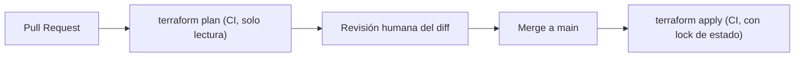
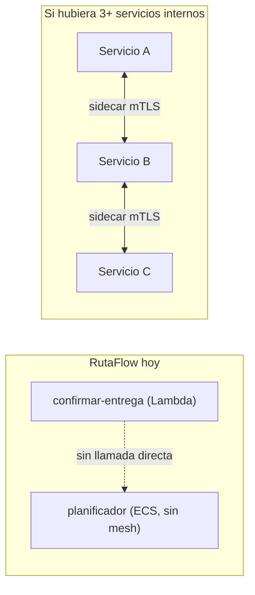
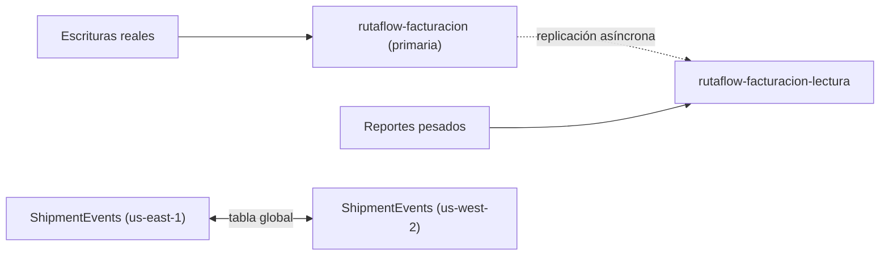
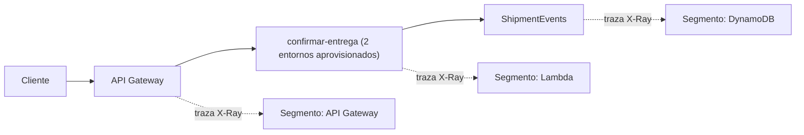
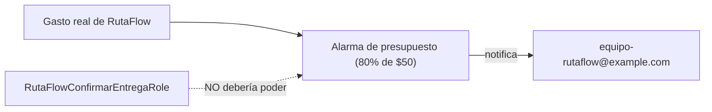
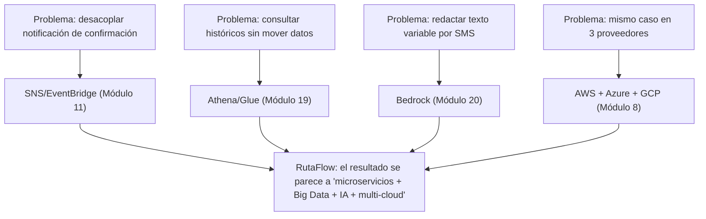

# Módulo 33: Cloud Master: plataforma, seguridad, datos y FinOps


## Aprende construyendo

### Tema 1: Terraform avanzado y CI/CD cloud

#### Paso 1 · Objetivo y preparación
Al finalizar vas a versionar como código `ShipmentEvents` (Módulo 4) y `confirmar-entrega` (Módulo 5), con estado remoto bloqueado, y a engancharlo al pipeline real del Módulo 24. Prerrequisitos: Módulos 4, 5 y 24 completos.
#### Paso 2 · Contexto y caso real
Hasta ahora cada recurso de RutaFlow se creó a mano por CLI, módulo por módulo. Un equipo real necesita que esos mismos recursos queden declarados en Terraform, con `terraform plan` corriendo en cada PR antes de que nadie aplique nada a mano.
#### Paso 3 · Teoría, modelo mental y analogía
El estado remoto de Terraform es el plano maestro compartido de la obra; sin bloqueo, dos personas pueden dibujar cambios contradictorios sobre el mismo plano al mismo tiempo sin que ninguna se entere.
#### Paso 4 · Demostración guiada
```hcl
terraform {
  backend "s3" {
    bucket         = "demo-terraform-state"
    key            = "rutaflow/terraform.tfstate"
    region         = "us-east-1"
    dynamodb_table = "demo-terraform-locks"
  }
}
resource "aws_dynamodb_table" "shipment_events" {
  name         = "ShipmentEvents"
  billing_mode = "PAY_PER_REQUEST"
  hash_key     = "shipmentId"
  range_key    = "sequence"
  attribute { name = "shipmentId"; type = "S" }
  attribute { name = "sequence"; type = "N" }
}
```
```bash
aws s3 mb s3://demo-terraform-state
aws dynamodb create-table --table-name demo-terraform-locks \
  --attribute-definitions AttributeName=LockID,AttributeType=S \
  --key-schema AttributeName=LockID,KeyType=HASH --billing-mode PAY_PER_REQUEST
terraform init && terraform plan
```
Resultado esperado: `terraform plan` detecta que `ShipmentEvents` ya existe (importado o recreado según cómo lo manejes) y muestra el plan exacto de cambios — nunca aplica nada todavía, solo lo declara.
#### Paso 5 · Práctica guiada
Pista: quitá temporalmente `dynamodb_table` del bloque `backend` y corré `terraform apply` dos veces en paralelo desde dos terminales — ese es el fallo deliberado: sin tabla de bloqueo, ambas ejecuciones pueden escribir al mismo archivo de estado remoto a la vez, corrompiéndolo o perdiendo los cambios de una de las dos.
#### Paso 6 · Práctica independiente
Agregá una fase `terraform plan` al `buildspec` de `demo-build` (Módulo 24) que corra en cada build, y una fase separada `terraform apply -auto-approve` que solo se ejecute cuando el build corresponda a la rama principal — la misma separación plan-en-PR/apply-en-merge de cualquier pipeline real.
#### Paso 7 · Cierre y evidencia
Entregá el estado remoto bloqueado del Paso 4, la corrupción evitable sin lock del Paso 5, y la fase de CI del Paso 6; explicá por qué declarar `ShipmentEvents` en Terraform no sustituye todo lo que ya aprendiste del servicio en el Módulo 4, solo cambia cómo se crea y se versiona. Siguiente paso: Kubernetes y Service Mesh. Errores comunes: secretos en Git y probar solo el camino feliz. Fuente oficial: https://developer.hashicorp.com/terraform/language/state/locking.
**Conceptos clave:** estado remoto, bloqueo de estado, `terraform plan` en CI, `apply` solo en merge, importación de recursos existentes.

Terraform avanzado no es aprender más sintaxis de HCL: es resolver los problemas que aparecen cuando más de una persona o más de un pipeline tocan la misma infraestructura. El estado remoto con bloqueo (`dynamodb_table` en el backend de S3) es exactamente ese problema resuelto para RutaFlow — sin él, dos cambios concurrentes a `ShipmentEvents` podrían perderse entre sí sin que nadie lo note hasta mucho después.

Separar `terraform plan` (que corre en cada PR, sin aplicar nada, solo para que el equipo revise el diff de infraestructura antes de aprobarlo) de `terraform apply` (que solo corre tras el merge, en la rama principal) es el mismo principio de revisión antes de producción que ya aplicaste con los despliegues canary del Módulo 24: nadie cambia infraestructura real sin que alguien más haya visto el plan primero.

**Analogía:** el estado remoto bloqueado es como el plano único y numerado de una obra en construcción: solo un capataz a la vez puede marcarlo con cambios, y todos los demás ven exactamente esa misma versión antes de proponer la siguiente.

**¿Por qué es importante?** La mayoría de los incidentes de infraestructura como código no vienen de HCL mal escrito, sino de estado compartido mal gestionado: dos personas aplicando cambios a la vez, o un `apply` manual que nadie revisó. Resolver eso con bloqueo de estado y una fase de `plan` obligatoria en CI es lo que separa un uso amateur de Terraform de uno de equipo.

**Casos de uso reales:** dos `apply` concurrentes sin lock, un `plan` que nadie revisó antes del merge, estado remoto perdido por borrar el bucket por error, y una importación de recursos ya existentes que evita recrearlos desde cero.

**Diagrama:**


```mermaid
flowchart LR
  PR["Pull Request"] --> Plan["terraform plan (CI, solo lectura)"]
  Plan --> Review["Revisión humana del diff"]
  Review --> Merge["Merge a main"]
  Merge --> Apply["terraform apply (CI, con lock de estado)"]
```
### Tema 2: Kubernetes administrado, ECS y Service Mesh

#### Paso 1 · Objetivo y preparación
Al finalizar vas a decidir si el planificador de rutas (Módulo 14, ECS) necesitaría EKS o un service mesh, y por qué todavía no. Prerrequisitos: Módulo 14 completo.
#### Paso 2 · Contexto y caso real
Si RutaFlow agregara un tercer servicio en contenedor (por ejemplo, un worker de reportes) que necesitara hablar con el planificador con mTLS y reintentos automáticos, la pregunta real es si ECS solo alcanza o si hace falta Kubernetes con un service mesh encima.
#### Paso 3 · Teoría, modelo mental y analogía
Un service mesh es una red de carteros privados entre tus propios servicios: cada uno habla con un sidecar local, y el sidecar se encarga de cifrar, reintentar y medir sin que el código de la aplicación sepa que existe.
#### Paso 4 · Demostración guiada
```bash
aws ecs describe-services --cluster rutaflow-cluster --services demo-planificador-service \
  --query 'services[0].{Lanzamiento:launchType,Deployment:deploymentController}'
```
Resultado esperado: el servicio ECS del planificador (Módulo 14) muestra su `deploymentController` nativo — sin ningún sidecar de mesh instalado, porque con un solo servicio real hablando con una sola base de datos, ECS puro ya resuelve el problema sin esa capa adicional.
#### Paso 5 · Práctica guiada
Pista: instalar App Mesh o un sidecar Envoy sobre `demo-planificador-service` HOY, cuando solo existe un servicio consumiendo la tabla `ShipmentEvents` directamente — ese es el fallo deliberado de sobre-ingeniería: agregarías latencia, complejidad de configuración y un nuevo punto de fallo (el propio sidecar) sin ningún beneficio real, porque no hay todavía múltiples servicios que necesiten mTLS entre sí.
#### Paso 6 · Práctica independiente
Documentá la condición concreta que justificaría migrar: "si RutaFlow tuviera 3+ servicios en contenedores hablando entre sí con reintentos y cifrado propios, un service mesh (o EKS con Istio) empezaría a pagar su complejidad" — y compará esa condición contra el estado real de hoy (1 servicio, ECS puro).
#### Paso 7 · Cierre y evidencia
Entregá el estado real de `demo-planificador-service` del Paso 4, el sidecar innecesario del Paso 5, y la condición de migración documentada del Paso 6; explicá por qué "está de moda" nunca es la razón correcta para adoptar Kubernetes o un service mesh. Siguiente paso: EC2, VPC, RDS, S3 y DynamoDB avanzados. Errores comunes: adoptar un mesh sin múltiples servicios y confundir ECS con Kubernetes. Fuente oficial: https://docs.aws.amazon.com/eks/latest/userguide/what-is-eks.html.
**Conceptos clave:** service mesh, sidecar, mTLS entre servicios, condición real de adopción, ECS vs EKS vs mesh.

Un service mesh resuelve un problema específico: cuando tenés varios servicios propios hablando entre sí (no con el cliente final, sino servicio-a-servicio), necesitás cifrado, reintentos, circuit breakers y métricas de esas llamadas internas sin reescribir esa lógica en cada servicio. Un sidecar (normalmente Envoy) se inyecta junto a cada contenedor y intercepta ese tráfico interno de forma transparente.

El error común es instalar esta complejidad antes de necesitarla. RutaFlow, con un solo `confirmar-entrega` (Lambda) y un planificador (ECS) que no se llaman entre sí directamente, no tiene todavía el problema que un mesh resuelve. EKS es Kubernetes gestionado, no un mesh en sí — podrías tener EKS sin mesh, o ECS con un mesh (App Mesh) encima; son dos decisiones independientes, aunque Kubernetes es el ecosistema donde los meshes son más comunes porque ahí suele haber más servicios internos desde el principio.

**Analogía:** un service mesh es como instalar una central telefónica interna con grabación y reintento automático entre las oficinas de tu propia empresa; tiene sentido cuando hay muchas oficinas llamándose entre sí todo el día, no cuando solo hay dos y se hablan una vez por semana.

**¿Por qué es importante?** Adoptar Kubernetes o un service mesh por su reputación, sin tener el problema real que resuelven (múltiples servicios internos con necesidades de resiliencia compartidas), es una de las formas más comunes de sobre-ingeniería en arquitecturas cloud modernas.

**Casos de uso reales:** un solo servicio sin necesidad de mesh, tres servicios internos que sí lo justificarían, migración de ECS a EKS por portabilidad de Kubernetes, y un sidecar mal configurado que añade latencia sin beneficio.

**Diagrama:**


```mermaid
flowchart LR
  subgraph Hoy["RutaFlow hoy"]
    L["confirmar-entrega (Lambda)"] -.->|sin llamada directa| P["planificador (ECS, sin mesh)"]
  end
  subgraph Futuro["Si hubiera 3+ servicios internos"]
    S1["Servicio A"] <-->|sidecar mTLS| S2["Servicio B"]
    S2 <-->|sidecar mTLS| S3["Servicio C"]
  end
```

En el proyecto integrador RutaFlow, esta decisión queda explícita en
`examples/rutaflow/cloud/template.yaml`: `ConfirmarEntregaFn` no tiene ningún sidecar ni mesh
declarado porque no conviene instalarlo sin el problema real que resuelve (múltiples servicios
internos con necesidades de mTLS y reintentos compartidas) — la diferencia frente a adoptarlo
"porque está de moda" es justamente esa condición concreta de 3+ servicios del Paso 6.

### Tema 3: EC2, VPC, RDS, S3 y DynamoDB avanzados

#### Paso 1 · Objetivo y preparación
Al finalizar vas a agregarle a `ShipmentEvents` una tabla global multi-región y a `rutaflow-facturacion` una réplica de lectura, dos técnicas avanzadas que ningún módulo anterior cubrió. Prerrequisitos: Módulos 4 y 13 completos.
#### Paso 2 · Contexto y caso real
Si RutaFlow expande a una segunda región para reducir latencia, `ShipmentEvents` necesita estar disponible en ambas sin que el equipo reescriba la lógica de replicación a mano; y los reportes pesados de facturación no deberían competir por capacidad con las escrituras reales de `rutaflow-facturacion`.
#### Paso 3 · Teoría, modelo mental y analogía
Una tabla global es la misma tabla escribiéndose en varias regiones a la vez, con reconciliación automática; una réplica de lectura es una copia de solo consulta que absorbe el tráfico de reportes sin tocar la instancia principal.
#### Paso 4 · Demostración guiada
```bash
aws dynamodb update-table --table-name ShipmentEvents \
  --replica-updates '[{"Create":{"RegionName":"us-west-2"}}]'
aws rds create-db-instance-read-replica --db-instance-identifier rutaflow-facturacion-lectura \
  --source-db-instance-identifier rutaflow-facturacion
```
Resultado esperado: `ShipmentEvents` queda replicándose también hacia `us-west-2`; `rutaflow-facturacion-lectura` aparece como una instancia de solo lectura separada — los reportes pesados pueden apuntar ahí sin competir con las escrituras reales de facturas.
#### Paso 5 · Práctica guiada
Pista: escribí un item directamente en la réplica de lectura con `put-item` apuntando a su endpoint — ese es el fallo deliberado: una réplica de lectura de RDS rechaza escrituras por diseño (`ERROR: cannot execute INSERT in a read-only transaction`), porque su único propósito es servir consultas sin afectar la fuente de verdad.
#### Paso 6 · Práctica independiente
Documentá qué pasaría con la tabla global de `ShipmentEvents` si las dos regiones recibieran una escritura distinta para el mismo `shipmentId`+`sequence` casi al mismo tiempo (pista: DynamoDB global tables resuelve conflictos por "último escritor gana" según timestamp, no por orden de llegada a cada región).
#### Paso 7 · Cierre y evidencia
Entregá la tabla global y la réplica de lectura creadas del Paso 4, el rechazo de escritura del Paso 5, y la resolución de conflictos documentada del Paso 6; explicá por qué ninguna de las dos técnicas se justificaba en los módulos anteriores, cuando RutaFlow corría en una sola región. Siguiente paso: Lambda, API Gateway y observabilidad avanzada. Errores comunes: escribir en una réplica de lectura y asumir orden global en tablas multi-región. Fuente oficial: https://docs.aws.amazon.com/amazondynamodb/latest/developerguide/GlobalTables.html.
**Conceptos clave:** DynamoDB global tables, réplicas de lectura de RDS, resolución de conflictos multi-región, separación de tráfico de lectura y escritura.

Estas dos técnicas resuelven problemas que solo aparecen a cierta escala: una tabla global existe porque servir lecturas desde la región más cercana al usuario reduce latencia real, no por "más disponibilidad" en abstracto; una réplica de lectura existe porque los reportes de facturación, al escanear muchas filas, competirían por recursos con las transacciones reales si corrieran contra la misma instancia.

Ambas comparten un principio: separar el tráfico que realmente necesita coordinación fuerte (escrituras) del que puede tolerar una copia asíncrona (lecturas de reportes, lecturas desde otra región). Forzar todo el tráfico por una sola instancia "porque es más simple" funciona hasta que la escala lo rompe de formas difíciles de diagnosticar.

**Analogía:** una réplica de lectura es como tener una copia impresa del libro mayor en la sala de archivo para que el equipo de contabilidad consulte sin molestar al cajero que sigue anotando movimientos en el libro original; una tabla global es tener ese mismo libro mayor actualizado en dos sucursales a la vez, con una regla clara de qué anotación gana si ambas sucursales escriben la misma línea casi simultáneamente.

**¿Por qué es importante?** Escalar una base de datos no siempre significa "una instancia más grande": a menudo significa separar por tipo de acceso (lectura vs escritura, local vs global) usando el mecanismo que el propio motor ya ofrece, en vez de resolverlo con código de aplicación propenso a errores.

**Casos de uso reales:** reportes pesados que antes competían con transacciones reales, expansión a una segunda región, conflicto de escritura resuelto por timestamp, y un intento fallido de escribir en una réplica de solo lectura.

**Diagrama:**


```mermaid
flowchart LR
  W["Escrituras reales"] --> Primaria["rutaflow-facturacion (primaria)"]
  Primaria -.->|replicación asíncrona| Lectura["rutaflow-facturacion-lectura"]
  Reportes["Reportes pesados"] --> Lectura
  SE["ShipmentEvents (us-east-1)"] <-->|tabla global| SE2["ShipmentEvents (us-west-2)"]
```

En el proyecto integrador RutaFlow, ninguna de estas dos técnicas se declara todavía en
`examples/rutaflow/cloud/template.yaml` — y esa ausencia es la decisión correcta mientras
RutaFlow corre en una sola región: el límite real de una tabla global o una réplica de lectura
es el costo y la complejidad operativa que agregan, que no conviene pagar antes de necesitarlos.

#### Profundización · EC2 avanzado: Auto Scaling por CPU real, no por umbral fijo
```bash
aws autoscaling put-scaling-policy --auto-scaling-group-name rutaflow-workers \
  --policy-name escalar-por-cpu --policy-type TargetTrackingScaling \
  --target-tracking-configuration '{"PredefinedMetricSpecification":{"PredefinedMetricType":"ASGAverageCPUUtilization"},"TargetValue":60.0}'
```
Una política de *target tracking* ajusta la capacidad deseada del grupo automáticamente hacia el valor objetivo (60% de CPU promedio), subiendo y bajando instancias de forma continua — a diferencia de una alarma con umbral fijo que solo reacciona en un punto y puede sobrecorregir. Fallo común: fijar un `TargetValue` demasiado bajo (por ejemplo 10%) provoca "thrashing" — el grupo agrega y quita instancias constantemente porque cualquier variación normal de tráfico cruza ese umbral tan sensible.

#### Profundización · VPC avanzado: acceso privado a DynamoDB sin salir a internet
```bash
aws ec2 create-vpc-endpoint --vpc-id vpc-0123456789 --service-name com.amazonaws.us-east-1.dynamodb \
  --route-table-ids rtb-0123456789 --vpc-endpoint-type Gateway
```
Un Gateway VPC Endpoint para DynamoDB enruta el tráfico de las instancias dentro de la VPC directo a DynamoDB por la red privada de AWS, sin pasar por un Internet Gateway ni un NAT — una instancia de `rutaflow-workers` sin IP pública ni ruta a `0.0.0.0/0` puede seguir leyendo y escribiendo en `ShipmentEvents` sin ningún problema. Fallo común: crear el endpoint pero olvidar asociarlo a la tabla de rutas de la subred correcta — el tráfico sigue intentando salir por el NAT (costo extra) o falla directamente si no hay NAT configurado.

#### Profundización · S3 avanzado: lifecycle policy para evidencia de entrega antigua
```bash
aws s3api put-bucket-lifecycle-configuration --bucket rutaflow-pruebas-entrega --lifecycle-configuration '{
  "Rules": [{"ID": "archivar-evidencia-antigua", "Status": "Enabled",
    "Filter": {"Prefix": "evidencia/"},
    "Transitions": [{"Days": 90, "StorageClass": "GLACIER_IR"}]}]}'
```
Las fotos de `PruebasEntrega` (Módulo 9) más antiguas de 90 días se mueven automáticamente a una clase de almacenamiento más económica (Glacier Instant Retrieval), sin que nadie tenga que auditar y mover objetos viejos a mano — siguen siendo recuperables casi al instante si un reclamo de un cliente necesita revisar una entrega de hace meses.

### Tema 4: Lambda, API Gateway y observabilidad avanzada

#### Paso 1 · Objetivo y preparación
Al finalizar vas a reducir el cold start de `confirmar-entrega` con concurrencia aprovisionada, y a trazar con X-Ray una petición completa a través de API Gateway. Prerrequisitos: Módulos 5, 6 y 12 completos.
#### Paso 2 · Contexto y caso real
El cold start medido en el Módulo 5 Tema 1 es aceptable para uso normal, pero si `confirmar-entrega` tuviera que responder siempre en menos de 200ms (por ejemplo, detrás de un SLA real con el socio logístico), ese primer arranque lento ya no sería tolerable.
#### Paso 3 · Teoría, modelo mental y analogía
La concurrencia aprovisionada mantiene entornos "calientes" esperando, como tener cocineros ya listos en vez de contratar uno apenas llega el primer pedido; X-Ray es la hoja de ruta de una petición, mostrando cuánto tardó cada parada del recorrido.
#### Paso 4 · Demostración guiada
```bash
aws lambda put-provisioned-concurrency-config --function-name confirmar-entrega \
  --qualifier produccion --provisioned-concurrent-executions 2
time aws lambda invoke --function-name confirmar-entrega:produccion \
  --payload '{"shipmentId":"env-9001","recipientPin":"837201"}' salida.json
```
Resultado esperado: el tiempo de esta invocación ya no muestra el cold start que medías en el Módulo 5 — los 2 entornos aprovisionados estaban esperando antes de que llegara la petición.
#### Paso 5 · Práctica guiada
Pista: invocá una tercera vez simultánea mientras las 2 ejecuciones aprovisionadas están ocupadas — ese es el fallo deliberado: esa tercera invocación sí sufre un cold start real, porque la concurrencia aprovisionada cubre un número fijo de ejecuciones simultáneas, no invocaciones ilimitadas sin arranque en frío.
#### Paso 6 · Práctica independiente
Habilitá X-Ray sobre `confirmar-entrega` y sobre el método `POST /entregas` de API Gateway (Módulo 6), hacé una invocación real a través de la API, y revisá el segmento de traza resultante — identificá cuánto tiempo se fue en API Gateway vs en la Lambda vs en el `PutItem` a `ShipmentEvents`.
#### Paso 7 · Cierre y evidencia
Entregá la invocación sin cold start del Paso 4, el cold start real de la tercera invocación simultánea del Paso 5, y la traza X-Ray desglosada del Paso 6; explicá por qué la concurrencia aprovisionada tiene un costo fijo incluso sin tráfico, a diferencia del modelo de pago por invocación del Módulo 5. Siguiente paso: seguridad, auditoría y FinOps. Errores comunes: aprovisionar de más sin medir tráfico real y no instrumentar X-Ray en toda la cadena. Fuente oficial: https://docs.aws.amazon.com/lambda/latest/dg/provisioned-concurrency.html.
**Conceptos clave:** concurrencia aprovisionada, cold start mitigado (no eliminado), trazas distribuidas con X-Ray, segmentos y subsegmentos.

La concurrencia aprovisionada no elimina el cold start, lo prepaga: AWS mantiene un número fijo de entornos de ejecución ya inicializados, listos para atender peticiones sin el arranque en frío, pero esa capacidad tiene un costo constante aunque no llegue tráfico, muy distinto al modelo "pagás solo cuando se ejecuta" que ya conocés de Lambda estándar.

X-Ray complementa esto dándote visibilidad de dónde se va el tiempo en una petición que atraviesa varios servicios (API Gateway → Lambda → DynamoDB): sin trazas distribuidas, un aumento de latencia podría atribuirse erróneamente a la Lambda cuando en realidad el cuello de botella está en la escritura a DynamoDB, o viceversa.

**Analogía:** la concurrencia aprovisionada es como tener dos mesas ya puestas y con el mesero esperando antes de que llegue el primer cliente del día, en vez de empezar a prepararlas apenas alguien se sienta; X-Ray es la hoja de ruta con sellos de tiempo de cada parada de un pedido, desde que entra hasta que sale servido.

**¿Por qué es importante?** Optimizar latencia sin medir primero dónde se pierde el tiempo es optimizar a ciegas; X-Ray es lo que te permite decidir con evidencia si el problema está en el cold start, en la Lambda misma, o en el servicio de datos que consulta.

**Casos de uso reales:** SLA estricto que exige concurrencia aprovisionada, pico de tráfico que excede la concurrencia reservada, traza que revela que el cuello de botella real está en DynamoDB, y costo fijo de aprovisionar sin tráfico que lo justifique.

**Diagrama:**


```mermaid
flowchart LR
  C["Cliente"] --> AG["API Gateway"]
  AG --> L["confirmar-entrega (2 entornos aprovisionados)"]
  L --> DB["ShipmentEvents"]
  AG -.->|traza X-Ray| XR["Segmento: API Gateway"]
  L -.->|traza X-Ray| XR2["Segmento: Lambda"]
  DB -.->|traza X-Ray| XR3["Segmento: DynamoDB"]
```

#### Profundización · CloudWatch avanzado: encontrar la invocación lenta real con Logs Insights
```bash
aws logs start-query --log-group-name /aws/lambda/confirmar-entrega \
  --start-time $(date -d '-1 hour' +%s) --end-time $(date +%s) \
  --query-string 'fields @timestamp, @duration | filter @duration > 1000 | sort @duration desc | limit 5'
```
Logs Insights consulta directamente el contenido de los logs con un lenguaje tipo SQL, en vez de desplazarte manualmente por miles de líneas en la consola: esta consulta específica devuelve las 5 invocaciones más lentas de la última hora que superaron 1000ms, con su timestamp exacto — la misma pregunta que X-Ray responde para una traza individual, pero agregada sobre todo el tráfico reciente para encontrar los peores casos sin revisar traza por traza.

### Tema 5: Seguridad, auditoría y FinOps

#### Paso 1 · Objetivo y preparación
Al finalizar vas a conectar una alarma de presupuesto real sobre el gasto sintetizado de RutaFlow (Módulo 29) con una auditoría de qué rol la dispararía. Prerrequisitos: Módulos 7 y 29 completos.
#### Paso 2 · Contexto y caso real
Un pico de costo inesperado en `demo-costo-antes` o en `ShipmentEvents` (por un bug que crea objetos o escribe en loop) debería alertar a alguien automáticamente, no descubrirse al revisar la factura al final del mes.
#### Paso 3 · Teoría, modelo mental y analogía
Una alarma de presupuesto es un sensor de humo conectado al costo, no al fuego: avisa por un umbral cruzado, antes de que el incendio (la factura) ya esté completo.
#### Paso 4 · Demostración guiada
```bash
aws budgets create-budget --account-id 000000000000 --budget \
  '{"BudgetName":"rutaflow-mensual","BudgetLimit":{"Amount":"50","Unit":"USD"},"TimeUnit":"MONTHLY","BudgetType":"COST"}' \
  --notifications-with-subscribers '[{"Notification":{"NotificationType":"ACTUAL","ComparisonOperator":"GREATER_THAN","Threshold":80},"Subscribers":[{"SubscriptionType":"EMAIL","Address":"equipo-rutaflow@example.com"}]}]'
```
Resultado esperado: el presupuesto queda creado con una notificación al 80% de $50 — si el gasto sintetizado del Módulo 29 cruza ese umbral, el equipo se entera por correo antes de llegar al límite completo.
#### Paso 5 · Práctica guiada
Pista: simulá con `aws iam simulate-custom-policy` que el rol `RutaFlowConfirmarEntregaRole` (Módulo 7) tiene permiso `budgets:ModifyBudget` además de sus permisos normales de DynamoDB/SQS — ese es el fallo deliberado: una función que solo necesita confirmar entregas nunca debería poder modificar ni apagar la alarma de presupuesto que la vigila a ella misma indirectamente; es el mismo principio de mínimo privilegio del Módulo 7, aplicado a gobierno financiero.
#### Paso 6 · Práctica independiente
Documentá qué pasaría si ese presupuesto se cruzara de verdad: ¿quién lo revisa?, ¿qué decisión tomaría (investigar un bug, escalar capacidad a propósito, ignorarlo porque es tráfico real de crecimiento)? Una alarma sin un responsable definido es tan inútil como no tenerla.
#### Paso 7 · Cierre y evidencia
Entregá el presupuesto con alarma del Paso 4, el permiso excesivo detectado del Paso 5, y el plan de respuesta del Paso 6; explicá por qué auditoría y FinOps son, en el fondo, la misma disciplina de "ver lo que está pasando antes de que sea demasiado tarde" aplicada a dos cosas distintas (permisos, costo). Siguiente paso: microservicios, Big Data, AI/ML y multi-cloud. Errores comunes: alarmas sin responsable y permisos financieros amplios. Fuente oficial: https://docs.aws.amazon.com/cost-management/latest/userguide/budgets-managing-costs.html.
**Conceptos clave:** alarma de presupuesto, umbral de notificación, mínimo privilegio aplicado a FinOps, responsable de alarma.

Seguridad y FinOps convergen en un mismo principio: ambos dependen de saber qué está pasando antes de que el daño (una brecha, una factura inesperada) ya esté hecho. Una alarma de presupuesto sin nadie asignado a revisarla es equivalente a un rol con permisos excesivos que nadie audita — ambos "existen" pero no protegen nada en la práctica.

Aplicar mínimo privilegio también al gobierno financiero (quién puede crear, modificar o silenciar una alarma de presupuesto) cierra un hueco real: si cualquier rol operativo pudiera apagar sus propias alarmas de costo, la alarma deja de ser una garantía y se vuelve una sugerencia que un bug (o un atacante) podría desactivar.

**Analogía:** una alarma de presupuesto es un sensor de humo; sirve para avisar antes del incendio completo, no para apagarlo. Que cualquiera pueda desconectar el sensor porque "molesta" es tan peligroso como no instalarlo.

**¿Por qué es importante?** La seguridad y el costo de una cuenta cloud se degradan de la misma forma: lentamente, sin que nadie lo note, hasta que una auditoría o una factura grande fuerza a mirar. Las alarmas y el mínimo privilegio son las dos defensas que evitan depender de esa revisión tardía.

**Casos de uso reales:** presupuesto cruzado por un bug real, alarma sin responsable asignado, rol operativo con permiso de apagar su propia alarma, y una auditoría que detecta el permiso excesivo antes de que se use.

**Diagrama:**


```mermaid
flowchart LR
  Gasto["Gasto real de RutaFlow"] --> Presupuesto["Alarma de presupuesto (80% de $50)"]
  Presupuesto -->|notifica| Equipo["equipo-rutaflow@example.com"]
  Rol["RutaFlowConfirmarEntregaRole"] -.->|NO debería poder| Presupuesto
```

En el proyecto integrador RutaFlow, este presupuesto vigilaría exactamente los recursos
declarados en `examples/rutaflow/cloud/template.yaml` — `DeliveryCommands`, `ShipmentEvents`,
`PruebasEntrega` y `ConfirmarEntregaFn` — para que un bug de cualquiera de ellos se detecte por
costo antes de descubrirse en la factura final.

#### Profundización · CloudTrail avanzado: quién modificó el presupuesto, de verdad
```bash
aws cloudtrail lookup-events --lookup-attributes AttributeKey=EventName,AttributeValue=ModifyBudget \
  --start-time $(date -d '-7 days' +%Y-%m-%dT%H:%M:%SZ)
```
La simulación de permisos del Paso 5 responde "¿quién PODRÍA modificar el presupuesto?"; CloudTrail responde la pregunta complementaria y distinta: "¿quién LO MODIFICÓ, de verdad, y cuándo?" — cada llamada a `ModifyBudget` queda registrada con el identificador exacto del rol o usuario que la hizo, sin depender de que alguien lo reporte manualmente. Sin CloudTrail, un cambio no autorizado al presupuesto solo se notaría por sus efectos (la alarma deja de dispararse), nunca por su causa.

### Tema 6: Microservicios, Big Data, AI/ML y multi-cloud

#### Paso 1 · Objetivo y preparación
Al finalizar vas a trazar, en un solo diagrama real, cómo los microservicios de RutaFlow, su analítica de Big Data y su capa de IA ya conviven hoy, módulo por módulo. Prerrequisitos: Módulos 11, 19, 20 y 31 completos.
#### Paso 2 · Contexto y caso real
Alguien nuevo en el equipo pregunta "¿RutaFlow es un monolito o microservicios? ¿usa Big Data? ¿IA?" — la respuesta honesta es que ya usa las cuatro cosas, cada una resolviendo un problema puntual, no por seguir una tendencia.
#### Paso 3 · Teoría, modelo mental y analogía
Microservicios, Big Data, AI/ML y multi-cloud no son una pila que se adopta entera: son herramientas independientes que se usan donde el problema real las justifica, como ya hizo RutaFlow módulo a módulo sin que nadie lo planeara como "arquitectura de microservicios" desde el día uno.
#### Paso 4 · Demostración guiada
```bash
aws events list-rules --event-bus-name rutaflow-eventos --query 'Rules[].Name'
aws athena list-query-executions --query 'QueryExecutionIds[0:3]'
aws bedrock-runtime invoke-model --model-id anthropic.claude-sonnet-5 \
  --body '{"prompt":"test","max_tokens":5}' --cli-binary-format raw-in-base64-out /tmp/out.json
```
Resultado esperado: tres respuestas reales de tres piezas distintas que YA existen en RutaFlow — `confirmar-entrega` y el planificador comunicándose por eventos (microservicios, Módulo 11), consultas históricas sobre `rutaflow-ubicaciones-historico` (Big Data, Módulo 19), y generación de texto para el SMS de confirmación (AI/ML, Módulo 20) — sin que ningún módulo lo haya llamado "adoptar microservicios" explícitamente.
#### Paso 5 · Práctica guiada
Pista: intentá justificar agregar Kafka/MSK (Módulo 17) completo para un volumen de eventos que hoy cabe perfecto en SQS+SNS (Módulo 11) — ese es el fallo deliberado de esta síntesis final: adoptar la pieza "de Big Data" o "de microservicios" más grande disponible, en vez de la que el volumen y la complejidad reales de RutaFlow justifican hoy.
#### Paso 6 · Práctica independiente
Dibujá (en papel o en un README) el mapa completo: qué parte de RutaFlow es multi-cloud de verdad (Módulo 8: AWS + Azure + GCP para el mismo caso de ubicaciones), qué parte es Big Data (Athena/Firehose/Kinesis), qué parte es IA (Bedrock/Textract), y qué parte sigue siendo, simplemente, un backend serverless bien diseñado sin ninguna etiqueta de moda encima.
#### Paso 7 · Cierre y evidencia
Entregá las tres piezas reales confirmadas del Paso 4, el sobre-dimensionamiento evitado del Paso 5, y el mapa completo del Paso 6; explicá por qué "usar microservicios/Big Data/IA" nunca fue el objetivo de ningún módulo de este track — resolver un problema real con la herramienta correcta sí lo fue, y estas etiquetas son solo la forma en que la industria nombra el resultado. Siguiente paso: cerrar el track. Errores comunes: adoptar una pieza grande sin el volumen que la justifique y nombrar la arquitectura antes de construirla. Fuente oficial: https://aws.amazon.com/architecture/.
**Conceptos clave:** microservicios como consecuencia (no objetivo), Big Data proporcional al volumen real, IA aplicada a un problema concreto, multi-cloud cuando el caso lo exige.

Este Tema cierra el módulo con una idea deliberadamente anticlimática: RutaFlow nunca "adoptó microservicios" ni "adoptó Big Data" como decisión de portada. Cada pieza llegó porque un problema concreto de un módulo específico la justificó — desacoplar `confirmar-entrega` de sus notificaciones (Módulo 11), consultar históricos sin mover datos (Módulo 19), redactar un SMS variable (Módulo 20). La arquitectura resultante se parece a "microservicios con Big Data y AI/ML", pero nombrarla así nunca fue el punto de partida.

Esto es exactamente lo contrario de la trampa más común en arquitecturas reales: elegir la tecnología por su nombre de moda y después buscarle un problema que justifique haberla adoptado. El criterio correcto, reforzado en cada módulo de este track, es el inverso: identificar el problema real primero, y solo entonces preguntar qué herramienta —simple o compleja— lo resuelve con el menor costo operativo posible.

**Analogía:** un edificio no se vuelve "inteligente" por instalarle sensores en todos los cuartos; se vuelve inteligente cuando cada sensor resuelve un problema real (ahorrar energía, detectar una fuga) y el conjunto se describe así después, no antes.

**¿Por qué es importante?** Esta es la lección que debería sobrevivir a todos los nombres de tecnología específicos de este track: la pregunta correcta nunca es "¿qué arquitectura está de moda?", es "¿qué problema tengo, y cuál es la herramienta con el costo justo para resolverlo?" — la misma pregunta que ya aplicaste decenas de veces entre los Módulos 2 y 32.

**Casos de uso reales:** un equipo que adopta microservicios sin tener múltiples equipos que los justifiquen, un pipeline de Big Data sobre un volumen que cabría en una hoja de cálculo, un modelo de IA generativa para un problema que una plantilla fija resolvía igual de bien, y RutaFlow usando las cuatro piezas con moderación real.

**Diagrama:**


```mermaid
flowchart TD
  P1["Problema: desacoplar notificación de confirmación"] --> M1["SNS/EventBridge (Módulo 11)"]
  P2["Problema: consultar históricos sin mover datos"] --> M2["Athena/Glue (Módulo 19)"]
  P3["Problema: redactar texto variable por SMS"] --> M3["Bedrock (Módulo 20)"]
  P4["Problema: mismo caso en 3 proveedores"] --> M4["AWS + Azure + GCP (Módulo 8)"]
  M1 --> R["RutaFlow: el resultado se parece a 'microservicios + Big Data + IA + multi-cloud'"]
  M2 --> R
  M3 --> R
  M4 --> R
```


## Trazabilidad de la auditoría original

- **Terraform Avanzado**: cubierto en el Tema 1 (Terraform avanzado y CI/CD cloud) de este módulo.
- **CI/CD en Cloud**: cubierto en el Tema 1 de este módulo.
- **Kubernetes en Cloud**: cubierto en el Tema 2 (Kubernetes administrado, ECS y Service Mesh) de este módulo.
- **ECS/EKS Avanzado**: cubierto en el Tema 2 de este módulo.
- **EC2 Avanzado**: cubierto en la Profundización de Auto Scaling por CPU del Tema 3 de este módulo.
- **VPC Avanzado**: cubierto en la Profundización de VPC Endpoint para DynamoDB del Tema 3 de este módulo.
- **RDS Avanzado**: cubierto en el Tema 3 (réplica de lectura) de este módulo.
- **S3 Avanzado**: cubierto en la Profundización de lifecycle policy del Tema 3 de este módulo.
- **DynamoDB Avanzado**: cubierto en el Tema 3 (tabla global multi-región) de este módulo.
- **Serverless Avanzado**: cubierto en el Tema 4 (Lambda, API Gateway y observabilidad avanzada) de este módulo.
- **Lambda Avanzado**: cubierto en el Tema 4 (concurrencia aprovisionada) de este módulo.
- **API Gateway Avanzado**: cubierto en el Tema 4 (traza X-Ray a través de API Gateway) de este módulo.
- **Observabilidad Avanzada**: cubierto en el Tema 4 (X-Ray) y en la Profundización de CloudWatch Logs Insights del Tema 4 de este módulo.
- **CloudWatch**: cubierto en la Profundización de Logs Insights del Tema 4 de este módulo.
- **Seguridad Avanzada**: cubierto en el Tema 5 (Seguridad, auditoría y FinOps) de este módulo.
- **IAM Avanzado**: cubierto en el Tema 5 (simulación de permisos sobre el presupuesto) de este módulo.
- **FinOps**: cubierto en el Tema 5 (alarma de presupuesto) de este módulo.
- **CloudTrail**: cubierto en la Profundización de `lookup-events` del Tema 5 de este módulo.
- **Microservicios**: cubierto en el Tema 6 (Microservicios, Big Data, AI/ML y multi-cloud) de este módulo.
- **Big Data**: cubierto en el Tema 6 de este módulo.
- **AI/ML en Cloud**: cubierto en el Tema 6 de este módulo.
- **Multi-Cloud**: cubierto en el Tema 6 de este módulo.
