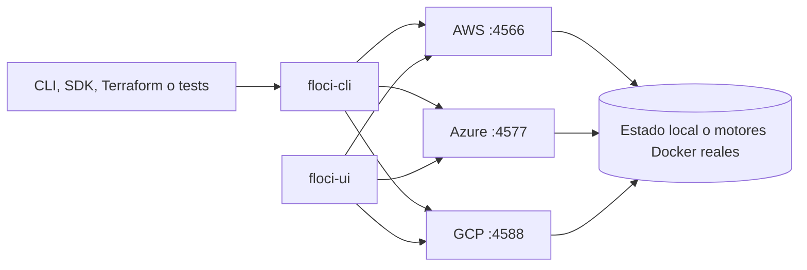

# Módulo 34: Floci oficial completo — plataforma, servicios y laboratorios

## Qué construirás y por qué importa

Crearás un laboratorio local multi-nube reproducible. Al terminar podrás instalar Floci desde cero, iniciar los tres proveedores, inspeccionarlos visualmente, conservar o aislar estado, ejecutar pruebas automatizadas y explicar con precisión qué valida el emulador y qué todavía debe comprobarse en una cuenta real.

La fuente principal es [floci.io](https://floci.io/) y las documentaciones mantenidas por los proyectos `floci`, `floci-az`, `floci-gcp`, `floci-cli`, `floci-ui` y `floci-labs`. Esta lección no copia sus textos: reorganiza y explica sus capacidades en español con un recorrido educativo propio.

## Sílabo

- Instalación y diagnóstico en macOS, Linux y Windows.
- Arquitectura de Floci, CLI, UI, endpoints y SDK oficiales.
- Configuración, persistencia, aislamiento, TLS, hooks y automatización.
- Inventario de servicios AWS, Azure y GCP con sus objetivos de práctica.
- Cuatro laboratorios oficiales reconstruidos como experiencias guiadas.
- Límites del entorno local y transferencia segura hacia producción.

## Antes de empezar

- Docker debe responder a `docker version`.
- Debes reconocer una terminal y una variable de entorno.
- Crea `examples/tracks/cloud/floci-oficial/` para guardar comandos, resultados y errores.
- Nunca uses credenciales de producción. Los valores locales `test` no conceden acceso a AWS.

## Aprende construyendo

### Tema 1: Instalación en macOS, Linux y Windows

**¿Por qué es importante?** Un entorno diagnosticable evita que diferencias del sistema operativo se confundan con fallos del servicio cloud.

#### macOS

Con Homebrew, ejecuta `brew install floci-io/floci/floci`. Si prefieres el instalador oficial, usa `curl -fsSL https://floci.io/install.sh | sh`. Comprueba el resultado con `floci --version` y `floci doctor`; instalar no basta: el diagnóstico demuestra que Docker, la CLI y la conectividad local funcionan juntos.

#### Instalación en Linux

Usa el mismo instalador oficial con `curl -fsSL https://floci.io/install.sh | sh`. Si el comando no aparece después, revisa la carpeta indicada por el instalador y tu variable `PATH`. Ejecuta `docker ps` antes de culpar a Floci: un daemon de Docker detenido es el fallo inicial más común.

#### Instalación en Windows

En PowerShell puedes ejecutar `iwr https://floci.io/install.ps1 | iex`. La alternativa administrada es Scoop: `scoop bucket add floci https://github.com/floci-io/scoop-floci` y luego `scoop install floci`. Comprueba con `floci doctor`; si Docker Desktop usa WSL 2, verifica que la integración esté activa para tu distribución.

### Tema 2: Modelo mental de la plataforma

**¿Por qué es importante?** Distinguir cliente, CLI, emulador y motor real permite saber qué componente observar cuando una operación falla.

`floci-cli` administra procesos; `floci`, `floci-az` y `floci-gcp` implementan APIs locales; `floci-ui` permite observar recursos; los SDK y CLI oficiales siguen siendo los clientes. Esa separación evita aprender comandos inventados: cambia el endpoint, no la forma de programar.

Inicia AWS con `floci start`, Azure con `floci az start` y GCP con `floci gcp start`. Usa `eval $(floci env)`, `eval $(floci az env)` o `eval $(floci gcp env)` en shells compatibles. En PowerShell, canaliza la salida hacia `Invoke-Expression` según la guía oficial.

### Tema 3: AWS CLI y SDK, Azure CLI y SDK, GCP CLI y SDK

**¿Por qué es importante?** Usar clientes oficiales contra endpoints locales permite transferir el aprendizaje sin inventar una API educativa paralela.

AWS usa `AWS_ENDPOINT_URL=http://localhost:4566` y credenciales desechables. Azure exporta una cadena compatible con Azurite y endpoints específicos para Blob, App Configuration y Key Vault. GCP exporta hosts de emulador como `STORAGE_EMULATOR_HOST`, `PUBSUB_EMULATOR_HOST` y `FIRESTORE_EMULATOR_HOST` con un proyecto local.

Una variable mal aplicada suele producir dos errores opuestos: conexión rechazada si apunta al puerto equivocado, o una petición accidental a la nube real si el override no existe. Antes de ejecutar una operación destructiva, imprime el endpoint y confirma que contiene `localhost`.

### Tema 4: Configuración avanzada y ciclo de vida

**¿Por qué es importante?** Persistencia, aislamiento y hooks determinan si un laboratorio es reproducible o depende de estado manual oculto.

#### Puertos, Docker Compose y application.yml

Los puertos principales son 4566, 4577 y 4588. Azure también puede exponer AMQP para Event Hubs y Service Bus. Docker Compose permite fijar imagen, puertos, socket Docker, volúmenes y variables. `application.yml` ofrece configuración detallada del runtime; conserva en Git una plantilla sin secretos y documenta cada cambio respecto al valor predeterminado.

#### Persistencia y snapshots

`floci start --persist ./data` conserva estado entre reinicios. `floci snapshot save <nombre>` y `floci snapshot restore <nombre>` permiten guardar y recuperar un punto conocido. Persistencia sirve para desarrollo diario; una instancia limpia por suite es mejor para pruebas porque evita que un bucket o una cola anterior produzcan falsos positivos.

#### Aislamiento multi-account y aislamiento multi-project

AWS separa almacenamiento por identificador de cuenta; GCP hace lo propio por proyecto. Esto permite simular entornos o tenants sobre una instancia, pero no reemplaza controles reales de organización, cuotas o facturación. Una prueba correcta debe usar identificadores explícitos y demostrar que un contexto no puede ver el estado del otro.

#### TLS y HTTPS, Initialization hooks

TLS local permite recorrer código sensible al esquema HTTPS mediante un certificado autofirmado. El cliente debe confiar deliberadamente en ese certificado solo en desarrollo. Los Initialization hooks crean recursos al arrancar y convierten el entorno en reproducible; deben ser idempotentes para que un segundo inicio no falle ni duplique datos.

### Tema 5: Automatización, UI y agentes

**¿Por qué es importante?** La interfaz ayuda a observar, pero la automatización demuestra que el resultado puede repetirse desde un entorno limpio.

Testcontainers inicia un Floci aislado alrededor de la suite. Hay integraciones oficiales para Testcontainers Java, Testcontainers Node.js, Testcontainers Python y Testcontainers Go. El test obtiene endpoint y credenciales del contenedor, crea sus propios recursos, verifica comportamiento y deja que el framework destruya el entorno.

`floci-ui` es la consola visual para recorrer buckets, tablas, colas, funciones y recursos de los tres proveedores. Úsala como instrumento de observación, no como sustituto de la automatización: cada acción importante debe poder repetirse mediante código, CLI o infraestructura como código.

Para CI efímero, inicia Floci dentro del job, ejecuta migraciones y pruebas, captura logs cuando algo falle y destruye todo al finalizar. Los agentes de IA sin credenciales reales pueden usar este mismo entorno: el radio de impacto queda limitado al contenedor local y no existe una factura cloud accidental. Aun así, revisa el código generado y restringe el acceso al socket Docker.

### Tema 6: Servicios AWS incorporados en la documentación actual

**¿Por qué es importante?** Relacionar cada servicio con un problema evita memorizar un catálogo sin comprender límites ni alternativas.

Los módulos anteriores explican los servicios principales. Esta tabla completa los que estaban solo implícitos o ausentes y explica para qué practicar cada uno.

| Servicio | Qué debes comprender y probar localmente |
|---|---|
| S3 Vectors | Almacenar y consultar vectores; mide dimensiones, filtros y diferencia frente a objetos S3 comunes. |
| RDS Data API | Ejecutar SQL mediante HTTP sin conexión persistente; valida parámetros y manejo de transacciones. |
| MemoryDB | Modelar una base compatible con Redis orientada a durabilidad y distinguirla de una caché. |
| Lightsail | Comprender el plano simplificado de cómputo, redes y recursos agrupados. |
| AWS Batch | Enviar trabajos, colas y definiciones; observa estados y reintentos del procesamiento por lotes. |
| Elastic Beanstalk | Relacionar aplicación, versión, entorno y configuración de plataforma. |
| API Gateway v2 | Construir APIs HTTP y WebSocket y compararlas con API Gateway REST. |
| AWS Cloud Map | Registrar servicios y descubrir instancias por nombre y atributos. |
| IoT Core | Practicar registro, políticas y mensajería de dispositivos sin conectar hardware real. |
| Amazon MQ | Explorar brokers y configuración de mensajería administrada. |
| WAF v2 | Definir ACL web y reglas; no asumir que una emulación de control equivale a protección perimetral real. |
| CloudWatch Metrics | Publicar, consultar y agregar métricas; enlaza dimensiones con una alarma verificable. |
| EMR | Modelar clústeres y pasos de procesamiento distribuido; verifica qué partes son plano de control local. |
| CodePipeline | Representar etapas, acciones y transiciones de entrega continua. |
| Cloud Control API | Gestionar recursos mediante una interfaz común y estudiar consistencia del modelo CRUD. |

El inventario completo también incluye S3, AWS Backup, Transfer Family, DynamoDB y Streams, ElastiCache, RDS, Neptune, DocumentDB, Lambda, EC2, Auto Scaling, ECS, ECR, EKS, ELB v2, Route 53, CloudFront, AppSync, SQS, SNS, Kinesis, EventBridge, Scheduler, Pipes, MSK, SES, IAM, STS, Cognito, KMS, Secrets Manager, ACM, CloudWatch Logs, AWS Config, CloudTrail, OpenSearch, Athena, Glue, Data Firehose, Bedrock Runtime, Textract, Transcribe, SSM Parameter Store, CloudFormation, Step Functions, AppConfig, CodeBuild, CodeDeploy, Resource Groups Tagging API, Cost Explorer, Pricing, CUR y BCM Data Exports.

### Tema 7: Servicios Azure que completan el recorrido

**¿Por qué es importante?** Comparar recursos Azure por plano de control y motor de datos evita asumir una fidelidad local que no existe.

| Servicio | Qué debes comprender y probar localmente |
|---|---|
| Azure Resource Manager | Crear recursos mediante el plano de control y comprender proveedor, tipo, grupo y suscripción. |
| Microsoft Entra ID | Recorrer OAuth2, OIDC y JWKS; separar autenticación de autorización del recurso. |
| Azure SQL Database | Gestionar el recurso y diferenciar plano ARM de conexiones SQL reales. |
| Azure Database for PostgreSQL | Practicar ciclo de vida y acceso PostgreSQL con configuración reproducible. |
| Azure Kubernetes Service | Crear el control plane local y operar workloads con kubectl sobre k3s cuando aplique. |
| Virtual Network | Modelar espacios de direcciones, subredes y límites de confianza. |
| Virtual Machines | Gestionar ciclo de vida y distinguir metadatos simulados de virtualización cloud real. |
| Azure Container Registry | Subir y descargar imágenes OCI y conectarlas con el despliegue de contenedores. |
| Communication Services Email | Preparar remitentes, mensajes y estados de entrega sin confundir aceptación con recepción final. |
| Managed Identity | Obtener tokens sin secretos estáticos y relacionar la identidad con permisos mínimos. |

Estos se suman a Blob Storage, Queue Storage, Table Storage, Azure Functions, App Configuration, Key Vault, Event Hubs, Service Bus, Cosmos DB, API Management, Azure Cache for Redis, Event Grid y Azure Monitor.

### Tema 8: Servicios GCP que completan el recorrido

**¿Por qué es importante?** Los hosts de emulador y proyectos explícitos impiden enviar pruebas por accidente a recursos remotos.

| Servicio | Qué debes comprender y probar localmente |
|---|---|
| Cloud Logging | Escribir y consultar entradas estructuradas con recurso, severidad y etiquetas. |
| Cloud KMS | Crear claves y versiones; diferencia cifrado local de custodia real de hardware. |
| Cloud SQL for PostgreSQL | Gestionar instancia y conectividad PostgreSQL sin asumir paridad de operación regional. |
| Cloud Scheduler | Programar invocaciones, revisar expresiones y probar reintentos de destinos fallidos. |
| Service Usage | Habilitar servicios y seguir operaciones de larga duración antes de usarlos. |
| Resource Manager | Organizar proyectos y metadatos; relacionar jerarquía con aislamiento. |
| Operations API | Consultar operaciones asíncronas y manejar estados pendiente, completado y error. |
| Eventarc | Enrutar eventos hacia destinos mediante filtros y contratos explícitos. |

También forman parte del catálogo Cloud Storage, Pub/Sub, Firestore, Datastore, Secret Manager, IAM, Managed Kafka, GKE, Cloud Run, Cloud Functions, Cloud Tasks, Cloud Monitoring, Firebase Auth y BigQuery.

### Tema 9: Laboratorios oficiales reconstruidos en español

**¿Por qué es importante?** Un laboratorio guiado convierte documentación de referencia en predicción, ejecución, fallo y evidencia verificable.

#### AWS S3 Buckets 101

Crea un bucket, sube y descarga un objeto, configura una política y genera una URL prefirmada. Predice qué operación debe fallar antes de aplicar la política. Evidencia: comandos, respuesta, objeto recuperado y explicación de por qué una URL expirada deja de funcionar.

#### Athena y S3 101

Guarda datos en S3, registra catálogo y tabla en Glue y consulta con Athena. La ejecución local usa un motor real basado en DuckDB. Evidencia: archivo fuente, definición de tabla, consulta agregada y resultado verificable; provoca además un error de esquema y diagnostícalo.

#### Azure Blob Storage 101

Crea un contenedor, carga y descarga un blob y genera un SAS con permisos y vencimiento mínimos. Evidencia: hash del archivo original y recuperado, intento sin autorización y explicación de alcance temporal del SAS.

#### EC2 Ports In-Flight 101

Inicia una instancia local, abre y cierra puertos mientras corre y observa los sidecars `socat` que aparecen y desaparecen. Evidencia: `docker ps`, petición exitosa con el puerto abierto, fallo esperado al cerrarlo y explicación de la diferencia frente a publicar puertos solo al crear un contenedor.

### Tema 10: Límites y transferencia a producción

**¿Por qué es importante?** Reconocer qué no reproduce el entorno local evita trasladar conclusiones falsas sobre seguridad, escala, coste o disponibilidad.

Compatibilidad de API significa que clientes y formatos se comportan como espera el SDK; no significa que latencia regional, cuotas, IAM organizacional, facturación, hardware administrado, disponibilidad multi-zona y fallos del proveedor estén reproducidos completamente. Antes de producción ejecuta un conjunto pequeño de pruebas contractuales en la nube real, revisa seguridad y costes, y documenta cualquier diferencia.

## Criterio transversal de calidad del código

Usa nombres que expresen proveedor, recurso y propósito; valida entradas y convierte errores de SDK en diagnósticos que conserven causa y contexto. Cada flujo necesita al menos una prueba de éxito y una prueba de fallo. Aplica SOLID cuando exista una razón de cambio o una dependencia externa que convenga sustituir, pero decide no abstraer clientes, comandos o servicios que todavía tienen una sola implementación clara. La simplicidad verificable tiene prioridad sobre crear capas por anticipado.

## Laboratorio práctico

1. Levanta los tres proveedores y registra sus health checks.
2. Demuestra persistencia, snapshot y restauración.
3. Demuestra aislamiento entre dos cuentas o proyectos.
4. Ejecuta uno de los cuatro laboratorios sin copiar los comandos finales.
5. Automatiza el laboratorio con Testcontainers o CI efímero.
6. Inspecciona el resultado en floci-ui.
7. Escribe una matriz: “validado localmente”, “requiere nube real”, “riesgo si se omite”.

**Verificación:** los health checks de AWS, Azure y GCP responden; un recurso sobrevive al reinicio y se recupera desde snapshot; dos cuentas o proyectos no pueden leer recursos ajenos; el laboratorio automatizado pasa desde un entorno limpio; y floci-ui refleja el estado creado por CLI o SDK. Adjunta comandos, identificadores ficticios, salida de pruebas y la matriz de límites locales frente a nube real.

## Rúbrica del proyecto

| Criterio | Evidencia mínima | Peso |
|---|---|---:|
| Reproducibilidad | Instalación y arranque repetibles desde una máquina limpia | 25% |
| Cobertura multi-nube | Un flujo comprobado en AWS, Azure y GCP | 25% |
| Automatización | Testcontainers o CI elimina estado manual compartido | 20% |
| Diagnóstico | Fallo provocado, mensaje interpretado y corrección explicada | 15% |
| Transferencia | Matriz honesta de límites y pruebas pendientes en nube real | 15% |

## Criterio para avanzar

No marques este capítulo como completado hasta que otra persona pueda clonar tu carpeta, ejecutar una sola guía y obtener la misma evidencia sin preguntarte dónde colocar archivos, qué variables exportar o cómo reconocer el resultado correcto.

## Resumen del módulo

Floci ofrece una herramienta común para trabajar localmente con APIs compatibles de AWS, Azure y GCP. Aprendiste a instalarla, diagnosticarla, elegir entre estado persistente o efímero, observar recursos con la UI, automatizar pruebas aisladas y recorrer servicios que antes no estaban explicados. La competencia final no consiste en memorizar 115 nombres: consiste en reconocer el patrón cloud, construir evidencia reproducible y saber qué afirmaciones todavía requieren validación en el proveedor real.

## Bibliografía y fundamento académico

- [Portal Floci](https://floci.io/)
- [Documentación de floci AWS](https://floci.io/floci/)
- [Documentación de floci-az](https://floci.io/floci-az/)
- [Documentación de floci-gcp](https://floci.io/floci-gcp/)
- [Laboratorios oficiales](https://floci.io/labs/)
- [Organización floci-io](https://github.com/floci-io)
