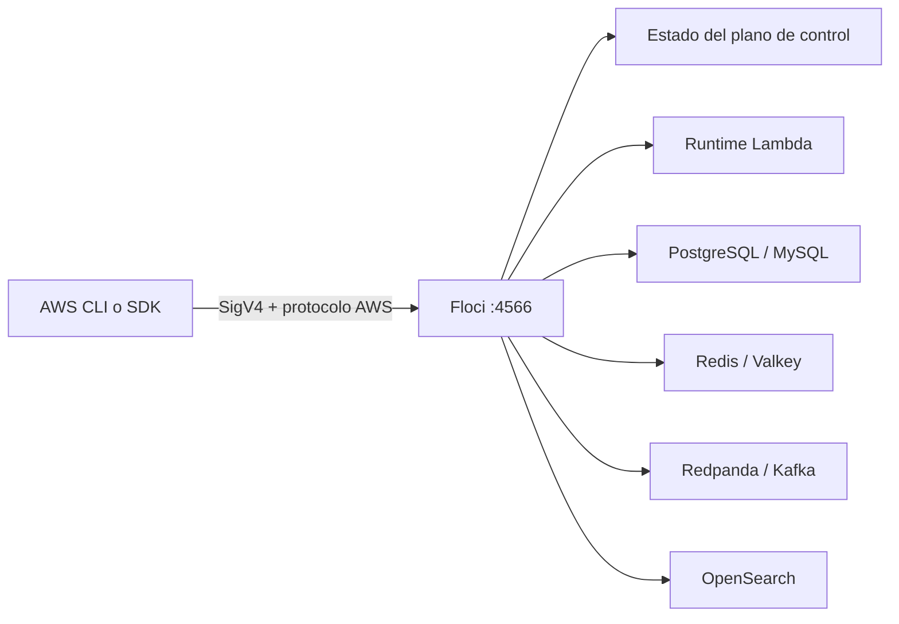
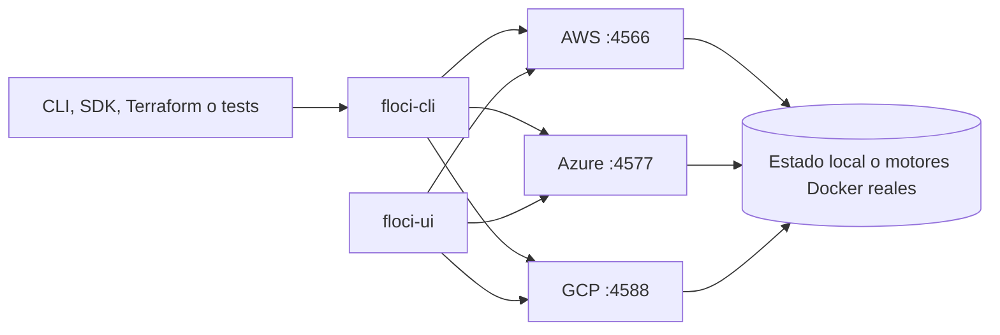
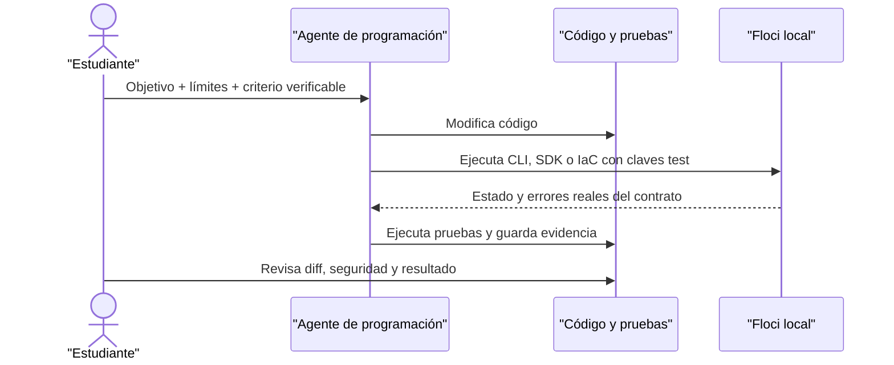
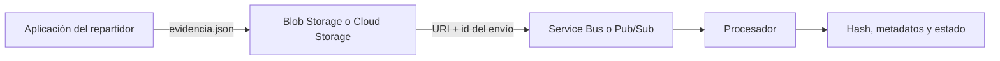

# Módulo 34: Floci oficial completo — plataforma, servicios y laboratorios

## Qué construirás y por qué importa

Crearás un laboratorio local multi-nube reproducible. Al terminar podrás instalar Floci desde cero, iniciar los tres proveedores, inspeccionarlos visualmente, conservar o aislar estado, ejecutar pruebas automatizadas y explicar con precisión qué valida el emulador y qué todavía debe comprobarse en una cuenta real.

Las fuentes principales son la [portada multi-nube](https://floci.io/), [Floci AWS](https://floci.io/aws/), [Floci Azure](https://floci.io/az/), [Floci GCP](https://floci.io/gcp/) y los [laboratorios 101](https://floci.io/labs/). También se consultan los repositorios mantenidos por `floci`, `floci-az`, `floci-gcp`, `floci-cli` y `floci-ui`. Esta lección no copia sus textos: reorganiza y explica sus capacidades en español con un recorrido educativo propio.


## Antes de empezar

- Docker debe responder a `docker version`.
- Debes reconocer una terminal y una variable de entorno.
- Crea `examples/tracks/cloud/floci-oficial/` para guardar comandos, resultados y errores.
- Nunca uses credenciales de producción. Los valores locales `test` no conceden acceso a AWS.

## Aprende construyendo

### Tema 1: Instalación en macOS, Linux y Windows

#### Paso 1 · Objetivo y preparación
Al finalizar instalarás el entorno desde cero. Prerrequisitos: Docker y terminal; verifica `docker --version`.
#### Paso 2 · Contexto y caso real
El mismo laboratorio debe funcionar en los tres sistemas.
#### Paso 3 · Teoría, modelo mental y analogía
Instalar es preparar herramientas y luego comprobar el diagnóstico, como revisar una estación antes de operar.
#### Paso 4 · Demostración guiada
Crea `examples/floci-oficial/install.js` y `install.md` desde una carpeta vacía.
```bash
mkdir ejemplo-floci-install
docker --version
```
Resultado esperado: Docker disponible.
#### Paso 5 · Práctica guiada
Pista: detén Docker para provocar un fallo deliberado, registra el mensaje y corrígelo.
#### Paso 6 · Práctica independiente
Repite en tu sistema y conserva captura y salida.
#### Paso 7 · Cierre y evidencia
Entrega comandos, salida, fallo y corrección; explica el resultado. Siguiente paso: modelo mental. Errores comunes: PATH, daemon detenido y credenciales reales. Fuente oficial: https://floci.io/.

**¿Por qué es importante?** Un entorno diagnosticable evita que diferencias del sistema operativo se confundan con fallos del servicio cloud.

#### macOS

Con Homebrew, ejecuta `brew install floci-io/floci/floci`. Si prefieres el instalador oficial, usa `curl -fsSL https://floci.io/install.sh | sh`. Comprueba el resultado con `floci --version` y `floci doctor`; instalar no basta: el diagnóstico demuestra que Docker, la CLI y la conectividad local funcionan juntos.

#### Instalación en Linux

Usa el mismo instalador oficial con `curl -fsSL https://floci.io/install.sh | sh`. Si el comando no aparece después, revisa la carpeta indicada por el instalador y tu variable `PATH`. Ejecuta `docker ps` antes de culpar a Floci: un daemon de Docker detenido es el fallo inicial más común.

#### Instalación en Windows

En PowerShell puedes ejecutar `iwr https://floci.io/install.ps1 | iex`. La alternativa administrada es Scoop: `scoop bucket add floci https://github.com/floci-io/scoop-floci` y luego `scoop install floci`. Comprueba con `floci doctor`; si Docker Desktop usa WSL 2, verifica que la integración esté activa para tu distribución.

**Practícalo tú:**

```bash
# archivo: src/labs/modulo-34/tema-1-diagnostico.sh — ejecutar con: bash tema-1-diagnostico.sh
docker version --format '{{.Server.Version}}'
floci --version
floci doctor
```

**Resultado esperado:** los tres comandos responden sin error, en cualquier sistema operativo: Docker reporta una versión de servidor, `floci --version` confirma la instalación, y `floci doctor` reporta que Docker, la CLI y la conectividad local funcionan juntos — el mismo diagnóstico sin importar si instalaste con Homebrew, el script curl o Scoop.

**Modifica esto:** detén Docker Desktop deliberadamente y vuelve a correr `floci doctor`; confirma que el diagnóstico señala explícitamente el problema (Docker no disponible) en vez de fallar con un error genérico.

**Cuándo no usarlo:** no saltes `floci doctor` asumiendo que "instalar" es sinónimo de "funciona"; diferencias sutiles de PATH o de integración WSL2 solo las detecta el diagnóstico, no la instalación en sí.

**Cómo crece tu proyecto:** este diagnóstico es el primer paso reproducible que cualquier persona nueva en el equipo ejecuta antes de tocar código.

### Tema 2: Modelo mental de la plataforma

#### Paso 1 · Objetivo y preparación
Al finalizar explicarás la plataforma desde cero. Prerrequisitos: Docker y terminal; verifica `docker --version`.
#### Paso 2 · Contexto y caso real
Comprender proveedores, endpoints y estado evita diagnósticos erróneos.
#### Paso 3 · Teoría, modelo mental y analogía
Floci es un aeropuerto local: APIs, servicios y panel visual comparten pista.
#### Paso 4 · Demostración guiada
Crea `examples/floci-oficial/model.js` y `model.md` desde una carpeta vacía.
```bash
mkdir ejemplo-floci-model
docker --version
```
Resultado esperado: Docker disponible.
#### Paso 5 · Práctica guiada
Pista: apunta al endpoint incorrecto para provocar un fallo deliberado y corrígelo.
#### Paso 6 · Práctica independiente
Dibuja proveedores, servicios y puertos.
#### Paso 7 · Cierre y evidencia
Entrega diagrama, salida, fallo y corrección; explica el resultado. Siguiente paso: CLI y SDK. Errores comunes: confundir API y UI. Fuente oficial: https://floci.io/.

**¿Por qué es importante?** Distinguir cliente, CLI, emulador y motor real permite saber qué componente observar cuando una operación falla.

`floci-cli` administra procesos; `floci`, `floci-az` y `floci-gcp` implementan APIs locales; `floci-ui` permite observar recursos; los SDK y CLI oficiales siguen siendo los clientes. Esa separación evita aprender comandos inventados: cambia el endpoint, no la forma de programar.

#### Simulación de API frente a motor real

Floci no ejecuta todos los servicios de la misma manera. En servicios de plano de control puede conservar estado y responder con el protocolo compatible; en servicios de datos complejos levanta motores reales dentro de Docker. Esta diferencia determina qué conclusión puedes extraer de una prueba. Un `CreateCluster` exitoso demuestra compatibilidad del contrato de control; una consulta Redis, SQL, Kafka u OpenSearch exitosa también recorre el protocolo de datos real.

| Servicio local | Motor o ejecución | Qué puedes comprobar | Qué debes volver a validar en AWS |
|---|---|---|---|
| Lambda | Runtime oficial aislado en Docker | Variables, payload, errores, warm pool e integraciones | Cuotas, red regional y concurrencia a escala |
| RDS | PostgreSQL, MySQL o MariaDB reales | SQL, JDBC, migraciones y autenticación compatible | Multi-AZ, backups administrados y rendimiento |
| ElastiCache | Redis/Valkey real tras proxy SigV4 | RESP, comandos, cliente y fallos de autenticación | Topología, failover y latencia de red |
| ECS y EC2 | Contenedores Docker reales | Ciclo de vida, imágenes, UserData, SSH e IMDS | Hipervisor, tipos de instancia y red VPC real |
| MSK | Redpanda compatible con Kafka | Productores, consumidores, grupos y offsets | Operación multi-broker y disponibilidad regional |
| OpenSearch | Nodos OpenSearch reales | Índices, consultas y clientes del protocolo | Dimensionamiento, snapshots y upgrades |
| ECR | Registry OCI real | `docker push`, `docker pull` e imágenes Lambda | Replicación, escaneo y políticas regionales |
| Athena | DuckDB como motor local | SQL, archivos y errores de esquema | Coste por bytes, catálogo distribuido y límites |



**Compruébalo sin aceptar la explicación a ciegas:** ejecuta `docker ps --format 'table {{.Names}}\t{{.Image}}'` antes y después de crear un recurso respaldado por un motor real. Debe aparecer un contenedor adicional para servicios como RDS, ElastiCache u OpenSearch. Luego elimina el recurso y observa su ciclo de vida. Si solo verificas la respuesta del comando `create-*`, todavía no has demostrado que el plano de datos funciona.

**Fallo deliberado:** detén manualmente el contenedor del motor y repite una operación de datos. La petición debe fallar aunque el recurso siga apareciendo en el plano de control. Diagnostica comparando `aws ... describe-*`, `docker ps -a` y `floci logs --follow`. Esta separación es la base para entender incidentes reales donde la API de administración responde, pero el motor de datos no está disponible.



Inicia AWS con `floci start`, Azure con `floci az start` y GCP con `floci gcp start`. Usa `eval $(floci env)`, `eval $(floci az env)` o `eval $(floci gcp env)` en shells compatibles. En PowerShell, canaliza la salida hacia `Invoke-Expression` según la guía oficial.

### Tema 3: AWS CLI y SDK, Azure CLI y SDK, GCP CLI y SDK

#### Paso 1 · Objetivo y preparación
Al finalizar ejecutarás comandos multi-nube desde cero. Prerrequisitos: Docker y Node.js; verifica `node --version`.
#### Paso 2 · Contexto y caso real
Un equipo necesita automatizar la misma operación con contratos distintos.
#### Paso 3 · Teoría, modelo mental y analogía
CLI es conversación; SDK es integración programática.
#### Paso 4 · Demostración guiada
Crea `examples/floci-oficial/cli-sdk.js` desde una carpeta vacía.
```bash
mkdir ejemplo-floci-cli
node --version
```
Resultado esperado: Node disponible.
#### Paso 5 · Práctica guiada
Pista: usa un perfil inexistente para provocar un fallo deliberado y corrígelo.
#### Paso 6 · Práctica independiente
Ejecuta una operación por proveedor y compara salida.
#### Paso 7 · Cierre y evidencia
Entrega comandos, salida, fallo y corrección; explica el resultado. Siguiente paso: ciclo de vida. Errores comunes: endpoint equivocado y perfiles mezclados. Fuente oficial: https://floci.io/aws/.

**¿Por qué es importante?** Usar clientes oficiales contra endpoints locales permite transferir el aprendizaje sin inventar una API educativa paralela.

AWS usa `AWS_ENDPOINT_URL=http://localhost:4566` y credenciales desechables. Azure exporta una cadena compatible con Azurite y endpoints específicos para Blob, App Configuration y Key Vault. GCP exporta hosts de emulador como `STORAGE_EMULATOR_HOST`, `PUBSUB_EMULATOR_HOST` y `FIRESTORE_EMULATOR_HOST` con un proyecto local.

Una variable mal aplicada suele producir dos errores opuestos: conexión rechazada si apunta al puerto equivocado, o una petición accidental a la nube real si el override no existe. Antes de ejecutar una operación destructiva, imprime el endpoint y confirma que contiene `localhost`.

**Practícalo tú:**

```bash
# archivo: src/labs/modulo-34/tema-3-tres-clis.sh — ejecutar con: bash tema-3-tres-clis.sh
eval "$(floci env)"
echo "AWS -> $AWS_ENDPOINT_URL"
eval "$(floci az env)"
echo "Azure -> $AZURE_STORAGE_CONNECTION_STRING" | grep -o 'BlobEndpoint=[^;]*'
eval "$(floci gcp env)"
echo "GCP storage -> $STORAGE_EMULATOR_HOST"
```

**Resultado esperado:** los tres `echo` muestran endpoints que contienen `localhost` con los puertos 4566, 4577 y 4588 respectivamente — la confirmación de que las tres CLIs oficiales (AWS, Azure, GCP) apuntan a Floci y no a la nube real.

**Modifica esto:** comenta la línea `eval "$(floci env)"` y repite el primer `echo`; confirma que `AWS_ENDPOINT_URL` queda vacío o apunta a un endpoint real — así reconoces el síntoma exacto de un override no aplicado.

**Cuándo no usarlo:** no ejecutes un comando destructivo (`delete-bucket`, `rm`) sin haber impreso y confirmado el endpoint primero; es el hábito de seguridad más simple de este módulo.

**Cómo crece tu proyecto:** este patrón de "imprime el endpoint antes de destruir nada" es el que protege los tres entornos cloud del proyecto (AWS, Azure, GCP) de una operación accidental contra una cuenta real.

### Tema 4: Configuración avanzada y ciclo de vida

#### Paso 1 · Objetivo y preparación
Al finalizar administrarás configuración desde cero. Prerrequisitos: Docker y terminal; verifica `docker --version`.
#### Paso 2 · Contexto y caso real
Estado persistente y estado efímero sirven para objetivos diferentes.
#### Paso 3 · Teoría, modelo mental y analogía
Configurar es decidir qué conserva la estación al apagarla.
#### Paso 4 · Demostración guiada
Crea `examples/floci-oficial/lifecycle.js` y `lifecycle.md` desde una carpeta vacía.
```bash
mkdir ejemplo-floci-lifecycle
docker --version
```
Resultado esperado: Docker disponible.
#### Paso 5 · Práctica guiada
Pista: conserva un estado incompatible para provocar un fallo deliberado y corrígelo.
#### Paso 6 · Práctica independiente
Prueba iniciar, reiniciar y limpiar.
#### Paso 7 · Cierre y evidencia
Entrega configuración, salida, fallo y corrección; explica el resultado. Siguiente paso: automatización. Errores comunes: datos accidentales y limpieza destructiva. Fuente oficial: https://floci.io/labs/.

**¿Por qué es importante?** Persistencia, aislamiento y hooks determinan si un laboratorio es reproducible o depende de estado manual oculto.

#### Puertos, Docker Compose y application.yml

Los puertos principales son 4566, 4577 y 4588. Azure también puede exponer AMQP para Event Hubs y Service Bus. Docker Compose permite fijar imagen, puertos, socket Docker, volúmenes y variables. `application.yml` ofrece configuración detallada del runtime; conserva en Git una plantilla sin secretos y documenta cada cambio respecto al valor predeterminado.

#### Persistencia y snapshots

`floci start --persist ./data` conserva estado entre reinicios. `floci snapshot save <nombre>` y `floci snapshot restore <nombre>` permiten guardar y recuperar un punto conocido. Persistencia sirve para desarrollo diario; una instancia limpia por suite es mejor para pruebas porque evita que un bucket o una cola anterior produzcan falsos positivos.

#### Aislamiento multi-account y aislamiento multi-project

AWS separa almacenamiento por identificador de cuenta; GCP hace lo propio por proyecto. Esto permite simular entornos o tenants sobre una instancia, pero no reemplaza controles reales de organización, cuotas o facturación. Una prueba correcta debe usar identificadores explícitos y demostrar que un contexto no puede ver el estado del otro.

#### TLS y HTTPS, Initialization hooks

TLS local permite recorrer código sensible al esquema HTTPS mediante un certificado autofirmado. El cliente debe confiar deliberadamente en ese certificado solo en desarrollo. Los Initialization hooks crean recursos al arrancar y convierten el entorno en reproducible; deben ser idempotentes para que un segundo inicio no falle ni duplique datos.

**Practícalo tú:**

```bash
# archivo: src/labs/modulo-34/tema-4-persistencia.sh — ejecutar con: bash tema-4-persistencia.sh
floci start --persist ./data
aws s3 mb s3://demo-persistente
floci snapshot save antes-de-reiniciar
floci stop && floci start --persist ./data
aws s3 ls | grep demo-persistente
```

**Resultado esperado:** tras detener y reiniciar Floci con el mismo directorio `--persist`, `aws s3 ls` sigue mostrando `demo-persistente` — el bucket sobrevivió al reinicio porque el estado quedó en disco, no solo en memoria.

**Modifica esto:** restaura el snapshot con `floci snapshot restore antes-de-reiniciar` después de crear un segundo bucket, y confirma que ese segundo bucket desaparece — el snapshot vuelve exactamente al punto guardado.

**Cuándo no usarlo:** no uses `--persist` para tu suite de pruebas automatizadas; ahí una instancia limpia por corrida es mejor, porque evita que un recurso de una corrida anterior produzca un falso positivo.

**Cómo crece tu proyecto:** la persistencia es la que usarías en tu entorno de desarrollo diario del proyecto; los snapshots te devuelven a un punto conocido antes de probar una migración riesgosa.

### Tema 5: Automatización, UI y agentes

#### Paso 1 · Objetivo y preparación
Al finalizar automatizarás y observarás el entorno desde cero. Prerrequisitos: Docker y Node.js; verifica `node --version`.
#### Paso 2 · Contexto y caso real
Una persona necesita feedback visual y comandos repetibles.
#### Paso 3 · Teoría, modelo mental y analogía
UI muestra estado; agente ejecuta acciones; script deja evidencia.
#### Paso 4 · Demostración guiada
Crea `examples/floci-oficial/automation.js` desde una carpeta vacía.
```bash
mkdir ejemplo-floci-ui
node --version
```
Resultado esperado: Node disponible.
#### Paso 5 · Práctica guiada
Pista: automatiza una acción inválida para provocar un fallo deliberado y corrígelo.
#### Paso 6 · Práctica independiente
Ejecuta un flujo por CLI y verifica en UI.
#### Paso 7 · Cierre y evidencia
Entrega script, captura, salida, fallo y corrección; explica el resultado. Siguiente paso: servicios AWS. Errores comunes: confiar solo en UI y no versionar scripts. Fuente oficial: https://floci.io/.

**¿Por qué es importante?** La interfaz ayuda a observar, pero la automatización demuestra que el resultado puede repetirse desde un entorno limpio.

Testcontainers inicia un Floci aislado alrededor de la suite. Hay integraciones oficiales para Testcontainers Java, Testcontainers Node.js, Testcontainers Python y Testcontainers Go. El test obtiene endpoint y credenciales del contenedor, crea sus propios recursos, verifica comportamiento y deja que el framework destruya el entorno.

`floci-ui` es la consola visual para recorrer buckets, tablas, colas, funciones y recursos de los tres proveedores. Úsala como instrumento de observación, no como sustituto de la automatización: cada acción importante debe poder repetirse mediante código, CLI o infraestructura como código.

Para CI efímero, inicia Floci dentro del job, ejecuta migraciones y pruebas, captura logs cuando algo falle y destruye todo al finalizar. Los agentes de IA sin credenciales reales pueden usar este mismo entorno: el radio de impacto queda limitado al contenedor local y no existe una factura cloud accidental. Aun así, revisa el código generado y restringe el acceso al socket Docker.

#### Construcción guiada: un entorno seguro para un agente de programación

El objetivo no es permitir que un agente “haga cualquier cosa”, sino darle un contrato verificable y un destino local. Crea `examples/tracks/cloud/agente-local/.env.example` con valores desechables; el archivo real `.env` no debe contener credenciales cloud ni publicarse en Git.

```dotenv
AWS_ENDPOINT_URL=http://localhost:4566
AWS_DEFAULT_REGION=us-east-1
AWS_ACCESS_KEY_ID=test
AWS_SECRET_ACCESS_KEY=test
```

El agente puede usar AWS CLI, un SDK, Terraform u OpenTofu sin una integración especial porque el contrato cambia mediante el endpoint. Antes de autorizar código generado, ejecuta esta comprobación desde una terminal nueva:

```bash
floci start
eval "$(floci env)"
test "$AWS_ENDPOINT_URL" = "http://localhost:4566"
aws s3 mb s3://agente-seguro
aws s3api head-bucket --bucket agente-seguro
```

La salida de `head-bucket` es vacía cuando termina correctamente; comprueba el código de salida con `echo $?`, que debe ser `0` en macOS o Linux. En PowerShell usa `floci env | Invoke-Expression`, ejecuta el mismo comando AWS y revisa `$LASTEXITCODE`. Esta evidencia vale más que una respuesta textual del agente porque demuestra que el recurso existe en el runtime.



**Fallo deliberado:** elimina `AWS_ENDPOINT_URL` en una terminal aislada y ejecuta `aws s3 ls` sin credenciales reales. Debe fallar; cancela si el cliente intenta contactar AWS. La solución no es proporcionar una clave productiva, sino restaurar el endpoint local con `eval "$(floci env)"`. Añade a tu instrucción para el agente una regla comprobable: “detente si el endpoint no contiene `localhost`”.

**Límite profesional:** las claves desechables reducen filtraciones y costes, pero montar `/var/run/docker.sock` entrega control significativo sobre Docker. En CI utiliza un runner aislado y efímero; no expongas el socket a código no confiable en una estación que ejecute cargas sensibles. Antes de producción repite pruebas de IAM, cuotas, latencia, regiones, disponibilidad y facturación en una cuenta real controlada.

### Tema 6: Servicios AWS incorporados en la documentación actual

#### Paso 1 · Objetivo y preparación
Al finalizar explorarás servicios AWS desde cero. Prerrequisitos: Docker y Node.js; verifica `node --version`.
#### Paso 2 · Contexto y caso real
El catálogo debe convertirse en pruebas pequeñas y observables.
#### Paso 3 · Teoría, modelo mental y analogía
Cada servicio es herramienta con contrato, límite y evidencia.
#### Paso 4 · Demostración guiada
Crea `examples/floci-oficial/aws-service.js` desde una carpeta vacía.
```bash
mkdir ejemplo-floci-aws
node --version
```
Resultado esperado: Node disponible.
#### Paso 5 · Práctica guiada
Pista: llama un servicio no soportado para provocar un fallo deliberado y documenta el límite.
#### Paso 6 · Práctica independiente
Prueba almacenamiento, cola y función.
#### Paso 7 · Cierre y evidencia
Entrega matriz, salida, fallo y corrección; explica el resultado. Siguiente paso: Azure. Errores comunes: asumir paridad total y no consultar fuentes. Fuente oficial: https://floci.io/aws/.

**¿Por qué es importante?** Relacionar cada servicio con un problema evita memorizar un catálogo sin comprender límites ni alternativas.

Los módulos anteriores explican los servicios principales. Esta tabla completa los que estaban solo implícitos o ausentes y explica para qué practicar cada uno.

| Servicio | Qué debes comprender y probar localmente |
|---|---|
| S3 Vectors | Almacenar y consultar vectores; mide dimensiones, filtros y diferencia frente a objetos S3 comunes. |
| RDS Data API | Ejecutar SQL mediante HTTP sin conexión persistente; valida parámetros y manejo de transacciones. |
| MemoryDB | Modelar una base compatible con Redis orientada a durabilidad y distinguirla de una caché. |
| Lightsail | Comprender el plano simplificado de cómputo, redes y recursos agrupados. |
| AWS Batch | Enviar trabajos, colas y definiciones; observa estados y reintentos del procesamiento por lotes. |
| Elastic Beanstalk | Relacionar aplicación, versión, entorno y configuración de plataforma. |
| API Gateway v2 | Construir APIs HTTP y WebSocket y compararlas con API Gateway REST. |
| AWS Cloud Map | Registrar servicios y descubrir instancias por nombre y atributos. |
| IoT Core | Practicar registro, políticas y mensajería de dispositivos sin conectar hardware real. |
| Amazon MQ | Explorar brokers y configuración de mensajería administrada. |
| WAF v2 | Definir ACL web y reglas; no asumir que una emulación de control equivale a protección perimetral real. |
| CloudWatch Metrics | Publicar, consultar y agregar métricas; enlaza dimensiones con una alarma verificable. |
| EMR | Modelar clústeres y pasos de procesamiento distribuido; verifica qué partes son plano de control local. |
| CodePipeline | Representar etapas, acciones y transiciones de entrega continua. |
| Cloud Control API | Gestionar recursos mediante una interfaz común y estudiar consistencia del modelo CRUD. |

El inventario completo también incluye S3, AWS Backup, Transfer Family, DynamoDB y Streams, ElastiCache, RDS, Neptune, DocumentDB, Lambda, EC2, Auto Scaling, ECS, ECR, EKS, ELB v2, Route 53, CloudFront, AppSync, SQS, SNS, Kinesis, EventBridge, Scheduler, Pipes, MSK, SES, IAM, STS, Cognito, KMS, Secrets Manager, ACM, CloudWatch Logs, AWS Config, CloudTrail, OpenSearch, Athena, Glue, Data Firehose, Bedrock Runtime, Textract, Transcribe, SSM Parameter Store, CloudFormation, Step Functions, AppConfig, CodeBuild, CodeDeploy, Resource Groups Tagging API, Cost Explorer, Pricing, CUR y BCM Data Exports.

**Practícalo tú:**

```bash
# archivo: src/labs/modulo-34/tema-6-servicio-nuevo.sh — ejecutar con: bash tema-6-servicio-nuevo.sh
aws batch create-compute-environment --compute-environment-name demo-batch \
  --type MANAGED --state ENABLED
aws batch describe-compute-environments --compute-environments demo-batch \
  --query 'computeEnvironments[0].state'
```

**Resultado esperado:** el entorno de cómputo de AWS Batch queda creado y `describe-compute-environments` confirma `ENABLED` — la misma disciplina de "crear y luego confirmar con describe" que ya aplicaste en Lambda, RDS y una docena de servicios más en este track.

**Modifica esto:** elige otro servicio de la tabla que no hayas probado (por ejemplo Cloud Map o CloudWatch Metrics) y repite el mismo patrón crear → describir con su comando equivalente.

**Cuándo no usarlo:** no asumas que todos los servicios de esta tabla tienen el mismo nivel de fidelidad que EC2 o RDS; revisa la documentación de cada uno para saber si es plano de control únicamente o motor real.

**Cómo crece tu proyecto:** este patrón exploratorio —crear, describir, entender qué se emula— es el mismo que usarías para evaluar si un servicio nuevo de esta tabla resuelve una necesidad futura del proyecto.

### Tema 7: Servicios Azure que completan el recorrido

#### Paso 1 · Objetivo y preparación
Al finalizar explorarás servicios Azure desde cero. Prerrequisitos: Docker y Node.js; verifica `node --version`.
#### Paso 2 · Contexto y caso real
Una solución multi-cloud debe reconocer equivalencias y diferencias.
#### Paso 3 · Teoría, modelo mental y analogía
Equivalencia funcional no significa misma API ni mismo coste.
#### Paso 4 · Demostración guiada
Crea `examples/floci-oficial/azure-service.js` desde una carpeta vacía.
```bash
mkdir ejemplo-floci-azure
node --version
```
Resultado esperado: Node disponible.
#### Paso 5 · Práctica guiada
Pista: usa recurso no disponible para provocar un fallo deliberado y corrígelo.
#### Paso 6 · Práctica independiente
Compara blob, queue y function.
#### Paso 7 · Cierre y evidencia
Entrega matriz, salida, fallo y corrección; explica el resultado. Siguiente paso: GCP. Errores comunes: traducir nombres literalmente y omitir límites. Fuente oficial: https://floci.io/az/.

**¿Por qué es importante?** Comparar recursos Azure por plano de control y motor de datos evita asumir una fidelidad local que no existe.

| Servicio | Qué debes comprender y probar localmente |
|---|---|
| Azure Resource Manager | Crear recursos mediante el plano de control y comprender proveedor, tipo, grupo y suscripción. |
| Microsoft Entra ID | Recorrer OAuth2, OIDC y JWKS; separar autenticación de autorización del recurso. |
| Azure SQL Database | Gestionar el recurso y diferenciar plano ARM de conexiones SQL reales. |
| Azure Database for PostgreSQL | Practicar ciclo de vida y acceso PostgreSQL con configuración reproducible. |
| Azure Kubernetes Service | Crear el control plane local y operar workloads con kubectl sobre k3s cuando aplique. |
| Virtual Network | Modelar espacios de direcciones, subredes y límites de confianza. |
| Virtual Machines | Gestionar ciclo de vida y distinguir metadatos simulados de virtualización cloud real. |
| Azure Container Registry | Subir y descargar imágenes OCI y conectarlas con el despliegue de contenedores. |
| Communication Services Email | Preparar remitentes, mensajes y estados de entrega sin confundir aceptación con recepción final. |
| Managed Identity | Obtener tokens sin secretos estáticos y relacionar la identidad con permisos mínimos. |

Estos se suman a Blob Storage, Queue Storage, Table Storage, Azure Functions, App Configuration, Key Vault, Event Hubs, Service Bus, Cosmos DB, API Management, Azure Cache for Redis, Event Grid y Azure Monitor.

#### Construcción Azure: conserva una evidencia en Blob Storage

Inicia el proveedor con `floci az start` y carga las variables con `eval "$(floci az env)"`. En PowerShell usa `floci az env | Invoke-Expression`. La variable esencial es `AZURE_STORAGE_CONNECTION_STRING`: reúne cuenta, clave local y endpoints de Blob, Queue y Table. No la reemplaces con una cadena de producción.

```bash
mkdir -p examples/tracks/cloud/azure-blob
cd examples/tracks/cloud/azure-blob
printf '{"envio":"RF-101","estado":"recibido"}\n' > evidencia.json
az storage container create --name evidencias --connection-string "$AZURE_STORAGE_CONNECTION_STRING"
az storage blob upload --container-name evidencias --name RF-101.json --file evidencia.json --connection-string "$AZURE_STORAGE_CONNECTION_STRING"
az storage blob download --container-name evidencias --name RF-101.json --file recuperada.json --connection-string "$AZURE_STORAGE_CONNECTION_STRING"
cmp evidencia.json recuperada.json
```

`container create` debe devolver JSON con `created: true`; la carga debe informar que terminó y `cmp` no imprime nada cuando ambos archivos son idénticos. Comprueba además el blob en Floci UI. Si aparece `Connection refused`, ejecuta `floci az status` y `floci az doctor`; si el cliente intenta autenticar contra Azure remoto, imprime la cadena y confirma que contiene `localhost:4577`.

**Modificación:** añade metadatos `tipo=evidencia` y `guia=RF-101`, vuelve a cargar el blob y recupéralos con `az storage blob metadata show`. Esto conecta el ejercicio con el patrón real: el objeto guarda el archivo; la base de datos conserva el estado transaccional de la entrega.

### Tema 8: Servicios GCP que completan el recorrido

#### Paso 1 · Objetivo y preparación
Al finalizar explorarás servicios GCP desde cero. Prerrequisitos: Docker y Node.js; verifica `node --version`.
#### Paso 2 · Contexto y caso real
Los eventos y documentos requieren contratos distintos.
#### Paso 3 · Teoría, modelo mental y analogía
Bucket, topic y colección son almacén, altavoz y archivo.
#### Paso 4 · Demostración guiada
Crea `examples/floci-oficial/gcp-service.js` desde una carpeta vacía.
```bash
mkdir ejemplo-floci-gcp
node --version
```
Resultado esperado: Node disponible.
#### Paso 5 · Práctica guiada
Pista: publica en topic inexistente para provocar un fallo deliberado y corrígelo.
#### Paso 6 · Práctica independiente
Compara storage, pub/sub y function.
#### Paso 7 · Cierre y evidencia
Entrega matriz, salida, fallo y corrección; explica el resultado. Siguiente paso: laboratorios. Errores comunes: confundir documento con tabla. Fuente oficial: https://floci.io/gcp/.

**¿Por qué es importante?** Los hosts de emulador y proyectos explícitos impiden enviar pruebas por accidente a recursos remotos.

| Servicio | Qué debes comprender y probar localmente |
|---|---|
| Cloud Logging | Escribir y consultar entradas estructuradas con recurso, severidad y etiquetas. |
| Cloud KMS | Crear claves y versiones; diferencia cifrado local de custodia real de hardware. |
| Cloud SQL for PostgreSQL | Gestionar instancia y conectividad PostgreSQL sin asumir paridad de operación regional. |
| Cloud Scheduler | Programar invocaciones, revisar expresiones y probar reintentos de destinos fallidos. |
| Service Usage | Habilitar servicios y seguir operaciones de larga duración antes de usarlos. |
| Resource Manager | Organizar proyectos y metadatos; relacionar jerarquía con aislamiento. |
| Operations API | Consultar operaciones asíncronas y manejar estados pendiente, completado y error. |
| Eventarc | Enrutar eventos hacia destinos mediante filtros y contratos explícitos. |

También forman parte del catálogo Cloud Storage, Pub/Sub, Firestore, Datastore, Secret Manager, IAM, Managed Kafka, GKE, Cloud Run, Cloud Functions, Cloud Tasks, Cloud Monitoring, Firebase Auth y BigQuery.

#### Construcción GCP: archivo y evento con un proyecto local explícito

Ejecuta `floci gcp start` y después `eval "$(floci gcp env)"`; en PowerShell canaliza la salida a `Invoke-Expression`. Los SDK de GCP no comparten una única variable: Storage, Pub/Sub, Firestore y otros clientes leen hosts de emulador diferentes. `CLOUDSDK_CORE_PROJECT=floci-local` identifica el espacio local; no necesitas descargar un JSON de cuenta de servicio.

```bash
mkdir -p examples/tracks/cloud/gcp-storage
cd examples/tracks/cloud/gcp-storage
printf '{"envio":"RF-102","estado":"en-ruta"}\n' > evento.json
gcloud storage buckets create gs://demo-local
gcloud storage cp evento.json gs://demo-local/eventos/RF-102.json
gcloud storage ls gs://demo-local/eventos/
gcloud storage cp gs://demo-local/eventos/RF-102.json recuperado.json
cmp evento.json recuperado.json
```

El listado debe mostrar `gs://demo-local/eventos/RF-102.json` y `cmp` debe terminar con código `0`. Si `gcloud` solicita iniciar sesión, detente: faltan los overrides locales. Ejecuta `floci gcp env --service gcs,pubsub`, aplica la salida y confirma que el endpoint de Storage contiene `localhost:4588`.

**Modificación:** publica un mensaje Pub/Sub que contenga solamente la URI del objeto, no el archivo completo. Un consumidor debe descargar la evidencia usando esa URI y confirmar el mismo contenido. Así practicas un patrón real: almacenamiento para cargas grandes y mensajería para notificar que están disponibles.



### Tema 9: Laboratorios oficiales reconstruidos en español

#### Paso 1 · Objetivo y preparación
Al finalizar completarás un laboratorio desde cero. Prerrequisitos: Docker y terminal; verifica `docker --version`.
#### Paso 2 · Contexto y caso real
Un laboratorio debe producir evidencia, no solo una pantalla verde.
#### Paso 3 · Teoría, modelo mental y analogía
Cada laboratorio es experimento con hipótesis, pasos y resultado.
#### Paso 4 · Demostración guiada
Crea `examples/floci-oficial/lab.js` y `lab.md` desde una carpeta vacía.
```bash
mkdir ejemplo-floci-lab
docker --version
```
Resultado esperado: Docker disponible.
#### Paso 5 · Práctica guiada
Pista: omite un prerrequisito para provocar un fallo deliberado y corrígelo.
#### Paso 6 · Práctica independiente
Repite el laboratorio y documenta diferencias.
#### Paso 7 · Cierre y evidencia
Entrega bitácora, salida, fallo y corrección; explica el resultado. Siguiente paso: límites. Errores comunes: copiar comandos sin observar y no guardar logs. Fuente oficial: https://floci.io/labs/.

**¿Por qué es importante?** Un laboratorio guiado convierte documentación de referencia en predicción, ejecución, fallo y evidencia verificable.

#### AWS S3 Buckets 101

Crea un bucket, sube y descarga un objeto, configura una política y genera una URL prefirmada. Predice qué operación debe fallar antes de aplicar la política. Evidencia: comandos, respuesta, objeto recuperado y explicación de por qué una URL expirada deja de funcionar.

#### Athena y S3 101

Guarda datos en S3, registra catálogo y tabla en Glue y consulta con Athena. La ejecución local usa un motor real basado en DuckDB. Evidencia: archivo fuente, definición de tabla, consulta agregada y resultado verificable; provoca además un error de esquema y diagnostícalo.

#### Azure Blob Storage 101

Crea un contenedor, carga y descarga un blob y genera un SAS con permisos y vencimiento mínimos. Evidencia: hash del archivo original y recuperado, intento sin autorización y explicación de alcance temporal del SAS.

#### EC2 Ports In-Flight 101

Inicia una instancia local, abre y cierra puertos mientras corre y observa los sidecars `socat` que aparecen y desaparecen. Evidencia: `docker ps`, petición exitosa con el puerto abierto, fallo esperado al cerrarlo y explicación de la diferencia frente a publicar puertos solo al crear un contenedor.

**Practícalo tú:**

```bash
# archivo: src/labs/modulo-34/tema-9-s3-101.sh — ejecutar con: bash tema-9-s3-101.sh
aws s3 mb s3://demo-101
echo "manifiesto de prueba" > manifiesto.txt
aws s3 cp manifiesto.txt s3://demo-101/
URL=$(aws s3 presign s3://demo-101/manifiesto.txt --expires-in 30)
curl -s -o /dev/null -w "%{http_code}\n" "$URL"
sleep 31
curl -s -o /dev/null -w "%{http_code}\n" "$URL"
```

**Resultado esperado:** la primera petición con la URL prefirmada devuelve `200`; tras esperar más de los 30 segundos de vigencia, la segunda devuelve un código de error (`403`) — la evidencia verificable de por qué una URL expirada deja de funcionar, tal como pide este laboratorio oficial.

**Modifica esto:** repite el ejercicio con `--expires-in 300` y confirma que la segunda petición, hecha antes de los 5 minutos, sigue devolviendo `200`.

**Cuándo no usarlo:** no reutilices una URL prefirmada de corta duración para un flujo que tarda más que su vigencia; genera una nueva o usa una vigencia acorde al caso de uso real.

**Cómo crece tu proyecto:** este es exactamente el mecanismo que El proyecto usa para compartir temporalmente un comprobante de entrega con un cliente sin exponer el bucket completo.

### Tema 10: Límites y transferencia a producción

#### Paso 1 · Objetivo y preparación
Al finalizar podrás decidir qué validar en producción desde cero. Prerrequisitos: Docker y Node.js; verifica `node --version`.
#### Paso 2 · Contexto y caso real
Un emulador acelera desarrollo, pero no prueba cuotas, latencia ni facturación reales.
#### Paso 3 · Teoría, modelo mental y analogía
El emulador es simulador; producción es carretera con tráfico y coste.
#### Paso 4 · Demostración guiada
Crea `examples/floci-oficial/production-boundaries.js` y `production-boundaries.md` desde una carpeta vacía.
```bash
mkdir ejemplo-floci-limits
node --version
```
Resultado esperado: Node disponible.
#### Paso 5 · Práctica guiada
Pista: afirma paridad total para provocar un fallo deliberado de diseño y corrígelo.
#### Paso 6 · Práctica independiente
Construye matriz local/real y criterios de promoción.
#### Paso 7 · Cierre y evidencia
Entrega matriz, salida, fallo y corrección; explica el resultado. Siguiente paso: validación real. Errores comunes: usar datos reales en local y no probar IAM, cuotas o recuperación. Fuente oficial: https://floci.io/.

**¿Por qué es importante?** Reconocer qué no reproduce el entorno local evita trasladar conclusiones falsas sobre seguridad, escala, coste o disponibilidad.

Compatibilidad de API significa que clientes y formatos se comportan como espera el SDK; no significa que latencia regional, cuotas, IAM organizacional, facturación, hardware administrado, disponibilidad multi-zona y fallos del proveedor estén reproducidos completamente. Antes de producción ejecuta un conjunto pequeño de pruebas contractuales en la nube real, revisa seguridad y costes, y documenta cualquier diferencia.

**Practícalo tú:**

```bash
# archivo: src/labs/modulo-34/tema-10-matriz-de-limites.sh — ejecutar con: bash tema-10-matriz-de-limites.sh
cat <<'EOF' > matriz-limites.md
| Capacidad | Validado localmente | Requiere nube real | Riesgo si se omite |
|---|---|---|---|
| Contrato SDK/CLI de S3 | Sí | No | Bajo |
| Latencia multi-región | No | Sí | Medio |
| IAM organizacional y SCPs | No | Sí | Alto |
| Facturación real | No | Sí | Alto |
EOF
cat matriz-limites.md
```

**Resultado esperado:** el archivo `matriz-limites.md` queda escrito y muestra la tabla — el mismo tipo de matriz "validado localmente / requiere nube real / riesgo si se omite" que pide la Construcción final de este módulo.

**Modifica esto:** añade una fila por cada servicio que hayas usado en los módulos 21-30 de este track, clasificando honestamente qué validaste en Floci y qué te falta confirmar contra AWS, Azure o GCP real.

**Cuándo no usarlo:** no publiques esta matriz una sola vez y la abandones; actualízala cada vez que agregues un servicio nuevo al proyecto, o dejará de reflejar el riesgo real.

**Cómo crece tu proyecto:** esta matriz es exactamente el documento que el equipo revisaría antes de decidir qué probar contra una cuenta real antes de un primer despliegue a producción.

## Construcción final multi-nube

1. Levanta los tres proveedores y registra sus health checks.
2. Demuestra persistencia, snapshot y restauración.
3. Demuestra aislamiento entre dos cuentas o proyectos.
4. Ejecuta uno de los cuatro laboratorios sin copiar los comandos finales.
5. Automatiza el laboratorio con Testcontainers o CI efímero.
6. Inspecciona el resultado en floci-ui.
7. Escribe una matriz: “validado localmente”, “requiere nube real”, “riesgo si se omite”.

**Verificación:** los health checks de AWS, Azure y GCP responden; un recurso sobrevive al reinicio y se recupera desde snapshot; dos cuentas o proyectos no pueden leer recursos ajenos; el laboratorio automatizado pasa desde un entorno limpio; y floci-ui refleja el estado creado por CLI o SDK. Adjunta comandos, identificadores ficticios, salida de pruebas y la matriz de límites locales frente a nube real.


## Criterio para avanzar

No marques este capítulo como completado hasta que otra persona pueda clonar tu carpeta, ejecutar una sola guía y obtener la misma evidencia sin preguntarte dónde colocar archivos, qué variables exportar o cómo reconocer el resultado correcto.
