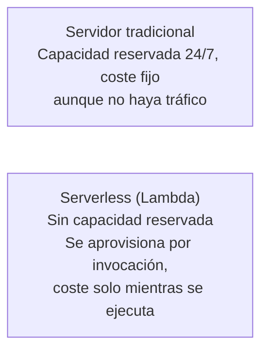

# Módulo 5: Serverless con Lambda


## Aprende construyendo

### Tema 1: Qué es serverless — ventajas y desventajas

#### Paso 1 · Objetivo y preparación
Al finalizar vas a desplegar la función `confirmar-entrega` del proyecto integrador RutaFlow y a medir con números reales la diferencia entre su primera invocación y las siguientes. Prerrequisitos: Módulo 1 (`floci start`, `eval $(floci env)`).
#### Paso 2 · Contexto y caso real
Hoy el proyecto integrador RutaFlow tendría que mantener un worker encendido 24/7 solo para esperar mensajes esporádicos de la cola `DeliveryCommands` (Módulo 3). La función `confirmar-entrega` serverless reemplaza ese worker por una función que solo existe mientras procesa un mensaje, ahorrando costo y complejidad.
#### Paso 3 · Teoría, modelo mental y analogía
Serverless es contratar capacidad por evento; la analogía es una cocina que se abre solo cuando llega una orden, y se cierra apenas la entrega.
#### Paso 4 · Demostración guiada
```bash
mkdir -p confirmar-entrega && cd confirmar-entrega
echo 'exports.handler = async () => ({ mensaje: "ok" });' > index.js
zip funcion.zip index.js
aws lambda create-function --function-name confirmar-entrega --runtime nodejs20.x \
  --handler index.handler --zip-file fileb://funcion.zip \
  --role arn:aws:iam::000000000000:role/lambda-role
time aws lambda invoke --function-name confirmar-entrega salida1.json
time aws lambda invoke --function-name confirmar-entrega salida2.json
```
Resultado esperado: el primer `invoke` (cold start, entorno nuevo) tarda notablemente más en `real` que el segundo (entorno reutilizado, todavía "caliente"); ambos `salida*.json` contienen `{"mensaje":"ok"}`.
#### Paso 5 · Práctica guiada
Pista: subí un `funcion.zip` vacío (`zip funcion-vacio.zip` sin agregar `index.js`) e intentá `create-function` con ese zip — ese es el fallo deliberado: la invocación falla con `Runtime.HandlerNotFound: index.handler is undefined or not exported`, porque el zip no contiene ningún archivo `index.js`.
#### Paso 6 · Práctica independiente
Invocá `confirmar-entrega` tres veces seguidas y cronometrá cada una con `time`; confirmá que, a partir de la segunda, los tiempos son consistentemente más bajos que el primero.
#### Paso 7 · Cierre y evidencia
Entregá los tiempos de las tres invocaciones y el error del zip vacío del Paso 5; explicá cuál invocación fue el cold start y por qué. Siguiente paso: la estructura del handler. Errores comunes: asumir estado persistente y ocultar errores. Fuente oficial: https://docs.aws.amazon.com/lambda/latest/dg/welcome.html.
**Conceptos clave:** serverless, aprovisionamiente bajo demanda, pago por uso, cold start, sin gestión de servidores.

Serverless no significa que no haya servidores físicos ejecutando tu código —evidentemente los hay—, sino que tú, como desarrollador, no eres responsable de aprovisionarlos, parchearlos, escalarlos ni gestionarlos. Con Lambda, subes tu código (una función), y el proveedor de nube se encarga de todo lo demás: cuándo y dónde ejecutar esa función, cuántas instancias paralelas levantar si llegan muchas peticiones simultáneas, y cuándo apagar esos recursos cuando ya no hay peticiones que atender. Tú no eliges un tamaño de servidor ni decides cuántos servidores necesitas: describes qué debe ejecutarse, y el proveedor decide el resto de la infraestructura subyacente automáticamente.

Esto contrasta directamente con el modelo tradicional (incluso el basado en contenedores gestionados manualmente, como verás en el módulo avanzado de ECS/ECR), donde normalmente reservas capacidad de cómputo de antemano —una cantidad fija de CPU y memoria— que existe y potencialmente genera coste incluso cuando no hay tráfico. Lambda, en cambio, cobra (en una cuenta real) por el número de invocaciones y por el tiempo de ejecución real de cada una, medido en fracciones de segundo; si tu función no se invoca nunca en un periodo, no genera ningún coste de cómputo en ese periodo.

La ventaja más citada de serverless es justamente esa: no pagas por capacidad ociosa, y escalas automáticamente desde cero hasta miles de ejecuciones simultáneas sin ninguna configuración manual de autoescalado. La velocidad de desarrollo también mejora, porque eliminas por completo la gestión de infraestructura (parches de sistema operativo, actualizaciones de runtime, configuración de balanceadores de carga) del código que escribes: te concentras únicamente en la lógica de negocio de la función.

La desventaja más relevante es el "cold start": cuando una función Lambda no se ha invocado recientemente, la primera invocación después de ese periodo de inactividad puede tardar notablemente más (el proveedor necesita aprovisionar un nuevo entorno de ejecución desde cero), mientras que invocaciones sucesivas y cercanas en el tiempo reutilizan un entorno ya "caliente" y responden mucho más rápido. Otras limitaciones incluyen un tiempo máximo de ejecución por invocación (15 minutos en AWS Lambda real), lo que hace inadecuado a Lambda para tareas de procesamiento muy largas o continuas, y la imposibilidad de mantener estado en memoria de forma confiable entre invocaciones distintas, un tema que retomas en detalle en el Tema 2.

**Analogía:** un servidor tradicional es como alquilar un local comercial propio, con su alquiler fijo mensual sin importar cuántos clientes entren ese día. Serverless es como un puesto de venta ambulante que solo aparece exactamente cuando un cliente lo necesita, y del que solo pagas el tiempo real de cada venta individual, sin ningún coste cuando no hay clientes. El "cold start" sería el tiempo que tarda el vendedor en montar el puesto la primera vez que aparece tras un rato sin actividad, comparado con lo rápido que atiende al siguiente cliente si ya está montado y siguen llegando clientes seguidos.

**¿Por qué es importante?** Serverless se ha convertido en el enfoque por defecto para una enorme cantidad de cargas de trabajo modernas —procesamiento de eventos, APIs con tráfico variable, tareas programadas, procesamiento en respuesta a cambios en almacenamiento o bases de datos— precisamente porque elimina la gestión operativa de servidores y alinea el coste directamente con el uso real. Entender también sus limitaciones (cold start, tiempo máximo de ejecución, ausencia de estado) es igual de importante para no aplicarlo a casos de uso donde no encaja bien, como procesos de larga duración continua.

**¿Cómo optimizar cold start en la práctica?**

En RutaFlow, el cold start de `confirmar-entrega` es ~1.5s (aceptable para eventos de cola, donde nadie espera respuesta inmediata). Pero si fuera una integración con API Gateway donde usuarios finales esperan, necesitarías reducirlo:

1. **Runtime:** Go (~100ms cold start) < Node.js (~500ms) < Python (~800ms) < Java (~3s)
2. **Tamaño de zip:** Cada MB extra suma. En este tema: index.js (1KB) + @aws-sdk (3MB) = cold start de 1.5s
3. **Memoria:** Más memoria = CPU proporcional más rápido = cold start más rápido (ej. 3008MB vs 128MB)
4. **Lambda Layers:** Separar dependencias comunes de código específico (avanzado)
5. **SnapStart (Java):** Guardar snapshot de JVM inicializada (solo Java, evita cold start)

**Decisión de RutaFlow:** Serverless + Node.js es lo correcto porque:
- Eventos de cola asíncrona (cold start de 1.5s es invisible al usuario)
- Escala automáticamente sin gestión (importante para entregas esporádicas)
- Costo: pago solo por invocación (sin servidor 24/7)

Si fuera una "API de confirmación interactiva en tiempo real" (usuario final esperando), cambiaríamos a Go o usaríamos provisioned concurrency (mantiene entornos "calientes").

**Diagrama:**



### Tema 2: Estructura de una función Lambda

#### Paso 1 · Objetivo y preparación
Al finalizar vas a hacer que `confirmar-entrega` reciba y valide un comando real de entrega, con la misma forma que usa `examples/rutaflow/node/confirm-delivery.ts`. Prerrequisitos: Tema 1 de este módulo.
#### Paso 2 · Contexto y caso real
Un comando real de `DeliveryCommands` (Módulo 3) del proyecto integrador RutaFlow trae `shipmentId` y `recipientPin` (el PIN de 6 dígitos que el destinatario confirma al recibir). El handler necesita leer eso de `event`, no inventarlo — debe seguir el contrato exacto que RutaFlow define.
#### Paso 3 · Teoría, modelo mental y analogía
`event` es el pedido que llega; `context` es el reloj y los límites del turno; el valor de retorno es el comprobante que se entrega de vuelta.
#### Paso 4 · Demostración guiada
```bash
cat > index.js <<'EOF'
exports.handler = async (event) => {
  if (!event.shipmentId || !/^\d{6}$/.test(event.recipientPin)) {
    throw new TypeError('comando de entrega inválido');
  }
  return { shipmentId: event.shipmentId, status: 'delivered' };
};
EOF
zip funcion.zip index.js
aws lambda update-function-code --function-name confirmar-entrega --zip-file fileb://funcion.zip
aws lambda invoke --function-name confirmar-entrega --payload '{"shipmentId":"env-4471","recipientPin":"837201"}' \
  --cli-binary-format raw-in-base64-out salida.json && cat salida.json
```
Resultado esperado: `salida.json` contiene `{"shipmentId":"env-4471","status":"delivered"}` — exactamente el mismo contrato que devuelve `confirmDelivery` en `confirm-delivery.ts`, ahora corriendo dentro de un handler Lambda real.
#### Paso 5 · Práctica guiada
Pista: invocá con `recipientPin` de solo 4 dígitos (`"1234"`) para provocar el fallo deliberado — `salida.json` no va a tener `shipmentId`, va a tener `errorMessage` y `errorType: "TypeError"`, la misma validación que ya existe en el código TypeScript de RutaFlow.
#### Paso 6 · Práctica independiente
Invocá sin `shipmentId` en el payload y confirmá que también falla, con un `errorMessage` distinto al del Paso 5 — las dos validaciones del `if` son independientes.
#### Paso 7 · Cierre y evidencia
Entregá la invocación exitosa, el error de PIN corto y el error de `shipmentId` ausente; explicá qué parte de `event` corresponde a cada validación. Siguiente paso: runtimes. Errores comunes: depender de memoria global y no validar event. Fuente oficial: https://docs.aws.amazon.com/lambda/latest/dg/nodejs-handler.html.

#### Paso 8 · Verificación: Pruebas unitarias

En producción, confiar solo en invocaciones manuales es riesgoso. RutaFlow usa pruebas automatizadas para verificar que el handler siempre cumple su contrato. Aquí está el patrón:

```bash
npm init -y
npm install --save-dev jest

cat > index.test.js <<'EOF'
const { handler } = require('./index');

describe('confirmar-entrega handler', () => {
  test('acepta shipmentId + PIN válido de 6 dígitos', async () => {
    const result = await handler({
      shipmentId: 'env-4471',
      recipientPin: '837201'
    });
    expect(result.shipmentId).toBe('env-4471');
    expect(result.status).toBe('delivered');
  });

  test('rechaza PIN corto (< 6 dígitos)', async () => {
    const promise = handler({
      shipmentId: 'env-4471',
      recipientPin: '1234'
    });
    await expect(promise).rejects.toThrow('comando de entrega inválido');
  });

  test('rechaza shipmentId faltante', async () => {
    const promise = handler({
      recipientPin: '837201'
    });
    await expect(promise).rejects.toThrow('comando de entrega inválido');
  });

  test('rechaza PIN no-numérico', async () => {
    const promise = handler({
      shipmentId: 'env-4471',
      recipientPin: 'abcdef'
    });
    await expect(promise).rejects.toThrow('comando de entrega inválido');
  });
});
EOF

# Ejecuta las pruebas
npm test

# Resultado esperado:
# PASS  ./index.test.js
#   confirmar-entrega handler
#     ✓ acepta shipmentId + PIN válido de 6 dígitos (5ms)
#     ✓ rechaza PIN corto (2ms)
#     ✓ rechaza shipmentId faltante (1ms)
#     ✓ rechaza PIN no-numérico (1ms)
# 
# Test Suites: 1 passed, 1 total
# Tests:       4 passed, 4 total
```

**¿Por qué importa?** Las pruebas unitarias te dan confianza para deployar en producción sin miedo. Una suite de pruebas es tu red de seguridad: si una refactorización rompe algo, lo sabrás inmediatamente, no en producción.
**Conceptos clave:** handler, `event`, `context`, valor de retorno, statelessness.

Toda función Lambda tiene un punto de entrada llamado handler: una función específica dentro de tu código que el runtime de Lambda invoca cada vez que llega un evento. En Node.js, por convención, esto se escribe como `exports.handler = async (event, context) => { ... }`; en Python, como `def handler(event, context): ...`. El nombre exacto del archivo y de la función handler se especifica al desplegar la función (por ejemplo, `index.handler` significa "la función `handler` exportada desde el archivo `index.js`"), y Lambda usa esa referencia para saber qué código ejecutar cuando llega una invocación.

El primer parámetro, `event`, contiene los datos de entrada de esa invocación específica, en formato JSON. La estructura exacta de `event` varía según qué disparó la invocación: si la función se invoca directamente (como harás en el laboratorio de este módulo), `event` es exactamente el JSON que tú pasaste al invocarla; si la dispara S3 al subirse un archivo, `event` contiene información sobre el bucket y la clave del objeto subido; si la dispara API Gateway, `event` contiene los detalles completos de la petición HTTP (método, cabeceras, cuerpo, parámetros de ruta). Entender que `event` cambia de forma según el origen de la invocación es clave para escribir funciones que procesen correctamente ese contenido.

El segundo parámetro, `context`, proporciona metadatos sobre la propia invocación y el entorno de ejecución: cuánto tiempo de ejecución queda antes del timeout configurado, el ID de la solicitud (útil para correlacionar logs), el nombre y la versión de la función, entre otros datos operativos. A diferencia de `event`, que trae los datos del negocio, `context` trae datos sobre la ejecución en sí misma.

Una propiedad fundamental de cualquier función Lambda, mencionada ya en el tema anterior, es que debe diseñarse sin estado (stateless): no debe depender de que una variable en memoria conserve su valor entre invocaciones distintas, porque Lambda puede (y de hecho lo hace con frecuencia) crear un entorno de ejecución completamente nuevo para invocaciones distintas, especialmente si hay varias invocaciones simultáneas o si ha pasado tiempo desde la última. Cualquier dato que necesite persistir entre invocaciones debe guardarse explícitamente en un servicio externo diseñado para eso —DynamoDB, S3, o cualquier otro almacenamiento duradero— y no en una variable local de la función.

**Analogía:** una función Lambda es como un empleado temporal que contratas para una tarea específica, sin memoria de tareas anteriores: le das las instrucciones completas de qué hacer ahora (el `event`), te informa sobre las condiciones de su turno de trabajo actual (el `context`, como cuánto tiempo le queda de turno), y hace su trabajo sin recordar nada de la vez anterior que lo contrataste, aunque hubiera sido hace apenas un minuto. Si necesitas que recuerde algo de una tarea anterior, tienes que escribirlo en un lugar externo (un archivo, un tablero compartido) que él pueda consultar cada vez, no depender de su memoria personal.

**¿Por qué es importante?** Malinterpretar el ciclo de vida de una función Lambda —asumiendo, por ejemplo, que una variable global va a mantener su valor de forma confiable entre invocaciones— es una fuente común de bugs difíciles de reproducir, porque a veces sí parece "funcionar" (cuando Lambda reutiliza el mismo entorno de ejecución "caliente" entre invocaciones cercanas) y otras veces falla de forma aparentemente aleatoria (cuando Lambda crea un entorno nuevo). Diseñar explícitamente para statelessness desde el principio evita depender de ese comportamiento no garantizado.

**¿Dónde debuguear un error de Lambda en producción?**

Cuando tu función falla, el error NO aparece solo en el archivo de salida (`salida.json`). También se registra en:

1. **CloudWatch Logs:** `aws logs tail /aws/lambda/confirmar-entrega --follow` (terminal, en tiempo real)
2. **AWS Console:** CloudWatch → Log Groups → `/aws/lambda/confirmar-entrega`
3. **Respuesta de invoke:** si es un error, aparece `errorType` + `errorMessage` en el JSON de respuesta

**Ejemplo real:** Si invocás con PIN inválido:
```bash
aws lambda invoke --function-name confirmar-entrega \
  --payload '{"shipmentId":"env-4471","recipientPin":"1234"}' \
  --cli-binary-format raw-in-base64-out salida.json

cat salida.json
# {"errorType":"TypeError","errorMessage":"comando de entrega inválido"}

# Pero también en CloudWatch:
# [ERROR] TypeError: comando de entrega inválido
#     at Runtime.exports.handler (/var/task/index.js:7:5)
```

En RutaFlow en producción, cuando alguien intenta confirmación sin PIN válido:
- La cola registra el mensaje fallido en `DeliveryCommandsDLQ`
- CloudWatch captura el error exacto
- El equipo de operaciones ve logs centralizados para depurar

**¿Por qué importa?** En producción, tu código puede ser correcto pero el entorno no (permisos IAM faltantes, tabla inexistente, red caída). Los logs son tu único mecanismo para saber qué pasó.

**Diagrama:**

```
Invocación de una Lambda
┌──────────────────────────────────────────────┐
│  handler(event, context)                        │
│    event:   datos de negocio de ESTA invocación   │
│    context: metadatos de ESTA ejecución            │
│                                                    │
│  return { ... }  ← se devuelve al invocador        │
│                                                    │
│  (nada garantiza que una variable en memoria        │
│   sobreviva hasta la siguiente invocación)          │
└──────────────────────────────────────────────┘
```

### Tema 3: Runtimes — Node.js, Python, Java, Go

#### Paso 1 · Objetivo y preparación
Al finalizar vas a comprobar en vivo qué pasa cuando el código de `confirmar-entrega` necesita una dependencia que el runtime de Node.js no trae incluida, y aprenderás a empaquetar correctamente con dependencias REALES del proyecto integrador. Prerrequisitos: Tema 2 de este módulo.
#### Paso 2 · Contexto y caso real
El handler real del proyecto integrador RutaFlow (`examples/rutaflow/cloud/functions/confirmar-entrega/`) usa `@aws-sdk/client-dynamodb` para escribir en `ShipmentEvents` (la misma tabla que estudiaste en Módulo 4) — una dependencia externa que el runtime `nodejs20.x` no incluye por defecto. Sin empaquetar correctamente esta dependencia, tu código no puede acceder a DynamoDB.
#### Paso 3 · Teoría, modelo mental y analogía
El runtime es el motor; las dependencias externas son el combustible que ese motor no trae de fábrica — si no las empaquetás junto a tu código, el motor arranca pero se queda sin combustible a mitad de camino.
#### Paso 4 · Demostración guiada
```bash
# Primero, crea el handler que ESÍ ESCRIBE EN DYNAMODB (como RutaFlow real)
cat > index.js <<'EOF'
const { DynamoDBClient, PutItemCommand } = require("@aws-sdk/client-dynamodb");

// El cliente usa variables de entorno que Floci configura automáticamente
const client = new DynamoDBClient({
  endpoint: process.env.AWS_ENDPOINT_URL,
  region: 'us-east-1'
});

exports.handler = async (event) => {
  if (!event.shipmentId || !/^\d{6}$/.test(event.recipientPin)) {
    throw new TypeError('comando de entrega inválido');
  }
  
  // Escribe en ShipmentEvents — la misma tabla de Módulo 4
  await client.send(new PutItemCommand({
    TableName: 'ShipmentEvents',
    Item: {
      shipmentId: { S: event.shipmentId },
      sequence: { N: String(Date.now()) },
      tipo: { S: 'entregado' },
      recipientPin: { S: event.recipientPin },
      timestamp: { S: new Date().toISOString() }
    }
  }));
  
  return { shipmentId: event.shipmentId, status: 'delivered' };
};
EOF

# Inicializa npm e instala la dependencia REAL
npm init -y
npm install @aws-sdk/client-dynamodb

# Empaqueta código + dependencias
zip funcion.zip index.js
zip -r funcion.zip node_modules/

# Actualiza la función y prueba
aws lambda update-function-code --function-name confirmar-entrega --zip-file fileb://funcion.zip
aws lambda invoke --function-name confirmar-entrega \
  --payload '{"shipmentId":"env-4471","recipientPin":"837201"}' \
  --cli-binary-format raw-in-base64-out salida.json && cat salida.json
```
Resultado esperado: `salida.json` muestra `{"shipmentId":"env-4471","status":"delivered"}`. Además, si vuelves a Módulo 4 en otra terminal y consultas ShipmentEvents, verás que esta Lambda escribió un item nuevo — el ciclo completo: evento → Lambda → base de datos.
#### Paso 5 · Práctica guiada
Pista: antes de empaquetar en Paso 4, intenta correr `aws lambda invoke` SIN haber instalado `@aws-sdk/client-dynamodb` — ese es el fallo deliberado: `{"errorType":"Runtime.ImportModuleError","errorMessage":"Error: Cannot find module '@aws-sdk/client-dynamodb'"}`. El runtime sin la dependencia empaquetada no puede encontrar el módulo, así que la función falla.
#### Paso 6 · Práctica independiente
Confirmá con `unzip -l funcion.zip` que `node_modules/@aws-sdk/client-dynamodb` quedó dentro del paquete, y volvé a invocar para confirmar que la función ejecuta sin error y escribe en ShipmentEvents.
#### Paso 7 · Cierre y evidencia
Entregá el error `Import ModuleError` del Paso 5, la confirmación de `unzip` del Paso 6 y el resultado exitoso de la Lambda escribiendo en ShipmentEvents; explicá por qué el empaquetado correcto de dependencias es lo que conecta esta función con Módulo 4. Siguiente paso: payload. Errores comunes: versiones flotantes y tamaños de zip muy grandes. Fuente oficial: https://docs.aws.amazon.com/lambda/latest/dg/lambda-runtimes.html.
**Conceptos clave:** runtime, lenguaje de programación soportado, empaquetado de dependencias, runtime personalizado.

Un runtime en Lambda es el entorno de ejecución que sabe cómo cargar tu código y traducir el ciclo de vida de una invocación (recibir el evento, ejecutar tu handler, devolver la respuesta) al lenguaje concreto en que escribiste tu función. AWS Lambda ofrece runtimes gestionados oficialmente para varios lenguajes populares, entre ellos Node.js, Python, Java, Go, .NET y Ruby, cada uno con distintas versiones soportadas que se actualizan periódicamente conforme cada lenguaje evoluciona.

La elección de runtime tiene implicaciones prácticas más allá de la simple preferencia de lenguaje. Node.js y Python suelen tener tiempos de arranque en frío (cold start) más rápidos que Java, debido a que la máquina virtual de Java (JVM) requiere más tiempo de inicialización que un intérprete de JavaScript o Python. Go, al compilarse a un binario nativo sin una máquina virtual intermedia, suele tener de los tiempos de arranque en frío más rápidos entre los runtimes gestionados. Esta diferencia puede ser irrelevante para funciones que se invocan con frecuencia (donde el entorno se mantiene "caliente" entre invocaciones), pero puede ser un factor de diseño importante para funciones sensibles a la latencia que se invocan de forma esporádica.

Cada runtime también determina cómo empaquetas tus dependencias externas. En Node.js, empaquetas la carpeta `node_modules` junto a tu código; en Python, empaquetas las librerías instaladas junto a tu script; en Java, normalmente empaquetas un `.jar` con todas las dependencias incluidas (un "fat jar" o "uber jar"). Más allá de un cierto tamaño de dependencias, Lambda también soporta capas (Lambda Layers), que permiten compartir dependencias comunes entre múltiples funciones sin duplicarlas en cada paquete de despliegue individual, aunque ese es un tema que excede el alcance de este módulo introductorio.

Además de los runtimes gestionados oficialmente, Lambda soporta runtimes personalizados mediante la interfaz "Runtime API", que permite ejecutar prácticamente cualquier lenguaje (incluyendo Rust o PHP) implementando una capa fina que traduce entre el protocolo interno de Lambda y ese lenguaje. Este curso, en el laboratorio de este módulo, usa Node.js por su sencillez de empaquetado (sin necesidad de compilación) y por ser uno de los runtimes más comunes en la práctica, pero los mismos conceptos —handler, event, context, statelessness— aplican exactamente igual sin importar el runtime elegido.

**Analogía:** el runtime es como el traductor que necesitas contratar según el idioma en que llega un visitante extranjero a una oficina de atención: si el visitante habla japonés (Node.js), necesitas un traductor de japonés; si habla alemán (Java), necesitas uno de alemán. La oficina en sí (la infraestructura de Lambda, el concepto de evento/contexto/respuesta) funciona igual sin importar el idioma, pero cada traductor (runtime) tiene sus propias particularidades de velocidad y de cómo prepara los documentos (dependencias) que el visitante trae consigo.

**¿Por qué es importante?** Elegir un runtime no es solo una decisión de qué lenguaje prefieres escribir: tiene consecuencias reales de rendimiento (cold start), de cómo empaquetas y mantienes tus dependencias, y de qué librerías del ecosistema de ese lenguaje tienes disponibles. Para equipos que ya tienen experiencia establecida en un lenguaje concreto, normalmente es más pragmático usar ese mismo lenguaje en Lambda que introducir uno nuevo solo por una ventaja marginal de cold start.

**Diagrama:**

```
Tu código (handler + dependencias)
          │
          ▼
┌───────────────────────────────────┐
│  Runtime de Lambda (Node.js/Python/ │
│  Java/Go/...) traduce el evento      │
│  entrante a tu lenguaje, invoca tu    │
│  handler, y traduce tu respuesta       │
│  de vuelta al formato esperado         │
└───────────────────────────────────┘
```

### Tema 4: Payload de entrada y respuesta

#### Paso 1 · Objetivo y preparación
Al finalizar vas a envolver `confirmar-entrega` en el formato de respuesta que va a exigir API Gateway en el Módulo 6, siempre dentro del proyecto integrador RutaFlow. Prerrequisitos: Temas 2-3 de este módulo.
#### Paso 2 · Contexto y caso real
Cuando `confirmar-entrega` se conecte a API Gateway (Módulo 6) como parte del proyecto integrador, quien hace la petición HTTP necesita `statusCode` y `body`, no el objeto de negocio suelto — devolver el objeto directo rompería esa integración en silencio.
#### Paso 3 · Teoría, modelo mental y analogía
El payload de entrada es el formulario que rellenás; `statusCode` es el semáforo (verde/rojo) de la respuesta; `body` es el comprobante que viaja dentro de un sobre con ese semáforo pegado afuera.
#### Paso 4 · Demostración guiada
```bash
cat > index.js <<'EOF'
exports.handler = async (event) => {
  if (!event.shipmentId || !/^\d{6}$/.test(event.recipientPin || '')) {
    return { statusCode: 400, body: JSON.stringify({ error: 'comando inválido' }) };
  }
  return { statusCode: 200, body: JSON.stringify({ shipmentId: event.shipmentId, status: 'delivered' }) };
};
EOF
zip funcion.zip index.js
aws lambda update-function-code --function-name confirmar-entrega --zip-file fileb://funcion.zip
aws lambda invoke --function-name confirmar-entrega --payload '{"shipmentId":"env-4471","recipientPin":"837201"}' \
  --cli-binary-format raw-in-base64-out salida.json && cat salida.json
```
Resultado esperado: `salida.json` trae `{"statusCode":200,"body":"{\"shipmentId\":\"env-4471\",\"status\":\"delivered\"}"}` — `body` es una cadena de texto (`JSON.stringify`), no un objeto JSON anidado directo.
#### Paso 5 · Práctica guiada
Pista: invocá con `recipientPin` de 4 dígitos (`"1234"`) para provocar el fallo deliberado — esa vez, a diferencia de Tema 2, tu función NO lanza excepción sino que devuelve un `statusCode: 400` con un mensaje de error estructurado en el `body`. La diferencia es que en Tema 2 el fallo era una excepción (error fatal), pero acá en Tema 4 la función sigue ejecutándose y responde "gracefully" con un error HTTP, exactamente como lo hará cuando se conecte a API Gateway en Módulo 6.
#### Paso 6 · Práctica independiente
Invocá con `recipientPin` de 4 dígitos y confirmá que esta vez la función sí responde (no falla como en el Tema 2), pero con `statusCode: 400` en vez de 200 — la diferencia entre un error de tu lógica y un error de formato de entrada.
#### Paso 7 · Cierre y evidencia
Entregá la respuesta 200, el error de parseo de payload del Paso 5 y la respuesta 400 del Paso 6; explicá la diferencia entre los tres. Siguiente paso: versiones. Errores comunes: mensajes ambiguos y no distinguir 4xx de 5xx. Fuente oficial: https://docs.aws.amazon.com/lambda/latest/dg/lambda-invocation.html.

#### Paso 8 · Manejo profesional de errores (Producción)

En Paso 4, tu función retorna `statusCode: 400` si la validación falla. Pero en producción, necesitas diferenciar entre:

- **400 (Client Error):** El cliente mandó mal el request (validación fallida)
- **500 (Server Error):** Tu código o el servidor fallaron

Aquí está el patrón profesional que usa RutaFlow:

```javascript
exports.handler = async (event) => {
  const errors = [];
  
  // Validación: el cliente mandó mal el request
  if (!event.shipmentId) {
    errors.push({ field: 'shipmentId', reason: 'requerido' });
  }
  if (!event.recipientPin) {
    errors.push({ field: 'recipientPin', reason: 'requerido' });
  } else if (!/^\d{6}$/.test(event.recipientPin)) {
    errors.push({ 
      field: 'recipientPin', 
      reason: 'debe ser 6 dígitos, recibido: ' + event.recipientPin 
    });
  }
  
  // Si hay errores de validación, responde 400 (culpa del cliente)
  if (errors.length > 0) {
    return {
      statusCode: 400,
      body: JSON.stringify({
        error: 'validación fallida',
        details: errors,
        timestamp: new Date().toISOString(),
        requestId: event.requestId || 'unknown'
      })
    };
  }
  
  try {
    // Lógica de negocio aquí
    return { 
      statusCode: 200, 
      body: JSON.stringify({ 
        shipmentId: event.shipmentId, 
        status: 'delivered' 
      }) 
    };
  } catch (error) {
    // Error interno: loguea contexto pero NO devuelves detalles internos
    console.error('Error procesando entrega:', {
      shipmentId: event.shipmentId,
      error: error.message,
      stack: error.stack,
      timestamp: new Date().toISOString()
    });
    
    // Responde genérico (no reveles secretos ni stack traces)
    return {
      statusCode: 500,
      body: JSON.stringify({
        error: 'error interno del servidor',
        requestId: event.requestId || 'unknown'
      })
    };
  }
};
```

**¿Por qué importa?** Distinguir 4xx vs 5xx es la diferencia entre un sistema **observable** vs uno que oculta información. El cliente sabe "mandé mal", no "el servidor explotó".

**Conceptos clave:** payload, formato JSON, código de estado, respuesta estructurada, límites de tamaño.

El payload de entrada de una función Lambda invocada directamente (como la del laboratorio de este módulo) es simplemente el JSON que tú especificas al invocarla, sin ninguna estructura obligatoria más allá de ser JSON válido: puede ser un objeto simple como `{"nombre": "Ana"}`, un array, o un objeto profundamente anidado, según lo que tu función espere recibir. Lambda entrega ese JSON tal cual como el parámetro `event` a tu handler, sin transformarlo.

La respuesta de tu función también es, típicamente, un valor JSON serializable que devuelves (con `return` en Node.js, o como valor de retorno en Python), y Lambda lo entrega de vuelta al invocador exactamente en esa forma cuando se invoca de manera síncrona (esperando una respuesta). Cuando la invocación es asíncrona (por ejemplo, disparada por un evento de S3, sin que nadie espere una respuesta directa), el valor de retorno no se entrega a ningún invocador esperando, aunque sigue siendo relevante para que Lambda determine si la ejecución tuvo éxito o produjo un error.

Cuando una Lambda se invoca a través de API Gateway con integración proxy —el patrón que vas a construir en el Módulo 6—, la respuesta debe seguir una estructura específica que API Gateway espera para poder traducirla correctamente a una respuesta HTTP real: un objeto con las claves `statusCode` (el código de estado HTTP, como 200 o 404), `headers` (opcional, cabeceras HTTP adicionales), y `body` (el cuerpo de la respuesta, que debe ser una cadena de texto, típicamente JSON serializado con `JSON.stringify` en Node.js, no un objeto JSON directo). Olvidar esta estructura específica —por ejemplo, devolver directamente el objeto de datos sin envolverlo en `statusCode`/`body`— es uno de los errores más comunes al conectar Lambda con API Gateway por primera vez, y lo vas a evitar precisamente por conocerlo desde ahora.

Existen también límites de tamaño que conviene conocer: el payload de entrada y de salida en invocaciones síncronas tiene un límite (6 MB en AWS real), y superarlo produce un error explícito. Para casos que requieren mover datos más grandes, el patrón habitual no es intentar pasarlos directamente como payload de Lambda, sino guardarlos en S3 y pasar únicamente una referencia (el bucket y la clave) como parte del payload, dejando que la función lea el contenido real desde S3 cuando lo necesite.

**Analogía:** el payload de entrada es como el formulario de solicitud que rellenas para pedir un trámite en una oficina: su contenido depende de qué trámite estás pidiendo. La respuesta es como la resolución que te entregan de vuelta. Cuando el trámite pasa por un mostrador de atención al público (API Gateway), ese mostrador exige que la resolución venga en un sobre con un formato específico (número de resolución visible, encabezado, cuerpo del documento) para poder entregártela correctamente; si el funcionario interno (tu función Lambda) simplemente te entrega el documento suelto sin ese sobre, el mostrador no sabe cómo procesarlo para dártelo.

**¿Por qué es importante?** Entender el contrato exacto de entrada y salida de una Lambda —especialmente la estructura obligatoria cuando se integra con API Gateway— es lo que te permite depurar rápidamente por qué una función "funciona" cuando la invocas directamente pero produce errores extraños cuando se accede a través de un endpoint HTTP: casi siempre el problema está en no respetar ese formato de respuesta esperado.

**Diagrama:**

```
Invocación directa:                    Vía API Gateway (proxy):
event = {"nombre": "Ana"}              event = { httpMethod, path,
    │                                            headers, body, ... }
    ▼                                      │
return {"saludo": "Hola Ana"}              ▼
                                        return {
                                          "statusCode": 200,
                                          "headers": {...},
                                          "body": "{\"saludo\":\"Hola Ana\"}"
                                        }
```

### Tema 5: Versionado y alias

#### Paso 1 · Objetivo y preparación
Al finalizar vas a publicar una versión fija de `confirmar-entrega` y a mover un alias `produccion` entre versiones, simulando un rollback real en el proyecto integrador. Prerrequisitos: Temas 1-4 de este módulo.
#### Paso 2 · Contexto y caso real
Antes de conectar `confirmar-entrega` a la cola real del proyecto integrador RutaFlow (Tema 6), conviene fijar una versión conocida como "producción" — si una corrección futura rompe algo, revertir debe ser mover un puntero, no volver a desplegar código a mano. Los operadores de RutaFlow necesitan rollbacks rápidos.
#### Paso 3 · Teoría, modelo mental y analogía
Cada versión numerada es una fotografía inmutable del código en ese momento; un alias es un puntero con nombre que podés mover de una fotografía a otra cuando quieras.
#### Paso 4 · Demostración guiada
```bash
aws lambda publish-version --function-name confirmar-entrega --description "payload con statusCode/body"
aws lambda create-alias --function-name confirmar-entrega --name produccion --function-version 1
aws lambda invoke --function-name confirmar-entrega:produccion \
  --payload '{"shipmentId":"env-4471","recipientPin":"837201"}' \
  --cli-binary-format raw-in-base64-out salida.json && cat salida.json
```
Resultado esperado: `publish-version` devuelve `"Version": "1"`; invocar `confirmar-entrega:produccion` responde igual que invocar la función directamente, porque el alias apunta a esa versión 1.
#### Paso 5 · Práctica guiada
Pista: corré `aws lambda update-alias --function-name confirmar-entrega --name produccion --function-version 9` (una versión que no existe) para provocar el fallo deliberado — `ResourceNotFoundException: Version 9 does not exist`. El alias no se mueve a una versión inexistente, protegiendo de un rollback roto.
#### Paso 6 · Práctica independiente
Modificá `index.js` otra vez (cualquier cambio chico), `update-function-code`, publicá una versión 2, y simulá un rollback: moveé `produccion` a la versión 2 con `update-alias`, confirmá con `invoke`, y después volvé a moverlo a la versión 1 — sin volver a desplegar ningún código.
#### Paso 7 · Cierre y evidencia
Entregá la publicación de la versión 1, el error de versión inexistente del Paso 5 y el rollback del Paso 6; explicá por qué mover un alias es más seguro que editar `$LATEST` directamente en producción. Siguiente paso: triggers. Errores comunes: editar $LATEST en producción y no registrar cambios. Fuente oficial: https://docs.aws.amazon.com/lambda/latest/dg/configuration-versions.html.
**Conceptos clave:** versión ($LATEST vs versión numerada), alias, despliegue gradual (canary/blue-green), inmutabilidad de versión.

Cada vez que publicas una versión de una función Lambda (una operación explícita, distinta de simplemente actualizar el código), Lambda crea una instantánea numerada e inmutable de esa función en ese momento exacto: su código y su configuración quedan fijados para siempre bajo ese número de versión (1, 2, 3, y así sucesivamente), y nunca vuelven a cambiar aunque sigas actualizando el código de la función más adelante. La versión especial `$LATEST` es la única mutable: siempre apunta al código más reciente que hayas desplegado, sin publicar explícitamente una versión numerada.

Un alias es un puntero con nombre (no numérico) que apunta a una versión específica —o incluso puede repartir tráfico entre dos versiones distintas según un porcentaje configurado—. Por ejemplo, podrías tener un alias llamado `produccion` apuntando a la versión 3, y un alias `pruebas` apuntando a la versión 4 más reciente, mientras desarrollas y validas esa versión antes de promoverla a producción. Los sistemas que invocan tu Lambda (API Gateway, un disparador de S3, otro servicio) se configuran para invocar el alias, no directamente `$LATEST` ni un número de versión fijo, precisamente para poder cambiar a qué versión apunta ese alias sin tener que reconfigurar cada sistema que la invoca.

Esta combinación de versiones inmutables y alias móviles es lo que habilita patrones de despliegue seguros y graduales. Un despliegue canario, por ejemplo, consiste en mover el alias `produccion` para que reparta el tráfico entre la versión antigua y la nueva de forma gradual (por ejemplo, 95% a la versión antigua y 5% a la nueva al principio), observando que la nueva versión se comporta correctamente con una fracción pequeña del tráfico real antes de moverla al 100%. Si algo sale mal con la nueva versión, revertir es tan simple como volver a apuntar el alias a la versión anterior, sin necesidad de volver a desplegar código.

Sin este mecanismo de versiones y alias, cada actualización de código sería una operación de todo o nada sobre `$LATEST`, sin ninguna forma sencilla de hacer un despliegue gradual, ni de volver atrás rápidamente a un estado anterior conocido si la actualización introduce un problema, más allá de volver a desplegar manualmente el código antiguo.

**Analogía:** las versiones numeradas de Lambda son como ediciones impresas de un libro, cada una fijada para siempre en el momento de su publicación: la edición 3 nunca cambia, aunque el autor siga escribiendo una edición 4. Un alias es como la etiqueta "edición actual en la librería" en el estante: hoy puede apuntar a la edición 3, y mañana el librero decide moverla para que apunte a la edición 4, sin que eso requiera reimprimir ni renombrar nada de las ediciones anteriores. `$LATEST` sería el manuscrito que el autor sigue editando activamente, todavía sin publicar como una edición fija.

**¿Por qué es importante?** El versionado y los alias son la base de cualquier estrategia de despliegue segura en un sistema serverless real: sin ellos, actualizar el código de una función en producción es una operación arriesgada de todo o nada. Con ellos, puedes validar cambios gradualmente y revertir casi instantáneamente si algo falla, dos propiedades esenciales en cualquier sistema que deba mantenerse disponible de forma confiable.

**Diagrama:**

```
$LATEST (mutable, cambia con cada actualización de código)
   │
   │  publish-version
   ▼
Versión 1 (fija)   Versión 2 (fija)   Versión 3 (fija, la más reciente publicada)
                                             ▲
                            alias "produccion" apunta aquí
                            (se puede mover a otra versión
                             en cualquier momento)
```

### Tema 6: Integración con S3, DynamoDB Streams y API Gateway

#### Paso 1 · Objetivo y preparación
Al finalizar vas a cerrar el ciclo completo del proyecto integrador RutaFlow: conectar `DeliveryCommands` (Módulo 3) para que dispare `confirmar-entrega` automáticamente, sin que nadie la invoque a mano. Prerrequisitos: Módulo 3 completo, Temas 1-5 de este módulo.
#### Paso 2 · Contexto y caso real
El proyecto integrador RutaFlow declara en `examples/rutaflow/cloud/template.yaml` esta conexión como código (`ConfirmarEntregaFn`, evento `SQS` sobre `DeliveryCommands`) — acá la reproducís a mano con la CLI para ver exactamente qué hace esa declaración por detrás.
#### Paso 3 · Teoría, modelo mental y analogía
Un event source mapping es un sensor permanente: no invocás la Lambda vos, el servicio de origen (la cola) la invoca automáticamente cada vez que hay mensajes nuevos.
#### Paso 4 · Demostración guiada
```bash
QUEUE_ARN=$(aws sqs get-queue-attributes --queue-url "$QUEUE_URL" --attribute-names QueueArn --query Attributes.QueueArn --output text)
aws lambda create-event-source-mapping --function-name confirmar-entrega --event-source-arn "$QUEUE_ARN" --batch-size 5
aws sqs send-message --queue-url "$QUEUE_URL" --message-body '{"shipmentId":"env-4471","recipientPin":"837201"}'
sleep 2
aws dynamodb query --table-name ShipmentEvents --key-condition-expression "shipmentId = :id" \
  --expression-attribute-values '{":id":{"S":"env-4471"}}'
```
Resultado esperado: sin que invoques `confirmar-entrega` manualmente, el mapping la dispara solo al llegar el mensaje; la `query` final sobre `ShipmentEvents` (Módulo 4) muestra un evento nuevo que tu código nunca escribió a mano — lo escribió la propia Lambda al procesar el mensaje de la cola.
#### Paso 5 · Práctica guiada
Pista: mandá un mensaje con `recipientPin` de 4 dígitos (inválido) a la misma cola — ese es el fallo deliberado: el mapping sigue invocando la función (SQS no valida el contenido del mensaje), la función lanza la excepción de validación, y el mensaje vuelve a quedar visible en la cola para reintento en vez de confirmarse, exactamente el comportamiento de `DeliveryCommandsDLQ` que viste en el Módulo 3.
#### Paso 6 · Práctica independiente
Compará esta integración (asíncrona, SQS invoca sin esperar respuesta) contra la del Tema 1 (invocación directa y síncrona con `aws lambda invoke`, donde sí esperás el resultado en el momento); identificá cuál de las dos es la que realmente usa RutaFlow en producción.
#### Paso 7 · Cierre y evidencia
Entregá la creación del mapping, el item nuevo en `ShipmentEvents` sin invocación manual, y el comportamiento del mensaje inválido del Paso 5; explicá por qué esta es la forma real en que RutaFlow conecta su cola con esta función. Siguiente paso: API Gateway. Errores comunes: duplicados y no configurar reintentos. Fuente oficial: https://docs.aws.amazon.com/lambda/latest/dg/with-s3.html.
**Conceptos clave:** trigger, evento de S3, DynamoDB Streams, integración proxy con API Gateway, invocación síncrona vs asíncrona.

Lambda rara vez funciona de forma aislada: su valor principal viene de reaccionar automáticamente a eventos que ocurren en otros servicios, sin que nadie tenga que invocarla manualmente. Un trigger de S3 configura tu función para que se invoque automáticamente cada vez que ocurre un evento específico sobre un bucket (por ejemplo, cada vez que se sube un archivo nuevo); el `event` que recibe tu función en ese caso incluye el nombre del bucket, la clave del objeto, y detalles del propio evento, permitiéndote, por ejemplo, procesar automáticamente una imagen recién subida (generar una miniatura, extraer metadatos) sin que ningún otro sistema tenga que llamar activamente a tu función.

DynamoDB Streams funciona de forma análoga pero para cambios en una tabla: al activarlo sobre una tabla, cada operación de escritura, actualización o borrado sobre un item genera un registro en el stream, y puedes configurar una Lambda para que se invoque automáticamente con lotes de esos registros de cambio. Esto habilita patrones como mantener sincronizada una tabla derivada, invalidar una caché externa cuando cambian ciertos datos, o disparar notificaciones cuando el estado de un item cambia de una forma específica, todo sin que la aplicación que originalmente modificó el item tenga que saber nada de esos efectos secundarios.

La integración con API Gateway, que vas a construir en detalle en el Módulo 6, es distinta a las dos anteriores en un aspecto importante: mientras que los triggers de S3 y DynamoDB Streams invocan tu Lambda de forma asíncrona (el servicio que originó el evento no espera ni recibe directamente el valor de retorno de tu función), la integración con API Gateway invoca tu Lambda de forma síncrona: quien hizo la petición HTTP espera activamente la respuesta, y por eso el formato de respuesta con `statusCode`/`body` que viste en el Tema 4 es indispensable en este caso concreto.

Entender esta distinción entre invocación síncrona y asíncrona tiene implicaciones prácticas de diseño: en una integración asíncrona, si tu función falla, normalmente existe un mecanismo de reintento automático configurado por el propio servicio (y potencialmente una cola de mensajes fallidos, similar en espíritu a la DLQ que viste en el Módulo 3), sin que el servicio origen quede bloqueado esperando. En una integración síncrona vía API Gateway, si tu función falla o tarda demasiado, quien hizo la petición HTTP recibe directamente ese error o timeout, sin ningún reintento automático transparente de por medio.

**Analogía:** un trigger de S3 o de DynamoDB Streams es como un sistema de notificaciones automáticas: cuando pasa algo (llega un paquete, cambia el estado de un pedido), se dispara una alerta a quien esté suscrito, sin que quien generó el evento original espere nada de vuelta ni sepa siquiera quién reaccionó a esa alerta. La integración con API Gateway es como atender a un cliente en persona en un mostrador: el cliente hace una pregunta y se queda ahí, esperando activamente tu respuesta inmediata, y no se va hasta recibirla.

**¿Por qué es importante?** Casi cualquier arquitectura serverless real combina estos tres tipos de integración: procesar archivos automáticamente al subirlos (S3), reaccionar a cambios de datos (DynamoDB Streams), y exponer funcionalidad como una API HTTP (API Gateway). El proyecto final de este curso, en el Módulo 9, va a usar exactamente esta combinación, así que entender bien estos tres patrones de integración ahora es la base directa de ese proyecto.

**Diagrama:**

```
Trigger S3 (asíncrono)          DynamoDB Streams (asíncrono)     API Gateway (síncrono)
┌───────────────┐              ┌───────────────────┐          ┌──────────────────┐
│ Sube archivo     │             │ Item modificado      │          │ Petición HTTP        │
│      │           │             │      │               │          │      │               │
│      ▼           │             │      ▼               │          │      ▼               │
│ Invoca Lambda     │             │ Invoca Lambda con     │          │ Invoca Lambda,        │
│ (sin esperar        │           │ lote de cambios         │          │ ESPERA la respuesta    │
│  respuesta directa)  │          │ (sin esperar respuesta)  │         │ (statusCode/body)       │
└───────────────┘              └───────────────────┘          └──────────────────┘
```

---


## Laboratorio práctico

> Este laboratorio asume que ya ejecutaste `floci start` y `eval $(floci env)` (Módulo 1) en tu sesión de terminal, así que los comandos de `aws` no repiten `--endpoint-url`.

**Objetivo del laboratorio:** escribir, empaquetar, desplegar e invocar tu primera función Lambda en Node.js, y después modificarla y actualizar tanto su código como su configuración.

**Requisitos previos:** Floci corriendo con el servicio Lambda activo, AWS CLI configurada contra `http://localhost:4566`, Node.js instalado (Módulo 0), un rol de IAM para la función (Floci acepta un ARN de rol de ejemplo sin validarlo estrictamente contra permisos reales, ya que IAM se estudia en profundidad en el Módulo 7).

### Laboratorio 5.1 — Desplegar e invocar

| Paso | Acción | Comando | Explicación | Salida esperada |
|---|---|---|---|---|
| 1 | Crear el archivo de la función | Crea un archivo `index.js` con:<br>`exports.handler = async (event) => {`<br>`  return { mensaje: "Hola, " + (event.nombre || "mundo") };`<br>`};` | Handler mínimo que devuelve un saludo personalizado usando el `event` de entrada | El archivo se guarda sin errores |
| 2 | Comprimir el código | `zip funcion.zip index.js` | Lambda requiere el código empaquetado en un archivo `.zip` para desplegarlo | Se crea `funcion.zip` en el directorio actual |
| 3 | Crear la función Lambda | `aws lambda create-function --function-name mi-funcion --runtime nodejs20.x --handler index.handler --zip-file fileb://funcion.zip --role arn:aws:iam::000000000000:role/lambda-role` | Despliega el código empaquetado como una función nueva | Un JSON con `FunctionName`, `Runtime` y `State` |
| 4 | Invocar la función | `aws lambda invoke --function-name mi-funcion --payload '{"nombre":"Nicolás"}' --cli-binary-format raw-in-base64-out salida.json` | Ejecuta la función con un payload de entrada específico y guarda la respuesta en un archivo local | Un JSON de metadatos con `StatusCode: 200` |
| 5 | Ver el resultado de la invocación | `cat salida.json` | Muestra lo que la función devolvió realmente | `{"mensaje":"Hola, Nicolás"}` |

### Laboratorio 5.2 — Actualizar código y configuración

| Paso | Acción | Comando | Explicación | Salida esperada |
|---|---|---|---|---|
| 1 | Modificar el código de la función | Edita `index.js` para que devuelva también la hora actual:<br>`exports.handler = async (event) => {`<br>`  return { mensaje: "Hola, " + (event.nombre || "mundo"), hora: new Date().toISOString() };`<br>`};` | Simula una actualización real de la lógica de negocio | El archivo se guarda con el cambio |
| 2 | Volver a comprimir | `zip funcion.zip index.js` | Genera un nuevo paquete con el código actualizado (sobrescribe el zip anterior) | El archivo `funcion.zip` se actualiza |
| 3 | Actualizar el código desplegado | `aws lambda update-function-code --function-name mi-funcion --zip-file fileb://funcion.zip` | Reemplaza el código de `$LATEST` sin crear una función nueva | Un JSON confirmando la actualización, con un nuevo valor de `LastModified` |
| 4 | Invocar de nuevo para confirmar el cambio | `aws lambda invoke --function-name mi-funcion --payload '{"nombre":"Nicolás"}' --cli-binary-format raw-in-base64-out salida2.json && cat salida2.json` | Verifica que la nueva invocación refleja el código actualizado | `{"mensaje":"Hola, Nicolás","hora":"2026-..."}` |
| 5 | Actualizar la configuración (memoria y variables de entorno) | `aws lambda update-function-configuration --function-name mi-funcion --memory-size 256 --environment "Variables={ENTORNO=desarrollo}"` | Cambia la memoria asignada y añade una variable de entorno, sin tocar el código | Un JSON confirmando `MemorySize: 256` y la variable `ENTORNO` |

**Verificación visual con Floci UI:** abre **Cloud Explorer → Serverless**, localiza la función y revisa su configuración antes y después de actualizarla. Compara runtime, memoria, timeout y fecha de modificación con `aws lambda get-function-configuration`. La salida de una invocación se valida por CLI; la UI te ayuda a comprender el recurso y detectar una configuración distinta a la esperada.

**Verificación:** el laboratorio se considera exitoso si la configuración visible coincide con `get-function-configuration`, `salida.json` contiene solo el `mensaje`, y `salida2.json` contiene tanto el `mensaje` como el nuevo campo `hora`, confirmando que `update-function-code` reemplazó efectivamente la lógica ejecutada.

**Errores comunes y soluciones**

- **`InvalidParameterValueException` sobre el `Handler`.** El valor debe coincidir exactamente con `archivo.nombreDeLaFuncionExportada` (por ejemplo, `index.handler` si tu archivo es `index.js` y exportas `handler`). Un error tipográfico aquí es una de las causas más comunes de fallo al invocar.
- **La invocación devuelve un error de "cannot find module".** El archivo `.zip` no contiene el código en la raíz del paquete (por ejemplo, quedó dentro de una subcarpeta al comprimir). Verifica con `unzip -l funcion.zip` que `index.js` aparece directamente en la raíz del listado, no dentro de una carpeta.
- **`cat salida.json` muestra un objeto con `errorMessage` en vez del resultado esperado.** Esto indica que tu función lanzó una excepción durante la ejecución; revisa el mensaje de error específico incluido en ese JSON, que normalmente apunta directamente a la línea de código problemática.
- **Los cambios de código no parecen reflejarse tras `update-function-code`.** Confirma que realmente volviste a comprimir el archivo `.zip` después de editar `index.js` (es fácil olvidar este paso y volver a subir el zip antiguo sin darte cuenta).

---
