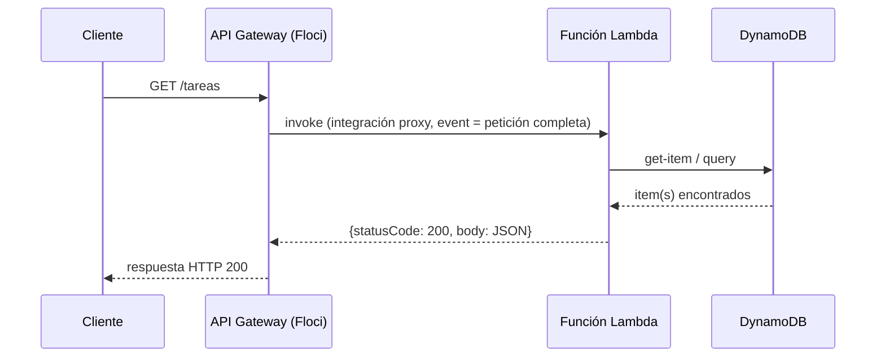

# Módulo 6: APIs con API Gateway

## Sílabo

**Objetivo general**

Exponer una función Lambda como un endpoint HTTP real: entender los tipos de API disponibles, la estructura de recursos y métodos, la integración proxy con Lambda, y el modelo de despliegue por stages.

**Objetivos específicos**

1. Diferenciar los tipos de API que ofrece API Gateway: REST, HTTP y WebSocket.
2. Crear recursos y métodos sobre una API REST.
3. Conectar un método de API Gateway a una función Lambda mediante integración proxy.
4. Explicar qué es un modelo de validación y para qué sirve el mapeo de entrada/salida.
5. Desplegar una API a un stage y entender por qué los cambios no son visibles hasta un nuevo despliegue.

**Contenido**

- Qué es API Gateway y tipos de API: REST, HTTP, WebSocket.
- Recursos, métodos y stages.
- Integración con Lambda (proxy).
- Mapeo de entrada/salida y validación con modelos.
- Despliegue y variables de stage.

**Evaluación**

Un laboratorio completo que construye un endpoint HTTP funcional conectado a la Lambda del Módulo 5, y tres ejercicios de evaluación sobre integración proxy, despliegue por stages y elección de tipo de API.

---

## Comienza desde cero: prepara este capítulo

Este recorrido parte de una carpeta vacía. Al finalizar tendrás **Un laboratorio completo que construye un endpoint HTTP funcional conectado a la Lambda del Módulo 5, y tres ejercicios de evaluación sobre integración proxy, despliegue por stages y elección de tipo de API.** No avances ejecutando comandos que no comprendes: primero identifica la entrada, la transformación y la evidencia que comprobará el resultado.

### 1. Comprueba las herramientas

Los comandos funcionan en macOS, Linux y WSL. En PowerShell usa el equivalente indicado por la herramienta.

```bash
docker --version
aws --version
terraform version
```

Si un comando no existe, detente e instala esa herramienta desde su sitio oficial. Cierra y abre la terminal después de modificar `PATH`. Las versiones deben ser compatibles entre sí antes de crear archivos.

### 2. Crea o recupera el proyecto del track

```bash
mkdir -p academia-labs/cloud/{infra,tests,evidence}
cd academia-labs/cloud
git init
docker compose up -d
```

Trabaja dentro de `academia-labs/cloud`. Si ya existe, no lo vuelvas a generar: entra en la carpeta, confirma `git status` y continúa sobre una rama propia.

### 3. Ubica cada tema antes de escribir

```text
academia-labs/cloud/
├─ infra/
│  └─ module-6/
├─ tests/
├─ docs/decisions/
├─ evidence/module-6/
└─ README.md
```

| Tema | Archivo o decisión | Evidencia mínima |
|---|---|---|
| 1. Qué es API Gateway y tipos de API — REST, HTTP, WebSocket | `infra/module-6/topic-1-que-es-api-gateway-y-tipos-de-api-rest-http-websocket.tf` | prueba + salida observable |
| 2. Recursos, métodos y stages | `infra/module-6/topic-2-recursos-metodos-y-stages.tf` | prueba + salida observable |
| 3. Integración con Lambda (proxy) | `infra/module-6/topic-3-integracion-con-lambda-proxy.tf` | prueba + salida observable |
| 4. Mapeo de entrada/salida y validación con modelos | `infra/module-6/topic-4-mapeo-de-entrada-salida-y-validacion-con-modelos.tf` | prueba + salida observable |
| 5. Despliegue y variables de stage | `infra/module-6/topic-5-despliegue-y-variables-de-stage.tf` | prueba + salida observable |

Un ejemplo técnico vive en el archivo indicado y debe tener una prueba. Un tema conceptual vive en `docs/decisions/`: compara opciones usando restricciones medibles; no escribas código decorativo solo para llenar espacio.

### 4. Ejecuta una línea base

Desde `academia-labs/cloud`:

```bash
terraform -chdir=infra validate
```

**Resultado esperado:** el comando reconoce el proyecto y termina sin errores antes de introducir el cambio del capítulo. Después del incremento, la evidencia debe demostrar: **Un laboratorio completo que construye un endpoint HTTP funcional conectado a la Lambda del Módulo 5, y tres ejercicios de evaluación sobre integración proxy, despliegue por stages y elección de tipo de API.**

Si falla la línea base, no continúes. Localiza el primer mensaje que indique archivo, línea o dependencia; formula una causa y compruébala con un cambio pequeño.

### 5. Provoca un fallo y recupérate

Cambia un endpoint, permiso o identificador por un valor inválido; inspecciona la respuesta del emulador antes de corregir. Guarda en `evidence/module-6/` el comando, la salida relevante, tu hipótesis y la corrección. Revierte únicamente el cambio deliberado; no borres todo el proyecto para ocultar la causa.

### 6. Conecta el capítulo con RutaFlow

Aplica el aprendizaje de **APIs con API Gateway** a un incremento vertical de RutaFlow. Define qué componente produce el dato, qué contrato lo transporta, quién lo consume y cómo observarás un fallo. La entrega final incluye archivo o decisión, prueba, salida, error corregido y una limitación que todavía validarías en producción.

---

## Contenido teórico

### Tema 1: Qué es API Gateway y tipos de API — REST, HTTP, WebSocket

**Conceptos clave:** puerta de entrada (gateway), API REST, API HTTP, API WebSocket, comunicación bidireccional.

API Gateway es el servicio que actúa como puerta de entrada única entre el mundo exterior (clientes HTTP: navegadores, aplicaciones móviles, otros servicios) y la lógica de tu backend, que puede vivir en Lambda, en un servidor tradicional, o en otro servicio de AWS. En vez de que cada cliente hable directamente con tus funciones Lambda (lo cual no sería siquiera posible de forma nativa, porque Lambda no expone un endpoint HTTP por sí sola), API Gateway recibe la petición HTTP, la transforma en el formato que tu backend espera, invoca ese backend, y transforma la respuesta de vuelta a un formato HTTP válido para el cliente.

Las API REST son el tipo históricamente más completo y configurable de API Gateway: soportan validación de peticiones con modelos, transformación detallada de datos con plantillas de mapeo, autorizadores personalizados, y un control granular sobre cada aspecto del comportamiento de la API. Esta flexibilidad tiene un coste de complejidad de configuración mayor comparado con las alternativas más recientes.

Las API HTTP son una versión más reciente y simplificada, diseñada específicamente para el caso de uso más común: exponer una Lambda (o un servicio HTTP) como un endpoint, con menos opciones de configuración pero también con menor latencia y menor coste por petición en una cuenta real de AWS. Para la mayoría de las APIs nuevas construidas principalmente para conectar con Lambda mediante integración proxy, las API HTTP son la recomendación por defecto en el ecosistema real de AWS, precisamente por esa simplicidad.

Las API WebSocket resuelven un problema completamente distinto: mientras que REST y HTTP siguen el modelo petición-respuesta clásico (el cliente pide, el servidor responde, y la conexión termina), WebSocket mantiene una conexión persistente y bidireccional entre cliente y servidor, permitiendo que el servidor envíe datos al cliente en cualquier momento sin que el cliente tenga que solicitarlos explícitamente cada vez. Esto es indispensable para casos de uso como chats en tiempo real, notificaciones instantáneas, o paneles de datos que se actualizan en vivo. Este curso, en su laboratorio, usa el tipo API REST, tanto por ser el más ilustrativo para entender los conceptos fundamentales de recursos, métodos y despliegue, como por ser el tipo con el que Floci tiene mayor compatibilidad de emulación estable.

**Analogía:** API Gateway es como la recepción de un edificio de oficinas con múltiples departamentos internos (tus funciones Lambda u otros backends): el visitante (cliente) no entra directamente a cada oficina, sino que pasa por recepción, que verifica su identidad si es necesario, lo dirige al departamento correcto, y le entrega de vuelta cualquier documento que ese departamento genere. Una API REST es como una recepción con un protocolo detallado y formal para cada tipo de visita; una API HTTP es como una recepción más ágil para el flujo de visitas más común y simple; una API WebSocket es como abrir una línea telefónica directa y continua entre el visitante y el departamento, en vez de visitas puntuales una por una.

**¿Por qué es importante?** Elegir el tipo correcto de API Gateway afecta directamente a la complejidad de configuración, el coste, y las capacidades disponibles. Entender las tres opciones desde el principio evita construir sobre una API REST completa (con toda su complejidad) cuando una API HTTP simple habría sido suficiente, o intentar forzar un caso de uso de tiempo real sobre REST/HTTP cuando WebSocket es la herramienta correcta.

**Diagrama:**

```
┌─────────────┐        ┌───────────────────────┐        ┌──────────────┐
│  Cliente HTTP  │ ────▶ │      API Gateway         │ ────▶ │   Lambda        │
│ (navegador,     │◀──── │  (REST / HTTP / WebSocket)│◀──── │  (tu backend)   │
│  app móvil, etc)│        └───────────────────────┘        └──────────────┘
└─────────────┘
   REST/HTTP: petición → respuesta, conexión termina
   WebSocket: conexión persistente, datos en ambas direcciones en cualquier momento
```

### Tema 2: Recursos, métodos y stages

**Conceptos clave:** recurso (resource), método (GET/POST/PUT/DELETE), stage, ruta (path).

Un recurso en una API REST de API Gateway representa un segmento de la ruta de la URL, organizado jerárquicamente: por ejemplo, `/tareas` es un recurso, y `/tareas/{id}` sería un recurso hijo que representa una tarea específica identificada por un parámetro de ruta. Cada recurso puede tener uno o más métodos HTTP asociados —GET, POST, PUT, DELETE, entre otros—, y cada combinación de recurso más método es lo que define un endpoint concreto y su comportamiento específico (por ejemplo, `GET /tareas` para listar todas las tareas, y `POST /tareas` para crear una nueva, ambos sobre el mismo recurso pero con métodos y comportamientos distintos).

Un stage es un espacio de despliegue con nombre (comúnmente `dev`, `staging`, `prod`) que representa una instantánea desplegada y accesible de tu configuración de API en un momento dado. Un mismo conjunto de recursos y métodos puede desplegarse en múltiples stages simultáneamente, cada uno con su propia URL base y, potencialmente, su propia configuración de variables de stage (que verás en el Tema 5), permitiendo por ejemplo que el stage `dev` apunte a una función Lambda de pruebas mientras el stage `prod` apunta a la versión de producción de esa misma función.

La URL final de un endpoint desplegado combina estas piezas: el ID único de la API, la región, el stage, y la ruta del recurso. Por ejemplo, una URL típica en AWS real tendría la forma `https://{api-id}.execute-api.{region}.amazonaws.com/{stage}/tareas`; en Floci, la URL sigue una estructura análoga pero apuntando al endpoint local en vez de al dominio real de AWS.

Es importante entender que definir un recurso y un método (por ejemplo, crear `/tareas` con `GET`) no es, por sí solo, suficiente para que ese endpoint responda peticiones reales: hace falta, además, conectar ese método a una integración (en este curso, siempre una integración proxy con Lambda, tema siguiente) y desplegar esa configuración a un stage, algo que verás explícitamente en el Tema 5. Sin ese despliegue, la configuración existe pero no es accesible desde fuera.

**Analogía:** los recursos son como las distintas secciones de un edificio de oficinas (`/tareas` sería el departamento de "tareas", `/tareas/{id}` sería una oficina específica dentro de ese departamento), y los métodos son como las distintas acciones que puedes solicitar en esa sección (consultar información, enviar una solicitud nueva, actualizar un expediente, eliminarlo). El stage es como tener réplicas completas de ese mismo edificio en distintas ciudades (desarrollo, pruebas, producción), cada una operando de forma independiente aunque compartan el mismo plano de organización interna.

**¿Por qué es importante?** Entender la jerarquía de recursos, métodos y stages es la base para diseñar correctamente cualquier API REST, no solo en API Gateway sino en el diseño de APIs en general: agrupar operaciones relacionadas bajo el mismo recurso, usar el método HTTP semánticamente correcto para cada acción, y mantener entornos separados (stages) para poder probar cambios sin afectar producción.

**Diagrama:**

```
API: "Sistema de Tareas"
├── /tareas
│    ├── GET    → listar todas las tareas
│    └── POST   → crear una tarea nueva
└── /tareas/{id}
     ├── GET    → obtener una tarea específica
     ├── PUT    → actualizar una tarea específica
     └── DELETE → eliminar una tarea específica

Desplegado en stages:
  /dev/tareas   → apunta a Lambda de desarrollo
  /prod/tareas  → apunta a Lambda de producción
```

### Tema 3: Integración con Lambda (proxy)

**Conceptos clave:** integración proxy (`AWS_PROXY`), integración no proxy (`AWS`), plantilla de mapeo, permisos de invocación.

Una integración es la configuración que le dice a API Gateway qué hacer cuando llega una petición a un método específico: a qué backend reenviarla, y cómo transformar los datos en el camino de ida y de vuelta. La integración proxy con Lambda (identificada internamente como `AWS_PROXY`) es, con diferencia, la más simple y la más usada en la práctica moderna: API Gateway reenvía la petición HTTP completa —método, ruta, cabeceras, parámetros de consulta, cuerpo— empaquetada tal cual dentro del `event` que recibe tu función Lambda, sin ninguna transformación intermedia configurable. A cambio, como viste en el Módulo 5, tu función es responsable de devolver la respuesta ya en el formato exacto que API Gateway espera (`statusCode`, `headers`, `body`).

La alternativa, la integración no proxy (`AWS`, sin el sufijo `_PROXY`), permite definir plantillas de mapeo explícitas: reglas que transforman la petición entrante a un formato personalizado antes de que llegue a Lambda, y transforman la respuesta de Lambda a un formato personalizado antes de devolverla al cliente. Esto da más control granular (por ejemplo, exponer solo ciertos campos del evento HTTP a tu función, ocultando el resto), pero añade una capa de configuración adicional —escrita en un lenguaje de plantillas llamado VTL (Velocity Template Language)— que la mayoría de los equipos modernos prefieren evitar en favor de la simplicidad de la integración proxy, delegando cualquier transformación de datos al propio código de la función Lambda, un lenguaje de programación de propósito general en el que es más cómodo trabajar que en un lenguaje de plantillas especializado.

Para que la integración funcione, API Gateway necesita permiso explícito para invocar tu función Lambda: esto se gestiona mediante una política de permisos de recurso (resource-based policy) adjunta a la propia función Lambda, que autoriza específicamente al servicio de API Gateway (y, más concretamente, a esa API y método concretos) a invocarla. Sin este permiso, aunque la integración esté correctamente configurada en apariencia, las peticiones fallarán con un error de autorización al intentar invocar la función.

Este curso usa exclusivamente integración proxy, tanto por ser el enfoque recomendado en el ecosistema real de AWS para la inmensa mayoría de los casos, como por mantener la coherencia directa con el contrato de entrada/salida de Lambda que ya aprendiste en el Módulo 5: el mismo formato de `event` y de respuesta que usaste al invocar la función directamente es, con la integración proxy, exactamente el mismo formato que recibe y debe devolver cuando la invoca API Gateway.

**Analogía:** la integración proxy es como un mensajero que entrega el sobre completo, cerrado y sin abrir, directamente al destinatario final (tu Lambda), confiando en que el destinatario sabe cómo abrirlo e interpretarlo, y que su respuesta también vendrá en un sobre con el formato correcto ya preparado por el destinatario. La integración no proxy es como un mensajero que primero abre el sobre, reescribe su contenido según un formulario específico antes de entregarlo, y hace lo mismo a la inversa con la respuesta: más control sobre el formato final, pero un paso adicional de trabajo (y de posibles errores) en el camino.

**¿Por qué es importante?** La integración proxy es, en la práctica moderna, la opción por defecto correcta para conectar Lambda con API Gateway en la gran mayoría de proyectos nuevos, precisamente porque mantiene toda la lógica de transformación de datos en un solo lugar (tu código Lambda) en vez de repartirla entre plantillas de configuración de infraestructura y código de aplicación.

**Diagrama:**

```
Integración PROXY (AWS_PROXY):                Integración NO PROXY (AWS):
Petición HTTP completa                         Petición HTTP
      │                                              │
      ▼ (sin transformar)                            ▼ (plantilla VTL transforma)
event = { httpMethod, path,                     event = { solo los campos
          headers, body, ... }                          que la plantilla decida exponer }
      │                                              │
      ▼                                              ▼
Lambda debe devolver                            Lambda devuelve lo que sea,
{statusCode, headers, body}                     otra plantilla VTL lo transforma
```

**Diagrama interactivo — flujo completo de una petición (integrando lo visto en los Módulos 4 y 5):**



### Tema 4: Mapeo de entrada/salida y validación con modelos

**Conceptos clave:** modelo (model), esquema JSON, validación de petición, mapeo de parámetros.

Un modelo en API Gateway es un esquema (siguiendo la convención de JSON Schema) que define la estructura esperada del cuerpo de una petición: qué campos son obligatorios, de qué tipo debe ser cada uno, y qué restricciones adicionales deben cumplir (por ejemplo, que un campo `email` siga un patrón de formato válido, o que un campo `cantidad` sea un número positivo). Cuando asocias un modelo a un método y activas la validación de petición, API Gateway rechaza automáticamente, antes de siquiera invocar tu Lambda, cualquier petición cuyo cuerpo no cumpla ese esquema, devolviendo un error 400 con detalles de qué campo falló la validación.

Esta validación a nivel de API Gateway tiene una ventaja de eficiencia real: evita invocar (y, en una cuenta real, pagar por invocar) tu función Lambda con datos que de todas formas vas a rechazar por estar mal formados, delegando esa primera capa de validación estructural al propio API Gateway antes de que la petición llegue a tu código. Esto no elimina la necesidad de validación adicional dentro de tu función (reglas de negocio más complejas que un esquema JSON no puede expresar, como "el usuario debe tener permiso para esta acción específica"), pero sí filtra los casos más básicos de datos malformados en una capa anterior, más barata y más rápida.

El mapeo de parámetros, un concepto relacionado pero distinto de la validación de cuerpo, permite especificar de dónde provienen ciertos valores esperados por tu integración: por ejemplo, mapear un parámetro de ruta como `{id}` en `/tareas/{id}` a una variable específica que tu integración (o, en integración no proxy, tu plantilla VTL) puede usar directamente. Con integración proxy, como la que usa este curso, este mapeo explícito de parámetros individuales es menos relevante, porque —como viste en el Tema 3— toda la petición, incluyendo los parámetros de ruta capturados dentro de `event.pathParameters`, llega completa a tu función sin transformación, y es tu propio código el que extrae y valida lo que necesita de ahí.

**Analogía:** un modelo de validación es como un guardia de seguridad en la entrada de un edificio que revisa que cualquier paquete que entra cumple ciertos requisitos básicos de formato (tamaño máximo, tipo de contenido declarado) antes de dejarlo pasar al departamento correspondiente, sin necesidad de que cada departamento interno tenga que revisar esos mismos requisitos básicos una y otra vez. El mapeo de parámetros sería como etiquetar explícitamente, antes de la entrega, qué parte del paquete corresponde a qué campo del formulario interno del departamento receptor.

**¿Por qué es importante?** Añadir validación de modelos en API Gateway, en vez de depender exclusivamente de validación dentro del código de tu Lambda, es una práctica de eficiencia y de defensa en profundidad: rechaza peticiones claramente malformadas lo antes posible en la cadena de procesamiento, reduciendo invocaciones innecesarias y simplificando la lógica de validación que tu función realmente necesita manejar.

**Diagrama:**

```
Petición POST /tareas con cuerpo malformado
      │
      ▼
┌───────────────────────┐
│ API Gateway valida       │
│ contra el modelo JSON     │  ──▶ Si NO cumple: rechaza con 400,
│ Schema asociado al método │       Lambda nunca se invoca
└───────────────────────┘
      │  Si SÍ cumple
      ▼
   Invoca Lambda con el cuerpo ya validado estructuralmente
```

### Tema 5: Despliegue y variables de stage

**Conceptos clave:** despliegue (deployment), variable de stage, inmutabilidad de la configuración hasta el despliegue.

Un aspecto que sorprende a quien configura una API Gateway por primera vez es que modificar la configuración de recursos, métodos o integraciones —incluso guardando esos cambios explícitamente— no los hace accesibles de inmediato en ningún stage. API Gateway requiere una operación explícita y separada llamada despliegue (deployment), que toma una instantánea del estado actual de la configuración y la publica en un stage específico. Hasta que no ejecutas ese despliegue, cualquier cliente que llame a la URL de un stage sigue recibiendo el comportamiento de la última configuración desplegada anteriormente, no los cambios que acabas de guardar.

Esta separación entre "configurar" y "desplegar" es una decisión de diseño deliberada: te permite hacer múltiples cambios de configuración —añadir varios métodos nuevos, ajustar varias integraciones— y desplegarlos todos juntos de una sola vez en un momento controlado, en vez de que cada cambio individual se vuelva inmediatamente visible en producción de forma descoordinada. También te permite probar una configuración en un stage de pruebas antes de desplegar exactamente esa misma configuración a producción.

Las variables de stage son pares clave-valor específicos de cada stage, que puedes referenciar dentro de tu configuración de integración (por ejemplo, para apuntar a un alias distinto de tu función Lambda según el stage). Un patrón común es usar una variable de stage para almacenar el nombre del alias de Lambda a invocar, de forma que el stage `dev` invoque el alias `desarrollo` de tu función y el stage `prod` invoque el alias `produccion` de esa misma función, sin necesidad de duplicar la configuración completa de la API para cada entorno: solo cambia el valor de esa variable entre stages.

Olvidar este paso de despliegue explícito es, con mucha diferencia, el error más común y más desconcertante al empezar a trabajar con API Gateway: haber configurado todo aparentemente bien, pero seguir viendo el comportamiento antiguo (o directamente un error 404, si el recurso ni siquiera existía en el último despliegue) al probar el endpoint, simplemente porque el cambio nunca se desplegó al stage que estás consultando.

**Analogía:** configurar recursos y métodos en API Gateway es como editar un documento en un procesador de texto: los cambios existen en tu editor, pero nadie más los ve todavía. Desplegar a un stage es como publicar ese documento en un sitio web específico: solo después de "publicar" (desplegar), los lectores de esa URL concreta (ese stage) ven la versión actualizada. Puedes seguir editando el documento (haciendo más cambios de configuración) sin que eso afecte lo ya publicado, hasta que decidas publicar (desplegar) de nuevo.

**¿Por qué es importante?** Entender que la configuración y el despliegue son pasos separados evita la confusión más común al depurar una API Gateway que "no refleja mis cambios": casi siempre, la solución es simplemente recordar ejecutar un nuevo despliegue al stage correspondiente, no un problema más profundo en la configuración en sí.

**Diagrama:**

```
Configuración actual (recursos, métodos, integraciones)
        │
        │  create-deployment --stage-name dev
        ▼
   Stage "dev" ahora refleja esta configuración
        │
   (sigues editando la configuración: nuevos cambios)
        │
        │  create-deployment --stage-name dev   ← hay que repetirlo
        ▼
   Stage "dev" refleja los nuevos cambios
```

---

## Criterio transversal de calidad del código

Aplica estas decisiones en todos los ejemplos y en tu entrega:

- usa nombres que expresen intención, dominio y unidades; evita `data`, `temp`, `manager` o `process` cuando exista un término preciso;
- mantén funciones, componentes, clases, consultas y módulos cohesionados alrededor de una responsabilidad comprobable;
- haz visibles las dependencias y los efectos de red, tiempo, archivos, estado y base de datos;
- valida entradas en la frontera y representa errores con contexto, sin ocultar la causa ni registrar secretos;
- elimina duplicación de reglas, no toda repetición textual; una abstracción incorrecta cuesta más que dos líneas parecidas;
- escribe primero la solución más simple que satisface el requisito y refactoriza con pruebas verdes;
- aplica SOLID únicamente cuando exista una necesidad real de cambio, extensión, sustitución o aislamiento.

**SOLID con criterio:** responsabilidad única significa una razón coherente de cambio, no una clase por función. Abierto/cerrado justifica estrategias cuando hay variantes reales. Sustitución exige respetar contratos. Segregación evita obligar a consumidores a depender de operaciones que no usan. Inversión de dependencias protege el dominio frente a detalles externos; no exige crear interfaces para cada objeto.

**Comprobación antes de continuar:** ¿otra persona puede entender los nombres y el flujo?, ¿los casos de error son observables?, ¿una prueba demuestra la regla principal?, ¿cada abstracción aporta más claridad de la que cuesta? Registra una decisión de refactorización y una decisión consciente de *no abstraer*.

## Laboratorio práctico

> Este laboratorio asume que ya ejecutaste `floci start` y `eval $(floci env)` (Módulo 1) en tu sesión de terminal, así que los comandos de `aws` no repiten `--endpoint-url`.

**Objetivo del laboratorio:** crear una API REST completa con un recurso `/tareas`, conectarlo mediante integración proxy a la función Lambda del Módulo 5, desplegarla en un stage `dev`, e invocar el endpoint HTTP resultante con `curl`.

**Requisitos previos:** Floci corriendo con los servicios API Gateway y Lambda activos, la función `mi-funcion` del Módulo 5 ya desplegada.

### Laboratorio 6.1 — Construir y desplegar el endpoint

| Paso | Acción | Comando | Explicación | Salida esperada |
|---|---|---|---|---|
| 1 | Crear la API REST | `aws apigateway create-rest-api --name "API Tareas"` | Crea el contenedor de la API; guarda el `id` devuelto | Un JSON con `id` y `name: "API Tareas"` |
| 2 | Obtener el ID del recurso raíz | `aws apigateway get-resources --rest-api-id <api-id>` | Toda API REST nace con un recurso raíz (`/`); necesitas su ID para crear recursos hijos | Un JSON con un `item` cuyo `path` es `/` |
| 3 | Crear el recurso `/tareas` | `aws apigateway create-resource --rest-api-id <api-id> --parent-id <id-recurso-raiz> --path-part tareas` | Crea el recurso `/tareas` como hijo de la raíz | Un JSON con `id` del nuevo recurso y `path: "/tareas"` |
| 4 | Crear el método GET sobre ese recurso | `aws apigateway put-method --rest-api-id <api-id> --resource-id <id-recurso-tareas> --http-method GET --authorization-type NONE` | Define que `/tareas` acepta peticiones GET, sin autorización adicional para este laboratorio | Un JSON confirmando el método `GET` |
| 5 | Conectar el método a la Lambda con integración proxy | `aws apigateway put-integration --rest-api-id <api-id> --resource-id <id-recurso-tareas> --http-method GET --type AWS_PROXY --integration-http-method POST --uri arn:aws:apigateway:us-east-1:lambda:path/2015-03-31/functions/arn:aws:lambda:us-east-1:000000000000:function:mi-funcion/invocations` | Define que las peticiones GET a `/tareas` se reenvían completas a `mi-funcion`, y su respuesta se devuelve tal cual (proxy) | Un JSON confirmando `type: AWS_PROXY` |
| 6 | Desplegar la API al stage `dev` | `aws apigateway create-deployment --rest-api-id <api-id> --stage-name dev` | Publica la configuración actual en el stage `dev`, haciéndola accesible por primera vez | Un JSON con `id` del despliegue |
| 7 | Invocar el endpoint desplegado | `curl http://localhost:4566/restapis/<api-id>/dev/_user_request_/tareas` | Prueba de extremo a extremo: petición HTTP real que llega a API Gateway y este la reenvía a Lambda | El mismo JSON que devolvería invocar la Lambda directamente, por ejemplo `{"mensaje":"Hola, mundo"}` |
| 8 | Comparar con invocar la Lambda directamente | `aws lambda invoke --function-name mi-funcion --payload '{}' --cli-binary-format raw-in-base64-out salida-directa.json && cat salida-directa.json` | Confirma que ambos caminos (API Gateway y la CLI directa) llegan al mismo resultado final de negocio | El contenido de `salida-directa.json` coincide en su parte de negocio con la respuesta del `curl` del paso 7 |

**Comprobación visual:** usa Floci UI para comprobar que la función Lambda integrada sigue disponible en **Cloud Explorer → Serverless**. API Gateway no tiene actualmente una superficie unificada completa en Cloud Explorer, por lo que rutas, métodos, integración y deployment se verifican con `get-resources`, `get-integration` y `get-deployments`. La interfaz aporta contexto visual de la función; `curl` demuestra el flujo de extremo a extremo.

**Verificación:** el laboratorio se considera exitoso si la función integrada aparece con la configuración esperada, y si el `curl` del paso 7 responde con un código HTTP 200 y un cuerpo JSON coherente con lo que Lambda devuelve, confirmando la cadena completa (petición HTTP → API Gateway → integración proxy → Lambda → respuesta).

**Errores comunes y soluciones**

- **`{"message":"Missing Authentication Token"}` al hacer `curl`.** Casi siempre significa que la ruta de la URL está mal formada (falta el stage, o el `_user_request_` en el formato de Floci/LocalStack), o que el método/recurso no coincide exactamente con lo configurado. Revisa cuidadosamente cada segmento de la URL contra el paso 6.
- **El `curl` responde con un error 500 genérico.** Revisa primero que invocar la Lambda directamente (paso 8) funciona correctamente; si falla ahí también, el problema está en la función, no en API Gateway. Si la invocación directa funciona pero el `curl` falla, revisa los permisos de invocación entre API Gateway y Lambda, y que el `type` de la integración sea exactamente `AWS_PROXY`.
- **Los cambios de configuración no se reflejan al volver a probar el endpoint.** Como viste en el Tema 5, cualquier cambio posterior a los métodos o integraciones requiere un nuevo `create-deployment` al stage correspondiente; sin ese paso, el stage sigue sirviendo la configuración anterior.
- **Olvidar reemplazar `<api-id>` o los IDs de recurso en cada comando.** Cada comando de este laboratorio depende del `id` devuelto por un paso anterior; es buena práctica guardar esos valores en variables de shell (`API_ID=$(aws apigateway create-rest-api ... --query id --output text ...)`) para no tener que copiarlos manualmente cada vez.

---

## Ejercicios de evaluación

### Ejercicio 1: Explicar el valor de la integración proxy

**Enunciado:** explica, sin mirar el Tema 3, qué aporta específicamente la integración proxy (`AWS_PROXY`) frente a configurar manualmente plantillas de mapeo de entrada y salida (integración `AWS` sin proxy).

**Solución esperada:** la integración proxy reenvía la petición HTTP completa sin transformación, delegando toda la lógica de interpretación de esos datos al código de la función Lambda (un lenguaje de programación de propósito general), en vez de tener que escribir y mantener plantillas de transformación en VTL dentro de la configuración de infraestructura. Esto simplifica la configuración y concentra toda la lógica de negocio en un único lugar (el código), a costa de que la función deba encargarse ella misma de devolver el formato exacto `statusCode`/`headers`/`body` que API Gateway espera.

**Criterios de éxito:**
- Menciona que la integración proxy no transforma los datos, dejando esa responsabilidad al código de Lambda.
- Reconoce el compromiso: menos configuración de infraestructura, pero la función debe devolver el formato de respuesta exacto esperado.

### Ejercicio 2: Diagnosticar un despliegue faltante

**Enunciado:** añadiste un nuevo método `POST` sobre el recurso `/tareas`, lo probaste con `curl` contra el stage `dev`, y obtuviste un error `Missing Authentication Token`, aunque el método `GET` sobre ese mismo recurso funciona perfectamente. ¿Cuál es la causa más probable, y cómo la corriges?

**Solución esperada:** la causa más probable es que el método `POST` se configuró correctamente pero nunca se desplegó al stage `dev` con un nuevo `create-deployment`; el stage sigue sirviendo la configuración anterior, en la que ese método `POST` no existía todavía, por lo que API Gateway lo trata como una ruta no reconocida. La corrección es ejecutar `aws apigateway create-deployment --rest-api-id <api-id> --stage-name dev` de nuevo, para publicar la configuración actualizada que ya incluye el nuevo método.

**Criterios de éxito:**
- Identifica correctamente la falta de un nuevo despliegue como la causa más probable, no un problema de la integración en sí.
- La solución propuesta es ejecutar un nuevo `create-deployment` al stage correcto.

### Ejercicio 3: Elegir entre API REST y API HTTP

**Enunciado:** estás diseñando una API nueva que simplemente expone tres funciones Lambda distintas mediante integración proxy, sin necesidad de validación de modelos ni de autorizadores personalizados complejos. En un entorno real de AWS (no en Floci), ¿elegirías una API REST o una API HTTP? Justifica tu respuesta.

**Solución esperada:** una API HTTP, porque el caso de uso descrito —integración proxy simple con Lambda, sin necesidad de las funcionalidades más avanzadas de REST como validación de modelos o plantillas de mapeo personalizadas— es exactamente el escenario para el que las API HTTP fueron diseñadas: menor complejidad de configuración, menor latencia y menor coste por petición en una cuenta real, sin sacrificar nada que este caso de uso concreto necesite.

**Criterios de éxito:**
- Elige API HTTP, no REST.
- La justificación menciona que el caso de uso no requiere las funcionalidades avanzadas exclusivas de REST, conectándolo con el Tema 1.

---

## Rúbrica del proyecto

Esta rúbrica evalúa el laboratorio y los ejercicios como evidencia de dominio, no la mera finalización de pasos.

| Criterio | Peso | Evidencia esperada |
|---|---:|---|
| Comprensión conceptual | 20% | Explica el mecanismo, sus límites y por qué la solución funciona. |
| Implementación funcional | 30% | El artefacto satisface requisitos normales, límite y de error. |
| Verificación | 20% | Incluye pruebas, mediciones o inspecciones reproducibles. |
| Diseño y calidad | 15% | Nombres, estructura, seguridad y mantenibilidad son deliberados. |
| Comunicación profesional | 15% | README, decisiones, comandos y resultados permiten repetir el trabajo. |

Se alcanza competencia con 70/100 y sin cero en implementación o verificación. El nivel experto exige comparar alternativas, justificar trade-offs y reconocer condiciones donde la solución dejaría de ser válida.

## Bibliografía y fundamento académico

Estas fuentes sustentan los conceptos y deben consultarse para verificar detalles que cambian entre versiones:

- AWS, Microsoft Azure y Google Cloud, marcos oficiales de arquitectura bien diseñada.
- NIST, *Cloud Computing Standards Roadmap* y *Secure Software Development Framework*.
- Beyer et al., *Site Reliability Engineering*.
- ACM/IEEE-CS/AAAI, *Computer Science Curricula 2023*.
- IEEE Computer Society, *SWEBOK Guide V4.0*.

## Resumen del módulo

**Puntos clave**

- API Gateway actúa como puerta de entrada entre clientes HTTP y tu backend, con tres tipos disponibles: REST (más completo), HTTP (más simple, recomendado para la mayoría de casos nuevos) y WebSocket (comunicación bidireccional persistente).
- Los recursos representan segmentos de ruta, los métodos representan operaciones HTTP sobre esos recursos, y los stages son entornos de despliegue independientes con su propia URL.
- La integración proxy reenvía la petición completa a Lambda sin transformación, delegando esa responsabilidad al código; la función debe devolver `statusCode`/`headers`/`body`.
- Los modelos permiten validar la estructura de una petición antes de invocar Lambda, ahorrando invocaciones innecesarias sobre datos malformados.
- La configuración y el despliegue son pasos separados: ningún cambio de configuración es visible en un stage hasta que se ejecuta explícitamente un nuevo despliegue a ese stage.

**Conceptos aprendidos**

- Los tres tipos de API de API Gateway y cuándo elegir cada uno.
- Recursos, métodos y stages como los bloques de construcción de una API REST.
- Integración proxy con Lambda y el contrato de respuesta que exige.
- Validación de peticiones con modelos JSON Schema.
- El modelo de despliegue explícito y las variables de stage.

**Próximos pasos**

En el Módulo 7 vas a estudiar IAM en profundidad: usuarios, grupos, roles y políticas, aplicando el principio de mínimo privilegio a los servicios que ya usaste en los módulos anteriores.

**Recursos adicionales**

- Documentación oficial de Amazon API Gateway: conceptos de API REST, HTTP y WebSocket.
- Documentación oficial sobre integración Lambda proxy en API Gateway.
- Documentación oficial sobre despliegues y stages de API Gateway.
- Código ejecutable de cada operación (crear API, crear recurso, crear método, desplegar) en Node.js, Python, Java, Go y Rust: carpeta [`examples/`](https://github.com/NICORUIZ93/Academia_Floci/tree/main/examples) del repositorio, archivos que empiezan por `apigateway-`/`apigateway_`/`ApiGateway` (ver [`examples/README.md`](https://github.com/NICORUIZ93/Academia_Floci/blob/main/examples/README.md) para la lista completa).
