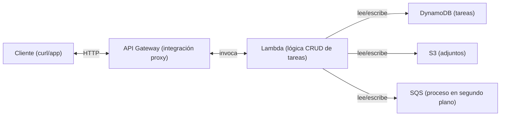
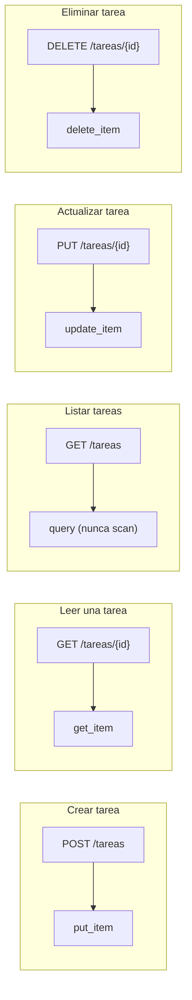
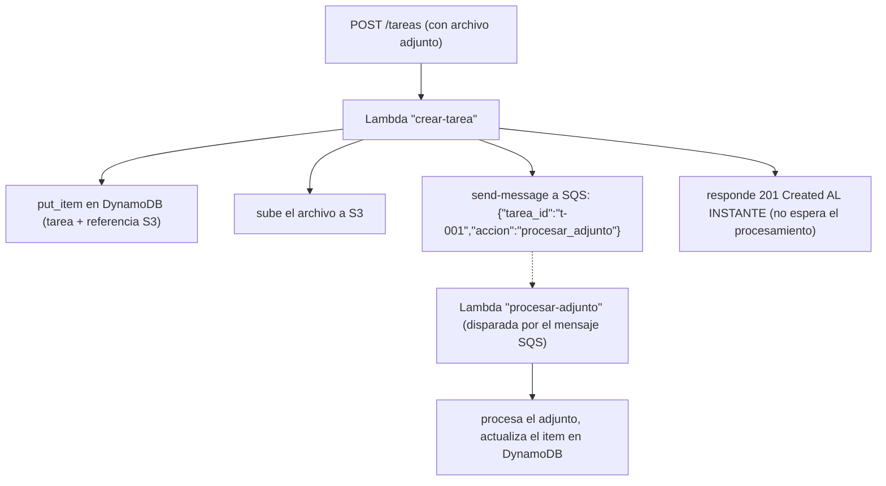
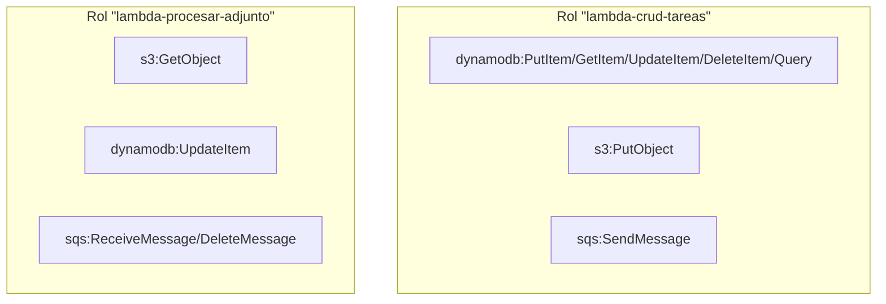
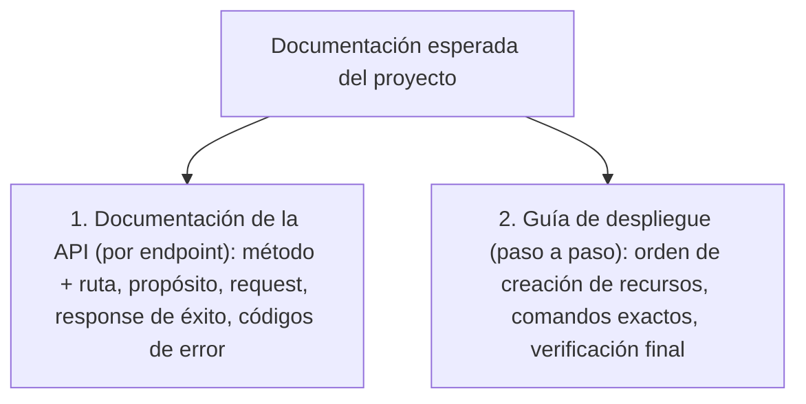

# Módulo 9: Proyecto final — Sistema de Gestión de Tareas


## Aprende construyendo

### Tema 1: Arquitectura de la aplicación — frontend, backend y base de datos

#### Paso 1 · Objetivo y preparación
Al finalizar podrás diseñar una API serverless desde cero. Prerrequisitos: Node.js, Docker y AWS CLI; verifica `node --version`.
#### Paso 2 · Contexto y caso real
Una aplicación de entregas necesita separar entrada, lógica y datos.
#### Paso 3 · Teoría, modelo mental y analogía
Tres capas son recepción, despacho y almacén; cada una tiene un contrato.
#### Paso 4 · Demostración guiada
Crea `src/api.js` desde una carpeta vacía.
```bash
mkdir ejemplo-api
node --version
```
Resultado esperado: Node disponible.
#### Paso 5 · Práctica guiada
Pista: mezcla responsabilidades para provocar un fallo deliberado y sepáralas.
#### Paso 6 · Práctica independiente
Implementa una ruta y una prueba de contrato.
#### Paso 7 · Cierre y evidencia
Entrega árbol, salida, fallo y corrección; explica el resultado. Siguiente paso: modelo de datos. Errores comunes: lógica en gateway y acoplamiento a proveedor. Fuente oficial: https://docs.aws.amazon.com/lambda/latest/dg/welcome.html.
**Conceptos clave:** arquitectura de tres capas, separación de responsabilidades, backend sin servidor.

El Sistema de Gestión de Tareas que vas a construir sigue una arquitectura de tres capas adaptada al mundo serverless: un frontend (que en este proyecto puede ser tan simple como una colección de peticiones `curl` o un cliente HTTP de pruebas, ya que el foco del curso es el backend cloud, no el desarrollo de interfaz de usuario), un backend compuesto por funciones Lambda expuestas a través de API Gateway, y una capa de datos que combina DynamoDB (para los datos estructurados de cada tarea) y S3 (para los archivos adjuntos, que por su naturaleza binaria y de tamaño variable no encajan bien como atributo de un item DynamoDB).

Esta separación no es arbitraria: refleja exactamente la separación de responsabilidades que estudiaste servicio por servicio a lo largo del curso. DynamoDB, como viste en el Módulo 4, es adecuado para datos estructurados con un patrón de acceso predecible (consultar las tareas de un usuario, filtrar por estado); S3, como viste en el Módulo 2, es adecuado para archivos binarios de tamaño variable que no necesitan ser consultados por su contenido interno. Intentar forzar los archivos adjuntos dentro de un atributo DynamoDB (por ejemplo, codificándolos en base64 como un string) funcionaría técnicamente para archivos muy pequeños, pero violaría el límite de tamaño de item de DynamoDB para archivos de tamaño realista, y desperdiciaría la capacidad de DynamoDB para lo que realmente hace bien.

El flujo de una petición típica en este sistema atraviesa varias piezas: una petición HTTP llega a API Gateway, que la reenvía mediante integración proxy (Módulo 6) a la función Lambda correspondiente; esa función valida la petición, interactúa con DynamoDB y/o S3 según la operación solicitada, y en ciertos casos (como verás en el Tema 3) publica un mensaje en una cola SQS para que otro proceso continúe el trabajo en segundo plano, sin bloquear la respuesta inmediata al usuario. Cada una de estas piezas opera bajo un rol IAM (Módulo 7) con exactamente los permisos que necesita, ni uno más.

Diseñar esta arquitectura en un diagrama antes de escribir una sola línea de código —el primer paso obligatorio de este proyecto— no es un formalismo académico: es lo que te permite anticipar qué tabla necesitas, qué claves va a tener, qué colas necesitas, y qué permisos exactos necesita cada función, en vez de ir descubriendo esas necesidades sobre la marcha y teniendo que rehacer decisiones de diseño a mitad del proyecto.

**Analogía:** esta arquitectura es como un restaurante organizado en tres áreas claramente separadas: el comedor donde el cliente hace su pedido (el frontend/API), la cocina donde se prepara cada plato según lo pedido (las funciones Lambda), y la despensa y el almacén de ingredientes (DynamoDB y S3), cada uno especializado en guardar un tipo distinto de insumo. Un pedido complejo puede además generar una "orden interna" que pasa a un segundo cocinero que trabaja en paralelo (la cola SQS y su procesamiento en segundo plano), sin que el cliente en el comedor tenga que esperar a que ese segundo plato esté listo para recibir confirmación de que su pedido fue recibido.

**¿Por qué es importante?** Esta arquitectura de tres capas, adaptada al mundo serverless, es un patrón extremadamente común en sistemas reales de producción, no un ejercicio artificial de curso. Entender por qué cada pieza va donde va —y no solo cómo conectarlas siguiendo instrucciones— es lo que te permite, después de este curso, diseñar arquitecturas equivalentes para problemas distintos a este proyecto específico.

**Diagrama:**



### Tema 2: CRUD de tareas sobre DynamoDB expuesto por Lambda

#### Paso 1 · Objetivo y preparación
Al finalizar podrás modelar CRUD desde cero. Prerrequisitos: Node.js, Docker y AWS CLI; verifica `node --version`.
#### Paso 2 · Contexto y caso real
Una tarea debe crearse, consultarse, actualizarse y eliminarse con reglas claras.
#### Paso 3 · Teoría, modelo mental y analogía
La clave primaria es matrícula; cada operación es una ventanilla especializada.
#### Paso 4 · Demostración guiada
Crea `src/task-service.js` desde una carpeta vacía.
```bash
mkdir ejemplo-crud
node --version
```
Resultado esperado: Node disponible.
#### Paso 5 · Práctica guiada
Pista: usa una clave duplicada para provocar un fallo deliberado y corrígelo.
#### Paso 6 · Práctica independiente
Añade validación y pruebas de cada operación.
#### Paso 7 · Cierre y evidencia
Entrega modelo, salida, fallo y corrección; explica el resultado. Siguiente paso: archivos. Errores comunes: claves inestables y operaciones no idempotentes. Fuente oficial: https://docs.aws.amazon.com/amazondynamodb/latest/developerguide/Introduction.html.
**Conceptos clave:** modelo de datos de la tarea, clave primaria, funciones Lambda por operación (o una función router).

El modelo de datos central del proyecto es la tarea: un item de DynamoDB con, como mínimo, los atributos `id` (clave primaria simple, siguiendo el patrón del Módulo 4), `titulo`, `descripcion`, `estado` (por ejemplo, `pendiente`, `en_progreso`, `completada`), `fecha_creacion`, y, como verás en el Tema 3, una referencia opcional a un archivo adjunto en S3 y un indicador de si tiene tareas de procesamiento en segundo plano pendientes.

Puedes implementar el backend de dos formas razonables: con una función Lambda separada por cada operación CRUD (una para crear, otra para leer, otra para actualizar, otra para eliminar), cada una con su propia integración específica en API Gateway; o con una única función Lambda que actúa como router interno, inspeccionando el método HTTP y la ruta recibidos en el `event` (recordando el Tema 4 del Módulo 5 y el formato de integración proxy del Módulo 6) para decidir internamente qué operación ejecutar. Ambos enfoques son válidos y verás ambos en proyectos reales; para este curso, el enfoque de una única función router es más simple de desplegar y suficiente para el alcance del proyecto, aunque el enfoque de funciones separadas escala mejor en proyectos más grandes al permitir desplegar y escalar cada operación de forma independiente.

Cada operación CRUD se apoya directamente en los comandos que ya practicaste en el Módulo 4: crear una tarea usa `put_item` (o su equivalente en el SDK del lenguaje que elijas), leer una tarea usa `get_item` por su clave, listar tareas de un patrón de acceso concreto usa `query` (nunca `scan`, recordando por qué en el Tema 6 del Módulo 4), actualizar usa `update_item` con una expresión que modifica solo los atributos necesarios, y eliminar usa `delete_item`.

Es importante que cada operación valide su entrada antes de tocar la base de datos: por ejemplo, rechazar una creación de tarea sin `titulo`, o una actualización de `estado` a un valor fuera del conjunto de estados válidos. Esta validación puede reforzarse parcialmente con un modelo de API Gateway (Módulo 6, Tema 4), pero la validación de reglas de negocio más específicas (como los valores válidos de `estado`) debe vivir en el código de la función, no solo en la capa de API Gateway.

**Analogía:** el CRUD de tareas es como el mostrador de atención de una oficina de trámites: cada tipo de solicitud (crear un expediente, consultar uno existente, actualizarlo, cerrarlo) tiene un procedimiento específico, pero todos comparten el mismo archivo central (la tabla DynamoDB) donde viven los expedientes, organizados por su número de expediente único (la clave primaria).

**¿Por qué es importante?** El CRUD de tareas es el núcleo funcional del proyecto: sin él, no hay sistema que gestionar. Construirlo bien —con la validación adecuada y usando Query en vez de Scan donde corresponda— demuestra que realmente interiorizaste las lecciones de diseño del Módulo 4, no solo que puedes copiar comandos.

**Diagrama:**



### Tema 3: Archivos adjuntos en S3 y procesamiento en segundo plano con SQS

#### Paso 1 · Objetivo y preparación
Al finalizar podrás coordinar archivos y datos desde cero. Prerrequisitos: Node.js, Docker y AWS CLI; verifica `node --version`.
#### Paso 2 · Contexto y caso real
La foto de entrega se almacena aparte y se referencia desde el registro.
#### Paso 3 · Teoría, modelo mental y analogía
S3 es depósito, DynamoDB es catálogo y la cola es transporte.
#### Paso 4 · Demostración guiada
Crea `src/file-flow.js` desde una carpeta vacía.
```bash
mkdir ejemplo-archivos
node --version
```
Resultado esperado: Node disponible.
#### Paso 5 · Práctica guiada
Pista: rompe la referencia para provocar un fallo deliberado y corrígelo.
#### Paso 6 · Práctica independiente
Genera URL temporal y procesa un mensaje.
#### Paso 7 · Cierre y evidencia
Entrega flujo, salida, fallo y corrección; explica el resultado. Siguiente paso: seguridad. Errores comunes: guardar binarios en la tabla y no expirar URLs. Fuente oficial: https://docs.aws.amazon.com/AmazonS3/latest/userguide/PresignedUrlUploadObject.html.
**Conceptos clave:** referencia cruzada S3-DynamoDB, URL pre-firmada de subida, mensaje de trabajo en segundo plano.

Cuando un usuario adjunta un archivo a una tarea, el archivo en sí se guarda en S3 (nunca directamente en DynamoDB, por las razones de tamaño y tipo de dato que viste en el Tema 1), y el item de la tarea en DynamoDB guarda únicamente una referencia a ese archivo: típicamente la clave del objeto S3 (por ejemplo, `adjuntos/t-001/factura.pdf`), no el contenido del archivo en sí. Este patrón de "referencia cruzada" entre un almacén de metadatos estructurados (DynamoDB) y un almacén de contenido binario (S3) es exactamente el patrón que se mencionó como recomendación práctica en el Tema 2 del Módulo 2.

Para la subida del archivo en sí, tienes dos enfoques razonables: que la función Lambda reciba el contenido del archivo directamente en el cuerpo de la petición HTTP y lo suba ella misma a S3 (más simple de implementar, pero limitado por el tamaño máximo de payload de Lambda y de API Gateway que viste en el Módulo 5), o que la función genere una URL pre-firmada (Módulo 2, Tema 5) que el cliente use para subir el archivo directamente a S3 sin pasar por Lambda en absoluto. Para el alcance de este proyecto, el primer enfoque —subida directa a través de la Lambda— es suficiente y más simple de verificar en Floci; el segundo enfoque es el recomendado en sistemas de producción real con archivos de mayor tamaño.

El procesamiento en segundo plano con SQS entra en juego para cualquier trabajo asociado a una tarea que no necesita completarse antes de responder al usuario: por ejemplo, procesar el archivo adjunto (generar una miniatura si es una imagen, extraer texto si es un documento), o enviar una notificación de que la tarea cambió de estado. En vez de que la función que atiende la petición HTTP haga ese trabajo adicional de forma síncrona (retrasando la respuesta al usuario), esa función simplemente publica un mensaje en una cola SQS describiendo el trabajo pendiente (por ejemplo, `{"tarea_id": "t-001", "accion": "procesar_adjunto"}`), y responde inmediatamente al usuario confirmando que la tarea fue creada, mientras una segunda función Lambda —disparada por la llegada de mensajes a esa cola, un patrón de integración asíncrona que viste en el Tema 6 del Módulo 5— procesa ese trabajo de forma independiente y a su propio ritmo.

Esta separación entre "lo que el usuario necesita saber inmediatamente" (la tarea fue creada) y "lo que puede procesarse después sin bloquear al usuario" (procesar el adjunto) es exactamente el patrón de desacoplamiento que estudiaste en profundidad en el Módulo 3, aplicado ahora a un caso de uso completo y realista.

**Analogía:** subir un archivo adjunto y encolar su procesamiento es como entregar un paquete en un mostrador de correos: el empleado del mostrador (la Lambda que atiende la petición HTTP) te da un recibo inmediato confirmando que el paquete fue recibido (la respuesta al usuario), pero el procesamiento más lento del paquete —clasificarlo, enviarlo a la ruta correcta— ocurre después, en la trastienda (la Lambda disparada por SQS), sin que tú tengas que esperar en el mostrador a que ese proceso termine.

**¿Por qué es importante?** Este es, posiblemente, el patrón más transferible de todo el proyecto: casi cualquier sistema real con archivos adjuntos y alguna forma de procesamiento posterior (generación de miniaturas, escaneo de virus, extracción de texto, notificaciones) sigue esta misma estructura de responder rápido al usuario y procesar el resto de forma asíncrona.

**Diagrama:**



En paralelo, después: la Lambda "procesar-adjunto" se dispara por el mensaje SQS y procesa el adjunto sin bloquear la respuesta ya enviada.

### Tema 4: API Gateway e IAM de mínimo privilegio para el proyecto

#### Paso 1 · Objetivo y preparación
Al finalizar podrás asegurar funciones desde cero. Prerrequisitos: Node.js, Docker y AWS CLI; verifica `node --version`.
#### Paso 2 · Contexto y caso real
Cada función debe acceder solo al recurso que necesita.
#### Paso 3 · Teoría, modelo mental y analogía
El rol es pase de función y la policy es su alcance exacto.
#### Paso 4 · Demostración guiada
Crea `src/roles.js` desde una carpeta vacía.
```bash
mkdir ejemplo-roles
node --version
```
Resultado esperado: Node disponible.
#### Paso 5 · Práctica guiada
Pista: elimina un permiso para provocar un fallo deliberado y corrígelo.
#### Paso 6 · Práctica independiente
Audita una ruta y documenta la denegación esperada.
#### Paso 7 · Cierre y evidencia
Entrega policy, salida, fallo y corrección; explica el resultado. Siguiente paso: documentación. Errores comunes: roles compartidos y permisos wildcard. Fuente oficial: https://docs.aws.amazon.com/lambda/latest/dg/lambda-intro-execution-role.html.
**Conceptos clave:** rol por función, política específica por recurso, endpoint documentado.

Cada función Lambda del proyecto —la que atiende el CRUD vía API Gateway y la que procesa adjuntos desde SQS— debe tener su propio rol IAM (Módulo 7), con una política que conceda exactamente los permisos que esa función concreta necesita sobre los recursos concretos que usa, y nada más. La función que atiende el CRUD necesita, como mínimo, permiso de lectura/escritura sobre la tabla DynamoDB de tareas, permiso de escritura sobre el bucket S3 de adjuntos, y permiso para enviar mensajes (`sqs:SendMessage`) a la cola de procesamiento; no necesita, por ejemplo, permiso para eliminar la tabla completa, ni para leer otros buckets no relacionados con este proyecto.

La función que procesa adjuntos, activada por SQS, necesita permisos distintos: permiso de lectura sobre el bucket S3 (para leer el adjunto que va a procesar), permiso de escritura sobre la tabla DynamoDB (para actualizar el estado de la tarea una vez procesado el adjunto), y los permisos específicos de SQS necesarios para que Lambda pueda recibir y eliminar mensajes de la cola en su nombre. Diseñar estos dos roles por separado, en vez de un único rol genérico compartido con todos los permisos que cualquiera de las dos funciones pudiera necesitar, es una aplicación directa del principio de mínimo privilegio del Módulo 7 a un caso concreto: si la función de procesamiento de adjuntos tuviera una vulnerabilidad explotada, no debería, además, tener permiso para modificar recursos que no necesita tocar.

Sobre API Gateway, este proyecto reutiliza directamente los conceptos del Módulo 6: los recursos `/tareas` y `/tareas/{id}` con sus métodos correspondientes (GET, POST, PUT, DELETE), conectados mediante integración proxy a la función Lambda del CRUD, desplegados en un stage (por ejemplo, `prod`), con la URL resultante documentada explícitamente como parte de los entregables del proyecto (Tema 6, más abajo).

**Analogía:** dar a cada función Lambda su propio rol con permisos específicos es como dar a cada empleado de una empresa exactamente las llaves que necesita para su puesto, en vez de una llave maestra genérica que abre todas las puertas del edificio "por si acaso alguna vez la necesita alguien". Si el empleado de recepción (la función del CRUD) solo necesita acceso al mostrador y al almacén de paquetes, no debería tener también la llave de la caja fuerte del departamento financiero, aunque nunca vaya a usarla mal intencionadamente: el riesgo existe simplemente por tener el acceso, lo use o no.

**¿Por qué es importante?** Aplicar mínimo privilegio de forma consistente y específica a cada componente de un sistema real, en vez de solo entenderlo en abstracto (como en el laboratorio aislado del Módulo 7), es exactamente la habilidad que separa un ejercicio de curso de un proyecto que refleja buenas prácticas reales de producción.

**Diagrama:**



`lambda-crud-tareas` opera solo sobre la tabla y el bucket específicos del proyecto, nada más; `lambda-procesar-adjunto` opera solo sobre la tabla, el bucket y la cola específicos, nada más.

### Tema 5: Documentación de la API y guía de despliegue

#### Paso 1 · Objetivo y preparación
Al finalizar podrás documentar y desplegar desde cero. Prerrequisitos: Node.js y Docker; verifica `node --version`.
#### Paso 2 · Contexto y caso real
Un equipo necesita repetir el despliegue sin conocimiento oculto.
#### Paso 3 · Teoría, modelo mental y analogía
La documentación es el manual de operación y el contrato evita interpretaciones.
#### Paso 4 · Demostración guiada
Crea `README.md` y `src/deploy.js` desde una carpeta vacía.
```bash
mkdir ejemplo-documentado
node --version
```
Resultado esperado: Node disponible.
#### Paso 5 · Práctica guiada
Pista: elimina un parámetro para provocar un fallo deliberado y corrígelo.
#### Paso 6 · Práctica independiente
Añade ejemplo de petición, respuesta y rollback.
#### Paso 7 · Cierre y evidencia
Entrega README, salida, fallo y corrección; explica el resultado. Siguiente paso: observabilidad. Errores comunes: enlaces rotos y comandos no reproducibles. Fuente oficial: https://spec.openapis.org/oas/latest.html.
**Conceptos clave:** documentación de endpoints, contrato de API, guía de despliegue reproducible.

Un proyecto funcional pero sin documentación no está realmente terminado desde una perspectiva profesional: cualquier persona que necesite usar, mantener o extender tu API en el futuro (incluido tú mismo, meses después) necesita saber qué endpoints existen, qué esperan recibir, y qué devuelven. La documentación mínima esperada para este proyecto incluye, para cada endpoint (`POST /tareas`, `GET /tareas`, `GET /tareas/{id}`, `PUT /tareas/{id}`, `DELETE /tareas/{id}`): el método HTTP y la ruta completa, una descripción de su propósito, la estructura esperada del cuerpo de la petición (si aplica), y un ejemplo de respuesta exitosa junto con los posibles códigos de error.

La guía de despliegue, distinta de la documentación de la API en sí, debe permitir que otra persona (o tú mismo, en una máquina nueva) reproduzca el entorno completo desde cero: qué imagen de Floci levantar y con qué configuración, en qué orden crear los recursos (la tabla DynamoDB antes que la Lambda que la usa, los roles IAM antes que las funciones que los necesitan, las funciones Lambda antes que la integración de API Gateway que las referencia), y cómo verificar que el despliegue fue exitoso al final.

Escribir esta documentación no es un paso opcional ni un añadido cosmético al final del proyecto: el ejercicio de documentar tu propia API te obliga a revisar si el diseño es realmente coherente y explicable, y frecuentemente revela inconsistencias (nombres de campos que no coinciden entre el código y lo que "recuerdas" que debería ser, endpoints que olvidaste desplegar) que de otra forma podrían pasar desapercibidas hasta que alguien más intente usar el sistema y falle.

Un formato simple y suficiente para esta documentación es un archivo Markdown (`README.md` o `API.md`) en la raíz de tu proyecto, con una sección por endpoint siguiendo la estructura descrita arriba, y una sección separada con los pasos de despliegue numerados en el orden exacto en que deben ejecutarse, similar en espíritu a los laboratorios paso a paso que has seguido a lo largo de todo el curso.

**Analogía:** la documentación de una API es como el manual de instrucciones que viene con un electrodoméstico: no cambia cómo funciona el aparato, pero determina si alguien nuevo puede usarlo correctamente sin tener que adivinar o desmontarlo para entenderlo. Un electrodoméstico excelente sin manual sigue siendo frustrante de usar para cualquiera que no sea quien lo diseñó.

**¿Por qué es importante?** En cualquier entorno de trabajo real, un sistema sin documentación se vuelve progresivamente más difícil de mantener con el tiempo, especialmente si las personas que lo diseñaron originalmente ya no están disponibles para explicarlo verbalmente. Documentar bien tu propio proyecto final es, en sí mismo, una práctica profesional que vas a repetir en cualquier trabajo real de ingeniería de software.

**Diagrama:**



---


## Laboratorio práctico

### Proyecto final: Sistema de Gestión de Tareas

### Requisitos funcionales

1. **CRUD completo de tareas:** crear, leer (individual y listado), actualizar y eliminar tareas, cada una con al menos `id`, `titulo`, `descripcion`, `estado` y `fecha_creacion`.
2. **Archivos adjuntos:** posibilidad de adjuntar un archivo a una tarea existente, guardado en S3 con su referencia registrada en el item de DynamoDB correspondiente.
3. **Cola de procesamiento en segundo plano:** al menos un flujo de trabajo (por ejemplo, "procesar adjunto") que se ejecute de forma asíncrona a través de SQS, sin bloquear la respuesta al usuario.
4. **Notificación de cambio de estado:** cuando una tarea cambia a estado `completada`, se debe encolar un mensaje (aunque sea simplemente registrado en logs por la función que lo procesa, sin necesidad de un canal de notificación externo real) documentando ese cambio.

### Requisitos técnicos

1. **DynamoDB:** una tabla de tareas con clave primaria adecuada al patrón de acceso principal (listar/consultar tareas), evitando el uso de Scan como mecanismo principal de consulta.
2. **S3:** un bucket dedicado a los archivos adjuntos, con una convención de nomenclatura de claves clara (por ejemplo, `adjuntos/<tarea_id>/<nombre_archivo>`).
3. **SQS:** al menos una cola para el procesamiento en segundo plano, con una Dead Letter Queue configurada para aislar mensajes que fallen repetidamente.
4. **Lambda:** al menos dos funciones — una para el CRUD vía API Gateway, y otra disparada por la cola SQS para el procesamiento en segundo plano.
5. **API Gateway:** una API REST con los recursos y métodos necesarios para el CRUD, desplegada en un stage identificable (por ejemplo, `prod`).
6. **IAM:** un rol específico por función Lambda, cada uno con una política de mínimo privilegio limitada exactamente a los recursos que esa función necesita.

### Entregables

1. El código fuente de las funciones Lambda (CRUD y procesamiento en segundo plano).
2. Los comandos (o un script) usados para crear todos los recursos: tabla DynamoDB, bucket S3, colas SQS, roles y políticas IAM, funciones Lambda, y la configuración de API Gateway.
3. La documentación de la API (un endpoint por sección, con método, ruta, request y response de ejemplo).
4. La guía de despliegue paso a paso, reproducible desde cero contra una instancia limpia de Floci.
5. Evidencia de que el sistema funciona de extremo a extremo: por ejemplo, una secuencia de comandos `curl` que crea una tarea, le adjunta un archivo, consulta su estado tras el procesamiento en segundo plano, y finalmente la elimina.

**Verificación:** desde una instancia limpia de Floci, el script de despliegue termina sin errores; la secuencia `curl` crea, consulta, actualiza y elimina una tarea; el adjunto aparece bajo `adjuntos/<tarea_id>/`; el mensaje asíncrono se procesa una sola vez o termina en la DLQ tras agotar los reintentos; y cada función opera con un rol IAM distinto. Guarda comandos, respuestas HTTP, logs del consumidor y el resultado de consultar la DLQ como evidencia reproducible.


## Apéndice A: Guía de referencia rápida

### Docker

| Comando | Propósito |
|---|---|
| `docker pull <imagen>` | Descargar una imagen sin ejecutarla |
| `docker run -d -p host:contenedor <imagen>` | Crear y arrancar un contenedor en segundo plano con puerto mapeado |
| `docker ps` / `docker ps -a` | Listar contenedores activos / todos (incluidos detenidos) |
| `docker stop <id>` / `docker rm <id>` | Detener / eliminar un contenedor |
| `docker images` | Listar imágenes descargadas localmente |
| `docker exec -it <id> /bin/sh` | Abrir una terminal dentro de un contenedor en ejecución |
| `docker logs -f <id>` | Ver los logs de un contenedor en tiempo real |
| `docker compose up -d` / `docker compose down` | Levantar / destruir todos los servicios de un `docker-compose.yml` |

### S3

| Comando | Propósito |
|---|---|
| `aws s3 mb s3://bucket` | Crear un bucket |
| `aws s3 cp archivo s3://bucket/` | Subir un archivo |
| `aws s3 ls s3://bucket/` | Listar objetos de un bucket |
| `aws s3 cp s3://bucket/archivo destino` | Descargar un objeto |
| `aws s3 rm s3://bucket/archivo` | Eliminar un objeto |
| `aws s3api put-bucket-versioning --bucket b --versioning-configuration Status=Enabled` | Activar versionado |
| `aws s3api list-object-versions --bucket b` | Listar versiones históricas de los objetos |

### SQS

| Comando | Propósito |
|---|---|
| `aws sqs create-queue --queue-name cola` | Crear una cola Standard |
| `aws sqs send-message --queue-url url --message-body "texto"` | Enviar un mensaje |
| `aws sqs receive-message --queue-url url` | Recibir un mensaje (queda invisible temporalmente) |
| `aws sqs delete-message --queue-url url --receipt-handle rh` | Confirmar y eliminar un mensaje procesado |
| `aws sqs set-queue-attributes --queue-url url --attributes RedrivePolicy=...` | Configurar una Dead Letter Queue |

### DynamoDB

| Comando | Propósito |
|---|---|
| `aws dynamodb create-table --table-name T --attribute-definitions ... --key-schema ...` | Crear una tabla |
| `aws dynamodb put-item --table-name T --item '{...}'` | Insertar o reemplazar un item |
| `aws dynamodb get-item --table-name T --key '{...}'` | Obtener un item por su clave |
| `aws dynamodb update-item --table-name T --key '{...}' --update-expression "SET x = :v"` | Actualizar atributos de un item |
| `aws dynamodb delete-item --table-name T --key '{...}'` | Eliminar un item |
| `aws dynamodb query --table-name T --key-condition-expression "..."` | Consultar eficientemente por clave |
| `aws dynamodb scan --table-name T` | Examinar toda la tabla (usar con moderación) |

### Lambda

| Comando | Propósito |
|---|---|
| `aws lambda create-function --function-name f --runtime nodejs20.x --handler index.handler --zip-file fileb://f.zip --role arn` | Desplegar una función nueva |
| `aws lambda invoke --function-name f --payload '{...}' salida.json` | Invocar una función |
| `aws lambda update-function-code --function-name f --zip-file fileb://f.zip` | Actualizar el código de una función |
| `aws lambda update-function-configuration --function-name f --memory-size 256` | Actualizar configuración (memoria, variables de entorno) |
| `aws lambda publish-version --function-name f` | Publicar una versión inmutable |

### API Gateway

| Comando | Propósito |
|---|---|
| `aws apigateway create-rest-api --name "Nombre"` | Crear una API REST |
| `aws apigateway create-resource --rest-api-id id --parent-id pid --path-part recurso` | Crear un recurso |
| `aws apigateway put-method --rest-api-id id --resource-id rid --http-method GET --authorization-type NONE` | Definir un método sobre un recurso |
| `aws apigateway put-integration --rest-api-id id --resource-id rid --http-method GET --type AWS_PROXY --uri arn-lambda` | Conectar el método a Lambda con integración proxy |
| `aws apigateway create-deployment --rest-api-id id --stage-name dev` | Desplegar la configuración a un stage |

### IAM

| Comando | Propósito |
|---|---|
| `aws iam create-user --user-name u` | Crear un usuario |
| `aws iam create-group --group-name g` | Crear un grupo |
| `aws iam add-user-to-group --user-name u --group-name g` | Añadir un usuario a un grupo |
| `aws iam create-policy --policy-name p --policy-document file://politica.json` | Crear una política administrada |
| `aws iam attach-group-policy --group-name g --policy-arn arn` | Adjuntar una política a un grupo |
| `aws iam simulate-principal-policy --policy-source-arn arn --action-names accion --resource-arns recurso` | Verificar si una acción sería permitida |

---

## Apéndice B: Glosario de términos técnicos

- **API Gateway:** servicio que expone funciones Lambda u otros backends como endpoints HTTP.
- **ARN (Amazon Resource Name):** identificador único de un recurso de AWS, usado en políticas IAM y configuraciones entre servicios.
- **Bucket:** contenedor de nivel superior en S3 (o su equivalente en otros proveedores) donde se guardan objetos.
- **Clave de partición (HASH):** atributo que determina en qué partición interna se guarda un item de DynamoDB; debe ser único en una clave simple.
- **Clave de ordenación (RANGE):** segundo atributo de una clave compuesta en DynamoDB, que permite múltiples items por partición y consultas ordenadas.
- **Cold start:** demora adicional en la primera invocación de una función Lambda tras un periodo de inactividad, al aprovisionar un entorno de ejecución nuevo.
- **Contenedor Docker:** instancia en ejecución de una imagen Docker, aislada mediante namespaces y cgroups del kernel del sistema anfitrión.
- **Dead Letter Queue (DLQ):** cola secundaria que recibe automáticamente los mensajes que fallan repetidamente en una cola principal, según un `maxReceiveCount`.
- **Desacoplamiento:** técnica de diseño donde dos componentes se comunican sin depender de estar disponibles al mismo tiempo, típicamente mediante una cola de mensajes.
- **Emulador de nube:** software (como Floci o LocalStack) que reproduce el comportamiento de servicios de nube reales en un entorno local, sin coste ni necesidad de una cuenta real.
- **Handler:** función específica dentro del código de una Lambda que el runtime invoca en cada invocación, recibiendo `event` y `context`.
- **Idempotencia:** propiedad de una operación que produce el mismo resultado aunque se ejecute más de una vez con la misma entrada; necesaria en consumidores de colas Standard.
- **Imagen Docker:** paquete inmutable, construido en capas, que contiene todo lo necesario para ejecutar una aplicación en un contenedor.
- **Índice secundario global (GSI):** índice en DynamoDB con una clave de partición distinta a la de la tabla base, que se puede añadir en cualquier momento.
- **Índice secundario local (LSI):** índice en DynamoDB que mantiene la clave de partición original pero con una clave de ordenación alternativa; debe definirse al crear la tabla.
- **Integración proxy (AWS_PROXY):** modo de integración de API Gateway que reenvía la petición HTTP completa a Lambda sin transformación, delegando esa responsabilidad al código.
- **Mínimo privilegio:** principio de seguridad que establece conceder únicamente los permisos estrictamente necesarios para una función, ni más ni menos.
- **Objeto (S3):** unidad de almacenamiento en S3, identificada por una clave única dentro de un bucket.
- **Política IAM:** documento JSON que define qué acciones están permitidas o denegadas sobre qué recursos, para una identidad determinada.
- **Query (DynamoDB):** operación de lectura eficiente que accede directamente a la partición correcta usando la clave primaria.
- **ReceiptHandle:** identificador temporal entregado al recibir un mensaje de SQS, necesario para poder eliminarlo después de procesarlo.
- **Rol IAM:** conjunto de permisos que puede ser asumido temporalmente por un usuario o un servicio, obteniendo credenciales de corta duración.
- **Runtime (Lambda):** entorno de ejecución que sabe cómo cargar y ejecutar código de un lenguaje específico (Node.js, Python, Java, Go, entre otros) dentro de Lambda.
- **Scan (DynamoDB):** operación de lectura que examina todos los items de una tabla, sin usar la clave de partición como filtro de acceso.
- **Serverless:** modelo de computación donde el proveedor gestiona automáticamente la infraestructura, y se cobra por invocación y tiempo de ejecución real, no por capacidad reservada.
- **Stage (API Gateway):** entorno de despliegue con nombre (por ejemplo, `dev` o `prod`) que representa una instantánea publicada y accesible de una configuración de API.
- **Tiempo de visibilidad (visibility timeout):** periodo durante el cual un mensaje recibido de SQS permanece invisible para otros consumidores, dando tiempo a procesarlo antes de que vuelva a estar disponible.
- **Versionado (S3):** funcionalidad que conserva cada versión histórica de un objeto en vez de sobrescribirla, y convierte los borrados en marcadores reversibles.

---

## Apéndice C: Bibliografía y enlaces útiles

- Documentación oficial de Docker: guía de introducción y referencia completa de la CLI.
- Documentación oficial de Docker Compose: formato del archivo `docker-compose.yml` y referencia de comandos.
- Documentación oficial de Amazon S3: guía de desarrollador, incluyendo versionado, ciclo de vida y seguridad.
- Documentación oficial de Amazon SQS: guía de desarrollador, colas FIFO y Dead Letter Queues.
- Documentación oficial de Amazon DynamoDB: guía de desarrollador, diseño de claves y patrones de modelado de datos NoSQL (single-table design).
- Documentación oficial de AWS Lambda: modelo de programación, runtimes soportados, versiones y alias.
- Documentación oficial de Amazon API Gateway: tipos de API, integración proxy con Lambda, despliegues y stages.
- Documentación oficial de AWS IAM: usuarios, grupos, roles, políticas y el simulador de políticas.
- Documentación oficial de Microsoft Azure sobre Blob Storage, Queue Storage y Cosmos DB.
- Documentación oficial de Google Cloud sobre Cloud Storage, Pub/Sub y Firestore.
- Repositorio y documentación de LocalStack, referencia del enfoque de emulación local de servicios AWS en el que se inspira Floci.
- Guías de buenas prácticas de seguridad en la nube publicadas por AWS, Azure y GCP (Well-Architected Framework de AWS, Well-Architected Framework de Azure, y Architecture Framework de Google Cloud), como siguiente paso recomendado tras completar este curso para profundizar en patrones de arquitectura a mayor escala.
