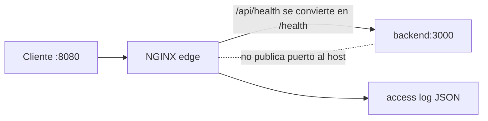

# Módulo 0: Linux y shell scripting para DevOps

## Sílabo

**Objetivo general**

Dominar la terminal de Linux como herramienta principal de trabajo: navegación, permisos, procesos, automatización con scripts bash robustos, y los fundamentos de redes y hardening que sostienen cualquier pipeline DevOps posterior.

**Objetivos específicos**

1. Operar el sistema de archivos y gestionar permisos con `chmod`/`chown`.
2. Gestionar procesos, señales y tareas en segundo plano desde la shell.
3. Combinar `grep`, `awk` y `sed` en pipes para procesar texto y logs.
4. Escribir scripts bash robustos con `set -euo pipefail` y variables de entorno.
5. Programar tareas con `cron` y aplicar hardening básico (SSH, firewall).
6. Explicar el modelo OSI/TCP-IP a un nivel práctico y situar la cultura DevOps en el ciclo completo de entrega de software.
7. Configurar NGINX como proxy inverso, preservar identidad de petición y diagnosticar un `502` desde logs.

**Contenido**

- Sistema de archivos y permisos (`chmod`/`chown`).
- Procesos, señales y jobs en segundo plano.
- Pipes, redirección y filtros (`grep`, `awk`, `sed`).
- Variables de entorno y scripts bash robustos (`set -euo pipefail`).
- Cron y tareas programadas.
- Hardening: SSH sin contraseña, firewalls (`ufw`/`iptables`), SELinux/AppArmor.
- Redes: modelo OSI, TCP/IP, DNS y balanceadores de carga.
- Cultura DevOps y el ciclo Plan→Code→Build→Test→Release→Deploy→Operate→Monitor.
- Servidor frontal con NGINX: proxy inverso, cabeceras, logs y fallos upstream.

**Evaluación**

Un laboratorio de Linux más un proxy inverso reproducible, y cuatro ejercicios de evaluación.

---

## Antes de comenzar: construye un laboratorio seguro

DevOps trabaja intensamente con Linux, incluso si tu computador usa Windows o macOS. Necesitas Git, VS Code, Docker y una shell compatible. Practicaremos en local para no generar costos ni modificar servidores reales.

### Windows

Activa WSL 2 con `wsl --install`, reinicia y crea un usuario Ubuntu. Instala Docker Desktop usando el backend WSL 2 y VS Code con la extensión WSL. Ejecuta los comandos Linux dentro de Ubuntu, no mezclando rutas de PowerShell y WSL en un mismo proyecto.

### macOS

Instala Homebrew, luego `brew install git` y Docker Desktop. La terminal usa zsh; la mayoría de scripts Bash del curso funcionarán igual. En Macs Apple Silicon elige imágenes Docker multi-arquitectura o `arm64`.

### Linux (Ubuntu/Debian)

Ejecuta `sudo apt update && sudo apt install -y git curl make`; instala Docker Engine desde el repositorio oficial de Docker y agrega tu usuario al grupo `docker`. Cierra y abre sesión después.

Verifica el laboratorio:

```bash
git --version
docker --version
docker compose version
docker run --rm hello-world
```

Aprende antes estos cuatro comandos seguros: `pwd` muestra dónde estás, `ls` lista archivos, `cd` cambia de carpeta y `mkdir` crea una carpeta. Comprueba siempre `pwd` antes de usar comandos que borren o cambien permisos. Nunca pegues un comando con `sudo` sin entender cada argumento.

## Contenido teórico

### Tema 1: Sistema de archivos y permisos (chmod/chown)

**Conceptos clave:** propietario, grupo, otros, permisos de lectura/escritura/ejecución, notación octal.

En Linux, cada archivo y directorio tiene un propietario (owner), un grupo (group), y un conjunto de permisos definidos para tres categorías de identidad: el propietario, los miembros del grupo, y todos los demás usuarios del sistema (others). Para cada una de esas tres categorías existen tres permisos posibles: lectura (`r`), escritura (`w`) y ejecución (`x`). La salida de `ls -l` muestra estos nueve bits como una cadena de caracteres como `rwxr-xr--`, donde los primeros tres caracteres son los permisos del propietario, los siguientes tres los del grupo, y los últimos tres los de otros.

`chmod` modifica estos permisos, y admite dos notaciones: la simbólica (`chmod u+x archivo` añade permiso de ejecución al propietario) y la octal (`chmod 755 archivo`, donde cada dígito representa la suma de los valores 4=lectura, 2=escritura, 1=ejecución para cada categoría; 7 = 4+2+1 = lectura+escritura+ejecución, 5 = 4+1 = lectura+ejecución). La notación octal es la más usada en scripts y documentación porque es más compacta y menos ambigua de comunicar por escrito que la simbólica.

`chown` cambia el propietario (y opcionalmente el grupo) de un archivo: `chown usuario:grupo archivo`. Esta operación normalmente requiere privilegios de superusuario (`sudo`) si el archivo no te pertenece ya, precisamente porque cambiar la propiedad de un archivo es una operación sensible que podría usarse para eludir restricciones de acceso si cualquier usuario pudiera hacerlo libremente sobre archivos ajenos.

En el contexto de DevOps, entender permisos correctamente es crítico porque una configuración de permisos incorrecta es una de las causas más comunes tanto de fallos de despliegue ("permission denied" al ejecutar un script en un servidor) como de vulnerabilidades de seguridad reales (un archivo de configuración con credenciales legible por "otros" en un servidor compartido). La práctica estándar de la industria es aplicar el mismo principio de mínimo privilegio que vas a ver formalizado en el track Cloud: conceder solo los permisos estrictamente necesarios (por ejemplo, `600` para un archivo con credenciales, legible y escribible solo por su propietario, sin ningún permiso para grupo u otros).

**Analogía:** los permisos de Linux son como las llaves de un edificio de oficinas compartido: tú (propietario) tienes la llave maestra de tu propia oficina, tu equipo (grupo) tiene una llave que abre ciertas puertas comunes, y cualquier otra persona del edificio (otros) puede o no tener acceso a esas mismas puertas según cómo configures la cerradura. `chmod 600` sería como cerrar tu oficina con una llave que solo tú tienes, sin dar copias ni siquiera a tu propio equipo.

**¿Por qué es importante?** En cualquier pipeline de CI/CD o servidor de producción, un error de permisos —un script no ejecutable, un archivo de credenciales legible por cualquiera— es de los fallos más comunes y a la vez más rápidos de diagnosticar si entiendes bien este modelo. Es, con diferencia, uno de los primeros conceptos que cualquier ingeniero DevOps necesita dominar de forma reflexiva, no memorizada.

**Diagrama:**

```
-rwxr-xr--  1 nicolas  devops   script.sh
 │└┬┘└┬┘└┬┘
 │ │  │   └─ otros: r-- (solo lectura)
 │ │  └───── grupo: r-x (lectura + ejecución)
 │ └──────── propietario: rwx (lectura+escritura+ejecución)
 └────────── tipo de archivo (- = archivo regular, d = directorio)

chmod 754 script.sh   →   7=rwx (dueño) 5=r-x (grupo) 4=r-- (otros)
```

### Tema 2: Procesos, señales y jobs en segundo plano

**Conceptos clave:** proceso, PID, señal (SIGTERM/SIGKILL/SIGHUP), job en segundo plano, `&`, `jobs`, `kill`.

Cada programa en ejecución en Linux es un proceso, identificado por un número único llamado PID (Process ID). Un proceso puede lanzarse en primer plano (bloqueando la terminal hasta que termina) o en segundo plano añadiendo `&` al final del comando, lo que libera la terminal inmediatamente mientras el proceso sigue ejecutándose. `jobs` lista los procesos en segundo plano lanzados desde esa misma sesión de terminal, y `fg`/`bg` los traen de vuelta a primer o segundo plano respectivamente.

Las señales son el mecanismo por el que el sistema operativo (o tú, explícitamente) comunica eventos a un proceso en ejecución. `SIGTERM` (la señal por defecto de `kill <pid>`) le pide educadamente al proceso que termine, dándole la oportunidad de cerrar archivos abiertos, liberar recursos, y salir de forma ordenada; un proceso bien escrito captura esta señal y hace una limpieza antes de terminar. `SIGKILL` (`kill -9 <pid>`) es una señal que el proceso no puede capturar ni ignorar: el kernel lo termina inmediatamente sin darle ninguna oportunidad de limpieza, lo cual puede dejar recursos en un estado inconsistente (archivos temporales sin borrar, conexiones de red a medio cerrar). `SIGHUP` tradicionalmente indicaba que la terminal controladora se había cerrado, y muchos daemons la reinterpretan hoy como una señal de "recarga tu configuración sin reiniciar por completo".

La diferencia práctica entre `SIGTERM` y `SIGKILL` es exactamente la diferencia entre pedirle a alguien que termine su trabajo con calma y sacarlo a la fuerza de la sala: la primera opción es siempre la preferida en operación normal (por ejemplo, cuando Kubernetes detiene un Pod, primero envía `SIGTERM` y solo después de un plazo de gracia sin respuesta envía `SIGKILL`), y depender de `SIGKILL` como primera opción es una señal de que algo en el diseño del proceso no está gestionando bien su ciclo de vida.

Entender procesos y señales es la base para depurar situaciones reales como un servidor que no libera un puerto porque un proceso anterior quedó "zombi" o colgado, o diseñar correctamente el apagado ordenado (graceful shutdown) de un servicio, algo que se vuelve crítico cuando ese mismo servicio corre dentro de un contenedor Docker o un Pod de Kubernetes, temas que verás en detalle más adelante en este mismo track.

**Analogía:** `SIGTERM` es como tocar la puerta de una reunión y avisar "por favor, termina lo que estás haciendo y sal en los próximos minutos"; la persona puede guardar su trabajo antes de salir. `SIGKILL` es como cortar la electricidad de la sala de reuniones sin previo aviso: la reunión termina instantáneamente, pero cualquier cosa que no se había guardado se pierde.

**¿Por qué es importante?** Diseñar servicios que respondan correctamente a `SIGTERM` (cerrando conexiones activas, terminando de procesar la petición en curso, liberando recursos) en vez de depender de que el orquestador los mate con `SIGKILL` es una de las diferencias prácticas entre un servicio que se despliega sin downtime perceptible y uno que corta peticiones a medias en cada despliegue.

**Diagrama:**

```
kill <pid>       ──▶  SIGTERM  ──▶  el proceso puede capturarla y cerrar ordenadamente
kill -9 <pid>    ──▶  SIGKILL  ──▶  el kernel termina el proceso, sin oportunidad de limpieza
comando &        ──▶  proceso lanzado en segundo plano, terminal libre
jobs             ──▶  lista procesos en segundo plano de esta sesión
```

### Tema 3: Pipes, redirección y filtros (grep, awk, sed)

**Conceptos clave:** pipe (`|`), redirección (`>`, `>>`, `<`), `grep`, `awk`, `sed`, procesamiento de texto en flujo.

Un pipe (`|`) conecta la salida estándar de un comando con la entrada estándar del siguiente, permitiendo encadenar herramientas pequeñas y especializadas para construir transformaciones de texto complejas sin escribir un programa dedicado. Esta filosofía de "herramientas pequeñas que hacen una cosa bien y se combinan entre sí" es uno de los principios de diseño fundacionales de Unix, y sigue siendo la forma más rápida de procesar logs y archivos de texto en cualquier tarea DevOps del día a día.

`grep` busca líneas que coincidan con un patrón (literal o una expresión regular): `grep "ERROR" app.log` imprime solo las líneas que contienen la palabra "ERROR". `awk` es un lenguaje de procesamiento de texto orientado a columnas: `awk '{print $1, $3}'` imprime la primera y tercera columna de cada línea (usando espacios como separador por defecto), y admite lógica de condiciones y agregaciones (sumar una columna numérica de todo un archivo, por ejemplo). `sed` (stream editor) transforma texto línea por línea, típicamente para sustituciones: `sed 's/error/ERROR/g'` reemplaza todas las ocurrencias de "error" por "ERROR" en cada línea que pasa por él.

La redirección, distinta del pipe, conecta un comando con un archivo en vez de con otro comando: `comando > archivo.txt` escribe la salida en el archivo (sobrescribiéndolo si ya existe), `comando >> archivo.txt` añade al final sin sobrescribir, y `comando < archivo.txt` usa el archivo como entrada. Combinar redirección con pipes es habitual: `grep "ERROR" app.log | awk '{print $1}' | sort | uniq -c` es una cadena típica que filtra líneas de error, extrae una columna (por ejemplo, la marca de tiempo o el código de error), y cuenta cuántas veces aparece cada valor único, todo en una sola línea de comando sin escribir ningún script.

Dominar esta combinación de `grep`/`awk`/`sed` conectados por pipes es una de las habilidades más transferibles y de mayor retorno inmediato en el trabajo diario de cualquier perfil DevOps o SRE: la inmensa mayoría de las tareas de diagnóstico rápido sobre logs de texto plano en un servidor —sin acceso a un sistema de observabilidad centralizado como el que vas a construir más adelante en este track— se resuelven con una combinación de estos tres comandos.

**Analogía:** un pipe es como una línea de ensamblaje donde cada estación (comando) hace una única tarea específica sobre la pieza que recibe de la estación anterior, y la pasa transformada a la siguiente: una estación filtra piezas defectuosas (`grep`), otra extrae solo cierta parte de cada pieza (`awk`), otra la retoca (`sed`). Ninguna estación necesita saber nada de las demás, solo recibir la pieza y entregarla transformada.

**¿Por qué es importante?** Antes de tener un sistema de observabilidad centralizado (que vas a construir en un módulo posterior de este mismo track), esta combinación de herramientas de línea de comandos es, en la práctica, la primera línea de diagnóstico de cualquier ingeniero cuando algo falla en un servidor: revisar logs rápidamente por SSH, sin depender de ninguna herramienta adicional instalada.

**Diagrama:**

```
cat app.log | grep "ERROR" | awk '{print $1}' | sort | uniq -c
   │            │              │                │        │
   │            │              │                │        └─ cuenta ocurrencias únicas
   │            │              │                └────────── ordena
   │            │              └─────────────────────────── extrae 1ra columna
   │            └────────────────────────────────────────── filtra líneas con "ERROR"
   └─────────────────────────────────────────────────────── lee el archivo completo
```

### Tema 4: Variables de entorno y scripts bash robustos (set -euo pipefail)

**Conceptos clave:** variable de entorno, `export`, `set -e`, `set -u`, `set -o pipefail`, idempotencia de scripts.

Una variable de entorno es un valor con nombre disponible para un proceso y, si se exporta con `export`, para cualquier proceso hijo que ese proceso lance. Los scripts bash las usan constantemente para parametrizar comportamiento sin hardcodear valores (por ejemplo, un script de despliegue que lee `$ENTORNO` para decidir si despliega a `staging` o `produccion`).

Por defecto, bash tiene un comportamiento sorprendentemente permisivo con los errores: si un comando dentro de un script falla, bash simplemente continúa ejecutando la siguiente línea, como si nada hubiera pasado, a menos que le indiques explícitamente lo contrario. Esto es peligroso en scripts de automatización, donde un fallo silencioso a mitad de un script (por ejemplo, un `cd` a un directorio que no existe) puede hacer que las líneas siguientes se ejecuten en el directorio equivocado, con consecuencias potencialmente destructivas.

`set -e` cambia este comportamiento: el script se detiene inmediatamente en cuanto cualquier comando devuelve un código de salida distinto de cero (un fallo). `set -u` hace que el script falle si intenta usar una variable que nunca fue definida, en vez de silenciosamente tratarla como una cadena vacía (lo que podría, por ejemplo, convertir `rm -rf "$DIRECTORIO_VACIO_POR_ERROR"/*` en un desastroso `rm -rf /*` si la variable estaba vacía por un error tipográfico). `set -o pipefail` corrige un caso especial: sin esta opción, una cadena de comandos conectados por pipes solo reporta el código de salida del último comando de la cadena, ocultando un fallo en cualquier comando anterior del pipe; con `pipefail`, si cualquier comando de la cadena falla, todo el pipe se considera fallido.

La combinación `set -euo pipefail` al inicio de cualquier script bash de automatización real —tan común que se conoce coloquialmente como "modo estricto de bash"— convierte un script frágil, que puede fallar silenciosamente y seguir ejecutando pasos posteriores sobre un estado incorrecto, en uno que se detiene inmediata y ruidosamente ante el primer problema, exactamente el comportamiento que quieres en cualquier script que toque infraestructura real, un despliegue, o datos de producción.

**Analogía:** un script sin `set -euo pipefail` es como un trabajador que, si se equivoca en un paso de una receta, simplemente sigue con el siguiente paso de todas formas, sin avisar a nadie que algo salió mal, entregando al final un plato potencialmente arruinado sin que nadie lo sepa hasta que alguien lo prueba. Con `set -euo pipefail`, ese mismo trabajador se detiene y avisa inmediatamente en cuanto algo no sale como se esperaba, antes de seguir arruinando los pasos siguientes.

**¿Por qué es importante?** La ausencia de `set -euo pipefail` (o su equivalente) en scripts de automatización reales es una fuente extremadamente común de incidentes silenciosos en producción: un script de despliegue que "parece" haber terminado bien, pero en realidad falló en un paso intermedio y siguió ejecutando el resto sobre un estado corrupto. Adoptar esta línea como estándar en cualquier script bash nuevo es una de las prácticas de menor coste y mayor impacto en fiabilidad que existen.

**Diagrama:**

```
#!/bin/bash
set -euo pipefail
#     │││
#     ││└─ pipefail: un pipe falla si CUALQUIER comando de la cadena falla
#     │└── u: falla si usas una variable no definida
#     └─── e: el script se detiene en el primer comando que falle

cd "$DIRECTORIO"      # si $DIRECTORIO no existe o no está definida, el script se detiene aquí
rm -rf "$DIRECTORIO"/*  # nunca se ejecuta sobre un directorio equivocado
```

### Tema 5: Cron y tareas programadas

**Conceptos clave:** crontab, expresión cron (minuto hora día mes día-semana), tarea periódica.

`cron` es el daemon estándar de Linux para ejecutar comandos de forma automática y periódica, sin intervención manual. Cada usuario tiene su propio archivo de configuración (crontab), editable con `crontab -e`, donde cada línea define una tarea con el formato: cinco campos de tiempo (minuto, hora, día del mes, mes, día de la semana) seguidos del comando a ejecutar. Por ejemplo, `*/5 * * * * /ruta/script.sh` ejecuta `script.sh` cada 5 minutos, sin restricción de hora, día del mes, mes o día de la semana (los asteriscos significan "cualquier valor").

Cada uno de los cinco campos acepta valores específicos, rangos, listas, o el comodín `*/N` para "cada N unidades": `0 3 * * *` ejecuta algo a las 3:00 AM todos los días; `0 9 * * 1-5` lo ejecuta a las 9:00 AM solo de lunes a viernes; `0 0 1 * *` lo ejecuta a medianoche el primer día de cada mes. Dominar esta sintaxis compacta es útil porque aparece, con variantes menores, en muchas otras herramientas de programación de tareas más allá de cron puro, incluyendo el EventBridge Scheduler que se menciona en el track Cloud y los CronJobs de Kubernetes que vas a estudiar más adelante en este mismo track.

Un detalle operativo importante de cron es que las tareas se ejecutan con un entorno mínimo, sin las variables de entorno ni el `PATH` completo que tendrías en una sesión interactiva de terminal: un script que funciona perfectamente cuando lo ejecutas manualmente puede fallar silenciosamente bajo cron simplemente porque no encuentra un comando en su `PATH` reducido, o porque depende de una variable de entorno que solo existía en tu sesión interactiva. La práctica recomendada es usar siempre rutas absolutas dentro de scripts destinados a cron, y redirigir explícitamente su salida a un archivo de log (`>> /var/log/mi-script.log 2>&1`) para poder diagnosticar fallos, ya que cron no muestra la salida en ninguna terminal por defecto.

**Analogía:** cron es como un despertador programable con múltiples alarmas: puedes configurar una alarma que suene "cada 5 minutos", otra "todos los días a las 3 AM", y otra "el primer lunes de cada mes", y el despertador las dispara automáticamente sin que nadie tenga que estar pendiente del reloj.

**¿Por qué es importante?** Prácticamente cualquier sistema real necesita tareas de mantenimiento periódico —rotación de logs, backups, limpieza de archivos temporales, sincronización de datos—, y cron (o sus equivalentes más modernos en Kubernetes o en la nube) es la herramienta fundacional para ese patrón. Entender su sintaxis y sus particularidades operativas (entorno mínimo, necesidad de rutas absolutas) evita el clásico "funciona cuando lo ejecuto yo, pero no cuando lo ejecuta cron".

**Diagrama:**

```
*/5 * * * *  /ruta/script.sh
 │  │ │ │ │
 │  │ │ │ └── día de la semana (0-6, 0=domingo)
 │  │ │ └──── mes (1-12)
 │  │ └────── día del mes (1-31)
 │  └───────── hora (0-23)
 └──────────── minuto (0-59, */5 = cada 5 minutos)
```

### Tema 6: Hardening básico — SSH sin contraseña, firewalls, SELinux/AppArmor

**Conceptos clave:** autenticación por clave pública SSH, `ufw`/`iptables`, SELinux, AppArmor, control de acceso obligatorio.

El acceso remoto por SSH usando solo contraseña es vulnerable a ataques de fuerza bruta (probar contraseñas repetidamente hasta acertar) y depende enteramente de la fortaleza de esa contraseña. La autenticación por clave pública resuelve esto de raíz: generas un par de claves (una privada, que nunca sale de tu máquina, y una pública, que copias al servidor), y el servidor verifica criptográficamente que quien se conecta posee la clave privada correspondiente a una clave pública ya autorizada, sin que ninguna contraseña viaje por la red ni deba memorizarse. Deshabilitar completamente la autenticación por contraseña en el servidor (dejando solo autenticación por clave) es una práctica de hardening estándar una vez que confirmas que el acceso por clave funciona correctamente.

Un firewall filtra el tráfico de red permitiendo o bloqueando conexiones según reglas explícitas, normalmente basadas en puerto, protocolo y origen. `ufw` (uncomplicated firewall) es una interfaz simplificada sobre `iptables`, pensada para configurar reglas comunes sin memorizar la sintaxis más verbosa de `iptables` directamente: `ufw allow 22/tcp` permite SSH, `ufw allow 80,443/tcp` permite tráfico web, y `ufw enable` activa el firewall con una política por defecto de denegar todo lo no permitido explícitamente, aplicando exactamente el principio de "denegado por defecto" que ya viste (o verás) formalizado en el contexto de IAM en el track Cloud.

SELinux (en distribuciones basadas en Red Hat) y AppArmor (en distribuciones basadas en Debian/Ubuntu) implementan control de acceso obligatorio (mandatory access control): van más allá de los permisos tradicionales de archivo del Tema 1, aplicando políticas que restringen qué puede hacer un proceso específico —incluso si ese proceso corre con privilegios de superusuario—, limitando el daño potencial si ese proceso es comprometido. Por ejemplo, una política de AppArmor puede restringir a un servidor web para que solo pueda leer archivos de un directorio específico, aunque técnicamente corra con permisos que en teoría le permitirían leer cualquier archivo del sistema.

**Analogía:** la autenticación SSH por clave es como reemplazar la cerradura de una puerta (que cualquiera con la combinación correcta de números puede abrir) por un lector biométrico que solo reconoce tu huella específica: mucho más difícil de falsificar que adivinar una combinación. El firewall es como un guardia en la entrada del edificio que solo deja pasar a quienes tienen cita en las puertas autorizadas, rechazando por defecto a cualquiera que no esté en la lista. SELinux/AppArmor son como restringir, incluso para el propio personal de seguridad del edificio, a qué áreas específicas puede entrar cada uno según su función, en vez de darle acceso irrestricto a todo el edificio solo por ser parte de la seguridad.

**¿Por qué es importante?** Estos tres mecanismos de hardening —autenticación fuerte, firewall con denegación por defecto, y control de acceso obligatorio— son la base mínima de seguridad de cualquier servidor expuesto a internet, y forman parte del checklist estándar de cualquier proceso de aprovisionamiento de infraestructura real, mucho antes de llegar a las capas de seguridad más específicas de aplicación o de nube que vas a ver en otros módulos y tracks.

**Diagrama:**

```
┌─────────────────────────────────────────────────┐
│  Capa 1: Autenticación SSH por clave pública        │
│           (sin contraseñas expuestas a fuerza bruta) │
├─────────────────────────────────────────────────┤
│  Capa 2: Firewall (ufw/iptables)                     │
│           (deniega todo excepto lo explícitamente     │
│            permitido: puertos 22, 80, 443, etc.)      │
├─────────────────────────────────────────────────┤
│  Capa 3: SELinux / AppArmor                          │
│           (limita qué puede hacer cada proceso,        │
│            incluso si corre con privilegios altos)     │
└─────────────────────────────────────────────────┘
```

### Tema 7: Redes — modelo OSI, TCP/IP, DNS y balanceadores de carga

**Conceptos clave:** modelo OSI, TCP/IP, resolución DNS, balanceador de carga.

El modelo OSI describe la comunicación de red en siete capas conceptuales, de las cuales, en el trabajo diario de DevOps, las más relevantes son la capa de red (donde operan las direcciones IP), la capa de transporte (donde operan TCP y UDP, gestionando conexiones fiables o no fiables respectivamente), y la capa de aplicación (donde operan protocolos como HTTP, DNS o SSH). El modelo TCP/IP, más práctico y el que realmente implementa internet, condensa estas ideas en menos capas, pero el vocabulario del modelo OSI ("capa 3", "capa 4", "capa 7") sigue siendo el lenguaje común de la industria para describir en qué nivel opera una herramienta concreta (por ejemplo, "un balanceador de capa 4" frente a "un balanceador de capa 7").

DNS (Domain Name System) traduce nombres legibles por humanos (`ejemplo.com`) a direcciones IP que las máquinas usan realmente para enrutar tráfico. Esta resolución ocurre en varios pasos jerárquicos (servidores raíz, servidores de dominio de nivel superior, servidores autoritativos del dominio específico), pero en la práctica diaria de DevOps lo más relevante es entender que los registros DNS (tipo `A` para IPv4, `CNAME` para alias, `TXT` para verificación, entre otros) son configuración que debe gestionarse con el mismo cuidado que cualquier otra infraestructura, y que los cambios de DNS tardan en propagarse según el TTL (tiempo de vida) configurado en cada registro, algo que explica por qué un cambio de DNS no siempre es visible instantáneamente para todos los usuarios.

Un balanceador de carga distribuye el tráfico entrante entre múltiples instancias de un mismo servicio, tanto para repartir la carga de trabajo como para dar tolerancia a fallos (si una instancia falla, el balanceador deja de enviarle tráfico, sin que el resto del sistema se vea afectado). Un balanceador de capa 4 opera a nivel de conexión TCP/UDP, sin inspeccionar el contenido de la petición; un balanceador de capa 7 opera a nivel de aplicación (HTTP), pudiendo tomar decisiones de enrutamiento más sofisticadas basadas en la ruta de la URL, las cabeceras, o las cookies de la petición, al coste de un procesamiento algo más costoso por petición.

**Analogía:** el modelo OSI es como las distintas capas de un sistema postal: una capa se encarga de la dirección física del edificio (red/IP), otra de que el paquete llegue completo y en orden (transporte/TCP), y otra del contenido específico de la carta (aplicación/HTTP). DNS es como una guía telefónica que traduce un nombre de empresa a su dirección física real. Un balanceador de carga es como un recepcionista en la entrada de un complejo de oficinas con varias sedes idénticas, que dirige a cada visitante a la sede con menos fila en ese momento, y deja de enviar visitantes a cualquier sede que esté cerrada por mantenimiento.

**¿Por qué es importante?** Entender redes a este nivel práctico —sin necesidad de ser un experto en protocolos de bajo nivel— es indispensable para diagnosticar problemas comunes de despliegue: por qué un servicio no es alcanzable desde otro, por qué un cambio de DNS no se refleja de inmediato, o cómo diseñar correctamente el balanceo de tráfico hacia múltiples réplicas de un servicio, un concepto que reaparece directamente cuando trabajes con Services de Kubernetes más adelante en este track.

**Diagrama:**

```
Cliente ──▶ DNS (ejemplo.com → 203.0.113.10) ──▶ Balanceador de carga
                                                        │
                                    ┌───────────────────┼───────────────────┐
                                    ▼                    ▼                    ▼
                              Instancia 1          Instancia 2          Instancia 3
                              (recibe parte         (recibe parte         (recibe parte
                               del tráfico)           del tráfico)           del tráfico)
```

### Tema 8: Cultura DevOps y el ciclo Plan→Code→Build→Test→Release→Deploy→Operate→Monitor

**Conceptos clave:** cultura DevOps, ciclo de vida infinito, colaboración Dev+Ops, retroalimentación continua.

DevOps no es, ante todo, una herramienta ni un conjunto de comandos: es una cultura y un conjunto de prácticas que buscan eliminar la separación tradicional entre los equipos de desarrollo (Dev, que escriben código) y los de operaciones (Ops, que mantienen la infraestructura en producción), unificando la responsabilidad de que el software funcione bien de principio a fin, no solo "hasta que se entrega a producción". Esta separación tradicional generaba fricciones estructurales: el equipo de Dev optimizaba por lanzar funcionalidades rápido, el equipo de Ops optimizaba por estabilidad y evitar cambios, y ambos incentivos chocaban constantemente.

El ciclo Plan→Code→Build→Test→Release→Deploy→Operate→Monitor, representado habitualmente como un símbolo de infinito, ilustra que estas fases no son un proceso lineal de una sola pasada, sino un flujo continuo: lo que se observa en la fase de Monitor retroalimenta directamente la siguiente fase de Plan, cerrando el ciclo. Planificar (Plan) define qué se va a construir; programar (Code) lo implementa; construir (Build) lo empaqueta de forma reproducible (exactamente lo que vas a practicar con Docker en el Tema 2 del siguiente módulo); probar (Test) verifica que funciona correctamente; liberar (Release) y desplegar (Deploy) lo llevan a producción; operar (Operate) lo mantiene funcionando; y monitorear (Monitor) observa su comportamiento real, generando información que alimenta la siguiente iteración de planificación.

Cada uno de los módulos siguientes de este track —Git, Docker, CI, CD, Kubernetes, Terraform, observabilidad, logging, seguridad— corresponde a una o varias fases concretas de este ciclo, y el proyecto final del track (el pipeline CI/CD completo) es, literalmente, una implementación funcional de este ciclo de principio a fin. Entender esta cultura antes de aprender las herramientas específicas es lo que te permite ver cada herramienta no como un fin en sí mismo, sino como el medio para sostener un flujo continuo y confiable de valor desde el código hasta el usuario final, con retroalimentación constante entre ambos extremos.

**Analogía:** la cultura DevOps es como pasar de una fábrica organizada en departamentos aislados que se pasan el trabajo por encima del muro (diseño termina su parte y "la lanza" a producción, sin saber ni preocuparse de qué pasa después) a una línea de producción integrada donde el mismo equipo extendido observa el producto terminado en uso real, y esa observación alimenta directamente el siguiente ciclo de diseño, sin que la información se pierda entre departamentos que no se hablan.

**¿Por qué es importante?** Sin esta comprensión cultural de fondo, es fácil aprender herramientas de DevOps (Docker, Kubernetes, Terraform, Prometheus) de forma aislada, como comandos sueltos, sin entender por qué existen ni cómo encajan entre sí. Entender el ciclo completo desde el Módulo 0 te da el mapa mental sobre el cual vas a ir colocando cada herramienta nueva a medida que avances en el resto de este track.

**Diagrama:**

```
        ┌─────── Plan ───────┐
        │                     │
    Monitor                  Code
        │                     │
    Operate                Build
        │                     │
     Deploy ── Release ── Test
        (ciclo continuo, no lineal — lo que se observa
         en Monitor retroalimenta el siguiente Plan)
```

### Tema 9: NGINX y proxies desde cero

**Conceptos clave:** servidor web, proxy directo, proxy inverso, upstream, terminación TLS, cabeceras reenviadas, access log, error log y `502 Bad Gateway`.

Construiremos la entrada local de RutaFlow. El navegador llamará a `http://localhost:8080/api/health`; NGINX recibirá la petición y la reenviará al backend sin exponer su puerto directamente. Esto prepara el modelo mental para balanceadores cloud e Ingress/Gateway de Kubernetes.

Un **proxy directo** representa al cliente: una organización puede obligar a sus equipos a salir a internet por él para aplicar políticas. Un **proxy inverso** representa a servidores: recibe tráfico público y decide qué backend interno atiende. NGINX puede servir archivos estáticos y actuar como proxy inverso; no confundas esta función con que la aplicación de negocio «viva dentro de NGINX».

**Requisitos previos:** Docker y Compose funcionando. Crea:

```text
labs/nginx-rutaflow/
├── compose.yaml
├── nginx/default.conf
└── backend/server.js
```

En `backend/server.js`, crea un backend mínimo que devuelve la identidad de la instancia y el correlation ID recibido:

```js
const http = require('node:http');
const instance = process.env.INSTANCE_NAME ?? 'unknown';

http.createServer((request, response) => {
  if (request.url !== '/health') {
    response.writeHead(404).end('not found');
    return;
  }
  response.writeHead(200, {'content-type': 'application/json'});
  response.end(JSON.stringify({
    status: 'ok',
    instance,
    requestId: request.headers['x-request-id'] ?? null
  }));
}).listen(3000, '0.0.0.0');
```

En `nginx/default.conf`, define un upstream por nombre DNS de Compose. `proxy_set_header Host` conserva el host solicitado; `X-Forwarded-For` añade la IP del cliente a la cadena; `X-Forwarded-Proto` informa si la entrada original fue HTTP o HTTPS. La aplicación solo debe confiar en estas cabeceras cuando provienen de proxies conocidos, porque un cliente puede falsificarlas si llega directamente.

```nginx
upstream rutaflow_api {
    server backend:3000 max_fails=3 fail_timeout=10s;
    keepalive 16;
}

log_format rutaflow_json escape=json
  '{"time":"$time_iso8601","request_id":"$request_id",'
  '"status":$status,"method":"$request_method","uri":"$uri",'
  '"upstream":"$upstream_addr","upstream_time":"$upstream_response_time"}';

server {
    listen 80;
    access_log /var/log/nginx/access.log rutaflow_json;

    location /api/ {
        proxy_pass http://rutaflow_api/;
        proxy_http_version 1.1;
        proxy_set_header Connection "";
        proxy_set_header Host $host;
        proxy_set_header X-Request-ID $request_id;
        proxy_set_header X-Forwarded-For $proxy_add_x_forwarded_for;
        proxy_set_header X-Forwarded-Proto $scheme;
        proxy_connect_timeout 2s;
        proxy_read_timeout 5s;
    }
}
```

`proxy_pass http://rutaflow_api/;` incluye una barra final: dentro de `location /api/` reemplaza ese prefijo, por lo que `/api/health` llega como `/health`. Sin la barra, el backend recibiría `/api/health`. Esta diferencia debe ser una decisión, no prueba y error.

En `compose.yaml` conecta ambos servicios en una red privada y publica solamente NGINX:

```yaml
services:
  backend:
    image: node:20-alpine
    working_dir: /app
    command: ["node", "server.js"]
    environment:
      INSTANCE_NAME: backend-a
    volumes:
      - ./backend:/app:ro
    expose: ["3000"]

  edge:
    image: nginx:1.27-alpine
    ports: ["8080:80"]
    volumes:
      - ./nginx/default.conf:/etc/nginx/conf.d/default.conf:ro
    depends_on: [backend]
```



**Analogía:** el proxy inverso es la recepción del edificio: conoce qué oficina interna atiende cada solicitud y registra el recorrido. El visitante no necesita ni debería conocer la puerta privada de cada oficina.

**¿Por qué es importante?** Centralizar entrada permite aplicar TLS, límites y observabilidad sin duplicarlos en cada servicio, pero también crea una dependencia crítica. Timeouts, logs y pruebas de fallo son necesarios para no convertir el proxy en una caja negra.

**Ejecución y resultado esperado:** desde `labs/nginx-rutaflow` ejecuta `docker compose up -d`, `curl -i http://localhost:8080/api/health` y `docker compose logs edge`. Debes recibir `200`, `instance: backend-a` y un `requestId`; el puerto `3000` no debe responder desde el host.

**Fallo deliberado:** ejecuta `docker compose stop backend` y repite `curl`. Debes observar `502 Bad Gateway`; inspecciona `docker compose logs edge` y relaciona `connect() failed` con el upstream detenido. Inicia el backend, repite hasta obtener `200` y registra tiempo de detección y recuperación.

**Modificación sin copiar:** agrega `backend-b`, configura pesos 80/20 y ejecuta 100 peticiones. Cuenta respuestas por `instance`; explica por qué una muestra pequeña no demuestra exactamente la proporción y cómo añadirías health checks y TLS en producción.

---

## Ruta de proyecto progresivo desde carpeta vacía

No crees un proyecto desechable por módulo. Conserva un único repositorio que evoluciona durante todo el track y etiqueta cada hito (`git tag modulo-N`). Empieza con `mkdir academia-devops && cd academia-devops && git init`. Ejecuta el comando paso a paso, inspecciona los archivos generados y registra versiones y precondiciones en el README.

| Hito | Evolución acumulativa | Evidencia antes de avanzar |
|---|---|---|
| Base | scripts y contenedores. | Arranque reproducible, commit limpio y prueba mínima. |
| Aplicación | CI/CD, Kubernetes e IaC. | Casos normales, límite y error automatizados. |
| Integración | Conecta capas y reemplaza dobles por infraestructura controlada. | Diagrama, contratos y prueba de integración. |
| Experto | SLO, incidentes y supply chain. | Perfil o threat model, telemetría y runbook de recuperación. |

Al iniciar cada laboratorio crea una rama `modulo-N`, implementa el incremento, verifica el criterio de éxito y fusiona solo con pruebas verdes. Si un módulo necesita un experimento aislado, colócalo en `experiments/modulo-N/`; el producto acumulativo permanece ejecutable. Al terminar, otra persona debe poder clonar el repositorio y reproducir el último hito siguiendo únicamente el README.

## Criterio transversal de calidad del código

Aplica estas decisiones en todos los ejemplos y en tu entrega:

- usa nombres que expresen intención, dominio y unidades; evita `data`, `temp`, `manager` o `process` cuando exista un término preciso;
- mantén funciones, componentes, clases, consultas y módulos cohesionados alrededor de una responsabilidad comprobable;
- haz visibles las dependencias y los efectos de red, tiempo, archivos, estado y base de datos;
- valida entradas en la frontera y representa errores con contexto, sin ocultar la causa ni registrar secretos;
- elimina duplicación de reglas, no toda repetición textual; una abstracción incorrecta cuesta más que dos líneas parecidas;
- escribe primero la solución más simple que satisface el requisito y refactoriza con pruebas verdes;
- aplica SOLID únicamente cuando exista una necesidad real de cambio, extensión, sustitución o aislamiento.

**SOLID con criterio:** responsabilidad única significa una razón coherente de cambio, no una clase por función. Abierto/cerrado justifica estrategias cuando hay variantes reales. Sustitución exige respetar contratos. Segregación evita obligar a consumidores a depender de operaciones que no usan. Inversión de dependencias protege el dominio frente a detalles externos; no exige crear interfaces para cada objeto.

**Comprobación antes de continuar:** ¿otra persona puede entender los nombres y el flujo?, ¿los casos de error son observables?, ¿una prueba demuestra la regla principal?, ¿cada abstracción aporta más claridad de la que cuesta? Registra una decisión de refactorización y una decisión consciente de *no abstraer*.

## Laboratorio práctico

**Objetivo del laboratorio:** escribir un script bash idempotente (que se puede ejecutar varias veces sin causar efectos indeseados) que prepara un entorno de desarrollo desde cero, aplicando permisos correctos, manejo robusto de errores, y verificación de cada paso.

**Requisitos previos:** una terminal Linux o macOS (o WSL en Windows), acceso de lectura/escritura a tu directorio de usuario.

| Paso | Acción | Comando | Explicación | Salida esperada |
|---|---|---|---|---|
| 1 | Crear el archivo del script | Crea `preparar-entorno.sh` con `#!/bin/bash` y `set -euo pipefail` en las dos primeras líneas | Activa el modo estricto de bash desde el inicio del script | El archivo se guarda sin errores |
| 2 | Dar permisos de ejecución | `chmod 755 preparar-entorno.sh` | El propietario puede leer/escribir/ejecutar; grupo y otros solo pueden leer/ejecutar | `ls -l` muestra `rwxr-xr-x` |
| 3 | Añadir una verificación idempotente de directorio | Añade al script:<br>`DIR_PROYECTO="$HOME/mi-proyecto"`<br>`mkdir -p "$DIR_PROYECTO"` | `mkdir -p` no falla si el directorio ya existe, a diferencia de `mkdir` simple; esto hace el script seguro de ejecutar varias veces | Sin errores, se ejecute una o varias veces |
| 4 | Añadir manejo de variable no definida | Añade una línea que use una variable, por ejemplo `echo "Entorno: $ENTORNO"`, SIN definir `ENTORNO` antes, y ejecuta el script | Demuestra en la práctica el efecto de `set -u` | El script falla inmediatamente con un error `unbound variable`, en vez de imprimir una cadena vacía silenciosamente |
| 5 | Corregir definiendo la variable con un valor por defecto | Cambia la línea anterior a `ENTORNO="${ENTORNO:-desarrollo}"` antes del `echo` | La sintaxis `${VAR:-valor}` usa "desarrollo" si `ENTORNO` no está definida, sin fallar | El script imprime `Entorno: desarrollo` sin error |
| 6 | Añadir un paso que dependa de un pipe | Añade: `echo "preparando..." \| tee -a "$DIR_PROYECTO/log.txt"` | Verifica el comportamiento de `pipefail`: si `tee` fallara, todo el pipe se consideraría fallido | El mensaje aparece en pantalla y se añade a `log.txt` |
| 7 | Ejecutar el script completo dos veces seguidas | `./preparar-entorno.sh && ./preparar-entorno.sh` | Confirma la idempotencia: ejecutarlo dos veces no produce ningún error ni efecto duplicado indeseado | Ambas ejecuciones terminan exitosamente, sin errores de "el directorio ya existe" |
| 8 | Levantar NGINX y el backend | Ver Tema 9 | Expone solo `8080`, conserva request ID y verifica `200` |
| 9 | Detener el upstream | Ver Tema 9 | Diagnostica `502` desde error log y recupera el servicio |

**Verificación:** el laboratorio se considera exitoso si el script se ejecuta sin errores tanto la primera vez como en ejecuciones sucesivas (idempotencia), y si forzar una variable no definida (paso 4) efectivamente detiene el script con un error claro, confirmando que `set -euo pipefail` está protegiendo el script como se espera.

**Errores comunes y soluciones**

- **`Permission denied` al intentar ejecutar el script con `./preparar-entorno.sh`.** Falta el permiso de ejecución; revisa con `ls -l` y corrige con `chmod +x preparar-entorno.sh`.
- **El script continúa ejecutándose después de un comando fallido, a pesar de tener `set -e`.** Algunos contextos específicos de bash (como dentro de una condición `if`, o el lado izquierdo de un `&&`) no disparan `set -e` de la misma forma; revisa la documentación de bash sobre las excepciones conocidas de `set -e` si te encuentras con este caso.
- **`unbound variable` en un lugar inesperado del script.** Con `set -u` activo, cualquier variable no definida (incluyendo errores tipográficos en el nombre de una variable) provoca este error; revisa cuidadosamente que el nombre de la variable esté escrito exactamente igual en su definición y en su uso.
- **El script funciona en tu terminal pero falla al programarlo con cron.** Recuerda del Tema 5 que cron ejecuta con un entorno mínimo; usa siempre rutas absolutas dentro de scripts destinados a cron, y no asumas que el `PATH` incluye todo lo que tienes disponible interactivamente.
- **Publicar también el puerto del backend.** Mantén el backend en la red privada y expón solamente el proxy salvo una necesidad de diagnóstico controlada.
- **Aceptar `X-Forwarded-For` de cualquier origen.** Configura proxies confiables; una cabecera enviada directamente por el cliente no prueba identidad.

---


## Rúbrica del proyecto

Esta rúbrica evalúa el laboratorio y los ejercicios como evidencia de dominio, no la mera finalización de pasos.

| Criterio | Peso | Evidencia esperada |
|---|---:|---|
| Comprensión conceptual | 20% | Explica el mecanismo, sus límites y por qué la solución funciona. |
| Implementación funcional | 30% | El artefacto satisface requisitos normales, límite y de error. |
| Verificación | 20% | Incluye pruebas, mediciones o inspecciones reproducibles. |
| Diseño y calidad | 15% | Nombres, estructura, seguridad y mantenibilidad son deliberados. |
| Comunicación profesional | 15% | README, decisiones, comandos y resultados permiten repetir el trabajo. |

Se alcanza competencia con 70/100 y sin cero en implementación o verificación. El nivel experto exige comparar alternativas, justificar trade-offs y reconocer condiciones donde la solución dejaría de ser válida.

## Bibliografía y fundamento académico

Estas fuentes sustentan los conceptos y deben consultarse para verificar detalles que cambian entre versiones:

- CNCF, documentación oficial de Kubernetes, Prometheus y OpenTelemetry.
- HashiCorp, *Terraform Documentation*.
- Beyer et al., *Site Reliability Engineering*; Forsgren et al., *Accelerate*.
- ACM/IEEE-CS/AAAI, *Computer Science Curricula 2023*.
- IEEE Computer Society, *SWEBOK Guide V4.0*.

## Resumen del módulo

**Puntos clave**

- Los permisos de Linux (propietario/grupo/otros × lectura/escritura/ejecución) son la base de la seguridad de archivos y una fuente común de fallos de despliegue si se configuran mal.
- `SIGTERM` permite un cierre ordenado de un proceso; `SIGKILL` lo termina sin darle oportunidad de limpieza.
- `grep`, `awk` y `sed` combinados por pipes son la herramienta de diagnóstico más rápida sobre logs de texto plano.
- `set -euo pipefail` convierte un script bash frágil en uno que se detiene inmediatamente ante el primer error, en vez de continuar silenciosamente sobre un estado incorrecto.
- `cron` programa tareas periódicas, pero corre con un entorno mínimo que exige rutas absolutas y buen manejo de logs.
- El hardening básico (SSH por clave, firewall con denegación por defecto, SELinux/AppArmor) es la base mínima de seguridad de cualquier servidor.
- La cultura DevOps entiende Plan→Code→Build→Test→Release→Deploy→Operate→Monitor como un ciclo continuo, no un proceso lineal de una sola pasada.

**Conceptos aprendidos**

- Permisos de archivo y su notación octal.
- Procesos, señales, y jobs en segundo plano.
- Procesamiento de texto con `grep`, `awk`, `sed` y pipes.
- Scripts bash robustos con `set -euo pipefail`.
- Programación de tareas con `cron`.
- Hardening básico: SSH por clave, firewalls, control de acceso obligatorio.
- Fundamentos prácticos de redes: modelo OSI, DNS, balanceadores de carga.
- La cultura y el ciclo de vida DevOps.

**Próximos pasos**

En el Módulo 1 vas a profundizar en Git más allá de los comandos básicos: estrategias de branching a escala de equipo, rebase interactivo, y las herramientas que te permiten navegar y corregir el historial de un repositorio con confianza.

**Recursos adicionales**

- Documentación del manual de Linux (`man bash`, `man chmod`, `man cron`) como referencia primaria y siempre disponible sin conexión.
- Guía oficial de `ufw` y documentación de `iptables` para hardening de firewall.
- Introducción oficial a DevOps y su ciclo de vida, publicada por las principales plataformas de CI/CD del mercado.
- Ejemplos ejecutables de este track: carpeta [`examples/tracks/devops/`](https://github.com/NICORUIZ93/Academia_Floci/tree/main/examples/tracks/devops) del repositorio — `Dockerfile` (Módulo 2), `docker-compose.yml` (Módulo 3), `ci-pipeline.yml` (Módulo 4), `deployment.yaml` (Módulo 6), `main.tf` (Módulo 8).
