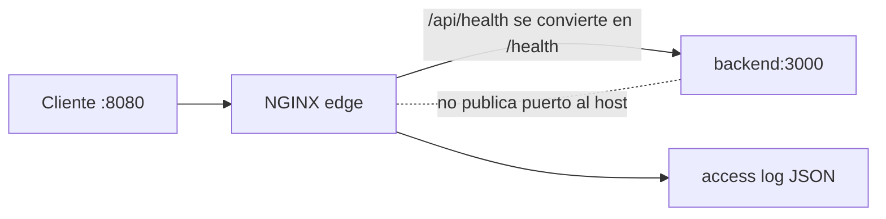

# Módulo 0: Linux y shell scripting para DevOps


## Antes de comenzar: construye un laboratorio seguro

DevOps trabaja intensamente con Linux, incluso si tu computador usa Windows o macOS. Necesitas Git, VS Code, Docker y una shell compatible. Practicaremos en local para no generar costos ni modificar servidores reales.

### Windows

Activa WSL 2 con `wsl --install`, reinicia y crea un usuario Ubuntu. Instala Docker Desktop usando el backend WSL 2 y VS Code con la extensión WSL. Ejecuta los comandos Linux dentro de Ubuntu, no mezclando rutas de PowerShell y WSL en un mismo proyecto.

### macOS

Instala Homebrew, luego `brew install git` y Docker Desktop. La terminal usa zsh; la mayoría de scripts Bash del curso funcionarán igual. En Macs Apple Silicon elige imágenes Docker multi-arquitectura o `arm64`.

### Linux (Ubuntu/Debian)

Ejecuta `sudo apt update && sudo apt install -y git curl make`; instala Docker Engine desde el repositorio oficial de Docker y agrega tu usuario al grupo `docker`. Cierra y abre sesión después.

Verifica el laboratorio:

```bash
git --version
docker --version
docker compose version
docker run --rm hello-world
```

Aprende antes estos cuatro comandos seguros: `pwd` muestra dónde estás, `ls` lista archivos, `cd` cambia de carpeta y `mkdir` crea una carpeta. Comprueba siempre `pwd` antes de usar comandos que borren o cambien permisos. Nunca pegues un comando con `sudo` sin entender cada argumento.

## Aprende construyendo

### Tema 1: Sistema de archivos y permisos (chmod/chown)

#### Paso 1 · Objetivo y preparación

Al finalizar podrás leer la notación de permisos de Linux (`rwxr-xr--`), cambiarla con `chmod` en notación simbólica y octal, y transferir propiedad con `chown`, aplicando el principio de mínimo privilegio a archivos reales.

**Conocimiento previo:** uso básico de terminal (`ls`, `cd`, `pwd`) y Docker instalado según el laboratorio del inicio de este módulo.

#### Paso 2 · Contexto y caso real

**¿Por qué es importante?** Este es un caso real de cualquier pipeline de CI/CD o servidor de producción: un error de permisos —un script no ejecutable, un archivo de credenciales legible por cualquiera— es de los fallos más comunes y a la vez más rápidos de diagnosticar si dominas este modelo de forma reflexiva, no memorizada.

#### Paso 3 · Teoría con analogía

**Conceptos clave:** propietario, grupo, otros, permisos de lectura/escritura/ejecución, notación octal.

En Linux, cada archivo y directorio tiene un propietario (owner), un grupo (group), y un conjunto de permisos definidos para tres categorías de identidad: el propietario, los miembros del grupo, y todos los demás usuarios del sistema (others). Para cada una de esas tres categorías existen tres permisos posibles: lectura (`r`), escritura (`w`) y ejecución (`x`). La salida de `ls -l` muestra estos nueve bits como una cadena de caracteres como `rwxr-xr--`, donde los primeros tres caracteres son los permisos del propietario, los siguientes tres los del grupo, y los últimos tres los de otros.

`chmod` modifica estos permisos, y admite dos notaciones: la simbólica (`chmod u+x archivo` añade permiso de ejecución al propietario) y la octal (`chmod 755 archivo`, donde cada dígito representa la suma de los valores 4=lectura, 2=escritura, 1=ejecución para cada categoría; 7 = 4+2+1 = lectura+escritura+ejecución, 5 = 4+1 = lectura+ejecución). La notación octal es la más usada en scripts y documentación porque es más compacta y menos ambigua de comunicar por escrito que la simbólica.

`chown` cambia el propietario (y opcionalmente el grupo) de un archivo: `chown usuario:grupo archivo`. Esta operación normalmente requiere privilegios de superusuario (`sudo`) si el archivo no te pertenece ya, precisamente porque cambiar la propiedad de un archivo es una operación sensible que podría usarse para eludir restricciones de acceso si cualquier usuario pudiera hacerlo libremente sobre archivos ajenos.

**Analogía:** los permisos de Linux son como las llaves de un edificio de oficinas compartido: tú (propietario) tienes la llave maestra de tu propia oficina, tu equipo (grupo) tiene una llave que abre ciertas puertas comunes, y cualquier otra persona del edificio (otros) puede o no tener acceso a esas mismas puertas según cómo configures la cerradura. `chmod 600` sería como cerrar tu oficina con una llave que solo tú tienes, sin dar copias ni siquiera a tu propio equipo.

**Diagrama:**

```
-rwxr-xr--  1 nicolas  devops   script.sh
 │└┬┘└┬┘└┬┘
 │ │  │   └─ otros: r-- (solo lectura)
 │ │  └───── grupo: r-x (lectura + ejecución)
 │ └──────── propietario: rwx (lectura+escritura+ejecución)
 └────────── tipo de archivo (- = archivo regular, d = directorio)

chmod 754 script.sh   →   7=rwx (dueño) 5=r-x (grupo) 4=r-- (otros)
```

#### Paso 4 · Demostración guiada desde cero

Desde una carpeta vacía crea `academia-devops/src/modulo0/permisos` y un script de prueba:

```bash
mkdir -p academia-devops/src/modulo0/permisos && cd academia-devops/src/modulo0/permisos
cat > script.sh <<'EOF'
#!/bin/bash
echo "hola desde script.sh"
EOF
```

**Explicación línea por línea:** `mkdir -p` crea la carpeta y no falla si ya existe; el heredoc `<<'EOF' ... EOF` escribe el contenido literal del script sin que la shell interprete `$` ni comillas dentro de él.

Ejecuta dentro de un contenedor Alpine desechable para no afectar tu sistema real:

```bash
docker run --rm -v "$(pwd)":/work -w /work alpine sh -c \
  'ls -l script.sh; chmod 600 script.sh; ls -l script.sh; chmod 754 script.sh; ls -l script.sh'
```

**Resultado esperado:** la primera línea muestra los permisos por defecto (normalmente `-rw-r--r--`); tras `chmod 600` verás `-rw-------`; tras `chmod 754` verás `-rwxr-xr--`, exactamente los mismos nueve bits explicados en el diagrama.

**Fallo deliberado:** ejecuta `./script.sh` directamente en tu host inmediatamente después de `chmod 600` (sin el bit de ejecución). Debes ver `Permission denied` — diagnostica con `ls -l script.sh` que falta el bit `x`, y corrige con `chmod +x script.sh` antes de reintentar.

#### Construcción RutaFlow: permisos mínimos para credenciales

En `academia-devops/`, crea `src/modulo0/permisos/credenciales.env` con una línea de ejemplo (`DB_PASSWORD=ejemplo`) y aplícale `chmod 600`. Este es el primer artefacto del proyecto acumulativo RutaFlow de este track: cada módulo siguiente añade una pieza nueva sobre esta misma carpeta, nunca un proyecto desechable aparte.

#### Paso 5 · Práctica guiada

Sobre `script.sh`, ejecuta `chmod u+x,go-rwx script.sh` y confirma con `ls -l` que el resultado es `-rwx------`. **Pista:** la notación simbólica `u+x` añade un permiso; `go-rwx` quita los tres permisos a group y others simultáneamente.

#### Paso 6 · Práctica independiente

Crea `publico.txt`, hazlo legible por cualquiera pero no escribible ni por el propio propietario salvo lectura (`444`), y explica en un comentario dentro del archivo por qué esa combinación sería inapropiada para `credenciales.env`.

#### Paso 7 · Cierre y evidencia

Ya distingues cuándo usar `600`, `644` o `754` según quién necesita leer, escribir o ejecutar. El siguiente tema aplica esta misma lógica de control a procesos en ejecución, no solo a archivos. **Evidencia:** entrega la salida de `ls -l` mostrando los tres cambios de permiso y la explicación del fallo `Permission denied` con su corrección. Fuente oficial: [GNU Coreutils — chmod](https://www.gnu.org/software/coreutils/manual/html_node/chmod-invocation.html).

**Errores comunes:** confundir el orden de los tres dígitos octales (propietario-grupo-otros, siempre en ese orden); aplicar `chmod -R 777` como solución rápida sin entender qué permisos realmente hacían falta, dejando el archivo o carpeta expuesto sin necesidad.

### Tema 2: Procesos, señales y jobs en segundo plano

#### Paso 1 · Objetivo y preparación

Al finalizar podrás identificar el PID de un proceso, enviarle señales (`SIGTERM` vs `SIGKILL`) y lanzarlo en segundo plano, entendiendo por qué un servicio bien diseñado debe responder a `SIGTERM` con un apagado ordenado.

**Conocimiento previo:** Tema 1 de este módulo (permisos) y uso básico de la terminal.

#### Paso 2 · Contexto y caso real

**¿Por qué es importante?** Este es un caso real de cualquier orquestador de contenedores: diseñar servicios que respondan correctamente a `SIGTERM` (cerrando conexiones activas, terminando de procesar la petición en curso, liberando recursos) en vez de depender de que el orquestador los mate con `SIGKILL` es una de las diferencias prácticas entre un despliegue sin downtime perceptible y uno que corta peticiones a medias.

#### Paso 3 · Teoría con analogía

**Conceptos clave:** proceso, PID, señal (SIGTERM/SIGKILL/SIGHUP), job en segundo plano, `&`, `jobs`, `kill`.

Cada programa en ejecución en Linux es un proceso, identificado por un número único llamado PID (Process ID). Un proceso puede lanzarse en primer plano (bloqueando la terminal hasta que termina) o en segundo plano añadiendo `&` al final del comando, lo que libera la terminal inmediatamente mientras el proceso sigue ejecutándose. `jobs` lista los procesos en segundo plano lanzados desde esa misma sesión de terminal, y `fg`/`bg` los traen de vuelta a primer o segundo plano respectivamente.

Las señales son el mecanismo por el que el sistema operativo (o tú, explícitamente) comunica eventos a un proceso en ejecución. `SIGTERM` (la señal por defecto de `kill <pid>`) le pide educadamente al proceso que termine, dándole la oportunidad de cerrar archivos abiertos, liberar recursos, y salir de forma ordenada. `SIGKILL` (`kill -9 <pid>`) es una señal que el proceso no puede capturar ni ignorar: el kernel lo termina inmediatamente sin darle ninguna oportunidad de limpieza. `SIGHUP` tradicionalmente indicaba que la terminal controladora se había cerrado, y muchos daemons la reinterpretan hoy como una señal de "recarga tu configuración sin reiniciar por completo".

La diferencia práctica entre `SIGTERM` y `SIGKILL` es exactamente la diferencia entre pedirle a alguien que termine su trabajo con calma y sacarlo a la fuerza de la sala: la primera opción es siempre la preferida en operación normal (por ejemplo, cuando Kubernetes detiene un Pod, primero envía `SIGTERM` y solo después de un plazo de gracia sin respuesta envía `SIGKILL`), y depender de `SIGKILL` como primera opción es señal de que el ciclo de vida del proceso no está bien diseñado.

**Analogía:** `SIGTERM` es como tocar la puerta de una reunión y avisar "por favor, termina lo que estás haciendo y sal en los próximos minutos"; la persona puede guardar su trabajo antes de salir. `SIGKILL` es como cortar la electricidad de la sala sin previo aviso: la reunión termina instantáneamente, pero cualquier cosa que no se había guardado se pierde.

**Diagrama:**

```
kill <pid>       ──▶  SIGTERM  ──▶  el proceso puede capturarla y cerrar ordenadamente
kill -9 <pid>    ──▶  SIGKILL  ──▶  el kernel termina el proceso, sin oportunidad de limpieza
comando &        ──▶  proceso lanzado en segundo plano, terminal libre
jobs             ──▶  lista procesos en segundo plano de esta sesión
```

#### Paso 4 · Demostración guiada desde cero

Desde una carpeta vacía crea `academia-devops/src/modulo0/procesos`:

```bash
mkdir -p academia-devops/src/modulo0/procesos && cd academia-devops/src/modulo0/procesos
cat > tarea-larga.sh <<'EOF'
#!/bin/bash
trap 'echo "recibi SIGTERM, cerrando ordenadamente"; exit 0' TERM
echo "trabajando... PID: $$"
sleep 300
EOF
chmod +x tarea-larga.sh
```

**Explicación línea por línea:** `trap 'comando' TERM` registra un manejador que se ejecuta cuando el proceso recibe `SIGTERM`, en vez de terminar abruptamente; `$$` imprime el PID del propio script.

Ejecuta dentro de un contenedor Alpine para aislar el proceso:

```bash
docker run --rm -v "$(pwd)":/work -w /work alpine sh -c './tarea-larga.sh & sleep 1; kill -TERM $!; wait'
```

**Resultado esperado:** ves `trabajando... PID: <numero>`, y un segundo después `recibi SIGTERM, cerrando ordenadamente`, confirmando que el script capturó la señal y cerró voluntariamente en vez de ser terminado a la fuerza.

**Fallo deliberado:** cambia `kill -TERM $!` por `kill -KILL $!` y repite. El mensaje del `trap` nunca aparece — diagnostica que `SIGKILL` no puede capturarse ni ignorarse, el kernel termina el proceso sin darle oportunidad de limpieza.

#### Construcción RutaFlow: apagado ordenado del backend

Añade `trap` con `SIGTERM` a cualquier script de servidor que construyas más adelante en este track (por ejemplo, el backend Node del Tema 9). RutaFlow depende de que sus servicios cierren conexiones activas antes de terminar, no de que Kubernetes tenga que forzar `SIGKILL` en cada despliegue.

#### Paso 5 · Práctica guiada

Lanza `tarea-larga.sh` en segundo plano con `&`, confirma que aparece en `jobs`, y tráelo a primer plano con `fg`. **Pista:** `jobs -l` además del número de job muestra el PID, útil para pasarlo a `kill`.

#### Paso 6 · Práctica independiente

Modifica `tarea-larga.sh` para capturar también `SIGHUP` e imprimir "recargando configuración" sin terminar el proceso. Envía la señal con `kill -HUP $!` y confirma que el proceso sigue vivo después.

#### Paso 7 · Cierre y evidencia

Ya distingues cuándo un proceso puede protegerse con `trap` y cuándo el kernel lo termina sin aviso. El siguiente tema usa pipes y filtros para inspeccionar la salida de estos mismos procesos. **Evidencia:** entrega la salida comparando `SIGTERM` (con `trap`) y `SIGKILL` (sin `trap`), explicando la diferencia observada. Fuente oficial: [GNU C Library — Signal Handling](https://www.gnu.org/software/libc/manual/html_node/Signal-Handling.html).

**Errores comunes:** depender de `SIGKILL` como primera opción en scripts de apagado en vez de intentar `SIGTERM` primero; olvidar `wait` después de lanzar un proceso en segundo plano dentro de un script, lo que puede hacer que el script padre termine antes que el hijo.

### Tema 3: Pipes, redirección y filtros (grep, awk, sed)

#### Paso 1 · Objetivo y preparación

Al finalizar podrás encadenar `grep`, `awk` y `sed` con pipes para filtrar, extraer y transformar texto de logs, y redirigir su resultado a archivos sin sobrescribir accidentalmente datos existentes.

**Conocimiento previo:** Temas 1 y 2 de este módulo.

#### Paso 2 · Contexto y caso real

**¿Por qué es importante?** Este es un caso real de cualquier ingeniero DevOps o SRE: antes de tener un sistema de observabilidad centralizado (que construirás en un módulo posterior de este track), la combinación `grep`/`awk`/`sed` conectada por pipes es, en la práctica, la primera línea de diagnóstico cuando algo falla en un servidor, revisando logs rápidamente por SSH sin depender de ninguna herramienta adicional instalada.

#### Paso 3 · Teoría con analogía

**Conceptos clave:** pipe (`|`), redirección (`>`, `>>`, `<`), `grep`, `awk`, `sed`, procesamiento de texto en flujo.

Un pipe (`|`) conecta la salida estándar de un comando con la entrada estándar del siguiente, permitiendo encadenar herramientas pequeñas y especializadas para construir transformaciones de texto complejas sin escribir un programa dedicado. Esta filosofía de "herramientas pequeñas que hacen una cosa bien y se combinan entre sí" es uno de los principios de diseño fundacionales de Unix.

`grep` busca líneas que coincidan con un patrón: `grep "ERROR" app.log` imprime solo las líneas que contienen la palabra "ERROR". `awk` es un lenguaje de procesamiento de texto orientado a columnas: `awk '{print $1, $3}'` imprime la primera y tercera columna de cada línea. `sed` (stream editor) transforma texto línea por línea, típicamente para sustituciones: `sed 's/error/ERROR/g'` reemplaza todas las ocurrencias de "error" por "ERROR".

La redirección, distinta del pipe, conecta un comando con un archivo en vez de con otro comando: `comando > archivo.txt` escribe la salida sobrescribiendo el archivo, `comando >> archivo.txt` añade al final, y `comando < archivo.txt` usa el archivo como entrada. Combinar redirección con pipes es habitual: `grep "ERROR" app.log | awk '{print $1}' | sort | uniq -c` filtra líneas de error, extrae una columna, y cuenta cuántas veces aparece cada valor único, todo en una sola línea de comando.

**Analogía:** un pipe es como una línea de ensamblaje donde cada estación hace una única tarea específica sobre la pieza que recibe de la estación anterior, y la pasa transformada a la siguiente: una estación filtra piezas defectuosas (`grep`), otra extrae solo cierta parte de cada pieza (`awk`), otra la retoca (`sed`).

**Diagrama:**

```
cat app.log | grep "ERROR" | awk '{print $1}' | sort | uniq -c
   │            │              │                │        │
   │            │              │                │        └─ cuenta ocurrencias únicas
   │            │              │                └────────── ordena
   │            │              └─────────────────────────── extrae 1ra columna
   │            └────────────────────────────────────────── filtra líneas con "ERROR"
   └─────────────────────────────────────────────────────── lee el archivo completo
```

#### Paso 4 · Demostración guiada desde cero

Desde una carpeta vacía crea `academia-devops/src/modulo0/filtros`:

```bash
mkdir -p academia-devops/src/modulo0/filtros && cd academia-devops/src/modulo0/filtros
cat > app.log <<'EOF'
2026-01-01T10:00:00 INFO inicio
2026-01-01T10:00:05 ERROR conexion
2026-01-01T10:00:06 ERROR timeout
2026-01-01T10:00:10 INFO reintento
2026-01-01T10:00:11 ERROR timeout
EOF
```

**Explicación línea por línea:** el heredoc `<<'EOF'` escribe cinco líneas de log de ejemplo sin interpretar caracteres especiales, simulando una salida real de aplicación.

Ejecuta el pipe completo dentro de un contenedor aislado:

```bash
docker run --rm -v "$(pwd)":/work -w /work alpine sh -c \
  "grep ERROR app.log | awk '{print \$3}' | sort | uniq -c"
```

**Resultado esperado:** una tabla con la columna de mensaje (`conexion`, `timeout`) y su conteo: `timeout` aparece 2 veces, `conexion` 1 vez.

**Fallo deliberado:** cambia `awk '{print \$3}'` por `awk '{print \$5}'` (columna inexistente en algunas líneas). Verás líneas vacías en el conteo — diagnostica con `awk '{print NF}'` cuántas columnas tiene realmente cada línea antes de asumir un índice fijo.

#### Construcción RutaFlow: diagnóstico de logs de entrega

Guarda este pipe como `academia-devops/src/modulo0/filtros/errores-por-tipo.sh` (con `set -euo pipefail`, ver Tema 4) y reutilízalo sobre los logs reales que generará el backend de RutaFlow (Tema 9 y los módulos posteriores de observabilidad).

#### Paso 5 · Práctica guiada

Agrega una línea `WARN` al log y filtra por `grep -E "ERROR|WARN"`. **Pista:** `-E` habilita expresiones regulares extendidas, necesarias para el operador `|` dentro del patrón.

#### Paso 6 · Práctica independiente

Usa `sed 's/ERROR/CRITICO/g'` sobre una copia del log y confirma con `grep -c CRITICO` que el conteo coincide con el `grep ERROR` original.

#### Paso 7 · Cierre y evidencia

Ya filtras, transformas y cuentas texto sin escribir un programa dedicado. El siguiente tema convierte estos comandos sueltos en scripts robustos con manejo de errores. **Evidencia:** entrega el conteo correcto y la explicación del fallo con la columna `$5`. Fuente oficial: [GNU Awk User's Guide](https://www.gnu.org/software/gawk/manual/gawk.html).

**Errores comunes:** asumir que el número de columna es siempre el mismo en logs de formato variable; olvidar escapar `$` al pasar el pipe completo como argumento de `docker run ... sh -c "..."`.

**Cuándo no usarlo:** para transformaciones de datos estructurados (JSON, CSV con comas dentro de campos), `awk`/`sed` frente a un parser dedicado (`jq`, `csvkit`) es una mala idea; el límite de esta combinación es texto plano en columnas simples separadas por espacio.

### Tema 4: Variables de entorno y scripts bash robustos (set -euo pipefail)

#### Paso 1 · Objetivo y preparación

Al finalizar podrás escribir scripts bash que usan variables de entorno con valores por defecto seguros y que se detienen inmediatamente ante errores, variables no definidas o fallos ocultos dentro de un pipe.

**Conocimiento previo:** Temas 1 a 3 de este módulo.

#### Paso 2 · Contexto y caso real

**¿Por qué es importante?** Este es un caso real de cualquier automatización de despliegue: la ausencia de `set -euo pipefail` (o su equivalente) es una fuente extremadamente común de incidentes silenciosos en producción, un script que "parece" haber terminado bien pero en realidad falló en un paso intermedio y siguió ejecutando el resto sobre un estado corrupto.

#### Paso 3 · Teoría con analogía

**Conceptos clave:** variable de entorno, `export`, `set -e`, `set -u`, `set -o pipefail`, idempotencia de scripts.

Una variable de entorno es un valor con nombre disponible para un proceso y, si se exporta con `export`, para cualquier proceso hijo. Los scripts bash las usan constantemente para parametrizar comportamiento sin hardcodear valores.

Por defecto, bash tiene un comportamiento sorprendentemente permisivo con los errores: si un comando dentro de un script falla, bash simplemente continúa ejecutando la siguiente línea, a menos que le indiques explícitamente lo contrario. `set -e` cambia esto: el script se detiene inmediatamente en cuanto cualquier comando devuelve un código de salida distinto de cero. `set -u` hace que el script falle si intenta usar una variable que nunca fue definida, en vez de tratarla silenciosamente como una cadena vacía. `set -o pipefail` corrige un caso especial: sin esta opción, una cadena de comandos conectados por pipes solo reporta el código de salida del último comando de la cadena, ocultando un fallo en cualquier comando anterior.

La combinación `set -euo pipefail` al inicio de cualquier script bash de automatización real —conocida como "modo estricto de bash"— convierte un script frágil en uno que se detiene inmediata y ruidosamente ante el primer problema.

**Analogía:** un script sin `set -euo pipefail` es como un trabajador que, si se equivoca en un paso de una receta, simplemente sigue con el siguiente paso sin avisar a nadie, entregando al final un plato potencialmente arruinado. Con `set -euo pipefail`, ese trabajador se detiene y avisa inmediatamente en cuanto algo no sale como se esperaba.

**Diagrama:**

```
#!/bin/bash
set -euo pipefail
#     │││
#     ││└─ pipefail: un pipe falla si CUALQUIER comando de la cadena falla
#     │└── u: falla si usas una variable no definida
#     └─── e: el script se detiene en el primer comando que falle
```

#### Paso 4 · Demostración guiada desde cero

Desde una carpeta vacía crea `academia-devops/src/modulo0/robusto`:

```bash
mkdir -p academia-devops/src/modulo0/robusto && cd academia-devops/src/modulo0/robusto
cat > preparar.sh <<'EOF'
#!/bin/bash
set -euo pipefail
ENTORNO="${ENTORNO:-desarrollo}"
echo "Entorno: $ENTORNO"
mkdir -p salida
echo "preparando..." | tee -a salida/log.txt >/dev/null
EOF
chmod +x preparar.sh
```

**Explicación línea por línea:** `set -euo pipefail` activa el modo estricto; `${ENTORNO:-desarrollo}` usa "desarrollo" solo si `ENTORNO` no está definida, sin fallar por `set -u`.

Ejecuta dentro de un contenedor aislado, dos veces seguidas para confirmar idempotencia:

```bash
docker run --rm -v "$(pwd)":/work -w /work bash:5 sh -c './preparar.sh && ./preparar.sh && echo "AMBAS EJECUCIONES OK"'
```

**Resultado esperado:** `Entorno: desarrollo` impreso dos veces y finalmente `AMBAS EJECUCIONES OK`, sin ningún error de "el directorio ya existe".

**Fallo deliberado:** elimina la línea `ENTORNO="${ENTORNO:-desarrollo}"` y usa directamente `echo "Entorno: $ENTORNO"` sin definir la variable. Con `set -u` activo, el script falla con `unbound variable` — diagnostica que la variable nunca fue definida ni recibió un valor por defecto.

#### Construcción RutaFlow: script de arranque idempotente

Este script (`preparar.sh`) es la base del script de arranque que usará RutaFlow en módulos posteriores (CI/CD) para preparar el entorno antes de cada despliegue; debe poder ejecutarse cualquier número de veces sin efectos duplicados.

#### Paso 5 · Práctica guiada

Demuestra con `false | true; echo $?` en tu terminal (fuera del script) que sin `pipefail` el código de salida sería `0` pese al fallo de `false`. **Pista:** revisa `echo $?` inmediatamente después de cada prueba, antes de ejecutar cualquier otro comando que lo sobrescriba.

#### Paso 6 · Práctica independiente

Agrega una tercera variable `NIVEL_LOG="${NIVEL_LOG:-info}"` y una condición que solo escriba en el log si `NIVEL_LOG` es "debug" o "info".

#### Paso 7 · Cierre y evidencia

Ya conviertes un script frágil en uno resistente a fallos silenciosos. El siguiente tema programa la ejecución periódica de scripts como este con cron. **Evidencia:** entrega la salida de las dos ejecuciones idempotentes y la del fallo `unbound variable` con su corrección. Fuente oficial: [GNU Bash Reference Manual — The Set Builtin](https://www.gnu.org/software/bash/manual/html_node/The-Set-Builtin.html).

**Errores comunes:** colocar `set -euo pipefail` después de líneas que ya podrían fallar; asumir que `set -e` detiene el script dentro de un `if` o el lado izquierdo de un `&&` (no lo hace, por diseño de bash).

**Cuándo no usarlo:** `set -e` tiene límites conocidos y no reemplaza manejo explícito de errores en operaciones críticas (por ejemplo, verificar el código de salida explícitamente antes de borrar algo); no lo trates como una garantía absoluta frente a todo tipo de fallo.

### Tema 5: Cron y tareas programadas

#### Paso 1 · Objetivo y preparación

Al finalizar podrás escribir expresiones cron para tareas periódicas y diagnosticar por qué un script que funciona manualmente falla bajo cron por su entorno mínimo.

**Conocimiento previo:** Tema 4 de este módulo (scripts robustos).

#### Paso 2 · Contexto y caso real

**¿Por qué es importante?** Este es un caso real de cualquier sistema en producción: rotación de logs, backups, limpieza de temporales o sincronización de datos dependen de tareas periódicas, y el clásico "funciona cuando lo ejecuto yo, pero no cuando lo ejecuta cron" viene casi siempre del entorno mínimo con el que corre cron.

#### Paso 3 · Teoría con analogía

**Conceptos clave:** crontab, expresión cron (minuto hora día mes día-semana), tarea periódica.

`cron` es el daemon estándar de Linux para ejecutar comandos de forma automática y periódica. Cada usuario tiene su propio crontab, editable con `crontab -e`, donde cada línea define una tarea con cinco campos de tiempo (minuto, hora, día del mes, mes, día de la semana) seguidos del comando a ejecutar. `*/5 * * * * /ruta/script.sh` ejecuta `script.sh` cada 5 minutos.

Cada campo acepta valores, rangos, listas, o el comodín `*/N`: `0 3 * * *` ejecuta algo a las 3:00 AM todos los días; `0 9 * * 1-5` lo ejecuta a las 9:00 AM solo de lunes a viernes. Un detalle operativo importante: las tareas de cron se ejecutan con un entorno mínimo, sin el `PATH` completo de una sesión interactiva. La práctica recomendada es usar siempre rutas absolutas dentro de scripts destinados a cron, y redirigir explícitamente su salida a un log (`>> /var/log/mi-script.log 2>&1`).

**Analogía:** cron es como un despertador programable con múltiples alarmas: puedes configurar una alarma "cada 5 minutos", otra "todos los días a las 3 AM", y otra "el primer lunes de cada mes", y el despertador las dispara automáticamente.

**Diagrama:**

```
*/5 * * * *  /ruta/script.sh
 │  │ │ │ │
 │  │ │ │ └── día de la semana (0-6, 0=domingo)
 │  │ │ └──── mes (1-12)
 │  │ └────── día del mes (1-31)
 │  └───────── hora (0-23)
 └──────────── minuto (0-59, */5 = cada 5 minutos)
```

#### Paso 4 · Demostración guiada desde cero

Desde una carpeta vacía crea `academia-devops/src/modulo0/cron`:

```bash
mkdir -p academia-devops/src/modulo0/cron && cd academia-devops/src/modulo0/cron
cat > tarea.sh <<'EOF'
#!/bin/bash
set -euo pipefail
echo "$(date -u +%FT%TZ) tarea ejecutada" >> /work/tarea.log
EOF
chmod +x tarea.sh
echo "*/1 * * * * /work/tarea.sh" > mi-crontab
```

**Explicación línea por línea:** `date -u +%FT%TZ` imprime la marca de tiempo en UTC en formato ISO 8601; `mi-crontab` define una tarea que se ejecutaría cada minuto (`*/1`).

Ejecuta dentro de un contenedor con cron instalado para observar una ejecución real:

```bash
docker run --rm -v "$(pwd)":/work -w /work alpine sh -c \
  "crontab /work/mi-crontab && crond -f -l 2 & sleep 65; cat /work/tarea.log; kill %1"
```

**Resultado esperado:** `tarea.log` contiene al menos una línea con la marca de tiempo, confirmando que cron ejecutó `tarea.sh` sin intervención manual.

**Fallo deliberado:** cambia la ruta en `mi-crontab` de `/work/tarea.sh` a `tarea.sh` (ruta relativa). Cron no encuentra el script — diagnostica revisando los logs de `crond` y confirma que usar siempre rutas absolutas evita justamente este fallo.

#### Construcción RutaFlow: rotación periódica de logs

Adapta `tarea.sh` para que, en vez de solo anotar la hora, ejecute el pipe `grep ERROR app.log | wc -l` (Tema 3) y anexe el conteo a un archivo de métricas — la base de la tarea periódica de monitoreo que RutaFlow necesitará en el módulo de observabilidad.

#### Paso 5 · Práctica guiada

Cambia la expresión a `0 * * * *` (una vez por hora) y explica por qué no verías una segunda ejecución dentro de la ventana de prueba de este laboratorio. **Pista:** calcula cuántos minutos hay entre ejecuciones antes de decidir cuánto tiempo esperar.

#### Paso 6 · Práctica independiente

Agrega una segunda línea a `mi-crontab` que ejecute `tarea.sh` únicamente de lunes a viernes a las 9:00 AM (`0 9 * * 1-5`) y verifica la sintaxis con `crontab -l` dentro del contenedor.

#### Paso 7 · Cierre y evidencia

Ya programas tareas periódicas y sabes diagnosticar el entorno mínimo de cron. El siguiente tema endurece la seguridad del servidor donde correrían estas tareas. **Evidencia:** entrega el contenido de `tarea.log` con al menos una ejecución y la explicación del fallo de ruta relativa. Fuente oficial: [crontab(5) — man7.org](https://man7.org/linux/man-pages/man5/crontab.5.html).

**Errores comunes:** usar rutas relativas dentro de scripts programados por cron; olvidar redirigir la salida a un log, dejando fallos completamente silenciosos.

**Cuándo no usarlo:** para tareas que necesitan reintentos, dependencias entre pasos o visibilidad centralizada, un CronJob de Kubernetes o un scheduler administrado es preferible frente a cron plano; el límite de cron es que no sabe si la tarea anterior sigue corriendo.

### Tema 6: Hardening básico — SSH sin contraseña, firewalls, SELinux/AppArmor

#### Paso 1 · Objetivo y preparación

Al finalizar podrás generar un par de claves SSH, deshabilitar autenticación por contraseña, configurar reglas básicas de `ufw` y explicar qué aporta el control de acceso obligatorio de AppArmor/SELinux más allá de los permisos tradicionales.

**Conocimiento previo:** Tema 1 de este módulo (permisos).

#### Paso 2 · Contexto y caso real

**¿Por qué es importante?** Este es un caso real de cualquier servidor expuesto a internet: autenticación fuerte, firewall con denegación por defecto, y control de acceso obligatorio son la base mínima de seguridad, y forman parte del checklist estándar de cualquier proceso de aprovisionamiento de infraestructura.

#### Paso 3 · Teoría con analogía

**Conceptos clave:** autenticación por clave pública SSH, `ufw`/`iptables`, SELinux, AppArmor, control de acceso obligatorio.

El acceso remoto por SSH usando solo contraseña es vulnerable a ataques de fuerza bruta. La autenticación por clave pública resuelve esto de raíz: generas un par de claves (una privada, que nunca sale de tu máquina, y una pública, que copias al servidor), y el servidor verifica criptográficamente que quien se conecta posee la clave privada correspondiente, sin que ninguna contraseña viaje por la red.

Un firewall filtra el tráfico de red permitiendo o bloqueando conexiones según reglas explícitas. `ufw` es una interfaz simplificada sobre `iptables`: `ufw allow 22/tcp` permite SSH, `ufw enable` activa el firewall con una política por defecto de denegar todo lo no permitido explícitamente, el mismo principio de "denegado por defecto" del track Cloud.

SELinux (Red Hat) y AppArmor (Debian/Ubuntu) implementan control de acceso obligatorio: van más allá de los permisos tradicionales de archivo del Tema 1, restringiendo qué puede hacer un proceso específico incluso si corre con privilegios de superusuario.

**Analogía:** la autenticación SSH por clave es como reemplazar la cerradura de una puerta por un lector biométrico que solo reconoce tu huella específica. El firewall es un guardia en la entrada que solo deja pasar a quienes tienen cita en las puertas autorizadas. SELinux/AppArmor restringen, incluso para el propio personal de seguridad, a qué áreas específicas puede entrar cada uno según su función.

**Diagrama:**

```
┌─────────────────────────────────────────────────┐
│  Capa 1: Autenticación SSH por clave pública        │
├─────────────────────────────────────────────────┤
│  Capa 2: Firewall (ufw/iptables)                     │
├─────────────────────────────────────────────────┤
│  Capa 3: SELinux / AppArmor                          │
└─────────────────────────────────────────────────┘
```

#### Paso 4 · Demostración guiada desde cero

Desde una carpeta vacía crea `academia-devops/src/modulo0/hardening`:

```bash
mkdir -p academia-devops/src/modulo0/hardening && cd academia-devops/src/modulo0/hardening
ssh-keygen -t ed25519 -f clave_demo -N "" -C "demo-academia-devops"
```

**Explicación línea por línea:** `-t ed25519` elige un algoritmo moderno y rápido; `-N ""` deja la passphrase vacía solo para esta demo local; `-f clave_demo` nombra el archivo de clave privada (y genera `clave_demo.pub`).

Simula el servidor autorizando la clave dentro de un contenedor aislado:

```bash
docker run --rm -v "$(pwd)":/work -w /work alpine sh -c \
  "apk add --no-cache openssh >/dev/null 2>&1; mkdir -p /root/.ssh; cat /work/clave_demo.pub > /root/.ssh/authorized_keys; chmod 600 /root/.ssh/authorized_keys; wc -l < /root/.ssh/authorized_keys"
```

**Resultado esperado:** `1`, confirmando que la clave pública quedó registrada como única entrada autorizada, con permisos `600` (Tema 1).

**Fallo deliberado:** aplica `chmod 644 /root/.ssh/authorized_keys` dentro del mismo contenedor y repite la verificación. Muchos servidores SSH reales rechazan la conexión cuando `authorized_keys` es legible/escribible por otros — diagnostica revisando la documentación de `sshd` sobre permisos estrictos de `~/.ssh`.

#### Construcción RutaFlow: acceso administrativo sin contraseñas

Documenta en `academia-devops/src/modulo0/hardening/README.md` la clave pública que usará el equipo de RutaFlow para acceder a los servidores del proyecto; la clave privada nunca se versiona ni se comparte.

#### Paso 5 · Práctica guiada

Genera una segunda clave (`clave_ci`) pensada para un pipeline de CI/CD (sin passphrase, de un solo propósito) y agrégala también a `authorized_keys`. **Pista:** usa un comentario (`-C`) distinto para poder identificar después qué clave pertenece a qué uso.

#### Paso 6 · Práctica independiente

Escribe las reglas de `ufw` (`ufw allow 22/tcp`, `ufw allow 80,443/tcp`, `ufw enable`) que aplicarías a un servidor que solo debe exponer SSH y tráfico web, y explica qué pasaría con una petición al puerto 3306 (MySQL) bajo esa configuración.

#### Paso 7 · Cierre y evidencia

Ya generas y autorizas claves SSH, y entiendes por qué el firewall deniega por defecto. El siguiente tema aplica estos mismos principios de control de acceso a nivel de red completa. **Evidencia:** entrega el conteo de claves autorizadas y la explicación del rechazo por permisos abiertos. Fuente oficial: [OpenSSH — sshd_config](https://man.openbsd.org/sshd_config).

**Errores comunes:** dejar habilitada la autenticación por contraseña "por si acaso" junto a la de clave, debilitando la mejora; olvidar aplicar `chmod 600` a `authorized_keys` y a la clave privada.

**Cuándo no usarlo:** en entornos con rotación de credenciales gestionada centralizadamente (por ejemplo, IAM de un proveedor cloud), gestionar claves SSH sueltas manualmente frente a un servicio de acceso centralizado es un límite real de este enfoque manual a escala.

### Tema 7: Redes — modelo OSI, TCP/IP, DNS y balanceadores de carga

#### Paso 1 · Objetivo y preparación

Al finalizar podrás explicar en qué capa opera una herramienta de red concreta, resolver un nombre DNS manualmente y distinguir un balanceador de capa 4 de uno de capa 7.

**Conocimiento previo:** ninguno adicional a los temas previos de este módulo.

#### Paso 2 · Contexto y caso real

**¿Por qué es importante?** Este es un caso real de diagnóstico de despliegue: entender por qué un servicio no es alcanzable desde otro, por qué un cambio de DNS no se refleja de inmediato, o cómo balancear tráfico hacia múltiples réplicas, es indispensable antes de trabajar con Services de Kubernetes más adelante en este track.

#### Paso 3 · Teoría con analogía

**Conceptos clave:** modelo OSI, TCP/IP, resolución DNS, balanceador de carga.

El modelo OSI describe la comunicación de red en siete capas conceptuales, de las cuales las más relevantes en el trabajo diario de DevOps son la capa de red (direcciones IP), la de transporte (TCP/UDP) y la de aplicación (HTTP, DNS, SSH). El vocabulario del modelo OSI ("capa 3", "capa 4", "capa 7") sigue siendo el lenguaje común de la industria para describir en qué nivel opera una herramienta.

DNS traduce nombres legibles (`ejemplo.com`) a direcciones IP. Los registros DNS (`A`, `CNAME`, `TXT`) son configuración que debe gestionarse con cuidado, y los cambios tardan en propagarse según el TTL configurado en cada registro.

Un balanceador de carga distribuye tráfico entre múltiples instancias de un mismo servicio. Un balanceador de capa 4 opera a nivel de conexión TCP/UDP sin inspeccionar el contenido; uno de capa 7 opera a nivel de aplicación (HTTP), tomando decisiones basadas en ruta, cabeceras o cookies.

**Analogía:** el modelo OSI es como las capas de un sistema postal: una capa se encarga de la dirección física (red/IP), otra de que el paquete llegue completo (transporte/TCP), y otra del contenido de la carta (aplicación/HTTP). DNS es una guía telefónica que traduce un nombre de empresa a su dirección real. Un balanceador de carga es un recepcionista que dirige a cada visitante a la sede con menos fila.

**Diagrama:**

```
Cliente ──▶ DNS (ejemplo.com → 203.0.113.10) ──▶ Balanceador de carga
                                                        │
                                    ┌───────────────────┼───────────────────┐
                                    ▼                    ▼                    ▼
                              Instancia 1          Instancia 2          Instancia 3
```

#### Paso 4 · Demostración guiada desde cero

Desde una carpeta vacía crea `academia-devops/src/modulo0/redes`:

```bash
mkdir -p academia-devops/src/modulo0/redes && cd academia-devops/src/modulo0/redes
```

**Explicación línea por línea:** carpeta de trabajo dedicada para este laboratorio de red, sin depender de temas anteriores.

Resuelve DNS y prueba una conexión TCP dentro de un contenedor aislado:

```bash
docker run --rm alpine sh -c \
  "apk add --no-cache bind-tools >/dev/null 2>&1; nslookup example.com; nc -vz example.com 443"
```

**Resultado esperado:** `nslookup` muestra una o más direcciones IP para `example.com`, y `nc -vz` confirma `open` sobre el puerto 443, demostrando la resolución DNS seguida de una conexión de capa 4 exitosa.

**Fallo deliberado:** repite `nc -vz example.com 81` (un puerto que normalmente no está abierto). Verás un timeout o `connection refused` — diagnostica que la resolución DNS fue exitosa pero la conexión de capa 4 al puerto específico falló, dos fallos distintos y diagnosticables por separado.

#### Construcción RutaFlow: verificación de conectividad antes de desplegar

Guarda este chequeo como `academia-devops/src/modulo0/redes/verificar-red.sh`; RutaFlow lo ejecutará como paso previo de cualquier despliegue para confirmar que el DNS y los puertos necesarios están accesibles antes de continuar.

#### Paso 5 · Práctica guiada

Ejecuta `nslookup` sobre un subdominio inexistente (`noexiste.example.com`) y explica la diferencia entre esa respuesta y la de un puerto cerrado. **Pista:** un dominio inexistente falla en la resolución DNS misma, antes de intentar cualquier conexión TCP.

#### Paso 6 · Práctica independiente

Investiga y anota el TTL del registro `A` de `example.com` (con `nslookup` o `dig`) y explica en una frase por qué un cambio de DNS no se refleja instantáneamente para todos los usuarios.

#### Paso 7 · Cierre y evidencia

Ya diagnosticas problemas de red separando resolución DNS de conectividad de capa 4. El siguiente tema conecta esta base de redes con la cultura y el ciclo de vida completo de DevOps. **Evidencia:** entrega la salida de `nslookup` y `nc -vz` para el puerto abierto y para el fallo deliberado, con su explicación. Fuente oficial: [IETF RFC 1035 — DNS](https://www.rfc-editor.org/rfc/rfc1035).

**Errores comunes:** confundir un fallo de resolución DNS con un puerto cerrado; asumir que un cambio de DNS es instantáneo sin considerar el TTL configurado.

### Tema 8: Cultura DevOps y el ciclo Plan→Code→Build→Test→Release→Deploy→Operate→Monitor

#### Paso 1 · Objetivo y preparación

Al finalizar podrás explicar el ciclo Plan→Code→Build→Test→Release→Deploy→Operate→Monitor como un flujo continuo, no lineal, y documentarlo para el proyecto RutaFlow.

**Conocimiento previo:** Temas 1 a 7 de este módulo.

#### Paso 2 · Contexto y caso real

**¿Por qué es importante?** Este es un caso real de cualquier equipo que aprende herramientas de DevOps de forma aislada, como comandos sueltos: sin este mapa mental es fácil no entender por qué existen ni cómo encajan Docker, Kubernetes o Terraform entre sí.

#### Paso 3 · Teoría con analogía

**Conceptos clave:** cultura DevOps, ciclo de vida infinito, colaboración Dev+Ops, retroalimentación continua.

DevOps no es, ante todo, una herramienta: es una cultura que busca eliminar la separación tradicional entre desarrollo (Dev) y operaciones (Ops), unificando la responsabilidad de que el software funcione bien de principio a fin.

El ciclo Plan→Code→Build→Test→Release→Deploy→Operate→Monitor, representado como un símbolo de infinito, ilustra que estas fases no son un proceso lineal de una sola pasada: lo que se observa en Monitor retroalimenta directamente la siguiente fase de Plan. Cada módulo siguiente de este track —Git, Docker, CI, CD, Kubernetes, Terraform, observabilidad— corresponde a una fase concreta de este ciclo.

**Analogía:** la cultura DevOps es como pasar de una fábrica organizada en departamentos aislados que se pasan el trabajo por encima del muro, a una línea de producción integrada donde el mismo equipo extendido observa el producto en uso real, y esa observación alimenta directamente el siguiente ciclo de diseño.

**Diagrama:**

```
        ┌─────── Plan ───────┐
        │                     │
    Monitor                  Code
        │                     │
    Operate                Build
        │                     │
     Deploy ── Release ── Test
```

#### Paso 4 · Demostración guiada desde cero

Desde una carpeta vacía crea `academia-devops/src/modulo0/cultura`:

```bash
mkdir -p academia-devops/src/modulo0/cultura && cd academia-devops/src/modulo0/cultura
cat > ciclo.md <<'EOF'
# Ciclo DevOps de RutaFlow
- Plan: priorizamos incidentes reportados en Monitor.
- Code -> Build -> Test -> Release -> Deploy -> Operate -> Monitor.
EOF
```

**Explicación línea por línea:** el archivo `ciclo.md` documenta explícitamente que la fase de Plan se alimenta de lo observado en Monitor, haciendo visible el ciclo continuo en vez de tratarlo como ocho pasos aislados.

Verifica que el archivo se creó correctamente:

```bash
docker run --rm -v "$(pwd)":/work -w /work alpine sh -c "cat /work/ciclo.md; wc -l /work/ciclo.md"
```

**Resultado esperado:** el contenido del archivo impreso, seguido de un conteo de 3 líneas.

**Fallo deliberado:** borra la primera línea (`# Ciclo DevOps de RutaFlow`) y vuelve a contar con `wc -l`. El conteo baja a 2 — diagnostica que perder la referencia explícita a qué alimenta a Plan no rompe ningún comando, pero sí rompe la comunicación del ciclo, un fallo silencioso de documentación, no de sintaxis.

#### Construcción RutaFlow: README vivo del ciclo completo

`ciclo.md` es la semilla del README raíz de `academia-devops/`; cada módulo posterior de este track añade una fila concreta con la herramienta que implementa esa fase.

#### Paso 5 · Práctica guiada

Agrega una fila a `ciclo.md` indicando qué fase corresponde a Docker (siguiente módulo). **Pista:** Docker empaqueta de forma reproducible, revisa en qué fase del ciclo encaja esa definición.

#### Paso 6 · Práctica independiente

Escribe en `ciclo.md` un ejemplo concreto de un incidente detectado en Monitor que cambió una decisión de Plan, en no más de tres líneas.

#### Paso 7 · Cierre y evidencia

Ya tienes el mapa mental completo sobre el que colocarás cada herramienta del resto del track. El siguiente tema construye la entrada de red (NGINX) del proyecto RutaFlow. **Evidencia:** entrega `ciclo.md` con la fila de Docker añadida y explica el resultado del ejemplo de retroalimentación Monitor→Plan que agregaste. Fuente oficial: [Atlassian — What is DevOps](https://www.atlassian.com/devops).

**Errores comunes:** tratar el ciclo como una lista lineal de una sola pasada; aprender herramientas sin conectar cada una con la fase del ciclo que resuelve.

**Cuándo no usarlo:** este ciclo describe cultura y flujo, no un proceso obligatorio paso a paso; un cambio de emergencia legítimo puede saltarse fases no críticas (por ejemplo, Plan extenso) sin que eso invalide el modelo general.

### Tema 9: NGINX y proxies desde cero

#### Paso 1 · Objetivo y preparación

Al finalizar podrás levantar NGINX como proxy inverso delante de un backend real, conservar cabeceras como `X-Forwarded-For`, y diagnosticar un `502 Bad Gateway` cuando el backend cae.

**Conocimiento previo:** Docker y Compose funcionando (laboratorio de inicio de este módulo); Tema 7 de este módulo (redes, capa 4 vs capa 7).

#### Paso 2 · Contexto y caso real

**¿Por qué es importante?** Este es un caso real: construiremos la entrada local de RutaFlow. El navegador llamará a `http://localhost:8080/api/health`; NGINX recibirá la petición y la reenviará al backend sin exponer su puerto directamente. Prepara el modelo mental para balanceadores cloud e Ingress/Gateway de Kubernetes.

#### Paso 3 · Teoría con analogía

**Conceptos clave:** servidor web, proxy directo, proxy inverso, upstream, terminación TLS, cabeceras reenviadas, access log, error log y `502 Bad Gateway`.

Un **proxy directo** representa al cliente: una organización puede obligar a sus equipos a salir a internet por él para aplicar políticas. Un **proxy inverso** representa a servidores: recibe tráfico público y decide qué backend interno atiende. NGINX puede servir archivos estáticos y actuar como proxy inverso; no confundas esta función con que la aplicación de negocio "viva dentro de NGINX".

**Analogía:** el proxy inverso es la recepción del edificio: conoce qué oficina interna atiende cada solicitud y registra el recorrido. El visitante no necesita ni debería conocer la puerta privada de cada oficina.

**¿Por qué es importante?** Centralizar entrada permite aplicar TLS, límites y observabilidad sin duplicarlos en cada servicio, pero también crea una dependencia crítica: timeouts, logs y pruebas de fallo son necesarios para no convertir el proxy en una caja negra.

#### Paso 4 · Demostración guiada desde cero

Desde una carpeta vacía crea la siguiente estructura en `academia-devops/src/modulo0/nginx-rutaflow/`:

```bash
mkdir -p academia-devops/src/modulo0/nginx-rutaflow/{nginx,backend}
cd academia-devops/src/modulo0/nginx-rutaflow
touch compose.yaml nginx/default.conf backend/server.js
```

```text
academia-devops/src/modulo0/nginx-rutaflow/
├── compose.yaml
├── nginx/default.conf
└── backend/server.js
```

En `backend/server.js`, crea un backend mínimo que devuelve la identidad de la instancia y el correlation ID recibido:

```js
const http = require('node:http'); // servidor HTTP nativo, sin dependencias externas
const instance = process.env.INSTANCE_NAME ?? 'unknown';

http.createServer((request, response) => {
  if (request.url !== '/health') {
    response.writeHead(404).end('not found');
    return;
  }
  response.writeHead(200, {'content-type': 'application/json'});
  response.end(JSON.stringify({
    status: 'ok',
    instance,
    requestId: request.headers['x-request-id'] ?? null
  }));
}).listen(3000, '0.0.0.0');
```

**Explicación línea por línea:** `process.env.INSTANCE_NAME ?? 'unknown'` identifica qué réplica respondió; el servidor solo atiende `/health` y devuelve `404` para cualquier otra ruta, manteniéndolo mínimo a propósito.

En `nginx/default.conf`, define un upstream por nombre DNS de Compose:

```nginx
upstream rutaflow_api {
    server backend:3000 max_fails=3 fail_timeout=10s;
    keepalive 16;
}

log_format rutaflow_json escape=json
  '{"time":"$time_iso8601","request_id":"$request_id",'
  '"status":$status,"method":"$request_method","uri":"$uri",'
  '"upstream":"$upstream_addr","upstream_time":"$upstream_response_time"}';

server {
    listen 80;
    access_log /var/log/nginx/access.log rutaflow_json;

    location /api/ {
        proxy_pass http://rutaflow_api/;
        proxy_http_version 1.1;
        proxy_set_header Connection "";
        proxy_set_header Host $host;
        proxy_set_header X-Request-ID $request_id;
        proxy_set_header X-Forwarded-For $proxy_add_x_forwarded_for;
        proxy_set_header X-Forwarded-Proto $scheme;
        proxy_connect_timeout 2s;
        proxy_read_timeout 5s;
    }
}
```

`proxy_set_header Host` conserva el host solicitado; `X-Forwarded-For` añade la IP del cliente a la cadena; `X-Forwarded-Proto` informa si la entrada original fue HTTP o HTTPS. La aplicación solo debe confiar en estas cabeceras cuando provienen de proxies conocidos. `proxy_pass http://rutaflow_api/;` incluye una barra final: dentro de `location /api/` reemplaza ese prefijo, por lo que `/api/health` llega al backend como `/health`.

En `compose.yaml` conecta ambos servicios en una red privada y publica solamente NGINX:

```yaml
services:
  backend:
    image: node:20-alpine
    working_dir: /app
    command: ["node", "server.js"]
    environment:
      INSTANCE_NAME: backend-a
    volumes:
      - ./backend:/app:ro
    expose: ["3000"]

  edge:
    image: nginx:1.27-alpine
    ports: ["8080:80"]
    volumes:
      - ./nginx/default.conf:/etc/nginx/conf.d/default.conf:ro
    depends_on: [backend]
```



Ejecuta desde `academia-devops/src/modulo0/nginx-rutaflow`:

```bash
docker compose up -d
curl -i http://localhost:8080/api/health
docker compose logs edge
```

**Resultado esperado:** `200`, con `instance: backend-a` y un `requestId`; el puerto `3000` no debe responder desde el host.

**Fallo deliberado:** ejecuta `docker compose stop backend` y repite `curl`. Debes observar `502 Bad Gateway`; inspecciona `docker compose logs edge` y relaciona `connect() failed` con el upstream detenido.

#### Construcción RutaFlow: entrada única de red

`nginx-rutaflow/` es la entrada de red que reutilizará el proyecto RutaFlow en módulos posteriores (balanceo real, TLS, Kubernetes Ingress). Ningún servicio interno se expone directamente: todo pasa por este proxy.

#### Paso 5 · Práctica guiada

Repite la petición 20 veces con `for i in $(seq 20); do curl -s -o /dev/null -w "%{http_code}\n" http://localhost:8080/api/health; done` y confirma que todas devuelven `200`. **Pista:** si alguna devuelve `502`, revisa si el backend seguía corriendo con `docker compose ps`.

#### Paso 6 · Práctica independiente

Agrega `backend-b` al `compose.yaml` y al upstream con pesos 80/20, ejecuta 100 peticiones y cuenta respuestas por `instance`. Explica por qué una muestra pequeña no demuestra exactamente la proporción configurada, y cómo añadirías health checks y TLS en producción.

#### Paso 7 · Cierre y evidencia

Ya sabes levantar un proxy inverso, leer sus logs estructurados y diagnosticar un backend caído. El siguiente módulo empaqueta este mismo backend como imagen Docker reproducible. **Evidencia:** entrega la salida de `curl -i` con `200`, el log JSON de acceso, y el `502` con su diagnóstico desde `docker compose logs edge`. Fuente oficial: [NGINX — Reverse Proxy](https://nginx.org/en/docs/http/ngx_http_proxy_module.html).

**Errores comunes:** publicar también el puerto del backend en vez de mantenerlo en la red privada; aceptar `X-Forwarded-For` de cualquier origen sin configurar proxies confiables.

---

## Ruta de proyecto progresivo desde carpeta vacía

No crees un proyecto desechable por módulo. Conserva un único repositorio que evoluciona durante todo el track y etiqueta cada hito (`git tag modulo-N`). Empieza con `mkdir academia-devops && cd academia-devops && git init`. Ejecuta el comando paso a paso, inspecciona los archivos generados y registra versiones y precondiciones en el README.

| Hito | Evolución acumulativa | Evidencia antes de avanzar |
|---|---|---|
| Base | scripts y contenedores. | Arranque reproducible, commit limpio y prueba mínima. |
| Aplicación | CI/CD, Kubernetes e IaC. | Casos normales, límite y error automatizados. |
| Integración | Conecta capas y reemplaza dobles por infraestructura controlada. | Diagrama, contratos y prueba de integración. |
| Experto | SLO, incidentes y supply chain. | Perfil o threat model, telemetría y runbook de recuperación. |

Al iniciar cada laboratorio crea una rama `modulo-N`, implementa el incremento, verifica el criterio de éxito y fusiona solo con pruebas verdes. Si un módulo necesita un experimento aislado, colócalo en `experiments/modulo-N/`; el producto acumulativo permanece ejecutable. Al terminar, otra persona debe poder clonar el repositorio y reproducir el último hito siguiendo únicamente el README.


## Laboratorio práctico

**Objetivo del laboratorio:** escribir un script bash idempotente que prepara un entorno de desarrollo desde cero, aplicando permisos correctos, manejo robusto de errores, y verificación de cada paso.

**Requisitos previos:** una terminal Linux o macOS (o WSL en Windows), acceso de lectura/escritura a tu directorio de usuario.

| Paso | Acción | Comando | Explicación | Salida esperada |
|---|---|---|---|---|
| 1 | Crear el archivo del script | Crea `preparar-entorno.sh` con `#!/bin/bash` y `set -euo pipefail` en las dos primeras líneas | Activa el modo estricto de bash desde el inicio del script | El archivo se guarda sin errores |
| 2 | Dar permisos de ejecución | `chmod 755 preparar-entorno.sh` | El propietario puede leer/escribir/ejecutar; grupo y otros solo pueden leer/ejecutar | `ls -l` muestra `rwxr-xr-x` |
| 3 | Añadir una verificación idempotente de directorio | `DIR_PROYECTO="$HOME/mi-proyecto"` y `mkdir -p "$DIR_PROYECTO"` | `mkdir -p` no falla si el directorio ya existe | Sin errores, se ejecute una o varias veces |
| 4 | Añadir manejo de variable no definida | `echo "Entorno: $ENTORNO"` SIN definir `ENTORNO` antes | Demuestra en la práctica el efecto de `set -u` | El script falla con `unbound variable` |
| 5 | Corregir con valor por defecto | `ENTORNO="${ENTORNO:-desarrollo}"` antes del `echo` | La sintaxis `${VAR:-valor}` usa "desarrollo" si `ENTORNO` no está definida | El script imprime `Entorno: desarrollo` sin error |
| 6 | Añadir un paso que dependa de un pipe | `echo "preparando..." \| tee -a "$DIR_PROYECTO/log.txt"` | Verifica el comportamiento de `pipefail` | El mensaje aparece en pantalla y se añade a `log.txt` |
| 7 | Ejecutar el script completo dos veces seguidas | `./preparar-entorno.sh && ./preparar-entorno.sh` | Confirma la idempotencia | Ambas ejecuciones terminan exitosamente |
| 8 | Levantar NGINX y el backend | Ver Tema 9 | Expone solo `8080`, conserva request ID y verifica `200` |
| 9 | Detener el upstream | Ver Tema 9 | Diagnostica `502` desde error log y recupera el servicio |

**Verificación:** el laboratorio se considera exitoso si el script se ejecuta sin errores tanto la primera vez como en ejecuciones sucesivas, y si forzar una variable no definida (paso 4) efectivamente detiene el script con un error claro.

**Errores comunes y soluciones**

- **`Permission denied` al ejecutar el script.** Falta el permiso de ejecución; revisa con `ls -l` y corrige con `chmod +x preparar-entorno.sh`.
- **El script continúa tras un comando fallido pese a `set -e`.** Algunos contextos (como dentro de un `if`, o el lado izquierdo de un `&&`) no disparan `set -e` de la misma forma.
- **`unbound variable` en un lugar inesperado.** Con `set -u` activo, cualquier variable no definida provoca este error; revisa errores tipográficos en el nombre.
- **El script funciona en tu terminal pero falla con cron.** Usa siempre rutas absolutas dentro de scripts destinados a cron.
- **Publicar también el puerto del backend.** Mantén el backend en la red privada y expón solamente el proxy.
- **Aceptar `X-Forwarded-For` de cualquier origen.** Configura proxies confiables; una cabecera enviada directamente por el cliente no prueba identidad.

---
